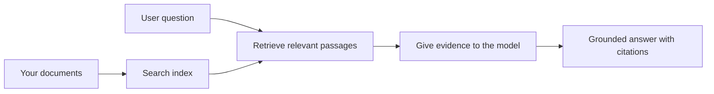

# Teach AI to Answer Questions Based on Your Documents:
## Series 1: RAG, Azure vs Open-Source Alternatives, and When Fine-Tuning Makes Sense

> The first article in a 2026 series revisiting my 2023 Azure AI Search + Azure OpenAI document QA tutorials.

Series navigation: [Repository home](../README.md) | Next: [Series 2 - Build a Local Open-Source RAG System End to End](./series-2-open-source-rag-end-to-end.md)

## 1. Intro - Revisiting an Earlier RAG Tutorial

In 2023, I worked on a pair of tutorials about teaching ChatGPT to answer questions from PDF documents using Azure AI Search and Azure OpenAI. I wrote the [LangChain version](https://techcommunity.microsoft.com/blog/educatordeveloperblog/teach-chatgpt-to-answer-questions-using-azure-ai-search--azure-openai-lang-chain/3969713), and I also co-authored the companion [Semantic Kernel version](https://techcommunity.microsoft.com/blog/educatordeveloperblog/teach-chatgpt-to-answer-questions-using-azure-ai-search--azure-openai-semantic-k/3985395) with [Lee Stott](https://developer.microsoft.com/en-us/advocates/lee-stott), a Principal Cloud Advocate Manager at Microsoft. At the time, the idea of "ChatGPT on your data" still felt new for many developers. The tutorials used Azure Blob Storage, Azure AI Search, Azure OpenAI, LangChain, Semantic Kernel, and FAISS-style vector retrieval to answer questions from PDF files.

That earlier article focused on a simple but important workflow: upload documents, index them, retrieve relevant content, and ask a model to answer based on that content.

In 2026, the RAG ecosystem has grown significantly. Azure AI Search now supports modern vector and hybrid retrieval patterns, Azure OpenAI is part of the broader Microsoft Foundry Models ecosystem, and the newer v1 API can use the standard OpenAI client without requiring monthly `api-version` changes. At the same time, open-source options such as LangGraph, LlamaIndex, Haystack, Qdrant, Milvus, Weaviate, Chroma, Ollama, and vLLM have become practical choices for real RAG systems.

That is why I wanted to revisit this topic. The question is no longer just "How do I build RAG?" There are now many ways to build it, and the more important question is "Which architecture should I choose for my situation?"

But the core problem has not changed.

An AI model does not automatically know your documents. To build a useful document-question-answering system, you still need reliable retrieval, grounding, evaluation, and operational workflows.

This article is not another end-to-end "chat with PDF" tutorial. I want to start this updated series with the question I now care about more: when should you choose a managed Azure architecture, when should you choose an open-source RAG stack, and when does fine-tuning actually make sense?

This is the first article in a series about building document-grounded AI systems. In this first part, we will focus on the architecture decisions: why RAG matters, when Azure-based managed services are useful, when open-source alternatives make sense, and where fine-tuning fits.

After building and revisiting document QA systems, I have become less interested in which tool looks best in a demo and more interested in which architecture survives real users, changing documents, permissions, failures, and maintenance.

## 2. Why Your AI Needs a Search System

Large language models are trained on broad public and licensed data. They may know a lot about general topics, but they do not automatically know your private PDFs, internal policies, enterprise procedures, research archives, classroom materials, customer support notes, or recently updated documentation.

A simple way to think about RAG is this: instead of expecting the model to remember every document, we give it a search system. When a user asks a question, the system first finds the most relevant pieces of information, then gives those pieces to the model as context.

This matters because many real-world knowledge sources are private, constantly changing, permission-sensitive, stored across multiple systems, written in many formats, and too large to paste directly into a prompt.

For example, if a school, company, or research team has 10,000 internal documents, the model cannot answer from those documents reliably unless the system retrieves the right parts at the right time.

This naturally leads to a common question:

Why not just fine-tune the model?

Fine-tuning can be useful, but it is usually not the right first tool for document knowledge. If the knowledge changes often, if citations matter, or if access permissions matter, RAG is usually the better starting point. Fine-tuning is better suited for teaching behavior, style, output format, and task patterns.

## 3. RAG Architecture in Practice

Imagine you are building an AI assistant for a school. The assistant needs to answer questions from policy PDFs, course guides, internal FAQ pages, and recently updated announcements.

If a student asks, "Can I use generative AI for my final assignment?", the system should not answer from the model's general memory. It should first find the relevant school policy, retrieve the section about AI usage, and then ask the model to answer using that evidence.

That is RAG in practice.

At a high level, you can think of the flow like this:

The details can become more sophisticated, but the basic idea is simple: the model does not answer alone. It answers with retrieved evidence.

First, documents are ingested from storage systems such as Azure Blob Storage, SharePoint, GitHub, or an internal CMS. Then the system parses them into text while preserving useful structure such as headings, page numbers, tables, sections, and source locations.

Next, the content is split into chunks. This step sounds simple, but it is one of the most important parts of the system. If a chunk is too small, it may lose the surrounding context. If a chunk is too large, it may include unrelated information and make retrieval less precise.

After chunking, the system creates embeddings and stores them in a searchable index together with the original text and metadata such as file name, page number, permissions, document version, and source URL.

When the user asks a question, the system retrieves candidate chunks using keyword search, vector search, or hybrid search. A reranker can then reorder those chunks so the most useful evidence is placed near the top.

Finally, the model receives the question and the retrieved evidence. The answer should be grounded in that evidence and return citations so the user can inspect the source.

The important point is that RAG is not only "put PDFs in a vector database." The quality of the answer depends on the whole workflow: parsing, chunking, retrieval, reranking, prompting, citation, and evaluation.

This is why document structure matters. In a PDF, a heading, table, footnote, or page boundary can change the meaning of a passage. On Azure, the Document Layout skill uses Azure Document Intelligence layout capabilities to produce structure-aware output, which can improve chunking and retrieval quality for RAG systems.

## 4. What Changed Since 2023?

The 2023 tutorial was a good starting point for its time:

- Azure Blob Storage stored PDF files.
- Azure AI Search indexed content.
- LangChain connected retrieval to Azure OpenAI.
- FAISS worked as a simple local vector store.
- The example used `gpt-35-turbo` and `text-embedding-ada-002`.

In 2026, a modern version should reflect several changes.

First, retrieval has matured. In 2023, many demos used simple vector similarity search. Today, hybrid retrieval is often the default starting point for serious document QA. Azure AI Search supports hybrid search by combining keyword and vector queries in a single request and merging results with Reciprocal Rank Fusion. Semantic ranker can then rerank the text side of full-text, vector, and hybrid results.

Second, ingestion is more sophisticated. Instead of manually splitting every document with application code, Azure AI Search supports integrated vectorization for chunking, embedding, and query-time vectorization. For PDFs and document-heavy workloads, the Document Layout skill can preserve more structure than fixed-size chunks.

Third, orchestration matters more. The hard part is often not the LLM API call itself. The hard part is handling failures, retries, stale retrieval, chunk quality, long-running workflows, human review, and evaluation at scale. This is where workflow-oriented tools such as LangGraph, LlamaIndex workflows, Haystack pipelines, and platform-level evaluation and observability tools become more relevant than a single linear chain.

Fourth, evaluation is no longer optional. A demo can look impressive with one question. A production system needs test sets, regression checks, retrieval metrics, groundedness checks, and monitoring. Without evaluation, it is hard to know whether the system is improving or just changing.

## 5. Choosing Between Azure and Open-Source RAG Stacks

I do not think the useful question is "Is Azure better than open source?" or "Is open source better than Azure?"

The useful question is: what kind of system are you building, who will operate it, what constraints do you have, and what failure modes are unacceptable?

When I started building document QA examples, I mostly thought about whether the retrieval worked. Could I upload PDFs, search them, and generate an answer? That was a reasonable starting point.

After working through more realistic AI workflows, my evaluation changed. I now look at four things before choosing a RAG stack:

- identity and permissions
- retrieval quality
- workflow reliability
- operational ownership

Those four areas tell you much more than a model benchmark alone.

Azure-based architectures usually make sense when enterprise integration is the hard part. If a team already depends on Microsoft Entra ID, Microsoft 365, Azure Storage, private networking, RBAC, and Azure monitoring, Azure AI Search and Azure OpenAI can reduce a lot of operational complexity. In that environment, Azure is not only a model API. The value is the surrounding system: identity, governance, managed search, security integration, support, and familiar operations.

Open-source architectures usually make sense when flexibility is the hard part. If the team needs local inference, cloud portability, a custom retrieval pipeline, specialized reranking, or direct control over the vector database and model-serving layer, an open-source stack can be the better fit. The tradeoff is that the team owns more of the reliability work: backups, scaling, latency, migrations, monitoring, and security.

In practice, many production AI systems are not purely cloud-native or purely open-source. They are often hybrid systems that balance operational simplicity, portability, governance, and engineering flexibility.

For example, I would not be surprised to see a system use Azure OpenAI for model access, LangGraph for workflow orchestration, Azure hosting for deployment, and an open-source vector database for a specific retrieval requirement. That is not architectural inconsistency. That is choosing the right level of managed service and engineering control for each part of the system.

I like hybrid architectures when the managed platform solves important enterprise problems, while open-source components give the team flexibility where it actually matters.

## 6. A Practical Decision Guide

Here is the decision table I would use with a team before choosing a RAG stack:

| Decision area | Azure managed stack is stronger when... | Open-source stack is stronger when... |
| --- | --- | --- |
| Identity and access | Entra ID, RBAC, managed identity, and enterprise permissions are central | custom auth, non-Microsoft identity, or app-specific access logic dominates |
| Operations | the team wants managed infrastructure, support, SLAs, and simpler onboarding | the team can operate vector databases, model serving, backups, and scaling |
| Retrieval | hybrid search, semantic ranking, filters, and metadata search cover most needs | the team needs custom retrieval, specialized reranking, or experimental indexing |
| Portability | Azure ecosystem alignment is acceptable or preferred | avoiding cloud lock-in is a hard requirement |
| Inference | Azure OpenAI governance, networking, and enterprise controls matter | local inference, custom models, or self-hosted serving are required |
| Cost | reducing engineering and operations effort matters more than infrastructure tuning | scale is large enough to justify careful infrastructure optimization |
| Experimentation | stability and enterprise integration matter more than changing components often | the team is iterating quickly on agents, tools, memory, and retrieval workflows |

My rule of thumb is simple:

- Start with Azure when enterprise integration, security, and operational simplicity are the main risks.
- Start with open source when portability, customization, or local control are the main risks.
- Use a hybrid stack when both are true.

This is also why I would not start a 2026 RAG series with code first. Code is important, but architecture selection comes before implementation. A simple demo can hide the hardest choices. A good RAG system makes those choices explicit.

## 7. Where Fine-Tuning Fits

Fine-tuning is often mentioned together with RAG, but I think it is important to separate the two.

RAG is usually the better choice when the system needs fresh, private, permission-sensitive, or source-grounded knowledge. If the answer should cite documents, reflect recent updates, or respect user-specific access rules, retrieval should be part of the architecture.

Fine-tuning is more useful when knowledge is not the main problem. It can help when you want the model to follow a specific output format, match a domain-specific response style, perform a stable task more consistently, or reduce the amount of instruction needed in every prompt.

In practice, the two can work together. A support assistant might use RAG to retrieve the latest policy, while a fine-tuned model learns the company's preferred answer structure and tone.

The mistake is treating fine-tuning as a replacement for a document store. It does not remove the need for retrieval when the system must answer from fresh, private, or permission-sensitive data.

## 8. Where This Series Goes Next

This article is the decision-making layer. Before writing code, I wanted to make the tradeoffs explicit: RAG vs fine-tuning, Azure vs open source, managed services vs operational control.

Before moving into implementation, I want to leave one point here: in many enterprise AI systems, the model is only one component. Retrieval quality, orchestration, evaluation, permissions, and operational reliability are often what determine whether the system succeeds beyond the demo stage.

In the next parts of this series, I plan to go deeper into the practical side of document-grounded AI systems: first building a local open-source RAG workflow, then rebuilding the same scenario with Azure AI Search and Azure OpenAI, and then evaluating whether the system is actually working.

I may adjust the order as the series develops, but the goal will stay the same: to move beyond a simple demo and show how to think about RAG systems that can be maintained, evaluated, and operated.

## 9. References and Resources

Original tutorials:

- [Teach ChatGPT to Answer Questions: Using Azure AI Search & Azure OpenAI (Lang Chain)](https://techcommunity.microsoft.com/blog/educatordeveloperblog/teach-chatgpt-to-answer-questions-using-azure-ai-search--azure-openai-lang-chain/3969713)
- [Teach ChatGPT to Answer Questions: Using Azure AI Search & Azure OpenAI (Semantic Kernel)](https://techcommunity.microsoft.com/blog/educatordeveloperblog/teach-chatgpt-to-answer-questions-using-azure-ai-search--azure-openai-semantic-k/3985395)

Azure:

- [Azure AI Search REST API versions](https://learn.microsoft.com/en-us/rest/api/searchservice/search-service-api-versions)
- [Hybrid search in Azure AI Search](https://learn.microsoft.com/en-us/azure/search/hybrid-search-how-to-query)
- [Integrated vectorization in Azure AI Search](https://learn.microsoft.com/en-us/azure/search/vector-search-integrated-vectorization)
- [Document Layout skill in Azure AI Search](https://learn.microsoft.com/en-us/azure/search/cognitive-search-skill-document-intelligence-layout)
- [Chunk and vectorize by document layout](https://learn.microsoft.com/en-us/azure/search/search-how-to-semantic-chunking)
- [Semantic ranking in Azure AI Search](https://learn.microsoft.com/en-us/azure/search/semantic-search-overview)
- [Azure OpenAI / Microsoft Foundry API version lifecycle](https://learn.microsoft.com/en-us/azure/foundry/openai/api-version-lifecycle)
- [Foundry Models sold by Azure](https://learn.microsoft.com/en-us/azure/foundry/foundry-models/concepts/models-sold-directly-by-azure)
- [Microsoft Foundry fine-tuning considerations](https://learn.microsoft.com/en-us/azure/foundry/openai/concepts/fine-tuning-considerations)
- [Microsoft Foundry observability](https://learn.microsoft.com/en-us/azure/foundry/concepts/observability)
- [Run evaluations in Microsoft Foundry](https://learn.microsoft.com/en-us/azure/foundry/how-to/evaluate-generative-ai-app)

Open-source:

- [LangGraph documentation](https://docs.langchain.com/oss/python/langgraph/overview)
- [LlamaIndex documentation](https://developers.llamaindex.ai/python/framework/)
- [Haystack documentation](https://docs.haystack.deepset.ai/)
- [Qdrant documentation](https://qdrant.tech/documentation/overview/)
- [Milvus documentation](https://milvus.io/docs/overview.md)
- [Weaviate documentation](https://docs.weaviate.io/weaviate/current/)
- [Chroma documentation](https://docs.trychroma.com/docs/overview/introduction)
- [Ollama embeddings](https://docs.ollama.com/capabilities/embeddings)
- [vLLM OpenAI-compatible server](https://docs.vllm.ai/en/latest/serving/openai_compatible_server.html)
- [BGE embedding models](https://huggingface.co/BAAI/bge-large-en-v1.5)
- [E5 embedding models](https://huggingface.co/intfloat/e5-large-v2)
- [Instructor embedding models](https://huggingface.co/hkunlp/instructor-large)

Next: [Series 2 - Build a Local Open-Source RAG System End to End](./series-2-open-source-rag-end-to-end.md)
