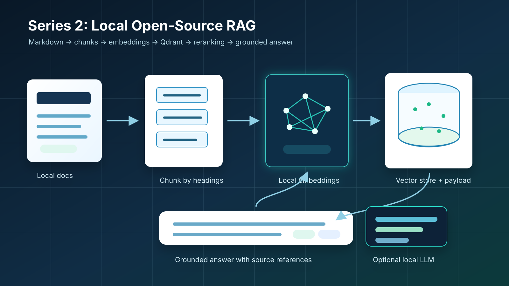

# Teach AI to Answer Questions Based on Your Documents
## Series 2: Build a Local Open-Source RAG System End to End



> This article turns the Series 1 architecture discussion into a runnable local RAG tutorial. The goal is to build the full workflow first with sample data, no cloud account, and no secrets, then use that working baseline to make better architecture decisions later.

The system we will build is a small school policy assistant. I use two local Markdown documents as the knowledge base, then walk through the full RAG pipeline: chunking, local embeddings, Qdrant vector storage, retrieval, reranking, source-aware answer composition, and optional local generation with Ollama and Phi-4-mini.

Series navigation: [Repository home](../README.md) | Previous: [Series 1 - RAG, Azure vs Open-Source Alternatives, and When Fine-Tuning Makes Sense](./series-1-rag-azure-open-source-fine-tuning.md)

Notebook: [series-2-open-source-rag.ipynb](../notebooks/series-2-open-source-rag.ipynb) | Requirements: [open-source-rag.txt](../requirements/open-source-rag.txt)

> [!TIP]
> This is the best starting point if you want to understand the RAG pipeline before creating cloud resources. The default path runs locally with CPU-friendly embeddings and no secrets.

## 1. What We Are Building

In the 2023 tutorial, I started from Azure because the goal was to show how Azure AI Search and Azure OpenAI could answer questions from PDF documents.

For this 2026 series, I want to start one layer lower.

Before using managed services, I want to build a small RAG system locally and make every step visible: loading documents, chunking text, storing vectors, retrieving evidence, reranking results, and returning a source-aware answer.

The sample scenario is a school policy assistant. The user asks:

```text
Can I use generative AI for my final assignment?
```

The system should not answer from general model memory. It should retrieve the relevant policy section and answer from that evidence.

The full runnable version is in [series-2-open-source-rag.ipynb](../notebooks/series-2-open-source-rag.ipynb). The code below shows the main steps so the article can be read as a tutorial.

## 2. Install the Local Dependencies

Create a virtual environment and install the Series 2 requirements:

```powershell
python -m venv .venv-series2
.\.venv-series2\Scripts\activate
python -m pip install -r requirements\open-source-rag.txt
```

The first version uses Qdrant local mode and FastEmbed. Qdrant's Python client supports an in-memory local mode with `QdrantClient(":memory:")`, which is useful for local tutorials and CI-style verification. FastEmbed gives us a real local embedding model without requiring a cloud API key.

The requirements file also includes `python-dotenv` because the notebook can optionally read an Ollama model name from `.env`. No Azure OpenAI or OpenAI API key is required for this local tutorial.

## 3. Load the Sample Documents

The sample corpus is intentionally small:

- [school_ai_policy.md](../sample_data/school_ai_policy.md)
- [course_ai_guidance.md](../sample_data/course_ai_guidance.md)

In the notebook, I load all Markdown files from `sample_data/`:

```python
from pathlib import Path

repo_root = Path.cwd()
if not (repo_root / "sample_data").exists():
    repo_root = Path.cwd().parent

sample_dir = repo_root / "sample_data"
sample_files = ["course_ai_guidance.md", "school_ai_policy.md"]
documents = []

for file_name in sample_files:
    path = sample_dir / file_name
    documents.append({
        "source": path.name,
        "text": path.read_text(encoding="utf-8"),
    })

print(f"Loaded {len(documents)} documents")
```

When I ran the notebook, it loaded 2 documents. That is small enough to inspect manually, which is useful when building the first version of a RAG pipeline.

## 4. Chunk by Markdown Headings

The next step is to split documents into chunks.

For this tutorial, I use Markdown headings as the structure signal. The document title comes from `#`, and each section chunk comes from `##`.

> [!NOTE]
> Chunking is not one-size-fits-all. In this tutorial, I use Markdown headings because the sample documents have clear `#` and `##` structure. For PDFs, Word documents, slides, tickets, or web pages, a better strategy may use page boundaries, layout information, semantic sections, token limits, tables, or metadata. The important point is to choose a chunking strategy that preserves meaning and source traceability for your documents.

```python
def chunk_markdown(document):
    title = None
    current_heading = None
    current_lines = []
    chunks = []

    def flush():
        if current_heading and current_lines:
            content = "\n".join(current_lines).strip()
            if content:
                chunks.append({
                    "id": f"{document['source']}::{len(chunks)}",
                    "source": document["source"],
                    "title": title or document["source"],
                    "sectionHeading": current_heading,
                    "content": content,
                    "documentVersion": "local-sample-v1",
                    "permissions": ["students", "instructors"],
                })

    for raw_line in document["text"].splitlines():
        line = raw_line.strip()
        if line.startswith("# "):
            title = line[2:].strip()
        elif line.startswith("## "):
            flush()
            current_heading = line[3:].strip()
            current_lines = []
        elif line:
            current_lines.append(line)

    flush()
    return chunks
```

Then I apply it to every document:

```python
chunks = []
for document in documents:
    chunks.extend(chunk_markdown(document))

print(f"Created {len(chunks)} chunks")
```

This created 8 chunks in my local run.

What I liked about this step is that the metadata is already useful. Each chunk knows its `source`, `sectionHeading`, `documentVersion`, and placeholder `permissions`. Even in a small tutorial, this makes citations and later permission-aware retrieval easier to reason about.

## 5. Create Local Embeddings

For the first public version, I use `BAAI/bge-small-en-v1.5` through FastEmbed.

This keeps the tutorial local and CPU-friendly, but it still uses a real embedding model instead of a placeholder vector function. The first run downloads the model weights. After that, the notebook can reuse the local cache.

> [!NOTE]
> I use `BAAI/bge-small-en-v1.5` because it is a lightweight English embedding model that works well with FastEmbed and Qdrant for a local tutorial. It creates 384-dimensional vectors, which keeps the example fast and inexpensive to run locally. This is not the only good choice. In 2023, many tutorials used hosted embedding models such as `text-embedding-ada-002`. Today, newer hosted options such as OpenAI `text-embedding-3-small` and `text-embedding-3-large`, and open-source options such as BGE, E5, MiniLM, Nomic Embed, and multilingual models like `BAAI/bge-m3` are all reasonable choices depending on the workload. In production, the right embedding model should be selected through retrieval evaluation on your own documents.

Some practical alternatives:

| Model family | When I would consider it |
| --- | --- |
| `text-embedding-ada-002` | Older hosted baseline that appeared in many 2023-era tutorials. I would not choose it as the default for a new tutorial today. |
| `text-embedding-3-small` | Modern hosted default when I want a strong cost/performance balance and do not need local-only embeddings. |
| `text-embedding-3-large` | Hosted option when retrieval quality matters more than vector size or embedding cost. |
| `BAAI/bge-small-en-v1.5` | Lightweight local English baseline for tutorials, prototypes, and CPU-friendly experiments. |
| `BAAI/bge-base-en-v1.5` or `BAAI/bge-large-en-v1.5` | Larger local English models when I want better retrieval quality and can afford more compute. |
| `BAAI/bge-m3` | Multilingual or longer-context retrieval, especially when documents are not only English. |
| `sentence-transformers/all-MiniLM-L6-v2` | Very small and fast semantic search baseline. Useful when speed and simplicity matter most. |
| `nomic-embed-text-v1.5` | Open local embedding option worth testing for longer-context or portability-focused setups. |

```python
import re
from fastembed import TextEmbedding

EMBEDDING_MODEL_NAME = "BAAI/bge-small-en-v1.5"
embedding_model = TextEmbedding(model_name=EMBEDDING_MODEL_NAME)

def tokenize(text):
    tokens = re.findall(r"[a-z0-9]+", text.lower())
    expanded = []
    for token in tokens:
        expanded.append(token)
        if token.endswith("s") and len(token) > 3:
            expanded.append(token[:-1])
    return expanded
```

Then each chunk gets an embedding:

```python
texts_to_embed = [
    f"{chunk['title']} {chunk['sectionHeading']} {chunk['content']}"
    for chunk in chunks
]
chunk_vectors = list(embedding_model.embed(texts_to_embed))
VECTOR_SIZE = len(chunk_vectors[0])

for chunk, vector in zip(chunks, chunk_vectors):
    chunk["vector"] = vector
```

## 6. Store Vectors in Qdrant Local Mode

Now we create an in-memory Qdrant collection and insert the chunks with payload metadata.

> [!NOTE]
> In the 2023 tutorial, I used FAISS because it was a simple and popular way to demonstrate local vector similarity search with LangChain. FAISS is still useful for fast local experiments. In this 2026 version, I use Qdrant because I want the tutorial to feel closer to a production RAG system. Qdrant lets me store vectors together with payload metadata such as source file, section heading, document version, and permissions. That makes retrieval easier to inspect and prepares the example for filtering, citations, and future persistent or server-based deployment.

FAISS is great for showing vector similarity search. Qdrant is better for showing a small but production-shaped RAG retrieval layer.

Some practical alternatives:

| Vector store / search layer | When I would consider it |
| --- | --- |
| Qdrant | Local prototypes, metadata filtering, production-friendly vector search, and a simple Python workflow. |
| Chroma | Quick local RAG experiments and notebooks where simplicity matters most. |
| FAISS | Lightweight local vector search when I only need similarity search and can manage metadata separately. |
| Milvus | Larger-scale open-source vector search when the team is ready to operate a dedicated vector database. |
| Weaviate | Vector search with schema, metadata, hybrid search, and managed or self-hosted deployment options. |
| Azure AI Search | Enterprise RAG on Azure when I want keyword search, vector search, hybrid retrieval, semantic ranking, filtering, security, and managed operations in one search layer. |
| PostgreSQL + pgvector | Teams already using PostgreSQL who want vector search close to application data. |

```python
from qdrant_client import QdrantClient, models

collection_name = "school_policy_local"
client = QdrantClient(":memory:")

client.create_collection(
    collection_name=collection_name,
    vectors_config=models.VectorParams(
        size=VECTOR_SIZE,
        distance=models.Distance.COSINE,
    ),
)
```

Then insert the points:

```python
points = []

for idx, chunk in enumerate(chunks):
    payload = {
        key: chunk[key]
        for key in [
            "source",
            "title",
            "sectionHeading",
            "content",
            "documentVersion",
            "permissions",
        ]
    }
    points.append(
        models.PointStruct(
            id=idx,
            vector=chunk["vector"].tolist(),
            payload=payload,
        )
    )

client.upsert(collection_name=collection_name, points=points)
```

In my run, the collection inserted 8 vectors.

This is where the RAG system starts to become inspectable. The vector database is not only storing vectors; it is storing the evidence text and the metadata needed for citations.

## 7. Retrieve Candidate Chunks

Now we ask the question and retrieve candidate chunks.

```python
question = "Can I use generative AI for my final assignment?"
query_vector = list(embedding_model.embed([question]))[0].tolist()

raw_results = client.query_points(
    collection_name=collection_name,
    query=query_vector,
    limit=5,
    with_payload=True,
).points
```

At this point, I print the retrieved chunks before generating an answer. This is important. If retrieval is wrong, generation will only hide the problem behind fluent text.

## 8. Add a Lightweight Reranker

When I first tested the retrieval path, vector similarity alone found related policy content, but the most precise section was not always at the top.

So I added a small local reranker. It gives extra weight when the question terms overlap with the section heading and content.

```python
query_terms = set(tokenize(question))

def rerank_score(result):
    payload = result.payload
    heading_terms = set(tokenize(payload["sectionHeading"]))
    content_terms = set(tokenize(payload["content"]))
    heading_overlap = len(query_terms & heading_terms)
    content_overlap = len(query_terms & content_terms)
    return result.score + (0.12 * heading_overlap) + (0.02 * content_overlap)

results = sorted(raw_results, key=rerank_score, reverse=True)[:3]
```

After reranking, the top result became:

```text
school_ai_policy.md / Final Assignments
```

That was the expected section for the test question.

This was the most useful lesson from the first implementation. Even in a tiny local example, retrieval quality improved when I combined vector similarity with another signal.

## 9. Compose a Grounded Local Answer

For the default path, I use a transparent local answer composer instead of an LLM.

```python
top = results[0].payload

answer = (
    "Based on the retrieved policy section, students may use generative AI for "
    "brainstorming, outlining, grammar feedback, and code explanation when the "
    "instructor allows it. They should not submit AI-generated work as their own, "
    "and they should include a disclosure when AI tools are used."
)

print("Answer:")
print(answer)
print("\nSource:")
print(f"{top['source']} / {top['sectionHeading']}")
```

This is not meant to be a final product answer generator. It is a debugging tool. It proves that retrieval, metadata, and citation wiring work before adding model variability.

## 10. Generate a Local Answer with Ollama and Phi-4-mini

Once retrieval is working, the notebook can replace only the final answer step with Ollama and `phi4-mini:3.8b`.

> [!NOTE]
> Ollama should replace only the final answer-generation step. Document loading, chunking, vector storage, retrieval, reranking, and citation wiring should stay the same.

First, the notebook builds an evidence prompt from the retrieved chunks:

```python
def build_evidence(retrieved_results):
    evidence_blocks = []
    for idx, result in enumerate(retrieved_results, start=1):
        payload = result.payload
        evidence_blocks.append(
            f"[{idx}] Source: {payload['source']} / {payload['sectionHeading']}\n"
            f"{payload['content']}"
        )
    return "\n\n".join(evidence_blocks)

evidence = build_evidence(results)
answer_prompt = (
    "Answer the question using only the evidence below. "
    "If the evidence is insufficient, say that the provided documents do not contain enough information. "
    "End with a Sources line that lists the source file and section.\n\n"
    f"Question: {question}\n\nEvidence:\n{evidence}"
)
```

For this tutorial, I recommend Microsoft's Phi-4-mini family through Ollama as the default local generation option. In Ollama, the model name I tested is:

```powershell
ollama pull phi4-mini:3.8b
```

You can quickly check that the model is available:

```powershell
ollama list
```

Then set these variables:

```powershell
Copy-Item .env.example .env
```

Open `.env` and uncomment the Series 2 Ollama values:

```text
SERIES2_OLLAMA_BASE_URL=http://localhost:11434
SERIES2_OLLAMA_MODEL=phi4-mini:3.8b
```

The notebook loads `.env` from the repository root with `python-dotenv`, then sends the same evidence prompt to Ollama's local `/api/chat` endpoint with streaming disabled. If Ollama is not running or `SERIES2_OLLAMA_MODEL` is missing, this track is skipped.

> [!NOTE]
> On this machine, `phi4-mini:3.8b` downloaded about 2.49GB of model files. During inference, Ollama reported a 3.3GB loaded model size and used the RTX 3060 Laptop GPU.

This gives the tutorial two levels:

1. CPU-only deterministic answer composer.
2. Local answer generation with Ollama and Phi-4-mini.

The retrieval pipeline stays the same in both.

## 11. Verification Result

I ran the notebook locally on Windows with Python 3.12.6.

Installed packages:

| Package | Version |
| --- | --- |
| `qdrant-client` | `1.18.0` |
| `fastembed` | `0.8.0` |
| `python-dotenv` | `1.2.2` |
| `nbclient` | `0.10.4` |
| `nbformat` | `5.10.4` |
| `ipykernel` | `7.2.0` |
| `numpy` | `2.4.6` |

Notebook execution:

- Notebook: `notebooks/series-2-open-source-rag.ipynb`
- Execution result: passed with `nbclient`
- Documents loaded: 2
- Chunks created: 8
- Qdrant collection: `school_policy_local`
- Vectors inserted: 8
- Embedding model: `BAAI/bge-small-en-v1.5`
- Embedding size: 384
- Retrieval question: "Can I use generative AI for my final assignment?"
- Reranking path: lightweight local lexical reranking
- Top retrieved source after reranking: `school_ai_policy.md`
- Top retrieved section after reranking: `Final Assignments`
- Default answer path: local transparent answer composer
- Ollama generation path: completed with `phi4-mini:3.8b`
- Ollama model file size: 2.49GB on disk
- Ollama loaded model size: 3.3GB reported by `ollama ps`
- GPU offload: 100% GPU reported by `ollama ps`
- GPU memory observed after generation: about 3.5GB of 6GB used on RTX 3060 Laptop GPU
- Notebook execution with cached FastEmbed model and Ollama generation enabled: passed in about 34 seconds through the verification script

The Ollama-generated answer was:

```text
Based on the provided documents [1], you can indeed utilize generative AI tools as part of your final assignment if explicitly permitted by an instructor in a specified guide (such as brainstorming assistance), but it must not be submitted as entirely generated work without proper disclosure regarding its usage.

For comparison, reviewing drafts for readability improvement or practicing explanation techniques may also fall under the allowed uses [2].

Additionally, generative AI can assist with summarizing background materials and generating search keywords in research projects. However, you are responsible to verify sources manually while citing original references as noted in document 3 ([school_ai_policy.md / Research Projects]).

SOURCES: school_ai_policy.md; course_ai_guidance.md; [specific sections mentioned for each relevant guideline].
```

I would not call this answer perfect. It answers from the right evidence, but the final source line is less precise than the deterministic citation format. That is useful to show in the tutorial because it makes the next engineering question obvious: answer generation needs evaluation too, not just retrieval.

The main thing I learned while verifying this is that retrieval quality should be checked before answer generation. The embedding result was already useful, and the lightweight reranker made the expected policy section reliably appear first. That is exactly the kind of small system behavior I want the tutorial to expose instead of hiding.

## 12. What Comes Next

The next improvement is to compare this local setup with a managed Azure version of the same school policy assistant scenario. Keeping the scenario fixed should make the tradeoffs easier to see: setup complexity, retrieval controls, identity integration, operational ownership, and cost.

## 13. References

- [Qdrant Python client quickstart](https://python-client.qdrant.tech/quickstart.html)
- [Qdrant client GitHub repository](https://github.com/qdrant/qdrant-client)
- [FastEmbed supported models](https://qdrant.github.io/fastembed/examples/Supported_Models/)
- [OpenAI embeddings guide](https://platform.openai.com/docs/guides/embeddings)
- [BAAI/bge-small-en-v1.5 model card](https://huggingface.co/BAAI/bge-small-en-v1.5)
- [BAAI/bge-m3 model card](https://huggingface.co/BAAI/bge-m3)
- [sentence-transformers/all-MiniLM-L6-v2 model card](https://huggingface.co/sentence-transformers/all-MiniLM-L6-v2)
- [Ollama phi4-mini model page](https://ollama.com/library/phi4-mini)
- [Ollama Windows documentation](https://docs.ollama.com/windows)
- [Ollama API streaming documentation](https://docs.ollama.com/api/streaming)
- [Microsoft Phi-4-mini-instruct model card](https://huggingface.co/microsoft/Phi-4-mini-instruct)
- [LangGraph overview](https://docs.langchain.com/oss/python/langgraph)
- [Introduction to RAG - LlamaIndex](https://docs.llamaindex.ai/en/stable/understanding/rag/)

Previous: [Series 1](./series-1-rag-azure-open-source-fine-tuning.md)
