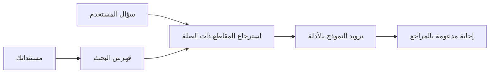

# علّم الذكاء الاصطناعي الإجابة على الأسئلة بناءً على مستنداتك:
## السلسلة 1: RAG، أزور مقابل البدائل مفتوحة المصدر، ومتى يكون التخصيص المناسب منطقيًا

> المقالة الأولى في سلسلة 2026 التي تعيد زيارة دروس الأسئلة والأجوبة المستندة إلى مستندات Azure AI Search + Azure OpenAI الخاصة بي في عام 2023.

تصفح السلسلة: [الصفحة الرئيسية للمستودع](../README.md) | التالي: [السلسلة 2 - بناء نظام RAG مفتوح المصدر محليًا من البداية للنهاية](./series-2-open-source-rag-end-to-end.md)

## 1. مقدمة - إعادة زيارة درس RAG سابق

في عام 2023، عملت على درسين تعليميين حول تعليم ChatGPT الإجابة على الأسئلة من مستندات PDF باستخدام Azure AI Search وAzure OpenAI. كتبت نسخة [LangChain](https://techcommunity.microsoft.com/blog/educatordeveloperblog/teach-chatgpt-to-answer-questions-using-azure-ai-search--azure-openai-lang-chain/3969713)، كما شاركت في تأليف نسخة [Semantic Kernel](https://techcommunity.microsoft.com/blog/educatordeveloperblog/teach-chatgpt-to-answer-questions-using-azure-ai-search--azure-openai-semantic-k/3985395) مع [لي ستوت](https://developer.microsoft.com/en-us/advocates/lee-stott)، وهو مدير كبير دعامات السحابة في مايكروسوفت. في ذلك الوقت، كان مفهوم "ChatGPT على بياناتك" لا يزال جديدًا لكثير من المطورين. استخدمت الدروس Azure Blob Storage، وAzure AI Search، وAzure OpenAI، وLangChain، وSemantic Kernel، واسترجاع الفكتورات على طريقة FAISS للإجابة على الأسئلة من ملفات PDF.

ركز المقال السابق على سير عمل بسيط لكنه مهم: رفع المستندات، فهرستها، استرجاع المحتوى ذات الصلة، وطلب نموذج للإجابة بناءً على ذلك المحتوى.

في عام 2026، نما نظام RAG بشكل كبير. يدعم Azure AI Search الآن أنماط الاسترجاع المتجهة والهجينة الحديثة، وAzure OpenAI جزء من نظام Microsoft Foundry Models الأوسع، ويمكن لواجهة برمجة التطبيقات الأحدث v1 استخدام العميل القياسي لـ OpenAI دون الحاجة لتغييرات شهرية في `api-version`. في الوقت نفسه، أصبحت الخيارات مفتوحة المصدر مثل LangGraph وLlamaIndex وHaystack وQdrant وMilvus وWeaviate وChroma وOllama وvLLM خيارات عملية لأنظمة RAG حقيقية.

لهذا السبب أردت إعادة زيارة هذا الموضوع. السؤال لم يعد فقط "كيف أبني نظام RAG؟" بل هناك طرق كثيرة للتطبيق، والسؤال الأهم الآن هو "أي بنية يجب أن أختارها لحالتي؟"

لكن المشكلة الجوهرية لم تتغير.

لا يعرف نموذج الذكاء الاصطناعي تلقائيًا مستنداتك. لبناء نظام مفيد للأسئلة والأجوبة المستندة إلى مستندات، لا يزال من الضروري وجود استرجاع موثوق، وترسيخ المعلومات، وتقييم، وسير عمل تشغيلي.

هذه المقالة ليست درسًا آخر من البداية للنهاية لـ "دردشة مع PDF". أريد بدء هذه السلسلة المحدّثة بالسؤال الذي أصبح يهمني أكثر: متى يجب اختيار بنية Azure المدارة، ومتى يجب اختيار رزمة RAG مفتوحة المصدر، ومتى يكون التخصيص المناسب فعلاً منطقيًا؟

هذه هي المقالة الأولى في سلسلة حول بناء أنظمة الذكاء الاصطناعي المبنية على المستندات. في الجزء الأول هذا، سنركز على قرارات البنية: لماذا تهم RAG، متى تكون خدمات Azure المدارّة مفيدة، متى تكون البدائل مفتوحة المصدر منطقية، وأين يقع التخصيص المناسب.

بعد بناء وإعادة زيارة أنظمة الأسئلة والأجوبة المستندة إلى المستندات، أصبحت أقل اهتمامًا بالأداة التي تبدو الأفضل في العرض التوضيحي وأكثر اهتمامًا بالبنية التي تصمد أمام المستخدمين الحقيقيين، وتغيّر المستندات، والأذونات، والأعطال، والصيانة.

## 2. لماذا يحتاج ذكاؤك الاصطناعي إلى نظام بحث

تم تدريب نماذج اللغة الكبيرة على بيانات عامة ورخصت على نطاق واسع. لقد قد تعرف الكثير عن المواضيع العامة، لكنها لا تعرف تلقائيًا ملفات PDF الخاصة بك، أو السياسات الداخلية، أو إجراءات المؤسسات، أو أرشيفات البحث، أو مواد الصفوف الدراسية، أو ملاحظات دعم العملاء، أو التوثيق المحدث حديثًا.

طريقة بسيطة للتفكير في RAG هي: بدلاً من توقع أن يتذكر النموذج كل مستند، نعطيه نظام بحث. عندما يطرح المستخدم سؤالًا، يجد النظام أولاً أكثر القطع المعلوماتية صلة، ثم يعطي تلك القطع للنموذج كوسيط.

هذا مهم لأن العديد من مصادر المعرفة الحقيقية خاصة، وتتغير باستمرار، وحساسة للأذونات، ومخزنة عبر أنظمة متعددة، ومكتوبة بصيغ عدة، وكبيرة جدًا بحيث لا يمكن لصقها مباشرة في المُحث.

على سبيل المثال، إذا كانت لدى مدرسة، أو شركة، أو فريق بحث 10,000 مستند داخلي، لا يمكن للنموذج الإجابة من تلك المستندات بشكل موثوق ما لم يسترجع النظام الأجزاء الصحيحة في الوقت الصحيح.

هذا يقود بشكل طبيعي إلى سؤال شائع:

لماذا لا نخصص النموذج فقط؟

التخصيص المناسب يمكن أن يكون مفيدًا، لكنه عادة ليس الأداة المثلى الأولى لمعرفة المستندات. إذا كانت المعرفة تتغير كثيرًا، وإذا كانت الاقتباسات مهمة، أو إذ كانت أذونات الوصول مهمة، فإن RAG هو عادة نقطة الانطلاق الأفضل. التخصيص المناسب أفضل لتعليم السلوك، والأسلوب، وتنسيق المخرجات، وأنماط المهام.

## 3. بنية RAG في التطبيق

تخيل أنك تبني مساعد ذكاء اصطناعي لمدرسة. يحتاج المساعد إلى الإجابة على الأسئلة من ملفات PDF للسياسات، وأدلة الدورات، وصفحات الأسئلة المتكررة الداخلية، والإعلانات المحدّثة مؤخرًا.

إذا سأل طالب: "هل يمكنني استخدام الذكاء الاصطناعي التوليدي لمهمتي النهائية؟"، لا يجب أن يجيب النظام من ذاكرة النموذج العامة. يجب أن يجد أولاً سياسة المدرسة ذات الصلة، يسترجع القسم الخاص باستخدام الذكاء الاصطناعي، ثم يطلب من النموذج الإجابة باستخدام ذلك الدليل.

هذا هو RAG في الواقع.

على مستوى عالٍ، يمكنك التفكير في تدفق العمل على النحو التالي:

يمكن أن تصبح التفاصيل أكثر تعقيدًا، لكن الفكرة الأساسية بسيطة: النموذج لا يجيب بمفرده. يجيب مع دليل مسترجع.

أولًا، يتم استيراد المستندات من أنظمة التخزين مثل Azure Blob Storage، وSharePoint، وGitHub، أو نظام إدارة محتوى داخلي. ثم يقوم النظام بتحليلها إلى نص مع الحفاظ على البنية المفيدة مثل العناوين، وأرقام الصفحات، والجداول، والأقسام، ومواقع المصدر.

بعدها، يُقسم المحتوى إلى أجزاء. تبدو هذه الخطوة بسيطة، لكنها من أهم أجزاء النظام. إذا كان الجزء صغيرًا جدًا، فقد يفقد السياق المحيط. وإذا كان كبيرًا جدًا، فقد يتضمن معلومات غير ذات صلة ويقلل من دقة الاسترجاع.

بعد التقسيم، ينشئ النظام التمثيلات المضمنة (embeddings) ويخزنها في فهرس قابل للبحث مع النص الأصلي وبيانات وصفية مثل اسم الملف، رقم الصفحة، الأذونات، إصدار المستند، وعنوان URL المصدر.

عندما يطرح المستخدم سؤالًا، يسترجع النظام أجزاء المرشحين باستخدام البحث عن الكلمات الرئيسية، أو البحث المتجه، أو البحث الهجين. يمكن للمعيد ترتيب (reranker) بعد ذلك إعادة ترتيب تلك الأجزاء بحيث توضع الأدلة الأكثر فائدة في الأعلى.

أخيرًا، يتلقى النموذج السؤال والأدلة المسترجعة. يجب أن تكون الإجابة مرتكزة على تلك الأدلة وأن تُرجع الاقتباسات ليتمكن المستخدم من فحص المصدر.

النقطة المهمة هي أن RAG ليست مجرد "وضع ملفات PDF في قاعدة بيانات متجهة". جودة الإجابة تعتمد على سير العمل الكامل: التحليل، والتقسيم، والاسترجاع، وإعادة الترتيب، والتحفيز، والاقتباس، والتقييم.

لهذا السبب تهم بنية المستند. في ملف PDF، يمكن لعنوان، أو جدول، أو حاشية سفلية، أو حد صفحة أن يغير معنى قطعة نصية. على Azure، تستخدم مهارة تخطيط المستند إمكانيات التخطيط في Azure Document Intelligence لإنتاج إخراج واعٍ بالبنية، مما يمكن أن يحسّن جودة التقسيم والاسترجاع لأنظمة RAG.

## 4. ما الذي تغير منذ 2023؟

كان الدرس في 2023 نقطة انطلاق جيدة في وقته:

- خزن Azure Blob Storage ملفات PDF.
- فهرس Azure AI Search المحتوى.
- ربط LangChain الاسترجاع بـ Azure OpenAI.
- عملت FAISS كقاعدة بيانات متجهة محلية بسيطة.
- المثال استخدم `gpt-35-turbo` و`text-embedding-ada-002`.

في 2026، يجب أن تعكس نسخة حديثة عدة تغييرات.

أولًا، تطور الاسترجاع. في 2023، استخدمت العديد من العروض التوضيحية بحث التشابه المتجه البسيط. اليوم، غالبًا ما يكون البحث الهجين نقطة البداية الافتراضية للأسئلة والأجوبة الجدية على المستندات. يدعم Azure AI Search البحث الهجين بدمج استعلامات الكلمات الرئيسية والمتجهة في طلب واحد ودمج النتائج باستخدام دمج ترتيب تناسبي Reciprocal Rank Fusion. يمكن للمصنف الدلالي (Semantic ranker) إعادة ترتيب جانب النص من نتائج النص الكامل، والمتجه، والهجين.

ثانيًا، أصبح الاستيراد أكثر تعقيدًا. بدلًا من تقسيم كل مستند يدويًا بالرمز التطبيقي، يدعم Azure AI Search التمثيل المتجه المدمج للتقسيم، والتمثيل، والتمثيل أثناء الاستعلام. بالنسبة لملفات PDF وحمولات العمل الثقيلة على المستندات، يمكن لمهارة تخطيط المستند الحفاظ على بنية أكثر من الأجزاء ذات الحجم الثابت.

ثالثًا، التنظيم (orchestration) أصبح أكثر أهمية. الجزء الصعب غالبًا لا يكون في استدعاء واجهة برمجة تطبيقات LLM نفسه. الجزء الصعب هو التعامل مع الأعطال، والمحاولات المتكررة، والاسترجاع القديم، وجودة الأجزاء، وسير العمل الطويل الأمد، والمراجعة البشرية، والتقييم على نطاق واسع. هنا تصبح أدوات سير العمل مثل LangGraph، ومسارات عمل LlamaIndex، وخطوط أنابيب Haystack، وأدوات التقييم والمراقبة على مستوى المنصة أكثر أهمية من سلسلة خطية واحدة.

رابعًا، لم يعد التقييم اختياريًا. يمكن أن يبدو العرض التوضيحي مثيرًا للإعجاب بسؤال واحد فقط. يحتاج النظام الإنتاجي إلى مجموعات اختبار، وفحوص للتراجع، ومقاييس استرجاع، وفحوص الثبات على الأدلة، والمراقبة. بدون تقييم، يصعب معرفة ما إذا كان النظام يتحسن أو يتغير فقط.

## 5. الاختيار بين رزم RAG المدارة في Azure والرزم مفتوحة المصدر

لا أعتقد أن السؤال المفيد هو "هل أزور أفضل من مفتوح المصدر؟" أو "هل مفتوح المصدر أفضل من أزور؟"

السؤال المفيد هو: ما نوع النظام الذي تبنيه، من سيشغله، ما القيود التي تواجهها، وما أوضاع الفشل غير المقبولة؟

عندما بدأت في بناء أمثلة أسئلة وأجوبة على المستندات، كنت أفكر بشكل أساسي فيما إذا كان الاسترجاع يعمل. هل يمكنني رفع ملفات PDF، والبحث فيها، وتوليد إجابة؟ كان ذلك نقطة انطلاق معقولة.

بعد التعامل مع سير عمل ذكاء اصطناعي أكثر واقعية، تغيّر تقييمي. الآن أنظر إلى أربعة أشياء قبل اختيار رزمة RAG:

- الهوية والأذونات  
- جودة الاسترجاع  
- موثوقية سير العمل  
- ملكية التشغيل  

تلك المجالات الأربعة تخبرك أكثر بكثير من معيار أداء النموذج فقط.

عادةً ما تكون البنى المعتمدة على Azure منطقية عندما يكون تكامل المؤسسة هو الجزء الأصعب. إذا كان الفريق يعتمد بالفعل على Microsoft Entra ID، وMicrosoft 365، وAzure Storage، والشبكات الخاصة، وRBAC، والمراقبة في Azure، يمكن لـ Azure AI Search وAzure OpenAI تقليل الكثير من تعقيد العمليات. في تلك البيئة، لا يكون Azure مجرد واجهة برمجة للنموذج. القيمة هي النظام المحيط: الهوية، الحوكمة، البحث المدار، تكامل الأمان، الدعم، والعمليات المألوفة.

عادةً ما تكون البنى مفتوحة المصدر منطقية عندما تكون المرونة هي الجزء الأصعب. إذا كان الفريق يحتاج إلى استدلال محلي، أو قابلية النقل للسحابة، أو خط أنابيب استرجاع مخصص، أو إعادة ترتيب متخصصة، أو تحكمًا مباشرًا في قاعدة البيانات المتجهة وطبقة خدمة النماذج، يمكن أن تكون الرزمة مفتوحة المصدر الخيار الأفضل. المقابل هو أن الفريق يمتلك قدرًا أكبر من مسؤولية الموثوقية: النسخ الاحتياطية، التدرج، الكمون، الترحيلات، المراقبة، والأمان.

في الممارسة، العديد من أنظمة الذكاء الاصطناعي الإنتاجية ليست نقية سحابية الأصل أو نقية مفتوحة المصدر. غالبًا ما تكون أنظمة هجينة توازن بين بساطة التشغيل، وقابلية النقل، والحوكمة، ومرونة الهندسة.

على سبيل المثال، لن أتفاجأ برؤية نظام يستخدم Azure OpenAI للوصول إلى النماذج، وLangGraph لتنظيم سير العمل، واستضافة Azure للنشر، وقاعدة بيانات متجه مفتوحة المصدر لمتطلبات استرجاع خاصة. هذا ليس تناقضًا هيكليًا. هذا اختيار المستوى المناسب من الخدمة المدارّة والتحكم الهندسي لكل جزء من النظام.

أحب البنى الهجينة عندما تحل المنصة المدارّة مشكلات مؤسساتية مهمة، بينما تمنح المكونات مفتوحة المصدر الفريق المرونة حيث تكون مهمة فعلاً.

## 6. دليل قرار عملي

هنا جدول القرار الذي أستخدمه مع فريق قبل اختيار رزمة RAG:

| مجال القرار | الرزمة المدارة في Azure أقوى عندما... | الرزمة مفتوحة المصدر أقوى عندما... |
| --- | --- | --- |
| الهوية والوصول | يكون Entra ID، وRBAC، والهوية المدارّة، وأذونات المؤسسة مركزية | تهيمن المصادقة المخصصة، أو هوية غير مايكروسوفت، أو منطق وصول خاص بالتطبيق |
| العمليات | يريد الفريق بنية تحتية مدارة، دعم، اتفاقيات مستوى الخدمة، وتسهيل الانضمام | يمكن للفريق تشغيل قواعد بيانات المتجهات، خدمة النماذج، النسخ الاحتياطية، والتدرج |
| الاسترجاع | يغطي البحث الهجين، والترتيب الدلالي، والفلاتر، والبحث في البيانات الوصفية معظم الاحتياجات | يحتاج الفريق لاسترجاع مخصص، أو إعادة ترتيب متخصصة، أو فهرسة تجريبية |
| القابلية للنقل | التوافق مع نظام Azure البيئي مقبول أو مفضل | تجنب التقييد بالسحابة يعد متطلبًا صارمًا |
| الاستدلال | تحكمات الحوكمة، والشبكات، والمؤسسات في Azure OpenAI مهمة | مطلوب استدلال محلي، أو نماذج مخصصة، أو استضافة ذاتية |
| التكلفة | تقليل الجهد الهندسي والتشغيلي أهم من ضبط البنية التحتية | الحجم كبير بما يكفي لتبرير تحسين البنية التحتية بعناية |
| التجريب | الاستقرار والتكامل المؤسسي أهم من تغيير المكونات بشكل متكرر | الفريق يطوّر بسرعة على الوكلاء، والأدوات، والذاكرة، وسير عمل الاسترجاع |

قاعدتي البسيطة هي:

- ابدأ بـ Azure عندما يكون تكامل المؤسسة، والأمان، وبساطة التشغيل هي المخاطر الرئيسية.  
- ابدأ بالمصدر المفتوح عندما تكون القابلية للنقل، والتخصيص، أو التحكم المحلي هي المخاطر الرئيسية.  
- استخدم رزمة هجينة عند تحقق كلا الشرطين.

لهذا أيضًا لا أبدأ سلسلة RAG في 2026 بالرمز أولًا. الرمز مهم، لكن اختيار البنية يأتي قبل التنفيذ. العرض التوضيحي البسيط قد يخفي أصعب الخيارات. نظام RAG جيد يجعل تلك الخيارات واضحة.

## 7. أين يقع التخصيص المناسب

غالبًا ما يُذكر التخصيص المناسب مع RAG، لكن أعتقد أنه من المهم فصلهما.

عادة ما يكون RAG الخيار الأفضل عندما يحتاج النظام إلى معرفة حديثة وخاصة، أو حساسة للأذونات، أو مرتكزة على المصدر. إذا كانت الإجابة يجب أن تستشهد بالمستندات، أو تعكس تحديثات حديثة، أو تحترم قواعد وصول محددة للمستخدم، يجب أن يكون الاسترجاع جزءًا من البنية.
يكون التخصيص الدقيق أكثر فائدة عندما لا تكون المعرفة هي المشكلة الرئيسية. يمكن أن يساعد عندما ترغب في أن يتبع النموذج تنسيق إخراج معين، أو يتطابق مع أسلوب استجابة خاص بمجال معين، أو يؤدي مهمة مستقرة بشكل أكثر اتساقًا، أو يقلل من كمية التعليمات المطلوبة في كل مطالبة.

عمليًا، يمكن أن يعمل الاثنان معًا. قد يستخدم مساعد الدعم RAG لاسترجاع أحدث سياسة، بينما يتعلم نموذج مخصص الهيكل ونبرة الإجابة المفضلة للشركة.

الخطأ هو اعتبار التخصيص الدقيق بديلاً لمخزن الوثائق. فهو لا يلغي الحاجة إلى الاسترجاع عندما يجب على النظام الإجابة من بيانات حديثة أو خاصة أو حساسة من حيث الأذونات.

## ٨. إلى أين تتجه هذه السلسلة بعد ذلك

هذه المقالة هي طبقة اتخاذ القرار. قبل كتابة الشفرة، أردت أن أجعل المقايضات واضحة: RAG مقابل التخصيص الدقيق، أزور مقابل المصدر المفتوح، الخدمات المدارة مقابل التحكم التشغيلي.

قبل الانتقال إلى التنفيذ، أريد أن أترك نقطة هنا: في العديد من أنظمة الذكاء الاصطناعي المؤسسية، النموذج هو مكون واحد فقط. غالبًا ما تكون جودة الاسترجاع، والتنسيق، والتقييم، والأذونات، والموثوقية التشغيلية هي التي تحدد ما إذا كان النظام سينجح بما يتجاوز مرحلة العرض التوضيحي.

في الأجزاء القادمة من هذه السلسلة، أخطط للتعمق في الجانب العملي لأنظمة الذكاء الاصطناعي المعتمدة على الوثائق: أولاً بناء سير عمل RAG مفتوح المصدر محليًا، ثم إعادة بناء نفس السيناريو باستخدام Azure AI Search وAzure OpenAI، ثم تقييم ما إذا كان النظام يعمل فعليًا.

قد أعدل الترتيب أثناء تطور السلسلة، لكن الهدف سيظل نفسه: الانتقال لما هو أبعد من عرض توضيحي بسيط وإظهار كيفية التفكير في أنظمة RAG التي يمكن صيانتها وتقييمها وتشغيلها.

## ٩. المراجع والموارد

الدروس الأصلية:

- [تعليم ChatGPT للإجابة على الأسئلة: استخدام Azure AI Search و Azure OpenAI (lang chain)](https://techcommunity.microsoft.com/blog/educatordeveloperblog/teach-chatgpt-to-answer-questions-using-azure-ai-search--azure-openai-lang-chain/3969713)
- [تعليم ChatGPT للإجابة على الأسئلة: استخدام Azure AI Search و Azure OpenAI (Semantic Kernel)](https://techcommunity.microsoft.com/blog/educatordeveloperblog/teach-chatgpt-to-answer-questions-using-azure-ai-search--azure-openai-semantic-k/3985395)

أزور:

- [إصدارات واجهة برمجة التطبيقات REST الخاصة بـ Azure AI Search](https://learn.microsoft.com/en-us/rest/api/searchservice/search-service-api-versions)
- [البحث الهجين في Azure AI Search](https://learn.microsoft.com/en-us/azure/search/hybrid-search-how-to-query)
- [التوجيه المتكامل في Azure AI Search](https://learn.microsoft.com/en-us/azure/search/vector-search-integrated-vectorization)
- [مهارة تخطيط المستندات في Azure AI Search](https://learn.microsoft.com/en-us/azure/search/cognitive-search-skill-document-intelligence-layout)
- [تقسيم وتوجيه بواسطة تخطيط الوثيقة](https://learn.microsoft.com/en-us/azure/search/search-how-to-semantic-chunking)
- [الترتيب الدلالي في Azure AI Search](https://learn.microsoft.com/en-us/azure/search/semantic-search-overview)
- [دورة حياة إصدارات واجهة برمجة تطبيقات Azure OpenAI / Microsoft Foundry](https://learn.microsoft.com/en-us/azure/foundry/openai/api-version-lifecycle)
- [نماذج Foundry المباعة من قبل Azure](https://learn.microsoft.com/en-us/azure/foundry/foundry-models/concepts/models-sold-directly-by-azure)
- [اعتبارات التخصيص الدقيق في Microsoft Foundry](https://learn.microsoft.com/en-us/azure/foundry/openai/concepts/fine-tuning-considerations)
- [رصد Microsoft Foundry](https://learn.microsoft.com/en-us/azure/foundry/concepts/observability)
- [تشغيل التقييمات في Microsoft Foundry](https://learn.microsoft.com/en-us/azure/foundry/how-to/evaluate-generative-ai-app)

المصدر المفتوح:

- [توثيق LangGraph](https://docs.langchain.com/oss/python/langgraph/overview)
- [توثيق LlamaIndex](https://developers.llamaindex.ai/python/framework/)
- [توثيق Haystack](https://docs.haystack.deepset.ai/)
- [توثيق Qdrant](https://qdrant.tech/documentation/overview/)
- [توثيق Milvus](https://milvus.io/docs/overview.md)
- [توثيق Weaviate](https://docs.weaviate.io/weaviate/current/)
- [توثيق Chroma](https://docs.trychroma.com/docs/overview/introduction)
- [تضمينات Ollama](https://docs.ollama.com/capabilities/embeddings)
- [خادم vLLM المتوافق مع OpenAI](https://docs.vllm.ai/en/latest/serving/openai_compatible_server.html)
- [نماذج تضمين BGE](https://huggingface.co/BAAI/bge-large-en-v1.5)
- [نماذج تضمين E5](https://huggingface.co/intfloat/e5-large-v2)
- [نماذج تضمين Instructor](https://huggingface.co/hkunlp/instructor-large)

التالي: [السلسلة ٢ - بناء نظام RAG مفتوح المصدر محليًا من البداية إلى النهاية](./series-2-open-source-rag-end-to-end.md)

---

<!-- CO-OP TRANSLATOR DISCLAIMER START -->
**تنويه**:
تمت ترجمة هذا المستند باستخدام خدمة الترجمة بالذكاء الاصطناعي [Co-op Translator](https://github.com/Azure/co-op-translator). بينما نسعى للدقة، يرجى العلم أن الترجمات الآلية قد تحتوي على أخطاء أو عدم دقة. يجب اعتبار المستند الأصلي بلغته الأصلية المصدر الرسمي والمعتمد. للمعلومات الهامة، يُنصح بالاستعانة بترجمة بشرية محترفة. نحن غير مسؤولين عن أي سوء فهم أو تفسير ناتج عن استخدام هذه الترجمة.
<!-- CO-OP TRANSLATOR DISCLAIMER END -->