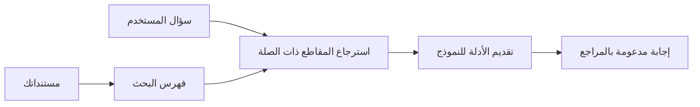

# تعليم الذكاء الاصطناعي للإجابة على الأسئلة بناءً على مستنداتك:
## السلسلة 1: RAG، أزور مقابل البدائل مفتوحة المصدر، ومتى يكون الضبط الدقيق منطقيًا

> المقالة الأولى في سلسلة 2026 التي تعيد زيارة دروسي التعليمية لـ Azure AI Search + Azure OpenAI حول الأسئلة والأجوبة من المستندات في 2023.

## 1. مقدمة - إعادة النظر في درس RAG السابق

في عام 2023، عملت على زوج من الدروس التعليمية حول تعليم ChatGPT للإجابة على الأسئلة من مستندات PDF باستخدام Azure AI Search و Azure OpenAI. كتبت النسخة [LangChain](https://techcommunity.microsoft.com/blog/educatordeveloperblog/teach-chatgpt-to-answer-questions-using-azure-ai-search--azure-openai-lang-chain/3969713)، وشاركت أيضًا في تأليف النسخة المصاحبة [Semantic Kernel](https://techcommunity.microsoft.com/blog/educatordeveloperblog/teach-chatgpt-to-answer-questions-using-azure-ai-search--azure-openai-semantic-k/3985395) مع [لي ستوت](https://developer.microsoft.com/en-us/advocates/lee-stott)، مدير رئيسي لمناصرة السحابة في مايكروسوفت. في ذلك الوقت، كان مفهوم "ChatGPT على بياناتك" لا يزال جديدًا للعديد من المطورين. استخدمت الدروس Azure Blob Storage و Azure AI Search و Azure OpenAI و LangChain و Semantic Kernel واسترجاع المتجهات من نوع FAISS للإجابة على الأسئلة من ملفات PDF.

ركز المقال السابق على سير عمل بسيط ولكنه مهم: رفع المستندات، فهرستها، استرجاع المحتوى ذي الصلة، وطلب نموذج للإجابة استنادًا إلى ذلك المحتوى.

في عام 2026، نما نظام RAG بشكل كبير. يدعم Azure AI Search الآن أنماط الاسترجاع المتجهة والهجينة الحديثة، و Azure OpenAI أصبح جزءًا من نظام نماذج Microsoft Foundry الأشمل، وواجهة برمجة التطبيقات v1 الأحدث يمكنها استخدام عميل OpenAI القياسي بدون الحاجة إلى تغييرات شهرية في `api-version`. في الوقت ذاته، أصبحت الخيارات مفتوحة المصدر مثل LangGraph و LlamaIndex و Haystack و Qdrant و Milvus و Weaviate و Chroma و Ollama و vLLM خيارات عملية لأنظمة RAG الحقيقية.

لهذا السبب أردت إعادة النظر في هذا الموضوع. السؤال لم يعد فقط "كيف أبني RAG؟" فهناك الآن العديد من الطرق لبنائه، والسؤال الأكثر أهمية هو "أي بنية يجب أن أختار لموقفي؟"

لكن المشكلة الجوهرية لم تتغير.

نموذج الذكاء الاصطناعي لا يعرف مستنداتك تلقائيًا. لبناء نظام مفيد للإجابة على أسئلة المستندات، لا يزال عليك الاعتماد على استرجاع موثوق، وتأصيل، وتقييم، وسير عمل تشغيلي.

هذه المقالة ليست درسًا آخر من البداية إلى النهاية عن "الدردشة مع PDF". أريد أن أبدأ هذه السلسلة المحدثة بالسؤال الذي يهمني الآن أكثر: متى يجب أن تختار بنية Azure المُدارة، متى تختار كومة RAG مفتوحة المصدر، ومتى يكون الضبط الدقيق منطقيًا بالفعل؟

هذه هي المقالة الأولى في سلسلة حول بناء أنظمة الذكاء الاصطناعي المستندة إلى المستندات. في هذا الجزء الأول، سنركز على قرارات البنية: لماذا تهم RAG، متى تكون خدمات Azure المُدارة مفيدة، متى تكون البدائل مفتوحة المصدر منطقية، وأين يناسب الضبط الدقيق.

بعد بناء وإعادة النظر في أنظمة الأسئلة والأجوبة من الوثائق، أصبحت أقل اهتمامًا بالأداة التي تبدو الأفضل في العرض التوضيحي وأكثر اهتمامًا بالبنية التي تصمد أمام المستخدمين الحقيقيين، والمستندات المتغيرة، والأذونات، والأخطاء، والصيانة.

## 2. لماذا يحتاج الذكاء الاصطناعي الخاص بك إلى نظام بحث

يتم تدريب نماذج اللغة الكبيرة على بيانات عامة ومرخصة واسعة النطاق. قد تعرف الكثير عن الموضوعات العامة، لكنها لا تعرف مستندات PDF الخاصة بك، أو السياسات الداخلية، أو إجراءات المؤسسة، أو أرشيفات الأبحاث، أو مواد الفصول الدراسية، أو ملاحظات دعم العملاء، أو التوثيق الذي تم تحديثه مؤخرًا تلقائيًا.

طريقة بسيطة للتفكير في RAG هي: بدلاً من توقع أن يتذكر النموذج كل مستند، نعطيه نظام بحث. عندما يطرح المستخدم سؤالًا، يجد النظام أولاً أكثر قطع المعلومات صلة، ثم يعطي تلك القطع إلى النموذج كسياق.

هذا مهم لأن مصادر المعرفة في كثير من العالم الحقيقي خاصة، ومتغيرة باستمرار، وحساسة للصلاحيات، ومخزنة عبر أنظمة متعددة، ومكتوبة بصيغ عديدة، وكبيرة جدًا بحيث لا يمكن لصقها مباشرة في الموجه.

على سبيل المثال، إذا كان لدى مدرسة أو شركة أو فريق بحثي 10000 مستند داخلي، لا يمكن للنموذج الإجابة من تلك المستندات بشكل موثوق إلا إذا استرجع النظام الأجزاء الصحيحة في الوقت المناسب.

هذا يقودنا بشكل طبيعي إلى سؤال شائع:

لماذا لا نقوم بالضبط الدقيق للنموذج فقط؟

الضبط الدقيق يمكن أن يكون مفيدًا، لكنه عادةً ليس الأداة المناسبة الأولى لمعرفتك بالمستندات. إذا كانت المعرفة تتغير كثيرًا، إذا كانت الاستشهادات مهمة، أو إذا كانت صلاحيات الوصول مهمة، فإن RAG عادةً هو نقطة البداية الأفضل. الضبط الدقيق أنسب لتعليم السلوك، والأسلوب، وتنسيق المخرجات، وأنماط المهام.

## 3. بنية RAG في التطبيق

تخيل أنك تبني مساعد ذكاء اصطناعي لمدرسة. يجب أن يجيب المساعد على الأسئلة من ملفات سياسة PDF، وأدلة الدورات، وصفحات الأسئلة الشائعة الداخلية، والإعلانات التي تم تحديثها مؤخرًا.

إذا سأل طالب، "هل يمكنني استخدام الذكاء الاصطناعي التوليدي لواجبي النهائي؟"، يجب ألا يجيب النظام من الذاكرة العامة للنموذج. يجب أولاً العثور على سياسة المدرسة ذات الصلة، واسترجاع القسم المتعلق باستخدام الذكاء الاصطناعي، ثم طلب النموذج الإجابة باستخدام ذلك الدليل.

هذا هو RAG في التطبيق.

على المستوى العالي، يمكنك التفكير في التدفق هكذا:

يمكن أن تصبح التفاصيل أكثر تعقيدًا، لكن الفكرة الأساسية بسيطة: النموذج لا يجيب بمفرده. يجيب مع الدليل المسترجع.

أولاً، تُستورد المستندات من أنظمة التخزين مثل Azure Blob Storage، SharePoint، GitHub، أو نظام إدارة محتوى داخلي. ثم يقوم النظام بتحليلها إلى نص مع الحفاظ على الهيكل المفيد مثل العناوين، أرقام الصفحات، الجداول، الأقسام، ومواقع المصدر.

بعد ذلك، يُقسّم المحتوى إلى قطع. هذه الخطوة تبدو بسيطة، لكنها من أهم أجزاء النظام. إذا كانت القطعة صغيرة جدًا، قد تفقد السياق المحيط. إذا كانت القطعة كبيرة جدًا، قد تشمل معلومات غير متعلقة وتقلل دقة الاسترجاع.

بعد التقسيم، ينشئ النظام التمثيلات المضمنة embeddings ويخزنها في فهرس قابل للبحث إلى جانب النص الأصلي والبيانات الوصفية مثل اسم الملف، رقم الصفحة، الأذونات، إصدار المستند، ورابط المصدر.

عندما يطرح المستخدم سؤالاً، يسترجع النظام قطع المرشحين باستخدام البحث بالكلمات المفتاحية، البحث المتجهي، أو البحث الهجين. يمكن لمصنف إعادة الترتيب أن يعيد ترتيب تلك القطع بحيث توضع الأدلة الأكثر فائدة في الأعلى.

أخيرًا، يستلم النموذج السؤال والدليل المسترجع. يجب أن تكون الإجابة مؤصلة في ذلك الدليل وتُرجع الاستشهادات حتى يتمكن المستخدم من فحص المصدر.

النقطة المهمة هي أن RAG ليست فقط "وضع ملفات PDF في قاعدة بيانات متجهة." جودة الإجابة تعتمد على سير العمل بأكمله: التحليل، والتقسيم، والاسترجاع، وإعادة الترتيب، والتحفيز، والاستشهاد، والتقييم.

لهذا السبب، هيكل المستند مهم. في PDF، يمكن لعناوين، جداول، حواشي، أو حدود الصفحات أن تغير معنى المقطع. على Azure، تستخدم مهارة Document Layout قدرات تخطيط Azure Document Intelligence لإنتاج مخرجات واعية بالهيكل، مما يمكن أن يحسن جودة التقسيم والاسترجاع لأنظمة RAG.

## 4. ماذا تغير منذ 2023؟

كان درس 2023 نقطة انطلاق جيدة في وقته:

- خزنت Azure Blob Storage ملفات PDF.
- فهرس Azure AI Search المحتوى.
- ربط LangChain الاسترجاع بـ Azure OpenAI.
- عمل FAISS كمخزن متجه محلي بسيط.
- استخدم المثال `gpt-35-turbo` و `text-embedding-ada-002`.

في عام 2026، يجب أن تعكس النسخة الحديثة عدة تغييرات.

أولًا، أصبح الاسترجاع أكثر نضجًا. في 2023، استخدمت العديد من العروض البحث المتشابه المتجهي البسيط. اليوم، غالبًا ما يكون الاسترجاع الهجين نقطة البداية الافتراضية لجديّة الأسئلة والأجوبة من المستندات. يدعم Azure AI Search البحث الهجين بدمج استعلامات الكلمات المفتاحية والمتجهة في طلب واحد ودمج النتائج من خلال Fusion Reciprocal Rank. يمكن لمصنف دلالي إعادة ترتيب نتائج النص الكامل، المتجه، والهجينة.

ثانيًا، أصبح الإدخال أكثر تقدمًا. بدلًا من تقسيم كل مستند يدويًا بكود التطبيق، يدعم Azure AI Search التوجيه المتكامل للتقسيم، وإنشاء التمثيلات المضمنة، والتوجيه وقت الطلب المتجه. بالنسبة لملفات PDF وأعباء العمل الثقيلة على المستندات، يمكن لمهارة Document Layout الحفاظ على هيكل أكثر من القطع ذات الحجم الثابت.

ثالثًا، أصبح التنسيق أكثر أهمية. الجزء الصعب غالبًا ليس مجرد استدعاء API لنموذج اللغة الكبير. الصعب هو التعامل مع الأخطاء، والمحاولات المتكررة، الاسترجاع القديم، جودة القطع، سير العمل الطويل، المراجعة البشرية، والتقييم على نطاق واسع. هنا تصبح أدوات سير العمل مثل LangGraph، وسير عمل LlamaIndex، وقنوات Haystack، وأدوات التقييم والمراقبة على مستوى المنصة أكثر أهمية من سلسلة خطية واحدة.

رابعًا، أصبح التقييم أمرًا لا يمكن تجاهله. يمكن أن يكون العرض التوضيحي مثيرًا مع سؤال واحد. يحتاج النظام الإنتاجي إلى مجموعات اختبار، وفحوصات الانحدار، وقياسات الاسترجاع، وفحوصات التأصيل، والمراقبة. بدون تقييم، يصعب معرفة ما إذا كان النظام يتحسن أو فقط يتغير.

## 5. الاختيار بين أزور وكومات RAG مفتوحة المصدر

لا أعتقد أن السؤال المفيد هو "هل أزور أفضل من المصدر المفتوح؟" أو "هل المصدر المفتوح أفضل من أزور؟"

السؤال المفيد هو: ما نوع النظام الذي تبنيه، من سيُشغّله، ما القيود التي لديك، وما أنماط الفشل التي لا يمكن قبولها؟

عندما بدأت في بناء أمثلة QA للمستندات، كنت أغلب وقتي أفكر ما إذا كان الاسترجاع يعمل. هل يمكنني رفع ملفات PDF والبحث فيها وتوليد إجابة؟ كان ذلك نقطة انطلاق معقولة.

بعد العمل في سير عمل ذكي أكثر واقعية، تغير تقييمي. الآن أنظر إلى أربعة أشياء قبل اختيار كومة RAG:

- الهوية والأذونات
- جودة الاسترجاع
- موثوقية سير العمل
- ملكية التشغيل

تلك المجالات الأربعة تخبرك بأكثر بكثير من مجرد معيار للنموذج.

البنى المعتمدة على Azure عادة ما تكون منطقية عندما يكون التكامل المؤسسي هو التحدي الأكبر. إذا كان الفريق يعتمد بالفعل على Microsoft Entra ID، و Microsoft 365، و Azure Storage، والشبكات الخاصة، و RBAC، ومراقبة Azure، يمكن لـ Azure AI Search و Azure OpenAI تقليل الكثير من التعقيد التشغيلي. في تلك البيئة، أزور ليست مجرد واجهة نموذج. القيمة هي النظام المحيط: الهوية، الحوكمة، البحث المُدار، تكامل الأمان، الدعم، والعمليات المألوفة.

البنى مفتوحة المصدر عادة ما تكون منطقية عندما تكون المرونة هي التحدي الأكبر. إذا كان الفريق يحتاج إلى استدلال محلي، قابلية النقل السحابي، خط إنتاج استرجاع مخصص، إعادة ترتيب تخصصية، أو تحكم مباشر في قاعدة البيانات المتجهة وطبقة خدمة النموذج، فإن الكومة مفتوحة المصدر قد تكون الأنسب. المقايضة هنا هي أن الفريق يملك المزيد من عمل الموثوقية: النسخ الاحتياطية، التوسع، الكمون، الهجرات، المراقبة، والأمان.

عمليًا، العديد من أنظمة الذكاء الاصطناعي الإنتاجية ليست فقط محلية في السحابة أو مفتوحة المصدر فقط. غالبًا ما تكون أنظمة هجينة توازن بين البساطة التشغيلية، وقابلية النقل، والحوكمة، ومرونة الهندسة.

على سبيل المثال، لن أندهش من رؤية نظام يستخدم Azure OpenAI لوصول النموذج، LangGraph لتنظيم سير العمل، استضافة Azure للنشر، وقاعدة بيانات متجه مفتوحة المصدر لمتطلبات استرجاع محددة. هذا ليس تعارضًا هيكليًا. هذا اختيار المستوى المناسب من الخدمة المُدارة والتحكم الهندسي لكل جزء من النظام.

أفضل البنى الهجينة عندما تحل المنصة المُدارة مشاكل مؤسسية مهمة، بينما تعطي المكونات مفتوحة المصدر للفريق المرونة حيثما تكون مهمة فعلاً.

## 6. دليل اتخاذ القرار العملي

إليك جدول القرار الذي سأستخدمه مع فريق قبل اختيار كومة RAG:

| مجال القرار | كومة أزور المُدارة أقوى عندما... | كومة مفتوحة المصدر أقوى عندما... |
| --- | --- | --- |
| الهوية والوصول | Entra ID، RBAC، الهوية المُدارة، وأذونات المؤسسة مركزية | يغلب عليها المصادقة المخصصة، هوية غير مايكروسوفت، أو منطق وصول خاص بالتطبيق |
| العمليات | يريد الفريق بنية تحتية مُدارة، دعم، اتفاقيات مستوى الخدمة، وإعداد أبسط | يمكن للفريق تشغيل قواعد البيانات المتجهة، خدمة النماذج، النسخ الاحتياطية، والتوسع |
| الاسترجاع | يغطي البحث الهجين، الترتيب الدلالي، الفلاتر، والبحث في البيانات الوصفية معظم الاحتياجات | يحتاج الفريق إلى استرجاع مخصص، إعادة ترتيب تخصصية، أو فهرسة تجريبية |
| قابلية النقل | التوافق مع نظام أزور مقبول أو مفضل | تجنب التقييد بالسحابة مطلب صعب |
| الاستدلال | حوكمة أزور OpenAI، الشبكات، وضوابط المؤسسة مهمة | الاستدلال المحلي، النماذج المخصصة، أو الخدمة الذاتية مطلوبة |
| التكلفة | تقليل الجهد الهندسي والتشغيلي أهم من ضبط البنية التحتية | الحجم كبير بما يكفي لتبرير تحسين البنية التحتية بعناية |
| التجريب | الاستقرار والتكامل المؤسسي أهم من تغيير المكونات كثيرًا | الفريق يكرر بسرعة على الوكلاء والأدوات والذاكرة وسير عمل الاسترجاع |

قاعدتي الأساسية بسيطة:

- ابدأ بـ Azure عندما يكون التكامل المؤسسي، والأمان، والبساطة التشغيلية هي المخاطر الرئيسية.
- ابدأ بالمصدر المفتوح عندما تكون قابلية النقل، والتخصيص، أو التحكم المحلي هي المخاطر الرئيسية.
- استخدم كومة هجينة عندما يكون الاثنان صحيحين.

لهذا أيضًا لا أبدأ سلسلة RAG لعام 2026 بالكود أولًا. الكود مهم، لكن اختيار البنية يأتي قبل التنفيذ. يمكن لعرض بسيط أن يخفي أصعب الخيارات. نظام RAG جيد يجعل تلك الخيارات واضحة.

## 7. أين يناسب الضبط الدقيق

غالبًا ما يُذكر الضبط الدقيق مع RAG، لكنني أعتقد أنه من المهم الفصل بين الاثنين.

عادةً ما يكون RAG الخيار الأفضل عندما يحتاج النظام إلى معرفة حديثة وخاصة، حساسة للأذونات، أو مؤصولة بالمصدر. إذا كان يجب أن تستشهد الإجابة بالمستندات، أو تعكس تحديثات حديثة، أو تحترم قواعد وصول محددة للمستخدم، يجب أن يكون الاسترجاع جزءًا من البنية.

الضبط الدقيق أكثر فائدة عندما لا تكون المعرفة هي المشكلة الرئيسية. يمكن أن يساعد عندما تريد من النموذج اتباع تنسيق مخرجات محدد، مطابقة أسلوب استجابة خاص بمجال معين، أداء مهمة مستقرة بشكل أكثر اتساقًا، أو تقليل كمية التعليمات المطلوبة في كل محفز.
عمليًا، يمكن أن يعمل الاثنان معًا. قد يستخدم مساعد الدعم RAG لاسترجاع السياسة الأحدث، بينما يتعلم نموذج مضبوط بدقة هيكل الإجابة ونبرة الشركة المفضلة.

الخطأ هو اعتبار الضبط الدقيق بديلاً لمخزن المستندات. فهو لا يلغي الحاجة للاسترجاع عندما يجب أن يجيبو النظام من بيانات جديدة أو خاصة أو حساسة من حيث الأذونات.

## ٨. إلى أين تتجه هذه السلسلة بعد ذلك

هذه المقالة هي طبقة اتخاذ القرار. قبل كتابة الكود، أردت أن أوضح التنازلات: RAG مقابل الضبط الدقيق، أزور مقابل المصادر المفتوحة، الخدمات المدارة مقابل التحكم التشغيلي.

قبل الانتقال إلى التنفيذ، أريد أن أُبقي هنا نقطة واحدة: في العديد من أنظمة الذكاء الاصطناعي للمؤسسات، النموذج هو مجرد مكون واحد فقط. جودة الاسترجاع، التنسيق، التقييم، الأذونات، والموثوقية التشغيلية غالبًا ما تكون هي التي تحدد ما إذا كان النظام سينجح بعد مرحلة العرض التوضيحي.

في الأجزاء القادمة من هذه السلسلة، أخطط للغوص أعمق في الجانب العملي لأنظمة الذكاء الاصطناعي المعتمدة على المستندات: كيف تبني بنية تحتية قائمة على أزور، كيف تقارن البدائل مفتوحة المصدر عمليًا، وكيف تقيم ما إذا كان نظام RAG يعمل فعلاً.

قد أعدل الترتيب مع تطور السلسلة، لكن الهدف سيظل نفسه: الانتقال إلى ما بعد العرض التوضيحي البسيط، وإظهار كيفية التفكير في أنظمة RAG التي يمكن صيانتها وتقييمها وتشغيلها.

## ٩. المراجع والموارد

الدروس الأصلية:

- [تعلّم ChatGPT كيفية الإجابة على الأسئلة: استخدام Azure AI Search و Azure OpenAI (Lang Chain)](https://techcommunity.microsoft.com/blog/educatordeveloperblog/teach-chatgpt-to-answer-questions-using-azure-ai-search--azure-openai-lang-chain/3969713)
- [تعلّم ChatGPT كيفية الإجابة على الأسئلة: استخدام Azure AI Search و Azure OpenAI (Semantic Kernel)](https://techcommunity.microsoft.com/blog/educatordeveloperblog/teach-chatgpt-to-answer-questions-using-azure-ai-search--azure-openai-semantic-k/3985395)

أزور:

- [إصدارات واجهة برمجة تطبيقات Azure AI Search REST](https://learn.microsoft.com/en-us/rest/api/searchservice/search-service-api-versions)
- [البحث الهجين في Azure AI Search](https://learn.microsoft.com/en-us/azure/search/hybrid-search-how-to-query)
- [التكامل الموجه للتمثيل الشعاعي في Azure AI Search](https://learn.microsoft.com/en-us/azure/search/vector-search-integrated-vectorization)
- [مهارة تخطيط المستند في Azure AI Search](https://learn.microsoft.com/en-us/azure/search/cognitive-search-skill-document-intelligence-layout)
- [تقسيم وتمثيل الشعاع حسب تخطيط المستند](https://learn.microsoft.com/en-us/azure/search/search-how-to-semantic-chunking)
- [الترتيب الدلالي في Azure AI Search](https://learn.microsoft.com/en-us/azure/search/semantic-search-overview)
- [دورة حياة إصدار API الخاصة بـ Azure OpenAI / Microsoft Foundry](https://learn.microsoft.com/en-us/azure/foundry/openai/api-version-lifecycle)
- [نماذج Foundry المباعة عبر أزور](https://learn.microsoft.com/en-us/azure/foundry/foundry-models/concepts/models-sold-directly-by-azure)
- [اعتبارات الضبط الدقيق في Microsoft Foundry](https://learn.microsoft.com/en-us/azure/foundry/openai/concepts/fine-tuning-considerations)
- [مراقبة Microsoft Foundry](https://learn.microsoft.com/en-us/azure/foundry/concepts/observability)
- [تشغيل التقييمات في Microsoft Foundry](https://learn.microsoft.com/en-us/azure/foundry/how-to/evaluate-generative-ai-app)

المصدر المفتوح:

- [توثيق LangGraph](https://docs.langchain.com/oss/python/langgraph/overview)
- [توثيق LlamaIndex](https://developers.llamaindex.ai/python/framework/)
- [توثيق Haystack](https://docs.haystack.deepset.ai/)
- [توثيق Qdrant](https://qdrant.tech/documentation/overview/)
- [توثيق Milvus](https://milvus.io/docs/overview.md)
- [توثيق Weaviate](https://docs.weaviate.io/weaviate/current/)
- [توثيق Chroma](https://docs.trychroma.com/docs/overview/introduction)
- [تضمينات Ollama](https://docs.ollama.com/capabilities/embeddings)
- [خادم متوافق مع OpenAI vLLM](https://docs.vllm.ai/en/latest/serving/openai_compatible_server.html)
- [نماذج تضمين BGE](https://huggingface.co/BAAI/bge-large-en-v1.5)
- [نماذج تضمين E5](https://huggingface.co/intfloat/e5-large-v2)
- [نماذج تضمين Instructor](https://huggingface.co/hkunlp/instructor-large)

---

<!-- CO-OP TRANSLATOR DISCLAIMER START -->
**تنويه**:
تمت ترجمة هذا المستند باستخدام خدمة الترجمة بالذكاء الاصطناعي [Co-op Translator](https://github.com/Azure/co-op-translator). بينما نسعى للدقة، يرجى العلم أن الترجمات الآلية قد تحتوي على أخطاء أو عدم دقة. يجب اعتبار المستند الأصلي بلغته الأصلية المصدر الرسمي والمعتمد. للمعلومات الهامة، يُنصح بالاستعانة بترجمة بشرية محترفة. نحن غير مسؤولين عن أي سوء فهم أو تفسير ناتج عن استخدام هذه الترجمة.
<!-- CO-OP TRANSLATOR DISCLAIMER END -->