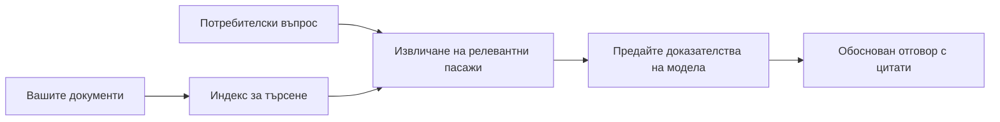

# Обучете AI да отговаря на въпроси въз основа на вашите документи:
## Серия 1: RAG, Azure срещу алтернативи с отворен код и кога е разумно фино настройване

> Първата статия от серия през 2026 г., която преосмисля моите уроци от 2023 г. за Azure AI Search + Azure OpenAI за въпроси и отговори върху документи.

Навигация в серията: [Начална страница на репозитория](../README.md) | Следваща: [Серия 2 - Създаване на локална RAG система с отворен код от край до край](./series-2-open-source-rag-end-to-end.md)

## 1. Въведение - Преосмисляне на предишен урок за RAG 

През 2023 г. работих върху двойка уроки за обучение на ChatGPT да отговаря на въпроси от PDF документи, използвайки Azure AI Search и Azure OpenAI. Аз написах [версията с LangChain](https://techcommunity.microsoft.com/blog/educatordeveloperblog/teach-chatgpt-to-answer-questions-using-azure-ai-search--azure-openai-lang-chain/3969713), а също съавторствах спомагателната [версия със Semantic Kernel](https://techcommunity.microsoft.com/blog/educatordeveloperblog/teach-chatgpt-to-answer-questions-using-azure-ai-search--azure-openai-semantic-k/3985395) с [Lee Stott](https://developer.microsoft.com/en-us/advocates/lee-stott), главен мениджър по облачни адвокати в Microsoft. По това време идеята за „ChatGPT върху вашите данни“ все още беше нова за много разработчици. Уроците използваха Azure Blob Storage, Azure AI Search, Azure OpenAI, LangChain, Semantic Kernel и векторно търсене в стил FAISS за отговор на въпроси от PDF файлове.

Тази предишна статия се фокусираше върху прост, но важен работен поток: качване на документи, индексиране, извличане на релевантно съдържание и задаване на въпрос към модел, който отговаря въз основа на това съдържание.

През 2026 г. екосистемата на RAG значително се е развила. Azure AI Search вече поддържа модерни векторни и хибридни модели на търсене, Azure OpenAI е част от по-широката екосистема на Microsoft Foundry Models, а новият v1 API може да използва стандартния OpenAI клиент без необходимост от месечни промени на `api-version`. В същото време опции с отворен код като LangGraph, LlamaIndex, Haystack, Qdrant, Milvus, Weaviate, Chroma, Ollama и vLLM са се превърнали в практически решения за реални RAG системи.

Затова исках да върна темата на преден план. Въпросът вече не е само „Как да изградя RAG?“. Сега има много начини да се изгради, а по-важният въпрос е „Коя архитектура трябва да избера за моята ситуация?“

Но основният проблем не се е променил.

AI моделът не познава автоматично вашите документи. За да изградите полезна система за въпроси и отговори, базирана на документи, все още са необходими надеждно извличане, основаване, оценяване и оперативни работни потоци.

Тази статия не е друг урок „чат с PDF“ от край до край. Искам да започна тази обновена серия с въпрос, който вече ме вълнува повече: кога трябва да изберете управлявана Azure архитектура, кога - система RAG с отворен код и кога финото настройване има смисъл?

Това е първата статия от серия за изграждане на AI системи, основани на документи. В тази първа част ще се фокусираме върху архитектурните решения: защо RAG е важен, кога управляваните услуги на Azure са полезни, кога алтернативите с отворен код имат смисъл и къде се вписва финото настройване.

След като изградих и преосмислих системи за Q&A върху документи, вече се интересувам по-малко от това кой инструмент изглежда най-добър в демонстрация и повече от това коя архитектура устоява на реални потребители, променящи се документи, разрешения, грешки и поддръжка.

## 2. Защо вашият AI има нужда от система за търсене

Големите езикови модели са обучени върху широки публични и лицензирани данни. Те може да знаят много за общи теми, но не познават автоматично вашите лични PDF файлове, вътрешни политики, корпоративни процедури, архиви с изследвания, учебни материали, бележки от клиентска поддръжка или наскоро актуализирана документация.

Прост начин да мислим за RAG е този: вместо да очакваме моделът да запомня всеки документ, му даваме система за търсене. Когато потребител зададе въпрос, системата първо намира най-релевантните части информация, след което ги дава на модела като контекст.

Това е важно, защото много източници на реални знания са частни, постоянно се променят, чувствителни са към разрешения, съхраняват се в множество системи, написани са във много формати и са твърде големи, за да бъдат поставени директно в подканата.

Например, ако училище, компания или изследователски екип има 10 000 вътрешни документа, моделът не може да отговаря надеждно, освен ако системата не извлече правилните части в правилния момент.

Това води до често задаван въпрос:

Защо не се фино настрои просто моделът?

Финото настройване може да е полезно, но обикновено не е първото правилно решение за знания от документи. Ако знанието се променя често, ако източниците имат значение или ако разрешенията за достъп са важни, RAG обикновено е по-добрата отправна точка. Финото настройване е по-подходящо за обучение на поведение, стил, формат на изхода и шаблони за задачи.

## 3. RAG архитектура на практика

Представете си, че изграждате AI асистент за училище. Асистентът трябва да отговаря на въпроси от PDF файлове с политики, учебни програми, вътрешни страници с често задавани въпроси и наскоро обновени съобщения.

Ако ученик попита „Мога ли да използвам генеративен AI за крайния си проект?“, системата не трябва да отговаря от общата памет на модела. Тя първо трябва да намери релевантната училищна политика, да извлече раздела за използване на AI и след това да помоли модела да отговори, използвайки това доказателство.

Това е RAG на практика.

На високо ниво, потока може да се опише така:

Детайлите могат да станат по-сложни, но основната идея е проста: моделът не отговаря сам. Той отговаря с извлечени доказателства.

Първо, документите се зареждат от системи за съхранение като Azure Blob Storage, SharePoint, GitHub или вътрешна CMS. След това системата ги парсира в текст като запазва полезна структура като заглавия, номера на страници, таблици, секции и източници.

След това съдържанието се разделя на части. Тази стъпка звучи проста, но е една от най-важните части на системата. Ако частта е твърде малка, може да загуби околния контекст. Ако е твърде голяма, може да включи несвързана информация и да направи извличането по-малко прецизно.

След разделяне системата създава embedding и ги съхранява в търсещ индекс заедно с оригиналния текст и метаданни като име на файл, номер на страница, разрешения, версия на документа и URL адрес на източника.

Когато потребителят зададе въпрос, системата извлича кандидат части чрез търсене по ключови думи, векторно търсене или хибридно търсене. След това преоценител (reranker) може да преподреди тези части, така че най-полезните доказателства да са най-отгоре.

Накрая моделът получава въпроса и извлечените доказателства. Отговорът трябва да се основава на тези доказателства и да връща цитати, така че потребителят да може да провери източника.

Важното е, че RAG не е само „постави PDF в база данни с вектори“. Качеството на отговора зависи от целия работен поток: парсиране, разделяне, извличане, преоценяване, подсказване, цитиране и оценка.

Затова структурата на документа е важна. В PDF заглавие, таблица, бележка под линия или граница на страница могат да променят значението на част от текста. В Azure Document Layout skill използва възможностите на Azure Document Intelligence за оформяне, което може да подобри качеството на разделянето и извличането за RAG системи.

## 4. Какво се промени от 2023 г.?

Урокът от 2023 г. беше добра отправна точка за времето си:

- Azure Blob Storage съхраняваше PDF файлове.
- Azure AI Search индексираше съдържание.
- LangChain свързваше извличането с Azure OpenAI.
- FAISS работеше като проста локална векторна база.
- Примерът използваше `gpt-35-turbo` и `text-embedding-ada-002`.

През 2026 г. модерната версия трябва да отразява няколко промени.

Първо, извличането се усъвършенства. През 2023 г. много демонстрации използваха просто векторно сходство. Днес хибридното извличане често е отправната точка за сериозен document QA. Azure AI Search поддържа хибридно търсене, комбинирайки заявки с ключови думи и вектори в единна заявка и слива резултатите с Reciprocal Rank Fusion. Семантичен рангер може след това да пренареди текстовата част на пълнотекстови, векторни и хибридни резултати.

Второ, зареждането е по-сложно. Вместо ръчно разделяне на всеки документ чрез код, Azure AI Search поддържа интегрирана векторизация за разделяне, embedding и векторизация по време на заявка. За PDF и натоварвания с много документи, Document Layout skill може да запази повече структура отколкото фиксиран размер на части.

Трето, оркестрацията е по-важна. Твърдата част често не е повикването на LLM API само по себе си. Трудното е да се справиш с грешки, повторни опити, остаряло извличане, качество на частите, дългосрочни работни потоци, човешки преглед и оценка в мащаб. Тук инструменти с ориентация към работни потоци като LangGraph, LlamaIndex workflows, Haystack pipelines и платформи за оценка и наблюдение стават по-важни от една единствена линейна верига.

Четвърто, оценката вече не е по желание. Демонстрация може да изглежда впечатляващо с един въпрос. Производствена система изисква тестови набори, проверки за регресия, метрики за извличане, проверки на обоснованост и мониторинг. Без оценка е трудно да се знае дали системата се подобрява или просто се променя.

## 5. Избор между Azure и RAG стекове с отворен код

Не мисля, че полезният въпрос е „Дали Azure е по-добър от отворения код?“ или „Дали отвореният код е по-добър от Azure?“

Полезният въпрос е: какъв вид система изграждате, кой ще я управлява, какви ограничения имате и кои режими на отказ са неприемливи?

Когато започвах да изграждам примери за QA върху документи, основно мислех дали извличането работи. Мога ли да кача PDF, да ги търся и да генерирам отговор? Това беше разумна отправна точка.

След работа с по-реалистични AI работни потоци, оценката ми се промени. Сега разглеждам четири аспекта преди да избера RAG стек:

- идентичност и разрешения
- качество на извличането
- надеждност на работния поток
- оперативна собственост

Тези четири области казват много повече от само моделно бенчмаркиране.

Архитектурите, базирани на Azure, обикновено са разумни, когато интеграцията в предприятието е трудната част. Ако екипът вече разчита на Microsoft Entra ID, Microsoft 365, Azure Storage, частни мрежи, RBAC и Azure мониторинг, Azure AI Search и Azure OpenAI могат да намалят значително оперативната сложност. В тази среда Azure не е само модел API. Стойността е в заобикалящата система: идентичност, управление, управлявано търсене, интеграция със сигурност, поддръжка и познати операции.

Архитектурите с отворен код обикновено са разумни, когато гъвкавостта е трудната част. Ако екипът се нуждае от локално извеждане (inference), преносимост облак - локално, персонализиран pipeline за извличане, специализирано преоценяване или директен контрол върху векторната база и слоя за обслужване на модели, стек с отворен код може да е по-добър избор. Компромисът е, че екипът носи повече отговорност за надеждността: архиви, скалиране, латентност, миграции, мониторинг и сигурност.

В практиката много производствени AI системи не са чисто облачни или чисто с отворен код. Често са хибридни, които балансират оперативната простота, преносимост, управление и инженерна гъвкавост.

Например, не бих се изненадал да видя система, която използва Azure OpenAI за достъп до модели, LangGraph за оркестрация на работни потоци, Azure хостинг за разгръщане и отворена векторна база данни за конкретно изискване за извличане. Това не е архитектурно несъответствие. Това е избор на правилното ниво управлявана услуга и инженерно управление за всяка част от системата.

Предпочитам хибридните архитектури, когато управляваната платформа решава важни корпоративни проблеми, а компоненти с отворен код дават гъвкавост на екипа там, където наистина има значение.

## 6. Практическо ръководство за вземане на решения

Ето таблицата за решение, която бих използвал с екип преди избора на RAG стек:

| Област на решение | Управляван Azure стек е по-силен, когато... | Стек с отворен код е по-силен, когато... |
| --- | --- | --- |
| Идентичност и достъп | Entra ID, RBAC, управлявана идентичност и корпоративни разрешения са централни | доминира персонализирана автентикация, идентичност извън Microsoft или логика за достъп специфична за приложението |
| Операции | екипът иска управлявана инфраструктура, поддръжка, SLA и по-лесно включване | екипът може да оперира векторни бази, обслужване на модели, архиви и скалиране |
| Извличане | хибридно търсене, семантичен ранк, филтри и търсене по метаданни покриват повечето нужди | екипът се нуждае от персонализирано извличане, специализирано преоценяване или опитно индексиране |
| Преносимост | Azure екосистемно съответствие е приемливо или предпочитано | избягване на заключване в облак е твърдо изискване |
| Извеждане (Inference) | управление, мрежи и корпоративен контрол на Azure OpenAI имат значение | изисква се локално извеждане, персонализирани модели или самостоятелно хоствано обслужване |
| Цена | намаляване на усилията в инженерството и операциите има по-голям приоритет от оптимизация на инфраструктурата | мащабът е достатъчно голям, за да оправдае внимателна инфраструктурна оптимизация |
| Експериментиране | стабилност и интеграция с предприятията имат по-голямо значение от честа смяна на компоненти | екипът бързо итера върху агенти, инструменти, памет и работни потоци за извличане |

Правилото ми е просто:

- Започнете с Azure, когато интеграцията с предприятието, сигурността и оперативната простота са основните рискове.
- Започнете с отворен код когато преносимостта, персонализирането или локалния контрол са основните рискове.
- Използвайте хибриден стек, когато и двете са верни.

Затова и не бих започнал серия RAG от 2026 г. първо с код. Кодът е важен, но изборът на архитектура е преди имплементацията. Простата демонстрация може да скрие най-трудните избори. Добрата RAG система прави тези избори явни.

## 7. Къде се вписва финото настройване

Финото настройване често се споменава заедно с RAG, но мисля, че е важно да ги разграничим.

Обикновено RAG е по-добрият избор, когато системата се нуждае от свежи, частни, чувствителни към разрешения или основаващи се на източник знания. Ако отговорът трябва да цитира документи, да отразява актуализации или да уважава потребителско-специфични правила за достъп, извличането трябва да е част от архитектурата.
Финото нагласяне е по-полезно, когато знанието не е основният проблем. То може да помогне, когато искате моделът да следва конкретен формат на изхода, да съответства на стил на отговор, специфичен за домейн, да изпълнява стабилна задача по-последователно или да намали количеството инструкции, необходими при всяко подканване.

На практика двата подхода могат да работят заедно. Помощник за поддръжка може да използва RAG за извличане на най-новата политика, докато модел с фино нагласяне научава предпочитаната структура и тон на отговора на компанията.

Грешката е да се третира финото нагласяне като заместител на хранилище за документи. То не премахва необходимостта от извличане, когато системата трябва да отговаря от свежи, частни или чувствителни по отношение на разрешения данни.

## 8. Къде Продължава Тази Серия

Тази статия е слоят за вземане на решения. Преди да напиша код, исках да направя явни компромисите: RAG срещу фино нагласяне, Azure срещу отворен код, управлявани услуги срещу контрол на операциите.

Преди да премина към реализация, искам да оставя тук една точка: в много корпоративни AI системи моделът е само един компонент. Качеството на извличане, оркестрацията, оценката, разрешенията и оперативната надеждност често определят дали системата ще успее извън демо стадия.

В следващите части на тази серия планирам да навляза по-дълбоко в практическата страна на AI системите, базирани на документи: първо, изграждане на локален RAG работен процес с отворен код, след това изграждане на същия сценарий с Azure AI Search и Azure OpenAI, и накрая оценка дали системата наистина работи.

Мога да променя реда с развитието на сериите, но целта ще остане същата: да преминем отвъд простото демо и да покажем как да се мисли за RAG системи, които могат да се поддържат, оценяват и оперират.

## 9. Препратки и Ресурси

Оригинални уроци:

- [Teach ChatGPT to Answer Questions: Using Azure AI Search & Azure OpenAI (Lang Chain)](https://techcommunity.microsoft.com/blog/educatordeveloperblog/teach-chatgpt-to-answer-questions-using-azure-ai-search--azure-openai-lang-chain/3969713)
- [Teach ChatGPT to Answer Questions: Using Azure AI Search & Azure OpenAI (Semantic Kernel)](https://techcommunity.microsoft.com/blog/educatordeveloperblog/teach-chatgpt-to-answer-questions-using-azure-ai-search--azure-openai-semantic-k/3985395)

Azure:

- [Версии на Azure AI Search REST API](https://learn.microsoft.com/en-us/rest/api/searchservice/search-service-api-versions)
- [Хибридно търсене в Azure AI Search](https://learn.microsoft.com/en-us/azure/search/hybrid-search-how-to-query)
- [Интегрирана векторизация в Azure AI Search](https://learn.microsoft.com/en-us/azure/search/vector-search-integrated-vectorization)
- [Умение за оформление на документи в Azure AI Search](https://learn.microsoft.com/en-us/azure/search/cognitive-search-skill-document-intelligence-layout)
- [Разчленяване и векторизация според оформлението на документа](https://learn.microsoft.com/en-us/azure/search/search-how-to-semantic-chunking)
- [Семантично класиране в Azure AI Search](https://learn.microsoft.com/en-us/azure/search/semantic-search-overview)
- [Животен цикъл на версиите на API на Azure OpenAI / Microsoft Foundry](https://learn.microsoft.com/en-us/azure/foundry/openai/api-version-lifecycle)
- [Модели на Foundry, продавани от Azure](https://learn.microsoft.com/en-us/azure/foundry/foundry-models/concepts/models-sold-directly-by-azure)
- [Съображения за фино нагласяне в Microsoft Foundry](https://learn.microsoft.com/en-us/azure/foundry/openai/concepts/fine-tuning-considerations)
- [Наблюдаемост в Microsoft Foundry](https://learn.microsoft.com/en-us/azure/foundry/concepts/observability)
- [Провеждане на оценки в Microsoft Foundry](https://learn.microsoft.com/en-us/azure/foundry/how-to/evaluate-generative-ai-app)

Отворен код:

- [Документация на LangGraph](https://docs.langchain.com/oss/python/langgraph/overview)
- [Документация на LlamaIndex](https://developers.llamaindex.ai/python/framework/)
- [Документация на Haystack](https://docs.haystack.deepset.ai/)
- [Документация на Qdrant](https://qdrant.tech/documentation/overview/)
- [Документация на Milvus](https://milvus.io/docs/overview.md)
- [Документация на Weaviate](https://docs.weaviate.io/weaviate/current/)
- [Документация на Chroma](https://docs.trychroma.com/docs/overview/introduction)
- [Оллама embedding-и](https://docs.ollama.com/capabilities/embeddings)
- [vLLM съвместим със сървър OpenAI](https://docs.vllm.ai/en/latest/serving/openai_compatible_server.html)
- [BGE embedding модели](https://huggingface.co/BAAI/bge-large-en-v1.5)
- [E5 embedding модели](https://huggingface.co/intfloat/e5-large-v2)
- [Instructor embedding модели](https://huggingface.co/hkunlp/instructor-large)

Следва: [Серия 2 - Изграждане на локална RAG система с отворен код от край до край](./series-2-open-source-rag-end-to-end.md)

---

<!-- CO-OP TRANSLATOR DISCLAIMER START -->
**Отказ от отговорност**:
Този документ е преведен с помощта на AI преводачески услуга [Co-op Translator](https://github.com/Azure/co-op-translator). Въпреки че се стремим към точност, моля имайте предвид, че автоматизираните преводи могат да съдържат грешки или неточности. Оригиналният документ на неговия роден език трябва да се счита за авторитетен източник. За критична информация се препоръчва професионален човешки превод. Ние не носим отговорност за каквито и да е недоразумения или неправилни тълкувания, произтичащи от използването на този превод.
<!-- CO-OP TRANSLATOR DISCLAIMER END -->