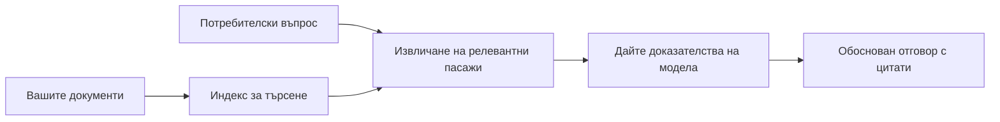

# Обучете ИИ да Отговаря на Въпроси Въз основа на Вашите Документи:
## Серия 1: RAG, Azure срещу Алтернативи с Отворен Код и Кога Настройването на Модела Има Смисъл

> Първата статия от серия през 2026, която преглежда моите уроци от 2023 за Azure AI Search + Azure OpenAI за въпросно-отговорни системи с документи.

## 1. Въведение - Преглед на По-ранен RAG Урок

През 2023 работих върху двойка уроци за обучение на ChatGPT да отговаря на въпроси от PDF документи, използвайки Azure AI Search и Azure OpenAI. Написах [версии с LangChain](https://techcommunity.microsoft.com/blog/educatordeveloperblog/teach-chatgpt-to-answer-questions-using-azure-ai-search--azure-openai-lang-chain/3969713), а също така съавторствах спомагателната [версия със Semantic Kernel](https://techcommunity.microsoft.com/blog/educatordeveloperblog/teach-chatgpt-to-answer-questions-using-azure-ai-search--azure-openai-semantic-k/3985395) с [Лий Стот](https://developer.microsoft.com/en-us/advocates/lee-stott), главен мениджър по облачна адвокация в Microsoft. Тогава идеята "ChatGPT върху вашите данни" все още изглеждаше нова за много разработчици. Уроците използваха Azure Blob Storage, Azure AI Search, Azure OpenAI, LangChain, Semantic Kernel и FAISS-подобен векторен достъп за отговаряне на въпроси от PDF файлове.

Тогавашната статия се фокусира върху прост, но важен работен процес: качване на документи, индексиране, извличане на релевантно съдържание и задаване на модел да отговори въз основа на това съдържание.

През 2026 екосистемата на RAG значително се е развила. Azure AI Search вече поддържа съвременни векторни и хибридни модели за извличане, Azure OpenAI е част от по-широката екосистема Microsoft Foundry Models, а новото API v1 може да използва стандартния OpenAI клиент без месечни промени на `api-version`. В същото време отворени решения като LangGraph, LlamaIndex, Haystack, Qdrant, Milvus, Weaviate, Chroma, Ollama и vLLM са станали практически избор за реални RAG системи.

Затова исках да прегледам отново тази тема. Въпросът вече не е просто "Как да изградя RAG?" Сега има много начини за изграждане, а значимият въпрос е "Коя архитектура да избера за моя случай?"

Но основният проблем не се е променил.

ИИ моделът не знае автоматично вашите документи. За да създадете полезна система за въпроси и отговори с документи, все още се нуждаете от надеждно извличане, основаване, оценка и оперативни работни процеси.

Тази статия не е поредният краен „чат с PDF“ урок. Искам да започна тази обновена серия с въпроса, който сега ме интересува повече: кога трябва да изберете управлявана архитектура на Azure, кога да изберете стек с отворен код за RAG и кога наистина има смисъл да се прави настройка на модела?

Това е първата статия от серия за изграждане на AI системи, базирани на документи. В тази първа част ще се фокусираме върху архитектурните решения: защо RAG е важен, кога управляваните услуги на Azure са полезни, кога алтернативите с отворен код имат смисъл и къде влиза фината настройка.

След като изградих и прегледах системи за въпроси с документи, започнах да се интересувам по-малко кой инструмент изглежда най-добре на демонстрация и повече кой архитектурен избор оцелява при реални потребители, променящи се документи, разрешения, грешки и поддръжка.

## 2. Защо Вашият ИИ Нуждае от Търсачна Система

Големите езикови модели са обучени върху широк набор от публични и лицензирани данни. Те може да знаят много за общи теми, но не знаят автоматично вашите лични PDF-и, вътрешни политики, корпоративни процедури, изследователски архиви, учебни материали, бележки за клиентска поддръжка или наскоро обновена документация.

Прост начин да се разбере RAG е следният: вместо да се очаква моделът да запомни всеки документ, му даваме търсачна система. Когато потребителят зададе въпрос, системата първо намира най-релевантните парчета информация и след това ги дава на модела като контекст.

Това е важно, защото много източници на реални знания са лични, постоянно се променят, чувствителни на разрешения, съхранени в различни системи, написани в различни формати и твърде обемни, за да бъдат директно поставени в подканата.

Например, ако в училище, компания или изследователски екип има 10 000 вътрешни документа, моделът не може надеждно да отговори от тези документи, освен ако системата не извлече правилните части в правилния момент.

Това естествено води до често срещан въпрос:

Защо не настроим модела (fine-tune) просто?

Настройването може да бъде полезно, но обикновено не е най-подходящият първи инструмент за знанията в документите. Ако знанието често се променя, ако цитатите са важни или ако разрешенията за достъп имат значение, RAG обикновено е по-доброто начало. Настройването е по-подходящо за обучение на поведение, стил, формат на изхода и модели на задачи.

## 3. RAG Архитектура на практика

Представете си, че изграждате ИИ асистент за училище. Асистентът трябва да отговаря на въпроси от PDF документи с политики, учебни наръчници, вътрешни страници с често задавани въпроси и наскоро обновени съобщения.

Ако ученик попита: „Мога ли да използвам генеративен ИИ за моя финален проект?“, системата не трябва да отговаря от общата памет на модела. Тя първо трябва да намери съответната политика на училището, да извлече частта за използване на ИИ и след това да поиска моделът да отговори, използвайки тези доказателства.

Това е RAG на практика.

На високо ниво, потокът може да се представи така:

Детайлите могат да станат по-сложни, но основната идея е проста: моделът не отговаря самостоятелно. Той отговаря с извлечени доказателства.

Първо, документите се зареждат от системи за съхранение като Azure Blob Storage, SharePoint, GitHub или вътрешна CMS. След това системата ги анализира до текст, като запазва полезна структура като заглавия, номера на страници, таблици, секции и източници.

След това съдържанието се разделя на части (chunks). Тази стъпка звучи проста, но е една от най-важните в системата. Ако частта е твърде малка, може да се загуби контекстът около нея. Ако частта е твърде голяма, може да съдържа нерелевантна информация и да направи извличането по-малко прецизно.

След разделянето системата създава вграждания (embeddings) и ги съхранява в търсещ индекс заедно с оригиналния текст и метаданни като име на файл, номер на страница, разрешения, версия на документа и URL на източника.

Когато потребителят зададе въпрос, системата извлича кандидат-части чрез търсене по ключови думи, векторно търсене или хибридно търсене. След това пренаредител (reranker) може да подреди тези части така, че най-полезните доказателства да се поставят най-отгоре.

Накрая моделът получава въпроса и извлечените доказателства. Отговорът трябва да бъде основан на тези доказателства и да върне цитати, така че потребителят да може да провери източника.

Важната точка е, че RAG не е просто „да сложиш PDF-и във векторна база данни.“ Качеството на отговора зависи от целия работен процес: анализ, разделяне, извличане, пренареждане, подканяне, цитиране и оценка.

Затова структурата на документа е от значение. В PDF заглавие, таблица, бележка под линия или граница на страница може да променят значението на текстов фрагмент. В Azure умението Document Layout използва възможностите на Azure Document Intelligence за разпознаване на структура, която може да подобри разделянето и качеството на извличане за RAG системите.

## 4. Какво се Промени от 2023?

Урокът от 2023 беше добра отправна точка за времето си:

- Azure Blob Storage съхраняваше PDF файлове.
- Azure AI Search индексираше съдържание.
- LangChain свързваше извличането с Azure OpenAI.
- FAISS работеше като прост локален векторен сторидж.
- Примерът използваше `gpt-35-turbo` и `text-embedding-ada-002`.

През 2026 съвременна версия трябва да отрази няколко промени.

Първо, извличането е по-зряло. През 2023 много демонстрации използваха просто векторно търсене по сходство. Днес хибридното извличане често е стандартната начална точка за сериозни системи за въпроси с документи. Azure AI Search поддържа хибридно търсене чрез комбиниране на ключови думи и векторни заявки в една заявка и сливане на резултатите с Reciprocal Rank Fusion. Семантичният ранкър може да пренареди текстовата страна на резултати от пълнотекстово, векторно и хибридно търсене.

Второ, зареждането е по-усъвършенствано. Вместо да се разделя всеки документ с код на приложението ръчно, Azure AI Search поддържа интегрирана векторизация за разделяне, вграждане и векторизация в момента на заявка. За PDF-и и тежки по документи натоварвания, Document Layout умението може да запази повече структура отколкото фиксирани части.

Трето, оркестрацията има по-голямо значение. Трудната част често не е самото извикване на LLM API. Трудното е да се справиш с грешки, повторни опити, остаряло извличане, качество на частите, дългосрочни работни процеси, човешки преглед и оценка в мащаб. Тук инструменти, ориентирани към работни потоци като LangGraph, LlamaIndex workflows, Haystack pipelines и инструменти за оценка и наблюдение на платформено ниво стават по-значими отколкото една линейна верига.

Четвърто, оценката вече не е опция. Демонстрация може да изглежда впечатляващо с един въпрос. Продуктова система се нуждае от тестови набори, проверки за регресия, метрики за извличане, проверки за основаваност и мониторинг. Без оценка е трудно да се знае дали системата се подобрява или просто се променя.

## 5. Избор между Azure и Стекове с Отворен Код за RAG

Не мисля, че полезният въпрос е "По-добър ли е Azure от отворения код?" или "По-добър ли е отвореният код от Azure?"

Полезният въпрос е: какъв вид система изграждате, кой ще я управлява, какви ограничения имате и кои видове грешки са неприемливи?

Когато започнах да изграждам примери за въпроси с документи, мислех основно дали извличането работи. Мога ли да кача PDF-и, да ги търся и да генерирам отговор? Това беше разумна начална точка.

След работа с по-реалистични AI работни процеси, моята оценка се промени. Сега гледам четири неща преди да избера стек за RAG:

- идентичност и разрешения
- качество на извличането
- надеждност на работния процес
- собственост върху операциите

Тези четири области казват много повече от моделни бенчмаркове.

Архитектурите на базата на Azure обикновено имат смисъл, когато интеграцията на ниво предприятие е трудната част. Ако екипът вече зависи от Microsoft Entra ID, Microsoft 365, Azure Storage, частни мрежи, RBAC и Azure мониторинг, Azure AI Search и Azure OpenAI могат да намалят много от оперативната сложност. В тази среда Azure е не само модел API. Ценността е в околната система: идентичност, управление, управлявано търсене, интеграция на сигурността, поддръжка и познати операции.

Архитектурите с отворен код обикновено имат смисъл, когато гъвкавостта е трудната част. Ако екипът се нуждае от локално инференсиране, преносимост в облака, персонализиран pipeline за извличане, специализирано пренареждане или директен контрол върху векторната база и слоя за обслужване на модели, стек с отворен код може да е по-доброто решение. Търговската размяна е, че екипът носи повече отговорност за надеждността: бекъпи, скалиране, латентност, миграции, мониторинг и сигурност.

На практика много продукционни AI системи не са чисто облачно-родени или чисто отворен код. Те често са хибридни системи, които балансират оперативна простота, преносимост, управление и инженерна гъвкавост.

Например, не бих се учудил да видя система, която използва Azure OpenAI за достъп до модел, LangGraph за оркестрация на работен процес, Azure хостинг за разгръщане и векторна база с отворен код за конкретно изискване за извличане. Това не е архитектурна несъгласуваност. Това е избор на правилното ниво на управляема услуга и инженерно управление за всяка част от системата.

Харесвам хибридни архитектури, когато управляваната платформа решава важни корпоративни проблеми, а компонентите с отворен код дават на екипа гъвкавост там, където това действително има значение.

## 6. Практично Ръководство за Решения

Ето таблица за решения, която бих използвал с екип преди да избера стек за RAG:

| Област на решение | Azure управлявания стек е по-силен когато... | Стекът с отворен код е по-силен когато... |
| --- | --- | --- |
| Идентичност и достъп | Entra ID, RBAC, управлявана идентичност и корпоративни разрешения са централни | доминира персонализирана автентикация, не-Microsoft идентичност или специфична логика за достъп в приложението |
| Операции | екипът иска управлявана инфраструктура, поддръжка, SLA и по-лесно въвеждане | екипът може да управлява векторни бази, обслужване на модели, бекъпи и скалиране |
| Извличане | хибридно търсене, семантично ранжиране, филтри и търсене в метаданни покриват повечето нужди | екипът се нуждае от персонализирано извличане, специализирано пренареждане или експериментално индексиране |
| Преносимост | приемливо или предпочитано е съответствие с екосистемата на Azure | избягването на заключване в облак е твърдо изискване |
| Извеждане (Inference) | важни са управлението в Azure OpenAI, мрежовите и корпоративните контроли | необходима е локална инференция, персонализирани модели или самообслужващ се хостинг |
| Цена | важно е намаляване на инженерните и оперативни усилия повече от оптимизация на инфраструктурата | мащабът е достатъчно голям за внимателна оптимизация на инфраструктурата |
| Експериментиране | важни са стабилността и корпоративната интеграция повече от честа смяна на компоненти | екипът бързо итера върху агенти, инструменти, памет и работни потоци за извличане |

Правилото ми е просто:

- Започнете с Azure, когато интеграцията на ниво предприятие, сигурността и оперативната простота са основните рискове.
- Започнете с отворен код, когато преносимостта, персонализацията или локалният контрол са основни рискове.
- Използвайте хибриден стек, когато и двете са верни.

Затова също и не бих започнал серията за RAG през 2026 с код първо. Кодът е важен, но изборът на архитектура идва преди имплементацията. Просто демо може да скрие най-трудните избори. Добрата RAG система изважда тези избори наяве.

## 7. Къде Попада Настройването на Модела

Настройването на модела често се споменава заедно с RAG, но мисля, че е важно да се разграничат двете.

RAG обикновено е по-добрият избор, когато системата се нуждае от свежи, лични, чувствителни към разрешения или изходно базирани знания. Ако отговорът трябва да цитира документи, да отразява последни актуализации или да спазва правила за достъп на потребители, извличането трябва да е част от архитектурата.

Настройването е по-полезно, когато знанието не е основният проблем. То може да помогне, когато искате моделът да следва конкретен формат на изхода, да съответства на стил за конкретна област, да изпълнява стабилна задача по-последователно или да намали необходимостта от инструкции във всяка подканваща реплика.
На практика двата подхода могат да работят заедно. Асистент за поддръжка може да използва RAG, за да извлече най-актуалната политика, докато фино настроен модел се научава на предпочитаната от компанията структура и тон на отговорите.

Грешката е да се третира финото настройване като заместител на хранилището за документи. То не премахва необходимостта от извличане при необходимост системата да отговаря на база актуални, лични или чувствителни към разрешения данни.

## 8. Къде ще продължи тази серия

Тази статия е слоят за вземане на решения. Преди да напиша код, исках да направя ясни компромисите: RAG срещу фино настройване, Azure срещу отворен код, управлявани услуги срещу оперативен контрол.

Преди да премина към реализация, искам да оставя тук една точка: в много корпоративни AI системи моделът е само един компонент. Качеството на извличането, оркестрацията, оценката, разрешенията и оперативната надеждност често определят дали системата ще успее извън етапа на демонстрация.

В следващите части от тази серия планирам да навляза по-дълбоко в практическата страна на документно-базирани AI системи: как да построим архитектура базирана на Azure, как отворените алтернативи се сравняват на практика и как да оценим дали една RAG система наистина работи.

Може да коригирам реда с развитието на серията, но целта ще остане същата: да преминем отвъд проста демонстрация и да покажем как да мислим за RAG системи, които могат да се поддържат, оценяват и управляват.

## 9. Препратки и ресурси

Оригинални уроци:

- [Teach ChatGPT to Answer Questions: Using Azure AI Search & Azure OpenAI (Lang Chain)](https://techcommunity.microsoft.com/blog/educatordeveloperblog/teach-chatgpt-to-answer-questions-using-azure-ai-search--azure-openai-lang-chain/3969713)
- [Teach ChatGPT to Answer Questions: Using Azure AI Search & Azure OpenAI (Semantic Kernel)](https://techcommunity.microsoft.com/blog/educatordeveloperblog/teach-chatgpt-to-answer-questions-using-azure-ai-search--azure-openai-semantic-k/3985395)

Azure:

- [Azure AI Search REST API versions](https://learn.microsoft.com/en-us/rest/api/searchservice/search-service-api-versions)
- [Hybrid search in Azure AI Search](https://learn.microsoft.com/en-us/azure/search/hybrid-search-how-to-query)
- [Integrated vectorization in Azure AI Search](https://learn.microsoft.com/en-us/azure/search/vector-search-integrated-vectorization)
- [Document Layout skill in Azure AI Search](https://learn.microsoft.com/en-us/azure/search/cognitive-search-skill-document-intelligence-layout)
- [Chunk and vectorize by document layout](https://learn.microsoft.com/en-us/azure/search/search-how-to-semantic-chunking)
- [Semantic ranking in Azure AI Search](https://learn.microsoft.com/en-us/azure/search/semantic-search-overview)
- [Azure OpenAI / Microsoft Foundry API version lifecycle](https://learn.microsoft.com/en-us/azure/foundry/openai/api-version-lifecycle)
- [Foundry Models sold by Azure](https://learn.microsoft.com/en-us/azure/foundry/foundry-models/concepts/models-sold-directly-by-azure)
- [Microsoft Foundry fine-tuning considerations](https://learn.microsoft.com/en-us/azure/foundry/openai/concepts/fine-tuning-considerations)
- [Microsoft Foundry observability](https://learn.microsoft.com/en-us/azure/foundry/concepts/observability)
- [Run evaluations in Microsoft Foundry](https://learn.microsoft.com/en-us/azure/foundry/how-to/evaluate-generative-ai-app)

Отворен код:

- [LangGraph documentation](https://docs.langchain.com/oss/python/langgraph/overview)
- [LlamaIndex documentation](https://developers.llamaindex.ai/python/framework/)
- [Haystack documentation](https://docs.haystack.deepset.ai/)
- [Qdrant documentation](https://qdrant.tech/documentation/overview/)
- [Milvus documentation](https://milvus.io/docs/overview.md)
- [Weaviate documentation](https://docs.weaviate.io/weaviate/current/)
- [Chroma documentation](https://docs.trychroma.com/docs/overview/introduction)
- [Ollama embeddings](https://docs.ollama.com/capabilities/embeddings)
- [vLLM OpenAI-compatible server](https://docs.vllm.ai/en/latest/serving/openai_compatible_server.html)
- [BGE embedding models](https://huggingface.co/BAAI/bge-large-en-v1.5)
- [E5 embedding models](https://huggingface.co/intfloat/e5-large-v2)
- [Instructor embedding models](https://huggingface.co/hkunlp/instructor-large)

---

<!-- CO-OP TRANSLATOR DISCLAIMER START -->
**Отказ от отговорност**:
Този документ е преведен с помощта на AI преводачески услуга [Co-op Translator](https://github.com/Azure/co-op-translator). Въпреки че се стремим към точност, моля имайте предвид, че автоматизираните преводи могат да съдържат грешки или неточности. Оригиналният документ на неговия роден език трябва да се счита за авторитетен източник. За критична информация се препоръчва професионален човешки превод. Ние не носим отговорност за каквито и да е недоразумения или неправилни тълкувания, произтичащи от използването на този превод.
<!-- CO-OP TRANSLATOR DISCLAIMER END -->