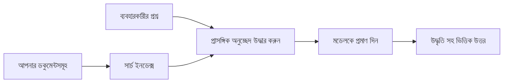

# আপনার ডকুমেন্টের ভিত্তিতে প্রশ্নের উত্তর দিতে AI কে শেখান:
## সিরিজ ১: RAG, Azure বনাম ওপেন-সোর্স বিকল্পগুলি, এবং কখন ফাইন-টিউনিং যুক্তিযুক্ত

> ২০২৬ সালের একটি সিরিজের প্রথম নিবন্ধ যা আমার ২০২৩ সালের Azure AI Search + Azure OpenAI ডকুমেন্ট QA টিউটোরিয়ালগুলি পুনর্বিবেচনা করছে।

সিরিজ নেভিগেশন: [রিপোজিটরি হোম](../README.md) | পরবর্তী: [সিরিজ ২ - সম্পূর্ণ স্থানীয় ওপেন-সোর্স RAG সিস্টেম নির্মাণ](./series-2-open-source-rag-end-to-end.md)

## ১. পরিচিতি - পূর্ববর্তী একটি RAG টিউটোরিয়াল পুনরায় দেখা

২০২৩ সালে, আমি Azure AI Search এবং Azure OpenAI ব্যবহার করে PDF ডকুমেন্ট থেকে প্রশ্নের উত্তর দেওয়ার জন্য ChatGPT কে শেখানোর দুটি টিউটোরিয়ালে কাজ করেছিলাম। আমি [LangChain সংস্করণ](https://techcommunity.microsoft.com/blog/educatordeveloperblog/teach-chatgpt-to-answer-questions-using-azure-ai-search--azure-openai-lang-chain/3969713) লিখেছিলাম, এবং আমি [Lee Stott](https://developer.microsoft.com/en-us/advocates/lee-stott), মাইক্রোসফটের একজন প্রিন্সিপাল ক্লাউড অ্যাডভোকেট ম্যানেজারের সহ-লেখক হিসেবে [Semantic Kernel সংস্করণ](https://techcommunity.microsoft.com/blog/educatordeveloperblog/teach-chatgpt-to-answer-questions-using-azure-ai-search--azure-openai-semantic-k/3985395) লিখেছিলাম। তখন "আপনার ডেটার উপর ChatGPT" ধারণাটি অনেক ডেভেলপারের জন্য এখনও নতুন ছিল। টিউটোরিয়ালগুলি Azure Blob Storage, Azure AI Search, Azure OpenAI, LangChain, Semantic Kernel, এবং FAISS-স্টাইল ভেক্টর retrieval ব্যবহার করেছিল PDF ফাইল থেকে প্রশ্নের উত্তর দিতে।

সেই পূর্ববর্তী নিবন্ধটি একটি সহজ কিন্তু গুরুত্বপূর্ণ ওয়ার্কফ্লোর উপর ফোকাস করেছিল: ডকুমেন্ট আপলোড করা, ইনডেক্স করা, সম্পর্কিত বিষয়বস্তু ফেরত নেওয়া, এবং একটি মডেলকে সেই বিষয়বস্তু ভিত্তিক উত্তর দিতে বলা।

২০২৬ সালে, RAG ইকোসিস্টেম উল্লেখযোগ্যভাবে বৃদ্ধি পেয়েছে। Azure AI Search এখন আধুনিক ভেক্টর এবং হাইব্রিড retrieval প্যাটার্নগুলো সমর্থন করে, Azure OpenAI বিস্তৃত Microsoft Foundry Models ইকোসিস্টেমের অংশ, এবং নতুন v1 API স্ট্যান্ডার্ড OpenAI ক্লায়েন্ট ব্যবহার করতে পারে মাসিক `api-version` পরিবর্তনের প্রয়োজন ছাড়াই। একই সময়ে, ওপেন-সোর্স বিকল্প যেমন LangGraph, LlamaIndex, Haystack, Qdrant, Milvus, Weaviate, Chroma, Ollama, এবং vLLM বাস্তব RAG সিস্টেমের জন্য ব্যবহারযোগ্য পছন্দ হয়ে উঠেছে।

সুতরাং আমি এই বিষয়টি পুনর্বিবেচনা করতে চেয়েছিলাম। প্রশ্ন আর শুধু "আমি কিভাবে RAG তৈরি করব?" নয়। এখন অনেক উপায়ে এটি তৈরি করা যায়, এবং সবচেয়ে গুরুত্বপূর্ণ প্রশ্ন হলো "আমার পরিস্থিতির জন্য কোন আর্কিটেকচারটি নির্বাচন করা উচিত?"

কিন্তু মূল সমস্যা অপরিবর্তিত।

একটি AI মডেল স্বয়ংক্রিয়ভাবে আপনার ডকুমেন্ট জানে না। একটি উপকারী ডকুমেন্ট-কোয়েশ্চন-আন্সারিং সিস্টেম তৈরির জন্য আপনাকে এখনও নির্ভরযোগ্য retrieval, গ্রাউন্ডিং, মূল্যায়ন, এবং অপারেশনাল ওয়ার্কফ্লো প্রয়োজন।

এই নিবন্ধটি আরেকটি সম্পূর্ণ "PDF নিয়ে চ্যাট" টিউটোরিয়াল নয়। আমি এই আপডেটেড সিরিজ শুরু করতে চাই এমন প্রশ্ন থেকে যা এখন আমার জন্য বেশি গুরুত্বপূর্ণ: কখন আপনি একটি ম্যানেজড Azure আর্কিটেকচার নির্বাচন করবেন, কখন ওপেন-সোর্স RAG স্ট্যাক বেছে নেবেন, এবং কখন ফাইন-টিউনিং প্রয়োগ করা যুক্তিযুক্ত?

এই সিরিজের প্রথম নিবন্ধে আমরা আর্কিটেকচার সিদ্ধান্তগুলো নিয়ে আলোচনা করব: কেন RAG প্রয়োজন, কখন Azure-ভিত্তিক ম্যানেজড সেবা ব্যবহার উপকারী, কখন ওপেন-সোর্স বিকল্প যুক্তিযুক্ত, এবং ফাইন-টিউনিং কোথায় মানায়।

ডকুমেন্ট QA সিস্টেম তৈরি ও পুনর্বিবেচনা করার পর, আমি এখন আর দেখা-শুনা কেমন হয় তার চেয়ে বেশি আগ্রহী বাস্তব ব্যবহারকারী, পরিবর্তনশীল ডকুমেন্ট, অনুমতি, ব্যর্থতা, এবং রক্ষণাবেক্ষণের সঙ্গে কোন আর্কিটেকচার টিকে রয়েছে।

## ২. কেন আপনার AI-কে একটি সার্চ সিস্টেমের প্রয়োজন

বৃহৎ ভাষা মডেলগুলো প্রশিক্ষিত হয় বিস্তৃত পাবলিক এবং লাইসেন্সকৃত ডেটার উপর। তারা সাধারণ বিষয়ে অনেক কিছুই জানে, কিন্তু স্বয়ংক্রিয়ভাবে আপনার ব্যক্তিগত PDF, অভ্যন্তরীণ নীতি, এন্টারপ্রাইজ প্রক্রিয়া, গবেষণা আর্কাইভ, ক্লাসরুম সামগ্রী, কাস্টমার সাপোর্ট নোট, অথবা সম্প্রতি হালনাগাদ ডকুমেন্টেশন জানে না।

RAG-কে সহজভাবে ভাবা যায় এভাবেই: মডেল থেকে প্রত্যাশা করা হয় না যে এটি প্রতিটি ডকুমেন্ট মনে রাখবে, বরং আমরা এটিকে একটি সার্চ সিস্টেম দেই। যখন ইউজার প্রশ্ন করে, সিস্টেম প্রথমে সবচেয়ে প্রাসঙ্গিক তথ্যের অংশগুলো খুঁজে বের করে, তারপর সেই অংশগুলো মডেলকে প্রসঙ্গ হিসাবে দেয়।

এটি গুরুত্বপূর্ণ কারণ অনেক বাস্তব জ্ঞানের উৎস ব্যক্তিগত, ক্রমাগত পরিবর্তনশীল, অনুমতি-সংবেদনশীল, একাধিক সিস্টেমের মধ্যে সংরক্ষিত, বিভিন্ন ফরম্যাটে লেখা, এবং প্রম্পটে সরাসরি পেস্ট করার জন্য অনেক বড়।

উদাহরণস্বরূপ, যদি কোনও স্কুল, কোম্পানি, বা গবেষণা দল ১০,০০০ অভ্যন্তরীণ ডকুমেন্ট রাখে, মডেল ওই ডকুমেন্ট থেকে নির্ভরযোগ্যভাবে উত্তর দিতে পারবে না যতক্ষণ না সিস্টেম সঠিক সময়ে সঠিক অংশগুলো খুঁজে দেয়।

এটি স্বাভাবিকভাবেই একটি সাধারণ প্রশ্ন জন্মায়:

কেন শুধু ফাইন-টিউনিং করা যায় না?

ফাইন-টিউনিং উপকারী হতে পারে, কিন্তু এটা সাধারণত ডকুমেন্ট জ্ঞানের জন্য সঠিক প্রথম টুল নয়। যদি জ্ঞান প্রায়ই পরিবর্তিত হয়, যদি উত্সাদি (citation) গুরুত্বপূর্ণ হয়, বা যদি অ্যাক্সেস অনুমতি গুরুত্বপূর্ণ হয়, তাহলে সাধারণত RAG শুরু করার উপযুক্ত পদ্ধতি। ফাইন-টিউনিং আরও ভালো আচরণ, স্টাইল, আউটপুট ফরম্যাট, এবং টাস্ক প্যাটার্ন শেখানোর জন্য উপযোগী।

## ৩. বাস্তবে RAG আর্কিটেকচার

ধরুন, আপনি একটি স্কুলের জন্য AI অ্যাসিস্ট্যান্ট তৈরি করছেন। অ্যাসিস্ট্যান্টকে নীতি PDFs, কোর্স গাইড, অভ্যন্তরীণ FAQ পেজ, এবং সম্প্রতি হালনাগাদ হওয়া ঘোষণা থেকে প্রশ্নের উত্তর দিতে হবে।

যদি একজন ছাত্র প্রশ্ন করেন, "আমি কি আমার চূড়ান্ত অ্যাসাইনমেন্টে generative AI ব্যবহার করতে পারি?", সিস্টেম মডেলের সাধারণ মেমোরি থেকে উত্তর দেওয়া উচিত নয়। এটি প্রথমে প্রাসঙ্গিক স্কুল নীতি খুঁজবে, AI ব্যবহারের অংশটি বের করবে, তারপর মডেলকে সেই প্রমাণ সহ উত্তর দিতে বলবে।

এটাই RAG বাস্তবে।

উচ্চ পর্যায়ে, প্রবাহ এভাবে ভাবা যায়:

বিস্তারিত আরও জটিল হতে পারে, কিন্তু মূল ধারণা সহজ: মডেল একা উত্তর দেয় না। এটি অনুসন্ধানকৃত প্রমাণের সঙ্গে উত্তর দেয়।

প্রথমে, ডকুমেন্টগুলো Azure Blob Storage, SharePoint, GitHub, বা অভ্যন্তরীণ CMS-এর মত স্টোরেজ সিস্টেম থেকে গ্রহণ করা হয়। তারপর সিস্টেম সেগুলোকে টেক্সটে রূপান্তর করে, যেখানে হেডিং, পৃষ্ঠা নম্বর, টেবিল, বিভাগ, এবং উৎস অবস্থান মতো গুরুত্বপূর্ণ কাঠামো সংরক্ষণ করা হয়।

পরবর্তী ধাপে, বিষয়বস্তু ছোট ছোট অংশে ভাগ করা হয়। এই ধাপটি সহজ শোনালেও এটা সবচেয়ে গুরুত্বপূর্ণ অংশগুলোর এক। যদি অংশ খুব ছোট হয়, তাহলে পারিপার্শ্বিক প্রসঙ্গ হারাতে পারে। যদি অংশ খুব বড় হয়, তাহলে অপ্রাসঙ্গিক তথ্য অন্তর্ভুক্ত হতে পারে এবং retrieval কম নির্ভুল হয়।

বিভাজনের পর, সিস্টেম এমবেডিং তৈরি করে এবং সেগুলোকে একটি সার্চেবল ইনডেক্সে সংরক্ষণ করে, সাথে মূল টেক্সট এবং মেটাডাটা যেমন ফাইলের নাম, পৃষ্ঠা নম্বর, অনুমতি, ডকুমেন্ট সংস্করণ, এবং উৎস URL।

যখন ব্যবহারকারী প্রশ্ন করে, সিস্টেম কীওয়ার্ড সার্চ, ভেক্টর সার্চ, বা হাইব্রিড সার্চ ব্যবহার করে প্রার্থী অংশগুলো ফেরত আনে। একটি reranker সেগুলো পুনর্বিন্যাস করতে পারে যাতে সবচেয়ে কার্যকর প্রমাণ উপরের দিকে থাকে।

শেষে, মডেল প্রশ্ন এবং ফেরত নেওয়া প্রমাণ পায়। উত্তর অবশ্যই সেই প্রমাণে ভিত্তি করে হতে হবে এবং উত্সাদি প্রদান করতে হবে যাতে ব্যবহারকারী উৎস পরীক্ষা করতে পারে।

গুরুত্বপূর্ণ বিষয় হলো RAG মানে কেবল "PDF গুলোকে একটি ভেক্টর ডাটাবেজে পূরণ করা নয়।" উত্তরের মান পুরো ওয়ার্কফ্লো এর ওপর নির্ভর করে: পার্সিং, বিভাজন, retrieval, reranking, prompting, citation, এবং মূল্যায়ন।

এইজন্য ডকুমেন্ট কাঠামো গুরুত্বপূর্ণ। একটি PDF-তে হেডিং, টেবিল, ফূটনোট, বা পৃষ্ঠা সীমানা একটি অংশের অর্থ বদলে দিতে পারে। Azure-তে, Document Layout skill Azure Document Intelligence এর লেআউট ক্ষমতা ব্যবহার করে কাঠামো-সচেতন আউটপুট উৎপন্ন করে, যা RAG সিস্টেমের জন্য ভাগকরণ এবং retrieval এর মান উন্নত করতে পারে।

## ৪. ২০২৩ থেকে এখন পর্যন্ত কি পরিবর্তন হয়েছে?

২০২৩ সালের টিউটোরিয়াল তখনকার জন্য একটি ভালো শুরু ছিল:

- Azure Blob Storage PDF ফাইল সংরক্ষণ করেছিল।
- Azure AI Search বিষয়বস্তু ইনডেক্স করেছিল।
- LangChain Retrieval কে Azure OpenAI এর সাথে সংযুক্ত করেছিল।
- FAISS একটি সহজ স্থানীয় ভেক্টর স্টোর হিসেবে কাজ করেছিল।
- উদাহরণে `gpt-35-turbo` এবং `text-embedding-ada-002` ব্যবহার করা হয়েছিল।

২০২৬ সালে, আধুনিক সংস্করণ বেশ কয়েকটি পরিবর্তন প্রতিফলিত করা উচিত।

প্রথমত, retrieval পরিণত হয়েছে। ২০২৩ সালে অনেক ডেমো সহজ ভেক্টর সাদৃশ্য অনুসন্ধান ব্যবহার করতো। আজকাল, হাইব্রিড retrieval সাধারণত গুরুতর ডকুমেন্ট QA’র জন্য ডিফল্ট। Azure AI Search কীওয়ার্ড এবং ভেক্টর কোয়েরি একত্রিত করে হাইব্রিড সার্চ সমর্থন করে, এবং ফলাফলগুলি Reciprocal Rank Fusion দিয়ে মার্জ করে। Semantic ranker পূর্ণ-টেক্সট, ভেক্টর, এবং হাইব্রিড ফলাফলগুলোর টেক্সট অংশকে rerank করতে পারে।

দ্বিতীয়ত, গ্রহণ প্রক্রিয়া আরও জটিল। প্রতিটি ডকুমেন্টকে অ্যাপ্লিকেশন কোড ব্যবহার করে ম্যানুয়ালি ভাগ করার বদলে, Azure AI Search chunking, embedding, এবং query-time vectorization এর জন্য একীকৃত vectorization সমর্থন করে। PDF এবং ডকুমেন্ট-ভারী ওয়ার্কলোডের জন্য Document Layout skill স্থির আকারের ভাগের চেয়ে বেশি কাঠামো সংরক্ষণ করতে পারে।

তৃতীয়ত, অর্কেস্ট্রেশন আরো গুরুত্বপূর্ণ। কঠিন অংশ সাধারণত LLM API কল নয়। কঠিন অংশ হল ব্যর্থতা, রিট্রাই, পুরানো retrieval, chunk quality, দীর্ঘমেয়াদী ওয়ার্কফ্লো, মানব পর্যালোচনা, এবং স্কেল লেভেলে মূল্যায়ন পরিচালনা। এর জন্য LangGraph, LlamaIndex workflow, Haystack pipeline, এবং প্ল্যাটফর্ম-লেভেল মূল্যায়ন ও পর্যবেক্ষণ টুলস একক লাইনার চেইনের থেকে বেশি প্রাসঙ্গিক হয়।

চতুর্থত, মূল্যায়ন আর ঐচ্ছিক নয়। একটি ডেমো একটি প্রশ্নে প্রভাবশালী দেখাতে পারে। একটি প্রোডাকশন সিস্টেমের প্রয়োজন টেস্ট সেট, রিগ্রেশন চেক, retrieval মেট্রিকস, groundedness চেক, এবং মনি্টরিং। মূল্যায়ন ছাড়া জানা কঠিন সিস্টেম উন্নত হচ্ছে কি না শুধুমাত্র পরিবর্তিত হচ্ছে।

## ৫. Azure ও ওপেন-সোর্স RAG স্ট্যাকের মধ্যে পছন্দ

আমি মনে করি না প্রাসঙ্গিক প্রশ্ন হল "Azure কি ওপেন-সোর্সের থেকে ভালো?" অথবা "ওপেন-সোর্স কি Azure থেকে ভালো?"

প্রাসঙ্গিক প্রশ্ন হল: আপনি কী ধরনের সিস্টেম তৈরি করছেন, কে এটি পরিচালনা করবে, আপনার কী সীমাবদ্ধতা আছে, এবং কোন ব্যর্থতা গ্রহণযোগ্য নয়?

যখন আমি ডকুমেন্ট QA উদাহরণ তৈরি শুরু করেছিলাম, মূলত retrieval কাজ করছে কিনা ভাবতাম। আমি কি PDF আপলোড করতে পারি, সার্চ করতে পারি, এবং উত্তর জেনারেট করতে পারি? সেটা ছিল যৌক্তিক শুরু।

বহু বাস্তব AI ওয়ার্কফ্লো কাজ করার পর, আমার মূল্যায়ন পরিবর্তিত হয়েছে। এখন আমি RAG স্ট্যাক নির্বাচন করার আগে চারটি বিষয়ে নজর রাখি:

- পরিচয় ও অনুমতি
- retrieval মান
- ওয়ার্কফ্লো নির্ভরযোগ্যতা
- অপারেশনাল মালিকানা

এই চারটি ক্ষেত্র মডেল বেঞ্চমার্কের চেয়ে অনেক বেশি তথ্য দেয়।

Azure ভিত্তিক আর্কিটেকচার সাধারণত তৈরী করে যখন এন্টারপ্রাইজ ইন্টিগ্রেশন কঠিন হয়। যদি একটি দল ইতিমধ্যে Microsoft Entra ID, Microsoft 365, Azure Storage, প্রাইভেট নেটওয়ার্কিং, RBAC, এবং Azure মনিটরিং-এ নির্ভরশীল হয়, তাহলে Azure AI Search এবং Azure OpenAI অপারেশনাল জটিলতা অনেকটা কমিয়ে দেয়। সেই পরিবেশে Azure শুধু মডেল API নয়। মূল মান চারপাশের সিস্টেম: পরিচয়, গভর্নেন্স, ম্যানেজড সার্চ, সিকিউরিটি ইন্টিগ্রেশন, সাপোর্ট, এবং পরিচিত অপারেশন।

ওপেন-সোর্স আর্কিটেকচার সাধারণত যুক্তিযুক্ত যখন নমনীয়তা কঠিন হয়। যদি দলকে স্থানীয় inference, ক্লাউড পোর্টেবিলিটি, কাস্টম retrieval পাইপলাইন, বিশেষ reranking, বা ভেক্টর ডাটাবেজ ও মডেল-সার্ভিং লেয়ার সরাসরি নিয়ন্ত্রণ করতে হয়, তখন ওপেন-সোর্স স্ট্যাক ভালো ফিট। তবে ট্রেডঅফ হল টিমকে আরও বেশি নির্ভরযোগ্যতার কাজ নিজে নিতে হবে: ব্যাকআপ, স্কেলিং, লেটেন্সি, মাইগ্রেশন, মনিটরিং, এবং সিকিউরিটি।

বাস্তবে, অনেক প্রোডাকশন AI সিস্টেম সম্পূর্ণ ক্লাউড-নেটিভ বা সম্পূর্ণ ওপেন-সোর্স নয়। তারা প্রায়শই হাইব্রিড সিস্টেম যা অপারেশনাল সহজতা, পোর্টেবিলিটি, গভর্নেন্স, এবং ইঞ্জিনিয়ারিং নমনীয়তার মধ্যে ভারসাম্য রক্ষা করে।

উদাহরণস্বরূপ, আমি আশ্চর্য হওয়ার কথা নয় যদি একটি সিস্টেম Azure OpenAI ব্যবহার করে মডেল অ্যাক্সেসের জন্য, LangGraph ওয়ার্কফ্লো অর্কেস্ট্রশনের জন্য, Azure হোস্টিং ডিপ্লয়মেন্টের জন্য, এবং একটি ওপেন-সোর্স ভেক্টর ডাটাবেজ নির্দিষ্ট retrieval প্রয়োজনের জন্য ব্যবহার করে। সেটি আর্কিটেকচারাল অসামঞ্জস্য নয়। এটি প্রতিটি অংশের জন্য সঠিক মাত্রার ম্যানেজড সেবা এবং ইঞ্জিনিয়ারিং নিয়ন্ত্রণ নির্বাচন।

আমি হাইব্রিড আর্কিটেকচার পছন্দ করি যখন ম্যানেজড প্ল্যাটফর্ম গুরুত্বপূর্ণ এন্টারপ্রাইজ সমস্যা সমাধান করে, আর ওপেন-সোর্স কম্পোনেন্টগুলি টিমকে নমনীয়তা দেয় যেখানে তা প্রকৃতপক্ষে দরকার।

## ৬. একটি ব্যবহারিক সিদ্ধান্ত নির্দেশিকা

এখানে একটি সিদ্ধান্ত তালিকা যা আমি একটি টিমের সাথে একটি RAG স্ট্যাক চয়ন করার আগে ব্যবহার করব:

| সিদ্ধান্ত ক্ষেত্র | Azure ম্যানেজড স্ট্যাক শক্তিশালী যখন... | ওপেন-সোর্স স্ট্যাক শক্তিশালী যখন... |
| --- | --- | --- |
| পরিচয় ও অ্যাক্সেস | Entra ID, RBAC, ম্যানেজড পরিচয়, এবং এন্টারপ্রাইজ অনুমতিগুলো কেন্দ্রীয় | কাস্টম অথ, অ-মাইক্রোসফট পরিচয়, বা অ্যাপ-নির্দিষ্ট অ্যাক্সেস লজিক প্রাধান্য পায় |
| অপারেশন | দল ম্যানেজড অবকাঠামো, সাপোর্ট, SLA, এবং সহজ অনবোর্ডিং চায় | দল ভেক্টর ডাটাবেস, মডেল সার্ভিং, ব্যাকআপ, এবং স্কেলিং পরিচালনা করতে পারে |
| রিট্রিভাল | হাইব্রিড সার্চ, সেম্যান্টিক র‍্যাংকিং, ফিল্টার, এবং মেটাডাটা সার্চ অধিকাংশ চাহিদা পূরণ করে | দলকে কাস্টম রিট্রিভাল, বিশেষ reranking, বা পরীক্ষামূলক ইনডেক্সিং দরকার |
| পোর্টেবিলিটি | Azure ইকোসিস্টেমের সাথে সঙ্গতি গ্রহণযোগ্য বা পছন্দসই | ক্লাউড লক-ইন পরিহার করাটা কঠিন শর্ত |
| ইনফেরেন্স | Azure OpenAI গভর্নেন্স, নেটওয়ার্কিং, এবং এন্টারপ্রাইজ নিয়ন্ত্রণ গুরুত্বপূর্ণ | স্থানীয় ইনফেরেন্স, কাস্টম মডেল, অথবা স্ব-হোস্টেড সার্ভিং প্রয়োজন |
| খরচ | ইঞ্জিনিয়ারিং এবং অপারেশনাল চেষ্টা হ্রাস করা বেশি জরুরি | পর্যাপ্ত বড় স্কেল যাতে অবকাঠামো অপটিমাইজেশন যুক্তিযুক্ত হয় |
| পরীক্ষা-নিরীক্ষা | স্থিতিশীলতা এবং এন্টারপ্রাইজ ইন্টিগ্রেশন ঘনঘন পরিবর্তনের থেকেও বেশি গুরুত্বপূর্ণ | দল দ্রুত এজেন্ট, টুল, মেমোরি, এবং retrieval ওয়ার্কফ্লো উন্নয়ন করছে |

আমার সহজ নিয়ম হল:

- এন্টারপ্রাইজ ইন্টিগ্রেশন, সিকিউরিটি, এবং অপারেশনাল সহজতা প্রধান ঝুঁকি হলে Azure দিয়ে শুরু করুন।
- পোর্টেবিলিটি, কাস্টমাইজেশন, বা স্থানীয় নিয়ন্ত্রণ প্রধান ঝুঁকি হলে ওপেন-সোর্স দিয়ে শুরু করুন।
- দুইই সত্য হলে হাইব্রিড স্ট্যাক ব্যবহার করুন।

এজন্য আমি ২০২৬ সালের RAG সিরিজ কোড থেকে শুরু করব না। কোড গুরুত্বপূর্ণ, কিন্তু আর্কিটেকচার নির্বাচন ইমপ্লিমেন্টেশনের আগে আসে। একটি সহজ ডেমো সবচেয়ে কঠিন পছন্দগুলো লুকিয়ে রাখতে পারে। একটি ভালো RAG সিস্টেম ঐ পছন্দগুলো স্পষ্ট করে তোলে।

## ৭. ফাইন-টিউনিং কোথায় মানায়

ফাইন-টিউনিং প্রায়শই RAG-এর সঙ্গে একসঙ্গে উল্লেখ করা হয়, কিন্তু আমি মনে করি দুটিকে আলাদা রাখা গুরুত্বপূর্ণ।

RAG সাধারণত ভাল পছন্দ যখন সিস্টেমের নতুন, ব্যক্তিগত, অনুমতি-সংবেদনশীল, বা সোর্স-গ্রাউন্ডেড জ্ঞানের প্রয়োজন হয়। যদি উত্তরে ডকুমেন্ট উদ্ধৃতি দিতে হয়, সাম্প্রতিক আপডেট প্রতিফলিত করতে হয়, বা ব্যবহারকারী-নির্দিষ্ট অ্যাক্সেস নিয়ম মেনে চলতে হয়, retrieval অবশ্যই আর্কিটেকচারের অংশ হওয়া উচিত।
ফাইন-টিউনিং তখনই বেশি উপকারী যখন জ্ঞান মূল সমস্যা না হয়। এটি সাহায্য করতে পারে যখন আপনি চান মডেল একটি নির্দিষ্ট আউটপুট ফরম্যাট অনুসরণ করুক, ডোমেইন-নির্দিষ্ট প্রতিক্রিয়া শৈলী মেলাতে, একটি স্থির কাজ আরও সঙ্গতিপূর্ণভাবে সম্পাদন করতে, অথবা প্রতিটি প্রম্পটে প্রয়োজনীয় নির্দেশনার পরিমাণ কমাতে।

প্রায়োগিকভাবে, দুটোই একসাথে কাজ করতে পারে। একটি সাপোর্ট অ্যাসিস্ট্যান্ট আধুনিক নীতি পুনরুদ্ধার করতে RAG ব্যবহার করতে পারে, যখন একটি ফাইন-টিউনড মডেল কোম্পানির পছন্দসই উত্তর কাঠামো এবং সুর শিখে।

ভুল হলো ফাইন-টিউনিংকে একটি ডকুমেন্ট স্টোরের বিকল্প হিসেবে দেখা। এটি পুনরুদ্ধারের প্রয়োজনীয়তা দূর করে না যখন সিস্টেমকে নতুন, ব্যক্তিগত, বা অনুমতি-সংবেদনশীল ডেটা থেকে উত্তর দিতে হয়।

## ৮. এই সিরিজের পরবর্তী গন্তব্য

এই নিবন্ধটি হলো সিদ্ধান্তগ্রহণের স্তর। কোড লেখার আগে, আমি ট্রেডঅফগুলো স্পষ্ট করতে চেয়েছিলাম: RAG বনাম ফাইন-টিউনিং, Azure বনাম ওপেন সোর্স, পরিচালিত সেবা বনাম অপারেশনাল নিয়ন্ত্রণ।

বাস্তবায়নের দিকে এগোবার আগে, আমি এখানে একটি পয়েন্ট রাখতে চাই: অনেক এন্টারপ্রাইজ AI সিস্টেমে, মডেল শুধুমাত্র একটি উপাদান। পুনরুদ্ধারের গুণমান, অর্কেস্ট্রেশন, মূল্যায়ন, অনুমতি, এবং অপারেশনাল নির্ভরযোগ্যতাই প্রায়শই নির্ধারণ করে সিস্টেম ডেমো স্তর ছাড়িয়ে সফল হয় কিনা।

এই সিরিজের পরবর্তী অংশগুলোতে, আমি ডকুমেন্ট-ভিত্তিক AI সিস্টেমের ব্যবহারিক দিক নিয়ে গভীরভাবে আলোচনা করব: প্রথমে একটি স্থানীয় ওপেন-সোর্স RAG ওয়ার্কফ্লো তৈরি করব, তারপর একই দৃশ্যপট Azure AI Search এবং Azure OpenAI দিয়ে পুনর্নির্মাণ করব, এবং তারপর মূল্যায়ন করব সিস্টেমটি প্রকৃতপক্ষে কাজ করছে কিনা।

সিরিজের বিকাশের সাথে আমি ক্রম পরিবর্তন করতে পারি, কিন্তু লক্ষ্য একই থাকবে: একটি সাধারণ ডেমোর বাইরে গিয়ে দেখানো কীভাবে টেকসই, মূল্যায়নযোগ্য, এবং পরিচালনাযোগ্য RAG সিস্টেম গড়ে তোলা যায়।

## ৯. রেফারেন্স এবং রিসোর্সেস

মূল টিউটোরিয়াল:

- [Teach ChatGPT to Answer Questions: Using Azure AI Search & Azure OpenAI (Lang Chain)](https://techcommunity.microsoft.com/blog/educatordeveloperblog/teach-chatgpt-to-answer-questions-using-azure-ai-search--azure-openai-lang-chain/3969713)
- [Teach ChatGPT to Answer Questions: Using Azure AI Search & Azure OpenAI (Semantic Kernel)](https://techcommunity.microsoft.com/blog/educatordeveloperblog/teach-chatgpt-to-answer-questions-using-azure-ai-search--azure-openai-semantic-k/3985395)

Azure:

- [Azure AI Search REST API versions](https://learn.microsoft.com/en-us/rest/api/searchservice/search-service-api-versions)
- [Hybrid search in Azure AI Search](https://learn.microsoft.com/en-us/azure/search/hybrid-search-how-to-query)
- [Integrated vectorization in Azure AI Search](https://learn.microsoft.com/en-us/azure/search/vector-search-integrated-vectorization)
- [Document Layout skill in Azure AI Search](https://learn.microsoft.com/en-us/azure/search/cognitive-search-skill-document-intelligence-layout)
- [Chunk and vectorize by document layout](https://learn.microsoft.com/en-us/azure/search/search-how-to-semantic-chunking)
- [Semantic ranking in Azure AI Search](https://learn.microsoft.com/en-us/azure/search/semantic-search-overview)
- [Azure OpenAI / Microsoft Foundry API version lifecycle](https://learn.microsoft.com/en-us/azure/foundry/openai/api-version-lifecycle)
- [Foundry Models sold by Azure](https://learn.microsoft.com/en-us/azure/foundry/foundry-models/concepts/models-sold-directly-by-azure)
- [Microsoft Foundry fine-tuning considerations](https://learn.microsoft.com/en-us/azure/foundry/openai/concepts/fine-tuning-considerations)
- [Microsoft Foundry observability](https://learn.microsoft.com/en-us/azure/foundry/concepts/observability)
- [Run evaluations in Microsoft Foundry](https://learn.microsoft.com/en-us/azure/foundry/how-to/evaluate-generative-ai-app)

ওপেন-সোর্স:

- [LangGraph documentation](https://docs.langchain.com/oss/python/langgraph/overview)
- [LlamaIndex documentation](https://developers.llamaindex.ai/python/framework/)
- [Haystack documentation](https://docs.haystack.deepset.ai/)
- [Qdrant documentation](https://qdrant.tech/documentation/overview/)
- [Milvus documentation](https://milvus.io/docs/overview.md)
- [Weaviate documentation](https://docs.weaviate.io/weaviate/current/)
- [Chroma documentation](https://docs.trychroma.com/docs/overview/introduction)
- [Ollama embeddings](https://docs.ollama.com/capabilities/embeddings)
- [vLLM OpenAI-compatible server](https://docs.vllm.ai/en/latest/serving/openai_compatible_server.html)
- [BGE embedding models](https://huggingface.co/BAAI/bge-large-en-v1.5)
- [E5 embedding models](https://huggingface.co/intfloat/e5-large-v2)
- [Instructor embedding models](https://huggingface.co/hkunlp/instructor-large)

পরবর্তী: [Series 2 - Build a Local Open-Source RAG System End to End](./series-2-open-source-rag-end-to-end.md)

---

<!-- CO-OP TRANSLATOR DISCLAIMER START -->
**অস্বীকৃতি**:
এই নথিটি AI অনুবাদ পরিষেবা [Co-op Translator](https://github.com/Azure/co-op-translator) ব্যবহার করে অনূদিত হয়েছে। যদিও আমরা শুদ্ধতার জন্য চেষ্টা করি, অনুগ্রহ করে মনে রাখবেন যে স্বয়ংক্রিয় অনুবাদে ত্রুটি বা অসঙ্গতি থাকতে পারে। মূল নথিটি তার স্বভাষায় কর্তৃত্বপূর্ণ উৎস হিসেবে বিবেচিত হওয়া উচিত। গুরুত্বপূর্ণ তথ্যের জন্য পেশাদার মানব অনুবাদ সুপারিশ করা হয়। এই অনুবাদের ব্যবহারে প্রয়োজনীয় ভুল বোঝাবুঝি বা ভুল ব্যাখ্যার জন্য আমরা দায়বদ্ধ নই।
<!-- CO-OP TRANSLATOR DISCLAIMER END -->