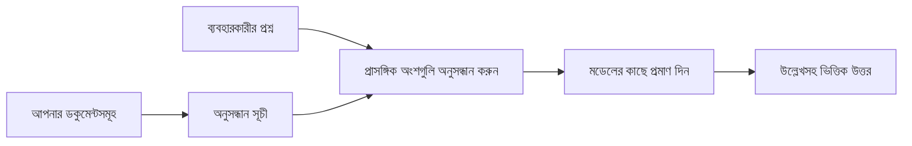

# আপনার ডকুমেন্টের ভিত্তিতে প্রশ্নের উত্তর দিতে AI-কে শেখান:
## সিরিজ ১: RAG, Azure বনাম ওপেন-সোর্স বিকল্প, এবং কখন ফাইন-টিউনিং অর্থবহ

> ২০২৩ সালের আমার Azure AI Search + Azure OpenAI ডকুমেন্ট QA টিউটোরিয়াল পুনঃমূল্যায়নের ২০২৬ সালের প্রথম নিবন্ধ।

## ১. পরিচিতি - আগের RAG টিউটোরিয়াল পুনঃপর্যালোচনা

২০২৩ সালে, আমি দুটি টিউটোরিয়ালের উপর কাজ করেছিলাম যেগুলো ChatGPT-কে Azure AI Search এবং Azure OpenAI ব্যবহার করে PDF ডকুমেন্ট থেকে প্রশ্নের উত্তর দিতে শেখায়। আমি [LangChain সংস্করণটি লিখেছিলাম](https://techcommunity.microsoft.com/blog/educatordeveloperblog/teach-chatgpt-to-answer-questions-using-azure-ai-search--azure-openai-lang-chain/3969713), এবং আমি [Lee Stott](https://developer.microsoft.com/en-us/advocates/lee-stott) - যিনি মাইক্রোসফটের প্রিন্সিপাল ক্লাউড অ্যাডভোকেট ম্যানেজার - সাথে মিলিতভাবে সহ-লেখক ছিলাম [Semantic Kernel সংস্করণটি](https://techcommunity.microsoft.com/blog/educatordeveloperblog/teach-chatgpt-to-answer-questions-using-azure-ai-search--azure-openai-semantic-k/3985395)। তখন, "আপনার ডেটার ওপর ChatGPT" ধারণাটি অনেক ডেভেলপারদের জন্য এখনও নতুন মনে হত। টিউটোরিয়ালগুলো Azure Blob Storage, Azure AI Search, Azure OpenAI, LangChain, Semantic Kernel, এবং FAISS-শৈলীর ভেক্টর রিট্রিভাল ব্যবহার করেছিল PDF ফাইল থেকে প্রশ্নের উত্তর দেওয়ার জন্য।

আগের নিবন্ধটি একটি সরল কিন্তু গুরুত্বপূর্ণ কার্যপ্রবাহে ফোকাস করেছিল: ডকুমেন্ট আপলোড করা, ইনডেক্স করা, প্রাসঙ্গিক বিষয়বস্তু রিট্রিভ করা, এবং মডেলকে সেই বিষয়বস্তু ভিত্তিক উত্তর দিতে বলা।

২০২৬ সালে, RAG ইকোসিস্টেম উল্লেখযোগ্যভাবে বৃদ্ধি পেয়েছে। Azure AI Search এখন আধুনিক ভেক্টর এবং হাইব্রিড রিট্রিভাল প্যাটার্নগুলো সমর্থন করে, Azure OpenAI বৃহত্তর Microsoft Foundry Models ইকোসিস্টেমের অংশ, এবং নতুন v1 API স্ট্যান্ডার্ড OpenAI ক্লায়েন্ট ব্যবহার করতে পারে যেটির জন্য মাসিক `api-version` পরিবর্তন দরকার হয় না। একই সময়ে, ওপেন-সোর্স অপশন যেমন LangGraph, LlamaIndex, Haystack, Qdrant, Milvus, Weaviate, Chroma, Ollama, এবং vLLM বাস্তব RAG সিস্টেমের জন্য ব্যবহারযোগ্য বিকল্প হয়ে উঠেছে।

এই কারণেই আমি এই বিষয়টি পুনরায় দেখার ইচ্ছা পোষণ করেছি। প্রশ্ন আর শুধুমাত্র "আমি কীভাবে RAG তৈরি করব?" নয়। এখন বহু উপায়ে RAG তৈরি করা যায়, এবং সবচেয়ে গুরুত্বপূর্ণ প্রশ্ন হল "আমার পরিস্থিতির জন্য কোন আর্কিটেকচার নির্বাচন করা উচিত?"

কিন্তু মূল সমস্যা পরিবর্তিত হয়নি।

একটি AI মডেল স্বয়ংক্রিয়ভাবে আপনার ডকুমেন্টগুলি জানে না। একটি কার্যকর ডকুমেন্ট-কুয়েরি-উত্তর সিস্টেম নির্মাণ করতে, আপনাকে এখনও নির্ভরযোগ্য রিট্রিভাল, গ্রাউন্ডিং, মূল্যায়ন এবং অপারেশনাল কার্যপ্রবাহ প্রয়োজন।

এই নিবন্ধটি আরেকটি সম্পূর্ণ "PDF-এর সাথে চ্যাট" টিউটোরিয়াল নয়। আমি এই আপডেটেড সিরিজ শুরু করতে চাই সেই প্রশ্ন থেকে যেটা এখন আমার জন্য বেশি গুরুত্বপূর্ন: কখন আপনি একটি ম্যানেজড Azure আর্কিটেকচার নির্বাচন করবেন, কখন ওপেন-সোর্স RAG স্ট্যাক, এবং কখন ফাইন-টিউনিং প্রকৃতপক্ষে অর্থবহ?

এটি ডকুমেন্ট-গ্রাউন্ডেড AI সিস্টেম তৈরির একটি সিরিজের প্রথম নিবন্ধ। এই প্রথম অংশে, আমরা আর্কিটেকচার সিদ্ধান্তের উপর মনোনিবেশ করব: কেন RAG গুরুত্বপূর্ণ, কখন Azure-ভিত্তিক ম্যানেজড সার্ভিস ব্যবহার উপকারী, কখন ওপেন-সোর্স বিকল্প অর্থবহ, এবং ফাইন-টিউনিং কোথায় উপযুক্ত।

ডকুমেন্ট QA সিস্টেম তৈরি এবং পুনঃপর্যালোচনার পরে, আমি বর্তমানে ডেমোতে কোন টুলটি সেরা দেখায় তার চেয়ে বেশি আগ্রহী যে কোন আর্কিটেকচার বাস্তব ব্যবহারকারী, পরিবর্তনশীল ডকুমেন্ট, অনুমতি, ব্যর্থতা এবং রক্ষণাবেক্ষণের মধ্যে বাঁচতে পারে।

## ২. কেন আপনার AI-কে একটি সার্চ সিস্টেমের প্রয়োজন

বৃহত্তর ভাষার মডেলগুলো বিস্তৃত পাবলিক ও লাইসেন্সকৃত ডেটাতে প্রশিক্ষিত। তারা সাধারণ বিষয়ে অনেক কিছু জানতে পারে, কিন্তু স্বয়ংক্রিয়ভাবে আপনার ব্যক্তিগত PDF, অভ্যন্তরীণ নীতি, এন্টারপ্রাইজ পদ্ধতি, গবেষণা আর্কাইভ, শ্রেণিকক্ষ উপকরণ, গ্রাহক সহায়তা নোট, অথবা সাম্প্রতিক আপডেটেড ডকুমেন্টেশন জানে না।

RAG নিয়ে সহজভাবে ভাবার একটি উপায় হলো: মডেলকে প্রত্যাশা করার পরিবর্তে যে এটি প্রতিটি ডকুমেন্ট মনে রাখবে, আমরা এটি একটি সার্চ সিস্টেম দিই। যখন একজন ব্যবহারকারী প্রশ্ন করে, সিস্টেম প্রথম প্রতিটি প্রাসঙ্গিক তথ্য খুঁজে বের করে, তারপর সেই অংশগুলো মডেলের কাছে প্রসঙ্গ হিসেবে দেয়।

এটি গুরুত্বপূর্ণ কারণ অনেক বাস্তব বিশ্বের জ্ঞানের উৎসগুলো হয় বেসরকারী, ক্রমাগত পরিবর্তনশীল, অনুমতি-সংবেদনশীল, একাধিক সিস্টেম জুড়ে সংরক্ষিত, বিভিন্ন ফরম্যাটে লেখা, এবং প্রম্পটে সরাসরি পেস্ট করার জন্য বড়।

উদাহরণস্বরূপ, যদি একটি স্কুল, কোম্পানি, বা গবেষণা দল ১০,০০০ অভ্যন্তরীণ ডকুমেন্ট থাকে, মডেল সেগুলোর থেকে নির্ভরযোগ্যভাবে উত্তর দিতে পারবে না যতক্ষণ না সিস্টেম সঠিক সময়ে সঠিক অংশগুলো রিট্রিভ করে।

এটি স্বাভাবিকভাবে একটি সাধারণ প্রশ্নের দিকে নিয়ে যায়:

কেন শুধু ফাইন-টিউনিং করবো না?

ফাইন-টিউনিং দরকারী হতে পারে, কিন্তু এটি সাধারণত ডকুমেন্ট জ্ঞানের জন্য সঠিক প্রথম টুল নয়। যদি জ্ঞান প্রায়ই পরিবর্তিত হয়, যদি উদ্ধৃতি গুরুত্বপূর্ণ হয়, অথবা যদি প্রবেশাধিকার নিয়ন্ত্রণ জরুরি হয়, তাহলে RAG সাধারণত ভালো শুরু পয়েন্ট। ফাইন-টিউনিং আচরণ, স্টাইল, আউটপুট ফরম্যাট, এবং কাজের প্যাটার্ন শেখানোর জন্য বেশি উপযোগী।

## ৩. RAG আর্কিটেকচার অনুশীলনে

ধরা যাক আপনি একটি স্কুলের জন্য একটি AI সহকারী তৈরি করছেন। সহকারীকে পলিসি PDF, কোর্স গাইড, অভ্যন্তরীণ FAQ পাতা, এবং সাম্প্রতিক আপডেটেড ঘোষণা থেকে প্রশ্নের উত্তর দিতে হবে।

যদি একটি ছাত্র জিজ্ঞাসা করে, "আমি কি আমার শেষ অ্যাসাইনমেন্টে জেনারেটিভ AI ব্যবহার করতে পারি?", সিস্টেমটি মডেলের সাধারণ স্মৃতি থেকে উত্তর দেবে না। এটি প্রথমে প্রাসঙ্গিক স্কুল নীতি খুঁজে বের করবে, AI ব্যবহারের অংশ পুনরুদ্ধার করবে, এবং ওই প্রমাণের সাহায্যে মডেলকে উত্তর দিতে বলবে।

এই হলো RAG বাস্তবে।

একটি উচ্চতর স্তরে, আপনি প্রবাহ এভাবে ভাবতে পারেন:

বিস্তারিত আরও জটিল হতে পারে, কিন্তু মূল ধারণাটি সহজ: মডেল একা উত্তর দেয় না। এটি পুনরুদ্ধারকৃত প্রমাণসহ উত্তর দেয়।

প্রথমে, ডকুমেন্টগুলো সঞ্চয়স্থল যেমন Azure Blob Storage, SharePoint, GitHub, কিংবা অভ্যন্তরীণ CMS থেকে ইনজেস্ট করা হয়। তারপর সিস্টেম সেগুলো টেক্সটে রূপান্তর করে, এবং হেডিং, পৃষ্ঠা নম্বর, টেবিল, সেকশন, উৎস অবস্থান এর মতো গুরুত্বপূর্ণ গঠন রক্ষা করে।

পরবর্তী ধাপে, বিষয়বস্তু বিভিন্ন খন্ডে বিভক্ত করা হয়। এই ধাপটি সহজ শোনালেও এটি সিস্টেমের সবচেয়ে গুরুত্বপূর্ণ অংশগুলোর একটি। যদি খন্ড খুব ছোট হয়, তাহলে পার্শ্ববর্তী প্রসঙ্গ হারিয়ে যেতে পারে। যদি খুব বড় হয়, তাহলে অপ্রাসঙ্গিক তথ্য অন্তর্ভুক্ত হতে পারে এবং রিট্রিভাল কম সঠিক হয়।

খন্ড বিভাজনের পর, সিস্টেম এমবেডিং তৈরি করে এবং সেগুলো একটি অনুসন্ধানযোগ্য ইনডেক্সে সংরক্ষণ করে, সঙ্গে মূল টেক্সট ও মেটাডাটা যেমন ফাইল নাম, পৃষ্ঠা নম্বর, অনুমতি, ডকুমেন্ট সংস্করণ, এবং উৎস URL থাকে।

যখন ব্যবহারকারী প্রশ্ন করে, সিস্টেম কীওয়ার্ড সার্চ, ভেক্টর সার্চ, অথবা হাইব্রিড সার্চ ব্যবহার করে প্রার্থী খন্ড রিট্রিভ করে। একটি রির্যাংকার ব্যবহার করে ঐ খন্ডগুলোকে পুনরায় সাজানো যেতে পারে যাতে সবচেয়ে দরকারী প্রমাণ শীর্ষে আসে।

সবশেষে, মডেল প্রশ্ন ও রিট্রিভড প্রমাণ পায়। উত্তর সেই প্রমাণে ভিত্তি করে হওয়া উচিত এবং উক্তি সহ ফেরত দেওয়া উচিত যেন ব্যবহারকারী উৎস পরীক্ষা করতে পারে।

গুরুত্বপূর্ণ বিষয় হল RAG শুধুমাত্র "PDF গুলোকে ভেক্টর ডেটাবেজে রাখা" নয়। উত্তরের গুণমান নির্ভর করে পুরো কার্যপ্রবাহের উপর: পার্সিং, খন্ড বিভাজন, রিট্রিভাল, রির্যাংকিং, প্রম্পটিং, উদ্ধৃতি, এবং মূল্যায়ন।

এই কারণেই ডকুমেন্ট গঠন গুরুত্বপূর্ণ। PDF-তে একটি হেডিং, টেবিল, ফুটনোট, বা পৃষ্ঠা সীমানা একটি অংশের অর্থ পরিবর্তন করতে পারে। Azure-তে, Document Layout স্কিল Azure Document Intelligence এর লেআউট সক্ষমতা ব্যবহার করে কাঠামো সচেতন আউটপুট তৈরি করে, যা RAG সিস্টেমের জন্য খন্ড বিভাজন এবং রিট্রিভাল গুণমান উন্নত করতে পারে।

## ৪. ২০২৩ সালের পর থেকে কী পরিবর্তিত হয়েছে?

২০২৩ সালের টিউটোরিয়াল তার সময়ের জন্য একটি ভালো শুরু ছিল:

- Azure Blob Storage PDF ফাইল সংরক্ষণ করত।
- Azure AI Search বিষয়বস্তু ইনডেক্স করত।
- LangChain রিট্রিভালকে Azure OpenAI-এর সাথে সংযুক্ত করত।
- FAISS একটি সহজ স্থানীয় ভেক্টর স্টোর হিসেবে কাজ করত।
- উদাহরণে `gpt-35-turbo` এবং `text-embedding-ada-002` ব্যবহার করা ছিল।

২০২৬ সালের আধুনিক সংস্করণে বেশ কিছু পরিবর্তন অন্তর্ভুক্ত হওয়া উচিত।

প্রথমে, রিট্রিভাল পরিপক্ক হয়েছে। ২০২৩ সালে অনেক ডেমো সহজ ভেক্টর সাদৃশ্য অনুসন্ধান ব্যবহার করত। আজ, গম্ভীর ডকুমেন্ট QA-এর জন্য হাইব্রিড রিট্রিভাল প্রায়ই ডিফল্ট শুরু পয়েন্ট। Azure AI Search কীওয়ার্ড এবং ভেক্টর কুয়েরি একত্রিত করে হাইব্রিড সার্চ সমর্থন করে এবং Reciprocal Rank Fusion ব্যবহার করে ফলাফল একত্রিত করে। Semantic Ranker পূর্ণপাঠ, ভেক্টর, এবং হাইব্রিড ফলাফলগুলোর টেক্সট পার্শ্বকে রির্যাংক করতে পারে।

দ্বিতীয়ত, ইনজেশন আরও জটিল হয়েছে। প্রতিটি ডকুমেন্ট ম্যানুয়ালি বিভক্ত করার পরিবর্তে, Azure AI Search ইন্টিগ্রেটেড ভেক্টরাইজেশন সাপোর্ট করে খন্ড বিভাজন, এমবেডিং, এবং কুয়েরি-সময়ে ভেক্টরাইজেশন। PDF এবং ডকুমেন্ট-ভিত্তিক লোডের জন্য Document Layout স্কিল স্থির-মাপের খন্ডের থেকে বেশি গঠন সংরক্ষণ করতে পারে।

তৃতীয়ত, অর্কেস্ট্রেশন আরও গুরুত্বপূর্ণ। কঠিন অংশ প্রায়ই LLM API কল নয়। কঠিন অংশ হলো ব্যর্থতা, পুনরায় চেষ্টা, পুরাতন রিট্রিভাল, খন্ডের গুণমান, দীর্ঘ সময়ের কার্যপ্রবাহ, মানব পর্যালোচনা, এবং বড় পরিসরে মূল্যায়ন পরিচালনা। এ জন্য কার্যপ্রবাহ-উন্মুখ টুল যেমন LangGraph, LlamaIndex কার্যপ্রবাহ, Haystack পাইপলাইন, এবং প্ল্যাটফর্ম-স্তরের মূল্যায়ন ও পর্যবেক্ষণ টুলগুলি একক লিনিয়ার চেইনের থেকে বেশি প্রাসঙ্গিক হয়।

চতুর্থত, মূল্যায়ন আর ঐচ্ছিক নয়। একটি ডেমো একটি প্রশ্নে প্রভাবশালী দেখাতে পারে। একটি প্রোডাকশন সিস্টেমের পরীক্ষা সেট, রিগ্রেশন চেক, রিট্রিভাল ম্যাট্রিক্স, গ্রাউন্ডেডনেস চেক, এবং মনিটরিং প্রয়োজন। মূল্যায়ন ছাড়া জানা কঠিন যে সিস্টেম উন্নত হচ্ছে না শুধু পরিবর্তন ঘটাচ্ছে।

## ৫. Azure এবং ওপেন-সোর্স RAG স্ট্যাকের মধ্যে পছন্দ

আমি মনে করি প্রশ্নটি "Azure কি ওপেন-সোর্সের থেকে ভালো?" বা "ওপেন-সোর্স কি Azure থেকে ভালো?" নয়।

প্রয়োজনীয় প্রশ্ন হল: আপনি কী ধরনের সিস্টেম তৈরি করছেন, কে এটি পরিচালনা করবে, আপনার কী সীমাবদ্ধতা আছে, এবং কোন ব্যর্থতা মোডগুলো অগ্রহণযোগ্য?

যখন আমি ডকুমেন্ট QA উদাহরণ তৈরি শুরু করেছিলাম, তখন আমি মূলত ভাবতাম রিট্রিভাল কাজ করে কিনা। আমি কি PDF আপলোড করতে পারি, সেগুলো সার্চ করতে পারি, এবং উত্তর তৈরি করতে পারি? এটা যুক্তিসঙ্গত শুরু ছিল।

বেশ বাস্তব AI কার্যপ্রবাহে কাজ করার পরে, আমার মূল্যায়ন পরিবর্তিত হয়েছে। আমি এখন র‍্যাগ স্ট্যাক পছন্দ করার আগে চারটি বিষয়ে নজর দিই:

- পরিচয় এবং অনুমতি
- রিট্রিভাল গুণমান
- কার্যপ্রবাহ নির্ভরযোগ্যতা
- অপারেশনাল মালিকানা

এই চারটি ক্ষেত্র শুধুমাত্র একটি মডেল বেঞ্চমার্ক থেকে অনেক বেশি তথ্য দেয়।

Azure-ভিত্তিক আর্কিটেকচার গুলো সাধারণত তখন উপযুক্ত যখন এন্টারপ্রাইজ ইন্টিগ্রেশন কঠিন। যদি একটি দল Microsoft Entra ID, Microsoft 365, Azure Storage, প্রাইভেট নেটওয়ার্ক, RBAC, এবং Azure মনিটরিং-এর উপর নির্ভর করে, তাহলে Azure AI Search এবং Azure OpenAI অনেক অপারেশনাল জটিলতা কমাতে পারে। এই পরিবেশে Azure শুধুমাত্র একটি মডেল API নয়। মূল্য হল পরিবেষ্টিত সিস্টেম: পরিচয়, গভর্নেন্স, ম্যানেজড সার্চ, সিকিউরিটি ইন্টিগ্রেশন, সাপোর্ট, এবং পরিচিত অপারেশন।

ওপেন-সোর্স আর্কিটেকচার সাধারণত তখন উপযুক্ত যখন নমনীয়তা গুরুতর। যদি দল স্থানীয় ইনফারেন্স, ক্লাউড পোর্টেবিলিটি, একটি কাস্টম রিট্রিভাল পাইপলাইন, বিশেষায়িত রির্যাংকিং, বা সরাসরি ভেক্টর ডেটাবেস এবং মডেল-সার্ভিং স্তরের নিয়ন্ত্রণ প্রয়োজন, তাহলে ওপেন-সোর্স স্ট্যাক ভালো মানিয়ে নিতে পারে। ট্রেড-অফ হল দলের আরও বেশি নির্ভরযোগ্যতা কাজের মালিকানায় থাকা: ব্যাকআপ, স্কেলিং, বিলম্ব, মাইগ্রেশন, মনিটরিং, এবং সুরক্ষা।

বাস্তবে, অনেক প্রোডাকশন AI সিস্টেম চিরস্থায়ী ক্লাউড-নেটিভ বা চিরস্থায়ী ওপেন-সোর্স নয়। তারা প্রায়ই এমন হাইব্রিড সিস্টেম যা অপারেশনাল সরলতা, পোর্টেবিলিটি, গভর্নেন্স, এবং ইঞ্জিনিয়ারিং নমনীয়তার ভারসাম্য রক্ষা করে।

উদাহরণস্বরূপ, আমি অবাক হব না একটি সিস্টেমে Azure OpenAI মডেল অ্যাক্সেসের জন্য, LangGraph ওয়ার্কফ্লো অর্কেস্ট্রেশনের জন্য, Azure হোস্টিং এর জন্য ডিপ্লয়মেন্টে, এবং বিশেষ রিট্রিভাল চাহিদার জন্য ওপেন-সোর্স ভেক্টর ডেটাবেস ব্যবহৃত হতে দেখে। এটি আর্কিটেকচারাল অসঙ্গতি নয়। এটি সিস্টেমের প্রতিটি অংশের জন্য সঠিক managed সার্ভিস এবং ইঞ্জিনিয়ারিং নিয়ন্ত্রণ নির্বাচন।

আমি হাইব্রিড আর্কিটেকচার পছন্দ করি যখন ম্যানেজড প্ল্যাটফর্ম গুরুত্বপূর্ণ এন্টারপ্রাইজ সমস্যা সমাধান করে, আর ওপেন-সোর্স উপাদান দলকে যেখানে সত্যিই প্রয়োজন সেখানে নমনীয়তা দেয়।

## ৬. একটি ব্যবহারিক সিদ্ধান্ত গাইড

এখানে একটি সিদ্ধান্ত টেবিল যা আমি একটি দলের সঙ্গে RAG স্ট্যাক নির্বাচনের আগে ব্যবহার করব:

| সিদ্ধান্ত ক্ষেত্র | Azure ম্যানেজড স্ট্যাক শক্তিশালী যখন... | ওপেন-সোর্স স্ট্যাক শক্তিশালী যখন... |
| --- | --- | --- |
| পরিচয় এবং প্রবেশাধিকার | Entra ID, RBAC, ম্যানেজড পরিচয়, এবং এন্টারপ্রাইজ অনুমতি কেন্দ্রীয় | কাস্টম অথ, নন-মাইক্রোসফট পরিচয়, বা অ্যাপ-নির্দিষ্ট এক্সেস লজিক প্রধান ভূমিকা পালন করে |
| অপারেশন | দল ম্যানেজড অবকাঠামো, সাপোর্ট, SLA, এবং সহজ অনবোর্ডিং চায় | দল ভেক্টর ডেটাবেস, মডেল সার্ভিং, ব্যাকআপ, এবং স্কেলিং পরিচালনা করতে পারে |
| রিট্রিভাল | হাইব্রিড সার্চ, সেম্যান্টিক র‍্যাঙ্কিং, ফিল্টার, এবং মেটাডাটা সার্চ বেশি ব্যবহৃত হয় | দল কাস্টম রিট্রিভাল, বিশেষায়িত রির্যাঙ্কিং, অথবা পরীক্ষামূলক ইনডেক্সিং চাই |
| পোর্টেবিলিটি | Azure ইকোসিস্টেমের সাথে সামঞ্জস্য বা পছন্দযোগ্য | ক্লাউড লক-ইন এড়ানো কঠিন প্রয়োজনীয়তা |
| ইনফারেন্স | Azure OpenAI গভর্নেন্স, নেটওয়ার্কিং, এবং এন্টারপ্রাইজ নিয়ন্ত্রণ জরুরি | স্থানীয় ইনফারেন্স, কাস্টম মডেল, অথবা স্ব-হোস্টেড সার্ভিং প্রয়োজন |
| খরচ | ইঞ্জিনিয়ারিং ও অপারেশন প্রচেষ্টা কমানো জরুরি | পরিমাণ এমন বড় যা অবকাঠামো অপ্টিমাইজেশন যুক্তিযুক্ত করে |
| পরীক্ষা-নিরীক্ষা | স্থিতিশীলতা এবং এন্টারপ্রাইজ ইন্টিগ্রেশন বেশি গুরুত্বপূর্ণ | দল দ্রুত এজেন্ট, টুলস, মেমরি, এবং রিট্রিভাল কার্যপ্রবাহে পরিবর্তন করে |

আমার সহজ নিয়ম:

- এন্টারপ্রাইজ ইন্টিগ্রেশন, নিরাপত্তা, এবং অপারেশনাল সরলতা প্রধান ঝুঁকি হলে Azure দিয়ে শুরু করুন।
- পোর্টেবিলিটি, কাস্টমাইজেশন, বা স্থানীয় নিয়ন্ত্রণ প্রধান ঝুঁকি হলে ওপেন-সোর্স দিয়ে শুরু করুন।
- দুইটাই সত্য হলে হাইব্রিড স্ট্যাক ব্যবহার করুন।

এই কারণেই আমি ২০২৬ সালের RAG সিরিজ কোড দিয়ে শুরু করব না। কোড গুরুত্বপূর্ণ, কিন্তু আর্কিটেকচার নির্বাচন বাস্তবায়নের আগে আসে। একটি সহজ ডেমো সবচেয়ে কঠিন সিদ্ধান্তগুলো লুকিয়ে রাখতে পারে। একটি ভালো RAG সিস্টেম ঐ সিদ্ধান্তগুলো স্পষ্ট করে।

## ৭. ফাইন-টিউনিং কোথায় উপযুক্ত

ফাইন-টিউনিং প্রায়ই RAG-এর সাথে একসাথে উল্লেখ করা হয়, কিন্তু আমি মনে করি দুইটিকে আলাদা করা জরুরি।

RAG সাধারণত উত্তম পছন্দ যখন সিস্টেমকে প্রয়োজন পরিশ্রীক, বেসরকারী, অনুমতি-সংবেদনশীল, বা উৎস-ভিত্তিক জ্ঞান। যদি উত্তরকে ডকুমেন্ট থেকে উদ্ধৃত করতে হয়, সাম্প্রতিক আপডেট প্রতিফলিত করতে হয়, বা ব্যবহারকারীর বিশেষ অ্যাক্সেস নিয়ম মেনে চলতে হয়, রিট্রিভাল অবশ্যই আর্কিটেকচারের অংশ হওয়া উচিত।

ফাইন-টিউনিং বেশি কাজে লাগে যখন জ্ঞান প্রধান সমস্যা নয়। এটি সাহায্য করে মডেলকে একটি নির্দিষ্ট আউটপুট ফরম্যাট অনুসরণ করতে, একটি ডোমেইন-নির্দিষ্ট প্রতিক্রিয়া স্টাইল মেলাতে, একটি স্থিতিশীল কাজ আরও ধারাবাহিকভাবে করতে, বা প্রতিটি প্রম্পটে নির্দেশের পরিমাণ কমাতে।

প্র্যাকটিসে, দুটি একসঙ্গে কাজ করতে পারে। একটি সাপোর্ট সহকারী RAG ব্যবহার করে সর্বশেষ পলিসি পুনরুদ্ধার করতে পারে, যখন একটি ফাইন-টিউনড মডেল কোম্পানির পছন্দসই উত্তর কাঠামো এবং সুর শিখে।

ভুলটি হচ্ছে ফাইন-টিউনিংকে ডকুমেন্ট স্টোরের বিকল্প হিসেবে দেখা। যখন সিস্টেমকে নতুন, ব্যক্তিগত, বা পারমিশন-সংবেদনশীল ডেটা থেকে উত্তর দিতে হয়, তখন রিট্রাইভালের প্রয়োজনীয়তা থাকে।

## ৮. এই সিরিজটি পরবর্তী কোথায় যাবে

এই প্রবন্ধটি সিদ্ধান্ত গ্রহণের স্তর। কোড লেখার আগে আমি ট্রেডঅফগুলিকে স্পষ্ট করতে চেয়েছিলাম: RAG বনাম ফাইন-টিউনিং, Azure বনাম ওপেন সোর্স, ম্যানেজড সার্ভিস বনাম অপারেশনাল কন্ট্রোল।

বাস্তবায়নে যাওয়ার আগে, আমি এখানে একটি পয়েন্ট রাখতে চাই: অনেক এন্টারপ্রাইজ AI সিস্টেমে, মডেল শুধুমাত্র একটি উপাদান। রিট্রাইভাল গুণগত মান, অর্কেস্ট্রেশন, মূল্যায়ন, পারমিশন, এবং অপারেশনাল নির্ভরযোগ্যতাই প্রায়শই নির্ধারণ করে সিস্টেমটি ডেমো স্টেজের বাইরে সফল হয় কিনা।

এই সিরিজের পরবর্তী অংশগুলোতে, আমি ডকুমেন্ট-গ্রাউন্ডেড AI সিস্টেমের ব্যবহারিক দিক নিয়ে গভীরভাবে আলোচনা করার পরিকল্পনা করছি: কীভাবে একটি Azure-ভিত্তিক আর্কিটেকচার তৈরি করবেন, কীভাবে ওপেন-সোর্স বিকল্পগুলি প্র্যাকটিসে তুলনা করে, এবং কীভাবে মূল্যায়ন করবেন একটি RAG সিস্টেম আসলেই কাজ করছে কিনা।

সিরিজটি উন্নয়নের সঙ্গে সঙ্গে আমি ক্রমটি সামঞ্জস্য করতে পারি, কিন্তু লক্ষ্য একই থাকবে: একটি সাধারণ ডেমো থেকে এগিয়ে যাওয়া এবং দেখানো কীভাবে রক্ষণাবেক্ষণযোগ্য, মূল্যায়নযোগ্য, এবং পরিচালনাযোগ্য RAG সিস্টেম সম্পর্কে চিন্তা করা যায়।

## ৯. রেফারেন্স এবং উৎস

মূল টিউটোরিয়ালসমূহ:

- [Teach ChatGPT to Answer Questions: Using Azure AI Search & Azure OpenAI (Lang Chain)](https://techcommunity.microsoft.com/blog/educatordeveloperblog/teach-chatgpt-to-answer-questions-using-azure-ai-search--azure-openai-lang-chain/3969713)
- [Teach ChatGPT to Answer Questions: Using Azure AI Search & Azure OpenAI (Semantic Kernel)](https://techcommunity.microsoft.com/blog/educatordeveloperblog/teach-chatgpt-to-answer-questions-using-azure-ai-search--azure-openai-semantic-k/3985395)

Azure:

- [Azure AI Search REST API versions](https://learn.microsoft.com/en-us/rest/api/searchservice/search-service-api-versions)
- [Hybrid search in Azure AI Search](https://learn.microsoft.com/en-us/azure/search/hybrid-search-how-to-query)
- [Integrated vectorization in Azure AI Search](https://learn.microsoft.com/en-us/azure/search/vector-search-integrated-vectorization)
- [Document Layout skill in Azure AI Search](https://learn.microsoft.com/en-us/azure/search/cognitive-search-skill-document-intelligence-layout)
- [Chunk and vectorize by document layout](https://learn.microsoft.com/en-us/azure/search/search-how-to-semantic-chunking)
- [Semantic ranking in Azure AI Search](https://learn.microsoft.com/en-us/azure/search/semantic-search-overview)
- [Azure OpenAI / Microsoft Foundry API version lifecycle](https://learn.microsoft.com/en-us/azure/foundry/openai/api-version-lifecycle)
- [Foundry Models sold by Azure](https://learn.microsoft.com/en-us/azure/foundry/foundry-models/concepts/models-sold-directly-by-azure)
- [Microsoft Foundry fine-tuning considerations](https://learn.microsoft.com/en-us/azure/foundry/openai/concepts/fine-tuning-considerations)
- [Microsoft Foundry observability](https://learn.microsoft.com/en-us/azure/foundry/concepts/observability)
- [Run evaluations in Microsoft Foundry](https://learn.microsoft.com/en-us/azure/foundry/how-to/evaluate-generative-ai-app)

Open-source:

- [LangGraph documentation](https://docs.langchain.com/oss/python/langgraph/overview)
- [LlamaIndex documentation](https://developers.llamaindex.ai/python/framework/)
- [Haystack documentation](https://docs.haystack.deepset.ai/)
- [Qdrant documentation](https://qdrant.tech/documentation/overview/)
- [Milvus documentation](https://milvus.io/docs/overview.md)
- [Weaviate documentation](https://docs.weaviate.io/weaviate/current/)
- [Chroma documentation](https://docs.trychroma.com/docs/overview/introduction)
- [Ollama embeddings](https://docs.ollama.com/capabilities/embeddings)
- [vLLM OpenAI-compatible server](https://docs.vllm.ai/en/latest/serving/openai_compatible_server.html)
- [BGE embedding models](https://huggingface.co/BAAI/bge-large-en-v1.5)
- [E5 embedding models](https://huggingface.co/intfloat/e5-large-v2)
- [Instructor embedding models](https://huggingface.co/hkunlp/instructor-large)

---

<!-- CO-OP TRANSLATOR DISCLAIMER START -->
**অস্বীকৃতি**:
এই নথিটি AI অনুবাদ পরিষেবা [Co-op Translator](https://github.com/Azure/co-op-translator) ব্যবহার করে অনূদিত হয়েছে। যদিও আমরা শুদ্ধতার জন্য চেষ্টা করি, অনুগ্রহ করে মনে রাখবেন যে স্বয়ংক্রিয় অনুবাদে ত্রুটি বা অসঙ্গতি থাকতে পারে। মূল নথিটি তার স্বভাষায় কর্তৃত্বপূর্ণ উৎস হিসেবে বিবেচিত হওয়া উচিত। গুরুত্বপূর্ণ তথ্যের জন্য পেশাদার মানব অনুবাদ সুপারিশ করা হয়। এই অনুবাদের ব্যবহারে প্রয়োজনীয় ভুল বোঝাবুঝি বা ভুল ব্যাখ্যার জন্য আমরা দায়বদ্ধ নই।
<!-- CO-OP TRANSLATOR DISCLAIMER END -->