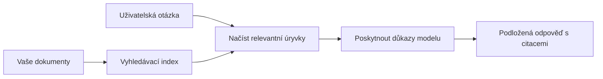

# Naučte AI odpovídat na otázky na základě vašich dokumentů:
## Séria 1: RAG, Azure vs Open-Source alternativy a kdy má smysl doladění

> První článek z roku 2026 věnovaný oživení mých tutoriálů z roku 2023 o Azure AI Search + Azure OpenAI pro dotazování dokumentů (QA).

Navigace v sérii: [Úvodní stránka repozitáře](../README.md) | Další: [Séria 2 - Postavte lokální open-source RAG systém end-to-end](./series-2-open-source-rag-end-to-end.md)

## 1. Úvod - Znovu k dřívějšímu tutoriálu RAG

V roce 2023 jsem pracoval na dvojici tutoriálů o tom, jak naučit ChatGPT odpovídat na otázky z PDF dokumentů pomocí Azure AI Search a Azure OpenAI. Napsal jsem [verzi LangChain](https://techcommunity.microsoft.com/blog/educatordeveloperblog/teach-chatgpt-to-answer-questions-using-azure-ai-search--azure-openai-lang-chain/3969713) a také jsem spoluautorem doprovodné [verze Semantic Kernel](https://techcommunity.microsoft.com/blog/educatordeveloperblog/teach-chatgpt-to-answer-questions-using-azure-ai-search--azure-openai-semantic-k/3985395) s [Lee Stottem](https://developer.microsoft.com/en-us/advocates/lee-stott), Principal Cloud Advocate Managerem ve společnosti Microsoft. V té době bylo „ChatGPT na vašich datech“ pro mnoho vývojářů ještě novinkou. Tutoriály používaly Azure Blob Storage, Azure AI Search, Azure OpenAI, LangChain, Semantic Kernel a FAISS-styl vyhledávání ve vektorové databázi pro odpovědi na otázky z PDF souborů.

Ten dřívější článek se soustředil na jednoduchý, ale důležitý pracovní postup: nahrát dokumenty, indexovat je, vyhledat relevantní obsah a požádat model o odpověď založenou na tomto obsahu.

V roce 2026 se ekosystém RAG výrazně rozrostl. Azure AI Search nyní podporuje moderní vektorové a hybridní vyhledávací vzory, Azure OpenAI je součástí širšího ekosystému Microsoft Foundry Models a novější API verze v1 může využívat standardního OpenAI klienta bez nutnosti měsíčních změn `api-version`. Současně otevřené zdroje jako LangGraph, LlamaIndex, Haystack, Qdrant, Milvus, Weaviate, Chroma, Ollama a vLLM se staly praktickými volbami pro reálné RAG systémy.

Proto jsem chtěl toto téma znovu otevřít. Otázka už není jen „Jak postavit RAG?“ Nyní existuje mnoho způsobů, jak ho postavit, a důležitější otázka je „Kterou architekturu si zvolit pro svou situaci?“

Ale základní problém zůstal nezměněn.

AI model automaticky nezná vaše dokumenty. K vytvoření užitečného systému dotazování na dokumenty stále potřebujete spolehlivé vyhledávání, ukotvení, vyhodnocení a provozní workflow.

Tento článek není další koncový tutoriál „chat s PDF“. Chci zahájit tuto aktualizovanou sérii otázkou, která mě nyní zajímá víc: kdy si vybrat řízenou Azure architekturu, kdy open-source RAG stack a kdy má doladění opravdu smysl?

Toto je první článek ze série o budování AI systémů založených na dokumentech. V této první části se zaměříme na architektonická rozhodnutí: proč je RAG důležitý, kdy jsou užitečné Azure řízené služby, kdy dávají smysl open-source alternativy a kam se hodí doladění.

Po budování a znovuprohlížení systémů pro dotazování na dokumenty mě zajímá méně, který nástroj vypadá na demo nejlépe, a víc, která architektura obstojí u skutečných uživatelů, měnících se dokumentů, oprávnění, chyb a údržby.

## 2. Proč vaše AI potřebuje vyhledávací systém

Velké jazykové modely jsou trénovány na širokých veřejných a licencovaných datech. Mohou vědět hodně o obecných tématech, ale automaticky neznají vaše soukromé PDF, interní směrnice, podnikové postupy, výzkumné archívy, materiály z výuky, poznámky zákaznické podpory nebo nedávno aktualizovanou dokumentaci.

Jednoduchý způsob, jak uvažovat o RAG, je tento: místo aby se od modelu očekávalo, že si zapamatuje každý dokument, poskytneme mu vyhledávací systém. Když uživatel položí otázku, systém nejprve najde nejrelevantnější části informací a pak tyto části předá modelu jako kontext.

To je důležité, protože mnoho skutečných zdrojů znalostí je soukromých, neustále se mění, jsou citlivé na oprávnění, uložené v různých systémech, ve více formátech a příliš rozsáhlé na to, aby se přímo vložily do promptu.

Například pokud škola, firma nebo výzkumný tým má 10 000 interních dokumentů, model nemůže spolehlivě odpovídat na základě těchto dokumentů, pokud systém nevyhledá správné části ve správný čas.

To přirozeně vede k běžné otázce:

Proč prostě model nedoladit?

Doladění může být užitečné, ale obvykle není prvním vhodným nástrojem pro znalosti z dokumentů. Pokud se znalosti často mění, pokud jsou důležité citace nebo přístupová oprávnění, RAG je obvykle lepší výchozí bod. Doladění je vhodnější pro učení chování, stylu, formátování výstupu a vzorců úkolů.

## 3. Architektura RAG v praxi

Představte si, že budujete AI asistenta pro školu. Asistent má odpovídat na otázky z politik PDF, učebních průvodců, interních FAQ stránek a nedávno aktualizovaných oznámení.

Pokud student položí otázku „Mohu použít generativní AI pro svou závěrečnou práci?“, systém by neměl odpovídat z obecné paměti modelu. Měl by nejprve najít příslušnou školní politiku, vyhledat část o použití AI a pak požádat model o odpověď na základě tohoto důkazu.

To je RAG v praxi.

Na vysoké úrovni si můžete průběh představit takto:

Detaily mohou být sofistikovanější, ale základní myšlenka je jednoduchá: model neodpovídá sám. Odpovídá s nalezenými důkazy.

Nejprve se dokumenty načtou z úložných systémů, jako jsou Azure Blob Storage, SharePoint, GitHub nebo interní CMS. Poté systém dokumenty parsuje na text a zachovává užitečnou strukturu jako nadpisy, čísla stran, tabulky, sekce a zdrojové umístění.

Dále se obsah rozdělí na části. Tento krok se může zdát jednoduchý, ale je jednou z nejdůležitějších částí systému. Pokud je část příliš malá, může ztratit okolní kontext. Pokud je část příliš velká, může obsahovat nesouvisející informace a snížit přesnost vyhledávání.

Po rozdělení systém vytvoří embeddingy a uloží je do vyhledávacího indexu spolu s původním textem a metadaty jako název souboru, číslo strany, oprávnění, verze dokumentu a URL zdroje.

Když uživatel položí otázku, systém vyhledá kandidátní části pomocí vyhledávání podle klíčových slov, vektorového vyhledávání nebo hybridního vyhledávání. Poté může reranker přeuspořádat tyto části tak, aby nejdůležitější důkazy byly nahoře.

Nakonec model obdrží otázku a nalezené důkazy. Odpověď by měla být založena na těchto důkazech a obsahovat citace, aby uživatel mohl zdroj zkontrolovat.

Důležitý bod je, že RAG není jen „vložit PDF do vektorové databáze“. Kvalita odpovědi závisí na celém workflow: parsování, rozdělení, vyhledávání, přerazení, promptování, citacích a vyhodnocení.

Proto záleží na struktuře dokumentu. V PDF může nadpis, tabulka, poznámka pod čarou nebo okraj stránky změnit význam pasáže. Na Azure využívá Document Layout skill schopnosti Azure Document Intelligence pro vytvoření strukturovaného výstupu, který může zlepšit kvalitu rozdělení a vyhledávání u RAG systémů.

## 4. Co se změnilo od roku 2023?

Tutoriál z roku 2023 byl pro svou dobu dobrým výchozím bodem:

- Azure Blob Storage ukládal PDF soubory.
- Azure AI Search indexoval obsah.
- LangChain propojoval vyhledávání a Azure OpenAI.
- FAISS fungoval jako jednoduché lokální vektorové úložiště.
- Příklad používal `gpt-35-turbo` a `text-embedding-ada-002`.

V roce 2026 by moderní verze měla reflektovat několik změn.

Za prvé, vyhledávání je vyspělejší. V roce 2023 mnoho ukázek používalo jednoduché vektorové vyhledávání podle podobnosti. Dnes je hybridní vyhledávání často výchozím bodem pro seriózní dotazování do dokumentů. Azure AI Search podporuje hybridní vyhledávání kombinací klíčových slov a vektorových dotazů v jednom požadavku a sloučení výsledků s Reciprocal Rank Fusion. Semantic ranker pak může přerazovat textovou část fulltextových, vektorových a hybridních výsledků.

Za druhé, ingest je sofistikovanější. Místo ručního rozdělování každého dokumentu pomocí aplikačního kódu podporuje Azure AI Search integrovanou vektorizaci pro rozdělení, embeddingy a vektorovou vektorizaci při dotazu. Pro PDF a dokumenty těžké na obsah může Document Layout skill lépe zachovat strukturu než pevně dané části.

Za třetí, orchestraci je teď důležitější. Těžká část často není samotný LLM API volání. Těžká část je řešení chyb, opakování pokusů, zastaralého vyhledávání, kvality částí, dlouho běžících workflow, lidské recenze a vyhodnocování v rozsahu. Zde jsou užitečné workflow nástroje jako LangGraph, LlamaIndex workflow, Haystack pipeline a nástroje pro hodnocení a sledování na úrovni platformy důležitější než čistě lineární řetězec.

Za čtvrté, vyhodnocování už není volitelné. Demo může působit působivě s jednou otázkou. Produkční systém potřebuje testovací sady, kontroly regresí, metriky vyhledávání, kontrolu ukotvení a monitorování. Bez vyhodnocení je těžké poznat, zda se systém zlepšuje nebo jen mění.

## 5. Volba mezi Azure a open-source RAG stacky

Nemyslím si, že užitečná otázka je „Je Azure lepší než open source?“ nebo „Je open source lepší než Azure?“

Užitečná otázka je: jaký druh systému stavíte, kdo ho bude provozovat, jaká máte omezení a jaké režimy selhání jsou nepřijatelné?

Když jsem začínal stavět příklady dotazování do dokumentů, většinou jsem řešil, zda vyhledávání funguje. Mohu nahrát PDF, vyhledat v nich a vygenerovat odpověď? To byl rozumný začátek.

Po práci na realističtějších AI workflow se mé hodnocení změnilo. Teď se dívám na čtyři oblasti před výběrem RAG stacku:

- identity a oprávnění
- kvalita vyhledávání
- spolehlivost workflow
- provozní vlastnictví

Tyto čtyři oblasti říkají mnohem víc než samotné benchmarky modelů.

Architektury založené na Azure obvykle dávají smysl, když je složitá integrace do podniku. Pokud tým už spoléhá na Microsoft Entra ID, Microsoft 365, Azure Storage, privátní síť, RBAC a Azure monitoring, Azure AI Search a Azure OpenAI mohou výrazně zjednodušit provozní složitost. V tomto prostředí není Azure pouze API modelu. Hodnota je v okolním systému: identita, správa, řízené vyhledávání, integrace zabezpečení, podpora a známé operace.

Open-source architektury dávají smysl, když je důležitá flexibilita. Pokud tým potřebuje lokální inferenci, cloudovou přenositelnost, vlastní retrieval pipeline, specializované přeražení nebo přímou kontrolu nad vektorovou databází a vrstvou obsluhy modelu, open-source stack je často lepší volba. Nevýhodou je, že tým musí sám zajišťovat spolehlivost: zálohy, škálování, latence, migrace, monitorování a zabezpečení.

V praxi mnoho produkčních AI systémů není čistě cloud-native ani čistě open-source. Často jsou hybridní systémy, které vyvažují provozní jednoduchost, přenositelnost, správu a flexibilitu inženýrství.

Například by mě nepřekvapilo vidět systém, který používá Azure OpenAI pro přístup k modelu, LangGraph pro orchestraci workflow, Azure hosting pro nasazení a open-source vektorovou databázi pro specifické požadavky na vyhledávání. To není architektonická nekonzistence. Je to výběr správné úrovně řízené služby a inženýrské kontroly pro každou část systému.

Mám rád hybridní architektury, kdy řízená platforma řeší důležité podnikové problémy a open-source komponenty dávají týmu flexibilitu tam, kde to opravdu stojí za to.

## 6. Praktický rozhodovací průvodce

Tady je rozhodovací tabulka, kterou bych použil s týmem před výběrem RAG stacku:

| Oblast rozhodnutí | Azure řízený stack je silnější, když... | Open-source stack je silnější, když... |
| --- | --- | --- |
| Identita a přístup | Entra ID, RBAC, řízená identita a podniková oprávnění jsou klíčová | převládá vlastní autentizace, ne-Microsoft identita nebo logika přístupu specifická pro aplikaci |
| Provoz | tým chce řízenou infrastrukturu, podporu, SLA a jednodušší zavedení | tým umí provozovat vektorové databáze, obsluhu modelů, zálohy a škálování |
| Vyhledávání | hybridní vyhledávání, sémantické řazení, filtry a metadatové vyhledávání pokrývají většinu potřeb | tým potřebuje vlastní vyhledávání, specializované přeražení nebo experimentální indexování |
| Přenositelnost | vyhovuje nebo je preferována kompatibilita s Azure ekosystémem | je nutné vyhnout se závislosti na cloudovém poskytovateli |
| Inferenční výkon | záleží na správě, síťování a podnikovém řízení Azure OpenAI | vyžaduje se lokální inference, vlastní modely nebo self-hosted obsluha |
| Náklady | snížení inženýrského a provozního úsilí je důležitější než ladění infrastruktury | škálování je dostatečně velké, aby ospravedlnilo pečlivou optimalizaci infrastruktury |
| Experimentování | stabilita a podniková integrace jsou důležitější než časté změny komponent | tým rychle iteruje na agentech, nástrojích, paměti a retrieval workflow |

Moje zlatá pravidla jsou jednoduchá:

- Začněte s Azure, pokud jsou hlavními riziky podniková integrace, zabezpečení a provozní jednoduchost.
- Začněte s open source, pokud jsou hlavními riziky přenositelnost, přizpůsobení nebo lokální kontrola.
- Použijte hybridní stack, pokud jsou pravdivé obě předchozí podmínky.

Proto bych také nezačínal sérii RAG v roce 2026 kódem. Kód je důležitý, ale výběr architektury předchází implementaci. Jednoduché demo může skrýt nejtěžší rozhodnutí. Dobrý RAG systém tyto volby jasně vyjadřuje.

## 7. Kam patří doladění

Doladění se často zmiňuje spolu s RAG, ale myslím, že je důležité tyto dva pojmy oddělit.

RAG je obvykle lepší volba, když systém potřebuje aktuální, soukromé, citlivé na oprávnění nebo na zdroj ukotvené znalosti. Pokud má odpověď citovat dokumenty, odrážet nedávné aktualizace nebo respektovat uživatelsky specifická přístupová pravidla, retrieval by měl být součástí architektury.
Doladění je užitečnější, když znalosti nejsou hlavním problémem. Může pomoci, když chcete, aby model dodržoval specifické výstupní formáty, odpovídal doménově specifickému stylu odpovědí, prováděl stabilní úkol konzistentněji nebo snížil množství instrukcí potřebných v každém promptu.

V praxi mohou oba přístupy spolupracovat. Asistent podpory může použít RAG pro získání nejnovějšího pravidla, zatímco doladěný model se naučí preferovanou strukturu odpovědi a tón firmy.

Chybou je považovat doladění za náhradu za dokumentové úložiště. Neodstraňuje to potřebu vyhledávání, když musí systém odpovídat na základě aktuálních, soukromých nebo oprávněním citlivých dat.

## 8. Kam tato série směřuje dále

Tento článek je vrstva rozhodování. Před psaním kódu jsem chtěl jasně vymezit kompromisy: RAG vs doladění, Azure vs open source, spravované služby vs provozní kontrola.

Než přejdu k implementaci, chtěl bych zde uvést jednu myšlenku: v mnoha podnikových AI systémech je model pouze jednou součástí. Kvalita vyhledávání, orchestrací, hodnocení, oprávnění a provozní spolehlivost často rozhodují, zda systém uspěje za hranicí demonstračního režimu.

V dalších částech této série plánuji jít hlouběji do praktické stránky dokumenty podložených AI systémů: nejprve vybudování lokálního open-source RAG workflow, pak přestavbu stejného scénáře pomocí Azure AI Search a Azure OpenAI a následné vyhodnocení, zda systém skutečně funguje.

Pořadí mohu upravit podle vývoje série, ale cíl zůstane stejný: posunout se za jednoduchou demo ukázku a ukázat, jak přemýšlet o RAG systémech, které lze udržovat, hodnotit a provozovat.

## 9. Reference a zdroje

Původní tutoriály:

- [Teach ChatGPT to Answer Questions: Using Azure AI Search & Azure OpenAI (Lang Chain)](https://techcommunity.microsoft.com/blog/educatordeveloperblog/teach-chatgpt-to-answer-questions-using-azure-ai-search--azure-openai-lang-chain/3969713)
- [Teach ChatGPT to Answer Questions: Using Azure AI Search & Azure OpenAI (Semantic Kernel)](https://techcommunity.microsoft.com/blog/educatordeveloperblog/teach-chatgpt-to-answer-questions-using-azure-ai-search--azure-openai-semantic-k/3985395)

Azure:

- [Azure AI Search REST API versions](https://learn.microsoft.com/en-us/rest/api/searchservice/search-service-api-versions)
- [Hybridní vyhledávání v Azure AI Search](https://learn.microsoft.com/en-us/azure/search/hybrid-search-how-to-query)
- [Integrovaná vektorizace v Azure AI Search](https://learn.microsoft.com/en-us/azure/search/vector-search-integrated-vectorization)
- [Kognitivní dovednost dokumentového rozložení v Azure AI Search](https://learn.microsoft.com/en-us/azure/search/cognitive-search-skill-document-intelligence-layout)
- [Rozdělení a vektorizace podle rozložení dokumentu](https://learn.microsoft.com/en-us/azure/search/search-how-to-semantic-chunking)
- [Sémantické řazení v Azure AI Search](https://learn.microsoft.com/en-us/azure/search/semantic-search-overview)
- [Životní cyklus verzí API Azure OpenAI / Microsoft Foundry](https://learn.microsoft.com/en-us/azure/foundry/openai/api-version-lifecycle)
- [Foundry modely prodávané přímo Azure](https://learn.microsoft.com/en-us/azure/foundry/foundry-models/concepts/models-sold-directly-by-azure)
- [Úvahy o doladění v Microsoft Foundry](https://learn.microsoft.com/en-us/azure/foundry/openai/concepts/fine-tuning-considerations)
- [Microsoft Foundry pozorovatelnost](https://learn.microsoft.com/en-us/azure/foundry/concepts/observability)
- [Provoz hodnocení v Microsoft Foundry](https://learn.microsoft.com/en-us/azure/foundry/how-to/evaluate-generative-ai-app)

Open-source:

- [Dokumentace LangGraph](https://docs.langchain.com/oss/python/langgraph/overview)
- [Dokumentace LlamaIndex](https://developers.llamaindex.ai/python/framework/)
- [Dokumentace Haystack](https://docs.haystack.deepset.ai/)
- [Dokumentace Qdrant](https://qdrant.tech/documentation/overview/)
- [Dokumentace Milvus](https://milvus.io/docs/overview.md)
- [Dokumentace Weaviate](https://docs.weaviate.io/weaviate/current/)
- [Dokumentace Chroma](https://docs.trychroma.com/docs/overview/introduction)
- [Embeddings Ollama](https://docs.ollama.com/capabilities/embeddings)
- [vLLM server kompatibilní s OpenAI](https://docs.vllm.ai/en/latest/serving/openai_compatible_server.html)
- [BGE modely embeddingů](https://huggingface.co/BAAI/bge-large-en-v1.5)
- [E5 modely embeddingů](https://huggingface.co/intfloat/e5-large-v2)
- [Instructor modely embeddingů](https://huggingface.co/hkunlp/instructor-large)

Další: [Série 2 - Vybudujte lokální open-source RAG systém end-to-end](./series-2-open-source-rag-end-to-end.md)

---

<!-- CO-OP TRANSLATOR DISCLAIMER START -->
**Prohlášení o omezení odpovědnosti**:
Tento dokument byl přeložen pomocí AI překladatelské služby [Co-op Translator](https://github.com/Azure/co-op-translator). Přestože usilujeme o co největší přesnost, mějte prosím na paměti, že automatizované překlady mohou obsahovat chyby nebo nepřesnosti. Originální dokument v jeho mateřském jazyce by měl být považován za autoritativní zdroj. Pro kritické informace se doporučuje profesionální lidský překlad. Nejsme odpovědní za jakékoli nedorozumění nebo nesprávné interpretace vzniklé použitím tohoto překladu.
<!-- CO-OP TRANSLATOR DISCLAIMER END -->