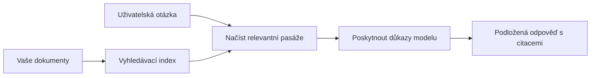

# Naučte AI odpovídat na otázky na základě vašich dokumentů:  
## Série 1: RAG, Azure vs open-source alternativy a kdy má smysl doladění

> První článek z řady na rok 2026, která znovu hodnotí mé návody z roku 2023 na Azure AI Search + Azure OpenAI pro dotazování nad dokumenty.

## 1. Úvod – připomenutí dřívějšího RAG tutoriálu

V roce 2023 jsem pracoval na dvojici návodů o tom, jak naučit ChatGPT odpovídat na otázky z PDF dokumentů za pomoci Azure AI Search a Azure OpenAI. Napsal jsem [verzi pro LangChain](https://techcommunity.microsoft.com/blog/educatordeveloperblog/teach-chatgpt-to-answer-questions-using-azure-ai-search--azure-openai-lang-chain/3969713) a také jsem spoluautorem doprovodné [verze pro Semantic Kernel](https://techcommunity.microsoft.com/blog/educatordeveloperblog/teach-chatgpt-to-answer-questions-using-azure-ai-search--azure-openai-semantic-k/3985395) s [Lee Stottem](https://developer.microsoft.com/en-us/advocates/lee-stott), manažerem Principal Cloud Advocate v Microsoftu. V té době se pojem „ChatGPT nad vašimi daty“ mnoha vývojářům stále zdál nový. Návody používající Azure Blob Storage, Azure AI Search, Azure OpenAI, LangChain, Semantic Kernel a FAISS-styl vyhledávání vektoru umožnily odpovídat na dotazy z PDF souborů.

Ten dřívější článek se zaměřoval na jednoduchý, ale důležitý pracovní postup: nahrání dokumentů, jejich indexování, vyhledání relevantního obsahu a požádání modelu o odpověď na základě tohoto obsahu.

V roce 2026 se RAG ekosystém výrazně rozrostl. Azure AI Search nyní podporuje moderní vektorové a hybridní vyhledávací vzory, Azure OpenAI je součástí širšího ekosystému Microsoft Foundry Models a novější API v1 může použít standardního klienta OpenAI bez nutnosti měsíčních změn `api-version`. Zároveň open-source možnosti jako LangGraph, LlamaIndex, Haystack, Qdrant, Milvus, Weaviate, Chroma, Ollama a vLLM jsou nyní praktickými volbami pro reálné RAG systémy.

Proto jsem chtěl téma znovu otevřít. Otázka už není jen „Jak postavit RAG?“ Existuje nyní mnoho možností a důležitější otázka je „Kterou architekturu zvolit pro mou situaci?“

Ale základní problém zůstává stejný.

AI model automaticky nezná vaše dokumenty. Pro vytvoření užitečného systému na odpovídání otázek z dokumentů stále potřebujete spolehlivé vyhledávání, podklad, vyhodnocení a provozní pracovní postupy.

Tento článek není další návod typu „konverzace s PDF“ end-to-end. Chtěl bych začít novou řadu otázkou, která mě dnes zajímá víc: kdy zvolit spravovanou Azure architekturu, kdy open-source RAG stack a kdy má doladění opravdu smysl?

Toto je první článek ze série o vývoji AI systémů založených na dokumentech. V této první části se zaměříme na architektonická rozhodnutí: proč RAG je důležitý, kdy mají smysl spravované služby Azure, kdy open-source alternativy, a kde doladění zapadá.

Po budování a přehodnocování systémů pro dotazování nad dokumenty mě už nezajímá tolik, který nástroj vypadá nejlépe v demu, ale která architektura obstojí v reálném provozu, při měnících se dokumentech, oprávněních, chybách a údržbě.

## 2. Proč vaše AI potřebuje vyhledávací systém

Velké jazykové modely jsou trénovány na širokých veřejných a licencovaných datech. Mohou toho hodně vědět o obecných tématech, ale automaticky neznají vaše soukromé PDF, interní směrnice, podnikové postupy, výzkumné archivy, materiály do výuky, poznámky zákaznické podpory nebo nedávno aktualizovanou dokumentaci.

Jednoduše lze RAG vysvětlit takto: místo abychom od modelu očekávali, že si zapamatuje každý dokument, poskytujeme mu vyhledávací systém. Když uživatel položí otázku, systém nejdříve najde nejrelevantnější části informací a tyto kusy potom předá modelu jako kontext.

To je důležité, protože mnoho zdrojů znalostí je soukromých, neustále se mění, citlivých na oprávnění, ukládaných napříč systémy, psaných v různých formátech a příliš obsáhlých na vložení přímo do dotazu.

Například pokud škola, firma nebo výzkumný tým má 10 000 interních dokumentů, model sám o sobě nemůže spolehlivě odpovídat z těchto dokumentů, pokud systém nezíská ve správný čas správné části.

To přirozeně vede k časté otázce:

Proč tedy nepoužít rovnou doladění modelu?

Doladění může být užitečné, ale obvykle to není jako první nástroj pro znalosti z dokumentů správná cesta. Pokud se znalosti často mění, záleží na citacích nebo mají význam oprávnění přístupu, RAG je většinou lepší výchozí bod. Doladění je vhodnější pro naučení chování, stylu, formátu výstupu a vzorů úkolů.

## 3. RAG architektura v praxi

Představte si, že vytváříte AI asistenta pro školu. Asistent musí odpovídat na otázky z PDF s pravidly školy, studijních průvodců, interních FAQ stránek a nově aktualizovaných oznámení.

Když student položí otázku „Mohu použít generativní AI na závěrečnou práci?“, systém by neměl odpovídat jen z obecné paměti modelu. Nejprve musí najít příslušné pravidlo školy, získat sekci o používání AI a pak požádat model o odpověď založenou na tom důkazu.

To je RAG v praxi.

Obecně lze postup popsat takto:

  
Detaily mohou být sofistikovanější, ale základní myšlenka je jednoduchá: model neodpovídá sám. Odpovídá s využitím získaných důkazů.

Nejprve jsou dokumenty načteny ze skladovacích systémů jako Azure Blob Storage, SharePoint, GitHub nebo interní CMS. Potom systém dokumenty převede na text, přičemž zachovává užitečnou strukturu jako nadpisy, čísla stránek, tabulky, oddíly a umístění zdroje.

Dále se obsah rozdělí na části. Tento krok zní jednoduše, ale je jednou z nejdůležitějších součástí systému. Pokud je část příliš malá, může ztratit okolní kontext. Pokud je příliš velká, může obsahovat nesouvisející informace a zhoršit přesnost vyhledávání.

Po rozdělení systém vytvoří vektory (embeddingy) a uloží je do vyhledatelného indexu spolu s původním textem a metadaty, jako je název souboru, číslo stránky, oprávnění, verze dokumentu a zdrojová URL.

Když uživatel položí otázku, systém vyhledá kandidátní části pomocí klíčového hledání, vektorového vyhledávání nebo hybridního vyhledávání. Reranker může tyto části přeuspořádat tak, aby nejpřínosnější důkazy byly nahoře.

Nakonec model obdrží otázku a získané důkazy. Odpověď by měla být založena na těchto důkazech a obsahovat citace, aby uživatel mohl zkontrolovat zdroj.

Důležité je, že RAG není jen „vložit PDF do vektorové databáze.“ Kvalita odpovědi závisí na celém pracovním procesu: parsování, rozdělení, vyhledávání, přeruřazení, promptování, citování a vyhodnocení.

Proto je struktura dokumentu důležitá. V PDF může nadpis, tabulka, poznámka pod čarou nebo hranice stránky změnit význam pasáže. Na Azure Document Layout skill využívá rozložení Azure Document Intelligence k vytvoření strukturovaného výstupu, což může zlepšit kvalitu dělení a vyhledávání v RAG systémech.

## 4. Co se změnilo od roku 2023?

Tutoriál z roku 2023 byl pro svou dobu dobrým výchozím bodem:

- Azure Blob Storage uchovával PDF soubory.  
- Azure AI Search indexoval obsah.  
- LangChain spojoval vyhledávání s Azure OpenAI.  
- FAISS fungoval jako jednoduché lokální vektorové úložiště.  
- Příklad používal `gpt-35-turbo` a `text-embedding-ada-002`.  

V roce 2026 by moderní verze měla zohlednit několik změn.

Zaprvé, vyhledávání vyzrálé. V roce 2023 mnoho demo ukazovalo jednoduché vyhledávání na základě podobnosti vektorů. Dnes je hybridní vyhledávání často výchozím bodem pro seriózní dotazování v dokumentech. Azure AI Search podporuje hybridní vyhledávání kombinující dotazy podle klíčových slov a vektorové dotazy v jednom požadavku a slučování výsledků metodou Reciprocal Rank Fusion. Sémantický reranker pak může přehodnotit výsledky full-text, vektorové a hybridní vyhledávání.

Zadruhé, načítání je sofistikovanější. Místo manuálního rozdělení každého dokumentu aplikací Azure AI Search podporuje integrovanou vektorizaci pro dělení, tvorbu embeddingů a vektorizaci v době dotazu. Pro PDF a dokumenty s velkým obsahem může Document Layout skill zachovat více struktury než pevně velikostní kusy.

Zatřetí, orchestraci významnější. Nejtěžší část často není samotné volání API LLM. Složitější je zvládat chyby, opakování, zastaralé výsledky, kvalitu částí, dlouhotrvající pracovní postupy, lidskou kontrolu a vyhodnocování ve velkém. Zde jsou důležité workflow nástroje jako LangGraph, pracovní postupy LlamaIndex, pipeline Haystack a platformní nástroje pro vyhodnocování a dohled užitečnější než lineární řetězec.

Zajímavé je také, že vyhodnocování už není volitelné. Demo může působit dobře s jednou otázkou, ale produkční systém potřebuje testovací sady, regresní kontroly, metriky vyhledávání, kontroly podkladu a monitoring. Bez vyhodnocování je těžké vědět, jestli se systém zlepšuje nebo jen mění.

## 5. Volba mezi Azure a open-source RAG stacky

Nemyslím si, že otázka má smysl jako „Je Azure lepší než open source?“ nebo „Je open source lepší než Azure?“

Správná otázka je: jaký systém stavíte, kdo ho bude provozovat, jaká máte omezení a jaké režimy selhání jsou nepřijatelné?

Když jsem začínal vytvářet dokumentové QA příklady, zajímalo mě hlavně, jestli vyhledávání funguje. Mohl jsem nahrát PDF, vyhledat je a vygenerovat odpověď? To byl rozumný výchozí bod.

Po zkušenostech s realističtějšími AI pracovními postupy se moje hodnocení změnilo. Před výběrem RAG stacku nyní hodnotím čtyři oblasti:

- identitu a oprávnění  
- kvalitu vyhledávání  
- spolehlivost pracovního postupu  
- provozní vlastnictví  

Tyto čtyři oblasti vám řeknou mnohem víc než jediný benchmark modelu.

Architektury založené na Azure obvykle dávají smysl, když je složitá podniková integrace. Pokud tým už využívá Microsoft Entra ID, Microsoft 365, Azure Storage, privátní sítě, RBAC a Azure monitoring, Azure AI Search a Azure OpenAI mohou výrazně zjednodušit provozní složitost. V tom prostředí Azure není jen API modelu. Hodnota je v okolním systému: identita, správa, spravované vyhledávání, integrace bezpečnosti, podpora a známé provozní nástroje.

Open-source architektury mají obvykle smysl, když je potřeba flexibilita. Pokud tým vyžaduje lokální inferenci, cloudovou přenositelnost, vlastní vyhledávací pipeline, specializované přerankování nebo přímou kontrolu nad vektorovou databází a vrstvou poskytování modelů, pak open-source stack může být lepší. Kompromisem je, že tým nese větší část odpovědnosti za spolehlivost: zálohy, škálování, latence, migrace, monitoring a bezpečnost.

V praxi mnoho produkčních AI systémů není ani čistě cloud-native, ani čistě open source. Často jsou hybridní – vyvažují provozní jednoduchost, přenositelnost, řízení a flexibilitu inženýringu.

Například bych se nedivil, kdyby systém používal Azure OpenAI pro přístup k modelu, LangGraph pro orchestraci workflow, Azure pro hosting a open-source vektorovou databázi pro specifické požadavky na vyhledávání. To není architektonická nekonzistence. To je výběr správné úrovně spravované služby a inženýrské kontroly pro každou část systému.

Mám rád hybridní architektury, když spravovaná platforma řeší důležité podnikové problémy a open-source komponenty dávají týmu flexibilitu tam, kde to opravdu záleží.

## 6. Praktický rozhodovací průvodce

Tady je tabulka rozhodnutí, kterou bych použil s týmem před výběrem RAG stacku:

| Oblast rozhodnutí | Azure spravovaný stack je silnější, když... | Open-source stack je silnější, když... |
| --- | --- | --- |
| Identita a přístup | Entra ID, RBAC, spravovaná identita a podniková oprávnění jsou klíčová | převažuje vlastní autentizace, ne-Microsoft identita nebo přístupová logika specifická pro aplikaci |
| Provoz | tým chce spravovanou infrastrukturu, podporu, SLA a jednodušší nastavení | tým umí provozovat vektorové databáze, poskytování modelů, zálohy a škálování |
| Vyhledávání | hybridní vyhledávání, sémantické řazení, filtry a vyhledávání v metadatech pokrývají většinu potřeb | tým potřebuje vlastní vyhledávání, specializované přerankování nebo experimentální indexování |
| Přenositelnost | akceptuje nebo preferuje Azure ekosystém | vyhýbání se závislosti na cloudu je zásadní požadavek |
| Inferenční výpočty | důležitá je správa Azure OpenAI, síťování a podniková kontrola | vyžaduje se lokální inference, vlastní modely nebo vlastní hosting poskytování |
| Náklady | důležitější je snížení inženýrského a provozního úsilí než ladění infrastruktury | rozsah je natolik velký, že stojí za to pečlivá optimalizace infrastruktury |
| Experimentování | důležitá je stabilita a podniková integrace více než častá výměna komponent | tým rychle iteruje na agentech, nástrojích, paměti a vyhledávacích postupech |

Moje pravidlo je jednoduché:

- Začněte s Azure, když jsou hlavní rizika podniková integrace, bezpečnost a provozní jednoduchost.  
- Začněte s open-source, když jsou hlavní rizika přenositelnost, přizpůsobení nebo lokální kontrola.  
- Použijte hybridní stack, když platí obojí.  

Proto bych také nezačínal sérii RAG v roce 2026 nejdřív kódem. Kód je důležitý, ale výběr architektury je před implementací. Jednoduché demo může skrýt nejtěžší rozhodnutí. Dobrý RAG systém tato rozhodnutí jasně definuje.

## 7. Kde doladění zapadá

Doladění se často zmiňuje společně s RAG, ale myslím, že je důležité je oddělit.

RAG je obvykle lepší volba, když systém potřebuje aktuální, soukromé, citlivé nebo zdrojově podložené znalosti. Pokud odpověď má citovat dokumenty, odrážet nedávné změny nebo respektovat přístupová pravidla uživatele, retrieval by měl být součástí architektury.

Doladění je užitečnější, když znalosti nejsou hlavním problémem. Pomůže, pokud chcete, aby model dodržoval specifický formát výstupu, odpovídal stylu v daném oboru, vykonával úkol stabilněji a konzistentněji nebo snižoval množství instrukcí v každém promptu.
V praxi mohou oba spolupracovat. Asistent podpory může použít RAG k nalezení nejnovější zásady, zatímco jemně vyladěný model se naučí preferovanou strukturu odpovědí a tón společnosti.

Chybou je považovat jemné ladění za náhradu za úložiště dokumentů. Neodstraňuje potřebu vyhledávání, když musí systém odpovídat z čerstvých, soukromých nebo citlivých dat s oprávněním.

## 8. Kam tato série směřuje dál

Tento článek je rozhodovací vrstvou. Před napsáním kódu jsem chtěl jasně vyjádřit kompromisy: RAG vs jemné ladění, Azure vs open source, spravované služby vs provozní kontrola.

Než přistoupím k implementaci, chci zde ponechat jednu poznámku: v mnoha podnikových AI systémech je model pouze jednou součástí. Kvalita vyhledávání, orchestraci, hodnocení, oprávnění a provozní spolehlivost často určují, zda systém uspěje mimo demonstrační fázi.

V dalších částech této série plánuji jít hlouběji do praktické stránky dokumentově založených AI systémů: jak postavit architekturu založenou na Azure, jak se v praxi srovnávají open-source alternativy a jak vyhodnotit, zda systém RAG skutečně funguje.

Pořadí mohu během vývoje série upravit, ale cíl zůstane stejný: přesunout se za jednoduchou ukázku a ukázat, jak uvažovat o RAG systémech, které lze udržovat, hodnotit a provozovat.

## 9. Reference a zdroje

Původní návody:

- [Teach ChatGPT to Answer Questions: Using Azure AI Search & Azure OpenAI (Lang Chain)](https://techcommunity.microsoft.com/blog/educatordeveloperblog/teach-chatgpt-to-answer-questions-using-azure-ai-search--azure-openai-lang-chain/3969713)
- [Teach ChatGPT to Answer Questions: Using Azure AI Search & Azure OpenAI (Semantic Kernel)](https://techcommunity.microsoft.com/blog/educatordeveloperblog/teach-chatgpt-to-answer-questions-using-azure-ai-search--azure-openai-semantic-k/3985395)

Azure:

- [Azure AI Search REST API verze](https://learn.microsoft.com/en-us/rest/api/searchservice/search-service-api-versions)
- [Hybridní vyhledávání v Azure AI Search](https://learn.microsoft.com/en-us/azure/search/hybrid-search-how-to-query)
- [Integrovaná vektorizace v Azure AI Search](https://learn.microsoft.com/en-us/azure/search/vector-search-integrated-vectorization)
- [Dovednost Document Layout v Azure AI Search](https://learn.microsoft.com/en-us/azure/search/cognitive-search-skill-document-intelligence-layout)
- [Dělení na části a vektorizace podle rozložení dokumentu](https://learn.microsoft.com/en-us/azure/search/search-how-to-semantic-chunking)
- [Sémantické hodnocení v Azure AI Search](https://learn.microsoft.com/en-us/azure/search/semantic-search-overview)
- [Životní cyklus API verzí Azure OpenAI / Microsoft Foundry](https://learn.microsoft.com/en-us/azure/foundry/openai/api-version-lifecycle)
- [Modely Foundry prodávané Azure](https://learn.microsoft.com/en-us/azure/foundry/foundry-models/concepts/models-sold-directly-by-azure)
- [Úvahy o jemném ladění v Microsoft Foundry](https://learn.microsoft.com/en-us/azure/foundry/openai/concepts/fine-tuning-considerations)
- [Pozorovatelnost v Microsoft Foundry](https://learn.microsoft.com/en-us/azure/foundry/concepts/observability)
- [Spuštění hodnocení v Microsoft Foundry](https://learn.microsoft.com/en-us/azure/foundry/how-to/evaluate-generative-ai-app)

Open-source:

- [Dokumentace LangGraph](https://docs.langchain.com/oss/python/langgraph/overview)
- [Dokumentace LlamaIndex](https://developers.llamaindex.ai/python/framework/)
- [Dokumentace Haystack](https://docs.haystack.deepset.ai/)
- [Dokumentace Qdrant](https://qdrant.tech/documentation/overview/)
- [Dokumentace Milvus](https://milvus.io/docs/overview.md)
- [Dokumentace Weaviate](https://docs.weaviate.io/weaviate/current/)
- [Dokumentace Chroma](https://docs.trychroma.com/docs/overview/introduction)
- [Vkládání Ollama](https://docs.ollama.com/capabilities/embeddings)
- [vLLM server kompatibilní s OpenAI](https://docs.vllm.ai/en/latest/serving/openai_compatible_server.html)
- [Modely vkládání BGE](https://huggingface.co/BAAI/bge-large-en-v1.5)
- [Modely vkládání E5](https://huggingface.co/intfloat/e5-large-v2)
- [Modely vkládání Instructor](https://huggingface.co/hkunlp/instructor-large)

---

<!-- CO-OP TRANSLATOR DISCLAIMER START -->
**Prohlášení o omezení odpovědnosti**:
Tento dokument byl přeložen pomocí AI překladatelské služby [Co-op Translator](https://github.com/Azure/co-op-translator). Přestože usilujeme o co největší přesnost, mějte prosím na paměti, že automatizované překlady mohou obsahovat chyby nebo nepřesnosti. Originální dokument v jeho mateřském jazyce by měl být považován za autoritativní zdroj. Pro kritické informace se doporučuje profesionální lidský překlad. Nejsme odpovědní za jakékoli nedorozumění nebo nesprávné interpretace vzniklé použitím tohoto překladu.
<!-- CO-OP TRANSLATOR DISCLAIMER END -->