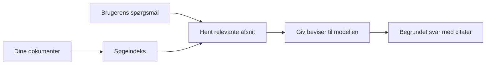

# Lær AI at Besvare Spørgsmål Baseret på Dine Dokumenter:
## Serie 1: RAG, Azure vs Open-Source Alternativer, og Hvornår Finjustering giver Mening

> Den første artikel i en serie fra 2026, der genbesøger mine 2023 Azure AI Search + Azure OpenAI dokument QA tutorials.

Serienavigation: [Repository startside](../README.md) | Næste: [Serie 2 - Byg et Lokalt Open-Source RAG System End to End](./series-2-open-source-rag-end-to-end.md)

## 1. Intro - Genbesøg af en Tidligere RAG Tutorial

I 2023 arbejdede jeg på et par tutorials om at lære ChatGPT at besvare spørgsmål fra PDF-dokumenter ved hjælp af Azure AI Search og Azure OpenAI. Jeg skrev [LangChain-versionen](https://techcommunity.microsoft.com/blog/educatordeveloperblog/teach-chatgpt-to-answer-questions-using-azure-ai-search--azure-openai-lang-chain/3969713), og jeg medforfattede også den ledsagende [Semantic Kernel-version](https://techcommunity.microsoft.com/blog/educatordeveloperblog/teach-chatgpt-to-answer-questions-using-azure-ai-search--azure-openai-semantic-k/3985395) sammen med [Lee Stott](https://developer.microsoft.com/en-us/advocates/lee-stott), en Principal Cloud Advocate Manager hos Microsoft. På det tidspunkt føltes idéen om "ChatGPT på dine data" stadig ny for mange udviklere. Tutorials brugte Azure Blob Storage, Azure AI Search, Azure OpenAI, LangChain, Semantic Kernel og FAISS-lignende vektor-søgning til at besvare spørgsmål ud fra PDF-filer.

Den tidligere artikel fokuserede på en simpel men vigtig arbejdsproces: upload dokumenter, indekser dem, hent relevant indhold, og spørg en model om at svare baseret på det indhold.

I 2026 er RAG-økosystemet vokset betydeligt. Azure AI Search understøtter nu moderne vektor- og hybridgenfinding, Azure OpenAI er en del af det bredere Microsoft Foundry Models-økosystem, og den nyere v1 API kan bruge den standard OpenAI klient uden at kræve månedlige `api-version` ændringer. Samtidig er open-source muligheder som LangGraph, LlamaIndex, Haystack, Qdrant, Milvus, Weaviate, Chroma, Ollama og vLLM blevet praktiske valg for rigtige RAG-systemer.

Derfor ønskede jeg at genbesøge dette emne. Spørgsmålet er ikke længere bare "Hvordan bygger jeg RAG?" Der findes nu mange måder at bygge det på, og det vigtigere spørgsmål er "Hvilken arkitektur skal jeg vælge til min situation?"

Men kerneproblemet er ikke ændret.

En AI-model kender ikke automatisk dine dokumenter. For at bygge et brugbart dokument-spørgsmål-besvarelsessystem har du stadig brug for pålidelig søgning, grundlag, evaluering og operationelle arbejdsgange.

Denne artikel er ikke en ny end-to-end "chat med PDF" tutorial. Jeg vil starte denne opdaterede serie med det spørgsmål, jeg nu går mere op i: hvornår skal du vælge en administreret Azure-arkitektur, hvornår skal du vælge en open-source RAG stack, og hvornår giver finjustering faktisk mening?

Dette er den første artikel i en serie om at bygge dokument-baserede AI-systemer. I denne første del vil vi fokusere på arkitekturvalg: hvorfor RAG betyder noget, hvornår Azure-baserede administrerede tjenester er nyttige, hvornår open-source alternativer giver mening, og hvor finjustering passer ind.

Efter at have bygget og genbesøgt dokument QA-systemer, er jeg blevet mindre interesseret i, hvilket værktøj der ser bedst ud i en demo, og mere interesseret i hvilken arkitektur, der overlever reale brugere, ændrende dokumenter, rettigheder, fejl og vedligeholdelse.

## 2. Hvorfor Din AI Har Brug for et Søgesystem

Store sprogmodeller er trænet på bredt offentligt og licenseret data. De kan vide meget om generelle emner, men de kender ikke automatisk dine private PDF’er, interne politikker, virksomhedsprocedurer, forskningsarkiver, klassematerialer, kundesupportnoter eller nyligt opdateret dokumentation.

En enkel måde at tænke på RAG på er denne: i stedet for at forvente, at modellen husker hvert dokument, giver vi den et søgesystem. Når en bruger stiller et spørgsmål, finder systemet først de mest relevante informationer og giver derefter disse dele til modellen som kontekst.

Det betyder noget, fordi mange virkelige videnskilder er private, konstant ændrende, tilladelsesfølsomme, lagret på tværs af flere systemer, skrevet i mange formater og for store til at indsætte direkte i et prompt.

For eksempel, hvis en skole, virksomhed eller forskningsteam har 10.000 interne dokumenter, kan modellen ikke besvare ud fra disse dokumenter pålideligt, medmindre systemet henter de rigtige dele på det rigtige tidspunkt.

Det fører naturligt til et almindeligt spørgsmål:

Hvorfor ikke bare finjustere modellen?

Finjustering kan være nyttigt, men det er normalt ikke det rette første værktøj til dokumentviden. Hvis viden ofte ændres, hvis kildehenvisninger betyder noget, eller hvis adgangstilladelser betyder noget, er RAG normalt det bedre udgangspunkt. Finjustering egner sig bedre til at lære adfærd, stil, outputformat og opgavemønstre.

## 3. RAG Arkitektur i Praksis

Forestil dig, at du bygger en AI-assistent til en skole. Assistenten skal besvare spørgsmål ud fra politik-PDF’er, kursusguides, interne FAQ-sider og nyligt opdaterede annonceringer.

Hvis en elev spørger, "Kan jeg bruge generativ AI til min afsluttende opgave?", bør systemet ikke svare ud fra modellens generelle hukommelse. Det bør først finde den relevante skolepolitik, hente afsnittet om AI-brug og derefter bede modellen om at svare med brug af den dokumenterede evidens.

Det er RAG i praksis.

På et overordnet niveau kan du tænke på flowet sådan:

Detaljerne kan blive mere sofistikerede, men den grundlæggende idé er enkel: modellen svarer ikke alene. Den svarer med hentet evidens.

Først hentes dokumenter fra lagringssystemer som Azure Blob Storage, SharePoint, GitHub eller et internt CMS. Derefter parser systemet dem til tekst samtidig med, at det bevarer nyttig struktur som overskrifter, sidetal, tabeller, sektioner og kildeplaceringer.

Dernæst deles indholdet op i dele. Dette trin lyder simpelt, men er en af systemets vigtigste dele. Er en del for lille, kan den miste den omgivende kontekst. Er delen for stor, kan den indeholde irrelevant information og gøre hentningen mindre præcis.

Efter opdeling laves embeddings, og de gemmes i et søgbart indeks sammen med den oprindelige tekst og metadata som filnavn, sidetal, rettigheder, dokumentversion og kilde-URL.

Når brugeren stiller et spørgsmål, henter systemet kandidatudsnit ved brug af søgeordssøgning, vektorsøgning eller hybridsøgning. En reranker kan derefter omarrangere disse udsnit, så det mest nyttige bevis placeres øverst.

Endelig modtager modellen spørgsmålet og den hentede evidens. Svaret bør være forankret i denne evidens og give kildehenvisninger, så brugeren kan undersøge kilden.

Det vigtige er, at RAG ikke bare er "læg PDF’er i en vektordatabase." Svarets kvalitet afhænger af hele workflowet: parsing, opdeling, hentning, omrangering, prompting, kildehenvisning og evaluering.

Derfor betyder dokumentstruktur noget. I en PDF kan en overskrift, tabel, fodnote eller sideskift ændre betydningen af en passage. På Azure bruger Document Layout-færdigheden Azure Document Intelligence’s layoutfunktioner til at producere strukturbevidst output, hvilket kan forbedre opdeling og hentningskvalitet for RAG-systemer.

## 4. Hvad er Ændret siden 2023?

2023 tutorial’en var et godt udgangspunkt for sin tid:

- Azure Blob Storage gemte PDF-filer.
- Azure AI Search indekserede indhold.
- LangChain forbød hentning til Azure OpenAI.
- FAISS fungerede som en simpel lokal vektordatabase.
- Eksemplet brugte `gpt-35-turbo` og `text-embedding-ada-002`.

I 2026 bør en moderne version afspejle flere ændringer.

For det første er hentning modnet. I 2023 brugte mange demoer simpel vektorsøgnings-similaritet. I dag er hybrid hentning ofte standardudgangspunkt for seriøs dokument QA. Azure AI Search understøtter hybridsøgning ved at kombinere søgeord og vektorspørgsmål i en enkelt forespørgsel og sammenlægge resultater med Reciprocal Rank Fusion. En semantisk ranker kan derefter omrangere tekstdelen af fuldtekst-, vektor- og hybridresultater.

For det andet er indlæsning mere sofistikeret. I stedet for manuelt at dele hvert dokument op med programkode understøtter Azure AI Search integreret vektorisering til opdeling, embedding og forespørgsels-tids-vektorisering. For PDF’er og dokumenttunge arbejdsbelastninger kan Document Layout-færdigheden bevare mere struktur end faste størrelsesopdelte dele.

For det tredje betyder orkestrering mere. Den svære del er ofte ikke LLM API-kaldet i sig selv. Den svære del er at håndtere fejl, genforsøg, forældet hentning, del-kvalitet, langvarige workflows, menneskelig gennemgang og evaluering i stor skala. Her bliver workflow-orienterede værktøjer som LangGraph, LlamaIndex workflows, Haystack pipelines og platformniveauets evaluerings- og observeringsværktøjer mere relevante end en enkelt lineær kæde.

For det fjerde er evaluering ikke længere valgfrit. En demo kan se imponerende ud med ét spørgsmål. Et produktionssystem har brug for test-sæt, regressionskontrol, hentningsmålinger, grundlagetjek og overvågning. Uden evaluering er det svært at vide, om systemet forbedres eller bare ændres.

## 5. Vælg mellem Azure og Open-Source RAG Stacks

Jeg mener ikke, det nyttige spørgsmål er "Er Azure bedre end open source?" eller "Er open source bedre end Azure?"

Det nyttige spørgsmål er: hvilken type system bygger du, hvem skal drive det, hvilke begrænsninger har du, og hvilke fejltilstande er uacceptable?

Da jeg begyndte at bygge dokument QA-eksempler, tænkte jeg mest på, om hentning virkede. Kunne jeg uploade PDF’er, søge i dem og generere et svar? Det var et fornuftigt udgangspunkt.

Efter at have arbejdet med mere realistiske AI-workflows, ændrede min evaluering sig. Jeg kigger nu på fire ting, før jeg vælger en RAG stack:

- identitet og rettigheder
- hentningskvalitet
- workflow-pålidelighed
- operativt ejerskab

De fire områder fortæller dig meget mere end alene en modelbenchmark.

Azure-baserede arkitekturer giver som regel mening, når enterprise-integration er den svære del. Hvis et team allerede er afhængigt af Microsoft Entra ID, Microsoft 365, Azure Storage, privat netværk, RBAC og Azure overvågning, kan Azure AI Search og Azure OpenAI reducere meget operationel kompleksitet. I dette miljø er Azure ikke kun en model-API. Værdien er det omkringliggende system: identitet, styring, administreret søgning, sikkerhedsintegration, support og kendt drift.

Open-source arkitekturer giver som regel mening, når fleksibilitet er den svære del. Hvis teamet har brug for lokal inferens, cloud-portabilitet, en brugerdefineret søgepipeline, specialiseret omranking eller direkte kontrol over vektordatabasen og modelserverlaget, kan en open-source stack være det bedre valg. Afvejningen er, at teamet ejer mere af pålidelighedsarbejdet: backups, skalering, latenstid, migrationer, overvågning og sikkerhed.

I praksis er mange produktions-AI-systemer ikke rent cloud-native eller rent open-source. De er ofte hybride systemer, der balancerer operationel enkelhed, portabilitet, styring og ingeniørfleksibilitet.

For eksempel ville jeg ikke blive overrasket over at se et system bruge Azure OpenAI til modeladgang, LangGraph til workflow-orkestrering, Azure hosting til deployment og en open-source vektordatabase til et specifikt hentningsbehov. Det er ikke arkitektonisk inkonsistens. Det er at vælge det rette niveau af administreret service og ingeniørkontrol for hver del af systemet.

Jeg kan godt lide hybride arkitekturer, når den administrerede platform løser vigtige enterprise-problemer, mens open-source komponenter giver teamet fleksibilitet, hvor det virkelig betyder noget.

## 6. En Praktisk Beslutningsguide

Her er beslutningstabellen, jeg ville bruge med et team, før vi vælger en RAG stack:

| Beslutningsområde | Azure administreret stack er stærkere når... | Open-source stack er stærkere når... |
| --- | --- | --- |
| Identitet og adgang | Entra ID, RBAC, administreret identitet og enterprise-tilgange er centrale | brugerdefineret auth, ikke-Microsoft identitet eller app-specifik adgangslogik dominerer |
| Drift | teamet ønsker administreret infrastruktur, support, SLA’er og nemmere onboarding | teamet kan drive vektordatabaser, model-service, backups og skalering |
| Hentning | hybridsøgning, semantisk rangering, filtre og metadata-søgning dækker de fleste behov | teamet har brug for brugerdefineret hentning, specialiseret omranking eller eksperimentel indeksering |
| Portabilitet | Azure-økosystemtilpasning er acceptabelt eller foretrukket | undgåelse af cloud lock-in er et hårdt krav |
| Inferens | Azure OpenAI styring, netværk og enterprise-kontrol betyder noget | lokal inferens, brugerdefinerede modeller eller selvhostet service er påkrævet |
| Pris | reduktion af ingeniør- og driftsindsats betyder mere end optimering af infrastruktur | skalaen er stor nok til at retfærdiggøre omhyggelig optimering af infrastruktur |
| Eksperimentering | stabilitet og enterprise-integration betyder mere end ofte at skifte komponenter | teamet itererer hurtigt på agenter, værktøjer, hukommelse og hentningsarbejdsgange |

Min tommelfingerregel er simpel:

- Start med Azure, når enterprise-integration, sikkerhed og operationel enkelhed er hovedrisiciene.
- Start med open source, når portabilitet, tilpasning eller lokal kontrol er hovedrisiciene.
- Brug en hybrid stack, når begge er sande.

Det er også derfor, jeg ikke ville starte en 2026 RAG-serie med kode først. Kode er vigtigt, men arkitekturvalg kommer før implementering. En simpel demo kan skjule de sværeste valg. Et godt RAG-system gør disse valg eksplicitte.

## 7. Hvor Finjustering Passer Ind

Finjustering nævnes ofte sammen med RAG, men jeg synes, det er vigtigt at adskille de to.

RAG er normalt den bedre løsning, når systemet har brug for frisk, privat, tilladelsesfølsom eller kildetilgrundlagt viden. Hvis svaret skal henvise til dokumenter, afspejle nylige opdateringer eller respektere bruger-specifikke adgangsregler, bør hentning være en del af arkitekturen.
Finjustering er mere nyttigt, når viden ikke er hovedproblemet. Det kan hjælpe, når du ønsker, at modellen skal følge et specifikt outputformat, matche en domænespecifik responsstil, udføre en stabil opgave mere konsekvent eller reducere mængden af instruktioner, der kræves i hver prompt.

I praksis kan de to arbejde sammen. En supportassistent kan bruge RAG til at hente den nyeste politik, mens en finjusteret model lærer virksomhedens foretrukne svarstruktur og tone.

Fejlen er at betragte finjustering som en erstatning for en dokumentlager. Det fjerner ikke behovet for opslag, når systemet skal svare ud fra frisk, privat eller tilladelsesfølsomt data.

## 8. Hvor denne serie går hen næste gang

Denne artikel er beslutningslaget. Før jeg skrev kode, ønskede jeg at gøre kompromiserne eksplicitte: RAG vs finjustering, Azure vs open source, administrerede tjenester vs operationel kontrol.

Før jeg går videre til implementering, vil jeg efterlade ét punkt her: i mange virksomheders AI-systemer er modellen kun én komponent. Kvaliteten af opslag, orkestrering, evaluering, tilladelser og operationel pålidelighed er ofte det, der afgør, om systemet lykkes ud over demo-stadiet.

I de næste dele af denne serie planlægger jeg at gå dybere ind i den praktiske side af dokumentforankrede AI-systemer: først bygge en lokal open source RAG workflow, derefter genskabe det samme scenarie med Azure AI Search og Azure OpenAI, og derefter evaluere, om systemet faktisk fungerer.

Jeg kan justere rækkefølgen, efterhånden som serien udvikler sig, men målet vil være det samme: at komme videre end en simpel demo og vise, hvordan man tænker på RAG-systemer, der kan vedligeholdes, evalueres og drives.

## 9. Referencer og ressourcer

Originale tutorials:

- [Lær ChatGPT at besvare spørgsmål: Brug Azure AI Search & Azure OpenAI (Lang Chain)](https://techcommunity.microsoft.com/blog/educatordeveloperblog/teach-chatgpt-to-answer-questions-using-azure-ai-search--azure-openai-lang-chain/3969713)
- [Lær ChatGPT at besvare spørgsmål: Brug Azure AI Search & Azure OpenAI (Semantic Kernel)](https://techcommunity.microsoft.com/blog/educatordeveloperblog/teach-chatgpt-to-answer-questions-using-azure-ai-search--azure-openai-semantic-k/3985395)

Azure:

- [Azure AI Search REST API versioner](https://learn.microsoft.com/en-us/rest/api/searchservice/search-service-api-versions)
- [Hybrid søgning i Azure AI Search](https://learn.microsoft.com/en-us/azure/search/hybrid-search-how-to-query)
- [Integreret vektorering i Azure AI Search](https://learn.microsoft.com/en-us/azure/search/vector-search-integrated-vectorization)
- [Document Layout-færdighed i Azure AI Search](https://learn.microsoft.com/en-us/azure/search/cognitive-search-skill-document-intelligence-layout)
- [Chunk og vektorer efter dokumentlayout](https://learn.microsoft.com/en-us/azure/search/search-how-to-semantic-chunking)
- [Semantisk rangering i Azure AI Search](https://learn.microsoft.com/en-us/azure/search/semantic-search-overview)
- [Azure OpenAI / Microsoft Foundry API versions livscyklus](https://learn.microsoft.com/en-us/azure/foundry/openai/api-version-lifecycle)
- [Foundry-modeller solgt af Azure](https://learn.microsoft.com/en-us/azure/foundry/foundry-models/concepts/models-sold-directly-by-azure)
- [Microsoft Foundry overvejelser ved finjustering](https://learn.microsoft.com/en-us/azure/foundry/openai/concepts/fine-tuning-considerations)
- [Microsoft Foundry observabilitet](https://learn.microsoft.com/en-us/azure/foundry/concepts/observability)
- [Kør evalueringer i Microsoft Foundry](https://learn.microsoft.com/en-us/azure/foundry/how-to/evaluate-generative-ai-app)

Open source:

- [LangGraph dokumentation](https://docs.langchain.com/oss/python/langgraph/overview)
- [LlamaIndex dokumentation](https://developers.llamaindex.ai/python/framework/)
- [Haystack dokumentation](https://docs.haystack.deepset.ai/)
- [Qdrant dokumentation](https://qdrant.tech/documentation/overview/)
- [Milvus dokumentation](https://milvus.io/docs/overview.md)
- [Weaviate dokumentation](https://docs.weaviate.io/weaviate/current/)
- [Chroma dokumentation](https://docs.trychroma.com/docs/overview/introduction)
- [Ollama embeddings](https://docs.ollama.com/capabilities/embeddings)
- [vLLM OpenAI-kompatibel server](https://docs.vllm.ai/en/latest/serving/openai_compatible_server.html)
- [BGE embedding-modeller](https://huggingface.co/BAAI/bge-large-en-v1.5)
- [E5 embedding-modeller](https://huggingface.co/intfloat/e5-large-v2)
- [Instructor embedding-modeller](https://huggingface.co/hkunlp/instructor-large)

Næste: [Serie 2 - Byg et lokalt open source RAG-system fra start til slut](./series-2-open-source-rag-end-to-end.md)

---

<!-- CO-OP TRANSLATOR DISCLAIMER START -->
**Ansvarsfraskrivelse**:
Dette dokument er blevet oversat ved hjælp af AI-oversættelsestjenesten [Co-op Translator](https://github.com/Azure/co-op-translator). Selvom vi bestræber os på nøjagtighed, skal du være opmærksom på, at automatiserede oversættelser kan indeholde fejl eller unøjagtigheder. Det originale dokument på dets oprindelige sprog bør betragtes som den autoritative kilde. For kritisk information anbefales professionel menneskelig oversættelse. Vi påtager os intet ansvar for misforståelser eller fejltolkninger, der opstår som følge af brugen af denne oversættelse.
<!-- CO-OP TRANSLATOR DISCLAIMER END -->