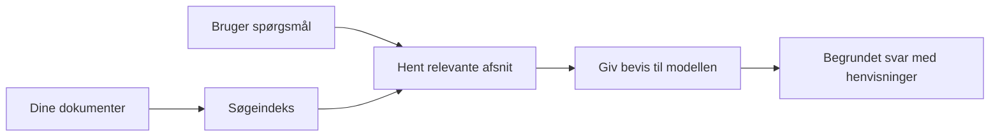

# Lær AI at Besvare Spørgsmål Baseret på Dine Dokumenter:
## Serie 1: RAG, Azure vs Open-Source Alternativer, og Hvornår Fine-Tuning Giver Mening

> Den første artikel i en 2026-serie, der genbesøger mine 2023 Azure AI Search + Azure OpenAI dokument QA-tutorials.

## 1. Introduktion - Genbesøg af en Tidligere RAG-Tutorial

I 2023 arbejdede jeg på et par tutorials om at lære ChatGPT at besvare spørgsmål ud fra PDF-dokumenter ved hjælp af Azure AI Search og Azure OpenAI. Jeg skrev [LangChain-versionen](https://techcommunity.microsoft.com/blog/educatordeveloperblog/teach-chatgpt-to-answer-questions-using-azure-ai-search--azure-openai-lang-chain/3969713), og jeg medforfattede også den tilhørende [Semantic Kernel-version](https://techcommunity.microsoft.com/blog/educatordeveloperblog/teach-chatgpt-to-answer-questions-using-azure-ai-search--azure-openai-semantic-k/3985395) sammen med [Lee Stott](https://developer.microsoft.com/en-us/advocates/lee-stott), en Principal Cloud Advocate Manager hos Microsoft. På det tidspunkt føltes ideen om "ChatGPT på dine data" stadig ny for mange udviklere. Tutorials brugte Azure Blob Storage, Azure AI Search, Azure OpenAI, LangChain, Semantic Kernel og FAISS-stil vektorretrieval til at besvare spørgsmål fra PDF-filer.

Den tidligere artikel fokuserede på en simpel, men vigtig arbejdsgang: upload dokumenter, indekser dem, hent relevant indhold, og spørg en model om at besvare ud fra det indhold.

I 2026 er RAG-økosystemet vokset betydeligt. Azure AI Search understøtter nu moderne vektor- og hybride rekonstruktionsmønstre, Azure OpenAI er en del af det bredere Microsoft Foundry Models-økosystem, og den nyere v1 API kan bruge den standard OpenAI-klient uden at kræve månedlige `api-version`-ændringer. På samme tid er open-source muligheder som LangGraph, LlamaIndex, Haystack, Qdrant, Milvus, Weaviate, Chroma, Ollama og vLLM blevet praktiske valg til rigtige RAG-systemer.

Derfor ønskede jeg at genbesøge dette emne. Spørgsmålet er ikke længere bare "Hvordan bygger jeg RAG?" Der findes nu mange måder at bygge det på, og det vigtigere spørgsmål er "Hvilken arkitektur skal jeg vælge til min situation?"

Men det grundlæggende problem er ikke ændret.

En AI-model kender ikke automatisk dine dokumenter. For at bygge et nyttigt dokument-spørgsmål-svar system, har du stadig brug for pålidelig retrieval, grounding, evaluering og operationelle arbejdsgange.

Denne artikel er ikke endnu en end-to-end "chat med PDF" tutorial. Jeg vil starte denne opdaterede serie med det spørgsmål, jeg nu går mere op i: Hvornår bør du vælge en administreret Azure-arkitektur, hvornår bør du vælge en open-source RAG-stack, og hvornår giver fine-tuning egentlig mening?

Dette er den første artikel i en serie om at bygge dokumentforankrede AI-systemer. I denne første del vil vi fokusere på arkitekturvalg: hvorfor RAG er vigtig, hvornår Azure-baserede administrerede tjenester er nyttige, hvornår open-source alternativer giver mening, og hvor fine-tuning passer ind.

Efter at have bygget og genbesøgt dokument QA-systemer, er jeg blevet mindre interesseret i, hvilket værktøj der ser bedst ud i en demo, og mere interesseret i, hvilken arkitektur der overlever rigtige brugere, skiftende dokumenter, tilladelser, fejl og vedligeholdelse.

## 2. Hvorfor Din AI Har Brug for et Søgning System

Store sprogmodeller trænes på bredt offentligt og licenseret data. De kan vide meget om generelle emner, men de kender ikke automatisk dine private PDF'er, interne politikker, virksomhedsprocedurer, forskningsarkiver, klasseværelsesmaterialer, kundesupportnoter eller nyligt opdateret dokumentation.

En simpel måde at tænke på RAG er denne: i stedet for at forvente, at modellen husker hvert dokument, giver vi den et søgesystem. Når en bruger stiller et spørgsmål, finder systemet først de mest relevante informationsstykker og giver derefter disse stykker til modellen som kontekst.

Det er vigtigt, fordi mange virkelige videnskilder er private, konstant skiftende, tilladelsesfølsomme, gemt på tværs af flere systemer, skrevet i mange formater, og for store til at kopiere direkte ind i en prompt.

For eksempel, hvis en skole, virksomhed eller forskningsteam har 10.000 interne dokumenter, kan modellen ikke besvare ud fra disse dokumenter pålideligt, medmindre systemet henter de rigtige dele på det rigtige tidspunkt.

Det fører naturligt til et almindeligt spørgsmål:

Hvorfor ikke bare fine-tune modellen?

Fine-tuning kan være nyttig, men det er som regel ikke det rigtige første værktøj til dokumentviden. Hvis viden ofte ændrer sig, hvis kilder betyder noget, eller hvis adgangstilladelser betyder noget, er RAG normalt bedre at starte med. Fine-tuning er mere egnet til at lære adfærd, stil, outputformat og opgave-mønstre.

## 3. RAG Arkitektur i Praksis

Forestil dig, at du bygger en AI-assistent til en skole. Assistenten skal kunne besvare spørgsmål ud fra politik-PDF'er, kursusguides, interne FAQ-sider og nyligt opdaterede meddelelser.

Hvis en elev spørger, "Kan jeg bruge generativ AI til min afsluttende opgave?", bør systemet ikke svare ud fra modellens generelle hukommelse. Det bør først finde den relevante skolepolitik, hente afsnittet om AI-brug og derefter bede modellen svare ved hjælp af den evidens.

Det er RAG i praksis.

På et overordnet plan kan du tænke på flowet sådan her:

Detaljerne kan blive mere sofistikerede, men den grundlæggende idé er simpel: modellen svarer ikke alene. Den svarer med hentet evidens.

Først indlæses dokumenterne fra lagersystemer som Azure Blob Storage, SharePoint, GitHub eller et internt CMS. Derefter parser systemet dem til tekst, mens det bevarer nyttig struktur som overskrifter, sidetal, tabeller, afsnit og kildelokationer.

Dernæst opdeles indholdet i stykker. Dette trin lyder simpelt, men det er en af de vigtigste dele af systemet. Hvis et stykke er for lille, kan det miste den omkringliggende kontekst. Hvis et stykke er for stort, kan det inkludere irrelevant information og gøre hentning mindre præcis.

Efter opdeling skaber systemet embeddings og gemmer dem i et søgbart indeks sammen med den oprindelige tekst og metadata som filnavn, sidetal, tilladelser, dokumentversion og kilde-URL.

Når brugeren stiller et spørgsmål, henter systemet kandidatstykker ved hjælp af søgeordssøgning, vektorsøgning eller hybrid søgning. En omplaceringsalgoritme kan derefter omarrangere disse stykker, så den mest nyttige evidens placeres øverst.

Endelig modtager modellen spørgsmålet og den hentede evidens. Svaret bør være baseret på den evidens og returnere citater, så brugeren kan kontrollere kilden.

Det vigtige er, at RAG ikke bare er "put PDF'er i en vektordatabase." Kvaliteten af svaret afhænger af hele arbejdsgangen: parsing, opdeling, hentning, omplacering, prompting, citering og evaluering.

Derfor er dokumentstruktur vigtigt. I en PDF kan en overskrift, tabel, fodnote eller sideskift ændre betydningen af et afsnit. På Azure bruger Document Layout skill Azure Document Intelligence layoutfunktioner til at producere strukturbevidst output, hvilket kan forbedre opdeling og hentningskvalitet for RAG-systemer.

## 4. Hvad Har Ændret Sig Siden 2023?

2023-tutorialen var et godt udgangspunkt for sin tid:

- Azure Blob Storage gemte PDF-filer.
- Azure AI Search indekserede indhold.
- LangChain forbandt hentning til Azure OpenAI.
- FAISS fungerede som en simpel lokal vektorlager.
- Eksemplet brugte `gpt-35-turbo` og `text-embedding-ada-002`.

I 2026 bør en moderne version afspejle flere ændringer.

For det første er retrieval blevet mere moden. I 2023 brugte mange demos simpel vektorsøgningslignende søgning. I dag er hybrid retrieval ofte det standardudgangspunkt for seriøs dokument QA. Azure AI Search understøtter hybrid søgning ved at kombinere søgeord og vektorforespørgsler i en enkelt anmodning og fusionere resultater med Reciprocal Rank Fusion. Semantisk ranker kan derefter omplacere tekstdelen af fuldtekst-, vektor- og hybridresultater.

For det andet er ingestion mere sofistikeret. I stedet for manuelt at opdele hvert dokument med applikationskode understøtter Azure AI Search integreret vektorisering til opdeling, embedding og forespørgsels-tid vektorisering. For PDF'er og dokumenttunge arbejdsbelastninger kan Document Layout skill bevare mere struktur end faste størrelse dele.

For det tredje betyder orkestrering mere. Det svære er ofte ikke LLM API-kaldet i sig selv. Det svære er at håndtere fejl, genforsøg, forældet hentning, kvaliteten af stykker, langvarige arbejdsgange, menneskelig gennemgang og evaluering i stor skala. Her bliver workflow-orienterede værktøjer som LangGraph, LlamaIndex workflows, Haystack pipelines og platform-niveau evaluerings- og observationsværktøjer mere relevante end en enkelt lineær kæde.

For det fjerde er evaluering ikke længere valgfri. En demo kan se imponerende ud med ét spørgsmål. Et produktionssystem har brug for testsæt, regressionskontrol, hentningsmålinger, groundedness-checks og overvågning. Uden evaluering er det svært at vide, om systemet forbedres eller bare ændres.

## 5. At Vælge Mellem Azure og Open-Source RAG Stacks

Jeg synes ikke, det nyttige spørgsmål er "Er Azure bedre end open source?" eller "Er open source bedre end Azure?"

Det nyttige spørgsmål er: hvilken slags system bygger du, hvem skal drive det, hvilke begrænsninger har du, og hvilke fejlsituationer er uacceptable?

Da jeg begyndte at bygge dokument QA-eksempler, tænkte jeg mest på, om retrieval virkede. Kunne jeg uploade PDF'er, søge i dem og generere et svar? Det var et rimeligt udgangspunkt.

Efter at have arbejdet med mere realistiske AI-arbejdsgange ændrede jeg min evaluering. Jeg ser nu på fire ting, før jeg vælger en RAG-stack:

- identitet og tilladelser  
- retrievalkvalitet  
- arbejdsgangs-pålidelighed  
- operationelt ejerskab  

Disse fire områder fortæller dig meget mere end en modelbenchmark alene.

Azure-baserede arkitekturer giver som regel mening, når virksomhedsintegration er den svære del. Hvis et team allerede er afhængigt af Microsoft Entra ID, Microsoft 365, Azure Storage, privat netværk, RBAC og Azure-overvågning, kan Azure AI Search og Azure OpenAI reducere meget operationel kompleksitet. I det miljø er Azure ikke kun en model-API. Værdien er det omgivende system: identitet, styring, administreret søgning, sikkerhedsintegration, support og velkendt drift.

Open-source arkitekturer giver som regel mening, når fleksibilitet er den svære del. Hvis teamet har brug for lokal inferens, cloud-portabilitet, en tilpasset retrieval-pipeline, specialiseret omplacering eller direkte kontrol over vektordatabasen og model-serverlaget, kan en open-source stack være bedre. Ulempen er, at teamet ejer mere af pålidelighedsarbejdet: backups, skalering, latenstid, migrationer, overvågning og sikkerhed.

I praksis er mange produktions-AI-systemer ikke rent cloud-native eller rent open-source. De er ofte hybride systemer, der balancerer operationel enkelhed, portabilitet, styring og ingeniørfleksibilitet.

For eksempel ville jeg ikke blive overrasket, hvis et system bruger Azure OpenAI til modeladgang, LangGraph til workflow-orkestrering, Azure hosting til udrulning og en open-source vektordatabase til et specifikt retrieval-krav. Det er ikke arkitektonisk inkonsekvens. Det er at vælge rette niveau af administreret tjeneste og ingeniørkontrol til hver del af systemet.

Jeg kan godt lide hybride arkitekturer, når den administrerede platform løser vigtige virksomhedsmæssige problemer, mens open-source komponenter giver teamet fleksibilitet, hvor det virkelig betyder noget.

## 6. En Praktisk Beslutningsguide

Her er beslutningstabellen, jeg ville bruge med et team, før vi vælger en RAG-stack:

| Beslutningsområde | Azure administreret stack er stærkere når... | Open-source stack er stærkere når... |
| --- | --- | --- |
| Identitet og adgang | Entra ID, RBAC, administreret identitet og virksomhedstilladelser er centrale | brugerdefineret auth, ikke-Microsoft identitet eller app-specifik adgangslogik dominerer |
| Drift | teamet ønsker administreret infrastruktur, support, SLA'er og nemmere onboarding | teamet kan drive vektordatabaser, modelservering, backups og skalering |
| Retrieval | hybrid søgning, semantisk rangering, filtre og metadata-søgning dækker de fleste behov | teamet har brug for tilpasset retrieval, specialiseret omplacering eller eksperimentel indeksering |
| Portabilitet | Azure økosystemtilpasning er acceptabel eller foretrukket | undgåelse af cloud lock-in er et hårdt krav |
| Inferens | Azure OpenAI styring, netværk og virksomhedskontroller betyder noget | lokal inferens, tilpassede modeller eller selv-hosted servering er påkrævet |
| Omkostning | reduktion af ingeniør- og driftsindsats betyder mere end finjustering af infrastruktur | skalaen er stor nok til at retfærdiggøre nøje infrastrukturoptimering |
| Eksperimentering | stabilitet og virksomhedsintegration betyder mere end hyppige komponentændringer | teamet itererer hurtigt på agenter, værktøjer, hukommelse og retrieval-arbejdsgange |

Mit tommelfingerregel er simpel:

- Start med Azure, når virksomhedsintegration, sikkerhed og operationel enkelhed er de største risici.
- Start med open source, når portabilitet, tilpasning eller lokal kontrol er de største risici.
- Brug en hybrid stack, når begge dele er sande.

Derfor ville jeg heller ikke starte en 2026 RAG-serie med kode først. Kode er vigtigt, men arkitekturvalg kommer før implementering. En simpel demo kan skjule de sværeste valg. Et godt RAG-system gør de valg eksplicitte.

## 7. Hvor Fine-Tuning Passer Ind

Fine-tuning nævnes ofte sammen med RAG, men jeg synes, det er vigtigt at adskille de to.

RAG er som regel det bedre valg, når systemet har brug for frisk, privat, tilladelses-sensitiv eller kilde-forankret viden. Hvis svaret skal citere dokumenter, afspejle nyere opdateringer eller respektere bruger-specifikke adgangsregler, bør retrieval være en del af arkitekturen.

Fine-tuning er mere nyttig, når viden ikke er hovedproblemet. Det kan hjælpe, når du ønsker modellen til at følge et specifikt outputformat, matche en domænespecifik responsstil, udføre en stabil opgave mere konsistent eller reducere mængden af instruktion, der er nødvendig i hver prompt.
I praksis kan de to arbejde sammen. En supportassistent kan bruge RAG til at hente den nyeste politik, mens en finjusteret model lærer virksomhedens foretrukne svarstruktur og tone.

Fejlen er at betragte finjustering som en erstatning for et dokumentlager. Det fjerner ikke behovet for hentning, når systemet skal svare ud fra frisk, privat eller tilladelsesfølsomt data.

## 8. Hvor denne serie går hen næste gang

Denne artikel er beslutningslaget. Før jeg skriver kode, ønskede jeg at gøre afvejningerne eksplicitte: RAG vs finjustering, Azure vs open source, styrede tjenester vs operationel kontrol.

Før jeg bevæger mig ind i implementeringen, vil jeg her lade et punkt stå: i mange virksomheders AI-systemer er modellen kun en komponent. Kvaliteten af hentning, orkestrering, evaluering, tilladelser og operationel pålidelighed er ofte det, der bestemmer, om systemet lykkes ud over demostadiet.

I de næste dele af denne serie planlægger jeg at gå dybere ind i den praktiske side af dokumentbaserede AI-systemer: hvordan man bygger en Azure-baseret arkitektur, hvordan open source-alternativer i praksis sammenlignes, og hvordan man evaluerer, om et RAG-system rent faktisk fungerer.

Jeg kan justere rækkefølgen, efterhånden som serien udvikler sig, men målet vil forblive det samme: at komme ud over en simpel demo og vise, hvordan man tænker om RAG-systemer, der kan vedligeholdes, evalueres og drives.

## 9. Referencer og ressourcer

Oprindelige tutorials:

- [Teach ChatGPT to Answer Questions: Using Azure AI Search & Azure OpenAI (Lang Chain)](https://techcommunity.microsoft.com/blog/educatordeveloperblog/teach-chatgpt-to-answer-questions-using-azure-ai-search--azure-openai-lang-chain/3969713)
- [Teach ChatGPT to Answer Questions: Using Azure AI Search & Azure OpenAI (Semantic Kernel)](https://techcommunity.microsoft.com/blog/educatordeveloperblog/teach-chatgpt-to-answer-questions-using-azure-ai-search--azure-openai-semantic-k/3985395)

Azure:

- [Azure AI Search REST API versions](https://learn.microsoft.com/en-us/rest/api/searchservice/search-service-api-versions)
- [Hybrid search in Azure AI Search](https://learn.microsoft.com/en-us/azure/search/hybrid-search-how-to-query)
- [Integrated vectorization in Azure AI Search](https://learn.microsoft.com/en-us/azure/search/vector-search-integrated-vectorization)
- [Document Layout skill in Azure AI Search](https://learn.microsoft.com/en-us/azure/search/cognitive-search-skill-document-intelligence-layout)
- [Chunk and vectorize by document layout](https://learn.microsoft.com/en-us/azure/search/search-how-to-semantic-chunking)
- [Semantic ranking in Azure AI Search](https://learn.microsoft.com/en-us/azure/search/semantic-search-overview)
- [Azure OpenAI / Microsoft Foundry API version lifecycle](https://learn.microsoft.com/en-us/azure/foundry/openai/api-version-lifecycle)
- [Foundry Models sold by Azure](https://learn.microsoft.com/en-us/azure/foundry/foundry-models/concepts/models-sold-directly-by-azure)
- [Microsoft Foundry fine-tuning considerations](https://learn.microsoft.com/en-us/azure/foundry/openai/concepts/fine-tuning-considerations)
- [Microsoft Foundry observability](https://learn.microsoft.com/en-us/azure/foundry/concepts/observability)
- [Run evaluations in Microsoft Foundry](https://learn.microsoft.com/en-us/azure/foundry/how-to/evaluate-generative-ai-app)

Open source:

- [LangGraph documentation](https://docs.langchain.com/oss/python/langgraph/overview)
- [LlamaIndex documentation](https://developers.llamaindex.ai/python/framework/)
- [Haystack documentation](https://docs.haystack.deepset.ai/)
- [Qdrant documentation](https://qdrant.tech/documentation/overview/)
- [Milvus documentation](https://milvus.io/docs/overview.md)
- [Weaviate documentation](https://docs.weaviate.io/weaviate/current/)
- [Chroma documentation](https://docs.trychroma.com/docs/overview/introduction)
- [Ollama embeddings](https://docs.ollama.com/capabilities/embeddings)
- [vLLM OpenAI-compatible server](https://docs.vllm.ai/en/latest/serving/openai_compatible_server.html)
- [BGE embedding models](https://huggingface.co/BAAI/bge-large-en-v1.5)
- [E5 embedding models](https://huggingface.co/intfloat/e5-large-v2)
- [Instructor embedding models](https://huggingface.co/hkunlp/instructor-large)

---

<!-- CO-OP TRANSLATOR DISCLAIMER START -->
**Ansvarsfraskrivelse**:
Dette dokument er blevet oversat ved hjælp af AI-oversættelsestjenesten [Co-op Translator](https://github.com/Azure/co-op-translator). Selvom vi bestræber os på nøjagtighed, skal du være opmærksom på, at automatiserede oversættelser kan indeholde fejl eller unøjagtigheder. Det originale dokument på dets oprindelige sprog bør betragtes som den autoritative kilde. For kritisk information anbefales professionel menneskelig oversættelse. Vi påtager os intet ansvar for misforståelser eller fejltolkninger, der opstår som følge af brugen af denne oversættelse.
<!-- CO-OP TRANSLATOR DISCLAIMER END -->