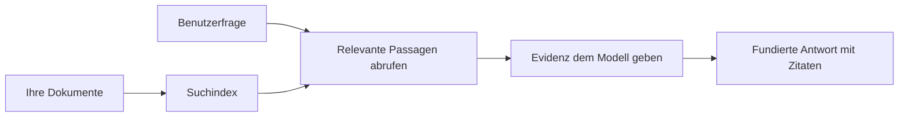

# Lehren Sie KI, Fragen basierend auf Ihren Dokumenten zu beantworten:  
## Serie 1: RAG, Azure vs Open-Source-Alternativen und wann Feinabstimmung sinnvoll ist

> Der erste Artikel einer Serie 2026, die meine Azure AI Search + Azure OpenAI-Dokumenten-QA-Tutorials aus 2023 neu beleuchtet.

Seriennavigation: [Repository-Startseite](../README.md) | Nächster: [Serie 2 – Aufbau eines lokalen Open-Source-RAG-Systems von Anfang bis Ende](./series-2-open-source-rag-end-to-end.md)

## 1. Einführung – Rückblick auf ein früheres RAG-Tutorial

Im Jahr 2023 habe ich an einem Paar Tutorials gearbeitet, wie man ChatGPT beibringt, Fragen aus PDF-Dokumenten mit Azure AI Search und Azure OpenAI zu beantworten. Ich habe die [LangChain-Version](https://techcommunity.microsoft.com/blog/educatordeveloperblog/teach-chatgpt-to-answer-questions-using-azure-ai-search--azure-openai-lang-chain/3969713) geschrieben und gemeinsam mit [Lee Stott](https://developer.microsoft.com/en-us/advocates/lee-stott), Principal Cloud Advocate Manager bei Microsoft, die begleitende [Semantic Kernel-Version](https://techcommunity.microsoft.com/blog/educatordeveloperblog/teach-chatgpt-to-answer-questions-using-azure-ai-search--azure-openai-semantic-k/3985395) verfasst. Damals fühlte sich die Idee „ChatGPT auf Deinen eigenen Daten“ für viele Entwickler noch neu an. Die Tutorials nutzten Azure Blob Storage, Azure AI Search, Azure OpenAI, LangChain, Semantic Kernel und FAISS-ähnliche Vektorretrievals, um Fragen aus PDF-Dateien zu beantworten.

Der frühere Artikel konzentrierte sich auf einen einfachen, aber wichtigen Workflow: Dokumente hochladen, diese indexieren, relevante Inhalte abrufen und ein Modell bitten, basierend auf diesen Inhalten zu antworten.

Im Jahr 2026 ist das RAG-Ökosystem erheblich gewachsen. Azure AI Search unterstützt jetzt moderne Vektor- und hybride Retrieval-Patterns, Azure OpenAI ist Teil des umfassenderen Microsoft Foundry Models-Ökosystems und die neuere v1-API kann den standardmäßigen OpenAI-Client nutzen, ohne monatliche `api-version`-Änderungen zu erfordern. Gleichzeitig sind Open-Source-Optionen wie LangGraph, LlamaIndex, Haystack, Qdrant, Milvus, Weaviate, Chroma, Ollama und vLLM praktische Alternativen für echte RAG-Systeme geworden.

Deshalb wollte ich dieses Thema erneut aufgreifen. Die Frage lautet nicht mehr nur: „Wie baue ich RAG?“ Es gibt jetzt viele Wege, es zu bauen, und die wichtigere Frage ist „Welche Architektur sollte ich für meine Situation wählen?“

Aber das Kernproblem hat sich nicht geändert.

Ein KI-Modell kennt nicht automatisch Ihre Dokumente. Um ein nützliches Dokumenten-QA-System zu bauen, benötigen Sie weiterhin zuverlässiges Retrieval, Grounding, Bewertung und operationelle Workflows.

Dieser Artikel ist kein weiteres End-to-End-Tutorial „Chat mit PDF“. Ich möchte diese aktualisierte Serie mit der Frage beginnen, die mir heute wichtiger ist: Wann sollten Sie eine verwaltete Azure-Architektur wählen, wann ist ein Open-Source-RAG-Stack sinnvoll und wann macht Feinabstimmung tatsächlich Sinn?

Dies ist der erste Artikel einer Serie zum Bau dokumentengestützter KI-Systeme. Im ersten Teil konzentrieren wir uns auf Architekturentscheidungen: warum RAG wichtig ist, wann Azure-basierte verwaltete Dienste nützlich sind, wann Open-Source-Alternativen Sinn machen und wo Feinabstimmung passt.

Nach dem Aufbau und der Neubewertung von Dokumenten-QA-Systemen interessiert mich weniger, welches Tool in einer Demo am besten aussieht. Mir ist wichtiger, welche Architektur echte Benutzer, sich ändernde Dokumente, Berechtigungen, Ausfälle und Wartung übersteht.

## 2. Warum Ihre KI ein Suchsystem braucht

Große Sprachmodelle werden auf breiten öffentlichen und lizenzierten Daten trainiert. Sie wissen vielleicht viel zu allgemeinen Themen, aber sie kennen nicht automatisch Ihre privaten PDFs, internen Richtlinien, Unternehmensprozesse, Forschungsarchive, Unterrichtsmaterialien, Kundensupport-Notizen oder kürzlich aktualisierte Dokumentationen.

Eine einfache Art, über RAG nachzudenken, ist diese: Statt zu erwarten, dass das Modell sich an jedes einzelne Dokument erinnert, geben wir ihm ein Suchsystem. Wenn ein Nutzer eine Frage stellt, findet das System zuerst die relevantesten Informationsstücke und gibt diese dem Modell als Kontext.

Das ist wichtig, weil viele reale Wissensquellen privat, ständig im Wandel, berechtigungssensitiv, über mehrere Systeme verteilt, in vielen Formaten geschrieben und zu groß sind, um sie direkt in einen Prompt einzufügen.

Beispielsweise, wenn eine Schule, ein Unternehmen oder ein Forschungsteam 10.000 interne Dokumente hat, kann das Modell nicht zuverlässig aus diesen Dokumenten antworten, es sei denn, das System ruft die richtigen Teile zur richtigen Zeit ab.

Das führt natürlich zu einer häufigen Frage:

Warum nicht einfach das Modell feinabstimmen?

Feinabstimmung kann nützlich sein, ist aber in der Regel nicht das richtige erste Werkzeug für Dokumentenwissen. Wenn das Wissen sich oft ändert, wenn Zitierungen wichtig sind oder Zugriffsrechte eine Rolle spielen, ist RAG meistens der bessere Ausgangspunkt. Feinabstimmung eignet sich eher zum Lehren von Verhalten, Stil, Ausgabeformat und Aufgabenmustern.

## 3. RAG-Architektur in der Praxis

Stellen Sie sich vor, Sie bauen einen KI-Assistenten für eine Schule. Der Assistent soll Fragen aus Richtlinien-PDFs, Kursleitfäden, internen FAQ-Seiten und kürzlich aktualisierten Ankündigungen beantworten.

Wenn ein Schüler fragt: „Kann ich generative KI für meine Abschlussarbeit verwenden?“, sollte das System nicht aus dem allgemeinen Gedächtnis des Modells antworten. Es sollte zuerst die relevante Schulrichtlinie finden, den Abschnitt zur KI-Nutzung abrufen und dann das Modell bitten, anhand dieser Belege zu antworten.

Das ist RAG in der Praxis.

Auf hoher Ebene kann man sich den Ablauf so vorstellen:

  
Die Details können komplexer sein, aber die Grundidee ist einfach: Das Modell antwortet nicht allein. Es antwortet mit abgerufenen Belegen.

Zuerst werden Dokumente aus Speicher-Systemen wie Azure Blob Storage, SharePoint, GitHub oder einem internen CMS eingelesen. Dann verarbeitet das System sie in Text und bewahrt dabei nützliche Strukturen wie Überschriften, Seitenzahlen, Tabellen, Abschnitte und Quellpositionen.

Als Nächstes wird der Inhalt in Abschnitte (Chunks) aufgeteilt. Dieser Schritt klingt einfach, ist aber einer der wichtigsten Teile des Systems. Wenn ein Abschnitt zu klein ist, kann er den umgebenden Kontext verlieren. Wenn ein Abschnitt zu groß ist, kann er irrelevante Informationen enthalten und das Retrieval unpräziser machen.

Nach der Chunking-Phase erstellt das System Embeddings und speichert sie zusammen mit dem Originaltext und Metadaten wie Dateiname, Seitenzahl, Berechtigungen, Dokumentversion und Quell-URL in einem durchsuchbaren Index.

Wenn der Nutzer eine Frage stellt, ruft das System Kandidaten-Abschnitte mittels Stichwortsuche, Vektorsuche oder Hybrid-Suche ab. Ein Reranker kann diese Abschnitte neu ordnen, sodass die nützlichsten Belege oben stehen.

Schließlich erhält das Modell die Frage und die abgerufenen Belege. Die Antwort sollte in diesen Belegen verankert sein und Zitierungen zurückgeben, sodass der Nutzer die Quelle prüfen kann.

Der wichtige Punkt ist, dass RAG nicht nur „PDFs in eine Vektordatenbank packen“ bedeutet. Die Qualität der Antwort hängt vom gesamten Workflow ab: Parsing, Chunking, Retrieval, Reranking, Prompting, Zitierung und Bewertung.

Deshalb ist Dokumentenstruktur wichtig. In einem PDF können Überschriften, Tabellen, Fußnoten oder Seitenumbrüche die Bedeutung eines Textabschnitts verändern. Auf Azure verwendet die Document Layout-Skill Azure Document Intelligence Layout-Fähigkeiten, um strukturierte Ausgaben zu erzeugen, die Chunking- und Retrieval-Qualität für RAG-Systeme verbessern können.

## 4. Was hat sich seit 2023 geändert?

Das Tutorial aus 2023 war für seine Zeit ein guter Startpunkt:

- PDF-Dateien wurden in Azure Blob Storage gespeichert.
- Azure AI Search indeksierte den Inhalt.
- LangChain verband das Retrieval mit Azure OpenAI.
- FAISS wurde als einfacher lokaler Vektorspeicher genutzt.
- Das Beispiel verwendete `gpt-35-turbo` und `text-embedding-ada-002`.

Im Jahr 2026 sollte eine moderne Version mehrere Änderungen widerspiegeln.

Erstens wurde das Retrieval reifer. 2023 verwendeten viele Demos einfache Vektorähnlichkeitssuchen. Heute ist hybrides Retrieval oft der standardmäßige Startpunkt für ernsthaftes Dokumenten-QA. Azure AI Search unterstützt Hybrid-Suche, indem Stichwort- und Vektor-Anfragen in einer einzelnen Anfrage kombiniert und Ergebnisse mit Reciprocal Rank Fusion zusammengeführt werden. Semantic Ranker kann dann die Textseite von Volltext-, Vektor- und Hybrid-Ergebnissen neu ordnen.

Zweitens ist das Einlesen anspruchsvoller geworden. Anstatt jedes Dokument manuell im Anwendungscode aufzuteilen, unterstützt Azure AI Search integrierte Vektorisierung für Chunking, Embedding und Vektorisierung zur Abfragezeit. Für PDFs und dokumentenintensive Arbeitslasten kann die Document Layout-Skill mehr Struktur bewahren als feste Chunks.

Drittens gewinnt die Orchestrierung an Bedeutung. Der schwierige Teil ist oft nicht der LLM-API-Aufruf selbst. Der schwierige Teil besteht im Umgang mit Ausfällen, Wiederholungen, veraltetem Retrieval, Chunk-Qualität, langlaufenden Workflows, menschlicher Überprüfung und Bewertung in großem Maßstab. Hier werden workflow-orientierte Tools wie LangGraph, LlamaIndex-Workflows, Haystack-Pipelines und Plattformtools für Bewertung und Beobachtbarkeit relevanter als eine einzelne lineare Kette.

Viertens ist die Bewertung nicht mehr optional. Eine Demo kann mit einer Frage eindrucksvoll aussehen. Ein Produktionssystem benötigt Testsets, Regressionsprüfungen, Retrieval-Metriken, Groundedness-Checks und Monitoring. Ohne Bewertung ist schwer zu wissen, ob das System sich verbessert oder nur verändert.

## 5. Wahl zwischen Azure und Open-Source RAG-Stacks

Ich denke nicht, die nützliche Frage lautet: „Ist Azure besser als Open Source?“ oder „Ist Open Source besser als Azure?“

Die nützliche Frage ist: Welche Art von System bauen Sie? Wer wird es betreiben? Welche Einschränkungen gibt es? Welche Ausfallarten sind inakzeptabel?

Als ich begann, Dokumenten-QA-Beispiele zu bauen, dachte ich hauptsächlich daran, ob das Retrieval funktionierte. Konnte ich PDFs hochladen, durchsuchen und eine Antwort generieren? Das war ein vernünftiger Start.

Nach Durcharbeiten realistischerer KI-Workflows hat sich meine Bewertung geändert. Ich betrachte jetzt vier Dinge, bevor ich einen RAG-Stack auswähle:

- Identität und Berechtigungen  
- Retrieval-Qualität  
- Workflow-Zuverlässigkeit  
- Betriebliches Eigentum

Diese vier Bereiche sagen viel mehr als nur ein Modell-Benchmark.

Azure-basierte Architekturen machen meist Sinn, wenn die Unternehmensintegration der schwierige Teil ist. Wenn ein Team bereits auf Microsoft Entra ID, Microsoft 365, Azure Storage, private Netzwerke, RBAC und Azure-Monitoring angewiesen ist, können Azure AI Search und Azure OpenAI viel operative Komplexität reduzieren. In diesem Umfeld ist Azure nicht nur eine Modell-API. Der Wert liegt im umgebenden System: Identität, Governance, verwaltete Suche, Sicherheitsintegration, Support und vertrauter Betrieb.

Open-Source-Architekturen machen meist Sinn, wenn Flexibilität der schwierige Teil ist. Wenn ein Team lokale Inferenz, Cloud-Portabilität, eine eigene Retrieval-Pipeline, spezialisierte Rerankings oder direkte Kontrolle über die Vektordatenbank und die Modell-Serving-Schicht benötigt, kann ein Open-Source-Stack die bessere Wahl sein. Der Kompromiss ist, dass das Team mehr Verantwortung für Zuverlässigkeit trägt: Backups, Skalierung, Latenz, Migrationen, Monitoring und Sicherheit.

In der Praxis sind viele Produktions-KI-Systeme weder rein Cloud-native noch rein Open Source. Sie sind oft hybride Systeme, die operationelle Einfachheit, Portabilität, Governance und technische Flexibilität ausbalancieren.

Zum Beispiel wäre es für mich nicht überraschend zu sehen, dass ein System Azure OpenAI für Modellzugang, LangGraph für Workflow-Orchestrierung, Azure Hosting für Deployment und eine Open-Source-Vektordatenbank für eine spezielle Retrieval-Anforderung verwendet. Das ist keine architektonische Inkonsistenz. Das ist die Wahl des richtigen Levels verwalteter Dienste und technischer Kontrolle für jede Systemkomponente.

Ich mag hybride Architekturen, wenn die verwaltete Plattform wichtige Unternehmensprobleme löst, während Open-Source-Bausteine dem Team Flexibilität dort geben, wo sie wirklich zählt.

## 6. Ein praktischer Entscheidungsleitfaden

Hier ist die Entscheidungstabelle, die ich mit einem Team verwenden würde, bevor wir einen RAG-Stack auswählen:

| Entscheidungsbereich | Azure Managed Stack ist stärker, wenn... | Open-Source Stack ist stärker, wenn... |
| --- | --- | --- |
| Identität und Zugriff | Entra ID, RBAC, Managed Identity und Unternehmensberechtigungen zentral sind | kundenspezifische Authentifizierung, Nicht-Microsoft-Identität oder anwendungsspezifische Zugriffslogik dominiert |
| Betrieb | das Team verwaltete Infrastruktur, Support, SLAs und einfacheres Onboarding möchte | das Team Vektordatenbanken, Modell-Serving, Backups und Skalierung selbst betreiben kann |
| Retrieval | hybride Suche, semantische Rangfolge, Filter und Metadatenabfrage die meisten Bedürfnisse abdecken | das Team kundenspezifisches Retrieval, spezialisiertes Reranking oder experimentelles Indexing benötigt |
| Portabilität | die Azure-Ökosystem-Ausrichtung akzeptabel oder bevorzugt ist | Cloud-Lock-in ein hartes Ausschlusskriterium ist |
| Inferenz | Governance, Netzwerk und Unternehmenskontrollen bei Azure OpenAI wichtig sind | lokale Inferenz, kundenspezifische Modelle oder selbstgehostete Bereitstellung erforderlich sind |
| Kosten | die Reduktion von Engineering- und Betriebsaufwand wichtiger ist als Infrastruktur-Tuning | die Skalierung groß genug ist, um sorgfältige Infrastrukturoptimierung zu rechtfertigen |
| Experimentieren | Stabilität und Unternehmensintegration wichtiger als häufige Komponentenwechsel ist | das Team rasch an Agenten, Tools, Memory und Retrieval-Workflows iteriert |

Meine Faustregel ist einfach:

- Beginnen Sie mit Azure, wenn Unternehmensintegration, Sicherheit und Betriebssicherheit die Haupt-Risiken sind.  
- Beginnen Sie mit Open Source, wenn Portabilität, Anpassung oder lokale Kontrolle die Haupt-Risiken sind.  
- Verwenden Sie einen hybriden Stack, wenn beides zutrifft.

Deshalb würde ich eine RAG-Serie 2026 auch nicht mit Code starten. Code ist wichtig, aber die Architekturauswahl kommt vor der Implementierung. Eine einfache Demo kann die schwierigsten Entscheidungen verbergen. Ein gutes RAG-System macht diese Entscheidungen explizit.

## 7. Wo Feinabstimmung passt

Feinabstimmung wird oft zusammen mit RAG genannt, aber ich finde es wichtig, die beiden zu trennen.

RAG ist meistens die bessere Wahl, wenn das System frisches, privates, berechtigungssensitives oder quellengestütztes Wissen benötigt. Wenn die Antwort Dokumente zitieren soll, aktuelle Updates widerspiegeln oder benutzerspezifische Zugriffsregeln respektieren muss, sollte Retrieval Teil der Architektur sein.
Feinabstimmung ist nützlicher, wenn Wissen nicht das Hauptproblem ist. Sie kann helfen, wenn Sie möchten, dass das Modell einem bestimmten Ausgabeformat folgt, einen domänenspezifischen Antwortstil übernimmt, eine stabile Aufgabe beständiger ausführt oder die Menge der in jeder Eingabeaufforderung benötigten Anweisungen reduziert.

In der Praxis können beide zusammenarbeiten. Ein Support-Assistent könnte RAG verwenden, um die neueste Richtlinie abzurufen, während ein feinabgestimmtes Modell die vom Unternehmen bevorzugte Antwortstruktur und den Ton lernt.

Der Fehler besteht darin, Feinabstimmung als Ersatz für einen Dokumentenspeicher zu behandeln. Sie ersetzt nicht die Notwendigkeit der Abfrage, wenn das System aus aktuellen, privaten oder berechtigungssensitiven Daten antworten muss.

## 8. Wohin diese Serie als Nächstes geht

Dieser Artikel ist die Entscheidungsschicht. Bevor ich Code schreibe, wollte ich die Kompromisse deutlich machen: RAG vs. Feinabstimmung, Azure vs. Open Source, verwaltete Dienste vs. operative Kontrolle.

Bevor ich in die Umsetzung gehe, möchte ich hier noch einen Punkt hinterlassen: In vielen Enterprise-AI-Systemen ist das Modell nur eine Komponente. Die Abfragequalität, Orchestrierung, Bewertung, Berechtigungen und operative Zuverlässigkeit sind oft ausschlaggebend dafür, ob das System über die Demo-Phase hinaus erfolgreich ist.

In den nächsten Teilen dieser Serie plane ich, tiefer in die praktische Seite dokumentgestützter KI-Systeme einzutauchen: zunächst den Aufbau eines lokalen Open-Source-RAG-Workflows, dann die Nachbildung desselben Szenarios mit Azure AI Search und Azure OpenAI und schließlich die Evaluierung, ob das System tatsächlich funktioniert.

Ich kann die Reihenfolge im Verlauf der Serie noch anpassen, aber das Ziel bleibt dasselbe: über eine einfache Demo hinauszugehen und zu zeigen, wie man über RAG-Systeme nachdenkt, die gewartet, bewertet und betrieben werden können.

## 9. Referenzen und Ressourcen

Original-Tutorials:

- [Teach ChatGPT to Answer Questions: Using Azure AI Search & Azure OpenAI (Lang Chain)](https://techcommunity.microsoft.com/blog/educatordeveloperblog/teach-chatgpt-to-answer-questions-using-azure-ai-search--azure-openai-lang-chain/3969713)
- [Teach ChatGPT to Answer Questions: Using Azure AI Search & Azure OpenAI (Semantic Kernel)](https://techcommunity.microsoft.com/blog/educatordeveloperblog/teach-chatgpt-to-answer-questions-using-azure-ai-search--azure-openai-semantic-k/3985395)

Azure:

- [Azure AI Search REST API versions](https://learn.microsoft.com/en-us/rest/api/searchservice/search-service-api-versions)
- [Hybrid search in Azure AI Search](https://learn.microsoft.com/en-us/azure/search/hybrid-search-how-to-query)
- [Integrated vectorization in Azure AI Search](https://learn.microsoft.com/en-us/azure/search/vector-search-integrated-vectorization)
- [Document Layout skill in Azure AI Search](https://learn.microsoft.com/en-us/azure/search/cognitive-search-skill-document-intelligence-layout)
- [Chunk and vectorize by document layout](https://learn.microsoft.com/en-us/azure/search/search-how-to-semantic-chunking)
- [Semantic ranking in Azure AI Search](https://learn.microsoft.com/en-us/azure/search/semantic-search-overview)
- [Azure OpenAI / Microsoft Foundry API version lifecycle](https://learn.microsoft.com/en-us/azure/foundry/openai/api-version-lifecycle)
- [Foundry Models sold by Azure](https://learn.microsoft.com/en-us/azure/foundry/foundry-models/concepts/models-sold-directly-by-azure)
- [Microsoft Foundry fine-tuning considerations](https://learn.microsoft.com/en-us/azure/foundry/openai/concepts/fine-tuning-considerations)
- [Microsoft Foundry observability](https://learn.microsoft.com/en-us/azure/foundry/concepts/observability)
- [Run evaluations in Microsoft Foundry](https://learn.microsoft.com/en-us/azure/foundry/how-to/evaluate-generative-ai-app)

Open Source:

- [LangGraph documentation](https://docs.langchain.com/oss/python/langgraph/overview)
- [LlamaIndex documentation](https://developers.llamaindex.ai/python/framework/)
- [Haystack documentation](https://docs.haystack.deepset.ai/)
- [Qdrant documentation](https://qdrant.tech/documentation/overview/)
- [Milvus documentation](https://milvus.io/docs/overview.md)
- [Weaviate documentation](https://docs.weaviate.io/weaviate/current/)
- [Chroma documentation](https://docs.trychroma.com/docs/overview/introduction)
- [Ollama embeddings](https://docs.ollama.com/capabilities/embeddings)
- [vLLM OpenAI-compatible server](https://docs.vllm.ai/en/latest/serving/openai_compatible_server.html)
- [BGE embedding models](https://huggingface.co/BAAI/bge-large-en-v1.5)
- [E5 embedding models](https://huggingface.co/intfloat/e5-large-v2)
- [Instructor embedding models](https://huggingface.co/hkunlp/instructor-large)

Nächste: [Serie 2 - Aufbau eines lokalen Open-Source-RAG-Systems End-to-End](./series-2-open-source-rag-end-to-end.md)

---

<!-- CO-OP TRANSLATOR DISCLAIMER START -->
**Haftungsausschluss**:
Dieses Dokument wurde mit dem KI-Übersetzungsdienst [Co-op Translator](https://github.com/Azure/co-op-translator) übersetzt. Obwohl wir uns um Genauigkeit bemühen, beachten Sie bitte, dass automatisierte Übersetzungen Fehler oder Ungenauigkeiten enthalten können. Das Originaldokument in seiner Ursprungssprache gilt als maßgebliche Quelle. Bei kritischen Informationen wird eine professionelle menschliche Übersetzung empfohlen. Wir übernehmen keine Haftung für Missverständnisse oder Fehlinterpretationen, die aus der Verwendung dieser Übersetzung entstehen.
<!-- CO-OP TRANSLATOR DISCLAIMER END -->