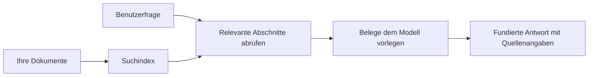

# Lehren Sie KI, Fragen auf der Grundlage Ihrer Dokumente zu beantworten:
## Reihe 1: RAG, Azure vs. Open-Source-Alternativen und wann Feintuning sinnvoll ist

> Der erste Artikel einer Serie aus dem Jahr 2026, die meine Azure AI Search + Azure OpenAI Dokumenten-QA-Tutorials aus dem Jahr 2023 neu betrachtet.

## 1. Einführung – Rückblick auf ein früheres RAG-Tutorial

Im Jahr 2023 arbeitete ich an einem Paar Tutorials darüber, wie man ChatGPT beibringt, Fragen aus PDF-Dokumenten mit Azure AI Search und Azure OpenAI zu beantworten. Ich schrieb die [LangChain-Version](https://techcommunity.microsoft.com/blog/educatordeveloperblog/teach-chatgpt-to-answer-questions-using-azure-ai-search--azure-openai-lang-chain/3969713) und war auch Co-Autor der begleitenden [Semantic Kernel-Version](https://techcommunity.microsoft.com/blog/educatordeveloperblog/teach-chatgpt-to-answer-questions-using-azure-ai-search--azure-openai-semantic-k/3985395) mit [Lee Stott](https://developer.microsoft.com/en-us/advocates/lee-stott), einem Principal Cloud Advocate Manager bei Microsoft. Damals fühlte sich die Idee von „ChatGPT auf Ihren Daten“ für viele Entwickler noch neu an. Die Tutorials verwendeten Azure Blob Storage, Azure AI Search, Azure OpenAI, LangChain, Semantic Kernel und FAISS-ähnliche Vektorrückholung, um Fragen aus PDF-Dateien zu beantworten.

Der frühere Artikel konzentrierte sich auf einen einfachen, aber wichtigen Workflow: Dokumente hochladen, indexieren, relevante Inhalte abrufen und ein Modell bitten, basierend auf diesen Inhalten zu antworten.

Im Jahr 2026 ist das RAG-Ökosystem erheblich gewachsen. Azure AI Search unterstützt jetzt moderne Vektor- und hybride Abrufmuster, Azure OpenAI ist Teil des breiteren Microsoft Foundry Models-Ökosystems, und die neuere v1 API kann den Standard-OpenAI-Client verwenden, ohne monatliche `api-version`-Änderungen zu benötigen. Gleichzeitig sind Open-Source-Optionen wie LangGraph, LlamaIndex, Haystack, Qdrant, Milvus, Weaviate, Chroma, Ollama und vLLM zu praktischen Wahlmöglichkeiten für echte RAG-Systeme geworden.

Deshalb wollte ich dieses Thema noch einmal aufgreifen. Die Frage lautet nicht mehr nur „Wie baue ich RAG?“ Es gibt jetzt viele Möglichkeiten, es zu bauen, und die wichtigere Frage lautet „Welche Architektur soll ich für meine Situation wählen?“

Das Kernproblem hat sich jedoch nicht geändert.

Ein KI-Modell kennt Ihre Dokumente nicht automatisch. Um ein nützliches Dokumenten-Frage-Antwort-System zu erstellen, benötigen Sie weiterhin zuverlässige Abrufe, Verankerung, Bewertung und betriebliche Workflows.

Dieser Artikel ist kein weiteres End-to-End „Chat mit PDF“-Tutorial. Ich möchte diese aktualisierte Serie mit der Frage beginnen, die mir jetzt wichtiger ist: Wann sollten Sie eine verwaltete Azure-Architektur wählen, wann eine Open-Source-RAG-Stack, und wann macht Feintuning wirklich Sinn?

Dies ist der erste Artikel einer Serie über den Aufbau dokumentenbasierter KI-Systeme. Im ersten Teil konzentrieren wir uns auf die Architekturentscheidungen: Warum RAG wichtig ist, wann Azure-basierte verwaltete Dienste nützlich sind, wann Open-Source-Alternativen sinnvoll sind und wo Feintuning hineinpasst.

Nach dem Aufbau und der erneuten Betrachtung von Dokumenten-QA-Systemen interessiere ich mich weniger dafür, welches Tool in einer Demo am besten aussieht, sondern mehr dafür, welche Architektur echte Nutzer, sich ändernde Dokumente, Berechtigungen, Ausfälle und Wartung übersteht.

## 2. Warum Ihre KI ein Suchsystem benötigt

Große Sprachmodelle werden mit umfangreichen öffentlichen und lizenzierten Daten trainiert. Sie wissen vielleicht viel über allgemeine Themen, kennen aber nicht automatisch Ihre privaten PDFs, internen Richtlinien, Unternehmensverfahren, Forschungsarchive, Unterrichtsmaterialien, Kundensupportnotizen oder kürzlich aktualisierte Dokumentationen.

Eine einfache Möglichkeit, RAG zu verstehen, ist diese: Anstatt vom Modell zu erwarten, sich jedes Dokument zu merken, geben wir ihm ein Suchsystem. Wenn ein Nutzer eine Frage stellt, findet das System zuerst die relevantesten Informationsstücke und gibt diese dann als Kontext an das Modell.

Das ist wichtig, weil viele reale Wissensquellen privat, ständig im Wandel, berechtigungssensitiv, über mehrere Systeme verteilt, in vielen Formaten geschrieben und zu groß sind, um direkt in einen Prompt eingefügt zu werden.

Zum Beispiel: Wenn eine Schule, ein Unternehmen oder ein Forschungsteam 10.000 interne Dokumente hat, kann das Modell nicht zuverlässig aus diesen Dokumenten antworten, es sei denn, das System ruft zum richtigen Zeitpunkt die richtigen Teile ab.

Das führt natürlich zu einer häufig gestellten Frage:

Warum nicht einfach das Modell feintunen?

Feintuning kann nützlich sein, ist aber in der Regel nicht das richtige erste Werkzeug für Dokumentenwissen. Wenn sich das Wissen oft ändert, wenn Zitate wichtig sind oder wenn Zugriffsberechtigungen relevant sind, ist RAG meist der bessere Ausgangspunkt. Feintuning eignet sich besser, um Verhalten, Stil, Ausgabeformat und Aufgabenmuster zu lehren.

## 3. RAG-Architektur in der Praxis

Stellen Sie sich vor, Sie bauen einen KI-Assistenten für eine Schule. Der Assistent muss Fragen aus PDF-Richtlinien, Kursleitfäden, internen FAQ-Seiten und kürzlich aktualisierten Ankündigungen beantworten.

Wenn ein Schüler fragt: „Kann ich generative KI für meine Abschlussarbeit verwenden?“, sollte das System nicht aus dem allgemeinen Gedächtnis des Modells antworten. Es sollte zuerst die relevante Schulrichtlinie finden, den Abschnitt über KI-Nutzung abrufen und dann das Modell bitten, anhand dieser Belege zu antworten.

Das ist RAG in der Praxis.

Auf hoher Ebene können Sie den Ablauf so sehen:

Die Details können anspruchsvoller werden, aber die Grundidee ist einfach: Das Modell antwortet nicht allein, sondern mit abgerufenen Belegen.

Zuerst werden Dokumente aus Speichersystemen wie Azure Blob Storage, SharePoint, GitHub oder einem internen CMS eingelesen. Dann analysiert das System sie zu Text und bewahrt nützliche Strukturen wie Überschriften, Seitenzahlen, Tabellen, Abschnitte und Quellorte.

Anschließend wird der Inhalt in Abschnitte aufgeteilt. Dieser Schritt klingt einfach, ist aber einer der wichtigsten Teile des Systems. Ist ein Abschnitt zu klein, kann der umgebende Kontext verloren gehen. Ist er zu groß, enthält er möglicherweise irrelevante Informationen und macht die Suche weniger präzise.

Nach der Aufteilung erzeugt das System Embeddings und speichert diese zusammen mit dem Originaltext und Metadaten wie Dateiname, Seitenzahl, Berechtigungen, Dokumentversion und Quell-URL in einem durchsuchbaren Index.

Wenn der Nutzer eine Frage stellt, ruft das System Kandidatenabschnitte über Schlüsselwortsuche, Vektorsuche oder Hybridsuche ab. Ein Reranker kann diese Abschnitte dann neu ordnen, sodass die nützlichsten Belege ganz oben stehen.

Schließlich erhält das Modell die Frage und die abgerufenen Belege. Die Antwort sollte auf diesen Belegen basieren und Zitate zurückgeben, damit der Nutzer die Quelle prüfen kann.

Wichtig ist, dass RAG nicht nur „PDFs in einer Vektordatenbank ablegen“ bedeutet. Die Antwortqualität hängt vom gesamten Workflow ab: Parsen, Aufteilung, Abruf, Neuordnung, Prompting, Zitation und Bewertung.

Deshalb ist Dokumentenstruktur wichtig. In einer PDF-Datei kann eine Überschrift, Tabelle, Fußnote oder Seitenbegrenzung die Bedeutung eines Abschnitts ändern. In Azure verwendet die Document Layout-Funktion die Layout-Fähigkeiten von Azure Document Intelligence, um strukturbewusste Ausgaben zu erzeugen, was die Qualität von Aufteilung und Abruf für RAG-Systeme verbessern kann.

## 4. Was hat sich seit 2023 geändert?

Das Tutorial von 2023 war damals ein guter Ausgangspunkt:

- Azure Blob Storage speicherte PDF-Dateien.
- Azure AI Search indexierte Inhalte.
- LangChain verband den Abruf mit Azure OpenAI.
- FAISS diente als einfache lokale Vektor-Speicherlösung.
- Das Beispiel nutzte `gpt-35-turbo` und `text-embedding-ada-002`.

Im Jahr 2026 sollte eine moderne Version mehrere Änderungen widerspiegeln.

Erstens ist der Abruf ausgereifter. 2023 verwendeten viele Demos einfache Vektorähnlichkeitssuchen. Heute ist die Hybridsuche oft die Standardauswahl für ernsthafte Dokumenten-QA. Azure AI Search unterstützt Hybridsuche, indem Schlüsselwort- und Vektor-Anfragen in einer einzigen Anfrage kombiniert und die Ergebnisse mit Reciprocal Rank Fusion zusammengeführt werden. Semantic Ranker kann dann die Textseite von Volltext-, Vektor- und Hybrid-Ergebnissen neu sortieren.

Zweitens ist die Aufnahme komplexer geworden. Statt jedes Dokument manuell mit Anwendungs-Code aufzuteilen, unterstützt Azure AI Search integrierte Vektorisierung für Chunking, Embedding und die Vektorisierung zur Abfragezeit. Für PDFs und dokumentenlastige Workloads kann die Document Layout-Funktion mehr Struktur bewahren als fest größenbasierte Abschnitte.

Drittens gewinnt Orchestrierung an Bedeutung. Der schwierige Teil ist oft nicht der eigentliche LLM-API-Aufruf. Der schwierige Teil besteht darin, Ausfälle, Wiederholungen, veraltete Abrufe, Abschnittsqualität, langlaufende Workflows, menschliche Überprüfung und Bewertung in großem Maßstab zu handhaben. Hier werden workflow-orientierte Tools wie LangGraph, LlamaIndex-Workflows, Haystack-Pipelines sowie Plattform-Evaluations- und Beobachtungstools wichtiger als eine einzige lineare Kette.

Viertens ist Bewertung nicht mehr optional. Eine Demo kann mit einer Frage beeindruckend aussehen. Ein Produktionssystem benötigt Testsets, Regressionstests, Abrufmetriken, Groundedness-Prüfungen und Überwachung. Ohne Bewertung ist schwer zu erkennen, ob sich das System verbessert oder nur verändert.

## 5. Wahl zwischen Azure- und Open-Source-RAG-Stacks

Ich glaube nicht, dass die nützliche Frage lautet: „Ist Azure besser als Open Source?“ oder „Ist Open Source besser als Azure?“

Die nützliche Frage ist: Welches System bauen Sie, wer betreibt es, welche Einschränkungen gibt es, und welche Ausfallmodi sind inakzeptabel?

Als ich begann, Dokumenten-QA-Beispiele zu bauen, dachte ich hauptsächlich daran, ob der Abruf funktioniert. Könnte ich PDFs hochladen, durchsuchen und eine Antwort generieren? Das war ein vernünftiger Ausgangspunkt.

Nach Arbeit an realistischeren AI-Workflows hat sich meine Bewertung geändert. Ich schaue jetzt auf vier Bereiche, bevor ich einen RAG-Stack wähle:

- Identität und Berechtigungen
- Abrufqualität
- Workflow-Zuverlässigkeit
- Betriebliche Verantwortung

Diese vier Bereiche sagen viel mehr als ein reiner Modell-Benchmark aus.

Azure-basierte Architekturen machen meist Sinn, wenn die Unternehmensintegration die Hürde ist. Wenn ein Team bereits auf Microsoft Entra ID, Microsoft 365, Azure Storage, privates Networking, RBAC und Azure-Monitoring angewiesen ist, können Azure AI Search und Azure OpenAI viel betriebliche Komplexität reduzieren. In dieser Umgebung ist Azure nicht nur eine Modell-API. Der Wert liegt im umliegenden System: Identität, Governance, verwaltete Suche, Sicherheitsintegration, Support und vertraute Betriebsabläufe.

Open-Source-Architekturen machen meist Sinn, wenn Flexibilität das Problem ist. Wenn das Team lokale Inferenz, Cloud-Portabilität, eine kundenspezifische Abruf-Pipeline, spezialisierte Neuordnung oder direkte Kontrolle über Vektordatenbank und Modell-Serving benötigt, ist ein Open-Source-Stack oft besser geeignet. Der Kompromiss ist, dass das Team mehr von der Zuverlässigkeit selbst verantwortet: Backups, Skalierung, Latenz, Migrationen, Überwachung und Sicherheit.

In der Praxis sind viele produktive AI-Systeme weder rein cloud-nativ noch rein Open Source. Sie sind oft Hybridsysteme, die Betriebssimpelheit, Portabilität, Governance und technische Flexibilität balancieren.

Zum Beispiel würde es mich nicht überraschen, wenn ein System Azure OpenAI für Modellzugriff, LangGraph für Workflow-Orchestrierung, Azure-Hosting für Deployment und eine Open-Source-Vektordatenbank für spezielle Abrufanforderungen nutzt. Das ist keine architektonische Inkonsistenz. Das ist die Wahl des richtigen Grads an verwaltetem Service und technischer Kontrolle für jeden Systembereich.

Ich mag Hybridarchitekturen, wenn die verwaltete Plattform wichtige Unternehmensprobleme löst, während Open-Source-Komponenten dem Team Flexibilität dort geben, wo sie wirklich zählt.

## 6. Ein praktischer Entscheidungsleitfaden

Hier ist die Entscheidungstabelle, die ich mit einem Team verwenden würde, bevor wir einen RAG-Stack wählen:

| Entscheidungsbereich | Azure-verwalteter Stack ist besser, wenn... | Open-Source-Stack ist besser, wenn... |
| --- | --- | --- |
| Identität und Zugriff | Entra ID, RBAC, Managed Identity und Unternehmensberechtigungen zentral sind | kundenspezifische Authentifizierung, nicht-Microsoft-Identität oder app-spezifische Zugriffslogik dominierend sind |
| Betrieb | das Team verwaltete Infrastruktur, Support, SLAs und einfaches Onboarding möchte | das Team Vektordatenbanken, Modell-Serving, Backups und Skalierung betreiben kann |
| Abruf | Hybridsuche, semantische Rangfolge, Filter und Metadatensuche die meisten Bedürfnisse abdecken | das Team kundenspezifischen Abruf, spezialisierte Neuordnung oder experimentelle Indizierung benötigt |
| Portabilität | Azure-Ökosystem-Ausrichtung akzeptabel oder bevorzugt ist | Vermeidung von Cloud-Lock-in eine harte Anforderung ist |
| Inferenz | Azure OpenAI Governance, Networking und Unternehmenskontrollen wichtig sind | lokale Inferenz, kundenspezifische Modelle oder selbst gehostetes Serving erforderlich sind |
| Kosten | Reduktion von Entwicklungs- und Betriebsaufwand wichtiger als Infrastruktur-Tuning ist | das Volumen groß genug ist, um sorgfältige Infrastrukturoptimierung zu rechtfertigen |
| Experimentieren | Stabilität und Unternehmensintegration wichtiger sind als häufige Komponentenwechsel | das Team schnell bei Agenten, Tools, Memory- und Abruf-Workflows iteriert |

Meine Faustregel ist einfach:

- Beginnen Sie mit Azure, wenn Unternehmensintegration, Sicherheit und operative Einfachheit die Hauptrisiken sind.
- Beginnen Sie mit Open Source, wenn Portabilität, Anpassung oder lokale Kontrolle die Hauptrisiken sind.
- Verwenden Sie einen Hybrid-Stack, wenn beides zutrifft.

Deshalb würde ich eine RAG-Serie 2026 auch nicht mit Code starten. Code ist wichtig, aber die Architekturauswahl kommt vor der Implementierung. Eine einfache Demo kann die härtesten Entscheidungen verstecken. Ein gutes RAG-System macht diese Entscheidungen explizit.

## 7. Wo Feintuning passt

Feintuning wird oft zusammen mit RAG erwähnt, aber ich halte es für wichtig, die beiden zu trennen.

RAG ist meist die bessere Wahl, wenn das System aktuelles, privates, berechtigungssensitives oder quellgrundiertes Wissen benötigt. Wenn die Antwort Dokumente zitieren, aktuelle Updates widerspiegeln oder benutzerspezifische Zugriffsregeln respektieren soll, sollte Abruf Teil der Architektur sein.

Feintuning ist sinnvoller, wenn Wissen nicht das Hauptproblem ist. Es kann helfen, wenn Sie möchten, dass das Modell ein bestimmtes Ausgabeformat einhält, einen domänenspezifischen Antwortstil nutzt, eine stabile Aufgabe konsistenter ausführt oder die erforderliche Instruktion in jedem Prompt reduziert.
In der Praxis können die beiden zusammenarbeiten. Ein Support-Assistent könnte RAG verwenden, um die neueste Richtlinie abzurufen, während ein feinabgestimmtes Modell die bevorzugte Antwortstruktur und den Ton des Unternehmens lernt.

Der Fehler besteht darin, Feinabstimmung als Ersatz für einen Dokumentenspeicher zu betrachten. Sie beseitigt nicht die Notwendigkeit der Abfrage, wenn das System Antworten aus aktuellen, privaten oder genehmigungssensitiven Daten geben muss.

## 8. Wohin Diese Serie Als Nächstes Führt

Dieser Artikel ist die Entscheidungsebene. Bevor ich Code schreibe, wollte ich die Kompromisse explizit machen: RAG vs Feinabstimmung, Azure vs Open Source, verwaltete Dienste vs operative Kontrolle.

Bevor wir mit der Umsetzung beginnen, möchte ich hier noch einen Punkt hinterlassen: In vielen Enterprise-KI-Systemen ist das Modell nur eine Komponente. Die Qualität der Abfrage, Orchestrierung, Bewertung, Berechtigungen und Betriebssicherheit bestimmen oft, ob das System über die Demo-Phase hinaus erfolgreich ist.

In den nächsten Teilen dieser Serie plane ich, tiefer in die praktische Seite dokumentenbasierter KI-Systeme einzutauchen: wie man eine auf Azure basierende Architektur aufbaut, wie sich Open-Source-Alternativen in der Praxis vergleichen und wie man bewertet, ob ein RAG-System tatsächlich funktioniert.

Ich könnte die Reihenfolge anpassen, während sich die Serie entwickelt, aber das Ziel bleibt gleich: über eine einfache Demo hinausgehen und zeigen, wie man über RAG-Systeme nachdenkt, die gewartet, bewertet und betrieben werden können.

## 9. Referenzen und Ressourcen

Original Tutorials:

- [Lehren Sie ChatGPT, Fragen zu beantworten: Verwendung von Azure AI Search & Azure OpenAI (Lang Chain)](https://techcommunity.microsoft.com/blog/educatordeveloperblog/teach-chatgpt-to-answer-questions-using-azure-ai-search--azure-openai-lang-chain/3969713)
- [Lehren Sie ChatGPT, Fragen zu beantworten: Verwendung von Azure AI Search & Azure OpenAI (Semantic Kernel)](https://techcommunity.microsoft.com/blog/educatordeveloperblog/teach-chatgpt-to-answer-questions-using-azure-ai-search--azure-openai-semantic-k/3985395)

Azure:

- [Azure AI Search REST API-Versionen](https://learn.microsoft.com/en-us/rest/api/searchservice/search-service-api-versions)
- [Hybrid-Suche in Azure AI Search](https://learn.microsoft.com/en-us/azure/search/hybrid-search-how-to-query)
- [Integrierte Vektorisierung in Azure AI Search](https://learn.microsoft.com/en-us/azure/search/vector-search-integrated-vectorization)
- [Fähigkeit „Dokumentenlayout“ in Azure AI Search](https://learn.microsoft.com/en-us/azure/search/cognitive-search-skill-document-intelligence-layout)
- [Chunk und Vektorisierung nach Dokumentlayout](https://learn.microsoft.com/en-us/azure/search/search-how-to-semantic-chunking)
- [Semantische Rangfolge in Azure AI Search](https://learn.microsoft.com/en-us/azure/search/semantic-search-overview)
- [Azure OpenAI / Microsoft Foundry API-Versionslebenszyklus](https://learn.microsoft.com/en-us/azure/foundry/openai/api-version-lifecycle)
- [Foundry-Modelle, die von Azure verkauft werden](https://learn.microsoft.com/en-us/azure/foundry/foundry-models/concepts/models-sold-directly-by-azure)
- [Microsoft Foundry Überlegungen zur Feinabstimmung](https://learn.microsoft.com/en-us/azure/foundry/openai/concepts/fine-tuning-considerations)
- [Microsoft Foundry Beobachtbarkeit](https://learn.microsoft.com/en-us/azure/foundry/concepts/observability)
- [Bewertungen in Microsoft Foundry durchführen](https://learn.microsoft.com/en-us/azure/foundry/how-to/evaluate-generative-ai-app)

Open Source:

- [LangGraph Dokumentation](https://docs.langchain.com/oss/python/langgraph/overview)
- [LlamaIndex Dokumentation](https://developers.llamaindex.ai/python/framework/)
- [Haystack Dokumentation](https://docs.haystack.deepset.ai/)
- [Qdrant Dokumentation](https://qdrant.tech/documentation/overview/)
- [Milvus Dokumentation](https://milvus.io/docs/overview.md)
- [Weaviate Dokumentation](https://docs.weaviate.io/weaviate/current/)
- [Chroma Dokumentation](https://docs.trychroma.com/docs/overview/introduction)
- [Ollama Einbettungen](https://docs.ollama.com/capabilities/embeddings)
- [vLLM OpenAI-kompatibler Server](https://docs.vllm.ai/en/latest/serving/openai_compatible_server.html)
- [BGE Einbettungsmodelle](https://huggingface.co/BAAI/bge-large-en-v1.5)
- [E5 Einbettungsmodelle](https://huggingface.co/intfloat/e5-large-v2)
- [Instructor Einbettungsmodelle](https://huggingface.co/hkunlp/instructor-large)

---

<!-- CO-OP TRANSLATOR DISCLAIMER START -->
**Haftungsausschluss**:
Dieses Dokument wurde mit dem KI-Übersetzungsdienst [Co-op Translator](https://github.com/Azure/co-op-translator) übersetzt. Obwohl wir uns um Genauigkeit bemühen, beachten Sie bitte, dass automatisierte Übersetzungen Fehler oder Ungenauigkeiten enthalten können. Das Originaldokument in seiner Ursprungssprache gilt als maßgebliche Quelle. Bei kritischen Informationen wird eine professionelle menschliche Übersetzung empfohlen. Wir übernehmen keine Haftung für Missverständnisse oder Fehlinterpretationen, die aus der Verwendung dieser Übersetzung entstehen.
<!-- CO-OP TRANSLATOR DISCLAIMER END -->