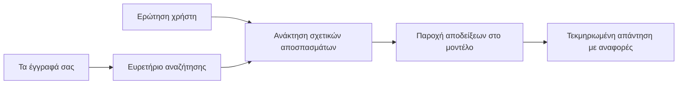

# Διδάξτε την ΤΝ να Απαντά σε Ερωτήσεις Βασισμένες στα Έγγραφά σας:
## Σειρά 1: RAG, Azure vs Εναλλακτικές Ανοικτού Κώδικα, και Πότε Έχει Νόημα η Εξειδικευμένη Εκπαίδευση

> Το πρώτο άρθρο μιας σειράς του 2026 που επανεξετάζει τα εκπαιδευτικά σεμινάρια μου για το Azure AI Search + Azure OpenAI το 2023 σχετικά με την ερώτηση-απάντηση εγγράφων.

Πλοήγηση στη σειρά: [Αρχική Αποθετηρίου](../README.md) | Επόμενο: [Σειρά 2 - Δημιουργία Τοπικού Συστήματος RAG Ανοικτού Κώδικα από την Αρχή ως το Τέλος](./series-2-open-source-rag-end-to-end.md)

## 1. Εισαγωγή - Επανεξέταση ενός Προηγούμενου Μαθήματος RAG

Το 2023, δούλεψα πάνω σε ένα ζευγάρι εκπαιδευτικών σεμιναρίων για το πώς να διδάξετε το ChatGPT να απαντά σε ερωτήσεις από αρχεία PDF χρησιμοποιώντας το Azure AI Search και το Azure OpenAI. Έγραψα την [έκδοση LangChain](https://techcommunity.microsoft.com/blog/educatordeveloperblog/teach-chatgpt-to-answer-questions-using-azure-ai-search--azure-openai-lang-chain/3969713) και επίσης συνέγραψα την συνοδευτική [έκδοση Semantic Kernel](https://techcommunity.microsoft.com/blog/educatordeveloperblog/teach-chatgpt-to-answer-questions-using-azure-ai-search--azure-openai-semantic-k/3985395) με τον [Lee Stott](https://developer.microsoft.com/en-us/advocates/lee-stott), έναν κύριο διαχειριστή υποστήριξης cloud στη Microsoft. Τότε, η ιδέα του "ChatGPT στα δεδομένα σας" φαινόταν ακόμα νέα για πολλούς προγραμματιστές. Τα σεμινάρια χρησιμοποίησαν το Azure Blob Storage, Azure AI Search, Azure OpenAI, LangChain, Semantic Kernel και ανάκτηση διανυσματικών δεδομένων τύπου FAISS για να απαντούν σε ερωτήσεις από αρχεία PDF.

Το πρώτο αυτό άρθρο επικεντρώθηκε σε μια απλή αλλά σημαντική ροή εργασίας: ανέβασμα εγγράφων, δημιουργία ευρετηρίου, ανάκτηση σχετικού περιεχομένου και ερώτηση ενός μοντέλου για απάντηση βασισμένη σε αυτό το περιεχόμενο.

Το 2026, το οικοσύστημα RAG έχει αναπτυχθεί σημαντικά. Το Azure AI Search υποστηρίζει πλέον σύγχρονα μοτίβα διανυσματικής και υβριδικής ανάκτησης, το Azure OpenAI αποτελεί μέρος του ευρύτερου οικοσυστήματος Microsoft Foundry Models, και το νεότερο API v1 μπορεί να χρησιμοποιεί τον τυπικό πελάτη OpenAI χωρίς να απαιτούνται μηνιαίες αλλαγές `api-version`. Την ίδια στιγμή, επιλογές ανοικτού κώδικα όπως τα LangGraph, LlamaIndex, Haystack, Qdrant, Milvus, Weaviate, Chroma, Ollama και vLLM έχουν γίνει πρακτικές επιλογές για πραγματικά συστήματα RAG.

Για αυτό ήθελα να επανεξετάσω αυτό το θέμα. Η ερώτηση δεν είναι πλέον μόνο "Πώς φτιάχνω RAG;" Υπάρχουν πλέον πολλοί τρόποι να το φτιάξεις, και η πιο σημαντική ερώτηση είναι "Ποια αρχιτεκτονική πρέπει να επιλέξω για την περίπτωσή μου;"

Αλλά το βασικό πρόβλημα δεν έχει αλλάξει.

Ένα μοντέλο ΤΝ δεν γνωρίζει αυτόματα τα έγγραφά σας. Για να φτιάξετε ένα χρήσιμο σύστημα ερώτησης-απάντησης εγγράφων, χρειάζεστε ακόμα αξιόπιστη ανάκτηση, θεμελίωση, αξιολόγηση και ροές εργασίας λειτουργίας.

Αυτό το άρθρο δεν είναι ένα ακόμα ολοκληρωμένο σεμινάριο "συνομιλίας με PDF". Θέλω να ξεκινήσω αυτή την ενημερωμένη σειρά με την ερώτηση που τώρα με ενδιαφέρει περισσότερο: πότε πρέπει να επιλέξετε μια διαχειριζόμενη αρχιτεκτονική Azure, πότε ένα στοίβα ανοικτού κώδικα RAG και πότε έχει πραγματικά νόημα η εξειδικευμένη εκπαίδευση;

Αυτό είναι το πρώτο άρθρο μιας σειράς για τη δημιουργία συστημάτων ΤΝ βασισμένων σε έγγραφα. Σε αυτό το πρώτο μέρος, θα επικεντρωθούμε στις αποφάσεις αρχιτεκτονικής: γιατί το RAG έχει σημασία, πότε είναι χρήσιμες οι διαχειριζόμενες υπηρεσίες Azure, πότε έχουν νόημα οι εναλλακτικές ανοικτού κώδικα και πού εντάσσεται η εξειδικευμένη εκπαίδευση.

Αφού έχω κατασκευάσει και επανεξετάσει συστήματα ερώτησης-απάντησης εγγράφων, με ενδιαφέρει λιγότερο ποιο εργαλείο φαίνεται καλύτερο σε μια επίδειξη και περισσότερο ποια αρχιτεκτονική επιβιώνει σε πραγματικούς χρήστες, μεταβαλλόμενα έγγραφα, δικαιώματα, αποτυχίες και συντήρηση.

## 2. Γιατί η ΤΝ σας χρειάζεται ένα Σύστημα Αναζήτησης

Τα μεγάλα γλωσσικά μοντέλα εκπαιδεύονται σε ευρεία δημόσια και αδειοδοτημένα δεδομένα. Μπορεί να γνωρίζουν πολλά για γενικά θέματα, αλλά δεν γνωρίζουν αυτόματα τα ιδιωτικά PDF σας, τις εσωτερικές πολιτικές, τις επιχειρησιακές διαδικασίες, τα αρχεία ερευνών, τα υλικά τάξης, τις σημειώσεις υποστήριξης πελατών ή την πρόσφατα ενημερωμένη τεκμηρίωση.

Ένας απλός τρόπος να σκεφτείτε το RAG είναι αυτός: αντί να περιμένουμε από το μοντέλο να θυμάται κάθε έγγραφο, του δίνουμε ένα σύστημα αναζήτησης. Όταν ένας χρήστης κάνει μια ερώτηση, το σύστημα πρώτα βρίσκει τα πιο σχετικά κομμάτια πληροφορίας και μετά τα δίνει στο μοντέλο ως πλαίσιο.

Αυτό έχει σημασία επειδή πολλές πραγματικές πηγές γνώσης είναι ιδιωτικές, που αλλάζουν συνεχώς, έχουν ευαισθησίες δικαιωμάτων, αποθηκεύονται σε πολλαπλά συστήματα, είναι γραμμένες σε πολλές μορφές και είναι πολύ μεγάλες για να κολληθούν απευθείας σε ένα prompt.

Για παράδειγμα, αν ένα σχολείο, εταιρεία ή ερευνητική ομάδα έχει 10.000 εσωτερικά έγγραφα, το μοντέλο δεν μπορεί να απαντήσει από αυτά με αξιοπιστία εκτός αν το σύστημα ανακτήσει τα σωστά μέρη τη σωστή στιγμή.

Αυτό φυσικά οδηγεί σε μια συχνή ερώτηση:

Γιατί να μην κάνουμε απλώς εξειδικευμένη εκπαίδευση στο μοντέλο;

Η εξειδικευμένη εκπαίδευση μπορεί να είναι χρήσιμη, αλλά συνήθως δεν είναι το σωστό πρώτο εργαλείο για τη γνώση εγγράφων. Αν η γνώση αλλάζει συχνά, αν οι παραπομπές έχουν σημασία ή αν τα δικαιώματα πρόσβασης είναι σημαντικά, το RAG συνήθως είναι το καλύτερο σημείο εκκίνησης. Η εξειδικευμένη εκπαίδευση είναι καταλληλότερη για τη διδασκαλία συμπεριφοράς, στυλ, μορφής εξόδου και προτύπων εργασιών.

## 3. Η Αρχιτεκτονική RAG στην Πράξη

Φανταστείτε ότι φτιάχνετε έναν βοηθό ΤΝ για ένα σχολείο. Ο βοηθός πρέπει να απαντά σε ερωτήσεις από πολιτικές PDF, οδηγούς μαθημάτων, εσωτερικές σελίδες FAQ και πρόσφατα ενημερωμένες ανακοινώσεις.

Εάν ένας μαθητής ρωτήσει: "Μπορώ να χρησιμοποιήσω γεννητική ΤΝ για την τελική εργασία μου;", το σύστημα δεν πρέπει να απαντήσει από τη γενική μνήμη του μοντέλου. Πρέπει πρώτα να βρει την σχετική πολιτική του σχολείου, να ανακτήσει την ενότητα για τη χρήση ΤΝ και μετά να ζητήσει από το μοντέλο να απαντήσει χρησιμοποιώντας αυτά τα στοιχεία.

Αυτό είναι το RAG στην πράξη.

Σε υψηλό επίπεδο, μπορείτε να σκεφτείτε τη ροή έτσι:

  
Οι λεπτομέρειες μπορούν να γίνουν πιο πολύπλοκες, αλλά η βασική ιδέα είναι απλή: το μοντέλο δεν απαντά μόνο του. Απαντά με τα ανακτηθέντα στοιχεία.

Πρώτα, τα έγγραφα εισάγονται από συστήματα αποθήκευσης όπως το Azure Blob Storage, SharePoint, GitHub ή ένα εσωτερικό CMS. Μετά το σύστημα τα αναλύει σε κείμενο διατηρώντας χρήσιμη δομή όπως επικεφαλίδες, αριθμούς σελίδων, πίνακες, ενότητες και τοποθεσίες πηγής.

Στη συνέχεια, το περιεχόμενο χωρίζεται σε τμήματα. Αυτό το βήμα ακούγεται απλό, αλλά είναι ένα από τα πιο σημαντικά μέρη του συστήματος. Αν ένα τμήμα είναι πολύ μικρό, μπορεί να χάσει το περιβάλλον του. Αν είναι πολύ μεγάλο, μπορεί να περιλαμβάνει άσχετες πληροφορίες και να κάνει την ανάκτηση λιγότερο ακριβή.

Μετά το χωρισμό σε τμήματα, το σύστημα δημιουργεί ενσωματώσεις (embeddings) και τις αποθηκεύει σε ένα ευρετήριο αναζητήσιμο μαζί με το αρχικό κείμενο και μεταδεδομένα όπως όνομα αρχείου, αριθμό σελίδας, δικαιώματα, έκδοση εγγράφου και URL πηγής.

Όταν ο χρήστης κάνει ερώτηση, το σύστημα ανακτά υποψήφια τμήματα χρησιμοποιώντας αναζήτηση με λέξεις-κλειδιά, διανυσματική αναζήτηση ή υβριδική αναζήτηση. Ένας επαναταξινομητής μπορεί να αναδιατάξει αυτά τα τμήματα ώστε να τοποθετηθεί η πιο χρήσιμη απόδειξη στην κορυφή.

Τελικά, το μοντέλο λαμβάνει την ερώτηση και τις ανακτημένες αποδείξεις. Η απάντηση πρέπει να έχει ως βάση αυτές τις αποδείξεις και να επιστρέφει παραπομπές ώστε ο χρήστης να μπορεί να ελέγχει την πηγή.

Το σημαντικό σημείο είναι ότι το RAG δεν είναι απλώς "βάλε PDF σε μια διανυσματική βάση δεδομένων." Η ποιότητα της απάντησης εξαρτάται από ολόκληρη τη ροή εργασίας: ανάλυση, χωρισμό τμημάτων, ανάκτηση, επαναταξινόμηση, υποβολή ερωτήματος, παραπομπές και αξιολόγηση.

Γι' αυτό η δομή του εγγράφου έχει σημασία. Σε ένα PDF, μια επικεφαλίδα, ένας πίνακας, μια υποσημείωση ή ένα όριο σελίδας μπορεί να αλλάξει το νόημα ενός αποσπάσματος. Στο Azure, η ικανότητα Document Layout χρησιμοποιεί τις δυνατότητες δομής του Azure Document Intelligence για να παράγει έξοδο που λαμβάνει υπόψη τη δομή, βελτιώνοντας τον χωρισμό και την ποιότητα ανάκτησης για συστήματα RAG.

## 4. Τι Άλλαξε από το 2023;

Το σεμινάριο του 2023 ήταν ένα καλό σημείο εκκίνησης για την εποχή του:

- Το Azure Blob Storage αποθήκευε αρχεία PDF.
- Το Azure AI Search ευρετηρίαζε το περιεχόμενο.
- Το LangChain συνέδεε την ανάκτηση με το Azure OpenAI.
- Το FAISS λειτουργούσε ως απλή τοπική διανυσματική αποθήκη.
- Το παράδειγμα χρησιμοποίησε το `gpt-35-turbo` και `text-embedding-ada-002`.

Το 2026, μια σύγχρονη έκδοση θα πρέπει να αντικατοπτρίζει αρκετές αλλαγές.

Πρώτον, η ανάκτηση έχει ωριμάσει. Το 2023, πολλές επιδείξεις χρησιμοποιούσαν απλή διανυσματική αναζήτηση ομοιότητας. Σήμερα, η υβριδική ανάκτηση είναι συχνά το προεπιλεγμένο σημείο εκκίνησης για σοβαρή ερώτηση-απάντηση εγγράφων. Το Azure AI Search υποστηρίζει υβριδική αναζήτηση συνδυάζοντας ερωτήματα λέξεων-κλειδιών και διανυσμάτων σε ένα αίτημα και συγχωνεύοντας αποτελέσματα με το Reciprocal Rank Fusion. Ένας σημασιολογικός ταξινομητής μπορεί επίσης να επαναταξινομήσει τα αποτελέσματα πλήρους κειμένου, διανύσματος και υβριδικά.

Δεύτερον, η εισαγωγή είναι πιο εξελιγμένη. Αντί να χωρίζετε κάθε έγγραφο χειροκίνητα με κώδικα εφαρμογής, το Azure AI Search υποστηρίζει ολοκληρωμένη διανυσματική επεξεργασία για χωρισμό σε τμήματα, σύνθεση embeddings και διανυσματική επεξεργασία σε ερώτημα χρόνου. Για PDF και εργασίες με πολλά έγγραφα, η ικανότητα Document Layout μπορεί να διατηρεί πιο πολύ δομή από τα τυποποιημένα μεγέθη τμημάτων.

Τρίτον, η ορχήστρωση έχει μεγαλύτερη σημασία. Το δύσκολο μέρος συχνά δεν είναι η κλήση στο API LLM καθαυτή. Το δύσκολο είναι η διαχείριση αποτυχιών, οι επαναλήψεις, η παρωχημένη ανάκτηση, η ποιότητα των τμημάτων, οι μακροχρόνιες ροές εργασίας, η ανθρώπινη επιθεώρηση και η αξιολόγηση με κλίμακα. Εδώ εργαλεία προσανατολισμένα σε ροές εργασίας όπως LangGraph, οι ροές εργασίας LlamaIndex, τα pipelines Haystack και τα εργαλεία αξιολόγησης και παρατηρησιμότητας επιπέδου πλατφόρμας γίνονται πιο σημαντικά από μια απλή γραμμική αλυσίδα.

Τέταρτον, η αξιολόγηση δεν είναι πια προαιρετική. Μια επίδειξη μπορεί να φαίνεται εντυπωσιακή με μία ερώτηση. Ένα παραγωγικό σύστημα χρειάζεται σύνολα δοκιμών, ελέγχους παλινδρόμησης, μετρικές ανάκτησης, ελέγχους θεμελιότητας και παρακολούθηση. Χωρίς αξιολόγηση, είναι δύσκολο να γνωρίζουμε αν το σύστημα βελτιώνεται ή απλώς αλλάζει.

## 5. Επιλογή ανάμεσα σε Azure και Ανοικτού Κώδικα Στοίβες RAG

Δεν νομίζω ότι η σωστή ερώτηση είναι "Είναι το Azure καλύτερο από τον ανοικτό κώδικα;" ή "Είναι ο ανοικτός κώδικας καλύτερος από το Azure;"

Η σωστή ερώτηση είναι: τι τύπο συστήματος χτίζετε, ποιος θα το λειτουργεί, ποιους περιορισμούς έχετε και ποιες μορφές αποτυχιών είναι απαράδεκτες;

Όταν ξεκίνησα να φτιάχνω παραδείγματα ερώτησης-απάντησης εγγράφων, σκεφτόμουν κυρίως αν λειτουργούσε η ανάκτηση. Μπορούσα να ανεβάσω PDF, να τα αναζητήσω και να παραγάγω μια απάντηση; Αυτό ήταν ένα λογικό σημείο εκκίνησης.

Μετά από πιο ρεαλιστικές ροές εργασίας ΤΝ, η αξιολόγησή μου άλλαξε. Τώρα κοιτάζω τέσσερα πράγματα πριν επιλέξω μια στοίβα RAG:

- ταυτότητα και δικαιώματα
- ποιότητα ανάκτησης
- αξιοπιστία ροής εργασίας
- ιδιοκτησία λειτουργίας

Αυτοί οι τέσσερις τομείς σας λένε πολύ περισσότερα από ένα απλό benchmark μοντέλου.

Οι αρχιτεκτονικές με βάση το Azure έχουν συνήθως νόημα όταν η ενσωμάτωση σε επιχειρήσεις είναι το δύσκολο μέρος. Αν μια ομάδα ήδη εξαρτάται από Microsoft Entra ID, Microsoft 365, Azure Storage, ιδιωτικό δίκτυο, RBAC και παρακολούθηση Azure, το Azure AI Search και το Azure OpenAI μπορούν να μειώσουν πολύ τη λειτουργική πολυπλοκότητα. Σε αυτό το περιβάλλον, το Azure δεν είναι απλώς ένα API μοντέλου. Η αξία είναι το περιβάλλον σύστημα: ταυτότητα, διακυβέρνηση, διαχειριζόμενη αναζήτηση, ενσωμάτωση ασφάλειας, υποστήριξη και εξοικειωμένες λειτουργίες.

Οι αρχιτεκτονικές ανοικτού κώδικα έχουν συνήθως νόημα όταν η ευελιξία είναι το δύσκολο μέρος. Αν η ομάδα χρειάζεται τοπική εξαγωγή συμπερασμάτων, φορητότητα στο σύννεφο, προσαρμοσμένη ροή ανάκτησης, εξειδικευμένη επαναταξινόμηση ή άμεσο έλεγχο στη διανυσματική βάση δεδομένων και στο επίπεδο εξυπηρέτησης μοντέλου, μια στοίβα ανοικτού κώδικα μπορεί να ταιριάζει καλύτερα. Το τίμημα είναι ότι η ομάδα αναλαμβάνει περισσότερο από το έργο αξιοπιστίας: αντίγραφα ασφαλείας, κλιμάκωση, καθυστερήσεις, μεταναστεύσεις, παρακολούθηση και ασφάλεια.

Στην πράξη, πολλά παραγωγικά συστήματα ΤΝ δεν είναι ούτε αποκλειστικά cloud-native ούτε αποκλειστικά ανοικτού κώδικα. Συχνά είναι υβριδικά συστήματα που ισορροπούν απλότητα λειτουργίας, φορητότητα, διακυβέρνηση και ευελιξία μηχανικού.

Για παράδειγμα, δεν θα με εξέπληττε να δω ένα σύστημα να χρησιμοποιεί το Azure OpenAI για πρόσβαση σε μοντέλα, το LangGraph για ορχήστρωση ροής εργασίας, hosting Azure για ανάπτυξη και μια διανυσματική βάση δεδομένων ανοικτού κώδικα για μια συγκεκριμένη ανάγκη ανάκτησης. Αυτό δεν είναι αρχιτεκτονική ασυνέπεια. Είναι η επιλογή του σωστού επιπέδου διαχειριζόμενης υπηρεσίας και ελέγχου μηχανικού για το κάθε μέρος του συστήματος.

Μου αρέσουν οι υβριδικές αρχιτεκτονικές όταν η διαχειριζόμενη πλατφόρμα λύνει σημαντικά προβλήματα επιχειρήσεων, ενώ τα εξαρτήματα ανοικτού κώδικα δίνουν στην ομάδα ευελιξία εκεί που πραγματικά έχει σημασία.

## 6. Ένας Πρακτικός Οδηγός Αποφάσεων

Εδώ είναι ο πίνακας αποφάσεων που θα χρησιμοποιούσα με μια ομάδα πριν την επιλογή στοίβας RAG:

| Τομέας απόφασης | Η στοίβα Azure διαχειριζόμενη είναι ισχυρότερη όταν... | Η στοίβα ανοικτού κώδικα είναι ισχυρότερη όταν... |
| --- | --- | --- |
| Ταυτότητα και πρόσβαση | Το Entra ID, RBAC, η διαχείριση ταυτότητας και τα επιχειρησιακά δικαιώματα είναι κεντρικά | επικρατεί προσαρμοσμένη αυθεντικοποίηση, μη-Microsoft ταυτότητα ή λογική πρόσβασης ειδική για εφαρμογές |
| Λειτουργίες | η ομάδα θέλει διαχειριζόμενη υποδομή, υποστήριξη, SLA και απλούστερη ένταξη | η ομάδα μπορεί να λειτουργήσει διανυσματικές βάσεις, εξυπηρέτηση μοντέλων, αντίγραφα ασφαλείας και κλιμάκωση |
| Ανάκτηση | η υβριδική αναζήτηση, ο σημασιολογικός βαθμός, τα φίλτρα και η αναζήτηση μεταδεδομένων καλύπτουν τις περισσότερες ανάγκες | η ομάδα χρειάζεται προσαρμοσμένη ανάκτηση, εξειδικευμένη επαναταξινόμηση ή πειραματική ευρετηρίαση |
| Φορητότητα | η εναρμόνιση με το οικοσύστημα Azure είναι αποδεκτή ή προτιμητέα | αποφυγή εγκλωβισμού στο σύννεφο είναι αυστηρή απαίτηση |
| Συμπερασμός | η διακυβέρνηση, το δίκτυο και οι επιχειρησιακοί έλεγχοι του Azure OpenAI έχουν σημασία | απαιτείται τοπικός συμπερασμός, προσαρμοσμένα μοντέλα ή αυτο-φιλοξενούμενη εξυπηρέτηση |
| Κόστος | η μείωση μηχανικών και λειτουργικών προσπαθειών έχει μεγαλύτερη σημασία από τη βελτιστοποίηση υποδομής | η κλίμακα είναι αρκετά μεγάλη για να δικαιολογήσει προσεκτική βελτιστοποίηση υποδομής |
| Πειραματισμός | η σταθερότητα και η επιχειρησιακή ενσωμάτωση έχουν μεγαλύτερη σημασία από τη συχνή αλλαγή εξαρτημάτων | η ομάδα κάνει γρήγορες επαναλήψεις σε πράκτορες, εργαλεία, μνήμη και ροές ανάκτησης |

Ο κανόνας μου είναι απλός:

- Ξεκινήστε με Azure όταν η επιχειρησιακή ενσωμάτωση, η ασφάλεια και η απλότητα λειτουργίας είναι οι κυριότεροι κίνδυνοι.
- Ξεκινήστε με ανοικτό κώδικα όταν η φορητότητα, η προσαρμογή ή ο τοπικός έλεγχος είναι οι κυριότεροι κίνδυνοι.
- Χρησιμοποιήστε υβριδική στοίβα όταν ισχύουν και τα δύο.

Γι’ αυτό επίσης δεν θα ξεκινούσα μια σειρά RAG του 2026 με κώδικα πρώτα. Ο κώδικας είναι σημαντικός, αλλά η επιλογή αρχιτεκτονικής προηγείται της υλοποίησης. Μια απλή επίδειξη μπορεί να κρύψει τις πιο δύσκολες επιλογές. Ένα καλό σύστημα RAG κάνει αυτές τις επιλογές ξεκάθαρες.

## 7. Πού Εντάσσεται η Εξειδικευμένη Εκπαίδευση

Η εξειδικευμένη εκπαίδευση αναφέρεται συχνά μαζί με το RAG, αλλά νομίζω πως είναι σημαντικό να τα διαχωρίσουμε.

Το RAG είναι συνήθως η καλύτερη επιλογή όταν το σύστημα χρειάζεται φρέσκια, ιδιωτική, ευαίσθητη σε δικαιώματα ή θεμελιωμένη σε πηγές γνώση. Αν η απάντηση πρέπει να παραπέμπει σε έγγραφα, να αντικατοπτρίζει πρόσφατες ενημερώσεις ή να σέβεται κανόνες πρόσβασης ειδικούς για τον χρήστη, η ανάκτηση πρέπει να είναι μέρος της αρχιτεκτονικής.
Η βελτιστοποίηση είναι πιο χρήσιμη όταν η γνώση δεν είναι το βασικό πρόβλημα. Μπορεί να βοηθήσει όταν θέλετε το μοντέλο να ακολουθεί συγκεκριμένη μορφή εξόδου, να ταιριάζει με ένα στυλ απάντησης που σχετίζεται με έναν συγκεκριμένο τομέα, να εκτελεί μια σταθερή εργασία με μεγαλύτερη συνέπεια ή να μειώσει την ποσότητα της εντολής που απαιτείται σε κάθε προτροπή.

Στην πράξη, τα δύο μπορούν να συνεργαστούν. Ένας βοηθός υποστήριξης μπορεί να χρησιμοποιεί RAG για να ανακτήσει την πιο πρόσφατη πολιτική, ενώ ένα βελτιστοποιημένο μοντέλο μαθαίνει τη δομή και τον τόνο απάντησης που προτιμά η εταιρεία.

Το λάθος είναι να αντιμετωπίζουμε τη βελτιστοποίηση ως αντικατάσταση ενός καταστήματος εγγράφων. Δεν αφαιρεί την ανάγκη για ανάκτηση όταν το σύστημα πρέπει να απαντήσει από φρέσκα, ιδιωτικά ή ευαίσθητα δεδομένα που απαιτούν άδειες.

## 8. Πού Οδηγεί η Σειρά Αυτή στη Συνέχεια

Αυτό το άρθρο είναι το στρώμα λήψης αποφάσεων. Πριν γράψω κώδικα, ήθελα να κάνω σαφή τα ανταλλάγματα: RAG έναντι βελτιστοποίησης, Azure έναντι ανοιχτού κώδικα, διαχειριζόμενες υπηρεσίες έναντι επιχειρησιακού ελέγχου.

Πριν προχωρήσω στην υλοποίηση, θέλω να αφήσω εδώ ένα σημείο: σε πολλά επιχειρησιακά συστήματα AI, το μοντέλο είναι μόνο ένα συστατικό. Η ποιότητα ανάκτησης, ο προγραμματισμός, η αξιολόγηση, οι άδειες και η επιχειρησιακή αξιοπιστία είναι συχνά αυτοί που καθορίζουν αν το σύστημα θα πετύχει πέρα από το στάδιο επίδειξης.

Στα επόμενα μέρη αυτής της σειράς, σκοπεύω να εμβαθύνω στην πρακτική πλευρά των συστημάτων AI βασισμένων σε έγγραφα: πρώτα χτίζοντας μια τοπική ροή εργασίας RAG ανοιχτού κώδικα, στη συνέχεια ανακατασκευάζοντας το ίδιο σενάριο με το Azure AI Search και το Azure OpenAI, και μετά αξιολογώντας αν το σύστημα λειτουργεί πραγματικά.

Μπορεί να προσαρμόσω τη σειρά καθώς η σειρά εξελίσσεται, αλλά ο στόχος θα παραμείνει ο ίδιος: να προχωρήσουμε πέρα από μια απλή επίδειξη και να δείξουμε πώς να σκεφτόμαστε τα συστήματα RAG που μπορούν να συντηρηθούν, να αξιολογηθούν και να λειτουργήσουν.

## 9. Αναφορές και Πόροι

Αρχικά μαθήματα:

- [Teach ChatGPT to Answer Questions: Using Azure AI Search & Azure OpenAI (Lang Chain)](https://techcommunity.microsoft.com/blog/educatordeveloperblog/teach-chatgpt-to-answer-questions-using-azure-ai-search--azure-openai-lang-chain/3969713)
- [Teach ChatGPT to Answer Questions: Using Azure AI Search & Azure OpenAI (Semantic Kernel)](https://techcommunity.microsoft.com/blog/educatordeveloperblog/teach-chatgpt-to-answer-questions-using-azure-ai-search--azure-openai-semantic-k/3985395)

Azure:

- [Azure AI Search REST API versions](https://learn.microsoft.com/en-us/rest/api/searchservice/search-service-api-versions)
- [Hybrid search in Azure AI Search](https://learn.microsoft.com/en-us/azure/search/hybrid-search-how-to-query)
- [Integrated vectorization in Azure AI Search](https://learn.microsoft.com/en-us/azure/search/vector-search-integrated-vectorization)
- [Document Layout skill in Azure AI Search](https://learn.microsoft.com/en-us/azure/search/cognitive-search-skill-document-intelligence-layout)
- [Chunk and vectorize by document layout](https://learn.microsoft.com/en-us/azure/search/search-how-to-semantic-chunking)
- [Semantic ranking in Azure AI Search](https://learn.microsoft.com/en-us/azure/search/semantic-search-overview)
- [Azure OpenAI / Microsoft Foundry API version lifecycle](https://learn.microsoft.com/en-us/azure/foundry/openai/api-version-lifecycle)
- [Foundry Models sold by Azure](https://learn.microsoft.com/en-us/azure/foundry/foundry-models/concepts/models-sold-directly-by-azure)
- [Microsoft Foundry fine-tuning considerations](https://learn.microsoft.com/en-us/azure/foundry/openai/concepts/fine-tuning-considerations)
- [Microsoft Foundry observability](https://learn.microsoft.com/en-us/azure/foundry/concepts/observability)
- [Run evaluations in Microsoft Foundry](https://learn.microsoft.com/en-us/azure/foundry/how-to/evaluate-generative-ai-app)

Ανοιχτού κώδικα:

- [LangGraph documentation](https://docs.langchain.com/oss/python/langgraph/overview)
- [LlamaIndex documentation](https://developers.llamaindex.ai/python/framework/)
- [Haystack documentation](https://docs.haystack.deepset.ai/)
- [Qdrant documentation](https://qdrant.tech/documentation/overview/)
- [Milvus documentation](https://milvus.io/docs/overview.md)
- [Weaviate documentation](https://docs.weaviate.io/weaviate/current/)
- [Chroma documentation](https://docs.trychroma.com/docs/overview/introduction)
- [Ollama embeddings](https://docs.ollama.com/capabilities/embeddings)
- [vLLM OpenAI-compatible server](https://docs.vllm.ai/en/latest/serving/openai_compatible_server.html)
- [BGE embedding models](https://huggingface.co/BAAI/bge-large-en-v1.5)
- [E5 embedding models](https://huggingface.co/intfloat/e5-large-v2)
- [Instructor embedding models](https://huggingface.co/hkunlp/instructor-large)

Επόμενο: [Series 2 - Build a Local Open-Source RAG System End to End](./series-2-open-source-rag-end-to-end.md)

---

<!-- CO-OP TRANSLATOR DISCLAIMER START -->
**Αποποίηση ευθυνών**:
Αυτό το έγγραφο έχει μεταφραστεί χρησιμοποιώντας την υπηρεσία μετάφρασης με τεχνητή νοημοσύνη [Co-op Translator](https://github.com/Azure/co-op-translator). Ενώ επιδιώκουμε την ακρίβεια, παρακαλούμε να έχετε υπόψη ότι οι αυτοματοποιημένες μεταφράσεις ενδέχεται να περιέχουν λάθη ή ανακρίβειες. Το πρωτότυπο έγγραφο στη μητρική του γλώσσα πρέπει να θεωρείται η αυθεντική πηγή. Για κρίσιμες πληροφορίες, συνιστάται επαγγελματική ανθρώπινη μετάφραση. Δεν φέρουμε ευθύνη για τυχόν παρεξηγήσεις ή λανθασμένες ερμηνείες που προκύπτουν από τη χρήση αυτής της μετάφρασης.
<!-- CO-OP TRANSLATOR DISCLAIMER END -->