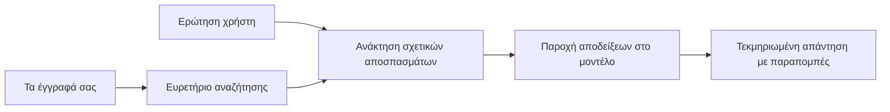

# Δίδαξε την ΤΝ να Απαντά σε Ερωτήσεις Βασισμένες στα Έγγραφά Σου:
## Σειρά 1: RAG, Azure έναντι Ανοιχτών Εναλλακτικών, και Πότε Βγάζει Νόημα η Λεπτομερής Εκπαίδευση

> Το πρώτο άρθρο σε μια σειρά το 2026 που επανεξετάζει τα μαθήματά μου για το Azure AI Search + Azure OpenAI το 2023 σχετικά με ερωταπαντήσεις σε έγγραφα.

## 1. Εισαγωγή - Επανεξέταση ενός Νωρίτερου Μαθήματος RAG

Το 2023, δούλεψα σε ένα ζευγάρι μαθημάτων σχετικά με το πώς να διδάξεις στο ChatGPT να απαντά σε ερωτήσεις από PDF αρχεία χρησιμοποιώντας Azure AI Search και Azure OpenAI. Έγραψα την [έκδοση LangChain](https://techcommunity.microsoft.com/blog/educatordeveloperblog/teach-chatgpt-to-answer-questions-using-azure-ai-search--azure-openai-lang-chain/3969713), και επίσης συνέγραψα την συνοδευτική [έκδοση Semantic Kernel](https://techcommunity.microsoft.com/blog/educatordeveloperblog/teach-chatgpt-to-answer-questions-using-azure-ai-search--azure-openai-semantic-k/3985395) μαζί με τον [Lee Stott](https://developer.microsoft.com/en-us/advocates/lee-stott), Principal Cloud Advocate Manager στη Microsoft. Τότε, η ιδέα του "ChatGPT πάνω στα δεδομένα σου" ήταν ακόμα νέα για πολλούς προγραμματιστές. Τα μαθήματα χρησιμοποιούσαν Azure Blob Storage, Azure AI Search, Azure OpenAI, LangChain, Semantic Kernel, και FAISS-στυλ ανάκτηση διάνυσμα για να απαντούν ερωτήσεις από PDF αρχεία.

Το προηγούμενο άρθρο εστίαζε σε μια απλή αλλά σημαντική ροή εργασίας: ανέβασε έγγραφα, δημιούργησε ευρετήριο, αντάλλαξε σχετικό περιεχόμενο, και ρώτησε ένα μοντέλο να απαντήσει βάσει αυτού του περιεχομένου.

Το 2026, το οικοσύστημα RAG έχει μεγαλώσει σημαντικά. Το Azure AI Search τώρα υποστηρίζει σύγχρονες αναζητήσεις διανύσματος και υβριδικά μοτίβα ανάκτησης, το Azure OpenAI είναι μέρος του ευρύτερου οικοσυστήματος Microsoft Foundry Models, και το νεότερο v1 API μπορεί να χρησιμοποιήσει τον στάνταρ OpenAI client χωρίς να απαιτούνται μηνιαίες αλλαγές `api-version`. Παράλληλα, επιλογές ανοιχτού κώδικα όπως LangGraph, LlamaIndex, Haystack, Qdrant, Milvus, Weaviate, Chroma, Ollama, και vLLM έχουν γίνει πρακτικές επιλογές για πραγματικά συστήματα RAG.

Γι' αυτό ήθελα να επανεξετάσω αυτό το θέμα. Το ερώτημα δεν είναι πια μόνο "Πώς φτιάχνω RAG;" Υπάρχουν τώρα πολλοί τρόποι να το φτιάξεις, και το πιο σημαντικό ερώτημα είναι "Ποια αρχιτεκτονική πρέπει να επιλέξω για την περίπτωσή μου;"

Αλλά το βασικό πρόβλημα δεν έχει αλλάξει.

Ένα μοντέλο ΤΝ δεν γνωρίζει αυτόματα τα έγγραφά σου. Για να χτίσεις ένα χρήσιμο σύστημα ερωταπαντήσεων βασισμένο σε έγγραφα, χρειάζεσαι ακόμα αξιόπιστη ανάκτηση, θεμελίωση, αξιολόγηση και ροές εργασίας.

Αυτό το άρθρο δεν είναι ένα ακόμη tutorial "chat με PDF" από άκρη σε άκρη. Θέλω να ξεκινήσω αυτή τη νεότερη σειρά με το ερώτημα που με απασχολεί πλέον περισσότερο: πότε πρέπει να επιλέξεις μια διαχειριζόμενη αρχιτεκτονική Azure, πότε μια στοίβα RAG ανοιχτού κώδικα, και πότε η λεπτομερής εκπαίδευση έχει πραγματικά νόημα;

Αυτό είναι το πρώτο άρθρο σε μια σειρά σχετικά με τη δημιουργία συστημάτων ΤΝ θεμελιωμένων σε έγγραφα. Σε αυτό το πρώτο μέρος, θα εστιάσουμε στις αποφάσεις αρχιτεκτονικής: γιατί έχει σημασία το RAG, πότε οι διαχειριζόμενες υπηρεσίες Azure είναι χρήσιμες, πότε οι ανοιχτές εναλλακτικές βγάζουν νόημα, και πού εντάσσεται η λεπτομερής εκπαίδευση.

Μετά από τη δημιουργία και επανεξέταση συστημάτων ερωταπαντήσεων εγγράφων, με ενδιαφέρει λιγότερο ποιο εργαλείο δείχνει καλύτερο σε μια επίδειξη και περισσότερο ποια αρχιτεκτονική αντέχει στους πραγματικούς χρήστες, τα μεταβαλλόμενα έγγραφα, τις άδειες, τις αποτυχίες και τη συντήρηση.

## 2. Γιατί η ΤΝ Σου Χρειάζεται Σύστημα Αναζήτησης

Τα μεγάλα γλωσσικά μοντέλα εκπαιδεύονται σε ευρύ δημόσιο και αδειοδοτημένο υλικό. Μπορεί να ξέρουν πολλά για γενικά θέματα, αλλά δεν γνωρίζουν αυτόματα τα προσωπικά σου PDF, τις εσωτερικές πολιτικές, τις εταιρικές διαδικασίες, αρχεία έρευνας, διδακτικό υλικό, σημειώσεις υποστήριξης πελατών ή πρόσφατα ενημερωμένη τεκμηρίωση.

Ένας απλός τρόπος να σκεφτείς το RAG είναι αυτός: αντί να περιμένουμε από το μοντέλο να θυμάται κάθε έγγραφο, του δίνουμε ένα σύστημα αναζήτησης. Όταν ένας χρήστης κάνει μια ερώτηση, το σύστημα βρίσκει πρώτα τα πιο σχετικά κομμάτια πληροφορίας, και μετά δίνει αυτά τα κομμάτια στο μοντέλο ως πλαίσιο.

Αυτό έχει σημασία επειδή πολλές πραγματικές πηγές γνώσης είναι ιδιωτικές, συνεχώς μεταβαλλόμενες, ευαίσθητες σε δικαιώματα, αποθηκευμένες σε πολλαπλά συστήματα, γραμμένες σε πολλά φορμάτ, και πολύ μεγάλες για να επικολληθούν απευθείας σε ένα prompt.

Για παράδειγμα, αν ένα σχολείο, εταιρεία ή ερευνητική ομάδα έχει 10.000 εσωτερικά έγγραφα, το μοντέλο δεν μπορεί να απαντήσει αξιόπιστα από αυτά τα έγγραφα εκτός εάν το σύστημα ανακτήσει τα σωστά μέρη την κατάλληλη στιγμή.

Αυτό φυσικά οδηγεί σε ένα κοινό ερώτημα:

Γιατί να μην κάνω απλά λεπτομερή εκπαίδευση (fine-tuning) του μοντέλου;

Η λεπτομερής εκπαίδευση μπορεί να είναι χρήσιμη, αλλά συνήθως δεν είναι το κατάλληλο πρώτο εργαλείο για γνώση εγγράφων. Αν η γνώση αλλάζει συχνά, αν μετράνε οι παραπομπές, ή αν έχουν σημασία οι άδειες πρόσβασης, το RAG είναι συνήθως το καλύτερο σημείο εκκίνησης. Η λεπτομερής εκπαίδευση ταιριάζει καλύτερα στη διδασκαλία συμπεριφοράς, ύφους, φορμάτ εξόδου και μοτίβων εργασιών.

## 3. Αρχιτεκτονική RAG στην Πράξη

Φαντάσου ότι χτίζεις έναν βοηθό ΤΝ για ένα σχολείο. Ο βοηθός πρέπει να απαντά σε ερωτήσεις από policy PDFs, οδηγούς μαθημάτων, εσωτερικές σελίδες FAQ, και πρόσφατες ανακοινώσεις.

Αν ένας μαθητής ρωτάει, "Μπορώ να χρησιμοποιήσω γεννητική ΤΝ για την τελική μου εργασία;", το σύστημα δεν πρέπει να απαντήσει από τη γενική μνήμη του μοντέλου. Πρέπει πρώτα να βρει την σχετική σχολική πολιτική, να ανακτήσει την ενότητα για τη χρήση ΤΝ, και μετά να ζητήσει από το μοντέλο να απαντήσει χρησιμοποιώντας αυτή την απόδειξη.

Αυτό είναι το RAG στην πράξη.

Σε υψηλό επίπεδο, μπορείς να σκεφτείς τη ροή έτσι:

  
Οι λεπτομέρειες μπορούν να γίνουν πιο σύνθετες, αλλά η βασική ιδέα είναι απλή: το μοντέλο δεν απαντά μόνο του. Απαντά με ανακτημένη απόδειξη.

Πρώτα, τα έγγραφα εισάγονται από συστήματα αποθήκευσης όπως Azure Blob Storage, SharePoint, GitHub, ή ένα εσωτερικό CMS. Μετά το σύστημα τα αναλύει σε κείμενο διατηρώντας χρήσιμες δομές όπως επικεφαλίδες, αριθμούς σελίδων, πίνακες, ενότητες, και θέσεις πηγών.

Έπειτα, το περιεχόμενο χωρίζεται σε τμήματα. Αυτό το βήμα ακούγεται απλό, αλλά είναι ένα από τα πιο σημαντικά μέρη του συστήματος. Αν ένα τμήμα είναι πολύ μικρό, μπορεί να χάσει το περιβάλλον του. Αν είναι πολύ μεγάλο, μπορεί να περιλαμβάνει άσχετη πληροφορία και να κάνει την ανάκτηση λιγότερο ακριβή.

Μετά τη διάσπαση, το σύστημα δημιουργεί embeddings και τα αποθηκεύει σε αναζητήσιμο ευρετήριο μαζί με το αρχικό κείμενο και μεταδεδομένα όπως όνομα αρχείου, αριθμό σελίδας, άδειες, έκδοση εγγράφου, και URL πηγής.

Όταν ο χρήστης κάνει μια ερώτηση, το σύστημα αναζητεί υποψήφια τμήματα χρησιμοποιώντας αναζήτηση με λέξεις-κλειδιά, διανυσματική αναζήτηση, ή υβριδική αναζήτηση. Ένας επαναταξινομητής μπορεί να αναδιατάξει αυτά τα τμήματα ώστε η πιο χρήσιμη απόδειξη να βρίσκεται στην κορυφή.

Τέλος, το μοντέλο λαμβάνει την ερώτηση και τις ανακτημένες αποδείξεις. Η απάντηση πρέπει να βασίζεται σε αυτές τις αποδείξεις και να επιστρέφει παραπομπές ώστε ο χρήστης να μπορεί να ελέγξει την πηγή.

Το σημαντικό σημείο είναι ότι το RAG δεν είναι μόνο "βάλε PDF σε μια βάση δεδομένων διανυσμάτων". Η ποιότητα της απάντησης εξαρτάται από ολόκληρη τη ροή εργασίας: ανάλυση, διάσπαση, ανάκτηση, επαναταξινόμηση, προτροπή, παραπομπές, και αξιολόγηση.

Γι’ αυτό έχει σημασία η δομή του εγγράφου. Σε PDF, μια επικεφαλίδα, πίνακας, υποσημείωση ή όριο σελίδας μπορεί να αλλάξει το νόημα μιας απόσπασμα. Στο Azure, η ικανότητα Document Layout της Azure Document Intelligence χρησιμοποιεί δυνατότητες μορφοποίησης για να παράγει έξοδο με επίγνωση δομής, που μπορεί να βελτιώσει τη διάσπαση και την ποιότητα ανάκτησης για συστήματα RAG.

## 4. Τι Άλλαξε Από το 2023;

Το μάθημα του 2023 ήταν ένα καλό σημείο εκκίνησης για την εποχή του:

- Το Azure Blob Storage αποθήκευε αρχεία PDF.
- Το Azure AI Search ευρετηρίαζε το περιεχόμενο.
- Το LangChain ένωνε την ανάκτηση με το Azure OpenAI.
- Το FAISS λειτουργούσε ως απλή τοπική βάση διανυσμάτων.
- Το παράδειγμα χρησιμοποιούσε `gpt-35-turbo` και `text-embedding-ada-002`.

Το 2026, μια σύγχρονη έκδοση πρέπει να ενσωματώνει αρκετές αλλαγές.

Πρώτον, η ανάκτηση έχει ωριμάσει. Το 2023, πολλά demos χρησιμοποιούσαν απλή αναζήτηση ομοιότητας διανυσμάτων. Σήμερα, η υβριδική ανάκτηση είναι συχνά το προεπιλεγμένο σημείο εκκίνησης για σοβαρές ερωταπαντήσεις εγγράφων. Το Azure AI Search υποστηρίζει υβριδική αναζήτηση συνδυάζοντας ερωτήματα λέξεων-κλειδιών και διανυσμάτων σε ένα ενιαίο αίτημα και συγχωνεύοντας τα αποτελέσματα με Reciprocal Rank Fusion. Ο σημασιολογικός ταξινομητής μπορεί μετά να επαναταξινομήσει το κείμενο μεταξύ πλήρους κειμένου, διανυσματικών και υβριδικών αποτελεσμάτων.

Δεύτερον, η εισαγωγή είναι πιο εξελιγμένη. Αντί να χωρίζεις κάθε έγγραφο χειροκίνητα με κώδικα εφαρμογής, το Azure AI Search υποστηρίζει ενσωματωμένη δημιουργία διανυσμάτων για διάσπαση, ενσωμάτωση και διανυσματική αναζήτηση κατά το χρόνο ερωτήματος. Για PDF και workloads με πολλά έγγραφα, η ικανότητα Document Layout μπορεί να διαφυλάξει περισσότερη δομή από τυποποιημένα κομμάτια.

Τρίτον, η ορχήστρωση έχει μεγαλύτερη σημασία. Το δύσκολο συχνά δεν είναι το ίδιο το κάλεσμα API LLM. Το δύσκολο είναι η διαχείριση αποτυχιών, επαναλήψεων, ξεπερασμένης ανάκτησης, ποιότητας τμημάτων, μακροχρόνιων ροών εργασίας, ανθρώπινης ανασκόπησης και αξιολόγησης σε κλίμακα. Εδώ εργαλεία προσανατολισμένα στις ροές, όπως LangGraph, ροές εργασίας LlamaIndex, pipelines Haystack, και εργαλεία αξιολόγησης και παρακολούθησης σε επίπεδο πλατφόρμας γίνονται πιο σχετικά από μια απλή γραμμική αλυσίδα.

Τέταρτον, η αξιολόγηση δεν είναι πλέον προαιρετική. Μια επίδειξη μπορεί να εντυπωσιάσει με μια ερώτηση. Ένα σύστημα παραγωγής χρειάζεται σετ δοκιμών, ελέγχους παλινδρόμησης, μετρικές ανάκτησης, ελέγχους θεμελίωσης και παρακολούθηση. Χωρίς αξιολόγηση, είναι δύσκολο να ξέρεις αν το σύστημα βελτιώνεται ή απλά αλλάζει.

## 5. Επιλογή Μεταξύ Azure και Ανοιχτού Κώδικα RAG Στοίβων

Δεν νομίζω ότι το χρήσιμο ερώτημα είναι "Είναι το Azure καλύτερο από το ανοιχτό λογισμικό;" ή "Είναι το ανοιχτό λογισμικό καλύτερο από το Azure;"

Το χρήσιμο ερώτημα είναι: τι είδους σύστημα χτίζεις, ποιος θα το λειτουργήσει, ποιους περιορισμούς έχεις, και ποιες μορφές αποτυχίας δεν γίνονται αποδεκτές;

Όταν ξεκίνησα να φτιάχνω παραδείγματα ερωταπαντήσεων εγγράφων, κυρίως σκεφτόμουν αν η ανάκτηση λειτουργούσε. Μπορώ να ανεβάσω PDF, να τα αναζητήσω, και να δημιουργήσω απάντηση; Αυτό ήταν ένα λογικό σημείο εκκίνησης.

Μετά από πιο ρεαλιστικές ροές εργασίας ΤΝ, άλλαξε η αξιολόγησή μου. Τώρα κοιτάζω τέσσερα πράγματα πριν επιλέξω μια στοίβα RAG:

- ταυτότητα και δικαιώματα
- ποιότητα ανάκτησης
- αξιοπιστία ροής εργασίας
- λειτουργική ιδιοκτησία

Αυτές οι τέσσερις περιοχές σου λένε πολύ περισσότερα από μια απλή μέτρηση μοντέλου.

Οι αρχιτεκτονικές με βάση το Azure συνήθως βγάζουν νόημα όταν η ενσωμάτωση στο επιχειρησιακό περιβάλλον είναι το δύσκολο κομμάτι. Αν μια ομάδα ήδη εξαρτάται από Microsoft Entra ID, Microsoft 365, Azure Storage, ιδιωτικά δίκτυα, RBAC, και Azure monitoring, το Azure AI Search και Azure OpenAI μπορούν να μειώσουν πολύπλοκες λειτουργικές δυσκολίες. Σε αυτό το περιβάλλον, το Azure δεν είναι μόνο API μοντέλου. Η αξία είναι το περιβάλλον σύστημα: ταυτότητα, διακυβέρνηση, διαχειριζόμενη αναζήτηση, ολοκλήρωση ασφάλειας, υποστήριξη, και οικείες λειτουργίες.

Οι αρχιτεκτονικές ανοιχτού κώδικα συνήθως βγάζουν νόημα όταν η ευελιξία είναι το δύσκολο κομμάτι. Αν η ομάδα χρειάζεται τοπική απόδοση, φορητότητα cloud, προσαρμοσμένη ροή ανάκτησης, εξειδικευμένη επαναταξινόμηση, ή άμεσο έλεγχο στη βάση διανυσμάτων και στην υπηρεσία μοντέλου, μια στοίβα ανοιχτού κώδικα μπορεί να είναι η καλύτερη επιλογή. Το τίμημα είναι ότι η ομάδα αναλαμβάνει περισσότερη ευθύνη στη λειτουργική αξιοπιστία: αντίγραφα ασφαλείας, κλιμάκωση, καθυστέρηση, μεταναστεύσεις, παρακολούθηση, και ασφάλεια.

Στην πράξη, πολλά συστήματα ΤΝ παραγωγής δεν είναι αποκλειστικά cloud-native ή αποκλειστικά ανοιχτού κώδικα. Συχνά είναι υβριδικά συστήματα που ισορροπούν απλότητα λειτουργίας, φορητότητα, διακυβέρνηση και μηχανική ευελιξία.

Για παράδειγμα, δεν θα με εκπλήξει να δω ένα σύστημα να χρησιμοποιεί Azure OpenAI για πρόσβαση μοντέλου, LangGraph για ορχήστρωση ροών εργασιών, φιλοξενία Azure για υλοποίηση, και μια βάση διανυσμάτων ανοιχτού κώδικα για συγκεκριμένη απαίτηση ανάκτησης. Αυτό δεν είναι ασυνέπεια αρχιτεκτονική. Είναι η επιλογή του κατάλληλου επιπέδου διαχειριζόμενης υπηρεσίας και ελέγχου μηχανικής σε κάθε μέρος του συστήματος.

Μου αρέσουν οι υβριδικές αρχιτεκτονικές όταν η διαχειριζόμενη πλατφόρμα λύνει σημαντικά επιχειρησιακά προβλήματα, ενώ τα ανοιχτά μέρη παρέχουν στην ομάδα ευελιξία εκεί που πραγματικά μετράει.

## 6. Πρακτικός Οδηγός Αποφάσεων

Εδώ είναι ο πίνακας αποφάσεων που θα χρησιμοποιούσα με μια ομάδα πριν επιλέξουμε στοίβα RAG:

| Περιοχή Απόφασης | Η στοίβα Azure managed είναι ισχυρότερη όταν... | Η στοίβα ανοιχτού κώδικα είναι ισχυρότερη όταν... |
| --- | --- | --- |
| Ταυτότητα και πρόσβαση | Το Entra ID, RBAC, διαχειριζόμενη ταυτότητα, και επιχειρησιακά δικαιώματα είναι κεντρικά | Εξατομικευμένη αυθεντικοποίηση, μη-Microsoft ταυτότητα, ή λογική πρόσβασης συγκεκριμένη για εφαρμογή κυριαρχεί |
| Λειτουργίες | Η ομάδα θέλει διαχειριζόμενη υποδομή, υποστήριξη, SLA, και απλούστερη ένταξη | Η ομάδα μπορεί να λειτουργήσει βάσεις διανυσμάτων, υπηρεσία μοντέλων, αντίγραφα ασφαλείας, και κλιμάκωση |
| Ανάκτηση | Η υβριδική αναζήτηση, σημασιολογική ταξινόμηση, φίλτρα και αναζήτηση μεταδεδομένων καλύπτουν τις περισσότερες ανάγκες | Η ομάδα χρειάζεται εξατομικευμένη ανάκτηση, εξειδικευμένη επαναταξινόμηση ή πειραματικό ευρετηρίασμα |
| Φορητότητα | Η ευθυγράμμιση οικοσυστήματος Azure είναι αποδεκτή ή προτιμητέα | Η αποφυγή εξάρτησης από το cloud είναι απαραίτητο σκληρό κριτήριο |
| Εξαγωγή Συμπερασμάτων | Η διακυβέρνηση Azure OpenAI, τα δίκτυα και οι επιχειρησιακοί έλεγχοι έχουν σημασία | Η τοπική εξαγωγή συμπερασμάτων, προσαρμοσμένα μοντέλα, ή αυτό-φιλοξενούμενη υπηρεσία είναι απαραίτητα |
| Κόστος | Η μείωση της μηχανικής και λειτουργικής προσπάθειας έχει μεγαλύτερη σημασία από τη ρύθμιση υποδομής | Η κλίμακα είναι αρκετά μεγάλη ώστε να δικαιολογεί προσεκτική βελτιστοποίηση υποδομής |
| Πειραματισμός | Η σταθερότητα και η επιχειρησιακή ενσωμάτωση έχουν μεγαλύτερη σημασία από την συχνή αλλαγή συστατικών | Η ομάδα πειραματίζεται γρήγορα με agents, εργαλεία, μνήμη και ροές ανάκτησης |

Ο απλός κανόνας μου είναι:

- Ξεκίνα με Azure όταν η επιχειρησιακή ενσωμάτωση, η ασφάλεια, και η απλότητα λειτουργίας είναι οι κύριοι κίνδυνοι.
- Ξεκίνα με ανοιχτό λογισμικό όταν η φορητότητα, η προσαρμογή ή ο τοπικός έλεγχος είναι οι κύριοι κίνδυνοι.
- Χρησιμοποίησε υβριδική στοίβα όταν ισχύουν και τα δύο.

Γι’ αυτό επίσης δεν θα ξεκινούσα μια σειρά RAG το 2026 με κώδικα πρώτα. Ο κώδικας είναι σημαντικός, αλλά η επιλογή αρχιτεκτονικής έρχεται πριν την υλοποίηση. Μια απλή επίδειξη μπορεί να κρύψει τις πιο δύσκολες επιλογές. Ένα καλό σύστημα RAG τις κάνει ρητές.

## 7. Πού Βάζει η Λεπτομερής Εκπαίδευση

Η λεπτομερής εκπαίδευση αναφέρεται συχνά μαζί με το RAG, αλλά νομίζω ότι είναι σημαντικό να διαχωρίζονται.

Το RAG είναι συνήθως η καλύτερη επιλογή όταν το σύστημα χρειάζεται φρέσκια, ιδιωτική, ευαίσθητη σε δικαιώματα, ή πηγών-θεμελιωμένη γνώση. Αν η απάντηση πρέπει να παραπέμπει σε έγγραφα, να αντανακλά πρόσφατες ενημερώσεις ή να σέβεται κανόνες πρόσβασης ανά χρήστη, η ανάκτηση πρέπει να είναι μέρος της αρχιτεκτονικής.

Η λεπτομερής εκπαίδευση είναι πιο χρήσιμη όταν η γνώση δεν είναι το βασικό πρόβλημα. Μπορεί να βοηθήσει όταν θέλεις το μοντέλο να ακολουθεί συγκεκριμένο φορμάτ εξόδου, να ταιριάζει σε στυλ απόκρισης συγκεκριμένου τομέα, να εκτελεί σταθερό έργο πιο συνεπώς, ή να μειώσει την ανάγκη οδηγιών σε κάθε προτροπή.
Στην πράξη, οι δύο μπορούν να συνεργαστούν. Ένας βοηθός υποστήριξης μπορεί να χρησιμοποιεί RAG για να ανακτήσει την πιο πρόσφατη πολιτική, ενώ ένα μοντέλο με fine-tuning μαθαίνει τη προτιμώμενη δομή και τον τόνο απάντησης της εταιρείας.

Το λάθος είναι να θεωρείται το fine-tuning ως αντικατάσταση για ένα αποθετήριο εγγράφων. Δεν αφαιρεί την ανάγκη για ανάκτηση όταν το σύστημα πρέπει να απαντήσει από φρέσκα, ιδιωτικά ή δεδομένα που απαιτούν άδεια.

## 8. Πού Πηγαίνει Επόμενα Αυτή η Σειρά

Αυτό το άρθρο είναι το επίπεδο λήψης αποφάσεων. Πριν γράψω κώδικα, ήθελα να κάνω σαφείς τις ανταλλαγές: RAG έναντι fine-tuning, Azure έναντι open source, διαχειριζόμενες υπηρεσίες έναντι λειτουργικού ελέγχου.

Πριν προχωρήσω στην υλοποίηση, θέλω να αφήσω εδώ ένα σημείο: σε πολλά επιχειρησιακά συστήματα τεχνητής νοημοσύνης, το μοντέλο είναι μόνο ένα συστατικό. Η ποιότητα ανάκτησης, ο συντονισμός, η αξιολόγηση, τα δικαιώματα και η επιχειρησιακή αξιοπιστία είναι αυτά που συχνά καθορίζουν εάν το σύστημα θα πετύχει πέρα από το στάδιο της επίδειξης.

Στα επόμενα μέρη αυτής της σειράς, σκοπεύω να εμβαθύνω στην πρακτική πλευρά των συστημάτων τεχνητής νοημοσύνης που βασίζονται σε έγγραφα: πώς να χτίσετε μια αρχιτεκτονική βασισμένη στο Azure, πώς συγκρίνονται οι ανοιχτού κώδικα εναλλακτικές στην πράξη, και πώς να αξιολογήσετε αν ένα σύστημα RAG λειτουργεί πραγματικά.

Μπορεί να προσαρμόσω τη σειρά καθώς η σειρά εξελίσσεται, αλλά ο στόχος θα παραμείνει ο ίδιος: να προχωρήσουμε πέρα από μια απλή επίδειξη και να δείξουμε πώς να σκεφτόμαστε για τα συστήματα RAG που μπορούν να συντηρηθούν, να αξιολογηθούν και να λειτουργήσουν.

## 9. Βιβλιογραφία και Πόροι

Αρχικά tutorials:

- [Teach ChatGPT to Answer Questions: Using Azure AI Search & Azure OpenAI (Lang Chain)](https://techcommunity.microsoft.com/blog/educatordeveloperblog/teach-chatgpt-to-answer-questions-using-azure-ai-search--azure-openai-lang-chain/3969713)
- [Teach ChatGPT to Answer Questions: Using Azure AI Search & Azure OpenAI (Semantic Kernel)](https://techcommunity.microsoft.com/blog/educatordeveloperblog/teach-chatgpt-to-answer-questions-using-azure-ai-search--azure-openai-semantic-k/3985395)

Azure:

- [Azure AI Search REST API versions](https://learn.microsoft.com/en-us/rest/api/searchservice/search-service-api-versions)
- [Hybrid search in Azure AI Search](https://learn.microsoft.com/en-us/azure/search/hybrid-search-how-to-query)
- [Integrated vectorization in Azure AI Search](https://learn.microsoft.com/en-us/azure/search/vector-search-integrated-vectorization)
- [Document Layout skill in Azure AI Search](https://learn.microsoft.com/en-us/azure/search/cognitive-search-skill-document-intelligence-layout)
- [Chunk and vectorize by document layout](https://learn.microsoft.com/en-us/azure/search/search-how-to-semantic-chunking)
- [Semantic ranking in Azure AI Search](https://learn.microsoft.com/en-us/azure/search/semantic-search-overview)
- [Azure OpenAI / Microsoft Foundry API version lifecycle](https://learn.microsoft.com/en-us/azure/foundry/openai/api-version-lifecycle)
- [Foundry Models sold by Azure](https://learn.microsoft.com/en-us/azure/foundry/foundry-models/concepts/models-sold-directly-by-azure)
- [Microsoft Foundry fine-tuning considerations](https://learn.microsoft.com/en-us/azure/foundry/openai/concepts/fine-tuning-considerations)
- [Microsoft Foundry observability](https://learn.microsoft.com/en-us/azure/foundry/concepts/observability)
- [Run evaluations in Microsoft Foundry](https://learn.microsoft.com/en-us/azure/foundry/how-to/evaluate-generative-ai-app)

Open-source:

- [LangGraph documentation](https://docs.langchain.com/oss/python/langgraph/overview)
- [LlamaIndex documentation](https://developers.llamaindex.ai/python/framework/)
- [Haystack documentation](https://docs.haystack.deepset.ai/)
- [Qdrant documentation](https://qdrant.tech/documentation/overview/)
- [Milvus documentation](https://milvus.io/docs/overview.md)
- [Weaviate documentation](https://docs.weaviate.io/weaviate/current/)
- [Chroma documentation](https://docs.trychroma.com/docs/overview/introduction)
- [Ollama embeddings](https://docs.ollama.com/capabilities/embeddings)
- [vLLM OpenAI-compatible server](https://docs.vllm.ai/en/latest/serving/openai_compatible_server.html)
- [BGE embedding models](https://huggingface.co/BAAI/bge-large-en-v1.5)
- [E5 embedding models](https://huggingface.co/intfloat/e5-large-v2)
- [Instructor embedding models](https://huggingface.co/hkunlp/instructor-large)

---

<!-- CO-OP TRANSLATOR DISCLAIMER START -->
**Αποποίηση ευθυνών**:
Αυτό το έγγραφο έχει μεταφραστεί χρησιμοποιώντας την υπηρεσία μετάφρασης με τεχνητή νοημοσύνη [Co-op Translator](https://github.com/Azure/co-op-translator). Ενώ επιδιώκουμε την ακρίβεια, παρακαλούμε να έχετε υπόψη ότι οι αυτοματοποιημένες μεταφράσεις ενδέχεται να περιέχουν λάθη ή ανακρίβειες. Το πρωτότυπο έγγραφο στη μητρική του γλώσσα πρέπει να θεωρείται η αυθεντική πηγή. Για κρίσιμες πληροφορίες, συνιστάται επαγγελματική ανθρώπινη μετάφραση. Δεν φέρουμε ευθύνη για τυχόν παρεξηγήσεις ή λανθασμένες ερμηνείες που προκύπτουν από τη χρήση αυτής της μετάφρασης.
<!-- CO-OP TRANSLATOR DISCLAIMER END -->