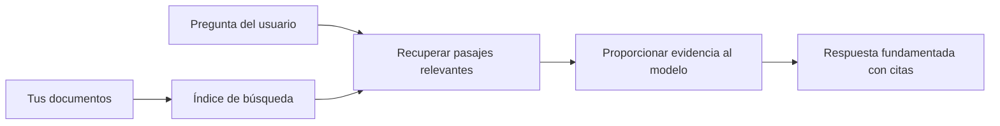

# Enseñar a la IA a Responder Preguntas Basadas en Tus Documentos:
## Serie 1: RAG, Azure vs Alternativas de Código Abierto, y Cuándo Tiene Sentido el Fine-Tuning

> El primer artículo de una serie de 2026 que revisita mis tutoriales de 2023 sobre Azure AI Search + Azure OpenAI para preguntas y respuestas con documentos.

## 1. Introducción - Revisando un Tutorial Anterior de RAG

En 2023, trabajé en un par de tutoriales sobre cómo enseñar a ChatGPT a responder preguntas a partir de documentos PDF usando Azure AI Search y Azure OpenAI. Escribí la [versión LangChain](https://techcommunity.microsoft.com/blog/educatordeveloperblog/teach-chatgpt-to-answer-questions-using-azure-ai-search--azure-openai-lang-chain/3969713), y también co-escribí la versión complementaria [Semantic Kernel](https://techcommunity.microsoft.com/blog/educatordeveloperblog/teach-chatgpt-to-answer-questions-using-azure-ai-search--azure-openai-semantic-k/3985395) con [Lee Stott](https://developer.microsoft.com/en-us/advocates/lee-stott), un Principal Cloud Advocate Manager en Microsoft. En ese momento, la idea de "ChatGPT en tus datos" todavía parecía nueva para muchos desarrolladores. Los tutoriales utilizaron Azure Blob Storage, Azure AI Search, Azure OpenAI, LangChain, Semantic Kernel y recuperación de vectores estilo FAISS para responder preguntas a partir de archivos PDF.

Ese artículo anterior se centró en un flujo de trabajo simple pero importante: subir documentos, indexarlos, recuperar contenido relevante y pedir a un modelo que responda basado en ese contenido.

En 2026, el ecosistema RAG ha crecido significativamente. Azure AI Search ahora soporta patrones modernos de recuperación vectorial e híbrida, Azure OpenAI es parte del ecosistema más amplio de Microsoft Foundry Models, y la nueva API v1 puede usar el cliente estándar de OpenAI sin requerir cambios mensuales en `api-version`. Al mismo tiempo, opciones de código abierto como LangGraph, LlamaIndex, Haystack, Qdrant, Milvus, Weaviate, Chroma, Ollama y vLLM se han convertido en opciones prácticas para sistemas RAG reales.

Por eso quise revisitar este tema. La pregunta ya no es solo "¿Cómo construyo RAG?" Ahora hay muchas formas de construirlo, y la pregunta más importante es "¿Qué arquitectura debería elegir para mi situación?"

Pero el problema fundamental no ha cambiado.

Un modelo de IA no conoce automáticamente tus documentos. Para construir un sistema útil de preguntas y respuestas basado en documentos, aún necesitas recuperación confiable, fundamentación, evaluación y flujos de trabajo operativos.

Este artículo no es otro tutorial de "chat con PDF" de principio a fin. Quiero comenzar esta serie actualizada con la pregunta que ahora me importa más: ¿cuándo deberías elegir una arquitectura gestionada de Azure, cuándo elegir una pila RAG de código abierto y cuándo tiene sentido realmente el fine-tuning?

Este es el primer artículo de una serie sobre cómo construir sistemas de IA fundamentados en documentos. En esta primera parte, nos enfocaremos en las decisiones arquitectónicas: por qué RAG importa, cuándo son útiles los servicios gestionados basados en Azure, cuándo tienen sentido las alternativas de código abierto y dónde encaja el fine-tuning.

Después de construir y revisar sistemas de preguntas y respuestas con documentos, me he interesado menos en qué herramienta luce mejor en una demo y más en qué arquitectura sobrevive a usuarios reales, documentos cambiantes, permisos, fallos y mantenimiento.

## 2. Por Qué Tu IA Necesita un Sistema de Búsqueda

Los grandes modelos de lenguaje se entrenan con datos públicos y licenciados amplios. Pueden saber mucho sobre temas generales, pero no conocen automáticamente tus PDFs privados, políticas internas, procedimientos empresariales, archivos de investigación, materiales de aula, notas de soporte al cliente o documentación actualizada recientemente.

Una forma simple de pensar en RAG es esta: en vez de esperar que el modelo recuerde cada documento, le damos un sistema de búsqueda. Cuando un usuario hace una pregunta, el sistema primero encuentra las piezas más relevantes de información, luego les da esas piezas al modelo como contexto.

Esto importa porque muchas fuentes de conocimiento del mundo real son privadas, cambian constantemente, son sensibles a permisos, están almacenadas en múltiples sistemas, escritas en muchos formatos y son demasiado grandes para pegarse directamente en un prompt.

Por ejemplo, si una escuela, empresa o equipo de investigación tiene 10,000 documentos internos, el modelo no puede responder de esos documentos con fiabilidad a menos que el sistema recupere las partes correctas en el momento adecuado.

Esto lleva naturalmente a una pregunta común:

¿Por qué no simplemente fine-tunear el modelo?

El fine-tuning puede ser útil, pero usualmente no es la primera herramienta correcta para el conocimiento documental. Si el conocimiento cambia con frecuencia, si las citas importan, o si los permisos de acceso importan, RAG suele ser el mejor punto de partida. El fine-tuning es más adecuado para enseñar comportamiento, estilo, formato de salida y patrones de tarea.

## 3. Arquitectura RAG en la Práctica

Imagina que estás construyendo un asistente de IA para una escuela. El asistente debe responder preguntas a partir de PDFs de políticas, guías de cursos, páginas internas de FAQ y anuncios actualizados recientemente.

Si un estudiante pregunta: "¿Puedo usar IA generativa para mi trabajo final?", el sistema no debería responder basándose en la memoria general del modelo. Primero debería encontrar la política escolar relevante, recuperar la sección sobre el uso de IA y luego pedir al modelo que responda usando esa evidencia.

Eso es RAG en práctica.

A alto nivel, puedes pensar el flujo así:

Los detalles pueden hacerse más sofisticados, pero la idea básica es simple: el modelo no responde solo. Responde con evidencia recuperada.

Primero, los documentos se ingieren desde sistemas de almacenamiento como Azure Blob Storage, SharePoint, GitHub o un CMS interno. Luego el sistema los analiza a texto mientras preserva estructuras útiles como encabezados, números de página, tablas, secciones y ubicaciones de origen.

Después, el contenido se divide en fragmentos. Este paso parece simple, pero es uno de los más importantes del sistema. Si un fragmento es muy pequeño, puede perder el contexto circundante. Si es muy grande, puede incluir información no relacionada y hacer que la recuperación sea menos precisa.

Tras la fragmentación, el sistema crea embeddings y los almacena en un índice buscable junto con el texto original y metadatos como nombre de archivo, número de página, permisos, versión del documento y URL de origen.

Cuando el usuario hace una pregunta, el sistema recupera fragmentos candidatos usando búsqueda por palabras clave, búsqueda vectorial o búsqueda híbrida. Un reranker puede reordenar esos fragmentos para que la evidencia más útil esté cerca de la parte superior.

Finalmente, el modelo recibe la pregunta y la evidencia recuperada. La respuesta debe estar fundamentada en esa evidencia y devolver citas para que el usuario pueda inspeccionar la fuente.

El punto importante es que RAG no es solo "poner PDFs en una base de datos vectorial." La calidad de la respuesta depende de todo el flujo de trabajo: análisis, fragmentación, recuperación, reranking, prompt, citación y evaluación.

Por eso importa la estructura del documento. En un PDF, un encabezado, tabla, nota al pie o límite de página pueden cambiar el significado de un pasaje. En Azure, la habilidad Document Layout usa las capacidades de layout de Azure Document Intelligence para producir una salida consciente de la estructura, lo que puede mejorar la fragmentación y la calidad de recuperación para sistemas RAG.

## 4. ¿Qué Cambió Desde 2023?

El tutorial de 2023 fue un buen punto de partida para su época:

- Azure Blob Storage almacenaba archivos PDF.
- Azure AI Search indexaba contenido.
- LangChain conectaba la recuperación a Azure OpenAI.
- FAISS funcionaba como un almacén vectorial local simple.
- El ejemplo usaba `gpt-35-turbo` y `text-embedding-ada-002`.

En 2026, una versión moderna debería reflejar varios cambios.

Primero, la recuperación ha madurado. En 2023, muchas demos usaban búsqueda por similitud vectorial simple. Hoy, la recuperación híbrida es a menudo el punto de partida predeterminado para QA serio con documentos. Azure AI Search soporta búsqueda híbrida combinando consultas por palabras clave y vectoriales en una sola solicitud y mezclando resultados con Reciprocal Rank Fusion. El Ranker semántico puede luego reranquear la parte textual de resultados full-text, vectoriales e híbridos.

Segundo, la ingestión es más sofisticada. En lugar de dividir manualmente cada documento con código de aplicación, Azure AI Search soporta vectorización integrada para fragmentación, embeddings y vectorización en tiempo de consulta. Para PDFs y cargas de trabajo con muchos documentos, la habilidad Document Layout puede preservar más estructura que fragmentos de tamaño fijo.

Tercero, la orquestación importa más. La parte difícil frecuentemente no es la llamada a la API del LLM en sí. Lo difícil es manejar fallos, reintentos, recuperación obsoleta, calidad de fragmentos, flujos largos, revisión humana y evaluación a escala. Aquí las herramientas orientadas a flujos de trabajo como LangGraph, flujos de trabajo de LlamaIndex, pipelines de Haystack y herramientas de evaluación y observabilidad a nivel plataforma se vuelven más relevantes que una cadena lineal única.

Cuarto, la evaluación ya no es opcional. Una demo puede impresionar con una pregunta. Un sistema en producción necesita conjuntos de prueba, chequeos de regresión, métricas de recuperación, verificaciones de fundamentación y monitoreo. Sin evaluación, es difícil saber si el sistema mejora o simplemente cambia.

## 5. Elegir Entre Pilas RAG de Azure y Código Abierto

No creo que la pregunta útil sea "¿Es Azure mejor que open source?" o "¿Es open source mejor que Azure?"

La pregunta útil es: ¿qué tipo de sistema estás construyendo, quién lo operará, qué restricciones tienes y qué modos de fallo son inaceptables?

Cuando empecé a construir ejemplos de QA documental, pensaba principalmente en si la recuperación funcionaba. ¿Podía subir PDFs, buscarlos y generar una respuesta? Eso era un punto de partida razonable.

Después de trabajar en flujos de trabajo de IA más realistas, mi evaluación cambió. Ahora miro cuatro cosas antes de elegir una pila RAG:

- identidad y permisos
- calidad de recuperación
- fiabilidad del flujo de trabajo
- propiedad operativa

Esas cuatro áreas te dicen mucho más que un benchmark de modelo por sí solo.

Las arquitecturas basadas en Azure usualmente tienen sentido cuando la integración empresarial es la parte difícil. Si un equipo ya depende de Microsoft Entra ID, Microsoft 365, Azure Storage, redes privadas, RBAC y monitoreo de Azure, Azure AI Search y Azure OpenAI pueden reducir mucha complejidad operativa. En ese entorno, Azure no es solo una API de modelo. El valor es el sistema circundante: identidad, gobernanza, búsqueda gestionada, integración de seguridad, soporte y operaciones familiares.

Las arquitecturas de código abierto usualmente tienen sentido cuando la flexibilidad es lo difícil. Si el equipo necesita inferencia local, portabilidad en la nube, un pipeline personalizado de recuperación, reranking especializado o control directo sobre la base vectorial y la capa de servicio de modelos, una pila de código abierto puede ser la mejor opción. La compensación es que el equipo posee más trabajo de fiabilidad: respaldos, escalado, latencia, migraciones, monitoreo y seguridad.

En la práctica, muchos sistemas de IA en producción no son puramente nativos en la nube ni puramente de código abierto. Frecuentemente son sistemas híbridos que equilibran simplicidad operativa, portabilidad, gobernanza y flexibilidad de ingeniería.

Por ejemplo, no me sorprendería ver un sistema que use Azure OpenAI para acceso al modelo, LangGraph para orquestación de flujos de trabajo, hosting en Azure para despliegue y una base de datos vectorial de código abierto para un requerimiento específico de recuperación. Eso no es una inconsistencia arquitectónica. Es elegir el nivel correcto de servicio gestionado y control de ingeniería para cada parte del sistema.

Me gustan las arquitecturas híbridas cuando la plataforma gestionada resuelve problemas empresariales importantes, mientras que los componentes de código abierto le dan al equipo flexibilidad donde realmente importa.

## 6. Una Guía Práctica para la Decisión

Aquí está la tabla de decisiones que usaría con un equipo antes de elegir una pila RAG:

| Área de decisión | La pila gestionada de Azure es más fuerte cuando... | La pila de código abierto es más fuerte cuando... |
| --- | --- | --- |
| Identidad y acceso | Entra ID, RBAC, identidad gestionada y permisos empresariales son centrales | domina autenticación personalizada, identidad no Microsoft o lógica de acceso específica de la app |
| Operaciones | el equipo quiere infraestructura gestionada, soporte, SLAs y onboarding más simple | el equipo puede operar bases vectoriales, servir modelos, backups y escalado |
| Recuperación | la búsqueda híbrida, ranking semántico, filtros y búsqueda por metadatos cubren la mayoría de necesidades | el equipo necesita recuperación personalizada, reranking especializado o indexación experimental |
| Portabilidad | la alineación con el ecosistema Azure es aceptable o preferida | evitar el bloqueo en la nube es un requisito estricto |
| Inferencia | importan la gobernanza, redes y controles empresariales de Azure OpenAI | se requiere inferencia local, modelos personalizados o servicio autohospedado |
| Costo | importa más reducir el esfuerzo de ingeniería y operaciones que ajustar infraestructura | la escala es suficientemente grande para justificar optimización cuidadosa de infraestructura |
| Experimentación | la estabilidad e integración empresarial importan más que cambiar componentes con frecuencia | el equipo itera rápido en agentes, herramientas, memoria y flujos de recuperación |

Mi regla general es simple:

- Empieza con Azure cuando la integración empresarial, seguridad y simplicidad operativa son los riesgos principales.
- Empieza con código abierto cuando la portabilidad, personalización o control local son los riesgos principales.
- Usa una pila híbrida cuando ambos sean ciertos.

Esto también explica por qué no empezaría una serie RAG 2026 con código primero. El código es importante, pero la selección arquitectónica viene antes de la implementación. Una demo simple puede esconder las decisiones más difíciles. Un buen sistema RAG hace explícitas esas decisiones.

## 7. Dónde Encaja el Fine-Tuning

El fine-tuning suele mencionarse junto con RAG, pero creo que es importante separar ambos.

RAG suele ser la mejor opción cuando el sistema necesita conocimiento fresco, privado, sensible a permisos o fundamentado en fuentes. Si la respuesta debe citar documentos, reflejar actualizaciones recientes o respetar reglas de acceso específicas del usuario, la recuperación debe ser parte de la arquitectura.

El fine-tuning es más útil cuando el conocimiento no es el problema principal. Puede ayudar cuando quieres que el modelo siga un formato de salida específico, coincida con un estilo de respuesta de dominio específico, realice una tarea estable con más consistencia o reduzca la cantidad de instrucciones necesarias en cada prompt.
En la práctica, ambos pueden trabajar juntos. Un asistente de soporte podría usar RAG para recuperar la última política, mientras que un modelo ajustado aprende la estructura de respuesta y el tono preferido de la empresa.

El error es tratar el ajuste fino como un reemplazo de un almacén de documentos. No elimina la necesidad de la recuperación cuando el sistema debe responder a partir de datos frescos, privados o sensibles a permisos.

## 8. A Dónde Va Esta Serie a Continuación

Este artículo es la capa de toma de decisiones. Antes de escribir código, quería hacer explícitos los compromisos: RAG vs ajuste fino, Azure vs código abierto, servicios gestionados vs control operativo.

Antes de pasar a la implementación, quiero dejar un punto aquí: en muchos sistemas de IA empresariales, el modelo es solo un componente. La calidad de la recuperación, la orquestación, la evaluación, los permisos y la confiabilidad operativa son a menudo lo que determina si el sistema tiene éxito más allá de la etapa de demostración.

En las próximas partes de esta serie, planeo profundizar en el lado práctico de los sistemas de IA basados en documentos: cómo construir una arquitectura basada en Azure, cómo se comparan en la práctica las alternativas de código abierto y cómo evaluar si un sistema RAG realmente está funcionando.

Puedo ajustar el orden a medida que se desarrolle la serie, pero el objetivo seguirá siendo el mismo: ir más allá de una simple demostración y mostrar cómo pensar en sistemas RAG que puedan mantenerse, evaluarse y operarse.

## 9. Referencias y Recursos

Tutoriales originales:

- [Teach ChatGPT to Answer Questions: Using Azure AI Search & Azure OpenAI (Lang Chain)](https://techcommunity.microsoft.com/blog/educatordeveloperblog/teach-chatgpt-to-answer-questions-using-azure-ai-search--azure-openai-lang-chain/3969713)
- [Teach ChatGPT to Answer Questions: Using Azure AI Search & Azure OpenAI (Semantic Kernel)](https://techcommunity.microsoft.com/blog/educatordeveloperblog/teach-chatgpt-to-answer-questions-using-azure-ai-search--azure-openai-semantic-k/3985395)

Azure:

- [Versiones de la API REST de Azure AI Search](https://learn.microsoft.com/en-us/rest/api/searchservice/search-service-api-versions)
- [Búsqueda híbrida en Azure AI Search](https://learn.microsoft.com/en-us/azure/search/hybrid-search-how-to-query)
- [Vectorización integrada en Azure AI Search](https://learn.microsoft.com/en-us/azure/search/vector-search-integrated-vectorization)
- [Habilidad de diseño de documentos en Azure AI Search](https://learn.microsoft.com/en-us/azure/search/cognitive-search-skill-document-intelligence-layout)
- [Fragmentar y vectorizar por diseño de documento](https://learn.microsoft.com/en-us/azure/search/search-how-to-semantic-chunking)
- [Clasificación semántica en Azure AI Search](https://learn.microsoft.com/en-us/azure/search/semantic-search-overview)
- [Ciclo de vida de versiones de la API de Azure OpenAI / Microsoft Foundry](https://learn.microsoft.com/en-us/azure/foundry/openai/api-version-lifecycle)
- [Modelos Foundry vendidos por Azure](https://learn.microsoft.com/en-us/azure/foundry/foundry-models/concepts/models-sold-directly-by-azure)
- [Consideraciones de ajuste fino en Microsoft Foundry](https://learn.microsoft.com/en-us/azure/foundry/openai/concepts/fine-tuning-considerations)
- [Observabilidad de Microsoft Foundry](https://learn.microsoft.com/en-us/azure/foundry/concepts/observability)
- [Ejecutar evaluaciones en Microsoft Foundry](https://learn.microsoft.com/en-us/azure/foundry/how-to/evaluate-generative-ai-app)

Código abierto:

- [Documentación de LangGraph](https://docs.langchain.com/oss/python/langgraph/overview)
- [Documentación de LlamaIndex](https://developers.llamaindex.ai/python/framework/)
- [Documentación de Haystack](https://docs.haystack.deepset.ai/)
- [Documentación de Qdrant](https://qdrant.tech/documentation/overview/)
- [Documentación de Milvus](https://milvus.io/docs/overview.md)
- [Documentación de Weaviate](https://docs.weaviate.io/weaviate/current/)
- [Documentación de Chroma](https://docs.trychroma.com/docs/overview/introduction)
- [Embeddings de Ollama](https://docs.ollama.com/capabilities/embeddings)
- [Servidor compatible con OpenAI de vLLM](https://docs.vllm.ai/en/latest/serving/openai_compatible_server.html)
- [Modelos de embedding BGE](https://huggingface.co/BAAI/bge-large-en-v1.5)
- [Modelos de embedding E5](https://huggingface.co/intfloat/e5-large-v2)
- [Modelos de embedding Instructor](https://huggingface.co/hkunlp/instructor-large)

---

<!-- CO-OP TRANSLATOR DISCLAIMER START -->
**Descargo de responsabilidad**:
Este documento ha sido traducido utilizando el servicio de traducción automática [Co-op Translator](https://github.com/Azure/co-op-translator). Aunque nos esforzamos por la precisión, tenga en cuenta que las traducciones automatizadas pueden contener errores o inexactitudes. El documento original en su idioma nativo debe considerarse la fuente autorizada. Para información crítica, se recomienda una traducción profesional humana. No somos responsables de cualquier malentendido o interpretación errónea que surja del uso de esta traducción.
<!-- CO-OP TRANSLATOR DISCLAIMER END -->