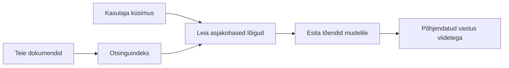

# Õpeta tehisintellekt vastama küsimustele sinu dokumentide põhjal:
## 1. sari: RAG, Azure vs avatud lähtekoodiga alternatiivid ja millal peenhäälestus on mõistlik

> Esimene artikkel 2026. aasta seeriast, mis vaatleb uuesti minu 2023. aasta Azure AI Search + Azure OpenAI dokumentide QA juhendeid.

Sarja navigeerimine: [Repo kodu](../README.md) | Järgmine: [Sari 2 - ehita lõpuni kohalik avatud lähtekoodiga RAG süsteem](./series-2-open-source-rag-end-to-end.md)

## 1. Sissejuhatus – varasema RAG juhendi uuesti läbivaatus

2023. aastal töötasin kahe juhendiga, mis õpetasid ChatGPT-d vastama küsimustele PDF-dokumentidelt, kasutades Azure AI Searchi ja Azure OpenAI-d. Kirjutasin [LangChain versiooni](https://techcommunity.microsoft.com/blog/educatordeveloperblog/teach-chatgpt-to-answer-questions-using-azure-ai-search--azure-openai-lang-chain/3969713) ning koostasin ka kaasautorina koos [Lee Stottiga](https://developer.microsoft.com/en-us/advocates/lee-stott), Microsofti peamise pilveesindajaga, kaasneva [Semantic Kernel versiooni](https://techcommunity.microsoft.com/blog/educatordeveloperblog/teach-chatgpt-to-answer-questions-using-azure-ai-search--azure-openai-semantic-k/3985395). Tollal tundus mõte „ChatGPT sinu andmetel“ paljude arendajate jaoks endiselt uus. Juhendid kasutasid Azure Blob Storage'i, Azure AI Searchi, Azure OpenAI-d, LangChain'i, Semantic Kernelit ja FAISS-laadset vektoritõmbeotsingut, et vastata PDF-failide küsimustele.

See varasem artikkel keskendus lihtsale, kuid olulisele töövoole: dokumentide üleslaadimine, indeksimine, asjakohase sisu leidmine ja mudelile selle põhjal vastamise palumine.

Aastal 2026 on RAG ökosüsteem märkimisväärselt kasvanud. Azure AI Search toetab nüüd moodsaid vektori- ja hübriidotsingu mustreid, Azure OpenAI kuulub laiemasse Microsoft Foundry mudelite ökosüsteemi ja uuem v1 API saab kasutada standardset OpenAI kliendi ilma igakuiseid `api-version` muudatusi tegemata. Samal ajal on avatud lähtekoodi valikud nagu LangGraph, LlamaIndex, Haystack, Qdrant, Milvus, Weaviate, Chroma, Ollama ja vLLM saanud reaalseks alternatiiviks tõeliste RAG süsteemide jaoks.

Seepärast tahtsin seda teemat uuesti käsitleda. Küsimus ei ole enam ainult "Kuidas ma ehitan RAG-i?" Nüüd on palju viise selle ehitamiseks ning olulisem küsimus on „Millist arhitektuuri peaksin oma olukorras valima?“

Kuid põhiprobleem ei ole muutunud.

AI mudel ei tea automaatselt sinu dokumente. Kasuliku dokumentide küsimustele vastamise süsteemi loomiseks on endiselt vaja usaldusväärset otsingut, põhistamist, hindamist ja töövoogude haldamist.

See artikkel ei ole veel üks "vestlus PDF-iga" juhend lõpust lõpuni. Soovin selle uuendatud seeria alustada küsimusega, mis nüüd mulle enam huvi pakub: millal valida hallatud Azure arhitektuur, millal avatud lähtekoodiga RAG stäkk ja millal on peenhäälestus tegelikult mõistlik?

See on esimene artikkel sarjast, mis käsitleb dokumentidel põhinevate AI süsteemide ehitamist. Selles esimeses osas keskendume arhitektuurilistele otsustele: miks RAG on oluline, millal on kasulikud Azure'i hallatud teenused, millal on mõistlikud avatud lähtekoodi alternatiivid ning kuhu peenhäälestus sobitub.

Pärast dokumentide QA süsteemide loomist ja ülevaatamist on mul tekkinud vähem huvi selle vastu, milline tööriist demo jaoks kõige parem välja näeb, ja rohkem huvi selle vastu, milline arhitektuur kestab reaalseid kasutajaid, muutuvaid dokumente, õigusi, tõrkeid ja hooldust.

## 2. Miks su tehisintellekt vajab otsingusüsteemi

Suured keelemudelid on treenitud laiast avalikust ja litsentseeritud andmestikust. Nad võivad teada palju üldistest teemadest, kuid ei tea automaatselt sinu privaatseid PDF-e, sisemisi poliitikaid, ettevõtte protseduure, uurimisarhiive, klassiruumi materjale, klienditoe märkmeid ega hiljuti uuendatud dokumentatsiooni.

Lihtne viis RAG-i mõistmiseks on järgmine: selle asemel, et oodata mudelilt kõigi dokumentide meelespidamist, anname talle otsingusüsteemi. Kui kasutaja esitab küsimuse, leiab süsteem esmalt kõige asjakohasemad infokillud ning annab need seejärel mudelile kontekstina.

See on oluline, sest paljud reaalse maailma teadmiste allikad on privaatset laadi, pidevalt muutuvad, õigusetundlikud, hoiustatud mitmes süsteemis, kirjutatud mitmes formaadis ja liiga mahukad, et neid otse tõrksisüsteemi kleepida.

Näiteks kui koolil, ettevõttel või teadusrühmal on 10 000 sisemist dokumenti, siis mudel ei suuda neist usaldusväärselt vastata, kui süsteem ei too õigel ajal välja õigeid osi.

See viib loomulikult tüüpilise küsimuseni:

Miks mitte lihtsalt mudelit peenhäälestada?

Peenhäälestus võib olla kasulik, kuid enamasti see dokumentide teadmiste puhul esimene õige tööriist ei ole. Kui teadmus muutub sageli, kui viited on olulised või kui juurdepääsuõigused on tähtsad, on RAG tavaliselt parem lähtepunkt. Peenhäälestus sobib paremini käitumise, stiili, väljundformaatide ja ülesannete mustrite õpetamiseks.

## 3. RAG arhitektuur praktikas

Kujuta ette, et ehitad tehisintellekti assistenti koolile. Assistent peab vastama küsimustele poliitikaga seotud PDF-idest, kursusjuhenditest, sisemistest KKK-lehtedest ja hiljuti uuendatud teadetest.

Kui õpilane küsib: „Kas ma võin kasutada generatiivset tehisintellekti oma lõputöö jaoks?“, ei tohiks süsteem vastata mudeli üldmälu põhjal. See peaks esmalt leidma asjakohase koolipoliitika, hankima osa tehisintellekti kasutamisest ning seejärel paluma mudelil vastata selle tõendusmaterjali põhjal.

See on RAG praktikas.

Kõrgel tasemel võib töövoo mõelda nii:

Detailid võivad olla keerulisemad, kuid põhiprintsiip on lihtne: mudel ei vasta üksinda. Ta vastab tõendite põhjal.

Esmalt süstitakse dokumendid salvestussüsteemidest nagu Azure Blob Storage, SharePoint, GitHub või sisemine CMS. Seejärel süsteem töötleb need tekstiks, säilitades kasulikku struktuuri nagu pealkirjad, leheküljenumbrid, tabelid, osad ja allika asukohad.

Järgmine samm on sisu jagamine tükkideks (chunk). See kõlab lihtsana, kuid on süsteemi üks tähtsamaid osi. Kui tükk on liiga väike, võib see kaotada ümbritseva konteksti. Kui tükk on liiga suur, võib see sisaldada asjakohatut infot ja muuta otsingu vähem täpseks.

Pärast tükkide tegemist loob süsteem nendest sisendingimused (embeddingud) ning salvestab need koos algteksti ja metainfo nagu failinimi, lehekülg, õigused, dokumendi versioon ja allika URL otsingukaardeks.

Kui kasutaja esitab küsimuse, otsib süsteem kandidaattükke märksõnaotsinguga, vektoriotsinguga või hübriidotsinguga. Reranker võib seejärel need tükid ümber korraldada nii, et kõige kasulikumad tõendid on üleval.

Lõpuks saab mudel küsimuse ja hangitud tõendid. Vastus peaks toetuma neile tõenditele ning tagastama viited, et kasutaja saaks allikat kontrollida.

Oluline on see, et RAG ei tähenda vaid „pane PDF-id vektandmebaasi“. Vastuse kvaliteet sõltub kogu töövoost: töötlemine, tükkideks jagamine, otsing, ümberjärjestamine, suunamine, viitamine ja hindamine.

Sellepärast on dokumendi struktuur tähtis. PDF-is võivad pealkiri, tabel, jalus või lehe piirid muuta lõigu tähendust. Azure'is kasutab Document Layout oskus Azure Document Intelligence’i paigutuse võimekust, et toota struktuuriteadlikku väljundit, mis võib parandada tükkide ja otsingu kvaliteeti RAG süsteemides.

## 4. Mis on aastast 2023 muutunud?

2023. aasta juhend oli tol ajal hea lähtepunkt:

- Azure Blob Storage salvestas PDF faile.
- Azure AI Search indekseeris sisu.
- LangChain ühendas otsingu Azure OpenAI-ga.
- FAISS töötas lihtsa lokaalse vektandmebaasina.
- Näites kasutati `gpt-35-turbo` ja `text-embedding-ada-002`.

2026. aastal peaks kaasaegne versioon kajastama mitmeid muudatusi.

Esiteks on otsing küpsenud. 2023. aastal kasutasid paljud demo'd lihtsat vektorsarnasuse otsingut. Tänapäeval on hübriidotsing sageli tõsise dokumentide QA vaikimisi alguspunkt. Azure AI Search toetab hübriidotsingut, ühendades märksõna- ja vektoripäringud üheks päringuks ning liites tulemused Reciprocal Rank Fusion meetodil. Semantiline järjestaja võib seejärel ümber järjestada täisteksti, vektori ja hübriidtulemused.

Teiseks on süstimine (ingest) muutunud keerukamaks. Selle asemel, et iga dokument käsitsi rakenduskoodiga tükkideks jagada, toetab Azure AI Search integreeritud vektoriseerimist tükkide tegemiseks, sisutõmmiste loomist ja päringuajal vektoriseerimist. PDF-ide ja dokumentikaaluga tööde puhul võib Document Layout oskus säilitada rohkem struktuuri kui fikseeritud suurusega tükid.

Kolmandaks on korrastamine olulisem. Raske osa ei ole sageli LLM API kõne ise, vaid vigadega toimetulek, korduskatsed, aegunud otsingud, tükkide kvaliteet, pikaajalised töövood, inimlik läbivaatus ja hindamine mahuka ulatusega. Selleks muutuvad töövoogude tööriistad nagu LangGraph, LlamaIndex töövood, Haystack torujuhtmed ja platvormipõhised hindamis- ning jälgimisvahendid olulisemaks kui üks lineaarne ahel.

Neljandaks pole hindamine enam vabatahtlik. Demo võib ühe küsimusega muljet avaldada, kuid tootmissüsteem vajab testkomplekte, regressioonikontrolle, otsingu mõõdikuid, põhistavuse kontrolle ja monitooringut. Ilma hindamiseta on raske teada, kas süsteem paraneb või lihtsalt muutub.

## 5. Azure ja avatud lähtekoodiga RAG stäkkide valik

Ma ei usu, et mõistlik küsimus on „Kas Azure on parem kui avatud lähtekood?“ või „Kas avatud lähtekood on parem kui Azure?“

Mõistlik küsimus on: millist tüüpi süsteemi sa ehitad, kes seda kasutab, millised piirangud sul on ning millised tõrked on vastuvõetamatud?

Kui alustasin dokumentide QA näidete loomist, mõtlesin peamiselt, kas otsing toimib. Kas saan PDF-id üles laadida, neid otsida ja vastuse genereerida? See oli mõistlik lähtepunkt.

Pärast rohkemate realistlike tehisintellekti töövoogude läbimängimist on mu hinnang muutunud. Nüüd vaatan enne RAG stäki valimist nelja valdkonda:

- identiteet ja õigused
- otsingu kvaliteet
- töövoo usaldusväärsus
- operatiivne omandiõigus

Need neli valdkonda annavad palju rohkem teavet kui üksi mudelivõrdlus.

Azure-põhised arhitektuurid on tavaliselt targemad, kui ettevõtte integreerimine on raskuspunkt. Kui meeskond sõltub juba Microsoft Entra ID-st, Microsoft 365-st, Azure Storage'ist, privaatvõrgust, RBAC-ist ja Azure jälgimisest, võivad Azure AI Search ja Azure OpenAI vähendada palju operatiivset keerukust. Sellises keskkonnas pole Azure vaid mudeli API. Väärtus on ümbritsevas süsteemis: identiteet, haldus, hallatud otsing, turvaintegratsioon, tugi ja tuntud operatsioonid.

Avatud lähtekoodiga arhitektuurid on tavaliselt mõistlikud, kui paindlikkus on keeruline osa. Kui meeskond vajab kohalikku järeldamist, pilveportatiivsust, kohandatud otsingu torujuhet, spetsialiseeritud ümberjärjestamist või otsest kontrolli vektandmebaasi ja mudeliserveri kihi üle, võib avatud lähtekoodiga stäkk olla sobivam. Kompromiss on see, et meeskond vastutab rohkem usaldusväärsuse eest: varukoopiad, skalaarimine, latentsus, migratsioonid, jälgimine ja turvalisus.

Praktikas ei ole paljud tootmise tehisintellekti süsteemid puhtalt pilvepõhised ega puhtalt avatud lähtekoodiga. Need on tihti hübriidsüsteemid, mis tasakaalustavad operatiivse lihtsuse, portatiivsuse, halduse ja tehnilise paindlikkuse vahel.

Näiteks ei imestaksin, kui süsteem kasutab mudeli ligipääsuks Azure OpenAI-d, töövoogude juhiks LangGraphi, hostimiseks Azure'i ja konkreetse otsingu nõude korral avatud lähtekoodiga vektandmebaasi. See ei ole arhitektuuriline ebakõla, vaid õige tasandi hallatud teenuse ja tehnilise kontrolli valik iga osa jaoks.

Mulle meeldivad hübriidarhitektuurid, kus haldusplatvorm lahendab olulisi ettevõtte probleeme, samas kui avatud lähtekoodi komponendid pakuvad meeskonnale paindlikkust seal, kus see tegelikult oluline on.

## 6. Praktiline otsustusjuhend

Siin on otsustustabel, mida ma kasutaksin meeskonna ees enne RAG stäki valikut:

| Otsustusalad | Azure hallatud stäkk on tugevam, kui... | Avatud lähtekoodiga stäkk on tugevam, kui... |
| --- | --- | --- |
| Identiteet ja ligipääs | Entra ID, RBAC, hallatud identiteet ja ettevõtte õigused on keskmesse tõstetud | domineerib kohandatud autentimine, mitt-Microsofti identiteet või rakendusele spetsiifiline ligipääsulogiika |
| Operatsioonid | meeskond soovib hallatud infrastruktuuri, tuge, SLA-sid ja lihtsamat kasutuselevõttu | meeskond suudab hallata vektandmebaase, mudeliservereid, varukoopiaid ja skaleerimist |
| Otsing | hübriidotsing, semantiline järjestamine, filtrid ja metade otsing katavad enamuse vajadustest | meeskond vajab kohandatud otsingut, spetsialiseeritud ümberjärjestamist või eksperimentaalset indekseerimist |
| Portatiivsus | Azure ökosüsteemi sobivus on vastuvõetav või eelistatud | pilveluku vältimine on range nõue |
| Järeldamine | Azure OpenAI haldus, võrgustik ja ettevõtte kontroll on olulised | kohalik järeldamine, kohandatud mudelid või ise majutatud teenindus on vajalikud |
| Kulu | tehnilise ja operatiivse töö vähendamine on tähtsam kui infrastruktuuri häälestamine | mahud on piisavalt suured, et õigustada infrastruktuuri hoolikat optimeerimist |
| Katsetamine | stabiilsus ja ettevõtte integratsioon on olulisemad kui sagedased komponendimuudatused | meeskond katsetab kiiresti agentide, tööriistade, mälude ja otsinguprotsessidega |

Minu reegel on lihtne:

- Alusta Azure'iga, kui ettevõtte integreerimine, turvalisus ja operatiivse lihtsuse riskid on peamised.
- Alusta avatud lähtekoodiga, kui portatiivsus, kohandamine või kohalik kontroll on peamised riskid.
- Kasuta hübriidset stäkki, kui mõlemad on tõesed.

Seetõttu ei alustaks ma 2026. aasta RAG seeriat esmalt koodist. Kood on oluline, kuid arhitektuuri valik tuleb enne teostust. Lihtne demo võib varjata keerulisemaid otsuseid. Hea RAG süsteem teeb need otsused selgelt nähtavaks.

## 7. Kuhu peenhäälestus sobib

Peenhäälestust mainitakse tihti koos RAG-iga, kuid minu arvates on oluline neid eristada.

RAG on tavaliselt parem valik, kui süsteem vajab värsket, privaatset, õigustundlikku või allikapõhist teadmust. Kui vastus peaks viitama dokumentidele, kajastama hiljutisi uuendusi või austama kasutajapõhiseid juurdepääsureegleid, peaks otsing olema arhitektuuri osa.
Peenhäälestus on kasulikum siis, kui teadmised ei ole peamine probleem. See võib aidata, kui soovid, et mudel järgiks kindlat väljundiformaati, vastaks domeenile spetsiifilisel viisil, sooritaks stabiilset ülesannet järjepidevamalt või vähendaks iga käsu puhul vajalike juhiste kogust.

Tavapäraselt saavad mõlemad koos töötada. Tugiteenuse assistent võib RAG-i abil leida uusima poliitika, samal ajal kui peenhäälestatud mudel õpib ettevõtte eelistatud vastuse struktuuri ja tonaalsust.

Viga on käsitleda peenhäälestust kui dokumendipoe asendajat. See ei eemalda vajadust otsingu järele, kui süsteem peab vastama värskest, privaatset või lubadega kaitstud andmestikust.

## 8. Kuhu see sari edasi liigub

See artikkel on otsustamiskihiks. Enne koodi kirjutamist tahtsin teha valikud selgeks: RAG vs peenhäälestus, Azure vs avatud lähtekood, hallatud teenused vs operatiivne kontroll.

Enne rakendusse minekut tahan siin jätta ühe punkti: paljudes ettevõtte tehisintellekti süsteemides on mudel vaid üks komponent. Otsingu kvaliteet, orkestreerimine, hindamine, load ja töökindlus on tihti need, mis määravad, kas süsteem õnnestub väljaspool demoetappi.

Järgmistes sarja osades kavatsen süveneda dokumentidele tuginevate tehisintellekti süsteemide praktilisse külge: kõigepealt ehitada kohalik avatud lähtekoodiga RAG töövoog, seejärel uuesti ehitada sama stsenaarium Azure AI Search’i ja Azure OpenAI-ga ning lõpuks hinnata, kas süsteem tegelikult töötab.

Võin järjekorda sarja jooksul muuta, kuid eesmärk jääb samaks: liikuda lihtsa demo piiridest kaugemale ja näidata, kuidas mõelda RAG süsteemide peale, mida saab hooldada, hinnata ja kasutada.

## 9. Viited ja ressursid

Originaaltutorid:

- [Õpeta ChatGPT-d küsimustele vastama: Azure AI Search & Azure OpenAI kasutamine (Lang Chain)](https://techcommunity.microsoft.com/blog/educatordeveloperblog/teach-chatgpt-to-answer-questions-using-azure-ai-search--azure-openai-lang-chain/3969713)
- [Õpeta ChatGPT-d küsimustele vastama: Azure AI Search & Azure OpenAI kasutamine (Semantic Kernel)](https://techcommunity.microsoft.com/blog/educatordeveloperblog/teach-chatgpt-to-answer-questions-using-azure-ai-search--azure-openai-semantic-k/3985395)

Azure:

- [Azure AI Search REST API versioonid](https://learn.microsoft.com/en-us/rest/api/searchservice/search-service-api-versions)
- [Hübriidotsing Azure AI Search’is](https://learn.microsoft.com/en-us/azure/search/hybrid-search-how-to-query)
- [Integreeritud vektoreerimine Azure AI Search’is](https://learn.microsoft.com/en-us/azure/search/vector-search-integrated-vectorization)
- [Dokumendipaigutuse oskus Azure AI Search’is](https://learn.microsoft.com/en-us/azure/search/cognitive-search-skill-document-intelligence-layout)
- [Tükelda ja vektoreeri dokumendi paigutuse järgi](https://learn.microsoft.com/en-us/azure/search/search-how-to-semantic-chunking)
- [Semeantiline järjestamine Azure AI Search’is](https://learn.microsoft.com/en-us/azure/search/semantic-search-overview)
- [Azure OpenAI / Microsoft Foundry API versiooni elutsükkel](https://learn.microsoft.com/en-us/azure/foundry/openai/api-version-lifecycle)
- [Azure poolt müüdavad Foundry mudelid](https://learn.microsoft.com/en-us/azure/foundry/foundry-models/concepts/models-sold-directly-by-azure)
- [Microsoft Foundry peenhäälestuse kaalutlused](https://learn.microsoft.com/en-us/azure/foundry/openai/concepts/fine-tuning-considerations)
- [Microsoft Foundry jälgimine](https://learn.microsoft.com/en-us/azure/foundry/concepts/observability)
- [Hinda Microsoft Foundry generatiivse tehisintellekti rakendusi](https://learn.microsoft.com/en-us/azure/foundry/how-to/evaluate-generative-ai-app)

Avatud lähtekoodiga:

- [LangGraph dokumentatsioon](https://docs.langchain.com/oss/python/langgraph/overview)
- [LlamaIndex dokumentatsioon](https://developers.llamaindex.ai/python/framework/)
- [Haystack dokumentatsioon](https://docs.haystack.deepset.ai/)
- [Qdrant dokumentatsioon](https://qdrant.tech/documentation/overview/)
- [Milvus dokumentatsioon](https://milvus.io/docs/overview.md)
- [Weaviate dokumentatsioon](https://docs.weaviate.io/weaviate/current/)
- [Chroma dokumentatsioon](https://docs.trychroma.com/docs/overview/introduction)
- [Ollama manused](https://docs.ollama.com/capabilities/embeddings)
- [vLLM OpenAI-ga ühilduv server](https://docs.vllm.ai/en/latest/serving/openai_compatible_server.html)
- [BGE manustamismudelid](https://huggingface.co/BAAI/bge-large-en-v1.5)
- [E5 manustamismudelid](https://huggingface.co/intfloat/e5-large-v2)
- [Instructor manustamismudelid](https://huggingface.co/hkunlp/instructor-large)

Järgmine: [Sari 2 - Ehita kohalik avatud lähtekoodiga RAG süsteem otsast lõpuni](./series-2-open-source-rag-end-to-end.md)

---

<!-- CO-OP TRANSLATOR DISCLAIMER START -->
**Lahtiütlus**:
See dokument on tõlgitud kasutades AI tõlketeenust [Co-op Translator](https://github.com/Azure/co-op-translator). Kuigi me püüdleme täpsuse poole, palun pange tähele, et automatiseeritud tõlgetes võib esineda vigu või ebatäpsusi. Originaaldokument selle emakeeles tuleks pidada autoriteetseks allikaks. Olulise teabe puhul soovitatakse kasutada professionaalset inimtõlget. Me ei vastuta selle tõlkega seotud eksimustest või valesti mõistmistest.
<!-- CO-OP TRANSLATOR DISCLAIMER END -->