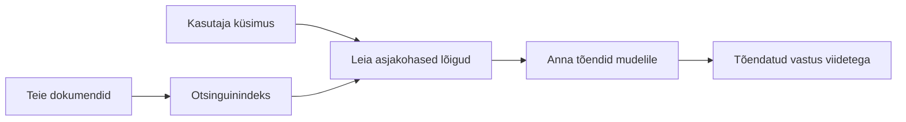

# Õpeta tehisintellekt vastama küsimustele sinu dokumentide põhjal:
## Seeria 1: RAG, Azure vs avatud lähtekoodi alternatiivid ning millal peenhäälestamine mõttekas on

> Esimene artikkel 2026. aasta sarjas, mis vaatab uuesti üle minu 2023. aasta Azure AI Search + Azure OpenAI dokumentide Q&A õpetused.

## 1. Sissejuhatus – varasema RAG juhendi ülevaade

2023. aastal töötasin paaril juhendil, kuidas õpetada ChatGPT-d vastama küsimustele PDF-dokumentidest, kasutades Azure AI Searchi ja Azure OpenAI-d. Ma kirjutasin [LangChain versiooni](https://techcommunity.microsoft.com/blog/educatordeveloperblog/teach-chatgpt-to-answer-questions-using-azure-ai-search--azure-openai-lang-chain/3969713) ning koostasin ka kaasautorina [Semantic Kernel versiooni](https://techcommunity.microsoft.com/blog/educatordeveloperblog/teach-chatgpt-to-answer-questions-using-azure-ai-search--azure-openai-semantic-k/3985395) koos [Lee Stottiga](https://developer.microsoft.com/en-us/advocates/lee-stott), kes on Microsofti peamine pilveadvokaadi juht. Tookord tundus mõte „ChatGPT sinu andmete põhjal“ paljudele arendajatele ikka veel uus. Juhendid kasutasid Azure Blob Storage’it, Azure AI Searchi, Azure OpenAI-d, LangChain’i, Semantic Kernel’it ja FAISS-tüüpi vektorite otsingut, et vastata küsimustele PDF-failidest.

See varasem artikkel keskendus lihtsale, kuid olulisele töövoole: laadida dokumendid üles, indekseerida need, otsida asjakohast sisu ja paluda mudelil vastata vastavalt sellele sisule.

2026. aastal on RAG ökosüsteem märkimisväärselt kasvanud. Azure AI Search toetab nüüd kaasaegseid vektori- ja hübriidotsingu mustreid, Azure OpenAI on osa Microsoft Foundry Models laiemast ökosüsteemist ning uuem v1 API saab kasutada standardset OpenAI klienti ilma igakuiseid `api-version` muudatusi nõudmata. Samal ajal on avatud lähtekoodi lahendused nagu LangGraph, LlamaIndex, Haystack, Qdrant, Milvus, Weaviate, Chroma, Ollama ja vLLM saanud praktilisteks valikuteks tõeliste RAG süsteemide jaoks.

Seetõttu tahtsin seda teemat uuesti läbi vaadata. Küsimus ei ole enam ainult „Kuidas ma ehitan RAG-i?“ Täna on palju viise selle ülesehitamiseks ja olulisem küsimus on „Millist arhitektuuri valida minu olukorras?“

Kuid põhiprobleem ei ole muutunud.

Tehisintellekti mudel ei tunne su dokumente automaatselt. Kasuliku dokumentidel põhineva küsimustele vastamise süsteemi loomiseks vajad ikka usaldusväärset otsingut, sidumist, hindamist ja tööoperatsioonide vooge.

See artikkel ei ole järjekordne täielik „vestlus PDF-iga“ juhend. Soovin selle uuendatud sarja alustada küsimusega, mis nüüd on mulle olulisem: millal valida juhitud Azure arhitektuur, millal valida avatud lähtekoodi RAG-pinu ja millal on peenhäälestamine tegelikult mõttekas?

See on esimene artikkel sarjas dokumentidel põhinevate tehisintellekti süsteemide ehitamisest. Selles esimeses osas keskendume arhitektuurilistele otsustele: miks RAG on tähtis, millal on Azure-põhised juhitud teenused kasulikud, millal mõistlikud on avatud lähtekoodi alternatiivid ja kus sobib peenhäälestamine.

Pärast dokumentide Q&A süsteemide loomist ja neile tagasi vaatamist olen vähem huvitatud, milline tööriist demol kõige paremini välja paistab, ja rohkem sellest, milline arhitektuur talub päris kasutajaid, muutuvaid dokumente, õigusi, tõrkeid ja hooldust.

## 2. Miks su tehisintellekt vajab otsingusüsteemi

Suurte keelemudelite treenimisel kasutatakse laialdaselt avalikke ja litsentseeritud andmeid. Nad võivad palju teada üldistest teemadest, kuid ei tunne automaatselt sinu privaatseid PDF-e, sisepoliitikaid, ettevõtte protseduure, uurimisarhiive, klassiruumi materjale, klienditoe märkmeid või hiljuti uuendatud dokumentatsiooni.

Lihtsalt mõeldes on RAG sedasorti: selle asemel, et mudel peaks meenutama iga dokumenti, anname talle otsingusüsteemi. Kui kasutaja esitab küsimuse, leiab süsteem kõige asjakohasemad informatsiooni osad ja annab need mudelile kontekstina.

See on oluline, sest paljud pärismaailma teadmiste allikad on privaatset laadi, pidevalt muutuvad, ligipääsuõiguste all, paiknevad mitmes süsteemis, on kirjutatud mitmes formaadis ja liiga suured, et neid prompti otse kleepida.

Näiteks kui koolil, ettevõttel või uurimisrühmal on 10 000 sisemist dokumenti, ei saa mudel nende dokumentide põhjal usaldusväärselt vastata, kui süsteem ei otsi õiged osad õigel ajal välja.

See viib loomulikult sageli esitatud küsimuseni:

Miks mitte lihtsalt mudelit peenhäälestada?

Peenhäälestamine võib olla kasulik, kuid tavaliselt ei ole see esimene õige tööriist dokumentaalsete teadmiste puhul. Kui teadmised muutuvad sageli, kui viited on olulised või kui ligipääsuõigused on tähtsad, on RAG tavaliselt parem lähtepunkt. Peenhäälestamine sobib paremini käitumise, stiili, väljundformaadi ja ülesandemustrite õpetamiseks.

## 3. RAG arhitektuur praktikas

Kujuta ette, et ehitad tehisintellekti assistenti koolile. Assistent peab vastama küsimustele poliitikadokumentidest, kursusejuhenditest, sisemistest KKK-lehtedest ja hiljuti uuendatud teadetest.

Kui õpilane küsib: „Kas ma võin kasutada generatiivset tehisintellekti oma lõputöös?“, ei tohiks süsteem vastata mudeli üldmälust. Esmalt tuleb leida asjakohane koolipoliitika, tuua välja AI kasutamise lõik ja seejärel paluda mudelil vastata selle tõendusmaterjali põhjal.

See on RAG praktikas.

Kõrgetasemeliselt võib protsessi vaadata järgmiselt:

Detailid võivad olla keerukamad, kuid põhiline idee on lihtne: mudel ei vasta üksi. Ta vastab koos välja otsitud tõenditega.

Esiteks hangitakse dokumendid salvestussüsteemidest nagu Azure Blob Storage, SharePoint, GitHub või sisemine CMS. Seejärel töödeldakse need tekstiks, säilitades kasuliku struktuuri nagu pealkirjad, leheküljed, tabelid, sektsioonid ja allikakohad.

Järgmiseks jagatakse sisu lõikudeks. See tundub lihtne, kuid on süsteemi üks olulisemaid osi. Kui lõik on liiga väike, võib kontekst kaduda. Kui lõik on liiga suur, võib kaasneda mitteseotud info ja otsing pole enam nii täpne.

Pärast lõikude moodustamist luuakse manused (embedding’id) ja need salvestatakse otsitavasse indeksisse koos algse tekstiga ning metainfoga nagu faili nimi, lehekülje number, load, dokumendi versioon ja lähte-URL.

Kui kasutaja esitab küsimuse, otsitakse sobivad lõigud märksõna-, vektori- või hübriidotsingu abil. Seejärel saab järjestusvahend neid lõike korda seada nii, et kõige kasulikum tõendusmaterjal on otsingu tipposas.

Lõpuks saab mudel küsimuse koos hangitud tõenditega. Vastus peab olema nende tõendite põhjal ja sisaldama viiteid, et kasutaja saaks allikat kontrollida.

Oluline on mõista, et RAG ei ole ainult „pane PDF-id vektorandmebaasi“. Vastuse kvaliteet sõltub kogu töövoost: tekstitöötlemine, lõikude jagamine, otsing, ümberjärjestamine, promptimine, tsitaadid ja hindamine.

Sellepärast on dokumendistruktuur tähtis. PDF-is võib pealkiri, tabel, jalus või lehekülje piir muuta lõigu tähendust. Azure’is kasutab Document Layout oskus Azure Document Intelligence’i vormingu võimeid, et tekitada struktuuritundlikku väljundit, mis võib parandada lõikude ja otsingu kvaliteeti RAG süsteemides.

## 4. Mis on alates 2023. aastast muutunud?

2023. aasta juhend oli oma aja kohta hea lähtepunkt:

- Azure Blob Storage hoidis PDF-faile.
- Azure AI Search indekseeris sisu.
- LangChain ühendas otsingud Azure OpenAI-ga.
- FAISS toetas lihtsat kohalikku vektoripoega.
- Näites kasutati `gpt-35-turbo` ja `text-embedding-ada-002`.

2026. aastal peaks tänapäevane versioon peegeldama mitmeid muudatusi.

Esiteks on otsimine küpsenud. 2023. aastal kasutati mitmetes demonstreerimistes lihtsat vektorite sarnasuse otsingut. Tänapäeval on hübriidotsing sageli tõsise dokumentide Q&A standardne lähtepunkt. Azure AI Search toetab hübriidotsingut, kombineerides märksõna- ja vektoripäringuid ühes päringus ning ühildades tulemused Reciprocal Rank Fusion meetodil. Sõnalist osa täisteksti-, vektori- ja hübriidtulemustest saab seejärel soontunud järjestaja (Semantic ranker) ümber järjestada.

Teiseks on andmete töötlemine (ingestion) saanud keerukamaks. Iga dokumendi käsitsi lõhkumise asemel toetab Azure AI Search integreeritud vektoreerimist lõikude moodustamiseks, manusteks ja päringuajal vektoreerimist. PDF-ide ja dokumentide koormuse puhul võib Document Layout oskus säilitada rohkem struktuuri kui fikseeritud suurusega lõigud.

Kolmandaks on korraldus (orchestration) saanud olulisemaks. Raske osa ei ole tihti LLM API kõne ise, vaid tõrgete, korduste, aegunud otsingute, lõikude kvaliteedi, pikkade töövoogude, inimliku ülevaate ja suuremahulise hindamise haldamine. Siin muutuvad töövoole orienteeritud vahendid nagu LangGraph, LlamaIndexi töövood, Haystack-i torud ning platvormitasandi hindamis- ja jälgimisvahendid olulisemaks kui üksik lineaarne ahel.

Neljandaks ei ole hindamine enam valikuline. Üksik küsimus võib demo ilusaks teha, kuid tootmissüsteem vajab testikomplekte, regressioonikontrolle, otsingumõõdikuid, alustavustesti ja järelevalvet. Ilma hindamiseta on raske teada, kas süsteem paraneb või lihtsalt muutub.

## 5. Valik Azure ja avatud lähtekoodi RAG-pinu vahel

Ma ei arva, et kasulik küsimus on „Kas Azure on parem kui avatud lähtekood?“ või „Kas avatud lähtekood on parem kui Azure?“

Kasu küsimus on: millist süsteemi sa ehitad, kes seda haldab, mis piirangud sul on ja millised tõrketüübid on lubamatud?

Kui ma alustasin dokumentide Q&A näidete loomist, mõtlesin peamiselt, kas otsing töötab. Kas saan PDF-id üles laadida, neid otsida ja vastuse genereerida? See oli mõistlik lähtekoht.

Pärast realistlikumate AI töövoogudega tegelemist muutsin hindamist. Nüüd vaatan enne RAG-pinu valikut nelja asja:

- identiteet ja load
- otsingu kvaliteet
- töövoo usaldusväärsus
- haldusvastutus

Need neli valdkonda annavad palju rohkem infot kui mudeli ainuüksi võrdlus.

Azure-põhised arhitektuurid on tavaliselt mõistlikud siis, kui raskus on ettevõtte integratsioonis. Kui meeskond sõltub juba Microsoft Entra ID-st, Microsoft 365-st, Azure Storage’ist, privaatvõrgust, RBAC-ist ja Azure jälgimisest, võivad Azure AI Search ja Azure OpenAI vähendada palju operatsioonide keerukust. Sellises keskkonnas ei ole Azure ainult mudeli API. Väärtus on ümberringi süsteemis: identiteet, juhimine, juhitud otsing, turvaintegratsioon, tugi ja tuntud haldus.

Avatud lähtekoodi arhitektuurid on mõistlikud siis, kui raskus on paindlikkusel. Kui meeskond vajab kohalikku järeldust, pilveportatiilsust, kohandatud otsingu toru, spetsialiseeritud ümberjärjestamist või otsest kontrolli vektorandmebaasi ja mudelite teenindamise kihiga, võib avatud lähtekoodi pinu sobida paremini. Kaasnev kompromiss on, et meeskond vastutab rohkem usaldusväärsuse eest: varukoopiad, skaala, latentsus, migratsioonid, jälgimine ja turvalisus.

Praktikas ei ole paljud tootmiskõlblikud AI süsteemid täiesti pilvepõhised ega täiesti avatud lähtekoodi. Need on sageli hübriidse süsteemid, mis tasakaalustavad operatiivset lihtsust, portatiilsust, juhtimist ja insenerilist paindlikkust.

Näiteks ei üllataks mind, kui süsteem kasutab Azure OpenAI mudeli juurdepääsuks, LangGraph töövoo korraldamiseks, Azure’i hostimist rakendamiseks ja avatud lähtekoodi vektorandmebaasi konkreetse otsingunõude jaoks. See ei ole arhitektuuriline inkonsistents. See on õige tasandi juhitud teenuse ja insenerliku kontrolli valik iga süsteemi osa jaoks.

Mulle meeldivad hübriidarhitektuurid, kui juhitud platvorm lahendab olulisi ettevõtteprobleeme ja avatud lähtekoodi komponendid annavad meeskonnale paindlikkuse seal, kus see tegelikult loeb.

## 6. Praktiline otsustusjuhend

Siin on otsustustabel, mida kasutaksin meeskonnaga enne RAG-pinu valikut:

| Otsustusvaldkond | Azure juhitud pinu on tugevam, kui... | Avatud lähtekoodi pinu on tugevam, kui... |
| --- | --- | --- |
| Identiteet ja ligipääs | Entra ID, RBAC, hallatud identiteet ja ettevõtte load on keskmes | dominating kohandatud autentimine, mitte-Microsofti identiteet või rakenduspõhine ligipääsuloogika |
| Operatsioonid | meeskond soovib juhitud infrastruktuuri, tuge, SLA-sid ja lihtsamat kasutuselevõttu | meeskond suudab hallata vektorandmebaase, mudelite teenindust, varukoopiaid ja skaleerimist |
| Otsing | hübriidotsing, semantiline järjestamine, filtrid ja metaandmete otsing katavad enamuse vajadustest | meeskond vajab kohandatud otsingut, spetsialiseeritud ümberjärjestamist või eksperimentaalset indekseerimist |
| Portatiivsus | Azure ökosüsteem sobib või on eelistatud | pilvelukustuse vältimine on võimas nõue |
| Järeldus | Azure OpenAI juhtimine, võrgustik ja ettevõtte kontrollid on olulised | kohalik järeldus, kohandatud mudelid või iseteenindus on vajalikud |
| Kulu | inseneritöö ja operatsioonide vähendamine olulisem kui infrastruktuuri häälestus | skaala on piisavalt suur hoolika infrastruktuuri optimeerimise õigustamiseks |
| Katsetamine | stabiilsus ja ettevõtte integratsioon on tähtsamad kui komponentide sagedane muutmine | meeskond arendab kiiresti agente, tööriistu, mälu ja otsingutöövooge |

Minu nyrkkregel on lihtne:

- Alusta Azure’iga, kui ettevõtte integratsioon, turvalisus ja operatiivne lihtsus on peamised riskid.
- Alusta avatud lähtekoodiga, kui peamised riskid on portatiivsus, kohandamine või kohalik kontroll.
- Kasuta hübriidset pinna, kui mõlemad peavad paika.

Just seepärast ei alustaks 2026. aasta RAG sarja esmalt koodiga. Kood on oluline, kuid arhitektuuri valik tuleb enne rakendust. Lihtne demo peidab raskemaid valikuid. Hea RAG süsteem teeb need valikud selgeks.

## 7. Kus sobib peenhäälestamine

Peenhäälestamine mainitakse sageli koos RAG-iga, aga mulle tundub oluline need eraldada.

RAG on tavaliselt parem valik, kui süsteem vajab värsket, privaatset, loadekohalt tundlikku või allikale toetuvat teadmistebaasi. Kui vastus peab viitama dokumentidele, kajastama hiljutisi uuendusi või austama kasutajapõhiseid juurdepääsureegleid, peaks otsing olema arhitektuuri osa.

Peenhäälestamine on kasulikum, kui teadmised ei ole peamine probleem. See võib aidata, kui soovid mudelit suunata konkreetsele väljundvormile, sobitada spetsiifilist domeenipõhist stiili, teha stabiilset ülesannet järjepidevamalt või vähendada iga prompti käsklust.

Praktikas võivad need kaks omavahel koos töötada. Tugiteenuste assistent võib kasutada RAG-i, et hankida uusimat poliitikat, samal ajal kui peenhäälestatud mudel õpib ettevõtte eelistatud vastuse struktuuri ja tooni.

Viga on käsitleda peenhäälestust kui dokumendipoe asendajat. See ei asenda vajadust pärimise järele, kui süsteem peab vastama värske, privaatse või loaaladusega tundliku andme alusel.

## 8. Kuhu see sari edasi liigub

See artikkel on otsustusprotsessi kiht. Enne koodi kirjutamist tahtsin teha kompromissid selgeteks: RAG vs peenhäälestus, Azure vs avatud lähtekood, hallatud teenused vs operatsiooniline kontroll.

Enne rakendusse minekut tahan siia jätta ühe mõtte: paljudes äriliste tehisintellekti süsteemides on mudel ainult üks komponent. Päringu kvaliteet, orkestreerimine, hindamine, load ja operatsiooniline töökindlus on tihti need, mis määravad, kas süsteem õnnestub demos­teidist kaugemale.

Järgmistes selle sarja osades plaanin minna sügavamale dokumentidel põhinevate tehisintellekti süsteemide praktilisse külge: kuidas ehitada Azure’i põhist arhitektuuri, kuidas avatud lähtekoodi alternatiivid praktikas vastu peavad ning kuidas hinnata, kas RAG-süsteem tegelikult töötab.

Võin järjestust muuta sarja arenedes, kuid eesmärk jääb samaks: liikuda edasi lihtsast demonstreerimisest ja näidata, kuidas mõelda RAG-süsteemide peale, mida saab hooldada, hinnata ja opereerida.

## 9. Viited ja ressursid

Originaaltutorialid:

- [Õpeta ChatGPT-d küsimustele vastama: Azure AI Search & Azure OpenAI kasutamine (Lang Chain)](https://techcommunity.microsoft.com/blog/educatordeveloperblog/teach-chatgpt-to-answer-questions-using-azure-ai-search--azure-openai-lang-chain/3969713)
- [Õpeta ChatGPT-d küsimustele vastama: Azure AI Search & Azure OpenAI kasutamine (Semantic Kernel)](https://techcommunity.microsoft.com/blog/educatordeveloperblog/teach-chatgpt-to-answer-questions-using-azure-ai-search--azure-openai-semantic-k/3985395)

Azure:

- [Azure AI Search REST API versioonid](https://learn.microsoft.com/en-us/rest/api/searchservice/search-service-api-versions)
- [Hübriidotsing Azure AI Searchis](https://learn.microsoft.com/en-us/azure/search/hybrid-search-how-to-query)
- [Integreeritud vektoriseerimine Azure AI Searchis](https://learn.microsoft.com/en-us/azure/search/vector-search-integrated-vectorization)
- [Dokumendi paigutuse oskus Azure AI Searchis](https://learn.microsoft.com/en-us/azure/search/cognitive-search-skill-document-intelligence-layout)
- [Tükelda ja vektori järgi paigutust](https://learn.microsoft.com/en-us/azure/search/search-how-to-semantic-chunking)
- [Semantiline järjestamine Azure AI Searchis](https://learn.microsoft.com/en-us/azure/search/semantic-search-overview)
- [Azure OpenAI / Microsoft Foundry API versiooni elutsükkel](https://learn.microsoft.com/en-us/azure/foundry/openai/api-version-lifecycle)
- [Foundry mudelid, mida Azure müüb](https://learn.microsoft.com/en-us/azure/foundry/foundry-models/concepts/models-sold-directly-by-azure)
- [Microsoft Foundry peenhäälestuse kaalutlused](https://learn.microsoft.com/en-us/azure/foundry/openai/concepts/fine-tuning-considerations)
- [Microsoft Foundry jälgitavus](https://learn.microsoft.com/en-us/azure/foundry/concepts/observability)
- [Käivita hinnanguid Microsoft Foundry’s](https://learn.microsoft.com/en-us/azure/foundry/how-to/evaluate-generative-ai-app)

Avatud lähtekood:

- [LangGraph dokumentatsioon](https://docs.langchain.com/oss/python/langgraph/overview)
- [LlamaIndex dokumentatsioon](https://developers.llamaindex.ai/python/framework/)
- [Haystack dokumentatsioon](https://docs.haystack.deepset.ai/)
- [Qdrant dokumentatsioon](https://qdrant.tech/documentation/overview/)
- [Milvus dokumentatsioon](https://milvus.io/docs/overview.md)
- [Weaviate dokumentatsioon](https://docs.weaviate.io/weaviate/current/)
- [Chroma dokumentatsioon](https://docs.trychroma.com/docs/overview/introduction)
- [Ollama manused](https://docs.ollama.com/capabilities/embeddings)
- [vLLM OpenAI-ühilduv server](https://docs.vllm.ai/en/latest/serving/openai_compatible_server.html)
- [BGE manuse mudelid](https://huggingface.co/BAAI/bge-large-en-v1.5)
- [E5 manuse mudelid](https://huggingface.co/intfloat/e5-large-v2)
- [Instructor manuse mudelid](https://huggingface.co/hkunlp/instructor-large)

---

<!-- CO-OP TRANSLATOR DISCLAIMER START -->
**Lahtiütlus**:
See dokument on tõlgitud kasutades AI tõlketeenust [Co-op Translator](https://github.com/Azure/co-op-translator). Kuigi me püüdleme täpsuse poole, palun pange tähele, et automatiseeritud tõlgetes võib esineda vigu või ebatäpsusi. Originaaldokument selle emakeeles tuleks pidada autoriteetseks allikaks. Olulise teabe puhul soovitatakse kasutada professionaalset inimtõlget. Me ei vastuta selle tõlkega seotud eksimustest või valesti mõistmistest.
<!-- CO-OP TRANSLATOR DISCLAIMER END -->