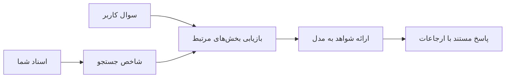

# آموزش هوش مصنوعی برای پاسخ به سوالات بر اساس اسناد شما:
## مجموعه ۱: RAG، آزور در مقابل گزینه‌های متن‌باز و زمانی که تنظیم دقیق منطقی است

> اولین مقاله در یک مجموعه ۲۰۲۶ که آموزش‌های پرسش و پاسخ اسناد Azure AI Search + Azure OpenAI سال ۲۰۲۳ من را بازبینی می‌کند.

ناوبری مجموعه: [خانه مخزن](../README.md) | بعدی: [مجموعه ۲ - ساخت یک سیستم RAG متن‌باز محلی از ابتدا تا انتها](./series-2-open-source-rag-end-to-end.md)

## ۱. مقدمه - بازبینی آموزش RAG قبلی

در سال ۲۰۲۳، روی یک جفت آموزش درباره آموزش ChatGPT برای پاسخ به سوالات از اسناد PDF با استفاده از Azure AI Search و Azure OpenAI کار کردم. من نسخه [LangChain](https://techcommunity.microsoft.com/blog/educatordeveloperblog/teach-chatgpt-to-answer-questions-using-azure-ai-search--azure-openai-lang-chain/3969713) را نوشتم و همچنین هم‌نویسنده نسخه همراه [Semantic Kernel](https://techcommunity.microsoft.com/blog/educatordeveloperblog/teach-chatgpt-to-answer-questions-using-azure-ai-search--azure-openai-semantic-k/3985395) با [لی استات](https://developer.microsoft.com/en-us/advocates/lee-stott)، مدیر ارشد حامی ابر در مایکروسافت بودم. در آن زمان، ایده‌ی «ChatGPT روی داده‌های شما» هنوز برای بسیاری از توسعه‌دهندگان جدید بود. آموزش‌ها از Azure Blob Storage، Azure AI Search، Azure OpenAI، LangChain، Semantic Kernel و بازیابی مبتنی بر بردار FAISS برای پاسخ به سوالات از فایل‌های PDF استفاده می‌کردند.

آن مقاله قبلی بر روی یک جریان کاری ساده اما مهم تمرکز داشت: آپلود اسناد، ایندکس کردن آنها، بازیابی محتوای مرتبط و درخواست از مدل برای پاسخ دادن براساس آن محتوا.

در سال ۲۰۲۶، اکوسیستم RAG به‌شدت گسترش یافته است. Azure AI Search اکنون از الگوهای بازیابی مدرن برداری و ترکیبی پشتیبانی می‌کند، Azure OpenAI بخشی از اکوسیستم مدل‌های Foundry مایکروسافت است و API جدید v1 می‌تواند از کلاینت استاندارد OpenAI بدون نیاز به تغییرات ماهانه `api-version` استفاده کند. در همان زمان، گزینه‌های متن‌باز مانند LangGraph، LlamaIndex، Haystack، Qdrant، Milvus، Weaviate، Chroma، Ollama و vLLM به انتخاب‌های عملی برای سیستم‌های واقعی RAG تبدیل شده‌اند.

به همین دلیل است که می‌خواستم این موضوع را بازبینی کنم. سؤال دیگر فقط «چگونه RAG بسازم؟» نیست. اکنون راه‌های زیادی برای ساخت آن وجود دارد و سؤال مهم‌تر این است که «کدام معماری را باید برای موقعیتم انتخاب کنم؟»

اما مشکل اصلی تغییری نکرده است.

یک مدل هوش مصنوعی به طور خودکار اسناد شما را نمی‌داند. برای ساخت یک سیستم پرسش و پاسخ اسنادی کاربردی، هنوز به بازیابی قابل اعتماد، پایه‌گذاری، ارزیابی و جریان‌های کاری عملیاتی نیاز دارید.

این مقاله آموزش دیگر «چت با PDF» از ابتدا تا انتها نیست. می‌خواهم این مجموعه به‌روز شده را با سؤالی که اکنون بیشتر به آن اهمیت می‌دهم شروع کنم: چه زمانی باید معماری مدیریت‌شده Azure انتخاب کنید، چه زمانی باید یک پشته RAG متن‌باز انتخاب کنید و چه زمانی واقعا تنظیم دقیق منطقی است؟

این اولین مقاله در یک مجموعه درباره ساخت سیستم‌های هوش مصنوعی مبتنی بر اسناد است. در بخش اول، روی تصمیمات معماری تمرکز می‌کنیم: چرا RAG اهمیت دارد، چه زمانی خدمات مدیریت‌شده Azure مفید هستند، چه زمانی گزینه‌های متن‌باز منطقی‌اند و تنظیم دقیق کجای این موضوع قرار دارد.

بعد از ساخت و بازبینی سیستم‌های QA اسناد، کمتر به اینکه کدام ابزار در یک دمو بهتر به نظر می‌رسد علاقه‌مندم و بیشتر به اینکه کدام معماری در برابر کاربران واقعی، تغییر اسناد، دسترسی‌ها، خطاها و نگهداری دوام می‌آورد توجه دارم.

## ۲. چرا هوش مصنوعی شما به یک سیستم جستجو نیاز دارد

مدل‌های زبانی بزرگ بر روی داده‌های عمومی و مجوزدار گسترده آموزش دیده‌اند. ممکن است اطلاعات زیادی درباره موضوعات عمومی داشته باشند، اما به طور خودکار PDFهای خصوصی شما، سیاست‌های داخلی، فرآیندهای سازمانی، آرشیوهای پژوهشی، مطالب کلاسی، یادداشت‌های پشتیبانی مشتری یا مستندات به‌روز شده اخیر شما را نمی‌دانند.

یک راه ساده برای فکر کردن به RAG این است: به جای اینکه انتظار داشته باشیم مدل همه اسناد را به خاطر بسپارد، به آن یک سیستم جستجو می‌دهیم. وقتی کاربر سوالی می‌پرسد، سیستم ابتدا مرتبط‌ترین بخش‌های اطلاعات را پیدا می‌کند، سپس آن بخش‌ها را به عنوان زمینه به مدل می‌دهد.

این مهم است زیرا منابع دانش دنیای واقعی اغلب خصوصی، در حال تغییر، حساس به مجوز، پراکنده در سیستم‌های مختلف، نوشته شده در فرمت‌های متنوع و بیش از حد بزرگ برای قرار دادن مستقیم در پرامپت هستند.

برای مثال، اگر یک مدرسه، شرکت یا تیم پژوهشی ۱۰,۰۰۰ سند داخلی داشته باشد، مدل نمی‌تواند از داخل آن اسناد به طور قابل اعتماد پاسخ دهد مگر اینکه سیستم درست‌ترین بخش‌ها را در زمان مناسب بازیابی کند.

این موضوع به طور طبیعی منجر به یک سوال رایج می‌شود:

چرا فقط مدل را تنظیم دقیق نکنیم؟

تنظیم دقیق می‌تواند مفید باشد، اما معمولاً اولین ابزار مناسب برای دانش اسنادی نیست. اگر دانش مرتب تغییر می‌کند، اگر ارجاعات اهمیت دارند یا اگر مجوزهای دسترسی مهم‌اند، اغلب RAG نقطه شروع بهتری است. تنظیم دقیق برای آموزش رفتار، سبک، فرمت خروجی و الگوهای کاری مناسب‌تر است.

## ۳. معماری RAG در عمل

تصور کنید می‌خواهید یک دستیار هوش مصنوعی برای یک مدرسه بسازید. این دستیار باید بتواند از PDFهای سیاست‌ها، راهنماهای دوره، صفحات پرسش‌های متداول داخلی و اطلاعیه‌های تازه به‌روزشده سوالات را پاسخ دهد.

اگر دانش‌آموز بپرسد: «آیا می‌توانم برای پروژه نهایی خودم از هوش مصنوعی مولد استفاده کنم؟»، سیستم نباید از حافظه عمومی مدل پاسخ دهد. باید اول سیاست مدرسه مرتبط را پیدا کند، بخش مربوط به استفاده از هوش مصنوعی را بازیابی کند و سپس از مدل بخواهد با استفاده از آن مدرک پاسخ دهد.

این RAG در عمل است.

در سطح بالا، جریان کار را می‌توان اینگونه تصور کرد:

جزئیات ممکن است پیچیده‌تر شوند، اما ایده اصلی ساده است: مدل تنها پاسخ نمی‌دهد، پاسخ با مدارک بازیابی‌شده می‌دهد.

ابتدا، اسناد از سیستم‌های ذخیره مانند Azure Blob Storage، SharePoint، GitHub یا یک CMS داخلی دریافت می‌شوند. سپس سیستم آنها را به متن تبدیل می‌کند در حالی که ساختار مفید مانند عناوین، شماره صفحات، جدول‌ها، بخش‌ها و موقعیت‌های منبع را حفظ می‌کند.

در مرحله بعد، محتوا به قطعات تقسیم می‌شود. این مرحله ساده به نظر می‌رسد اما یکی از قسمت‌های مهم سیستم است. اگر قطعه خیلی کوچک باشد، ممکن است زمینه اطراف را از دست بدهد. اگر خیلی بزرگ باشد، ممکن است اطلاعات نامرتبط را شامل شود و بازیابی را کم‌دقت کند.

پس از تقسیم‌بندی، سیستم تعبیه‌هایی (embeddings) ایجاد می‌کند و آنها را همراه با متن اصلی و فراداده‌هایی مانند نام فایل، شماره صفحه، مجوزها، نسخه سند و آدرس اینترنتی منبع در یک شاخص قابل جستجو ذخیره می‌کند.

وقتی کاربر سوالی می‌پرسد، سیستم قطعات کاندید را با استفاده از جستجوی کلیدواژه، جستجوی برداری یا جستجوی ترکیبی بازیابی می‌کند. سپس یک مرتب‌کننده مجدد (reranker) می‌تواند آن قطعات را مرتب کند تا مفیدترین مدارک در بالاترین رتبه باشند.

در نهایت، مدل سوال و مدارک بازیابی‌شده را دریافت می‌کند. جواب باید بر اساس آن مدارک پایه‌گذاری شده باشد و ارجاع دهد تا کاربر بتواند منبع را بررسی کند.

نکته مهم این است که RAG فقط «قرار دادن PDF در یک پایگاه داده برداری» نیست. کیفیت پاسخ به کل جریان کار بستگی دارد: پردازش، تقسیم‌بندی، بازیابی، مرتب‌سازی مجدد، پرامپتینگ، ارجاع و ارزیابی.

به همین دلیل ساختار سند اهمیت دارد. در PDF، یک عنوان، جدول، پاورقی یا مرز صفحه ممکن است معنای یک بخش را تغییر دهد. در آزور، مهارت Document Layout از توانایی‌های Document Intelligence استفاده می‌کند تا خروجی آگاه از ساختار تولید کند که می‌تواند کیفیت تقسیم‌بندی و بازیابی برای سیستم‌های RAG را بهبود بخشد.

## ۴. چه چیزهایی از سال ۲۰۲۳ تغییر کرده است؟

آموزش ۲۰۲۳ شروع خوبی برای زمان خودش بود:

- فایل‌های PDF در Azure Blob Storage ذخیره شدند.
- محتوا توسط Azure AI Search فهرست شد.
- LangChain اتصال بازیابی به Azure OpenAI را برقرار کرد.
- FAISS به عنوان یک پایگاه داده برداری ساده محلی کار کرد.
- مثال از `gpt-35-turbo` و `text-embedding-ada-002` استفاده کرد.

در ۲۰۲۶، نسخه مدرن باید چندین تغییر را منعکس کند.

اول، بازیابی پیشرفته‌تر شده است. در ۲۰۲۳، بسیاری از نمونه‌ها از جستجوی ساده شباهت برداری استفاده می‌کردند. امروز، بازیابی ترکیبی اغلب نقطه شروع پیش‌فرض برای QA اسناد جدی است. Azure AI Search از جستجوی ترکیبی با ترکیب کوئری‌های کلیدواژه و برداری در یک درخواست و ادغام نتایج با Fusion رتبه متقابل (Reciprocal Rank Fusion) پشتیبانی می‌کند. رنکر معنایی سپس می‌تواند متن نتایج تمام متن، برداری و ترکیبی را مرتب کند.

دوم، دریافت داده پیچیده‌تر شده است. به جای تقسیم دستی هر سند با کد برنامه، Azure AI Search از بردارسازی یکپارچه برای تقسیم‌بندی، تعبیه‌سازی و بردارسازی وقت کوئری پشتیبانی می‌کند. برای PDFها و بارهای کاری سنگین سند، مهارت Document Layout می‌تواند ساختار بیشتری نسبت به قطعات با اندازه ثابت حفظ کند.

سوم، هماهنگی اهمیت بیشتری پیدا کرده است. بخش سخت اغلب فقط تماس با API مدل نیست. بخش سخت مدیریت شکست‌ها، تلاش‌های مجدد، بازیابی قدیمی، کیفیت قطعات، جریان‌های کاری طولانی، بازبینی انسانی و ارزیابی در مقیاس بزرگ است. اینجاست که ابزارهای جریان کاری مانند LangGraph، جریان‌های کاری LlamaIndex، خطوط لوله Haystack و ابزارهای ارزیابی و رصد سطح پلتفرم از یک زنجیره خطی منفرد مهم‌تر می‌شوند.

چهارم، ارزیابی دیگر اختیاری نیست. یک دمو با یک سوال می‌تواند چشمگیر باشد. یک سیستم تولید به مجموعه آزمایش، بررسی‌های رگرسیون، معیارهای بازیابی، بررسی پایه‌گذاری و نظارت نیاز دارد. بدون ارزیابی، سخت است بدانیم سیستم در حال بهبود است یا صرفاً تغییر می‌کند.

## ۵. انتخاب بین پشته‌های RAG آزور و متن‌باز

فکر نمی‌کنم سؤال مفید این باشد که «آیا آزور بهتر از متن‌باز است؟» یا «آیا متن‌باز بهتر از آزور است؟»

سؤال مفید این است: چه نوع سیستمی می‌سازید، چه کسی آن را مدیریت می‌کند، چه محدودیت‌هایی دارید و چه حالت‌های خطایی غیرقابل قبول‌اند؟

وقتی شروع به ساخت نمونه‌های QA اسناد کردم، بیشتر به این فکر می‌کردم که آیا بازیابی کار می‌کند یا نه. آیا می‌توانم PDFها را آپلود کنم، جستجو کنم و پاسخ تولید کنم؟ این یک نقطه شروع منطقی بود.

بعد از کار کردن با جریان‌های کاری واقعی‌تر AI، ارزیابی من تغییر کرد. اکنون قبل از انتخاب یک پشته RAG به چهار مورد نگاه می‌کنم:

- هویت و مجوزها
- کیفیت بازیابی
- قابلیت اطمینان جریان کاری
- مالکیت عملیاتی

این چهار حوزه بیشتر از فقط یک معیار مقایسه مدل می‌گویند.

معماری‌های مبتنی بر آزور معمولاً وقتی منطقی‌اند که ادغام سازمانی سخت است. اگر تیم پیشاپیش به Microsoft Entra ID، Microsoft 365، Azure Storage، شبکه خصوصی، RBAC و نظارت آزور وابسته است، Azure AI Search و Azure OpenAI می‌توانند پیچیدگی عملیاتی را کاهش دهند. در آن محیط، آزور فقط یک API مدل نیست. ارزش در سیستم اطراف است: هویت، حکمرانی، جستجوی مدیریت‌شده، ادغام امنیتی، پشتیبانی و عملیات آشنا.

معماری‌های متن‌باز معمولاً وقتی منطقی‌اند که انعطاف‌پذیری سخت است. اگر تیم به استنتاج محلی، قابلیت انتقال ابری، خط لوله بازیابی سفارشی، مرتب‌سازی مجدد متخصص یا کنترل مستقیم روی پایگاه داده برداری و لایه سرویس مدل نیاز دارد، پشته متن‌باز ممکن است انتخاب بهتری باشد. البته تیم بخش بیشتری از کار قابلیت اطمینان را بر عهده دارد: پشتیبان‌گیری، مقیاس‌بندی، تأخیر، مهاجرت‌ها، نظارت و امنیت.

در عمل، بسیاری از سیستم‌های AI تولیدی صرفاً بومی ابر یا صرفاً متن‌باز نیستند. اغلب سیستم‌های ترکیبی هستند که سادگی عملیاتی، قابلیت حمل، حکمرانی و انعطاف‌پذیری مهندسی را متعادل می‌کنند.

مثلاً، برای من تعجب‌آور نیست که سیستمی از Azure OpenAI برای دسترسی به مدل، LangGraph برای هماهنگی جریان کاری، میزبانی Azure برای استقرار و یک پایگاه داده برداری متن‌باز برای یک نیاز خاص بازیابی استفاده کند. این ناسازگاری معماری نیست. این انتخاب سطح مناسب سرویس مدیریت‌شده و کنترل مهندسی برای هر قسمت سیستم است.

من معماری‌های ترکیبی را دوست دارم وقتی پلتفرم مدیریت‌شده مشکلات مهم سازمانی را حل می‌کند، در حالی که اجزای متن‌باز به تیم انعطاف‌پذیری در بخش‌هایی که واقعاً مهم است می‌دهند.

## ۶. راهنمای عملی تصمیم‌گیری

در اینجا جدول تصمیم‌گیری‌ای است که قبل از انتخاب پشته RAG با تیم استفاده می‌کنم:

| حوزه تصمیم‌گیری | پشته مدیریت‌شده آزور قوی‌تر است وقتی... | پشته متن‌باز قوی‌تر است وقتی... |
| --- | --- | --- |
| هویت و دسترسی | Entra ID، RBAC، هویت مدیریت‌شده و مجوزهای سازمانی مرکزی‌اند | احراز هویت سفارشی، هویت غیر مایکروسافتی یا منطق دسترسی خاص برنامه غالب است |
| عملیات | تیم زیرساخت مدیریت‌شده، پشتیبانی، SLAها و پذیرش ساده‌تر می‌خواهد | تیم می‌تواند پایگاه‌های داده برداری، سرویس‌دهی مدل، پشتیبان‌گیری و مقیاس‌بندی را اداره کند |
| بازیابی | جستجوی ترکیبی، رتبه‌بندی معنایی، فیلترها و جستجوی فراداده بیشتر نیازها را پوشش می‌دهد | تیم به بازیابی سفارشی، مرتب‌سازی مجدد تخصصی یا ایندکس تجربی نیاز دارد |
| قابلیت انتقال | موقعیت در اکوسیستم آزور قابل قبول یا ترجیح داده شده است | جلوگیری از قفل شدن ابری یک الزام سخت است |
| استنتاج | حاکمیت، شبکه و کنترل‌های سازمانی Azure OpenAI اهمیت دارد | استنتاج محلی، مدل‌های سفارشی یا سرویس‌دهی خودمیزبانی الزامی است |
| هزینه | کاهش تلاش مهندسی و عملیات مهم‌تر از بهینه‌سازی زیرساخت است | مقیاس به اندازه‌ای بزرگ است که بهینه‌سازی زیرساخت دقیق را توجیه می‌کند |
| آزمایش و تجربه | پایداری و ادغام سازمانی مهم‌تر از تغییر مکرر اجزاء است | تیم سریعاً روی عامل‌ها، ابزارها، حافظه و جریان‌های بازیابی در حال گردش است |

قاعده کلی من ساده است:

- اگر ادغام سازمانی، امنیت و سادگی عملیاتی ریسک‌های اصلی‌اند، از آزور شروع کنید.
- اگر قابلیت حمل، سفارشی‌سازی یا کنترل محلی ریسک‌های اصلی‌اند، از متن‌باز شروع کنید.
- اگر هر دو درست است، از پشته ترکیبی استفاده کنید.

به همین دلیل است که من یک سری RAG در ۲۰۲۶ را با کد شروع نمی‌کنم. کد مهم است، اما انتخاب معماری قبل از پیاده‌سازی است. یک دمو ساده می‌تواند سخت‌ترین انتخاب‌ها را پنهان کند. یک سیستم RAG خوب آن انتخاب‌ها را آشکار می‌سازد.

## ۷. تنظیم دقیق کجای کار قرار دارد

تنظیم دقیق اغلب همراه با RAG ذکر می‌شود، اما فکر می‌کنم مهم است که این دو را از هم جدا کنیم.

RAG معمولاً انتخاب بهتری است وقتی سیستم به دانش تازه، خصوصی، حساس به مجوز یا مبتنی بر منبع نیاز دارد. اگر پاسخ باید به اسناد ارجاع دهد، به‌روزرسانی‌های اخیر را منعکس کند یا قوانین دسترسی ویژه کاربر را رعایت کند، بازیابی باید بخشی از معماری باشد.
تنظیم دقیق زمانی مفیدتر است که دانش مسئله اصلی نباشد. می‌تواند کمک کند وقتی می‌خواهید مدل از قالب خروجی خاصی پیروی کند، سبک پاسخ‌دهی خاص یک حوزه را تطبیق دهد، وظیفه‌ای پایدار را به شکلی مداوم‌تر انجام دهد، یا مقدار دستورالعمل لازم در هر پرسش را کاهش دهد.

در عمل، این دو می‌توانند با هم کار کنند. یک دستیار پشتیبانی ممکن است از RAG برای بازیابی آخرین سیاست استفاده کند، در حالی که مدل تنظیم شده ساختار و لحن پاسخ ترجیحی شرکت را می‌آموزد.

اشتباه این است که تنظیم دقیق را جایگزین یک مخزن سند بدانیم. تنظیم دقیق نیاز به بازیابی را حذف نمی‌کند وقتی سیستم باید از داده‌های تازه، خصوصی یا حساس به مجوز پاسخ دهد.

## ۸. گام بعدی این سری

این مقاله لایه تصمیم‌گیری است. قبل از نوشتن کد، می‌خواستم مبادلات را صریح کنم: RAG در مقابل تنظیم دقیق، آژور در مقابل منبع باز، خدمات مدیریت شده در مقابل کنترل عملیاتی.

قبل از رفتن به سمت پیاده‌سازی، می‌خواهم یک نکته را اینجا بگذارم: در بسیاری از سیستم‌های هوش مصنوعی سازمانی، مدل فقط یک جزء است. کیفیت بازیابی، هماهنگی، ارزیابی، دسترسی‌ها، و قابلیت اطمینان عملیاتی معمولاً تعیین می‌کنند که آیا سیستم فراتر از مرحله نمایشی موفق می‌شود یا خیر.

در بخش‌های بعدی این سری، قصد دارم به سمت عملی سیستم‌های هوش مصنوعی مبتنی بر سند بروم: ابتدا ایجاد یک فرآیند کاری RAG محلی و منبع باز، سپس بازسازی همان سناریو با Azure AI Search و Azure OpenAI، و سپس ارزیابی اینکه آیا سیستم واقعاً کار می‌کند یا نه.

ممکن است ترتیب را با پیشرفت سری تغییر دهم، اما هدف همان خواهد بود: عبور از یک نمایشی ساده و نشان دادن چگونگی تفکر درباره سیستم‌های RAG که قابل نگهداری، ارزیابی و بهره‌برداری هستند.

## ۹. منابع و مراجع

آموزش‌های اصلی:

- [آموزش به ChatGPT برای پاسخ به سوالات: استفاده از Azure AI Search و Azure OpenAI (Lang Chain)](https://techcommunity.microsoft.com/blog/educatordeveloperblog/teach-chatgpt-to-answer-questions-using-azure-ai-search--azure-openai-lang-chain/3969713)
- [آموزش به ChatGPT برای پاسخ به سوالات: استفاده از Azure AI Search و Azure OpenAI (Semantic Kernel)](https://techcommunity.microsoft.com/blog/educatordeveloperblog/teach-chatgpt-to-answer-questions-using-azure-ai-search--azure-openai-semantic-k/3985395)

آژور:

- [نسخه‌های REST API جستجوی Azure AI](https://learn.microsoft.com/en-us/rest/api/searchservice/search-service-api-versions)
- [جستجوی ترکیبی در Azure AI Search](https://learn.microsoft.com/en-us/azure/search/hybrid-search-how-to-query)
- [بردار‌سازی یکپارچه در Azure AI Search](https://learn.microsoft.com/en-us/azure/search/vector-search-integrated-vectorization)
- [مهارت چیدمان سند در Azure AI Search](https://learn.microsoft.com/en-us/azure/search/cognitive-search-skill-document-intelligence-layout)
- [تکه‌تکه کردن و بردارسازی بر اساس چیدمان سند](https://learn.microsoft.com/en-us/azure/search/search-how-to-semantic-chunking)
- [رتبه‌بندی معنایی در Azure AI Search](https://learn.microsoft.com/en-us/azure/search/semantic-search-overview)
- [عمر نسخه API در Azure OpenAI / Microsoft Foundry](https://learn.microsoft.com/en-us/azure/foundry/openai/api-version-lifecycle)
- [مدل‌های Foundry فروخته شده توسط Azure](https://learn.microsoft.com/en-us/azure/foundry/foundry-models/concepts/models-sold-directly-by-azure)
- [ملاحظات تنظیم دقیق Microsoft Foundry](https://learn.microsoft.com/en-us/azure/foundry/openai/concepts/fine-tuning-considerations)
- [قابلیت رصد Microsoft Foundry](https://learn.microsoft.com/en-us/azure/foundry/concepts/observability)
- [اجرای ارزیابی‌ها در Microsoft Foundry](https://learn.microsoft.com/en-us/azure/foundry/how-to/evaluate-generative-ai-app)

منبع باز:

- [مستندات LangGraph](https://docs.langchain.com/oss/python/langgraph/overview)
- [مستندات LlamaIndex](https://developers.llamaindex.ai/python/framework/)
- [مستندات Haystack](https://docs.haystack.deepset.ai/)
- [مستندات Qdrant](https://qdrant.tech/documentation/overview/)
- [مستندات Milvus](https://milvus.io/docs/overview.md)
- [مستندات Weaviate](https://docs.weaviate.io/weaviate/current/)
- [مستندات Chroma](https://docs.trychroma.com/docs/overview/introduction)
- [توضیحات Ollama embeddings](https://docs.ollama.com/capabilities/embeddings)
- [سرور سازگار با OpenAI vLLM](https://docs.vllm.ai/en/latest/serving/openai_compatible_server.html)
- [مدل‌های بُرداری BGE](https://huggingface.co/BAAI/bge-large-en-v1.5)
- [مدل‌های بُرداری E5](https://huggingface.co/intfloat/e5-large-v2)
- [مدل‌های بُرداری Instructor](https://huggingface.co/hkunlp/instructor-large)

بعدی: [سری ۲ - ساخت یک سیستم RAG محلی و منبع باز از ابتدا تا انتها](./series-2-open-source-rag-end-to-end.md)

---

<!-- CO-OP TRANSLATOR DISCLAIMER START -->
**سلب مسئولیت**:
این سند با استفاده از سرویس ترجمه هوش مصنوعی [Co-op Translator](https://github.com/Azure/co-op-translator) ترجمه شده است. در حالی که ما در تلاش برای دقت هستیم، لطفاً توجه داشته باشید که ترجمه‌های خودکار ممکن است شامل خطاها یا نادرستی‌هایی باشند. سند اصلی به زبان مادری خود باید به عنوان منبع معتبر در نظر گرفته شود. برای اطلاعات حیاتی، ترجمه حرفه‌ای انسانی توصیه می‌شود. ما در قبال هرگونه سوء تفاهم یا برداشت نادرست ناشی از استفاده از این ترجمه مسئولیتی نداریم.
<!-- CO-OP TRANSLATOR DISCLAIMER END -->