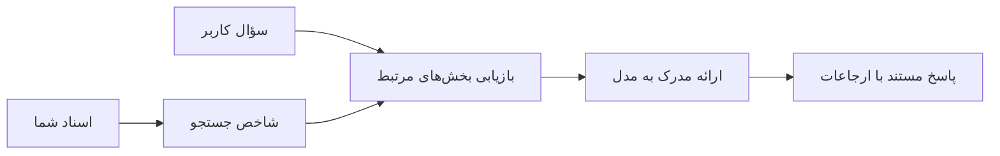

# آموزش هوش مصنوعی برای پاسخگویی به سوالات بر اساس اسناد شما:
## مجموعه ۱: RAG، آزور در مقابل جایگزین‌های متن‌باز، و زمان مناسب برای تنظیم دقیق

> اولین مقاله در یک سری ۲۰۲۶ که به آموزش‌های ۲۰۲۳ من درباره جستجوی هوش مصنوعی آزور + پرسش و پاسخ اسناد آزور OpenAI باز می‌گردد.

## ۱. مقدمه - بازبینی آموزش قبلی RAG

در سال ۲۰۲۳، روی دو آموزش درباره آموزش ChatGPT برای پاسخ به سوالات از اسناد PDF با استفاده از آزور AI Search و آزور OpenAI کار کردم. من نسخه [LangChain](https://techcommunity.microsoft.com/blog/educatordeveloperblog/teach-chatgpt-to-answer-questions-using-azure-ai-search--azure-openai-lang-chain/3969713) را نوشتم، و همچنین نسخه [Semantic Kernel](https://techcommunity.microsoft.com/blog/educatordeveloperblog/teach-chatgpt-to-answer-questions-using-azure-ai-search--azure-openai-semantic-k/3985395) همراه با [لی استات](https://developer.microsoft.com/en-us/advocates/lee-stott)، مدیر اصلی مدافع ابر در مایکروسافت، تألیف کردیم. آن زمان، ایده «ChatGPT روی داده‌های شما» هنوز برای بسیاری از توسعه‌دهندگان جدید بود. آموزش‌ها از Azure Blob Storage، آزور AI Search، آزور OpenAI، LangChain، Semantic Kernel و بازیابی برداری به سبک FAISS برای پاسخگویی به سوالات از فایل‌های PDF استفاده می‌کردند.

آن مقاله قبلی بر یک روند کاری ساده اما مهم تمرکز داشت: بارگذاری اسناد، فهرست‌گذاری آنها، بازیابی محتوای مرتبط، و پرسیدن سوال از یک مدل بر اساس آن محتوا.

در سال ۲۰۲۶، اکوسیستم RAG به طور قابل توجهی رشد کرده است. آزور AI Search اکنون الگوهای جدید برداری و بازیابی ترکیبی را پشتیبانی می‌کند، آزور OpenAI بخشی از اکوسیستم گسترده‌تر مدل‌های مایکروسافت Foundry است، و API جدید v1 می‌تواند بدون نیاز به تغییرات ماهانه `api-version` از مشتری استاندارد OpenAI استفاده کند. همزمان، گزینه‌های متن‌باز مانند LangGraph، LlamaIndex، Haystack، Qdrant، Milvus، Weaviate، Chroma، Ollama، و vLLM به گزینه‌های عملی برای سیستم‌های واقعی RAG تبدیل شده‌اند.

به همین دلیل است که می‌خواستم این موضوع را دوباره بررسی کنم. سوال دیگر فقط «چطور RAG را بسازم؟» نیست. حالا روش‌های زیادی برای ساخت آن وجود دارد، و سوال مهم‌تر این است که «کدام معماری را برای وضعیت خود انتخاب کنم؟»

اما مسئله اصلی تغییر نکرده است.

یک مدل هوش مصنوعی به طور خودکار اسناد شما را نمی‌داند. برای ساخت یک سیستم پرسش و پاسخ سندی مفید، شما هنوز به بازیابی قابل اعتماد، مبنا دادن، ارزیابی، و روندهای عملیاتی نیاز دارید.

این مقاله آموزش «گپ زدن با PDF» از ابتدا تا انتها نیست. من می‌خواهم این سری به‌روزرسانی شده را با سوالی شروع کنم که اکنون برایم مهم‌تر است: چه زمانی باید معماری مدیریت‌شده آزور را انتخاب کنید، چه زمانی باید یک پشته RAG متن‌باز انتخاب کنید، و چه زمانی تنظیم دقیق واقعاً معنا دارد؟

این اولین مقاله در یک سری درباره ساخت سیستم‌های هوش مصنوعی مبتنی بر سند است. در این بخش اول، روی تصمیمات معماری تمرکز خواهیم کرد: چرا RAG اهمیت دارد، چه زمانی خدمات مدیریت شده مبتنی بر آزور مفید است، چه زمانی جایگزین‌های متن‌باز منطقی هستند، و کجا تنظیم دقیق جای می‌گیرد.

بعد از ساخت و بازبینی سیستم‌های پرسش و پاسخ سندی، برایم مهم نیست کدام ابزار در یک نمایش بهتر است؛ بلکه بیشتر به معماری‌ای که با کاربران واقعی، اسناد تغییرپذیر، مجوزها، خطاها و نگهداری مقابله می‌کند علاقه‌مند شده‌ام.

## ۲. چرا هوش مصنوعی شما به یک سیستم جستجو نیاز دارد

مدل‌های زبانی بزرگ بر داده‌های عمومی و دارای مجوز گسترده آموزش دیده‌اند. آنها ممکن است اطلاعات زیادی درباره موضوعات عمومی داشته باشند، اما به طور خودکار PDFهای خصوصی شما، سیاست‌های داخلی، رویه‌های سازمانی، آرشیوهای تحقیقاتی، مواد آموزشی کلاس، یادداشت‌های پشتیبانی مشتری، یا مستندات تازه‌به‌روزرسانی شده را نمی‌دانند.

یک راه ساده برای فکر کردن به RAG این است: به جای اینکه انتظار داشته باشیم مدل همه اسناد را به خاطر بسپارد، یک سیستم جستجو به آن می‌دهیم. وقتی یک کاربر سوالی می‌پرسد، سیستم ابتدا مربوط‌ترین قطعات اطلاعات را پیدا می‌کند، سپس آن قطعات را به عنوان زمینه به مدل می‌دهد.

این اهمیت دارد چون منابع دانش واقعی اغلب خصوصی هستند، دائماً در حال تغییر، حساس به مجوزها، در سیستم‌های متعدد ذخیره شده، در قالب‌های مختلف نوشته شده، و خیلی بزرگ هستند که نتوان مستقیماً در یک prompt جا داد.

برای مثال، اگر یک مدرسه، شرکت، یا تیم تحقیقاتی ۱۰٬۰۰۰ سند داخلی داشته باشد، مدل نمی‌تواند به طور قابل اعتماد از آن اسناد پاسخ دهد مگر اینکه سیستم بخش‌های درست را در زمان درست بازیابی کند.

این به طور طبیعی یک سوال رایج ایجاد می‌کند:

چرا فقط مدل را تنظیم دقیق نکنیم؟

تنظیم دقیق می‌تواند مفید باشد، اما معمولاً ابزار اول درست برای دانش سندی نیست. اگر دانش اغلب تغییر می‌کند، اگر ارجاعات اهمیت دارند، یا دسترسی به منابع مهم است، معمولاً RAG نقطه شروع بهتری است. تنظیم دقیق بیشتر برای آموزش رفتار، سبک، قالب خروجی، و الگوهای کاربری مناسب‌تر است.

## ۳. معماری RAG در عمل

تصور کنید در حال ساخت دستیار هوش مصنوعی برای یک مدرسه هستید. این دستیار باید به سوالات از PDFهای سیاست‌ها، راهنماهای دوره، صفحات FAQ داخلی، و اعلامیه‌های به‌روزرسانی شده اخیر پاسخ دهد.

اگر دانش‌آموزی بپرسد: «آیا می‌توانم از هوش مصنوعی مولد برای پروژه نهایی استفاده کنم؟»، سیستم نباید فقط از حافظه عمومی مدل پاسخ دهد. ابتدا باید سیاست مربوط به مدرسه را پیدا کند، بخش مربوط به استفاده از هوش مصنوعی را بازیابی کند، سپس از مدل بخواهد با استفاده از آن شواهد جواب دهد.

این همان RAG در عمل است.

در سطح بالا، می‌توانید جریان را اینگونه تصور کنید:

  
جزییات می‌توانند پیشرفته‌تر شوند، ولی ایده پایه ساده است: مدل به تنهایی پاسخ نمی‌دهد. با استفاده از شواهد بازیابی شده پاسخ می‌دهد.

اول، اسناد از سیستم‌های ذخیره‌سازی مانند Azure Blob Storage، SharePoint، GitHub، یا CMS داخلی دریافت می‌شوند. سپس سیستم آنها را به متن تبدیل می‌کند در حالی که ساختار مفید مانند سرفصل‌ها، شماره صفحات، جداول، بخش‌ها و مکان منبع را حفظ می‌کند.

سپس محتوا به قطعات تقسیم می‌شود. این مرحله ساده به نظر می‌رسد، اما یکی از مهم‌ترین قسمت‌های سیستم است. اگر قطعه خیلی کوچک باشد، ممکن است زمینه پیرامونی را از دست بدهد. اگر قطعه خیلی بزرگ باشد، ممکن است اطلاعات نامربوط وارد شود و بازیابی کمتر دقیق شود.

پس از تقسیم بندی، سیستم embeddingها را ایجاد کرده و آنها را در یک شاخص قابل جستجو همراه با متن اصلی و فراداده‌ای مانند نام فایل، شماره صفحه، مجوزها، نسخه سند، و URL منبع ذخیره می‌کند.

وقتی کاربر سوالی می‌پرسد، سیستم قطعات نامزد را با استفاده از جستجوی کلمه کلیدی، جستجوی برداری یا جستجوی ترکیبی بازیابی می‌کند. سپس یک reranker می‌تواند آن قطعات را به گونه‌ای مرتب کند که مفیدترین شواهد در بالاترین رتبه قرار بگیرند.

در نهایت، مدل سوال و شواهد بازیابی شده را دریافت می‌کند. پاسخ باید بر اساس آن شواهد مبنا داشته باشد و ارجاعات بازگرداند تا کاربر بتواند منبع را بررسی کند.

نکته مهم این است که RAG فقط «قرار دادن PDFها در یک پایگاه داده برداری» نیست. کیفیت پاسخ به کل روند بستگی دارد: تبدیل به متن، تقسیم بندی، بازیابی، رتبه‌بندی مجدد، prompt دادن، ارجاع‌دهی، و ارزیابی.

به همین دلیل ساختار سند اهمیت دارد. در PDF، یک سرفصل، جدول، پانویس، یا مرز صفحه می‌تواند معنی یک بخش را تغییر دهد. در آزور، مهارت Document Layout از توانایی‌های layout آزور Document Intelligence برای تولید خروجی آگاه به ساختار استفاده می‌کند که می‌تواند کیفیت تقسیم بندی و بازیابی در سیستم‌های RAG را بهبود بخشد.

## ۴. چه چیزهایی از ۲۰۲۳ تغییر کرده‌اند؟

آموزش ۲۰۲۳ نقطه شروع خوبی برای زمان خود بود:

- Azure Blob Storage فایل‌های PDF را ذخیره می‌کرد.
- Azure AI Search محتوا را ایندکس می‌کرد.
- LangChain بازیابی را به آزور OpenAI متصل می‌کرد.
- FAISS به عنوان یک پایگاه داده برداری ساده محلی عمل می‌کرد.
- مثال از `gpt-35-turbo` و `text-embedding-ada-002` استفاده می‌کرد.

در سال ۲۰۲۶، نسخه مدرن باید چند تغییر را منعکس کند.

اول، بازیابی بالغ‌تر شده است. در ۲۰۲۳، بسیاری از دموی‌ها از جستجوی شباهت برداری ساده استفاده می‌کردند. امروزه بازیابی ترکیبی اغلب نقطه شروع پیش‌فرض برای QA سندی جدی است. آزور AI Search جستجوی ترکیبی را با ترکیب کوئری‌های کلمه کلیدی و برداری در یک درخواست پشتیبانی می‌کند و نتایج را با با ادغام رتبه متقابل (Reciprocal Rank Fusion) ترکیب می‌کند. Semantic ranker سپس می‌تواند متن سمت جستجوی تمام متن، برداری و ترکیبی را رتبه‌بندی مجدد کند.

دوم، گرفتن داده‌ها پیچیده‌تر شده است. به جای تقسیم دستی هر سند با کد برنامه، آزور AI Search از یکپارچگی برداری برای تقسیم بندی، embedding، و بردارسازی هنگام اجرا پشتیبانی می‌کند. برای PDFها و بارکاری سنگین سند، اسکیل Document Layout می‌تواند ساختار بیشتری نسبت به قطعات با اندازه ثابت حفظ کند.

سوم، هماهنگی (ارکستریشن) مهم‌تر شده است. بخش سخت اغلب خود تماس API مدل بزرگ نیست. بخش سخت مدیریت خطاها، تلاش‌های مجدد، بازیابی کهنه، کیفیت قطعات، روندهای بلندمدت، بازبینی انسانی، و ارزیابی در مقیاس است. در اینجا ابزارهای مبتنی بر جریان کاری مثل LangGraph، روندهای کاری LlamaIndex، خطوط لوله Haystack، و ابزارهای ارزیابی و رصد در سطح پلتفرم اهمیت بیشتری نسبت به یک زنجیره خطی منفرد پیدا می‌کنند.

چهارم، ارزیابی دیگر اختیاری نیست. یک دمو با یک سوال می‌تواند برجسته به نظر برسد. یک سیستم تولیدی به مجموعه‌های آزمایشی، چک‌های رگرسیون، معیارهای بازیابی، چک‌های مبنا داشتن، و پایش نیاز دارد. بدون ارزیابی، سخت است بدانیم سیستم در حال بهبود است یا فقط در حال تغییر.

## ۵. انتخاب بین پشته‌های RAG آزور و متن‌باز

من فکر نمی‌کنم سوال مفید این باشد که «آیا آزور بهتر از متن‌باز است؟» یا «آیا متن‌باز بهتر از آزور است؟»

سوال مفید این است: شما چه نوع سیستمی می‌سازید، چه کسی آن را اداره می‌کند، محدودیت‌های شما چیست، و کدام حالت‌های خطا غیرقابل قبول هستند؟

وقتی شروع به ساخت نمونه‌های QA سندی کردم، عمدتاً به اینکه آیا بازیابی کار می‌کند فکر می‌کردم. آیا می‌توانم PDFها را بارگذاری کنم، جستجو کنم، و جواب تولید کنم؟ این یک نقطه شروع معقول بود.

بعد از کار روی روندهای کاری واقع‌بینانه‌تر AI، ارزیابی‌ام تغییر کرد. اکنون قبل از انتخاب پشته RAG به چهار چیز نگاه می‌کنم:

- هویت و مجوزها
- کیفیت بازیابی
- قابلیت اطمینان جریان کاری
- مالکیت عملیاتی

این چهار حوزه خیلی بیشتر از فقط یک معیار مدل به شما می‌گوید.

معماری‌های مبتنی بر آزور معمولاً وقتی معنا دارند که یکپارچگی سازمانی سخت باشد. اگر تیم از Microsoft Entra ID، Microsoft 365، ذخیره‌سازی آزور، شبکه خصوصی، RBAC، و رصد آزور استفاده کند، Azure AI Search و Azure OpenAI می‌توانند پیچیدگی عملیاتی را کاهش دهند. در این محیط، آزور فقط یک API مدل نیست. ارزش سیستم پیرامونی است: هویت، حاکمیت، جستجوی مدیریت شده، یکپارچگی امنیتی، پشتیبانی، و عملیات آشنا.

معماری‌های متن‌باز معمولاً وقتی معنا دارند که انعطاف‌پذیری سخت باشد. اگر تیم به استنتاج محلی، قابلیت حمل ابر، خط لوله بازیابی سفارشی، رتبه‌بندی مجدد تخصصی یا کنترل مستقیم روی پایگاه داده برداری و لایه سرویس‌دهی مدل نیاز دارد، پشته متن‌باز ممکن است مناسب‌تر باشد. در مقابل، تیم مسئولیت کارهای قابل اطمینان‌سازی بیشتری از جمله پشتیبان‌گیری، مقیاس‌بندی، تأخیر، مهاجرت‌ها، نظارت، و امنیت را بر عهده دارد.

در عمل، بسیاری از سیستم‌های AI تولیدی به طور خالص ابری بومی یا خالص متن‌باز نیستند. آنها اغلب سیستم‌های ترکیبی هستند که سادگی عملیاتی، قابلیت حمل، حاکمیت و انعطاف مهندسی را متعادل می‌کنند.

برای مثال، تعجب نمی‌کنم سیستمی را ببینم که از آزور OpenAI برای دسترسی به مدل، LangGraph برای هماهنگی جریان کاری، میزبانی آزور برای استقرار، و یک پایگاه داده برداری متن‌باز برای یک نیاز بازیابی خاص استفاده کند. این ناسازگاری معماری نیست. این انتخاب سطح مناسب خدمات مدیریت‌شده و کنترل مهندسی برای هر بخش سیستم است.

من معماری‌های ترکیبی را دوست دارم وقتی پلتفرم مدیریت‌شده مشکلات مهم سازمانی را حل می‌کند، در حالی که مولفه‌های متن‌باز به تیم انعطاف‌پذیری آنجا که واقعا اهمیت دارد می‌دهد.

## ۶. راهنمای تصمیم‌گیری عملی

این جدول تصمیم‌گیری است که من با یک تیم قبل از انتخاب پشته RAG استفاده می‌کنم:

| حوزه تصمیم‌گیری | پشته مدیریت‌شده آزور قوی‌تر است وقتی... | پشته متن‌باز قوی‌تر است وقتی... |
| --- | --- | --- |
| هویت و دسترسی | Entra ID، RBAC، هویت مدیریت شده، و مجوزهای سازمانی مرکزی هستند | احراز هویت سفارشی، هویت غیر مایکروسافتی، یا منطق دسترسی خاص برنامه غالب است |
| عملیات | تیم زیرساخت مدیریت شده، پشتیبانی، SLAها، و راه‌اندازی ساده‌تر می‌خواهد | تیم می‌تواند پایگاه داده برداری، سرویس‌دهی مدل، پشتیبان‌گیری، و مقیاس را اداره کند |
| بازیابی | جستجوی ترکیبی، رتبه‌بندی معنایی، فیلترها، و جستجوی فراداده اکثر نیازها را پوشش می‌دهد | تیم به بازیابی سفارشی، رتبه‌بندی مجدد تخصصی، یا ایندکسینگ آزمایشی نیاز دارد |
| قابلیت حمل | همسویی یا ترجیح با اکوسیستم آزور قابل قبول است | اجتناب از قفل شدن ابری یک نیاز اساسی است |
| استنتاج | حاکمیت، شبکه‌بندی، و کنترل‌های سازمانی آزور OpenAI اهمیت دارد | استنتاج محلی، مدل‌های سفارشی، یا سرویس‌دهی خودمیزبانی شده لازم است |
| هزینه | کاهش تلاش مهندسی و عملیات مهم‌تر از تنظیم زیرساخت است | مقیاس آنقدر بزرگ است که به بهینه‌سازی دقیق زیرساخت نیاز دارد |
| آزمایش | پایداری و یکپارچگی سازمانی بیشتر از تغییر مکرر مولفه‌ها اهمیت دارد | تیم به سرعت روی عوامل، ابزارها، حافظه، و روندهای بازیابی تکرار می‌کند |

قاعده سرانگشتی من ساده است:

- وقتی یکپارچگی سازمانی، امنیت، و سادگی عملیاتی ریسک‌های اصلی هستند، با آزور شروع کنید.
- وقتی قابلیت حمل، سفارشی‌سازی، یا کنترل محلی ریسک‌های اصلی هستند، با متن‌باز شروع کنید.
- وقتی هر دو صادق است، از یک پشته ترکیبی استفاده کنید.

به همین دلیل است که من یک سری RAG در ۲۰۲۶ را با کدنویسی شروع نمی‌کنم. کد مهم است، اما انتخاب معماری قبل از پیاده‌سازی می‌آید. یک دمو ساده می‌تواند سخت‌ترین انتخاب‌ها را پنهان کند. یک سیستم خوب RAG آن انتخاب‌ها را واضح می‌کند.

## ۷. جایگاه تنظیم دقیق

تنظیم دقیق اغلب همراه با RAG ذکر می‌شود، اما فکر می‌کنم مهم است که این دو را جدا کنیم.

RAG معمولاً انتخاب بهتر است وقتی سیستم به دانش تازه، خصوصی، حساس به مجوز، یا دارای مبنای منبع نیاز دارد. اگر پاسخ باید سندها را ارجاع دهد، بازتاب به‌روزرسانی‌های اخیر باشد، یا به قوانین دسترسی خاص کاربر احترام بگذارد، بازیابی باید بخشی از معماری باشد.

تنظیم دقیق زمانی مفیدتر است که دانش مشکل اصلی نباشد. می‌تواند کمک کند وقتی می‌خواهید مدل قالب خروجی خاصی را دنبال کند، سبک پاسخ دامنه خاصی داشته باشد، یک کار پایدار را با ثبات بیشتری انجام دهد، یا مقدار دستورالعمل لازم در هر prompt را کاهش دهد.
در عمل، این دو می‌توانند با هم کار کنند. یک دستیار پشتیبانی ممکن است از RAG برای بازیابی جدیدترین سیاست‌ها استفاده کند، در حالی که یک مدل‌ ریزتنظیم شده ساختار و لحن پاسخ مورد علاقه شرکت را یاد می‌گیرد.

اشتباه این است که ریزتنظیم را جایگزینی برای یک مخزن مدارک در نظر بگیریم. این کار نیاز به بازیابی زمانی که سیستم باید از داده‌های تازه، خصوصی یا حساس به مجوز پاسخ دهد، از بین نمی‌برد.

## ۸. گام بعدی این سری

این مقاله لایه تصمیم‌گیری است. قبل از نوشتن کد، می‌خواستم مصالحه‌ها را صریح کنم: RAG در مقابل ریزتنظیم، Azure در مقابل منبع باز، خدمات مدیریت شده در مقابل کنترل عملیاتی.

قبل از ورود به پیاده‌سازی، می‌خواهم یک نکته را اینجا بگذارم: در بسیاری از سیستم‌های هوش مصنوعی سازمانی، مدل فقط یک مؤلفه است. کیفیت بازیابی، هماهنگ‌سازی، ارزیابی، مجوزها و قابلیت اطمینان عملیاتی اغلب تعیین می‌کنند که آیا سیستم فراتر از مرحله دموی اولیه موفق است یا نه.

در بخش‌های بعدی این سری، قصد دارم عمیق‌تر به جنبه عملی سیستم‌های هوش مصنوعی مبتنی بر مدارک بپردازم: چگونه معماری مبتنی بر Azure بسازیم، چگونه جایگزین‌های متن باز در عمل مقایسه می‌شوند، و چگونه ارزیابی کنیم که آیا سیستم RAG واقعاً کار می‌کند یا نه.

ممکن است ترتیب مطالب را با پیشرفت سری تغییر دهم، اما هدف همان خواهد بود: گذر از یک دموی ساده و نشان دادن نحوه تفکر درباره سیستم‌های RAG که قابل نگهداری، ارزیابی و بهره‌برداری باشند.

## ۹. منابع و مراجعات

آموزش‌های اصلی:

- [آموزش به ChatGPT برای پاسخ دادن به سؤالات: استفاده از Azure AI Search و Azure OpenAI (Lang Chain)](https://techcommunity.microsoft.com/blog/educatordeveloperblog/teach-chatgpt-to-answer-questions-using-azure-ai-search--azure-openai-lang-chain/3969713)
- [آموزش به ChatGPT برای پاسخ دادن به سؤالات: استفاده از Azure AI Search و Azure OpenAI (Semantic Kernel)](https://techcommunity.microsoft.com/blog/educatordeveloperblog/teach-chatgpt-to-answer-questions-using-azure-ai-search--azure-openai-semantic-k/3985395)

Azure:

- [نسخه‌های REST API جستجوی Azure AI](https://learn.microsoft.com/en-us/rest/api/searchservice/search-service-api-versions)
- [جستجوی ترکیبی در Azure AI Search](https://learn.microsoft.com/en-us/azure/search/hybrid-search-how-to-query)
- [یکپارچه‌سازی برداری در Azure AI Search](https://learn.microsoft.com/en-us/azure/search/vector-search-integrated-vectorization)
- [مهارت چیدمان اسناد در Azure AI Search](https://learn.microsoft.com/en-us/azure/search/cognitive-search-skill-document-intelligence-layout)
- [تقسیم و بردارسازی بر اساس چیدمان سند](https://learn.microsoft.com/en-us/azure/search/search-how-to-semantic-chunking)
- [رتبه‌بندی معنایی در Azure AI Search](https://learn.microsoft.com/en-us/azure/search/semantic-search-overview)
- [چرخه عمر نسخه API در Azure OpenAI / Microsoft Foundry](https://learn.microsoft.com/en-us/azure/foundry/openai/api-version-lifecycle)
- [مدل‌های Foundry که توسط Azure ارائه می‌شوند](https://learn.microsoft.com/en-us/azure/foundry/foundry-models/concepts/models-sold-directly-by-azure)
- [ملاحظات ریزتنظیم در Microsoft Foundry](https://learn.microsoft.com/en-us/azure/foundry/openai/concepts/fine-tuning-considerations)
- [قابلیت رصد در Microsoft Foundry](https://learn.microsoft.com/en-us/azure/foundry/concepts/observability)
- [اجرای ارزیابی‌ها در Microsoft Foundry](https://learn.microsoft.com/en-us/azure/foundry/how-to/evaluate-generative-ai-app)

متن باز:

- [مستندات LangGraph](https://docs.langchain.com/oss/python/langgraph/overview)
- [مستندات LlamaIndex](https://developers.llamaindex.ai/python/framework/)
- [مستندات Haystack](https://docs.haystack.deepset.ai/)
- [مستندات Qdrant](https://qdrant.tech/documentation/overview/)
- [مستندات Milvus](https://milvus.io/docs/overview.md)
- [مستندات Weaviate](https://docs.weaviate.io/weaviate/current/)
- [مستندات Chroma](https://docs.trychroma.com/docs/overview/introduction)
- [نمایه‌های Ollama](https://docs.ollama.com/capabilities/embeddings)
- [سرور سازگار با OpenAI در vLLM](https://docs.vllm.ai/en/latest/serving/openai_compatible_server.html)
- [مدل‌های نمایه BGE](https://huggingface.co/BAAI/bge-large-en-v1.5)
- [مدل‌های نمایه E5](https://huggingface.co/intfloat/e5-large-v2)
- [مدل‌های نمایه Instructor](https://huggingface.co/hkunlp/instructor-large)

---

<!-- CO-OP TRANSLATOR DISCLAIMER START -->
**سلب مسئولیت**:
این سند با استفاده از سرویس ترجمه هوش مصنوعی [Co-op Translator](https://github.com/Azure/co-op-translator) ترجمه شده است. در حالی که ما در تلاش برای دقت هستیم، لطفاً توجه داشته باشید که ترجمه‌های خودکار ممکن است شامل خطاها یا نادرستی‌هایی باشند. سند اصلی به زبان مادری خود باید به عنوان منبع معتبر در نظر گرفته شود. برای اطلاعات حیاتی، ترجمه حرفه‌ای انسانی توصیه می‌شود. ما در قبال هرگونه سوء تفاهم یا برداشت نادرست ناشی از استفاده از این ترجمه مسئولیتی نداریم.
<!-- CO-OP TRANSLATOR DISCLAIMER END -->