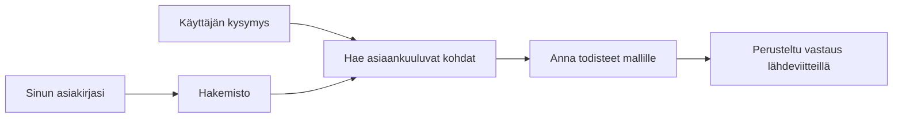

# Opeta tekoälyä vastaamaan kysymyksiin dokumenttiesi perusteella:
## Sarja 1: RAG, Azure vs avoimen lähdekoodin vaihtoehdot ja milloin hienosäätö on järkevää

> Ensimmäinen artikkeli vuonna 2026 ilmestyvässä sarjassa, joka käy läpi uudelleen vuonna 2023 julkaistut Azure AI Search + Azure OpenAI dokumenttipohjaiset Q&A -oppaat.

Sarjan navigointi: [Arkiston etusivu](../README.md) | Seuraava: [Sarja 2 - Rakenna paikallinen avoimen lähdekoodin RAG-järjestelmä alusta loppuun](./series-2-open-source-rag-end-to-end.md)

## 1. Johdanto – Paluu aiempaan RAG-oppaaseen

Vuonna 2023 tein pari opasta, joissa opetettiin ChatGPT:tä vastaamaan kysymyksiin PDF-documenteista käyttäen Azure AI Searchia ja Azure OpenAI:ta. Kirjoitin [LangChain-version](https://techcommunity.microsoft.com/blog/educatordeveloperblog/teach-chatgpt-to-answer-questions-using-azure-ai-search--azure-openai-lang-chain/3969713) ja työskentelin myös yhdessä [Lee Stottin](https://developer.microsoft.com/en-us/advocates/lee-stott) kanssa, Microsoftin Principal Cloud Advocate Managerin kanssa, kumppanina kirjoitetussa [Semantic Kernel -versiossa](https://techcommunity.microsoft.com/blog/educatordeveloperblog/teach-chatgpt-to-answer-questions-using-azure-ai-search--azure-openai-semantic-k/3985395). Tuolloin ajatus "ChatGPT omalla datallasi" oli monelle kehittäjälle vielä uusi. Oppaissa käytettiin Azure Blob Storagea, Azure AI Searchia, Azure OpenAI:ta, LangChainia, Semantic Kernelia ja FAISS-tyylistä vektorihausta vastauksien etsimiseen PDF-tiedostoista.

Tuo aiempi artikkeli keskittyi yksinkertaiseen, mutta tärkeään työnkulkuun: lataa dokumentit, tee niistä indeksi, hae relevanttia sisältöä ja pyydä mallia vastaamaan sisältöön perustuen.

Vuonna 2026 RAG-ekosysteemi on kasvanut huomattavasti. Azure AI Search tukee nykyisin moderneja vektori- ja hybridihakumalleja, Azure OpenAI on osa laajempaa Microsoft Foundry Models -ekosysteemiä, ja uudempi v1-API käyttää vakiona OpenAI-asiakasohjelmaa ilman kuukausittaisia `api-version`-muutoksia. Samalla avoimen lähdekoodin vaihtoehdot kuten LangGraph, LlamaIndex, Haystack, Qdrant, Milvus, Weaviate, Chroma, Ollama ja vLLM ovat tulleet käytännöllisiksi vaihtoehdoiksi oikeille RAG-järjestelmille.

Siksi haluan palata tähän aiheeseen. Kysymys ei ole enää pelkästään "Miten rakennan RAG:n?" Nyt on monia tapoja rakentaa se, ja tärkeämpi kysymys on: "Minkä arkkitehtuurin valitsen tilanteeseeni?"

Mutta ydinkysymys ei ole muuttunut.

Tekoälymalli ei automaattisesti tunne dokumenttejasi. Rakentaaksesi hyödyllisen dokumenttipohjaisen kysymys-vastausjärjestelmän tarvitset edelleen luotettavan haun, perustelun, arvioinnin ja operatiiviset työnkulut.

Tämä artikkeli ei ole uusi end-to-end "chat PDF:n kanssa" -opas. Haluan aloittaa tämän päivittyneen sarjan kysymyksellä, joka kiinnostaa minua nyt enemmän: milloin kannattaa valita hallinnoitu Azure-arkkitehtuuri, milloin avoimen lähdekoodin RAG-pino ja milloin hienosäätö todella kannattaa?

Tämä on sarjan ensimmäinen artikkeli dokumenttipohjaisten tekoälyjärjestelmien rakentamisesta. Tässä osassa keskitymme arkkitehtuurivalintoihin: miksi RAGilla on merkitystä, milloin Azure-pohjaiset hallinnoidut palvelut ovat hyödyllisiä, milloin avoimen lähdekoodin vaihtoehdot ovat järkeviä ja missä hienosäätö sijoittuu kokonaisuuteen.

Rakentaessani ja kertaillessani dokumenttipohjaisia Q&A-järjestelmiä olen tullut vähemmän kiinnostuneeksi siitä, mikä työkalu näyttää parhaalta demossa ja enemmän siitä, mikä arkkitehtuuri kestää oikeiden käyttäjien, muuttuvien dokumenttien, käyttöoikeuksien, vikojen ja ylläpidon haasteet.

## 2. Miksi tekoälysi tarvitsee hakujärjestelmän

Suuret kielimallit on koulutettu laajalla julkisella ja lisensoidulla datalla. Ne saattavat tietää paljon yleisistä aiheista, mutta ne eivät automaattisesti tunne yksityisiä PDF-tiedostojasi, sisäisiä käytäntöjäsi, yrityksen prosesseja, tutkimusarkistoja, luokkahuoneen materiaaleja, asiakastukimuistiinpanoja tai äskettäin päivitettyjä dokumentteja.

Yksinkertainen tapa ajatella RAGia on: sen sijaan että mallilta odotettaisiin jokaisen dokumentin muistamista, annamme sille hakujärjestelmän. Kun käyttäjä esittää kysymyksen, järjestelmä ensin löytää asiaankuuluvat tietokohdat ja antaa ne mallille kontekstiksi.

Tällä on merkitystä, koska monet tosielämän tietolähteet ovat yksityisiä, jatkuvasti muuttuvia, käyttöoikeusrajoituksin suojattuja, hajautettuja useisiin järjestelmiin, kirjoitettu monissa muodoissa ja liian suuria liitettäväksi suoraan kehotteeseen.

Esimerkiksi jos koululla, yrityksellä tai tutkimustiimillä on 10 000 sisäistä dokumenttia, malli ei voi vastata niistä luotettavasti, ellei järjestelmä hae oikeita osia oikeaan aikaan.

Tämä johtaa luonnollisesti yleiseen kysymykseen:

Miksi ei vain hienosäädetä mallia?

Hienosäätö voi olla hyödyllistä, mutta se ei yleensä ole oikea ensimmäinen työkalu dokumenttitiedon hallintaan. Jos tieto muuttuu usein, linkitykset ovat tärkeitä tai käyttöoikeudet ovat ratkaisevia, RAG on yleensä parempi lähtökohta. Hienosäätö sopii paremmin käyttäytymisen, tyylin, tulostusmuodon ja tehtäväkuviomallien opettamiseen.

## 3. RAG-arkkitehtuuri käytännössä

Kuvittele, että rakennat tekoälyavustajaa koululle. Avustajan pitää vastata kysymyksiin politiikkadokumenteista PDF-muodossa, kurssiohjeista, sisäisistä FAQ-sivuilta ja äskettäin päivitetystä ilmoituksesta.

Jos opiskelija kysyy: "Voinko käyttää generatiivista tekoälyä lopputyössäni?", järjestelmän ei pitäisi vastata mallin yleisen muistin perusteella. Sen pitäisi ensin löytää relevantti koulun politiikka, hakea osio tekoälyn käytöstä ja sitten pyytää mallia vastaamaan näiden todisteiden pohjalta.

Tämä on RAG käytännössä.

Karkealla tasolla työnkulku on seuraavanlainen:

Yksityiskohdat voivat olla monimutkaisempia, mutta perusajatus on yksinkertainen: malli ei vastaa yksin. Se vastaa haetun todisteen avulla.

Ensiksi dokumentit otetaan talteen tallennusjärjestelmistä kuten Azure Blob Storage, SharePoint, GitHub tai sisäinen CMS. Sen jälkeen järjestelmä jäsentää ne tekstiksi säilyttäen hyödylliset rakenteet kuten otsikot, sivunumerot, taulukot, osiot ja lähdelaskut.

Seuraavaksi sisältö pilkotaan osiin. Tämä kuulostaa yksinkertaiselta, mutta on yksi tärkeimmistä vaiheista. Jos pala on liian pieni, se voi menettää ympäröivän kontekstin. Jos pala on liian suuri, siinä voi olla epäolennaista tietoa ja haku ei ole yhtä tarkkaa.

Pilkoksen jälkeen järjestelmä luo upotukset (embeddings) ja tallentaa ne haettavassa indeksissä yhdessä alkuperäisen tekstin ja metadatan kuten tiedostonimi, sivunumero, käyttöoikeudet, dokumentin versio ja lähde-URL:n kanssa.

Kun käyttäjä esittää kysymyksen, järjestelmä hakee ehdokaspaloja avainsanahakua, vektorihakua tai hybridihakua käyttäen. Uudelleenjärjestäjä voi tämän jälkeen järjestää palat uudestaan niin, että hyödyllisimmät todisteet ovat ylimpänä.

Lopuksi malli saa sekä kysymyksen että haetut todisteet. Vastaus tulisi perustua todisteisiin ja sisältää viitteet, jotta käyttäjä voi tarkistaa lähteen.

Tärkeää on ymmärtää, että RAG ei ole vain "laita PDF:t vektoridataan". Vastauksen laatu riippuu koko työnkulusta: jäsentämisestä, pilkkomisesta, hausta, uudelleenjärjestelystä, kehotteiden rakentamisesta, viittauksista ja arvioinnista.

Siksi dokumentin rakenne on tärkeä. PDF:ssä otsikko, taulukko, alatunniste tai sivun raja voi muuttaa tekstikohtauksen merkitystä. Azuren Document Layout -toiminto käyttää Azure Document Intelligence -asettelutyökaluja tuottaakseen rakenteen ymmärtävän ulostulon, mikä voi parantaa pilkkomisen ja haun laatua RAG-järjestelmissä.

## 4. Mikä on muuttunut vuodesta 2023?

Vuoden 2023 opas oli aikansa hyvä lähtökohta:

- Azure Blob Storage tallensi PDF-tiedostot.
- Azure AI Search indeksoi sisällön.
- LangChain yhdisti haun Azure OpenAI:hin.
- FAISS toimi yksinkertaisena paikallisena vektorivarastona.
- Esimerkissä käytettiin `gpt-35-turbo` ja `text-embedding-ada-002`.

Vuonna 2026 moderni versio ottaa huomioon useita muutoksia.

Ensinnäkin haku on kehittynyt. Vuonna 2023 monet demot käyttivät yksinkertaista vektoripohjaista samankaltaisuushakua. Nykyään hybridihaku on usein vakiona vakavissa dokumenttien QA-järjestelmissä. Azure AI Search tukee hybridihakua yhdistämällä avainsana- ja vektorikyselyt yhteen pyyntöön ja yhdistämällä tulokset Reciprocal Rank Fusion -menetelmällä. Semanttinen järjestäjä voi tämän jälkeen uudelleenjärjestää täysiteksti-, vektori- ja hybriditulokset.

Toiseksi tiedonkeruu on nyt kehittyneempää. Manuaalisen jakamisen sijaan jokaiselle dokumentille Azure AI Search tukee integroitua vektorointia pilkkomiseen, upotuksiin ja kyselyaikaiseen vektorointiin. PDF:tä ja dokumenttipitoisia työkuormia varten Document Layout -toiminto säilyttää enemmän rakennetta kuin kiinteän kokoiset palaset.

Kolmanneksi orkestrointi on tärkeämpää. Vaikea kohta ei usein ole LLM-APIn kutsu sinänsä. Vaikeaa on käsitellä vikoja, uudelleenkokeiluja, vanhentunutta hakua, palasten laatua, pitkään kestäviä työnkulkuja, ihmisen tarkistuksia ja mittakaavassa tapahtuvaa arviointia. Tässä kohtaa työnkulkuun keskittyvät työkalut, kuten LangGraph, LlamaIndex-työnkulut, Haystack-putket sekä alustan tason arviointi- ja seuranta työkalut ovat tärkeämpiä kuin yksittäinen lineaarinen ketju.

Neljänneksi arviointi ei ole enää vapaaehtoista. Demo voi vaikuttaa vakuuttavalta yhdellä kysymyksellä. Tuotantojärjestelmä tarvitsee testiaineistot, regressiotarkistukset, hakumetriikat, totuuspohjaisuuden tarkistukset ja monitoroinnin. Ilman arviointia on vaikea tietää, kehittyykö järjestelmä vai muuttuko se vain.

## 5. Valinta Azure- ja avoimen lähdekoodin RAG-pinojen välillä

En usko, että hyödyllisin kysymys on "Onko Azure parempi kuin avoin lähdekoodi?" tai "Onko avoin lähdekoodi parempi kuin Azure?"

Hyödyllinen kysymys on: millaisen järjestelmän rakennat, kuka sitä operoi, millaisia rajoitteita sinulla on ja mitkä vikatilanteet ovat mahdottomia?

Kun aloitin dokumenttipohjaisten QA-esimerkkien rakentamisen, ajattelin enimmäkseen, toimiiko haku. Voinko ladata PDF:t, hakea niistä ja generoida vastauksen? Se oli kohtuullinen lähtökohta.

Kokemuksen karttuessa arviointini muuttui. Tarkastelen nyt neljää aluetta ennen RAG-pinoa valitessani:

- identiteetti ja käyttöoikeudet
- haun laatu
- työnkulkujen luotettavuus
- operatiivinen omistus

Nämä neljä aluetta kertovat enemmän kuin pelkkä mallin suorituskykyvertailu.

Azure-pohjaiset arkkitehtuurit ovat yleensä järkeviä, kun yritysintegraatio on vaikeaa. Jos tiimi on jo riippuvainen Microsoft Entra ID:stä, Microsoft 365:stä, Azure Storagesta, yksityisverkoista, RBACista ja Azuren monitoroinnista, Azure AI Search ja Azure OpenAI voivat vähentää paljon operatiivista monimutkaisuutta. Tässä ympäristössä Azure ei ole pelkkä mallin API. Arvo on ympäröivässä järjestelmässä: identiteetti, hallinta, hallittu haku, turvallisuusintegraatio, tuki ja tutut operoinnit.

Avoimen lähdekoodin arkkitehtuurit ovat yleensä järkeviä, kun joustavuus on vaikeaa. Jos tiimi tarvitsee paikallista inferenssiä, pilvisiirrettävyyttä, räätälöityä hakuputkea, erikoistunutta uudelleenjärjestelyä tai suoraa kontrollia vektoripankin ja mallin palvelevan kerroksen yli, avoimen lähdekoodin pino voi olla parempi valinta. Kauppahintana on se, että tiimi vastaa enemmän luotettavuudesta: varmuuskopiot, skaalaus, viiveet, migraatiot, monitorointi ja turvallisuus.

Käytännössä monet tuotannon tekoälyjärjestelmät eivät ole täysin pilvipohjaisia tai täysin avoimen lähdekoodin. Ne ovat usein hybridejä järjestelmiä, jotka tasapainottavat operatiivista yksinkertaisuutta, siirrettävyyttä, hallintaa ja insinöörien joustavuutta.

Esimerkiksi en yllättyisi, jos näkisinkin järjestelmän käyttävän Azure OpenAI:tä mallin käyttämiseen, LangGraphia työnkulun orkestrointiin, Azurea isäntäympäristönä ja avoimen lähdekoodin vektoripankkia tiettyyn hakuvaatimukseen. Tämä ei ole arkkitehtuurinen epäjohdonmukaisuus. Tämä on oikean hallinnoidun palvelutason ja insinöörikonrollin valintaa jokaiselle järjestelmän osalle.

Pidän hybrideistä arkkitehtuureista silloin, kun hallittu alusta ratkaisee tärkeitä yritysongelmia ja avoimen lähdekoodin komponentit antavat tiimille joustavuutta siellä, missä se todella ratkaisee.

## 6. Käytännön päätöstaulukko

Tässä päätöstaulukko, jota käyttäisin tiimin kanssa ennen RAG-pinon valintaa:

| Päätösalue | Azure hallinnoitu pino on vahvempi, kun... | Avoimen lähdekoodin pino on vahvempi, kun... |
| --- | --- | --- |
| Identiteetti ja pääsy | Entra ID, RBAC, hallittu identiteetti ja yrityksen käyttöoikeudet ovat keskeisiä | mukautettu tunnistus, ei-Microsoftin identiteetti tai sovelluskohtainen pääsylokiikka dominoivat |
| Operoinnit | tiimi haluaa hallitun infrastruktuurin, tuen, SLA:t ja helpomman käyttöönoton | tiimi osaa operoida vektoripankkeja, mallipalveluita, varmuuskopioita ja skaalauksen |
| Haku | hybridihaku, semanttinen järjestys, suodattimet ja metadatan haku kattavat suurimman osan tarpeista | tiimi tarvitsee räätälöityä hakua, erikoistunutta uudelleenjärjestelyä tai kokeellista indeksointia |
| Siirrettävyys | Azure-ekosysteemiin integroituminen on hyväksyttävää tai toivottavaa | pilvilukkojen välttäminen on ehdoton vaatimus |
| Inferenssi | Azure OpenAI:n hallinta, verkottuminen ja yrityksen kontrollit ovat tärkeitä | paikallinen inferenssi, räätälöidyt mallit tai itseisännöity palvelu tarvitaan |
| Kustannukset | insinöörityön ja operointipanostuksen vähentäminen on tärkeämpää kuin infran viritys | mittakaava on tarpeeksi suuri oikeuttaakseen huolellisen infrastruktuurin optimoinnin |
| Kokeilut | vakaus ja yritysintegratio ovat tärkeämpiä kuin komponenttien usein vaihtaminen | tiimi tekee nopeaa iterointia agenttien, työkalujen, muistin ja haun työnkulkujen parissa |

Nyrkkisääntöni on yksinkertainen:

- Aloita Azuren avulla, kun yritysintegraatio, turvallisuus ja operatiivinen yksinkertaisuus ovat tärkeimmät riskit.
- Aloita avoimen lähdekoodin avulla, kun siirrettävyys, räätälöinti tai paikallinen kontrolli ovat tärkeimmät riskit.
- Käytä hybridiä pinoa, kun molemmat pätevät.

Siksi en myöskään aloittaisi vuoden 2026 RAG-sarjaa ensin koodista. Koodi on tärkeää, mutta arkkitehtuurin valinta tapahtuu ennen toteutusta. Yksinkertainen demo voi piilottaa vaikeimmat valinnat. Hyvä RAG-järjestelmä tekee ne valinnat eksplisiittisiksi.

## 7. Missä hienosäätö sijoittuu

Hienosäätö mainitaan usein yhdessä RAGin kanssa, mutta mielestäni on tärkeää erottaa nämä kaksi.

RAG on yleensä parempi valinta, kun järjestelmä tarvitsee tuoretta, yksityistä, käyttöoikeuksiin sidottua tai lähdepohjaista tietoa. Jos vastauksen tulisi viitata dokumentteihin, heijastaa viimeisimpiä päivityksiä tai noudattaa käyttäjäkohtaisia pääsyoikeussääntöjä, haku on osa arkkitehtuuria.
Hienosäätö on hyödyllisempää, kun tieto ei ole pääongelma. Se voi auttaa, kun haluat mallin noudattavan tiettyä tulostemuotoa, vastaavan toimialakohtaisella tyylillä, suorittavan vakaata tehtävää johdonmukaisemmin tai vähentävän jokaiseen kehotteeseen tarvittavan ohjauksen määrää.

Käytännössä molemmat voivat toimia yhdessä. Tukiassistentti saattaa käyttää RAG:ia viimeisimmän politiikan hakemiseen, kun taas hienosäädetty malli oppii yrityksen toivoman vastausrakenteen ja -tyylin.

Virhe on pitää hienosäätöä korvikkeena dokumenttivarastolle. Se ei poista hakutarvetta, kun järjestelmän on vastattava tuoreesta, yksityisestä tai käyttöoikeuksilla suojatusta datasta.

## 8. Minne tämä sarja etenee seuraavaksi

Tämä artikkeli on päätöksentekokerros. Ennen koodin kirjoittamista halusin tehdä kompromissit selviksi: RAG vs hienosäätö, Azure vs avoin lähdekoodi, hallinnoidut palvelut vs operatiivinen hallinta.

Ennen toteutukseen siirtymistä haluan jättää yhden asian tähän: monissa yritys-AI-järjestelmissä malli on vain yksi osa kokonaisuutta. Haun laatu, orkestrointi, arviointi, käyttöoikeudet ja operatiivinen luotettavuus ovat usein ne tekijät, jotka ratkaisevat, onnistuuko järjestelmä demovaiheen jälkeen.

Seuraavissa osissa aion syventyä käytännön puolelle dokumenttipohjaisissa AI-järjestelmissä: ensin rakennetaan paikallinen avoimen lähdekoodin RAG-työnkulku, sitten sama skenaario rakennetaan uudelleen Azure AI Searchilla ja Azure OpenAI:lla, ja lopuksi arvioidaan, toimiiko järjestelmä käytännössä.

Voin muuttaa järjestystä sarjan edetessä, mutta tavoite pysyy samana: siirtyä yksinkertaisesta demosta eteenpäin ja näyttää, miten ajatella ylläpidettäviä, arvioitavia ja operoitavia RAG-järjestelmiä.

## 9. Viitteet ja resurssit

Alkuperäiset tutoriaalit:

- [Opeta ChatGPT vastaamaan kysymyksiin: Azure AI Search & Azure OpenAI (Lang Chain)](https://techcommunity.microsoft.com/blog/educatordeveloperblog/teach-chatgpt-to-answer-questions-using-azure-ai-search--azure-openai-lang-chain/3969713)
- [Opeta ChatGPT vastaamaan kysymyksiin: Azure AI Search & Azure OpenAI (Semantic Kernel)](https://techcommunity.microsoft.com/blog/educatordeveloperblog/teach-chatgpt-to-answer-questions-using-azure-ai-search--azure-openai-semantic-k/3985395)

Azure:

- [Azure AI Search REST API -versiot](https://learn.microsoft.com/en-us/rest/api/searchservice/search-service-api-versions)
- [Hybridihakutoiminto Azure AI Searchissa](https://learn.microsoft.com/en-us/azure/search/hybrid-search-how-to-query)
- [Integroitu vektorointi Azure AI Searchissa](https://learn.microsoft.com/en-us/azure/search/vector-search-integrated-vectorization)
- [Document Layout -taito Azure AI Searchissa](https://learn.microsoft.com/en-us/azure/search/cognitive-search-skill-document-intelligence-layout)
- [Pilko ja vektoroi dokumentin asettelun perusteella](https://learn.microsoft.com/en-us/azure/search/search-how-to-semantic-chunking)
- [Semanttinen järjestys Azure AI Searchissa](https://learn.microsoft.com/en-us/azure/search/semantic-search-overview)
- [Azure OpenAI / Microsoft Foundry API-version elinkaari](https://learn.microsoft.com/en-us/azure/foundry/openai/api-version-lifecycle)
- [Foundry-mallit, joita Azure myy suoraan](https://learn.microsoft.com/en-us/azure/foundry/foundry-models/concepts/models-sold-directly-by-azure)
- [Microsoft Foundryn hienosäätöön liittyviä huomioita](https://learn.microsoft.com/en-us/azure/foundry/openai/concepts/fine-tuning-considerations)
- [Microsoft Foundryn havainnointiominaisuudet](https://learn.microsoft.com/en-us/azure/foundry/concepts/observability)
- [Arvioinnit Microsoft Foundryssa](https://learn.microsoft.com/en-us/azure/foundry/how-to/evaluate-generative-ai-app)

Avoimen lähdekoodin:

- [LangGraph-dokumentaatio](https://docs.langchain.com/oss/python/langgraph/overview)
- [LlamaIndex-dokumentaatio](https://developers.llamaindex.ai/python/framework/)
- [Haystack-dokumentaatio](https://docs.haystack.deepset.ai/)
- [Qdrant-dokumentaatio](https://qdrant.tech/documentation/overview/)
- [Milvus-dokumentaatio](https://milvus.io/docs/overview.md)
- [Weaviate-dokumentaatio](https://docs.weaviate.io/weaviate/current/)
- [Chroma-dokumentaatio](https://docs.trychroma.com/docs/overview/introduction)
- [Ollama embeddings](https://docs.ollama.com/capabilities/embeddings)
- [vLLM OpenAI-yhteensopiva palvelin](https://docs.vllm.ai/en/latest/serving/openai_compatible_server.html)
- [BGE upotemallit](https://huggingface.co/BAAI/bge-large-en-v1.5)
- [E5 upotemallit](https://huggingface.co/intfloat/e5-large-v2)
- [Instructor upotemallit](https://huggingface.co/hkunlp/instructor-large)

Seuraavaksi: [Sarja 2 - Rakenna paikallinen avoimen lähdekoodin RAG-järjestelmä alusta loppuun](./series-2-open-source-rag-end-to-end.md)

---

<!-- CO-OP TRANSLATOR DISCLAIMER START -->
**Vastuuvapauslauseke**:
Tämä asiakirja on käännetty käyttämällä tekoälypohjaista käännöspalvelua [Co-op Translator](https://github.com/Azure/co-op-translator). Vaikka pyrimme tarkkuuteen, otathan huomioon, että automaattiset käännökset saattavat sisältää virheitä tai epätarkkuuksia. Alkuperäinen asiakirja sen alkuperäiskielellä on virallinen lähde. Tärkeissä asioissa suositellaan ammattimaista ihmiskäännöstä. Emme ole vastuussa tämän käännöksen käytöstä aiheutuvista väärinymmärryksistä tai tulkinnoista.
<!-- CO-OP TRANSLATOR DISCLAIMER END -->