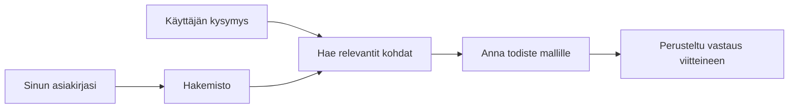

# Opeta tekoälyä vastaamaan kysymyksiin asiakirjojesi perusteella:
## Sarja 1: RAG, Azure vs avoimen lähdekoodin vaihtoehdot ja milloin hienosäätö on järkevää

> Ensimmäinen artikkeli vuonna 2026 sarjassa, joka palaa käsittelemään vuonna 2023 tekemiäni Azure AI Search + Azure OpenAI -asiakirjavaihtoehtoja käsitteleviä opetusohjelmia.

## 1. Johdanto – Paluu aiempaan RAG-opetusohjelmaan

Vuonna 2023 tein pari opetusohjelmaa siitä, miten opettaa ChatGPT vastaamaan kysymyksiin PDF-asiakirjoista Azure AI Searchin ja Azure OpenAI:n avulla. Kirjoitin [LangChain-version](https://techcommunity.microsoft.com/blog/educatordeveloperblog/teach-chatgpt-to-answer-questions-using-azure-ai-search--azure-openai-lang-chain/3969713) ja kirjoitin myös yhdessä [Semantic Kernel -version](https://techcommunity.microsoft.com/blog/educatordeveloperblog/teach-chatgpt-to-answer-questions-using-azure-ai-search--azure-openai-semantic-k/3985395) yhteistyössä [Lee Stottin](https://developer.microsoft.com/en-us/advocates/lee-stott), Microsoftin johtavan pilviadvokaattipäällikön kanssa. Tuolloin ajatus "ChatGPT omilla tiedoillasi" tuntui monille kehittäjille vielä uutuudelta. Opetusohjelmissa käytettiin Azure Blob Storagea, Azure AI Searchia, Azure OpenAI:ta, LangChainia, Semantic Kernelia ja FAISS-tyylistä vektorien hakua vastausten tuottamiseen PDF-tiedostoista.

Se aiempi artikkeli keskittyi yksinkertaiseen mutta tärkeään työnkulkuun: lataa asiakirjat, tee niistä indeksi, hae sopivaa sisältöä ja pyydä mallia vastaamaan tämän sisällön perusteella.

Vuonna 2026 RAG-ekosysteemi on kasvanut huomattavasti. Azure AI Search tukee nyt nykyaikaisia vektori- ja hybridihaut, Azure OpenAI on osa laajempaa Microsoft Foundry Models -ekosysteemiä, ja uudempi v1-rajapinta voi käyttää vakiintunutta OpenAI-asiakasta ilman kuukausittaista `api-version`-päivitystä. Samaan aikaan avoimen lähdekoodin vaihtoehdot, kuten LangGraph, LlamaIndex, Haystack, Qdrant, Milvus, Weaviate, Chroma, Ollama ja vLLM ovat käytännöllisiä vaihtoehtoja oikeisiin RAG-järjestelmiin.

Siksi halusin palata tähän aiheeseen. Kysymys ei ole enää vain "Miten rakennan RAG:n?" Nyt on monia tapoja rakentaa se, ja tärkeämpi kysymys on "Minkä arkkitehtuurin valitsen omiin tarpeisiini?"

Mutta perusongelma ei ole muuttunut.

Tekoälymalli ei automaattisesti tunne asiakirjojasi. Rakentaaksesi hyödyllisen asiakirjoihin perustuvan kysymys-vastausjärjestelmän, tarvitset edelleen luotettavaa haun, perustelun, arvioinnin ja toimintojen työnkulkuja.

Tämä artikkeli ei ole toinen päästä päähän "keskustele PDF:n kanssa" -opas. Haluan aloittaa tämän päivittyneen sarjan kysymyksellä, joka kiinnostaa minua nyt enemmän: milloin valita hallittu Azure-arkkitehtuuri, milloin avoimen lähdekoodin RAG-pino ja milloin hienosäätö todella on järkevää?

Tämä on ensimmäinen artikkeli sarjassa dokumenttipohjaisten tekoälyjärjestelmien rakentamisesta. Tässä ensimmäisessä osassa keskitymme arkkitehtuuripäätöksiin: miksi RAG on tärkeä, milloin Azure-pohjaiset hallitut palvelut ovat hyödyllisiä, milloin avoimen lähdekoodin vaihtoehdot ovat järkeviä ja mihin hienosäätö sopii.

Rakentaessani ja palatessani asiakirjapohjaisiin QA-järjestelmiin olen alkanut kiinnostua vähemmän siitä, mikä työkalu näyttää parhaimmalta demon aikana, ja enemmän siitä, mikä arkkitehtuuri kestää todellisia käyttäjiä, muuttuvia asiakirjoja, käyttöoikeuksia, vikoja ja ylläpitoa.

## 2. Miksi tekoälysi tarvitsee hakujärjestelmän

Suuria kielimalleja on koulutettu laajalla julkisella ja lisensoidulla datalla. Ne voivat tietää paljon yleisistä aiheista, mutta ne eivät automaattisesti tunne yksityisiä PDF-tiedostojasi, sisäisiä sääntöjä, yrityksen käytäntöjä, tutkimusarkistoja, opetussuunnitelmamateriaaleja, asiakastukimuistiinpanoja tai äskettäin päivitettyjä dokumentteja.

Yksinkertainen tapa ajatella RAG:ia on tämä: sen sijaan, että odotetaan mallin muistavan jokaisen asiakirjan, annamme sille hakujärjestelmän. Kun käyttäjä esittää kysymyksen, järjestelmä ensin löytää olennaisimmat tiedot ja sitten antaa ne mallille kontekstiksi.

Tämä on tärkeää, koska monet todellisen maailman tietolähteet ovat yksityisiä, jatkuvasti muuttuvia, käyttöoikeuksien alaisia, tallennettuina useisiin järjestelmiin, kirjoitettu monissa muodoissa ja liian suuria, jotta ne voisi suoraan liittää kehotteeseen.

Esimerkiksi jos koululla, yrityksellä tai tutkimusryhmällä on 10 000 sisäistä asiakirjaa, malli ei voi luotettavasti vastata näihin asiakirjoihin ilman, että järjestelmä hakee oikeat osat oikeaan aikaan.

Tämä johtaa luonnollisesti yleiseen kysymykseen:

Miksi en vain hienosäätäisi mallia?

Hienosäätö voi olla hyödyllistä, mutta se ei yleensä ole oikea ensimmäinen työkalu asiakirjatiedolle. Jos tieto muuttuu usein, viitteet ovat tärkeitä tai käyttöoikeudet ovat merkityksellisiä, RAG on tavallisesti parempi lähtökohta. Hienosäätö sopii paremmin käyttäytymisen, tyylin, tulosmuodon ja tehtäväkuvioiden opettamiseen.

## 3. RAG-arkkitehtuuri käytännössä

Kuvittele, että rakennat tekoälyavustajan koululle. Avustajan täytyy vastata kysymyksiin sääntö-PDF:istä, kurssiohjeista, sisäisistä UKK-sivuista ja äskettäin päivitetystä tiedotteesta.

Jos opiskelija kysyy "Voinko käyttää generatiivista tekoälyä lopputyössäni?", järjestelmän ei pitäisi vastata mallin yleisen muistin perusteella. Sen pitäisi ensin löytää asiaankuuluva koulun sääntö, hakea AI:n käyttöä koskeva kohta ja pyytää sitten mallia vastaamaan tämän todistusaineiston perusteella.

Tämä on RAG käytännössä.

Yleiskäsityksenä voit ajatella työnkulun näin:

Yksityiskohdat voivat olla monimutkaisempia, mutta perusajatus on yksinkertainen: malli ei vastaa yksin. Se vastaa haetun todistusaineiston kanssa.

Aluksi asiakirjat tuodaan tallennusjärjestelmistä, kuten Azure Blob Storage, SharePoint, GitHub tai sisäinen CMS. Järjestelmä jäsentää ne tekstiksi säilyttäen hyödylliset rakenteet, kuten otsikot, sivunumerot, taulukot, osiot ja lähdepaikat.

Seuraavaksi sisältö pilkotaan paloiksi. Tämä vaihe kuulostaa yksinkertaiselta, mutta se on yksi tärkeimmistä osista järjestelmää. Jos pala on liian pieni, se saattaa menettää ympäröivän kontekstin. Jos pala on liian suuri, siihen voi sisältyä epäolennaista tietoa ja haku voi olla epätarkempi.

Palojen pilkkomisen jälkeen järjestelmä luo upotukset ja tallentaa ne haettavaksi indeksiksi yhdessä alkuperäisen tekstin ja metatietojen, kuten tiedostonimen, sivunumeron, käyttöoikeuksien, asiakirjan version ja lähde-URL:n kanssa.

Kun käyttäjä esittää kysymyksen, järjestelmä hakee ehdokkaat avainsanahaun, vektorihakujen tai hybridihaun avulla. Järjestelmä voi sen jälkeen järjestää nämä palat uudelleen niin, että hyödyllisimmät todisteet ovat ylimpänä.

Lopuksi malli saa kysymyksen ja haetun todistusaineiston. Vastaus tulisi perustaa tähän todistusaineistoon ja sisältää viitteet, jotta käyttäjä voi tarkistaa lähteen.

Tärkeä pointti on, että RAG ei ole pelkkä "laita PDF-tiedostot vektoripohjaiseen tietokantaan." Vastauksen laatu riippuu koko työnkulusta: jäsentämisestä, palojen pilkkomisesta, hausta, uudelleenjärjestelystä, kehotteista, viittauksista ja arvioinnista.

Siksi asiakirjan rakenne on tärkeä. PDF:ssä otsikko, taulukko, alatunniste tai sivun raja voi muuttaa kappaleen merkitystä. Azurella Document Layout -osaaminen käyttää Azure Document Intelligencen asettelutoimintoja tuottaakseen rakenteeseen perustuvaa tulosta, mikä voi parantaa palojen pilkkomista ja haun laatua RAG-järjestelmissä.

## 4. Mikä on muuttunut vuodesta 2023?

Vuoden 2023 opetusohjelma oli aikansa hyvä lähtökohta:

- Azure Blob Storage tallensi PDF-tiedostoja.
- Azure AI Search indeksoi sisällön.
- LangChain yhdisti haun Azure OpenAI:hin.
- FAISS toimi yksinkertaisena paikallisena vektoritietokantana.
- Esimerkissä käytettiin `gpt-35-turbo` ja `text-embedding-ada-002` -malleja.

Vuonna 2026 nykyaikaisen version tulisi ottaa huomioon useita muutoksia.

Ensinnäkin haku on kehittynyt. Vuonna 2023 monet demot käyttivät yksinkertaista vektoriperusteista samanlaisuushakua. Tänään hybridihaut ovat usein vakio lähtökohta vakaville asiakirjavaihtoehdoille. Azure AI Search tukee hybridihaut yhdistämällä avainsana- ja vektorikyselyt yhteen pyyntöön ja yhdistelee tulokset Reciprocal Rank Fusionin avulla. Semanttinen järjestelijä voi sen jälkeen järjestää uudelleen täyden tekstin, vektori- ja hybridirankkauksien tekstipuolen tuloksia.

Toiseksi tuonti on monipuolisempaa. Sen sijaan, että jokaista asiakirjaa pilkottaisiin sovellusohjelmalla manuaalisesti, Azure AI Search tukee integroitua vektorisointia palojen pilkkomista, upotuksia ja kyselyaikaista vektorisointia varten. PDF- ja asiakirjarahakkaisiin työkuormiin Document Layout -osaaminen voi säilyttää enemmän rakennetta kuin kiinteäkokoiset palat.

Kolmanneksi orkestrointi on entistä tärkeämpää. Vaikea osa ei usein ole LLM-API-kutsu sinänsä. Haasteena on virheiden käsittely, uudelleenyritykset, vanhentunut haku, palojen laatu, pitkäkestoiset työnkulut, ihmisen tarkistus ja arviointi suuressa mittakaavassa. Tässä työnkulkuun keskittyvät työkalut, kuten LangGraph, LlamaIndex-työnkulut, Haystack-putket ja alustan tason arviointi- ja havainnointityökalut ovat tärkeämpiä kuin pelkkä suoraviivainen ketju.

Neljänneksi arviointi ei ole enää valinnainen. Demo voi näyttää vaikuttavalta yhdellä kysymyksellä. Tuotantojärjestelmä tarvitsee testisarjat, regressiotarkistukset, hakutulosten mittaukset, perusteltavuuden tarkistukset ja seurannan. Ilman arviointia on vaikea tietää, parantaako järjestelmä vai vain muuttuu.

## 5. Azure- ja avoimen lähdekoodin RAG-pinojen valinta

En usko, että hyödyllinen kysymys on "Onko Azure parempi kuin avoin lähdekoodi?" tai "Onko avoin lähdekoodi parempi kuin Azure?"

Hyödyllinen kysymys on: minkä tyyppisen järjestelmän rakennat, kuka sitä operoi, mitä rajoituksia sinulla on ja mitkä virhetilanteet ovat mahdottomia hyväksyä?

Kun aloitin asiakirjavaihtoehtojen rakentamisen, ajattelin lähinnä toimivuutta. Voinko ladata PDF:t, hakea niistä ja tuottaa vastauksen? Se oli järkevä lähtökohta.

Työskennellessäni realistisempien tekoälytyönkulkujen parissa, arvioni muuttui. Tarkastelen nyt neljää aluetta ennen RAG-pinon valintaa:

- identiteetti ja käyttöoikeudet
- haun laatu
- työnkulun luotettavuus
- operatiivinen omistajuus

Nämä neljä aluetta kertovat paljon enemmän kuin pelkkä mallin vertailu.

Azure-pohjaiset arkkitehtuurit ovat yleensä järkeviä, kun yritysintegratio on vaikeaa. Jos tiimi riippuu jo Microsoft Entra ID:stä, Microsoft 365:stä, Azure Storagesta, yksityisverkosta, RBAC:sta ja Azuren valvonnasta, Azure AI Search ja Azure OpenAI voivat vähentää merkittävästi operatiivista monimutkaisuutta. Tässä ympäristössä Azure ei ole pelkkä malli-API. Arvo on ympäröivässä järjestelmässä: identiteetti, hallinta, hallittu haku, turvallisuusintegraatio, tuki ja tutut toiminnot.

Avoimen lähdekoodin arkkitehtuurit ovat yleensä järkeviä, kun joustavuus on vaikeaa. Jos tiimi tarvitsee paikallisen päättelyn, pilviportabiliteetin, mukautetun hakuputken, erikoistuneen uudelleenjärjestelyn tai suoran kontrollin vektoritietokantaan ja mallin palveleviin kerroksiin, avoimen lähdekoodin pino voi olla parempi valinta. Vaihtoehtona on, että tiimi omistaa enemmän luotettavuustyötä: varmuuskopiot, skaalaus, latenssi, siirrot, valvonta ja turvallisuus.

Käytännössä monet tuotantotekoälyjärjestelmät eivät ole täysin pilvessä syntyneitä tai täysin avoimen lähdekoodin. Ne ovat usein hybridijärjestelmiä, jotka tasapainottavat operatiivisen yksinkertaisuuden, kannettavuuden, hallinnoinnin ja insinöörien joustavuuden.

Esimerkiksi en yllättyisi nähdessäni järjestelmän käyttävän Azure OpenAI:ta mallin käyttöön, LangGraphia työnkulun orkestrointiin, Azure-hostingia käyttöönottoon ja avoimen lähdekoodin vektoritietokantaa tiettyyn hakutarpeeseen. Tämä ei ole arkkitehtoninen ristiriita. Tämä on oikean hallitun palvelutason ja insinöörien kontrollin valinta jokaiselle järjestelmän osalle.

Pidän hybrideistä arkkitehtuureista, kun hallittu alusta ratkaisee tärkeitä yritysongelmia, kun taas avoimen lähdekoodin komponentit antavat tiimille joustavuutta siellä, missä sillä oikeasti on merkitystä.

## 6. Käytännöllinen päätösohje

Tässä on päätöstaulukko, jota käyttäisin tiimin kanssa ennen RAG-pinon valintaa:

| Päätöksen alue | Azure hallinnoitu pino on vahvempi kun... | Avoimen lähdekoodin pino on vahvempi kun... |
| --- | --- | --- |
| Identiteetti ja pääsy | Entra ID, RBAC, hallittu identiteetti ja yrityskäyttöoikeudet ovat keskeisiä | mukautettu todennus, ei-Microsoftin identiteetti tai sovelluskohtainen pääsylogiikka dominoi |
| Toiminta | tiimi haluaa hallitun infrastruktuurin, tuen, SLA:t ja helpomman käyttöönoton | tiimi pystyy operoimaan vektoritietokantoja, malli-palveluita, varmuuskopioita ja skaalausta |
| Haku | hybridihaun, semanttisen järjestyksen, suodattimien ja metatietohakujen tarpeet kattavat suurimman osan tarpeista | tiimi tarvitsee mukautetun haun, erikoistuneen uudelleenjärjestelyn tai kokeellisen indeksoinnin |
| Siirrettävyys | Azure-ekosysteemin mukautuminen on hyväksyttävää tai toivottavaa | pilvelukkoon sitoutumisen välttäminen on kova vaatimus |
| Päättely | Azure OpenAI:n hallinta, verkotus ja yritystoiminnot merkitsevät | paikallinen päättely, mukautetut mallit tai itseisännöity palvelu ovat tarpeen |
| Kustannukset | insinöörityön ja operatiivisen työn pienentäminen on tärkeämpää kuin infrastruktuurin hienosäätö | skaala on tarpeeksi suuri oikeuttaakseen huolellisen infrastruktuurinhallinnan |
| Kokeilut | vakaus ja yritysintegratio ovat tärkeämpiä kuin usein muuttuvat komponentit | tiimi iteroi nopeasti agentteja, työkaluja, muistia ja hakutyönkulkuja |

Nyrkkisääntönäni on yksinkertainen:

- Aloita Azuresta, kun yritysintegratio, turvallisuus ja operatiivinen yksinkertaisuus ovat suurimmat riskit.
- Aloita avoimesta lähdekoodista, kun siirrettävyys, räätälöinti tai paikallinen kontrolli ovat suurimmat riskit.
- Käytä hybridiä, kun molemmat pätevät.

Siksi en myöskään aloittaisi vuoden 2026 RAG-sarjaa ensisijaisesti koodilla. Koodi on tärkeä, mutta arkkitehtuurin valinta tapahtuu ennen toteutusta. Yksinkertainen demo voi piilottaa vaikeimmat valinnat. Hyvä RAG-järjestelmä tekee nämä valinnat selviksi.

## 7. Mihin hienosäätö sopii

Hienosäätö mainitaan usein yhdessä RAG:n kanssa, mutta mielestäni on tärkeää erottaa nämä kaksi.

RAG on tavallisesti parempi valinta, kun järjestelmä tarvitsee tuoretta, yksityistä, käyttöoikeuksien alaista tai lähteisiin perustuvaa tietoa. Jos vastauksen tuleekin viitata asiakirjoihin, heijastaa viimeaikaisia päivityksiä tai kunnioittaa käyttäjäkohtaisia käyttöoikeuksia, haku tulee olla osa arkkitehtuuria.

Hienosäätö on hyödyllisempää, kun tieto ei ole pääongelma. Se voi auttaa, kun haluat mallin noudattavan tiettyä tulosmuotoa, vastaavan aluekohtaisesti tietynlaiseen tyyliin, suorittavan vakaata tehtävää johdonmukaisesti tai vähentävän kehotteissa tarvittavaa ohjeistusta.
Käytännössä nämä kaksi voivat toimia yhdessä. Tukihenkilö voi käyttää RAG:ia hakiakseen viimeisimmän politiikan, kun taas hienosäädetty malli oppii yrityksen toivoman vastausrakenteen ja sävyn.

Virhe on kohdella hienosäätöä dokumenttivaraston korvaajana. Se ei poista hakutarvetta, kun järjestelmän on vastattava tuoreista, yksityisistä tai lupiin liittyvistä tiedoista.

## 8. Minne tämä sarja etenee seuraavaksi

Tämä artikkeli käsittelee päätöksentekokerrosta. Ennen kuin kirjoitan koodia, halusin tehdä kompromissit selviksi: RAG vs hienosäätö, Azure vs avoin lähdekoodi, hallinnoidut palvelut vs operatiivinen hallinta.

Ennen siirtymistä toteutukseen haluan jättää yhden kohdan tähän: monissa yritystason tekoälyjärjestelmissä malli on vain yksi osa. Haun laatu, orkestrointi, arviointi, käyttöoikeudet ja operatiivinen luotettavuus ovat usein ratkaisevia tekijöitä siinä, onnistuuko järjestelmä demon jälkeisessä vaiheessa.

Seuraavissa tämän sarjan osissa aion sukeltaa syvemmälle dokumentteihin perustuvien tekoälyjärjestelmien käytännön puoleen: miten rakentaa Azure-pohjainen arkkitehtuuri, miten avoimen lähdekoodin vaihtoehdot toimivat käytännössä ja miten arvioida, toimiiko RAG-järjestelmä todella.

Saatan muuttaa järjestystä sarjan edetessä, mutta tavoite pysyy samana: siirtyä pelkästä demosta ja näyttää, miten ajatella RAG-järjestelmiä, joita voi ylläpitää, arvioida ja käyttää.

## 9. Viitteet ja resurssit

Alkuperäiset oppaat:

- [Opeta ChatGPT vastaamaan kysymyksiin: Azure AI Search & Azure OpenAI (Lang Chain)](https://techcommunity.microsoft.com/blog/educatordeveloperblog/teach-chatgpt-to-answer-questions-using-azure-ai-search--azure-openai-lang-chain/3969713)
- [Opeta ChatGPT vastaamaan kysymyksiin: Azure AI Search & Azure OpenAI (Semantic Kernel)](https://techcommunity.microsoft.com/blog/educatordeveloperblog/teach-chatgpt-to-answer-questions-using-azure-ai-search--azure-openai-semantic-k/3985395)

Azure:

- [Azure AI Search REST API -versiot](https://learn.microsoft.com/en-us/rest/api/searchservice/search-service-api-versions)
- [Hybridihaku Azure AI Searchissa](https://learn.microsoft.com/en-us/azure/search/hybrid-search-how-to-query)
- [Integroitu vektorointi Azure AI Searchissa](https://learn.microsoft.com/en-us/azure/search/vector-search-integrated-vectorization)
- [Dokumentin asettelun taito Azure AI Searchissa](https://learn.microsoft.com/en-us/azure/search/cognitive-search-skill-document-intelligence-layout)
- [Palko ja vektoroi dokumentin asettelun mukaan](https://learn.microsoft.com/en-us/azure/search/search-how-to-semantic-chunking)
- [Sementtinen lajittelu Azure AI Searchissa](https://learn.microsoft.com/en-us/azure/search/semantic-search-overview)
- [Azure OpenAI / Microsoft Foundryn API-version elinkaari](https://learn.microsoft.com/en-us/azure/foundry/openai/api-version-lifecycle)
- [Foundry-mallit, joita Azure myy](https://learn.microsoft.com/en-us/azure/foundry/foundry-models/concepts/models-sold-directly-by-azure)
- [Microsoft Foundryn hienosäätöön liittyvät näkökohdat](https://learn.microsoft.com/en-us/azure/foundry/openai/concepts/fine-tuning-considerations)
- [Microsoft Foundryn havainnointiominaisuudet](https://learn.microsoft.com/en-us/azure/foundry/concepts/observability)
- [Suorita arviointeja Microsoft Foundryssa](https://learn.microsoft.com/en-us/azure/foundry/how-to/evaluate-generative-ai-app)

Avoin lähdekoodi:

- [LangGraph-dokumentaatio](https://docs.langchain.com/oss/python/langgraph/overview)
- [LlamaIndex-dokumentaatio](https://developers.llamaindex.ai/python/framework/)
- [Haystack-dokumentaatio](https://docs.haystack.deepset.ai/)
- [Qdrant-dokumentaatio](https://qdrant.tech/documentation/overview/)
- [Milvus-dokumentaatio](https://milvus.io/docs/overview.md)
- [Weaviate-dokumentaatio](https://docs.weaviate.io/weaviate/current/)
- [Chroma-dokumentaatio](https://docs.trychroma.com/docs/overview/introduction)
- [Ollaman upotukset](https://docs.ollama.com/capabilities/embeddings)
- [vLLM OpenAI-yhteensopiva palvelin](https://docs.vllm.ai/en/latest/serving/openai_compatible_server.html)
- [BGE-upotusmallit](https://huggingface.co/BAAI/bge-large-en-v1.5)
- [E5-upotusmallit](https://huggingface.co/intfloat/e5-large-v2)
- [Instructor-upotusmallit](https://huggingface.co/hkunlp/instructor-large)

---

<!-- CO-OP TRANSLATOR DISCLAIMER START -->
**Vastuuvapauslauseke**:
Tämä asiakirja on käännetty käyttämällä tekoälypohjaista käännöspalvelua [Co-op Translator](https://github.com/Azure/co-op-translator). Vaikka pyrimme tarkkuuteen, otathan huomioon, että automaattiset käännökset saattavat sisältää virheitä tai epätarkkuuksia. Alkuperäinen asiakirja sen alkuperäiskielellä on virallinen lähde. Tärkeissä asioissa suositellaan ammattimaista ihmiskäännöstä. Emme ole vastuussa tämän käännöksen käytöstä aiheutuvista väärinymmärryksistä tai tulkinnoista.
<!-- CO-OP TRANSLATOR DISCLAIMER END -->