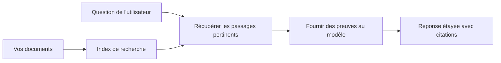

# Enseignez à l'IA à répondre aux questions basées sur vos documents :  
## Série 1 : RAG, Azure vs alternatives open source, et quand le fine-tuning a du sens

> Le premier article d'une série 2026 revenant sur mes tutoriels de 2023 Azure AI Search + Azure OpenAI pour la QA sur documents.

Navigation de la série : [Accueil du dépôt](../README.md) | Suivant : [Série 2 - Construire un système RAG open source local de bout en bout](./series-2-open-source-rag-end-to-end.md)

## 1. Introduction - Reprendre un tutoriel RAG précédent

En 2023, j’ai travaillé sur une paire de tutoriels concernant l’enseignement à ChatGPT pour répondre à des questions à partir de documents PDF en utilisant Azure AI Search et Azure OpenAI. J’ai écrit la [version LangChain](https://techcommunity.microsoft.com/blog/educatordeveloperblog/teach-chatgpt-to-answer-questions-using-azure-ai-search--azure-openai-lang-chain/3969713), et j’ai également coécrit la version compagnon [Semantic Kernel](https://techcommunity.microsoft.com/blog/educatordeveloperblog/teach-chatgpt-to-answer-questions-using-azure-ai-search--azure-openai-semantic-k/3985395) avec [Lee Stott](https://developer.microsoft.com/en-us/advocates/lee-stott), Principal Cloud Advocate Manager chez Microsoft. À l’époque, l’idée de « ChatGPT sur vos données » semblait encore nouvelle pour beaucoup de développeurs. Les tutoriels utilisaient Azure Blob Storage, Azure AI Search, Azure OpenAI, LangChain, Semantic Kernel, et la recherche vectorielle de type FAISS pour répondre à des questions à partir de fichiers PDF.

Cet article précédent se concentrait sur un flux de travail simple mais important : téléverser des documents, les indexer, récupérer du contenu pertinent et demander à un modèle de répondre en se basant sur ce contenu.

En 2026, l’écosystème RAG a considérablement évolué. Azure AI Search supporte désormais des modèles modernes de recherche vectorielle et hybride, Azure OpenAI fait partie de l’écosystème Microsoft Foundry Models plus large, et la nouvelle API v1 peut utiliser le client OpenAI standard sans nécessiter de changements mensuels de `api-version`. En parallèle, des options open source comme LangGraph, LlamaIndex, Haystack, Qdrant, Milvus, Weaviate, Chroma, Ollama et vLLM sont devenues des choix pratiques pour de vrais systèmes RAG.

C’est pourquoi je voulais revenir sur ce sujet. La question n’est plus seulement « Comment construire un RAG ? » Il existe désormais plusieurs façons de le faire, et la question plus importante est « Quelle architecture choisir pour ma situation ? »

Mais le problème de base n’a pas changé.

Un modèle IA ne connaît pas automatiquement vos documents. Pour construire un système utile de questions-réponses sur documents, vous avez toujours besoin d’un système fiable de récupération, d’ancrage (grounding), d’évaluation et de flux opérationnels.

Cet article n’est pas un autre tutoriel complet « chat avec PDF ». Je veux commencer cette série mise à jour par la question qui m’importe désormais davantage : quand choisir une architecture Azure gérée, quand choisir une stack RAG open source, et quand le fine-tuning a-t-il vraiment du sens ?

C’est le premier article d’une série sur la construction de systèmes IA ancrés sur documents. Dans cette première partie, nous nous concentrerons sur les décisions d’architecture : pourquoi le RAG est important, quand les services gérés Azure sont utiles, quand les alternatives open source sont pertinentes, et où le fine-tuning s’intègre.

Après avoir construit et revu des systèmes QA basés sur documents, je m’intéresse moins à l’outil qui a la meilleure démo, et plus à l’architecture qui survit aux vrais utilisateurs, aux documents changeants, aux permissions, aux erreurs et à la maintenance.

## 2. Pourquoi votre IA a besoin d’un système de recherche

Les grands modèles de langage sont entraînés sur des données publiques larges et sous licence. Ils peuvent connaître beaucoup de choses sur des sujets généraux, mais ils ne connaissent pas automatiquement vos PDF privés, vos politiques internes, vos procédures d’entreprise, vos archives de recherche, vos documents de classe, vos notes d’assistance client, ou vos documentations récemment mises à jour.

Une façon simple de voir le RAG est celle-ci : au lieu de s’attendre à ce que le modèle se souvienne de chaque document, on lui donne un système de recherche. Lorsqu’un utilisateur pose une question, le système trouve d’abord les informations les plus pertinentes, puis donne ces éléments au modèle comme contexte.

C’est important parce que beaucoup de sources de connaissances du monde réel sont privées, constamment en changement, sensibles aux permissions, stockées dans plusieurs systèmes, écrites dans de nombreux formats, et trop volumineuses pour être collées directement dans une invite.

Par exemple, si une école, une entreprise ou une équipe de recherche possède 10 000 documents internes, le modèle ne peut pas répondre à partir de ces documents de façon fiable à moins que le système ne récupère les bonnes parties au bon moment.

Cela amène naturellement une question fréquente :

Pourquoi ne pas simplement fine-tuner le modèle ?

Le fine-tuning peut être utile, mais ce n’est généralement pas le premier outil approprié pour les connaissances documentaires. Si la connaissance change souvent, si les citations comptent, ou si les permissions d’accès comptent, le RAG est habituellement le meilleur point de départ. Le fine-tuning est plus adapté pour enseigner un comportement, un style, un format de sortie, et des motifs de tâche.

## 3. L’architecture RAG en pratique

Imaginez que vous construisez un assistant IA pour une école. L’assistant doit répondre à des questions issues de PDFs de politiques, de guides de cours, de pages FAQ internes, et d’annonces récentes mises à jour.

Si un étudiant demande « Puis-je utiliser l’IA générative pour mon devoir final ? », le système ne doit pas répondre à partir de la mémoire générale du modèle. Il doit d’abord trouver la politique scolaire pertinente, récupérer la section sur l’usage de l’IA, puis demander au modèle de répondre en utilisant cette preuve.

Voilà le RAG en pratique.

À un haut niveau, on peut voir le flux comme suit :

  
Les détails peuvent devenir plus sophistiqués, mais l’idée de base est simple : le modèle ne répond pas seul. Il répond avec des preuves récupérées.

D’abord, les documents sont ingérés depuis des systèmes de stockage tels que Azure Blob Storage, SharePoint, GitHub, ou un CMS interne. Ensuite, le système les analyse en texte tout en conservant la structure utile comme les titres, numéros de page, tableaux, sections, et emplacements sources.

Ensuite, le contenu est divisé en segments. Cette étape semble simple, mais elle est une des parties les plus importantes du système. Si un segment est trop petit, il peut perdre le contexte environnant. S’il est trop grand, il peut inclure des informations non liées et rendre la récupération moins précise.

Après la segmentation, le système crée des embeddings et les stocke dans un index consultable avec le texte original et les métadonnées telles que nom de fichier, numéro de page, permissions, version du document, et URL source.

Quand l’utilisateur pose une question, le système récupère des segments candidats en utilisant une recherche par mots-clés, recherche vectorielle, ou recherche hybride. Un reranker peut alors réordonner ces segments pour que les preuves les plus utiles se retrouvent en haut.

Enfin, le modèle reçoit la question et les preuves récupérées. La réponse doit être ancrée dans ces preuves et retourner des citations pour que l’utilisateur puisse consulter la source.

Le point important est que RAG ce n’est pas seulement « mettre des PDFs dans une base vectorielle ». La qualité de la réponse dépend de tout le flux : analyse, segmentation, récupération, reranking, prompt, citation, et évaluation.

C’est pourquoi la structure du document compte. Dans un PDF, un titre, tableau, note de bas de page ou frontière de page peut changer le sens d’un passage. Sur Azure, le skill Document Layout utilise les capacités de mise en page Azure Document Intelligence pour produire une sortie consciente de la structure, ce qui peut améliorer la segmentation et la qualité de la récupération pour les systèmes RAG.

## 4. Qu’est-ce qui a changé depuis 2023 ?

Le tutoriel de 2023 était un bon point de départ pour son époque :

- Azure Blob Storage stockait les fichiers PDF.  
- Azure AI Search indexait le contenu.  
- LangChain connectait la récupération à Azure OpenAI.  
- FAISS fonctionnait comme un simple magasin vectoriel local.  
- L’exemple utilisait `gpt-35-turbo` et `text-embedding-ada-002`.  

En 2026, une version moderne doit refléter plusieurs changements.

D’abord, la récupération a mûri. En 2023, beaucoup de démos utilisaient une recherche vectorielle simple par similarité. Aujourd’hui, la récupération hybride est souvent le point de départ par défaut pour une QA sérieuse sur documents. Azure AI Search supporte la recherche hybride en combinant requêtes mots-clés et vectorielles dans une seule requête et fusionne les résultats avec Reciprocal Rank Fusion. Un classificateur sémantique peut ensuite reranker le côté texte des résultats full-text, vectoriels, et hybrides.

Ensuite, l’ingestion est plus sophistiquée. Plutôt que de segmenter manuellement chaque document avec du code applicatif, Azure AI Search supporte la vectorisation intégrée pour la segmentation, l’embedding, et la vectorisation au temps de requête. Pour les PDFs et les charges documentaires importantes, le skill Document Layout peut préserver plus de structure que des segments de taille fixe.

Troisièmement, l’orchestration est plus importante. La partie difficile n’est souvent pas l’appel API LLM lui-même. La difficulté réside dans la gestion des erreurs, des répétitions, de la désuétude des récupérations, de la qualité des segments, des workflows longs, de la revue humaine, et de l’évaluation à grande échelle. C’est ici que des outils orientés workflow comme LangGraph, les workflows LlamaIndex, les pipelines Haystack, et les outils plateforme d’évaluation et d’observabilité deviennent plus pertinents qu’une simple chaîne linéaire.

Quatrièmement, l’évaluation n’est plus optionnelle. Une démo peut impressionner avec une seule question. Un système en production nécessite des jeux de test, des contrôles de régression, des métriques de récupération, des vérifications de fondement, et une surveillance. Sans évaluation, il est difficile de savoir si le système s’améliore ou change juste.

## 5. Choisir entre Azure et stacks RAG open source

Je ne pense pas que la question utile soit « Azure est-il meilleur que l’open source ? » ou « L’open source est-il meilleur qu’Azure ? »

La question utile est : quel type de système construisez-vous, qui va l’exploiter, quelles contraintes avez-vous, et quels modes de défaillance sont inacceptables ?

Quand j’ai commencé à construire des exemples de QA sur documents, je pensais surtout à si la récupération fonctionnait. Pourrais-je téléverser des PDFs, les rechercher, et générer une réponse ? C’était un point de départ raisonnable.

Après avoir travaillé sur des workflows IA plus réalistes, mon évaluation a changé. Je regarde désormais quatre aspects avant de choisir une stack RAG :

- identité et permissions  
- qualité de récupération  
- fiabilité du workflow  
- propriété opérationnelle  

Ces quatre domaines en disent bien plus qu’un simple benchmark de modèle.

Les architectures basées sur Azure ont habituellement du sens quand l’intégration en entreprise est le plus gros défi. Si une équipe dépend déjà de Microsoft Entra ID, Microsoft 365, Azure Storage, réseau privé, RBAC, et monitoring Azure, Azure AI Search et Azure OpenAI peuvent réduire beaucoup de complexité opérationnelle. Dans cet environnement, Azure n’est pas seulement une API modèle. La valeur réside dans le système environnant : identité, gouvernance, recherche gérée, intégration sécurité, support, et opérations familières.

Les architectures open source ont généralement du sens quand la flexibilité est l’enjeu principal. Si l’équipe a besoin d’inférence locale, de portabilité cloud, d’un pipeline de récupération personnalisé, d’un reranking spécialisé, ou d’un contrôle direct sur la base vectorielle et la couche de service modèle, une stack open source peut mieux convenir. Le compromis est que l’équipe prend en charge une plus grande part du travail de fiabilité : sauvegardes, montée en charge, latence, migrations, monitoring, et sécurité.

En pratique, beaucoup de systèmes IA en production ne sont ni purement cloud-native ni purement open source. Ce sont souvent des systèmes hybrides qui équilibrent simplicité opérationnelle, portabilité, gouvernance et flexibilité d’ingénierie.

Par exemple, je ne serais pas surpris de voir un système utiliser Azure OpenAI pour l’accès au modèle, LangGraph pour l’orchestration du workflow, l’hébergement Azure pour le déploiement, et une base vectorielle open source pour un besoin spécifique de récupération. Ce n’est pas une incohérence architecturale. C’est choisir le bon niveau de service géré et de contrôle ingénierie pour chaque partie du système.

J’aime les architectures hybrides quand la plateforme gérée résout des problèmes d’entreprise importants, tandis que des composants open source donnent à l’équipe la flexibilité là où ça compte vraiment.

## 6. Un guide pratique de décision

Voici le tableau de décision que j’utiliserais avec une équipe avant de choisir une stack RAG :

| Domaine de décision | La stack managée Azure est plus forte quand... | La stack open source est plus forte quand... |
| --- | --- | --- |
| Identité et accès | Entra ID, RBAC, identité managée, et permissions d’entreprise sont centrales | l’authentification personnalisée, identité non-Microsoft, ou logique d’accès spécifique dominate |
| Opérations | l’équipe veut une infrastructure managée, du support, des SLAs, et un onboarding simplifié | l’équipe peut gérer bases vectorielles, service modèles, sauvegardes, et montée en charge |
| Récupération | recherche hybride, classement sémantique, filtres, et recherche par métadonnées couvrent la plupart des besoins | l’équipe a besoin d’une récupération personnalisée, d’un reranking spécialisé, ou d’une indexation expérimentale |
| Portabilité | l’alignement avec l’écosystème Azure est acceptable ou préféré | éviter le verrouillage cloud est une exigence forte |
| Inférence | la gouvernance Azure OpenAI, réseau, et contrôles entreprise sont importants | inférence locale, modèles personnalisés, ou service auto-hébergé sont requis |
| Coût | réduire l’effort ingénierie et opérations compte plus que l’optimisation infrastructure | l’échelle est assez grande pour justifier une optimisation infrastructure soignée |
| Expérimentation | stabilité et intégration entreprise comptent plus que changer souvent les composants | l’équipe itère rapidement sur agents, outils, mémoire, et workflows de récupération |

Ma règle d’or est simple :

- Commencez par Azure quand l’intégration entreprise, la sécurité, et la simplicité opérationnelle sont les risques principaux.  
- Commencez par open source quand la portabilité, personnalisation, ou contrôle local sont les risques principaux.  
- Utilisez une stack hybride quand les deux sont vrais.

C’est aussi pourquoi je ne commencerais pas une série RAG 2026 par le code en premier. Le code est important, mais la sélection d’architecture vient avant l’implémentation. Une démo simple peut cacher les choix les plus difficiles. Un bon système RAG explicite ces choix.

## 7. Où le fine-tuning s’intègre

Le fine-tuning est souvent mentionné avec le RAG, mais je pense qu’il est important de les dissocier.

Le RAG est généralement le meilleur choix quand le système a besoin de connaissances fraîches, privées, sensibles aux permissions, ou ancrées sur des sources. Si la réponse doit citer des documents, refléter des mises à jour récentes, ou respecter des règles d’accès spécifiques à l’utilisateur, la récupération doit faire partie de l’architecture.
L’affinage est plus utile lorsque la connaissance n’est pas le problème principal. Il peut aider lorsque vous souhaitez que le modèle suive un format de sortie spécifique, adopte un style de réponse propre à un domaine, réalise une tâche stable de manière plus cohérente, ou réduise la quantité d’instructions nécessaires à chaque invite.

En pratique, les deux peuvent fonctionner ensemble. Un assistant de support pourrait utiliser RAG pour récupérer la dernière politique, tandis qu’un modèle affiné apprend la structure et le ton de réponse préférés de l’entreprise.

L’erreur est de considérer l’affinage comme un remplacement du stockage de documents. Cela ne supprime pas le besoin de recherche lorsque le système doit répondre à partir de données récentes, privées ou sensibles aux permissions.

## 8. Où cette série va ensuite

Cet article est la couche de prise de décision. Avant d’écrire du code, je voulais rendre explicites les compromis : RAG contre affinage, Azure contre open source, services managés contre contrôle opérationnel.

Avant de passer à l’implémentation, je souhaite ici souligner un point : dans de nombreux systèmes d’IA d’entreprise, le modèle n’est qu’un composant. La qualité de la récupération, l’orchestration, l’évaluation, les permissions et la fiabilité opérationnelle sont souvent ce qui détermine si le système réussit au-delà de la phase de démonstration.

Dans les prochaines parties de cette série, je prévois d’explorer davantage le côté pratique des systèmes d’IA basés sur les documents : construire d’abord un workflow RAG open source local, puis reconstruire le même scénario avec Azure AI Search et Azure OpenAI, puis évaluer si le système fonctionne réellement.

Je pourrais ajuster l’ordre à mesure que la série avance, mais l’objectif restera le même : dépasser une simple démonstration et montrer comment penser les systèmes RAG qui peuvent être maintenus, évalués et exploités.

## 9. Références et ressources

Tutoriels originaux :

- [Teach ChatGPT to Answer Questions: Using Azure AI Search & Azure OpenAI (Lang Chain)](https://techcommunity.microsoft.com/blog/educatordeveloperblog/teach-chatgpt-to-answer-questions-using-azure-ai-search--azure-openai-lang-chain/3969713)
- [Teach ChatGPT to Answer Questions: Using Azure AI Search & Azure OpenAI (Semantic Kernel)](https://techcommunity.microsoft.com/blog/educatordeveloperblog/teach-chatgpt-to-answer-questions-using-azure-ai-search--azure-openai-semantic-k/3985395)

Azure :

- [Versions de l’API REST Azure AI Search](https://learn.microsoft.com/en-us/rest/api/searchservice/search-service-api-versions)
- [Recherche hybride dans Azure AI Search](https://learn.microsoft.com/en-us/azure/search/hybrid-search-how-to-query)
- [Vectorisation intégrée dans Azure AI Search](https://learn.microsoft.com/en-us/azure/search/vector-search-integrated-vectorization)
- [Compétence Document Layout dans Azure AI Search](https://learn.microsoft.com/en-us/azure/search/cognitive-search-skill-document-intelligence-layout)
- [Découper et vectoriser par mise en page de document](https://learn.microsoft.com/en-us/azure/search/search-how-to-semantic-chunking)
- [Classement sémantique dans Azure AI Search](https://learn.microsoft.com/en-us/azure/search/semantic-search-overview)
- [Cycle de vie des versions de l’API Azure OpenAI / Microsoft Foundry](https://learn.microsoft.com/en-us/azure/foundry/openai/api-version-lifecycle)
- [Modèles Foundry vendus par Azure](https://learn.microsoft.com/en-us/azure/foundry/foundry-models/concepts/models-sold-directly-by-azure)
- [Considérations sur l’affinage Microsoft Foundry](https://learn.microsoft.com/en-us/azure/foundry/openai/concepts/fine-tuning-considerations)
- [Observabilité Microsoft Foundry](https://learn.microsoft.com/en-us/azure/foundry/concepts/observability)
- [Exécuter des évaluations dans Microsoft Foundry](https://learn.microsoft.com/en-us/azure/foundry/how-to/evaluate-generative-ai-app)

Open source :

- [Documentation LangGraph](https://docs.langchain.com/oss/python/langgraph/overview)
- [Documentation LlamaIndex](https://developers.llamaindex.ai/python/framework/)
- [Documentation Haystack](https://docs.haystack.deepset.ai/)
- [Documentation Qdrant](https://qdrant.tech/documentation/overview/)
- [Documentation Milvus](https://milvus.io/docs/overview.md)
- [Documentation Weaviate](https://docs.weaviate.io/weaviate/current/)
- [Documentation Chroma](https://docs.trychroma.com/docs/overview/introduction)
- [Embeddings Ollama](https://docs.ollama.com/capabilities/embeddings)
- [Serveur compatible OpenAI vLLM](https://docs.vllm.ai/en/latest/serving/openai_compatible_server.html)
- [Modèles d’embedding BGE](https://huggingface.co/BAAI/bge-large-en-v1.5)
- [Modèles d’embedding E5](https://huggingface.co/intfloat/e5-large-v2)
- [Modèles d’embedding Instructor](https://huggingface.co/hkunlp/instructor-large)

Suivant : [Série 2 - Construire un système RAG open source local de bout en bout](./series-2-open-source-rag-end-to-end.md)

---

<!-- CO-OP TRANSLATOR DISCLAIMER START -->
**Avertissement** :
Ce document a été traduit à l'aide du service de traduction automatique [Co-op Translator](https://github.com/Azure/co-op-translator). Bien que nous nous efforçions d'assurer l'exactitude, veuillez noter que les traductions automatisées peuvent contenir des erreurs ou des inexactitudes. Le document original dans sa langue native doit être considéré comme la source faisant autorité. Pour les informations critiques, il est recommandé de recourir à une traduction professionnelle réalisée par un humain. Nous ne saurions être tenus responsables des malentendus ou erreurs d'interprétation découlant de l'utilisation de cette traduction.
<!-- CO-OP TRANSLATOR DISCLAIMER END -->