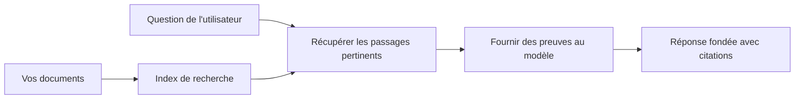

# Enseigner à l’IA à répondre aux questions à partir de vos documents :  
## Série 1 : RAG, Azure vs alternatives open source, et quand le fine-tuning a du sens

> Le premier article d’une série 2026 revisitant mes tutoriels de 2023 sur Azure AI Search + Azure OpenAI pour répondre aux questions basées sur des documents.

## 1. Introduction - Revenir sur un tutoriel RAG précédent

En 2023, j’ai travaillé sur une paire de tutoriels concernant l’enseignement à ChatGPT pour répondre aux questions à partir de documents PDF en utilisant Azure AI Search et Azure OpenAI. J’ai écrit la [version LangChain](https://techcommunity.microsoft.com/blog/educatordeveloperblog/teach-chatgpt-to-answer-questions-using-azure-ai-search--azure-openai-lang-chain/3969713), et j’ai également co-écrit la version compagnon [Semantic Kernel](https://techcommunity.microsoft.com/blog/educatordeveloperblog/teach-chatgpt-to-answer-questions-using-azure-ai-search--azure-openai-semantic-k/3985395) avec [Lee Stott](https://developer.microsoft.com/en-us/advocates/lee-stott), Principal Cloud Advocate Manager chez Microsoft. À l’époque, l’idée de « ChatGPT sur vos données » semblait encore nouvelle pour beaucoup de développeurs. Les tutoriels utilisaient Azure Blob Storage, Azure AI Search, Azure OpenAI, LangChain, Semantic Kernel et la recherche vectorielle de type FAISS pour répondre aux questions à partir de fichiers PDF.

Cet article précédent se concentrait sur un flux de travail simple mais important : téléverser des documents, les indexer, récupérer le contenu pertinent, puis demander à un modèle de répondre en fonction de ce contenu.

En 2026, l’écosystème RAG a considérablement évolué. Azure AI Search prend désormais en charge des modes modernes de recherche vectorielle et hybride, Azure OpenAI fait partie du vaste écosystème Microsoft Foundry Models, et la nouvelle API v1 peut utiliser le client OpenAI standard sans nécessiter de modifications mensuelles de la version `api-version`. Parallèlement, des options open source comme LangGraph, LlamaIndex, Haystack, Qdrant, Milvus, Weaviate, Chroma, Ollama et vLLM sont devenues des choix pratiques pour de véritables systèmes RAG.

C’est pourquoi je voulais revenir sur ce sujet. La question n’est plus seulement « Comment construire du RAG ? » Il existe désormais de nombreuses manières de le faire, et la question la plus importante est « Quelle architecture dois-je choisir pour ma situation ? »

Mais le problème central n’a pas changé.

Un modèle IA ne connaît pas automatiquement vos documents. Pour construire un système utile de questions-réponses basé sur des documents, vous avez toujours besoin d’un workflow fiable de récupération, d’ancrage, d’évaluation et d’opérations.

Cet article n’est pas un autre tutoriel de bout en bout sur « discuter avec un PDF ». Je veux commencer cette série mise à jour par la question qui m’importe désormais le plus : quand faut-il choisir une architecture Azure gérée, quand faut-il choisir une pile RAG open source, et dans quels cas le fine-tuning a-t-il réellement du sens ?

C’est le premier article d’une série consacrée à la construction de systèmes IA fondés sur des documents. Dans cette première partie, nous allons nous concentrer sur les décisions d’architecture : pourquoi le RAG est important, quand les services managés basés sur Azure sont utiles, quand les alternatives open source ont du sens, et où le fine-tuning s’inscrit.

Après avoir construit et revisité des systèmes de QA sur documents, je suis devenu moins intéressé par l’outil qui a le meilleur rendu en démo, et plus intéressé par l’architecture qui résiste aux vrais utilisateurs, aux documents changeants, aux permissions, aux pannes et à la maintenance.

## 2. Pourquoi votre IA a besoin d’un système de recherche

Les grands modèles de langage sont entraînés sur des données publiques larges et sous licence. Ils peuvent connaître beaucoup de sujets généraux, mais ils ne connaissent pas automatiquement vos PDF privés, vos politiques internes, vos procédures d’entreprise, vos archives de recherche, vos supports pédagogiques, vos notes de support client ou votre documentation récemment mise à jour.

Une façon simple de penser le RAG est la suivante : au lieu de s’attendre à ce que le modèle mémorise chaque document, on lui donne un système de recherche. Lorsqu’un utilisateur pose une question, le système trouve d’abord les informations les plus pertinentes, puis fournit ces éléments au modèle comme contexte.

Cela est important parce que de nombreuses sources de connaissance du monde réel sont privées, en constante évolution, sensibles aux permissions, réparties sur plusieurs systèmes, écrites dans de nombreux formats et trop volumineuses pour être collées directement dans un prompt.

Par exemple, si une école, une entreprise ou une équipe de recherche possède 10 000 documents internes, le modèle ne peut pas répondre de manière fiable à partir de ces documents à moins que le système ne récupère les bonnes parties au bon moment.

Cela conduit naturellement à une question courante :

Pourquoi ne pas simplement fine-tuner le modèle ?

Le fine-tuning peut être utile, mais ce n’est généralement pas le bon premier outil pour la connaissance documentaire. Si les connaissances changent souvent, si les citations importent, ou si les règles d’accès importent, le RAG est généralement la meilleure base de départ. Le fine-tuning est mieux adapté pour enseigner un comportement, un style, un format de sortie et des patterns de tâches.

## 3. Architecture RAG en pratique

Imaginez que vous construisez un assistant IA pour une école. L’assistant doit répondre aux questions issues de fichiers PDF de politiques, de guides de cours, de pages FAQ internes et d’annonces récemment mises à jour.

Si un étudiant demande, « Puis-je utiliser une IA générative pour mon travail final ? », le système ne devrait pas répondre à partir de la mémoire générale du modèle. Il devrait d’abord trouver la politique scolaire pertinente, récupérer la section sur l’utilisation de l’IA, puis demander au modèle de répondre en utilisant cette preuve.

Voici le RAG en pratique.

À un niveau élevé, vous pouvez penser au flux comme ceci :

  
Les détails peuvent devenir plus sophistiqués, mais l’idée de base est simple : le modèle ne répond pas seul. Il répond avec des preuves récupérées.

D’abord, les documents sont ingérés depuis des systèmes de stockage tels qu’Azure Blob Storage, SharePoint, GitHub ou un CMS interne. Ensuite, le système les analyse en texte tout en préservant la structure utile comme les titres, numéros de pages, tables, sections et emplacements sources.

Puis, le contenu est découpé en morceaux. Cette étape semble simple, mais c’est une des parties les plus importantes du système. Si un morceau est trop petit, il peut perdre le contexte autour. Si un morceau est trop grand, il peut inclure des informations non liées et rendre la récupération moins précise.

Après la découpe, le système crée des embeddings et les stocke dans un index consultable avec le texte original et des métadonnées comme le nom de fichier, le numéro de page, les permissions, la version du document et l’URL source.

Quand l’utilisateur pose une question, le système récupère des morceaux candidats via une recherche par mots-clés, par vecteurs, ou hybride. Un reranker peut alors réordonner ces morceaux pour mettre les preuves les plus utiles en haut.

Enfin, le modèle reçoit la question ainsi que les preuves récupérées. La réponse doit être fondée sur ces preuves et renvoyer des citations permettant à l’utilisateur d’inspecter la source.

L’essentiel est que le RAG n’est pas seulement « mettre des PDF dans une base vectorielle ». La qualité de la réponse dépend de tout le workflow : analyse, découpe, récupération, reranking, prompting, citation et évaluation.

C’est pourquoi la structure du document compte. Dans un PDF, un titre, un tableau, une note de bas de page ou une limite de page peut changer le sens d’un passage. Sur Azure, la compétence Document Layout utilise les capacités de mise en page d’Azure Document Intelligence pour produire une sortie respectant la structure, ce qui peut améliorer la qualité de la découpe et de la récupération pour les systèmes RAG.

## 4. Qu’est-ce qui a changé depuis 2023 ?

Le tutoriel de 2023 était un bon point de départ pour son époque :

- Azure Blob Storage stockait des fichiers PDF.
- Azure AI Search indexait le contenu.
- LangChain connectait la récupération à Azure OpenAI.
- FAISS fonctionnait comme un simple magasin vectoriel local.
- L’exemple utilisait `gpt-35-turbo` et `text-embedding-ada-002`.

En 2026, une version moderne doit refléter plusieurs évolutions.

D’abord, la recherche a mûri. En 2023, beaucoup de démos utilisaient une simple recherche par similarité vectorielle. Aujourd’hui, la recherche hybride est souvent le point de départ par défaut pour une QA documentaire sérieuse. Azure AI Search supporte la recherche hybride en combinant requêtes par mot-clé et vecteurs dans une même requête et fusionne les résultats avec Reciprocal Rank Fusion. Un classificateur sémantique peut ensuite réordonner la partie texte des résultats plein texte, vectoriels et hybrides.

Ensuite, l’ingestion est plus sophistiquée. Plutôt que de découper manuellement chaque document via le code applicatif, Azure AI Search supporte la vectorisation intégrée pour la découpe, l’embedding et la vectorisation à la requête. Pour les PDF et les charges de travail documentaires lourdes, la compétence Document Layout peut préserver plus de structure que des morceaux de taille fixe.

Troisièmement, l’orchestration est plus importante. La partie difficile n’est souvent pas l’appel API du LLM lui-même. La difficulté est de gérer les échecs, relances, recherches obsolètes, qualité des morceaux, workflows longs, revue humaine et évaluation à grande échelle. C’est là que des outils orientés workflows comme LangGraph, LlamaIndex workflows, pipelines Haystack et outils de supervision et évaluation au niveau plate-forme deviennent plus pertinents qu’une chaîne linéaire unique.

Quatrièmement, l’évaluation n’est plus optionnelle. Une démo peut sembler impressionnante avec une seule question. Un système en production a besoin de jeux de tests, vérifications de régression, métriques de récupération, contrôles d’ancrage et monitoring. Sans évaluation, il est difficile de savoir si le système s’améliore ou change juste.

## 5. Choisir entre Azure et les piles RAG open source

Je ne pense pas que la question utile soit « Azure est-il meilleur que l’open source ? » ou « L’open source est-il meilleur qu’Azure ? »

La question utile est : quel type de système construisez-vous, qui l’opère, quelles contraintes avez-vous, et quels modes d’échec sont inacceptables ?

Lorsque j’ai commencé à construire des exemples de QA documentaire, je pensais surtout à si la récupération fonctionnait. Puis-je téléverser des PDF, les rechercher et générer une réponse ? C’était un bon point de départ.

Après avoir travaillé sur des workflows IA plus réalistes, mon évaluation a changé. Je regarde désormais quatre choses avant de choisir une pile RAG :

- identité et permissions
- qualité de récupération
- fiabilité du workflow
- propriété opérationnelle

Ces quatre domaines en disent bien plus qu’un simple benchmark de modèle.

Les architectures basées sur Azure ont généralement du sens quand l’intégration en entreprise est la partie difficile. Si une équipe dépend déjà de Microsoft Entra ID, Microsoft 365, Azure Storage, réseau privé, RBAC et monitoring Azure, Azure AI Search et Azure OpenAI peuvent réduire beaucoup de complexité opérationnelle. Dans cet environnement, Azure n’est pas seulement une API de modèle. La valeur est dans le système autour : identité, gouvernance, recherche managée, intégration de sécurité, support et opérations familières.

Les architectures open source ont généralement du sens quand la flexibilité est la difficulté. Si l’équipe a besoin d’inférence locale, de portabilité cloud, d’un pipeline de récupération personnalisé, d’un reranking spécialisé ou de contrôle direct sur la base vectorielle et la couche de service modèle, une pile open source peut mieux convenir. Le compromis est que l’équipe doit prendre en charge davantage la fiabilité : sauvegardes, montée en charge, latence, migrations, monitoring et sécurité.

En pratique, beaucoup de systèmes IA de production ne sont ni purement cloud natifs ni purement open source. Ils sont souvent hybrides pour équilibrer simplicité opérationnelle, portabilité, gouvernance et flexibilité ingénierie.

Par exemple, je ne serais pas surpris de voir un système utiliser Azure OpenAI pour accéder au modèle, LangGraph pour l’orchestration des workflows, Azure pour le déploiement et une base vectorielle open source pour une exigence spécifique de récupération. Ce n’est pas une incohérence architecturale. C’est choisir le bon niveau de services managés et contrôle d’ingénierie pour chaque partie du système.

J’aime les architectures hybrides quand la plate-forme managée résout des problèmes d’entreprise importants, tandis que les composants open source donnent à l’équipe la flexibilité là où cela compte vraiment.

## 6. Un guide de décision pratique

Voici le tableau de décision que j’utiliserais avec une équipe avant de choisir une pile RAG :

| Domaine décisionnel | La pile Azure managée est plus forte lorsque… | La pile open source est plus forte lorsque… |
| --- | --- | --- |
| Identité et accès | Entra ID, RBAC, identité managée et permissions entreprise sont centrales | authentification personnalisée, identité non Microsoft ou logique d’accès spécifique à l’app domine |
| Opérations | l’équipe veut une infrastructure managée, support, SLA, et une intégration plus simple | l’équipe peut gérer bases vectorielles, service modèle, sauvegardes et montée en charge |
| Récupération | recherche hybride, classement sémantique, filtres et recherche sur métadonnées couvrent la plupart des besoins | l’équipe a besoin de récupération personnalisée, reranking spécialisé ou indexation expérimentale |
| Portabilité | l’alignement avec l’écosystème Azure est acceptable ou préféré | éviter le verrouillage cloud est une exigence forte |
| Inférence | gouvernance Azure OpenAI, réseau et contrôles entreprise comptent | inférence locale, modèles personnalisés ou service auto-hébergé sont nécessaires |
| Coût | réduire l’effort ingénierie et opérations compte plus que le tuning d’infrastructure | l’échelle est assez grande pour justifier une optimisation fine d’infrastructure |
| Expérimentation | stabilité et intégration entreprise comptent plus que changer souvent de composant | l’équipe itère rapidement sur agents, outils, mémoire et workflows de récupération |

Ma règle simple est :

- Commencez par Azure quand l’intégration entreprise, la sécurité et la simplicité opérationnelle sont les principaux risques.
- Commencez par open source quand portabilité, personnalisation ou contrôle local sont les principaux risques.
- Utilisez une pile hybride quand les deux sont vrais.

C’est aussi pourquoi je ne commencerais pas une série RAG 2026 par du code d’abord. Le code est important, mais la sélection d’architecture vient avant la mise en œuvre. Une simple démo peut cacher les choix les plus difficiles. Un bon système RAG rend ces choix explicites.

## 7. Où le fine-tuning s’inscrit

Le fine-tuning est souvent mentionné avec le RAG, mais je pense qu’il est important de les distinguer.

Le RAG est généralement la meilleure option quand le système a besoin de connaissances fraîches, privées, sensibles aux permissions ou ancrées dans la source. Si la réponse doit citer des documents, refléter des mises à jour récentes ou respecter des règles d’accès spécifiques à l’utilisateur, la récupération doit faire partie de l’architecture.

Le fine-tuning est plus utile quand la connaissance n’est pas le problème principal. Il peut aider lorsque vous voulez que le modèle suive un format de sortie spécifique, adopte un style de réponse propre à un domaine, réalise une tâche stable de façon plus cohérente, ou réduise la quantité d’instructions dans chaque prompt.
En pratique, les deux peuvent fonctionner ensemble. Un assistant de support pourrait utiliser RAG pour récupérer la politique la plus récente, tandis qu'un modèle affiné apprend la structure et le ton de réponse préférés de l'entreprise.

L'erreur est de considérer le fine-tuning comme un remplacement du magasin de documents. Cela ne supprime pas le besoin de récupération lorsque le système doit répondre à partir de données fraîches, privées ou sensibles aux autorisations.

## 8. Où cette série va ensuite

Cet article est la couche de prise de décision. Avant d’écrire du code, je voulais rendre explicites les compromis : RAG contre fine-tuning, Azure contre open source, services managés contre contrôle opérationnel.

Avant de passer à la mise en œuvre, je veux laisser un point ici : dans de nombreux systèmes d’IA d’entreprise, le modèle n’est qu’un composant. La qualité de la récupération, l’orchestration, l’évaluation, les autorisations et la fiabilité opérationnelle sont souvent ce qui détermine si le système réussit au-delà de la phase de démonstration.

Dans les prochaines parties de cette série, je prévois d’approfondir le côté pratique des systèmes d’IA basés sur des documents : comment construire une architecture basée sur Azure, comment les alternatives open source se comparent en pratique, et comment évaluer si un système RAG fonctionne réellement.

Je pourrais ajuster l’ordre au fur et à mesure du développement de la série, mais l’objectif restera le même : aller au-delà d’une simple démonstration et montrer comment penser les systèmes RAG qui peuvent être entretenus, évalués et exploités.

## 9. Références et ressources

Tutoriels originaux :

- [Teach ChatGPT to Answer Questions: Using Azure AI Search & Azure OpenAI (Lang Chain)](https://techcommunity.microsoft.com/blog/educatordeveloperblog/teach-chatgpt-to-answer-questions-using-azure-ai-search--azure-openai-lang-chain/3969713)
- [Teach ChatGPT to Answer Questions: Using Azure AI Search & Azure OpenAI (Semantic Kernel)](https://techcommunity.microsoft.com/blog/educatordeveloperblog/teach-chatgpt-to-answer-questions-using-azure-ai-search--azure-openai-semantic-k/3985395)

Azure :

- [Azure AI Search REST API versions](https://learn.microsoft.com/en-us/rest/api/searchservice/search-service-api-versions)
- [Hybrid search in Azure AI Search](https://learn.microsoft.com/en-us/azure/search/hybrid-search-how-to-query)
- [Integrated vectorization in Azure AI Search](https://learn.microsoft.com/en-us/azure/search/vector-search-integrated-vectorization)
- [Document Layout skill in Azure AI Search](https://learn.microsoft.com/en-us/azure/search/cognitive-search-skill-document-intelligence-layout)
- [Chunk and vectorize by document layout](https://learn.microsoft.com/en-us/azure/search/search-how-to-semantic-chunking)
- [Semantic ranking in Azure AI Search](https://learn.microsoft.com/en-us/azure/search/semantic-search-overview)
- [Azure OpenAI / Microsoft Foundry API version lifecycle](https://learn.microsoft.com/en-us/azure/foundry/openai/api-version-lifecycle)
- [Foundry Models sold by Azure](https://learn.microsoft.com/en-us/azure/foundry/foundry-models/concepts/models-sold-directly-by-azure)
- [Microsoft Foundry fine-tuning considerations](https://learn.microsoft.com/en-us/azure/foundry/openai/concepts/fine-tuning-considerations)
- [Microsoft Foundry observability](https://learn.microsoft.com/en-us/azure/foundry/concepts/observability)
- [Run evaluations in Microsoft Foundry](https://learn.microsoft.com/en-us/azure/foundry/how-to/evaluate-generative-ai-app)

Open source :

- [LangGraph documentation](https://docs.langchain.com/oss/python/langgraph/overview)
- [LlamaIndex documentation](https://developers.llamaindex.ai/python/framework/)
- [Haystack documentation](https://docs.haystack.deepset.ai/)
- [Qdrant documentation](https://qdrant.tech/documentation/overview/)
- [Milvus documentation](https://milvus.io/docs/overview.md)
- [Weaviate documentation](https://docs.weaviate.io/weaviate/current/)
- [Chroma documentation](https://docs.trychroma.com/docs/overview/introduction)
- [Ollama embeddings](https://docs.ollama.com/capabilities/embeddings)
- [vLLM OpenAI-compatible server](https://docs.vllm.ai/en/latest/serving/openai_compatible_server.html)
- [BGE embedding models](https://huggingface.co/BAAI/bge-large-en-v1.5)
- [E5 embedding models](https://huggingface.co/intfloat/e5-large-v2)
- [Instructor embedding models](https://huggingface.co/hkunlp/instructor-large)

---

<!-- CO-OP TRANSLATOR DISCLAIMER START -->
**Avertissement** :
Ce document a été traduit à l'aide du service de traduction automatique [Co-op Translator](https://github.com/Azure/co-op-translator). Bien que nous nous efforçions d'assurer l'exactitude, veuillez noter que les traductions automatisées peuvent contenir des erreurs ou des inexactitudes. Le document original dans sa langue native doit être considéré comme la source faisant autorité. Pour les informations critiques, il est recommandé de recourir à une traduction professionnelle réalisée par un humain. Nous ne saurions être tenus responsables des malentendus ou erreurs d'interprétation découlant de l'utilisation de cette traduction.
<!-- CO-OP TRANSLATOR DISCLAIMER END -->