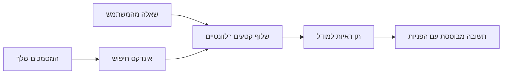

# ללמד AI לענות על שאלות בהתבסס על המסמכים שלך:
## סדרה 1: RAG, Azure מול חלופות קוד פתוח, ומתי כיוונון עדין הגיוני

> המאמר הראשון בסדרת 2026 שבוחנת מחדש את המדריכים שלי מ-2023 בנושא חיפוש AI מבוסס Azure + שאלות ותשובות על מסמכים עם Azure OpenAI.

ניווט בסדרה: [בית המאגר](../README.md) | הבא: [סדרה 2 - לבנות מערכת RAG קוד פתוח מקומית מקצה לקצה](./series-2-open-source-rag-end-to-end.md)

## 1. מבוא - בחינה מחודשת של מדריך RAG מוקדם יותר

בשנת 2023 עבדתי על זוג מדריכים בנושא ללמד את ChatGPT לענות על שאלות ממסמכי PDF באמצעות Azure AI Search ו-Azure OpenAI. כתבתי את [גרסת LangChain](https://techcommunity.microsoft.com/blog/educatordeveloperblog/teach-chatgpt-to-answer-questions-using-azure-ai-search--azure-openai-lang-chain/3969713), וגם שותפתי בכתיבה של [גרסת Semantic Kernel](https://techcommunity.microsoft.com/blog/educatordeveloperblog/teach-chatgpt-to-answer-questions-using-azure-ai-search--azure-openai-semantic-k/3985395) עם [לי סטוט](https://developer.microsoft.com/en-us/advocates/lee-stott), מנהל מוביל לקידום ענן במיקרוסופט. באותו הזמן, הרעיון של "ChatGPT על הנתונים שלך" עדיין הרגיש חדש עבור רבים מהמפתחים. המדריכים השתמשו ב-Azure Blob Storage, Azure AI Search, Azure OpenAI, LangChain, Semantic Kernel, ובשאילתת וקטורים בסגנון FAISS כדי לענות על שאלות מתוך קבצי PDF.

המאמר ההוא התמקד בתהליך פשוט אך חשוב: להעלות מסמכים, לאנדקס אותם, לאחזר תוכן רלוונטי, ולבקש מהמודל לענות בהתבסס על התוכן הזה.

בשנת 2026, אקוסיסטם ה-RAG התרחב משמעותית. Azure AI Search תומך כעת בדפוסי אחזור וקטוריים מודרניים והיברידיים, Azure OpenAI הוא חלק מאקוסיסטם רחב יותר של דגמי Microsoft Foundry, ו-API v1 החדש יכול להשתמש בלקוח OpenAI סטנדרטי בלי צורך בשינויים חודשיים ב-`api-version`. במקביל, אפשרויות קוד פתוח כמו LangGraph, LlamaIndex, Haystack, Qdrant, Milvus, Weaviate, Chroma, Ollama ו-vLLM הפכו לבחירות מעשיות למערכות RAG אמיתיות.

לכן רציתי לחזור לנושא הזה. השאלה כבר אינה רק "איך לבנות RAG?" היום ישנן דרכים רבות לבנות זאת, והשאלה החשובה יותר היא "איזה ארכיטקטורה עליי לבחור עבור המצב שלי?"

אך הבעיה המרכזית לא השתנתה.

מודל AI לא יודע אוטומטית את המסמכים שלך. כדי לבנות מערכת שימושית לשאלות ותשובות על מסמכים, עדיין דרוש אחזור אמין, עיגון, הערכה ותהליכי עבודה תפעוליים.

מאמר זה אינו מדריך נוסף של "שיחה עם PDF מקצה לקצה". אני רוצה להתחיל את הסדרה המעודכנת הזאת עם השאלה שאני עכשיו מתעניין בה יותר: מתי עליך לבחור ארכיטקטורת Azure מנוהלת, מתי לבחור סטאק RAG קוד פתוח, ומתי כיוונון עדין אכן הגיוני?

זהו המאמר הראשון בסדרה על בניית מערכות AI מבוססות מסמכים. בחלק הראשון נתמקד בהחלטות הארכיטקטורה: למה RAG חשוב, מתי שירותי Azure מנוהלים שימושיים, מתי חלופות קוד פתוח מתאימות, ואיפה כיוונון עדין משתלב.

לאחר שבניתי ובחנתי מערכות שאלות ותשובות על מסמכים, אני מעורב פחות באיזו כלי נראה הכי טוב בדמו ויותר במה הארכיטקטורה שורדת משתמשים אמיתיים, מסמכים משתנים, הרשאות, תקלות ותחזוקה.

## 2. למה ה-AI שלך צריך מערכת חיפוש

מודלים גדולים של שפה מאומנים על נתונים ציבוריים ורישויים רחבים. ייתכן שהם יודעים הרבה על נושאים כלליים, אך הם לא יודעים אוטומטית את קבצי ה-PDF הפרטיים שלך, מדיניות פנימית, נהלים ארגוניים, ארכיונים למחקר, חומרי כיתה, הערות תמיכה ללקוח או תיעוד שעודכן לאחרונה.

דרך פשוטה לחשוב על RAG היא כזו: במקום לצפות שהמודל יזכור כל מסמך, אנו נותנים לו מערכת חיפוש. כאשר משתמש שואל שאלה, המערכת מוצאת קודם את החלקים הרלוונטיים ביותר של המידע, ואז מספקת את החלקים האלה למודל בהקשר.

זה חשוב כי מקורות ידע רבים בעולם האמיתי הם פרטיים, משתנים כל הזמן, רגישים להרשאות, נשמרים במערכות שונות, כתובים בפורמטים רבים, וגדולים מדי כדי להדביק ישירות לפרומפט.

לדוגמה, אם לבית ספר, חברה או צוות מחקר יש 10,000 מסמכים פנימיים, המודל לא יוכל לענות מהם באופן אמין אלא אם המערכת תשלוף את החלקים הנכונים בזמן הנכון.

זה מוביל לשאלה נפוצה:

למה לא פשוט לכוונן את המודל?

כיוונון עדין יכול להיות שימושי, אך בדרך כלל אינו הכלי המתאים ראשון לידע על מסמכים. אם הידע משתנה לעיתים קרובות, אם הציטוטים חשובים, או אם הרשאות הגישה חשובות, בדרך כלל RAG היא נקודת התחלה טובה יותר. כיוונון עדין מתאים יותר ללימוד התנהגות, סגנון, פורמט פלט ותבניות משימות.

## 3. ארכיטקטורת RAG בפועל

דמיין שאתה בונה עוזר AI לבית ספר. העוזר צריך לענות על שאלות מתוך PDF של מדיניות, מדריכי קורס, דפי שאלות נפוצות פנימיים והודעות שנעדכנו לאחרונה.

אם תלמיד שואל, "האם אני יכול להשתמש ב-AI גנרטיבי במשימת הסיום שלי?", המערכת לא צריכה לענות מזיכרון המודל הכללי. היא צריכה קודם למצוא את מדיניות בית הספר הרלוונטית, לשלוף את הסעיף על שימוש ב-AI, ואז לבקש מהמודל לענות בהתבסס על הראיות האלה.

זהו RAG במעשה.

ברמה גבוהה, ניתן לחשוב על הזרימה כך:

הפרטים יכולים להיות מורכבים יותר, אך הרעיון הבסיסי פשוט: המודל לא עונה לבדו. הוא עונה עם ראיות שנשלפו.

קודם כל, המסמכים נטענים ממערכות אחסון כמו Azure Blob Storage, SharePoint, GitHub או מערכת ניהול תוכן פנימית. לאחר מכן המערכת מנתחת את המסמכים לטקסט תוך שמירה על מבנה שימושי כמו כותרות, מספרי עמודים, טבלאות, סעיפים ומקומות מקור.

לאחר מכן, התוכן מפוצל לקטעים. שלב זה נשמע פשוט, אך זה חלק חשוב מאוד במערכת. אם קטע הוא קטן מדי, ייתכן שהוא יאבד את ההקשר שמסביב. אם הקטע גדול מדי, הוא עלול להכיל מידע לא קשור ולהפחית דיוק באחזור.

לאחר הפיצול, המערכת יוצרת ייצוגים וקטוריים (embeddings) ושומרת אותם באינדקס ניתן לחיפוש יחד עם הטקסט המקורי ומטא-דאטה כמו שם הקובץ, מספר העמוד, הרשאות, גרסת המסמך וכתובת המקור.

כאשר המשתמש שואל שאלה, המערכת מאחזרת קטעים מועמדים באמצעות חיפוש במילות מפתח, חיפוש וקטורי או חיפוש היברידי. ניתן להשתמש בסידור מחדש (reranker) כדי למקם את הראיות הכי שימושיות למעלה.

בסוף, המודל מקבל את השאלה והראיות שנשלפו. התשובה צריכה להיות מבוססת על הראיות הללו ולכלול ציטוטים כדי שהמשתמש יוכל לבדוק את המקור.

הנקודה החשובה היא ש-RAG אינה רק "לשים PDF בבסיס נתונים וקטורי". איכות התשובה תלויה בכל תהליך העבודה: ניתוח, פיצול, אחזור, סידור מחדש, יצירת פרומפט, ציטוט והערכה.

זו הסיבה שמבנה המסמך חשוב. ב-PDF, כותרת, טבלה, הערת שוליים או גבול עמוד יכולים לשנות את משמעות הקטע. ב-Azure, מיומנות Document Layout משתמשת ביכולות Layout של Azure Document Intelligence כדי לייצר פלט מודע למבנה, מה שיכול לשפר את איכות הפיצול והאחזור עבור מערכות RAG.

## 4. מה השתנה מאז 2023?

מדריך 2023 היה נקודת התחלה טובה לזמנו:

- Azure Blob Storage אחסנה קבצי PDF.
- Azure AI Search אינדקס תוכן.
- LangChain קשר אחזור ל-Azure OpenAI.
- FAISS שימש כמאגר וקטורי מקומי פשוט.
- הדוגמה השתמשה ב-`gpt-35-turbo` וב-`text-embedding-ada-002`.

בשנת 2026, גרסה מודרנית צריכה לשקף כמה שינויים.

ראשית, אחזור התפתח. בשנת 2023, רבים מהדמואים השתמשו באחזור וקטורי פשוט המבוסס על דמיון. היום, אחזור היברידי הוא לעיתים קרובות נקודת התחלה ברירת מחדל לשאלות ותשובות רציניות על מסמכים. Azure AI Search תומך בחיפוש היברידי על ידי שילוב שאילתות מילות מפתח ושאילתות וקטוריות בבקשה אחת וממזג תוצאות עם Reciprocal Rank Fusion. לאחר מכן, סדר סמנטי יכול לסדר מחדש את תוצאות הטקסט המלא, הוקטורי וההיברידי.

שנית, טעינת הנתונים מתוחכמת יותר. במקום לפצל כל מסמך ידנית בקוד היישום, Azure AI Search תומך בווקטוריזציה משולבת לפיצול, יצירת ייצוגים וקטוריים ואחזור בזמן שאילתה. עבור PDF ועומסי עבודה כבדים במסמכים, מיומנות Document Layout יכולה לשמר יותר מבנה מאשר פיצול לנתחים בגודל קבוע.

שלישית, תזמור (אורקסטרציה) חשוב יותר. הקושי אינו לעיתים קרובות בקריאת ממשק ה-API של ה-LLM. הקושי הוא בטיפול בתקלות, נסיונות חוזרים, אחזור לא מעודכן, איכות הקטעים, תהליכים ארוכי טווח, סקירות אנושיות והערכה בקנה מידה. כאן כלים מוכווני תהליכים כמו LangGraph, זרימות עבודה של LlamaIndex, צינורות Haystack וכלי הערכה ותצפית בפלטפורמה רלוונטיים יותר מאשר שרשרת ליניארית אחת.

רביעית, הערכה כבר אינה אופציונלית. דמו יכול להיראות מרשים עם שאלה אחת. מערכת פרודקשן זקוקה לערכות מבחן, בדיקות רגרסיה, מדדי אחזור, בדיקות העיגון ומעקב. בלי הערכה קשה לדעת אם המערכת משתפרת או רק משתנה.

## 5. בחירה בין Azure לבין סטאק RAG בקוד פתוח

אני לא חושב שהשאלה המועילה היא "האם Azure טוב יותר מקוד פתוח?" או "האם קוד פתוח טוב יותר מ-Azure?"

השאלה המועילה היא: איזה סוג מערכת אתה בונה, מי יפעיל אותה, אילו מגבלות יש לך, ואילו מצבי כשל אינם קבילים?

כשפתחתי דוגמאות לשאלות ותשובות על מסמכים, חשבתי בעיקר אם האחזור עבד. האם אוכל להעלות PDF, לחפש בהם וליצור תשובה? זו הייתה נקודת פתיחה הגיונית.

לאחר שעבדתי דרך תהליכי עבודה אמיתיים של AI, ההערכה שלי השתנתה. עכשיו אני מסתכל על ארבעה דברים לפני בחירת סטאק RAG:

- זהות והרשאות
- איכות האחזור
- אמינות תהליך העבודה
- בעלות תפעולית

ארבעת התחומים האלה נותנים הרבה יותר מידע מאשר מבחן ביצועים של מודל בלבד.

ארכיטקטורות מבוססות Azure לרוב הגיוניות כשהאינטגרציה הארגונית היא החלק הקשה. אם הצוות כבר תלוי ב-Microsoft Entra ID, Microsoft 365, Azure Storage, רשת פרטית, RBAC ומעקב Azure, Azure AI Search ו-Azure OpenAI יכולים להפחית מורכבות תפעולית רבה. בסביבה כזו, Azure אינו רק ממשק API למודל. הערך הוא במערכת הכוללת: זהות, ממשל, חיפוש מנוהל, אינטגרציית אבטחה, תמיכה ותפעול מוכר.

ארכיטקטורות קוד פתוח לרוב הגיוניות כשהגמישות היא החלק הקשה. אם הצוות זקוק להסקת מסקנות מקומית, ניידות בענן, צינור אחזור מותאם אישית, סידור מחדש ייעודי או שליטה ישירה על מסד הנתונים הווקטורי ושכבת שירות המודל, סטאק קוד פתוח יכול להתאים יותר. התשלום הוא שהצוות צריך לקחת אחריות רבה יותר על האמינות: גיבויים, סקיילינג, זמני תגובה, הגירות, מעקב ואבטחה.

בפועל, מערכות AI רבות בפרודקשן הן לא טהורות ענן או טהורות קוד פתוח. הן לעיתים מערכות היברידיות שמאזנות בין פשטות תפעולית, ניידות, ממשל וגמישות הנדסית.

לדוגמה, לא אופתע לראות מערכת שמשתמשת ב-Azure OpenAI לגישה למודל, LangGraph לתזמור תהליכים, אירוח ב-Azure לפריסה, ובסיס נתונים וקטורי בקוד פתוח לדרישה אחזור ספציפית. זה לא סתירה ארכיטקטונית. זו בחירת רמת שירות מנוהל ושליטה הנדסית מתאימה לכל חלק במערכת.

אני אוהב ארכיטקטורות היברידיות כשהפלטפורמה המנוהלת פותרת בעיות ארגוניות חשובות, בעוד רכיבים בקוד פתוח נותנים לצוות גמישות במקום שהוא באמת חשוב.

## 6. מדריך לקבלת החלטות מעשי

הנה טבלת החלטות שהייתי משתמש איתה עם צוות לפני בחירת סטאק RAG:

| תחום ההחלטה | סטאק מנוהל של Azure חזק יותר כאשר... | סטאק קוד פתוח חזק יותר כאשר... |
| --- | --- | --- |
| זהות וגישה | Entra ID, RBAC, זהות מנוהלת והרשאות ארגוניות הם מרכזיים | אימות מותאם אישית, זהות לא מיקרוסופטית או לוגיקת גישה ייחודית לאפליקציה שולטת |
| תפעול | הצוות רוצה תשתית מנוהלת, תמיכה, SLA והטמעה פשוטה | הצוות יכול לנהל מסדי נתונים וקטוריים, שירותי מודלים, גיבויים וסקיילינג |
| אחזור | חיפוש היברידי, דירוג סמנטי, סינונים וחיפוש מטא-דאטה מכסים רוב הצרכים | הצוות זקוק לאחזור מותאם, סידור מחדש ייעודי או אינדוקס ניסיוני |
| ניידות | סינכרון עם אקוסיסטם Azure מקובל או מועדף | הימנעות מהיקשרות לענן היא דרישה קשה |
| היסק | ממשל Azure OpenAI, רשת ובקרות ארגוניות חשובים | הסקה מקומית, מודלים מותאמים או שירות עצמי נדרשים |
| עלות | הפחתת מאמץ הנדסי ותפעולי חשובה יותר מכוונון תשתית | ההיקף גדול מספיק להצדיק אופטימיזציה קפדנית לתשתית |
| ניסויים | יציבות ואינטגרציה ארגונית חשובות יותר מהחלפת רכיבים תכופה | הצוות מפתח במהירות סוכנים, כלים, זיכרון ותהליכי אחזור |

כלל האצבע שלי פשוט:

- להתחיל עם Azure כאשר אינטגרציה ארגונית, אבטחה ופשטות תפעוליות הן הסיכונים המרכזיים.
- להתחיל בקוד פתוח כאשר ניידות, התאמה אישית או שליטה מקומית הן הסיכונים המרכזיים.
- להשתמש בסטאק היברידי כאשר שני אלה נכונים.

זו גם הסיבה שלא אתחיל סדרת RAG של 2026 בקוד תחילה. קוד חשוב, אך הבחירה הארכיטקטונית קודמת ליישום. דמו פשוט יכול להסתיר את ההחלטות הקשות ביותר. מערכת RAG טובה עושה החלטות אלו ברורות.

## 7. איפה כיוונון עדין משתלב

כיוונון עדין מוזכר לעיתים יחד עם RAG, אבל אני חושב שחשוב להפריד ביניהם.

בדרך כלל RAG היא הבחירה הטובה יותר כאשר המערכת זקוקה לידע טרי, פרטי, רגיש להרשאות או מבוסס מקור. אם התשובה צריכה לכלול ציטוטים מהמסמכים, לשקף עדכונים אחרונים או לכבד כללי גישה ספציפיים למשתמש, אחזור צריך להיות חלק מהארכיטקטורה.
התאמה מדויקת (Fine-tuning) היא שימושית יותר כשהידע אינו הבעיה המרכזית. היא יכולה לסייע כאשר מעוניינים שהמודל ייצר פורמט פלט ספציפי, יתאים את סגנון התגובה לתחום מסוים, יבצע משימה יציבה בעקביות רבה יותר, או יפחית את כמות ההוראות הנדרשות בכל בקשה.

בפועל, השניים יכולים לעבוד יחד. סוכן תמיכה עשוי להשתמש ב-RAG כדי לאחזר את המדיניות העדכנית ביותר, בעוד שמודל מותאם לומד את מבנה התשובות והטון המועדף של החברה.

השגיאה היא לראות את ההתאמה המדויקת כתחליף לאחסון מסמכים. היא אינה מבטלת את הצורך באחזור כאשר המערכת חייבת לענות מתוך נתונים טריים, פרטיים או רגישי הרשאות.

## 8. לאן הסדרה הזו הולכת בהמשך

מאמר זה הוא שכבת קבלת ההחלטות. לפני כתיבת קוד, רציתי להבהיר את הפשרות: RAG מול התאמה מדויקת, Azure מול קוד פתוח, שירותים מנוהלים מול שליטה תפעולית.

לפני שמתחילים ביישום, אני רוצה להשאיר כאן נקודה אחת: במערכות AI ארגוניות רבות, המודל הוא רק רכיב אחד. איכות האחזור, התזמור, ההערכה, ההרשאות ואמינות התפעול הם לעיתים קרובות מה שקובע האם המערכת מצליחה מעבר לשלב ההדגמה.

בחלקים הבאים של הסדרה, אני מתכנן להעמיק בצד המעשי של מערכות AI מבוססות מסמכים: תחילה בניית תהליך RAG בקוד פתוח מקומי, אחר כך בניית אותו התרחיש עם Azure AI Search ו-Azure OpenAI, ואז הערכת האם המערכת אכן עובדת.

ייתכן ואשנה את הסדר ככל שהסדרה תתפתח, אך המטרה תישאר זהה: לעבור מעבר להדגמה פשוטה ולהראות כיצד לחשוב על מערכות RAG שניתן לתחזק, להעריך ולהפעיל.

## 9. מקורות ומשאבים

מדריכים מקוריים:

- [Teach ChatGPT to Answer Questions: Using Azure AI Search & Azure OpenAI (Lang Chain)](https://techcommunity.microsoft.com/blog/educatordeveloperblog/teach-chatgpt-to-answer-questions-using-azure-ai-search--azure-openai-lang-chain/3969713)
- [Teach ChatGPT to Answer Questions: Using Azure AI Search & Azure OpenAI (Semantic Kernel)](https://techcommunity.microsoft.com/blog/educatordeveloperblog/teach-chatgpt-to-answer-questions-using-azure-ai-search--azure-openai-semantic-k/3985395)

Azure:

- [Azure AI Search REST API versions](https://learn.microsoft.com/en-us/rest/api/searchservice/search-service-api-versions)
- [Hybrid search in Azure AI Search](https://learn.microsoft.com/en-us/azure/search/hybrid-search-how-to-query)
- [Integrated vectorization in Azure AI Search](https://learn.microsoft.com/en-us/azure/search/vector-search-integrated-vectorization)
- [Document Layout skill in Azure AI Search](https://learn.microsoft.com/en-us/azure/search/cognitive-search-skill-document-intelligence-layout)
- [Chunk and vectorize by document layout](https://learn.microsoft.com/en-us/azure/search/search-how-to-semantic-chunking)
- [Semantic ranking in Azure AI Search](https://learn.microsoft.com/en-us/azure/search/semantic-search-overview)
- [Azure OpenAI / Microsoft Foundry API version lifecycle](https://learn.microsoft.com/en-us/azure/foundry/openai/api-version-lifecycle)
- [Foundry Models sold by Azure](https://learn.microsoft.com/en-us/azure/foundry/foundry-models/concepts/models-sold-directly-by-azure)
- [Microsoft Foundry fine-tuning considerations](https://learn.microsoft.com/en-us/azure/foundry/openai/concepts/fine-tuning-considerations)
- [Microsoft Foundry observability](https://learn.microsoft.com/en-us/azure/foundry/concepts/observability)
- [Run evaluations in Microsoft Foundry](https://learn.microsoft.com/en-us/azure/foundry/how-to/evaluate-generative-ai-app)

קוד פתוח:

- [LangGraph documentation](https://docs.langchain.com/oss/python/langgraph/overview)
- [LlamaIndex documentation](https://developers.llamaindex.ai/python/framework/)
- [Haystack documentation](https://docs.haystack.deepset.ai/)
- [Qdrant documentation](https://qdrant.tech/documentation/overview/)
- [Milvus documentation](https://milvus.io/docs/overview.md)
- [Weaviate documentation](https://docs.weaviate.io/weaviate/current/)
- [Chroma documentation](https://docs.trychroma.com/docs/overview/introduction)
- [Ollama embeddings](https://docs.ollama.com/capabilities/embeddings)
- [vLLM OpenAI-compatible server](https://docs.vllm.ai/en/latest/serving/openai_compatible_server.html)
- [BGE embedding models](https://huggingface.co/BAAI/bge-large-en-v1.5)
- [E5 embedding models](https://huggingface.co/intfloat/e5-large-v2)
- [Instructor embedding models](https://huggingface.co/hkunlp/instructor-large)

הבא: [Series 2 - Build a Local Open-Source RAG System End to End](./series-2-open-source-rag-end-to-end.md)

---

<!-- CO-OP TRANSLATOR DISCLAIMER START -->
**כתב ויתור**:
מסמך זה תורגם באמצעות שירות תרגום אוטומטי [Co-op Translator](https://github.com/Azure/co-op-translator). למרות שאנו שואפים לדיוק, יש לקחת בחשבון שתרגומים אוטומטיים עלולים להכיל שגיאות או אי-דיוקים. יש להחשיב את המסמך המקורי בשפתו הטבעית כמקור הסמכות. למידע קריטי מומלץ להשתמש בתרגום מקצועי על ידי מתרגם אדם. אנו לא אחראים לכל אי-הבנה או פירוש שגוי הנובע מהשימוש בתרגום זה.
<!-- CO-OP TRANSLATOR DISCLAIMER END -->