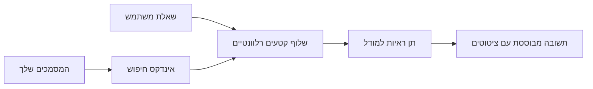

# ללמד את ה-AI לענות על שאלות על סמך המסמכים שלך:
## סידרה 1: RAG, Azure מול אלטרנטיבות בקוד פתוח, ומתי כיוונון עדין הגיוני

> המאמר הראשון בסידרה לשנת 2026 הסוקרת מחדש את המדריכים שלי מ-2023 על חיפוש AI של Azure + שאלות ותשובות על מסמכים עם Azure OpenAI.

## 1. מבוא - סקירה מחודשת של מדריך RAG מוקדם יותר

בשנת 2023, עבדתי על זוג מדריכים ללמד את ChatGPT לענות על שאלות מתוך מסמכי PDF באמצעות Azure AI Search ו-Azure OpenAI. כתבתי את [גרסת LangChain](https://techcommunity.microsoft.com/blog/educatordeveloperblog/teach-chatgpt-to-answer-questions-using-azure-ai-search--azure-openai-lang-chain/3969713), וגם שיתפתי פעולה בכתיבת [גרסת Semantic Kernel](https://techcommunity.microsoft.com/blog/educatordeveloperblog/teach-chatgpt-to-answer-questions-using-azure-ai-search--azure-openai-semantic-k/3985395) עם [לי סטוט](https://developer.microsoft.com/en-us/advocates/lee-stott), מנהל בכיר בתחום הענן במיקרוסופט. באותו זמן, הרעיון של "ChatGPT על הנתונים שלך" עדיין הרגיש חדש לרבים מהמפתחים. המדריכים השתמשו ב-Azure Blob Storage, Azure AI Search, Azure OpenAI, LangChain, Semantic Kernel ו-FAISS למטרות חיפוש וקטורי כדי לענות על שאלות מתוך קבצי PDF.

המאמר ההוא התמקד בזרימת עבודה פשוטה אך חשובה: להעלות מסמכים, לאנדקס אותם, לאחזר תוכן רלוונטי, ולבקש מהמודל לענות בהתבסס על תוכן זה.

בשנת 2026, מערכת RAG התרחבה משמעותית. Azure AI Search תומך כעת בדפוסי אחזור וקטוריים מודרניים והיברידיים, Azure OpenAI הוא חלק מהאקוסיסטם הרחב יותר של דגמי Foundry של מיקרוסופט, ו-API החדש v1 מאפשר שימוש בלקוח OpenAI סטנדרטי ללא צורך בשינויים חודשיים ב`api-version`. במקביל, אפשרויות קוד פתוח כמו LangGraph, LlamaIndex, Haystack, Qdrant, Milvus, Weaviate, Chroma, Ollama, ו-vLLM הפכו לבחירה מעשית למערכות RAG אמיתיות.

לכן רציתי לחזור לנושא זה. השאלה כבר אינה רק "איך בונים RAG?" אלא ישנן כעת דרכים רבות לבנות אותו, והשאלה החשובה יותר היא "איזה ארכיטקטורה לבחור עבור המצב שלי?"

אבל הבעיה המרכזית לא השתנתה.

מודל AI אינו יודע אוטומטית את המסמכים שלך. כדי לבנות מערכת שימושית לשאלות ותשובות על מסמכים, עדיין דרוש אחזור אמין, עיגון, הערכה וזרימות עבודה תפעוליות.

מאמר זה אינו מדריך נוסף "צ׳אט עם PDF" מקצה אל קצה. אני רוצה להתחיל את הסידרה המעודכנת הזו עם השאלה שאני מתעניין בה יותר כעת: מתי לבחור ארכיטקטורה מנוהלת של Azure, מתי לבחור אוסף RAG בקוד פתוח, ומתי כיוונון עדין אכן הגיוני?

זהו המאמר הראשון בסידרה על בניית מערכות AI המבוססות על מסמכים. בחלק הזה נתמקד בהחלטות ארכיטקטורה: מדוע RAG חשוב, מתי שירותי Azure מנוהלים מועילים, מתי אלטרנטיבות בקוד פתוח הגיוניות, ואיפה כיוונון עדין משתלב.

לאחר שבניתי וסקרתי מערכות שאלות ותשובות על מסמכים, אני פחות מעוניין באיזה כלי נראה הכי טוב בהדגמה ויותר מעוניין באיזו ארכיטקטורה שורדת משתמשים אמיתיים, מסמכים שמשתנים, הרשאות, תקלות ותחזוקה.

## 2. למה ה-AI שלך צריך מערכת חיפוש

מודלים שפתיים גדולים מאומנים על נתונים רחבים ציבוריים ורשויים. יתכן שהם יודעים הרבה על נושאים כלליים, אבל הם אינם יודעים אוטומטית את קבצי ה-PDF הפרטיים שלך, מדיניות פנימית, נוהלי ארגון, ארכיוני מחקר, חומרי כיתה, הערות תמיכה ללקוחות, או תיעוד שעודכן לאחרונה.

דרך פשוטה לחשוב על RAG היא כזו: במקום לצפות שהמודל יזכור כל מסמך, אנו נותנים לו מערכת חיפוש. כאשר משתמש שואל שאלה, המערכת מוצאת קודם את החלקים הרלוונטיים ביותר של מידע, ואז מעבירה את החלקים הללו למודל כהקשר.

זה חשוב כי מקורות ידע רבים בעולם האמיתי הם פרטיים, משתנים כל הזמן, רגישים להרשאות, מאוחסנים במערכות רבות, כתובים בפורמטים רבים, וגדולים מדי להדבקה ישירה לתוך פרומפט.

לדוגמה, אם לבית ספר, חברה או צוות מחקר יש 10,000 מסמכים פנימיים, המודל לא יוכל לענות מהם באופן אמין אלא אם המערכת תשאב את החלקים הנכונים בזמן הנכון.

זה מוביל טבעית לשאלה נפוצה:

למה לא פשוט לכוון את המודל?

כיוונון עדין יכול להיות שימושי, אבל הוא לרוב לא הכלי הראשון הנכון לידע ממסמכים. אם הידע משתנה לעיתים קרובות, אם הציטוטים חשובים, או אם הרשאות גישה חשובות, בדרך כלל עדיף להתחיל עם RAG. כיוונון עדין מתאים יותר ללימוד התנהגות, סגנון, פורמט פלט ודפוסי משימה.

## 3. ארכיטקטורת RAG במעשה

תאר לך שאתה בונה עוזר AI לבית ספר. העוזר צריך לענות על שאלות ממסמכי מדיניות PDF, מדריכי קורסים, דפי שאלות נפוצות פנימיים, והודעות שפורסמו לאחרונה.

אם תלמיד שואל, "האם אני יכול להשתמש ב-AI גנרטיבי במשימה הסופית שלי?", המערכת לא אמורה לענות מתוך הזיכרון הכללי של המודל. היא צריכה קודם למצוא את המדיניות הרלוונטית של בית הספר, לאחזר את הסעיף על שימוש ב-AI, ואז לבקש מהמודל לענות תוך שימוש בראיות הללו.

זה RAG בפועל.

ברמה גבוהה, אפשר לחשוב על הזרימה כך:

הפרטים יכולים להיות יותר מתוחכמים, אבל הרעיון הבסיסי פשוט: המודל לא עונה לבדו. הוא עונה עם ראיות שאוחזרו.

קודם, המסמכים מועלים ממערכות אחסון כגון Azure Blob Storage, SharePoint, GitHub או מערכת ניהול תוכן פנימית. לאחר מכן המערכת מפענחת אותם לטקסט תוך שמירה על מבנה שימושי כמו כותרות, מספרי עמודים, טבלאות, קטעים ומיקומי מקור.

לאחר מכן, התוכן מחולק לקטעים. שלב זה נשמע פשוט, אך הוא אחד מהחלקים החשובים ביותר במערכת. אם קטע קטן מדי, הוא עלול לאבד את ההקשר הסביבתי. אם קטע גדול מדי, הוא עלול לכלול מידע לא קשור ולהפחית דיוק באחזור.

לאחר פיצול לקטעים, המערכת יוצרת הטמעות (embeddings) ומאחסנת אותן באינדקס לחיפוש יחד עם הטקסט המקורי ומטא-נתונים כמו שם קובץ, מספר עמוד, הרשאות, גרסת מסמך ו-URL מקור.

כשמשתמש שואל שאלה, המערכת מאחזרת קטעים מועמדים באמצעות חיפוש מילות מפתח, חיפוש וקטורי, או חיפוש היברידי. כלי טיוב (reranker) יכול למיין מחדש את הקטעים כך שהראיות השימושיות ביותר יוצבו בראש.

לבסוף, המודל מקבל את השאלה ואת הראיות שאוחזרו. התשובה צריכה להיות מבוססת על הראיות האלו ולכלול ציטוטים כדי שהמשתמש יוכל לבדוק את המקור.

הנקודה החשובה היא ש-RAG אינו רק "לשים PDFs במסד נתונים וקטורי." איכות התשובה תלויה בכל זרימת העבודה: פיענוח, פיצול, אחזור, טיוב, יצירת פרומפט, ציטוט והערכה.

לכן מבנה המסמך חשוב. בקובץ PDF, כותרת, טבלה, הערת שוליים או גבול עמוד יכולים לשנות את משמעות הקטע. ב-Azure, מיומנות Document Layout משתמשת ביכולות פריסת מסמכים של Azure Document Intelligence ליצירת פלט מודע מבנה, מה שיכול לשפר את איכות הפיצול והאחזור עבור מערכות RAG.

## 4. מה השתנה מאז 2023?

המדריך מ-2023 היה נקודת התחלה טובה לזמנו:

- Azure Blob Storage אכסנם קבצי PDF.
- Azure AI Search אינדקסו תוכן.
- LangChain קישר בין אחזור ל-Azure OpenAI.
- FAISS שימש כמחסן וקטורים מקומי פשוט.
- הדוגמה השתמשה ב-`gpt-35-turbo` ו-`text-embedding-ada-002`.

בשנת 2026, גרסה מודרנית צריכה לשקף מספר שינויים.

קודם, האחזור התפתח. ב-2023, הרבה הדגמות השתמשו בחיפוש דמיון וקטורי פשוט. היום, אחזור היברידי הוא לרוב נקודת התחלה ברירת מחדל לשאלות ותשובות רציניות על מסמכים. Azure AI Search תומך בחיפוש היברידי שמשלב חיפוש מילות מפתח ווקטורים בבקשה אחת וממזג תוצאות באמצעות Reciprocal Rank Fusion. דרוג סמנטי יכול לטייב את תוצאות טקסט מלא, וקטורים, ותוצאות היברידיות.

שנית, הכנסת נתונים (ingestion) היא עכשיו מתוחכמת יותר. במקום לפצל כל מסמך ידנית בקוד היישום, Azure AI Search תומך בוקטוריזציה משולבת לפיצול, הטמעות, ווקטוריזציה בזמן שאילתא. עבור קבצי PDF ועומסי עבודה כבדים במסמכים, מיומנות Document Layout יכולה לשמור על יותר מבנה מאשר קטעים בגודל קבוע.

שלישית, האורקסטרציה חשובה יותר. החלק הקשה לרוב אינו קריאת API של LLM עצמה. החלק הקשה הוא טיפול בכשלים, ניסיונות חוזרים, אחזור מיושן, איכות הקטעים, זרימות עבודה ארוכות, סקירה אנושית והערכה בקנה מידה רחב. כאן כלים מוכווני זרימות עבודה כמו LangGraph, זרימות עבודה ב-LlamaIndex, צינורות ב-Haystack וכלי הערכה ותצפית ברמת הפלטפורמה רלוונטיים יותר משרשרת ליניארית בודדת.

רביעית, הערכה כבר לא אופציונלית. הדגמה יכולה להיראות מרשימה עם שאלה אחת. מערכת הפקה זקוקה למערכי מבחן, בדיקות רגרסיה, מדדי אחזור, בדיקות עיגון וניטור. בלי הערכה, קשה לדעת האם המערכת משתפרת או רק משתנה.

## 5. בחירה בין Azure ו-RAG בקוד פתוח

אני לא חושב שהשאלה השימושית היא "האם Azure טוב יותר מקוד פתוח?" או "האם קוד פתוח טוב יותר מ-Azure?"

השאלה השימושית היא: איזה סוג מערכת אתה בונה, מי יפעיל אותה, אילו מגבלות יש לך, ואילו מצבי תקלות אינם ניתנים לקבלה?

כשהתחלתי לבנות דוגמאות לשאלות ותשובות על מסמכים, בעיקר חשבתי האם האחזור עובד. האם могу להעלות PDFs, לחפש בהם וליצור תשובה? זו הייתה נקודת התחלה סבירה.

אחרי שנסעתי דרך זרימות עבודה אמיתיות יותר של AI, ההערכה שלי השתנתה. אני בודק עכשיו ארבעה דברים לפני בחירת ערכת RAG:

- זהות והרשאות
- איכות אחזור
- אמינות זרימת עבודה
- בעלות תפעולית

ארבעת התחומים האלה נותנים הרבה יותר מידע מאשר מדד ביצועים של מודל לבד.

ארכיטקטורות מבוססות Azure לרוב הגיוניות כשהאינטגרציה הארגונית היא החלק הקשה. אם צוות כבר תלוי ב-Microsoft Entra ID, Microsoft 365, Azure Storage, רשת פרטית, RBAC וניטור Azure, Azure AI Search ו-Azure OpenAI יכולים לצמצם הרבה מורכבות תפעולית. בסביבה כזו, Azure הוא לא רק API למודל. הערך הוא במערכת הסובבת: זהות, ממשל, חיפוש מנוהל, אינטגרציית אבטחה, תמיכה ותפעול מוכר.

ארכיטקטורות בקוד פתוח לרוב הגיוניות כשהגמישות היא החלק הקשה. אם הצוות צריך הסקה מקומית, ניידות ענן, צינור אחזור מותאם, טיוב מיוחד או שליטה ישירה על מסד נתונים וקטורי ושכבת שירות מודל, אוסף בקוד פתוח יכול להתאים יותר. הפשרה היא שהצוות אחראי יותר על אמינות: גיבויים, סקיילינג, השהיות, העברות, ניטור ואבטחה.

בפועל, מערכות AI רבות להפקה אינן נטולות ענן או נטולות קוד פתוח באופן טהור. הן לעיתים מערכות היברידיות שמאזנות פשטות תפעולית, ניידות, ממשל וגמישות הנדסית.

לדוגמה, לא אפתיע לראות מערכת שמשתמשת ב-Azure OpenAI לגישה למודל, LangGraph לאורקסטרציית זרימות עבודה, אירוח Azure לפריסה, ומסד נתונים וקטורי בקוד פתוח לדרישת אחזור מסוימת. זה לא סתירה ארכיטקטונית. זו בחירה ברמת שירות מנוהל ושליטה הנדסית מתאימה לכל חלק במערכת.

אני אוהב ארכיטקטורות היברידיות כאשר הפלטפורמה המנוהלת פותרת בעיות ארגוניות חשובות, בעוד רכיבי קוד פתוח נותנים לצוות גמישות איפה שזה באמת חשוב.

## 6. מדריך החלטות פרקטי

זו טבלת ההחלטות שהייתי משתמש איתה עם צוות לפני בחירת ערכת RAG:

| תחום החלטה | ערכת Azure מנוהלת חזקה יותר כאשר... | ערכת קוד פתוח חזקה יותר כאשר... |
| --- | --- | --- |
| זהות וגישה | Entra ID, RBAC, זהות מנוהלת והרשאות ארגוניות מרכזיות | אימות מותאם, זהות שאינה מיקרוסופט או לוגיקת גישה ספציפית לאפליקציה שולטות |
| תפעול | הצוות רוצה תשתית מנוהלת, תמיכה, SLA והטמעה פשוטה | הצוות יכול להפעיל מסדי נתונים וקטוריים, שירות מודלים, גיבויים וסקיילינג |
| אחזור | חיפוש היברידי, דרוג סמנטי, סינונים וחיפוש במטא-נתונים מכסים רוב הצרכים | הצוות זקוק לאחזור מותאם, טיוב מיוחד או אינדוקס ניסיוני |
| ניידות | התאמת אקוסיסטם Azure מקובלת או מועדפת | הימנעות מנעילת ענן היא דרישה קשה |
| הסקה | ממשל, רשת ובקרות ארגוניות של Azure OpenAI חשובים | הסקה מקומית, מודלים מותאמים או שירות עצמי נדרשים |
| עלות | צמצום מאמץ הנדסי ותפעולי חשוב יותר מאופטימיזציית תשתית | בהיקף רחב מספיק להצדיק מיטוב תשתיתי זהיר |
| ניסויים | יציבות ואינטגרציה ארגונית חשובים יותר מהחלפת רכיבים תכופה | הצוות מפתח במהירות סוכנים, כלים, זיכרון וזרימות אחזור |

הכלל האצבע שלי פשוט:

- התחל עם Azure כשאינטגרציה ארגונית, אבטחה ופשטות תפעולית הן הסיכונים המרכזיים.
- התחל עם קוד פתוח כשניידות, התאמה אישית או שליטה מקומית הן הסיכונים המרכזיים.
- השתמש בערכה היברידית כשהשניים נכונים.

זו גם הסיבה שלא הייתי מתחיל סידרת RAG בשנת 2026 עם קוד ראשית. הקוד חשוב, אבל הבחירה בארכיטקטורה באה לפני היישום. הדגמה פשוטה יכולה להסתיר את הבחירות הקשות. מערכת RAG טובה עושה את הבחירות האלה מפורשות.

## 7. איפה כיוונון עדין משתלב

כיוונון עדין מוזכר לעיתים קרובות יחד עם RAG, אבל לדעתי חשוב להפריד ביניהם.

RAG הוא לרוב הבחירה הטובה יותר כשמערכת זקוקה לידע טרי, פרטי, רגיש להרשאות או מבוסס מקור. אם התשובה צריכה לצטט מסמכים, לשקף עדכונים אחרונים או לכבד חוקי גישה ספציפיים למשתמש, האחזור צריך להיות חלק מהארכיטקטורה.

כיוונון עדין שימושי יותר כשידע אינו הבעיה המרכזית. הוא יכול לעזור כשמעוניינים שהמודל יעקוב אחר פורמט פלט ספציפי, יתאים סגנון תגובה בתחום מסוים, יבצע משימה יציבה בעקביות או יקטין את כמות ההוראות הנדרשת בכל פרומפט.
בפועל, השניים יכולים לעבוד יחד. עוזר תמיכה עשוי להשתמש ב-RAG כדי לשלוף את המדיניות העדכנית ביותר, בעוד שמודל מוּתאם לומד את מבנה התשובה והטון המועדף של החברה.

הטעות היא להתייחס לדיוק עדין כהחלפה לאחסון מסמכים. זה לא מסיר את הצורך בשליפה כאשר המערכת חייבת לענות מנתונים טריים, פרטיים או רגישים להרשאות.

## 8. לאן הסדרה הזו מתקדמת הלאה

מאמר זה הוא השכבה של קבלת ההחלטות. לפני כתיבת קוד, רציתי להבהיר את הפשרות: RAG מול דיוק עדין, Azure מול קוד פתוח, שירותים מנוהלים מול שליטה תפעולית.

לפני המעבר ליישום, אני רוצה להשאיר כאן נקודה אחת: במערכות AI ארגוניות רבות, המודל הוא רק רכיב אחד. איכות השליפה, התזמור, ההערכה, ההרשאות והאמינות התפעולית הם לעיתים הגורמים שמחליטים האם המערכת מצליחה מעבר לשלב ההדגמה.

במרכזי הסדרה הבאים, אני מתכנן להעמיק לצד המעשי של מערכות AI מבוססות מסמכים: איך לבנות ארכיטקטורה מבוססת Azure, איך חלופות בקוד פתוח משתוות במציאות, ואיך להעריך האם מערכת RAG באמת עובדת.

אני עשוי לשנות את הסדר ככל שהסדרה מתפתחת, אך המטרה תישאר זהה: לעבור מעבר להדגמה פשוטה ולהראות איך לחשוב על מערכות RAG שניתן לתחזק, להעריך ולהפעיל.

## 9. הפניות ומשאבים

מדריכים מקוריים:

- [Teach ChatGPT to Answer Questions: Using Azure AI Search & Azure OpenAI (Lang Chain)](https://techcommunity.microsoft.com/blog/educatordeveloperblog/teach-chatgpt-to-answer-questions-using-azure-ai-search--azure-openai-lang-chain/3969713)
- [Teach ChatGPT to Answer Questions: Using Azure AI Search & Azure OpenAI (Semantic Kernel)](https://techcommunity.microsoft.com/blog/educatordeveloperblog/teach-chatgpt-to-answer-questions-using-azure-ai-search--azure-openai-semantic-k/3985395)

Azure:

- [Azure AI Search REST API versions](https://learn.microsoft.com/en-us/rest/api/searchservice/search-service-api-versions)
- [Hybrid search in Azure AI Search](https://learn.microsoft.com/en-us/azure/search/hybrid-search-how-to-query)
- [Integrated vectorization in Azure AI Search](https://learn.microsoft.com/en-us/azure/search/vector-search-integrated-vectorization)
- [Document Layout skill in Azure AI Search](https://learn.microsoft.com/en-us/azure/search/cognitive-search-skill-document-intelligence-layout)
- [Chunk and vectorize by document layout](https://learn.microsoft.com/en-us/azure/search/search-how-to-semantic-chunking)
- [Semantic ranking in Azure AI Search](https://learn.microsoft.com/en-us/azure/search/semantic-search-overview)
- [Azure OpenAI / Microsoft Foundry API version lifecycle](https://learn.microsoft.com/en-us/azure/foundry/openai/api-version-lifecycle)
- [Foundry Models sold by Azure](https://learn.microsoft.com/en-us/azure/foundry/foundry-models/concepts/models-sold-directly-by-azure)
- [Microsoft Foundry fine-tuning considerations](https://learn.microsoft.com/en-us/azure/foundry/openai/concepts/fine-tuning-considerations)
- [Microsoft Foundry observability](https://learn.microsoft.com/en-us/azure/foundry/concepts/observability)
- [Run evaluations in Microsoft Foundry](https://learn.microsoft.com/en-us/azure/foundry/how-to/evaluate-generative-ai-app)

קוד פתוח:

- [LangGraph documentation](https://docs.langchain.com/oss/python/langgraph/overview)
- [LlamaIndex documentation](https://developers.llamaindex.ai/python/framework/)
- [Haystack documentation](https://docs.haystack.deepset.ai/)
- [Qdrant documentation](https://qdrant.tech/documentation/overview/)
- [Milvus documentation](https://milvus.io/docs/overview.md)
- [Weaviate documentation](https://docs.weaviate.io/weaviate/current/)
- [Chroma documentation](https://docs.trychroma.com/docs/overview/introduction)
- [Ollama embeddings](https://docs.ollama.com/capabilities/embeddings)
- [vLLM OpenAI-compatible server](https://docs.vllm.ai/en/latest/serving/openai_compatible_server.html)
- [BGE embedding models](https://huggingface.co/BAAI/bge-large-en-v1.5)
- [E5 embedding models](https://huggingface.co/intfloat/e5-large-v2)
- [Instructor embedding models](https://huggingface.co/hkunlp/instructor-large)

---

<!-- CO-OP TRANSLATOR DISCLAIMER START -->
**כתב ויתור**:
מסמך זה תורגם באמצעות שירות תרגום אוטומטי [Co-op Translator](https://github.com/Azure/co-op-translator). למרות שאנו שואפים לדיוק, יש לקחת בחשבון שתרגומים אוטומטיים עלולים להכיל שגיאות או אי-דיוקים. יש להחשיב את המסמך המקורי בשפתו הטבעית כמקור הסמכות. למידע קריטי מומלץ להשתמש בתרגום מקצועי על ידי מתרגם אדם. אנו לא אחראים לכל אי-הבנה או פירוש שגוי הנובע מהשימוש בתרגום זה.
<!-- CO-OP TRANSLATOR DISCLAIMER END -->