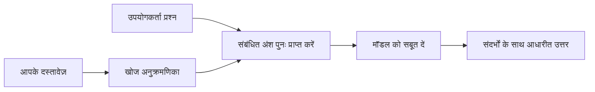

# अपने दस्तावेज़ों के आधार पर प्रश्नों के उत्तर देने के लिए AI को शिक्षित करें:
## सीरीज 1: RAG, Azure बनाम ओपन-सोर्स विकल्प, और जब फाइन-ट्यूनिंग मायने रखती है

> 2026 की श्रृंखला में पहला लेख जो मेरे 2023 Azure AI Search + Azure OpenAI डॉक्यूमेंट QA ट्यूटोरियल को पुनः देखता है।

श्रृंखला नेविगेशन: [रिपॉजिटरी होम](../README.md) | अगला: [सीरीज 2 - एक स्थानीय ओपन-सोर्स RAG सिस्टम एंड टू एंड बनाएँ](./series-2-open-source-rag-end-to-end.md)

## 1. परिचय - एक पूर्व RAG ट्यूटोरियल को पुनः देखना

2023 में, मैंने Azure AI Search और Azure OpenAI का उपयोग करके PDF दस्तावेज़ों से प्रश्नों के उत्तर देने के लिए ChatGPT को प्रशिक्षित करने के बारे में दो ट्यूटोरियल पर काम किया। मैंने [LangChain संस्करण](https://techcommunity.microsoft.com/blog/educatordeveloperblog/teach-chatgpt-to-answer-questions-using-azure-ai-search--azure-openai-lang-chain/3969713) लिखा, और मैंने [Lee Stott](https://developer.microsoft.com/en-us/advocates/lee-stott), जो माइक्रोसॉफ्ट में प्रिंसिपल क्लाउड एडवोकेट मैनेजर हैं, के साथ साथी [Semantic Kernel संस्करण](https://techcommunity.microsoft.com/blog/educatordeveloperblog/teach-chatgpt-to-answer-questions-using-azure-ai-search--azure-openai-semantic-k/3985395) भी सह-लेखा। उस समय, "ChatGPT आपके डेटा पर" का विचार कई डेवलपर्स के लिए अभी भी नया था। ट्यूटोरियल ने Azure Blob Storage, Azure AI Search, Azure OpenAI, LangChain, Semantic Kernel, और FAISS-शैली के वेक्टर पुनःप्राप्ति का उपयोग किया।

उस पहले लेख में एक सरल लेकिन महत्वपूर्ण कार्यप्रवाह पर ध्यान केंद्रित किया गया था: दस्तावेज़ अपलोड करें, उन्हें अनुक्रमित करें, प्रासंगिक सामग्री पुनःप्राप्त करें, और उस सामग्री के आधार पर मॉडल से उत्तर पूछें।

2026 में, RAG पारिस्थितिकी तंत्र में काफी विस्तार हुआ है। Azure AI Search अब आधुनिक वेक्टर और हाइब्रिड पुनःप्राप्ति पैटर्न का समर्थन करता है, Azure OpenAI व्यापक Microsoft Foundry Models पारिस्थितिकी तंत्र का हिस्सा है, और नया v1 API बिना मासिक `api-version` बदलाव की आवश्यकता के मानक OpenAI क्लाइंट का उपयोग कर सकता है। इसी समय, LangGraph, LlamaIndex, Haystack, Qdrant, Milvus, Weaviate, Chroma, Ollama, और vLLM जैसे ओपन-सोर्स विकल्प वास्तविक RAG सिस्टम के लिए व्यावहारिक विकल्प बन गए हैं।

इसीलिए मैं इस विषय को फिर से देखना चाहता था। सवाल अब केवल "मैं RAG कैसे बनाऊं?" नहीं है। अब इसे बनाने के कई तरीके हैं, और अधिक महत्वपूर्ण सवाल यह है "मैं अपनी स्थिति के लिए कौन सा आर्किटेक्चर चुनूं?"

लेकिन मूल समस्या नहीं बदली है।

एक AI मॉडल स्वचालित रूप से आपके दस्तावेज़ नहीं जानता। उपयोगी दस्तावेज़-प्रश्न-उत्तर प्रणाली बनाने के लिए, आपको अभी भी भरोसेमंद पुनःप्राप्ति, ग्राउंडिंग, मूल्यांकन, और संचालन कार्यप्रवाह की आवश्यकता होती है।

यह लेख एक और एंड-टू-एंड "PDF के साथ चैट करें" ट्यूटोरियल नहीं है। मैं इस अपडेटेड श्रृंखला की शुरुआत उस प्रश्न के साथ करना चाहता हूँ जो अब मेरे लिए अधिक महत्वपूर्ण है: कब आप एक प्रबंधित Azure आर्किटेक्चर चुनें, कब आप एक ओपन-सोर्स RAG स्टैक चुनें, और कब फाइन-ट्यूनिंग वास्तव में मायने रखती है?

यह दस्तावेज़-आधारित AI सिस्टम बनाने के बारे में एक श्रृंखला का पहला लेख है। इस पहले भाग में, हम आर्किटेक्चर निर्णयों पर ध्यान देंगे: क्यों RAG महत्वपूर्ण है, Azure आधारित प्रबंधित सेवाएँ कब उपयोगी हैं, ओपन-सोर्स विकल्प कब उपयुक्त हैं, और फाइन-ट्यूनिंग कहां फिट बैठती है।

दस्तावेज़ QA सिस्टम बनाने और पुनः देखने के बाद, मेरी रुचि अब केवल यह देखने में नहीं है कि कौन सा उपकरण डेमो में सबसे अच्छा दिखता है, बल्कि यह देखना है कि कौन सा आर्किटेक्चर वास्तविक उपयोगकर्ताओं, बदलते दस्तावेज़ों, अनुमतियों, विफलताओं, और रखरखाव में टिकता है।

## 2. आपकी AI को खोज प्रणाली की आवश्यकता क्यों है

बड़े भाषा मॉडल व्यापक सार्वजनिक और लाइसेंस प्राप्त डेटा पर प्रशिक्षित होते हैं। वे सामान्य विषयों के बारे में बहुत कुछ जान सकते हैं, लेकिन वे स्वचालित रूप से आपके निजी PDF, आंतरिक नीतियाँ, उद्यम प्रक्रियाएँ, अनुसंधान अभिलेखागार, कक्षा सामग्री, ग्राहक सहायता नोट, या हाल ही में अपडेट की गई डॉक्यूमेंटेशन नहीं जानते।

RAG के बारे में सरलता से सोचने का एक तरीका यह है: मॉडल से अपेक्षा न करें कि वह हर दस्तावेज़ को याद रखे, इसके बजाय हम इसे एक खोज प्रणाली देते हैं। जब कोई उपयोगकर्ता प्रश्न पूछता है, तो सिस्टम सबसे प्रासंगिक जानकारी के टुकड़े पहले पाता है, फिर उन टुकड़ों को संदर्भ के रूप में मॉडल को देता है।

यह इसलिए मायने रखता है क्योंकि कई वास्तविक ज्ञान स्रोत निजी, लगातार बदलते, अनुमतिसंवेदनशील, कई प्रणालियों में संग्रहीत, कई स्वरूपों में लिखे गए, और सीधे प्रॉम्प्ट में चिपकाने के लिए बहुत बड़े होते हैं।

उदाहरण के लिए, यदि किसी स्कूल, कंपनी, या अनुसंधान टीम के पास 10,000 आंतरिक दस्तावेज़ हैं, तो मॉडल उन दस्तावेज़ों से विश्वसनीय उत्तर नहीं दे सकता जब तक कि सिस्टम सही समय पर सही भागों को पुनःप्राप्त न करे।

यह स्वाभाविक रूप से एक सामान्य प्रश्न की ओर ले जाता है:

क्यों मॉडल को सिर्फ फाइन-ट्यून न करें?

फाइन-ट्यूनिंग उपयोगी हो सकती है, लेकिन यह आमतौर पर दस्तावेज़ ज्ञान के लिए पहला सही उपकरण नहीं होती। यदि ज्ञान अक्सर बदलता है, यदि उद्धरण महत्वपूर्ण हैं, या यदि एक्सेस परमिशन महत्वपूर्ण हैं, तो RAG आमतौर पर बेहतर शुरुआती बिंदु होता है। फाइन-ट्यूनिंग व्यवहार, शैली, आउटपुट फॉर्मेट, और कार्य पैटर्न सिखाने के लिए बेहतर होता है।

## 3. व्यावहारिक रूप में RAG आर्किटेक्चर

कल्पना करें कि आप एक स्कूल के लिए AI सहायक बना रहे हैं। सहायक को पॉलिसी PDF, कोर्स गाइड, आंतरिक FAQ पृष्ठ, और हाल ही में अपडेट की गई घोषणाओं से प्रश्नों के उत्तर देने होंगे।

यदि कोई छात्र पूछता है, "क्या मैं अपनी अंतिम असाइनमेंट के लिए जनरेटिव AI का उपयोग कर सकता हूँ?", तो सिस्टम मॉडल की सामान्य स्मृति से उत्तर नहीं देना चाहिए। इसे पहले संबंधित स्कूल पॉलिसी खोजनी चाहिए, AI उपयोग के बारे में अनुभाग पुनःप्राप्त करना चाहिए, और फिर मॉडल से उस सबूत का उपयोग करके उत्तर पूछना चाहिए।

यही RAG व्यावहारिक रूप में है।

सुनिश्चित स्तर पर, आप प्रवाह को इस तरह सोच सकते हैं:

विवरण और अधिक जटिल हो सकते हैं, लेकिन मूल विचार सरल है: मॉडल अकेले उत्तर नहीं देता। यह पुनःप्राप्त सबूत के साथ उत्तर देता है।

पहले, दस्तावेज़ों को Azure Blob Storage, SharePoint, GitHub, या किसी आंतरिक CMS जैसे भंडारण प्रणालियों से उपयोग किया जाता है। फिर सिस्टम उन्हें पाठ में पार्स करता है जबकि उपयोगी संरचना जैसे शीर्षक, पृष्ठ संख्या, तालिकाएँ, अनुभाग, और स्रोत स्थान को संरक्षित करता है।

अगला, सामग्री को टुकड़ों में विभाजित किया जाता है। यह चरण सरल लगता है, लेकिन यह सिस्टम के सबसे महत्वपूर्ण हिस्सों में से एक है। अगर कोई टुकड़ा बहुत छोटा हो, तो यह आसपास के संदर्भ को खो सकता है। अगर टुकड़ा बहुत बड़ा हो, तो इसमें अप्रासंगिक जानकारी शामिल हो सकती है और पुनःप्राप्ति कम सटीक हो सकती है।

टुकड़ों में विभाजन के बाद, सिस्टम एम्बेडिंग बनाता है और उन्हें खोज योग्य इंडेक्स में मूल पाठ और मेटाडेटा जैसे फ़ाइल नाम, पृष्ठ संख्या, अनुमतियाँ, दस्तावेज़ संस्करण, और स्रोत URL के साथ संग्रहीत करता है।

जब उपयोगकर्ता कोई प्रश्न पूछता है, तो सिस्टम कीवर्ड खोज, वेक्टर खोज, या हाइब्रिड खोज का उपयोग करके उम्मीदवार टुकड़े प्राप्त करता है। एक रीरेन्कर फिर उन टुकड़ों को पुनः क्रमबद्ध कर सकता है ताकि सबसे उपयोगी सबूत ऊपर रखा जाए।

अंत में, मॉडल प्रश्न और पुनःप्राप्त सबूत प्राप्त करता है। उत्तर उस सबूत में आधारित होना चाहिए और उद्धरण लौटाने चाहिए ताकि उपयोगकर्ता स्रोत की जाँच कर सके।

महत्वपूर्ण बात यह है कि RAG केवल "PDF को वेक्टर डेटाबेस में डालना" नहीं है। उत्तर की गुणवत्ता पूरे कार्यप्रवाह पर निर्भर करती है: पार्सिंग, टुकड़ों में विभाजन, पुनःप्राप्ति, पुनः क्रमबद्ध करना, प्रॉम्प्टिंग, उद्धरण, और मूल्यांकन।

इसीलिए दस्तावेज़ की संरचना मायने रखती है। PDF में, एक शीर्षक, तालिका, फुटनोट, या पृष्ठ सीमा किसी अनुच्छेद के अर्थ को बदल सकती है। Azure पर, Document Layout स्किल Azure Document Intelligence लेआउट क्षमताओं का उपयोग करके संरचना-संवेदनशील आउटपुट उत्पन्न करता है, जो RAG सिस्टम के लिए टुकड़ा विभाजन और पुनःप्राप्ति गुणवत्ता को सुधार सकता है।

## 4. 2023 के बाद क्या बदला?

2023 का ट्यूटोरियल अपने समय के लिए एक अच्छा शुरुआती बिंदु था:

- Azure Blob Storage में PDF फ़ाइलें संग्रहीत की गईं।
- Azure AI Search ने सामग्री को अनुक्रमित किया।
- LangChain ने पुनःप्राप्ति को Azure OpenAI से जोड़ा।
- FAISS एक सरल स्थानीय वेक्टर स्टोर के रूप में काम करता था।
- उदाहरण में `gpt-35-turbo` और `text-embedding-ada-002` का उपयोग किया गया।

2026 में, एक आधुनिक संस्करण कई बदलावों को प्रतिबिंबित करना चाहिए।

पहला, पुनःप्राप्ति परिपक्व हो गई है। 2023 में, कई डेमो सरल वेक्टर समानता खोज का उपयोग करते थे। आज, गंभीर दस्तावेज़ QA के लिए हाइब्रिड पुनःप्राप्ति अक्सर डिफ़ॉल्ट प्रारंभिक बिंदु है। Azure AI Search कीवर्ड और वेक्टर क्वेरी दोनों को एक अनुरोध में संयोजित करके हाइब्रिड खोज का समर्थन करता है और Reciprocal Rank Fusion के साथ परिणामों का समेकन करता है। सेमांटिक रैंकर फिर पूर्ण-पाठ, वेक्टर, और हाइब्रिड परिणामों के टेक्स्ट पक्ष को पुनः क्रमित कर सकता है।

दूसरा, संग्रहण अधिक परिष्कृत हो गया है। हर दस्तावेज़ को आवेदन कोड के साथ मैन्युअल रूप से विभाजित करने के बजाय, Azure AI Search चंकिंग, एम्बेडिंग, और क्वेरी-समय वेक्टराइजेशन के लिए एकीकृत वेक्टराइजेशन का समर्थन करता है। PDF और दस्तावेज-मुख्य वर्कलोड के लिए, Document Layout स्किल फिक्स्ड-साइज़ टुकड़ों से अधिक संरचना संरक्षित कर सकता है।

तीसरा, समन्वयन अधिक महत्वपूर्ण हो गया है। कठिन भाग अक्सर LLM API कॉल खुद नहीं होता। कठिनाई विफलताओं, पुनःप्रयासों, पुरानी पुनःप्राप्ति, टुकड़ा गुणवत्ता, लंबे समय तक चलने वाले कार्यप्रवाह, मानवीय समीक्षा, और पैमाने पर मूल्यांकन को संभालना है। ऐसे में LangGraph, LlamaIndex कार्यप्रवाह, Haystack पाइपलाइनों, और प्लेटफ़ॉर्म-स्तरीय मूल्यांकन और अवलोकन उपकरण जैसे कार्यप्रवाह-केंद्रित उपकरण एकल रैखिक श्रृंखला की तुलना में अधिक प्रासंगिक हो जाते हैं।

चौथा, मूल्यांकन अब वैकल्पिक नहीं है। एक प्रश्न के साथ डेमो प्रभावशाली दिख सकता है। एक उत्पादन प्रणाली को परीक्षण सेट, प्रतिगमन जांच, पुनःप्राप्ति मीट्रिक, ग्राउंडेडनेस जांच, और निगरानी की आवश्यकता होती है। बिना मूल्यांकन के यह पता लगाना मुश्किल है कि सिस्टम बेहतर हो रहा है या केवल बदल रहा है।

## 5. Azure और ओपन-सोर्स RAG स्टैक्स के बीच चयन

मेरा नहीं ख़याल है कि उपयोगी सवाल है "क्या Azure ओपन सोर्स से बेहतर है?" या "क्या ओपन सोर्स Azure से बेहतर है?"

उपयोगी सवाल यह है: आप किस प्रकार की प्रणाली बना रहे हैं, कौन इसका संचालन करेगा, आपके क्या प्रतिबंध हैं, और कौन से विफलता मोड अस्वीकार्य हैं?

जब मैंने दस्तावेज़ QA उदाहरण बनाना शुरू किया, तो मैं ज्यादातर सोचता था कि क्या पुनःप्राप्ति काम करती है। क्या मैं PDF अपलोड कर सकता हूँ, उन्हें खोज सकता हूँ, और उत्तर जेनरेट कर सकता हूँ? यह एक उचित शुरुआती बिंदु था।

अधिक यथार्थवादी AI कार्यप्रवाहों पर काम करने के बाद, मेरी मूल्यांकन बदल गई। अब मैं RAG स्टैक चुनने से पहले चार चीज़ों पर देखता हूँ:

- पहचान और अनुमतियाँ
- पुनःप्राप्ति गुणवत्ता
- कार्यप्रवाह विश्वसनीयता
- संचालन स्वामित्व

ये चार क्षेत्र केवल मॉडल बेंचमार्क से कहीं अधिक बताते हैं।

Azure-आधारित आर्किटेक्चर आमतौर पर तब समझ में आते हैं जब उद्यम एकीकरण कठिन होता है। यदि कोई टीम पहले से Microsoft Entra ID, Microsoft 365, Azure Storage, निजी नेटवर्किंग, RBAC, और Azure मॉनिटरिंग पर निर्भर है, तो Azure AI Search और Azure OpenAI संचालन जटिलता को बहुत हद तक कम कर सकते हैं। उस वातावरण में, Azure केवल मॉडल API नहीं है। मूल्य आस-पास के सिस्टम में है: पहचान, शासन, प्रबंधित खोज, सुरक्षा एकीकरण, समर्थन, और परिचित संचालन।

ओपन-सोर्स आर्किटेक्चर आमतौर पर तब उपयोगी होते हैं जब लचीलापन कठिन होता है। यदि टीम को स्थानीय अनुमान, क्लाउड पोर्टेबिलिटी, कस्टम पुनःप्राप्ति पाइपलाइन, विशिष्ट रीरेन्किंग, या वेक्टर डेटाबेस और मॉडल-सेवा परत पर सीधे नियंत्रण की आवश्यकता है, तो ओपन-सोर्स स्टैक बेहतर फिट हो सकता है। इस आदान-प्रदान के तहत टीम अधिक विश्वसनीयता कार्य जैसे बैकअप, स्केलिंग, विलंबता, माइग्रेशन, निगरानी, और सुरक्षा की जिम्मेदारी लेती है।

अभ्यास में, कई उत्पादन AI सिस्टम पूर्णत: क्लाउड-नेटिव या पूर्णत: ओपन-सोर्स नहीं होते। वे अक्सर हाइब्रिड सिस्टम होते हैं जो संचालन सरलता, पोर्टेबिलिटी, शासन, और इंजीनियरिंग लचीलापन संतुलित करते हैं।

उदाहरण के लिए, मुझे आश्चर्य नहीं होगा यदि कोई सिस्टम मॉडल पहुँच के लिए Azure OpenAI, कार्यप्रवाह समन्वयन के लिए LangGraph, परिनियोजन के लिए Azure होस्टिंग, और विशिष्ट पुनःप्राप्ति आवश्यकताओं के लिए एक ओपन-सोर्स वेक्टर डेटाबेस का उपयोग करता हो। यह आर्किटेक्चरल असंगति नहीं है। यह सिस्टम के प्रत्येक भाग के लिए सही प्रबंधित सेवा और इंजीनियरिंग नियंत्रण का चयन है।

मैं हाइब्रिड आर्किटेक्चर पसंद करता हूँ जब प्रबंधित प्लेटफ़ॉर्म महत्वपूर्ण उद्यम समस्याओं को हल करता है, जबकि ओपन-सोर्स घटक टीम को जहां वास्तव में मायने रखता है, वहाँ लचीलापन देते हैं।

## 6. एक व्यावहारिक निर्णय गाइड

यहाँ निर्णय तालिका है जिसे मैं RAG स्टैक चुनने से पहले टीम के साथ उपयोग करता:

| निर्णय क्षेत्र | Azure प्रबंधित स्टैक तेज़ होता है जब... | ओपन-सोर्स स्टैक तेज़ होता है जब... |
| --- | --- | --- |
| पहचान और पहुँच | Entra ID, RBAC, प्रबंधित पहचान, और उद्यम अनुमतियाँ केंद्रीय हैं | कस्टम प्रमाणीकरण, गैर-Microsoft पहचान, या ऐप-विशिष्ट पहुँच लॉजिक प्रभुत्व रखता है |
| संचालन | टीम को प्रबंधित अवसंरचना, समर्थन, SLA, और सरल ऑनबोर्डिंग चाहिए | टीम वेक्टर डेटाबेस, मॉडल सेवा, बैकअप, और स्केलिंग संचालित कर सकती है |
| पुनःप्राप्ति | हाइब्रिड खोज, सेमांटिक रैंकिंग, फ़िल्टर, और मेटाडेटा खोज अधिकांश आवश्यकताओं को पूरा करते हैं | टीम को कस्टम पुनःप्राप्ति, विशिष्ट रीरेन्किंग, या प्रयोगात्मक इंडेक्सिंग की आवश्यकता है |
| पोर्टेबिलिटी | Azure इकोसिस्टम के अनुसार चलना स्वीकार्य या पसंदीदा है | क्लाउड लॉक-इन से बचना आवश्यक बाध्यता है |
| अनुमान | Azure OpenAI शासन, नेटवर्किंग, और उद्यम नियंत्रण मायने रखते हैं | स्थानीय अनुमान, कस्टम मॉडल, या स्व-होस्टेड सेवा आवश्यक है |
| लागत | इंजीनियरिंग और संचालन प्रयास कम करना अवसंरचना ट्यूनिंग से अधिक महत्वपूर्ण है | पैमाना इतना बड़ा है कि सावधानीपूर्वक अवसंरचना अनुकूलन जायज़ हो |
| प्रयोग | स्थिरता और उद्यम एकीकरण अक्सर बदलने वाले घटकों से अधिक महत्वपूर्ण है | टीम एजेंट, उपकरण, मेमोरी, और पुनःप्राप्ति कार्यप्रवाहों पर तेजी से पुनरावृत्त कर रही है |

मेरा सरल नियम है:

- जब उद्यम एकीकरण, सुरक्षा, और संचालन सरलता मुख्य जोखिम हों, तब Azure से शुरू करें।
- जब पोर्टेबिलिटी, अनुकूलन, या स्थानीय नियंत्रण मुख्य जोखिम हों, तब ओपन सोर्स से शुरू करें।
- जब दोनों सच हों, तब हाइब्रिड स्टैक का उपयोग करें।

इसीलिए मैं 2026 की RAG श्रृंखला को पहले कोड से शुरू नहीं करता। कोड महत्वपूर्ण है, लेकिन आर्किटेक्चर चयन कार्यान्वयन से पहले आता है। एक सरल डेमो सबसे कठिन विकल्पों को छुपा सकता है। एक अच्छा RAG सिस्टम उन विकल्पों को स्पष्ट करता है।

## 7. फाइन-ट्यूनिंग कहां फिट बैठती है

फाइन-ट्यूनिंग अक्सर RAG के साथ एक साथ उल्लेखित होती है, लेकिन मेरा मानना है कि दोनों को अलग करना आवश्यक है।

जब सिस्टम को ताजा, निजी, अनुमतिसंवेदनशील, या स्रोत-ग्राउंडेड ज्ञान की आवश्यकता होती है, तो RAG आमतौर पर बेहतर विकल्प होता है। यदि उत्तर दस्तावेज़ों का हवाला देना चाहिए, हाल के अपडेट दर्शाने चाहिए, या उपयोगकर्ता-विशिष्ट पहुँच नियमों का सम्मान करना चाहिए, तो पुनःप्राप्ति आर्किटेक्चर का हिस्सा होनी चाहिए।
फाइन-ट्यूनिंग तब अधिक उपयोगी होती है जब ज्ञान मुख्य समस्या न हो। यह तब मदद कर सकता है जब आप चाहते हैं कि मॉडल किसी विशेष आउटपुट फॉर्मेट का पालन करे, डोमेन-विशिष्ट प्रतिक्रिया शैली से मेल खाए, एक स्थिर कार्य को अधिक सुसंगत रूप से पूरा करे, या हर प्रॉम्प्ट में आवश्यक निर्देशों की मात्रा को कम करे।

व्यवहार में, दोनों साथ काम कर सकते हैं। एक सपोर्ट असिस्टेंट नवीनतम नीति प्राप्त करने के लिए RAG का उपयोग कर सकता है, जबकि फाइन-ट्यून किया मॉडल कंपनी के पसंदीदा उत्तर संरचना और लहजे को सीखता है।

गलती यह है कि फाइन-ट्यूनिंग को डॉक्यूमेंट स्टोर के प्रतिस्थापन के रूप में लेना। जब सिस्टम को ताजी, निजी, या अनुमति-संवेदनशील डेटा से जवाब देना हो तब पुनर्प्राप्ति की आवश्यकता समाप्त नहीं होती।

## 8. यह श्रृंखला आगे कहां जाती है

यह लेख निर्णय लेने की परत है। कोड लिखने से पहले, मैं व्यापार-निर्णय स्पष्ट करना चाहता था: RAG बनाम फाइन-ट्यूनिंग, Azure बनाम ओपन सोर्स, प्रबंधित सेवाएं बनाम संचालन नियंत्रण।

कार्यान्वयन में जाने से पहले, मैं यहाँ एक बात रखना चाहता हूँ: कई उद्यम AI प्रणालियों में, मॉडल केवल एक घटक होता है। पुनर्प्राप्ति गुणवत्ता, संयोजन, मूल्यांकन, अनुमतियाँ, और संचालन विश्वसनीयता अक्सर निर्धारित करते हैं कि सिस्टम डेमो चरण के बाद सफलता प्राप्त करता है या नहीं।

इस श्रृंखला के अगले भागों में, मैं डॉक्यूमेंट-ग्राउंडेड AI प्रणालियों के व्यावहारिक पक्ष में गहराई से जाऊंगा: पहले एक स्थानीय ओपन-सोर्स RAG वर्कफ़्लो बनाना, फिर उसी परिदृश्य का Azure AI Search और Azure OpenAI के साथ पुनर्निर्माण करना, और फिर यह मूल्यांकन करना कि सिस्टम वास्तव में काम कर रहा है या नहीं।

मैं श्रृंखला के विकास के साथ क्रम समायोजित कर सकता हूँ, लेकिन लक्ष्य समान रहेगा: एक सरल डेमो से आगे बढ़ना और यह दिखाना कि RAG सिस्टम के बारे में कैसे सोचना चाहिए जिन्हें रखा, मूल्यांकित और संचालित किया जा सके।

## 9. संदर्भ और संसाधन

मूल ट्यूटोरियल:

- [Teach ChatGPT to Answer Questions: Using Azure AI Search & Azure OpenAI (Lang Chain)](https://techcommunity.microsoft.com/blog/educatordeveloperblog/teach-chatgpt-to-answer-questions-using-azure-ai-search--azure-openai-lang-chain/3969713)
- [Teach ChatGPT to Answer Questions: Using Azure AI Search & Azure OpenAI (Semantic Kernel)](https://techcommunity.microsoft.com/blog/educatordeveloperblog/teach-chatgpt-to-answer-questions-using-azure-ai-search--azure-openai-semantic-k/3985395)

Azure:

- [Azure AI Search REST API versions](https://learn.microsoft.com/en-us/rest/api/searchservice/search-service-api-versions)
- [Hybrid search in Azure AI Search](https://learn.microsoft.com/en-us/azure/search/hybrid-search-how-to-query)
- [Integrated vectorization in Azure AI Search](https://learn.microsoft.com/en-us/azure/search/vector-search-integrated-vectorization)
- [Document Layout skill in Azure AI Search](https://learn.microsoft.com/en-us/azure/search/cognitive-search-skill-document-intelligence-layout)
- [Chunk and vectorize by document layout](https://learn.microsoft.com/en-us/azure/search/search-how-to-semantic-chunking)
- [Semantic ranking in Azure AI Search](https://learn.microsoft.com/en-us/azure/search/semantic-search-overview)
- [Azure OpenAI / Microsoft Foundry API version lifecycle](https://learn.microsoft.com/en-us/azure/foundry/openai/api-version-lifecycle)
- [Foundry Models sold by Azure](https://learn.microsoft.com/en-us/azure/foundry/foundry-models/concepts/models-sold-directly-by-azure)
- [Microsoft Foundry fine-tuning considerations](https://learn.microsoft.com/en-us/azure/foundry/openai/concepts/fine-tuning-considerations)
- [Microsoft Foundry observability](https://learn.microsoft.com/en-us/azure/foundry/concepts/observability)
- [Run evaluations in Microsoft Foundry](https://learn.microsoft.com/en-us/azure/foundry/how-to/evaluate-generative-ai-app)

ओपन-सोर्स:

- [LangGraph documentation](https://docs.langchain.com/oss/python/langgraph/overview)
- [LlamaIndex documentation](https://developers.llamaindex.ai/python/framework/)
- [Haystack documentation](https://docs.haystack.deepset.ai/)
- [Qdrant documentation](https://qdrant.tech/documentation/overview/)
- [Milvus documentation](https://milvus.io/docs/overview.md)
- [Weaviate documentation](https://docs.weaviate.io/weaviate/current/)
- [Chroma documentation](https://docs.trychroma.com/docs/overview/introduction)
- [Ollama embeddings](https://docs.ollama.com/capabilities/embeddings)
- [vLLM OpenAI-compatible server](https://docs.vllm.ai/en/latest/serving/openai_compatible_server.html)
- [BGE embedding models](https://huggingface.co/BAAI/bge-large-en-v1.5)
- [E5 embedding models](https://huggingface.co/intfloat/e5-large-v2)
- [Instructor embedding models](https://huggingface.co/hkunlp/instructor-large)

अगला: [Series 2 - Build a Local Open-Source RAG System End to End](./series-2-open-source-rag-end-to-end.md)

---

<!-- CO-OP TRANSLATOR DISCLAIMER START -->
**अस्वीकरण**:
इस दस्तावेज़ का अनुवाद AI अनुवाद सेवा [Co-op Translator](https://github.com/Azure/co-op-translator) का उपयोग करके किया गया है। जबकि हम सटीकता के लिए प्रयास करते हैं, कृपया ध्यान दें कि स्वचालित अनुवादों में त्रुटियाँ या अशुद्धियाँ हो सकती हैं। मूल दस्तावेज़ अपनी मूल भाषा में ही प्रामाणिक स्रोत माना जाना चाहिए। महत्वपूर्ण जानकारी के लिए, पेशेवर मानव अनुवाद की सिफारिश की जाती है। इस अनुवाद के उपयोग से उत्पन्न किसी भी गलतफहमी या गलत व्याख्या के लिए हम उत्तरदायी नहीं हैं।
<!-- CO-OP TRANSLATOR DISCLAIMER END -->