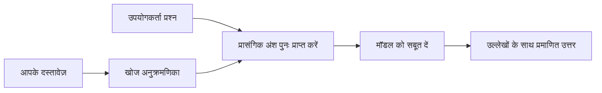

# अपने दस्तावेज़ों के आधार पर AI को प्रश्नों का उत्तर देने के लिए सिखाएं:
## श्रृंखला 1: RAG, Azure बनाम ओपन-सोर्स विकल्प, और जब फाइन-ट्यूनिंग समझ में आती है

> 2026 की एक श्रृंखला में पहला लेख, जो मेरे 2023 के Azure AI Search + Azure OpenAI दस्तावेज़ QA ट्यूटोरियल की समीक्षा करता है।

## 1. परिचय - एक प्रारंभिक RAG ट्यूटोरियल की पुनरावृत्ति

2023 में, मैंने Azure AI Search और Azure OpenAI का उपयोग करके PDF दस्तावेज़ों से प्रश्नों का उत्तर देने के लिए ChatGPT को सिखाने के बारे में दो ट्यूटोरियल्स पर काम किया। मैंने [LangChain संस्करण](https://techcommunity.microsoft.com/blog/educatordeveloperblog/teach-chatgpt-to-answer-questions-using-azure-ai-search--azure-openai-lang-chain/3969713) लिखा, और मैंने [ली स्टॉट](https://developer.microsoft.com/en-us/advocates/lee-stott) के साथ सह-लेखक के रूप में [Semantic Kernel संस्करण](https://techcommunity.microsoft.com/blog/educatordeveloperblog/teach-chatgpt-to-answer-questions-using-azure-ai-search--azure-openai-semantic-k/3985395) भी लिखा, जो माइक्रोसॉफ्ट में प्रिंसिपल क्लाउड एडवोकेट मैनेजर हैं। उस समय, "ChatGPT आपके डेटा पर" का विचार कई डेवलपर्स के लिए अभी भी नया था। इन ट्यूटोरियल्स में Azure Blob Storage, Azure AI Search, Azure OpenAI, LangChain, Semantic Kernel, और FAISS-शैली वेक्टर पुनर्प्राप्ति का उपयोग करके PDF फाइलों से प्रश्नों का उत्तर दिया गया।

वह पहले वाला लेख एक सरल लेकिन महत्वपूर्ण वर्कफ़्लो पर केंद्रित था: दस्तावेज़ अपलोड करें, सूचकांक बनाएँ, संबंधित सामग्री पुनः प्राप्त करें, और मॉडल से उस सामग्री के आधार पर उत्तर पूछें।

2026 में, RAG पारिस्थितिकी तंत्र ने काफी विकास किया है। Azure AI Search अब आधुनिक वेक्टर और हाइब्रिड पुनर्प्राप्ति पैटर्न का समर्थन करता है, Azure OpenAI व्यापक Microsoft Foundry Models पारिस्थितिकी तंत्र का हिस्सा है, और नया v1 API मानक OpenAI क्लाइंट का उपयोग कर सकता है बिना मासिक `api-version` बदलाव के। इसी समय, LangGraph, LlamaIndex, Haystack, Qdrant, Milvus, Weaviate, Chroma, Ollama, और vLLM जैसे ओपन-सोर्स विकल्प वास्तविक RAG सिस्टम के लिए व्यावहारिक विकल्प बन गए हैं।

इसीलिए मैं इस विषय को फिर से देखने का इच्छुक था। सवाल अब केवल "मैं RAG कैसे बनाऊं?" नहीं है। अब इसे बनाने के कई तरीके हैं, और अधिक महत्वपूर्ण सवाल है "मेरी स्थिति के लिए कौन सा आर्किटेक्चर चुनना चाहिए?"

लेकिन मूल समस्या नहीं बदली है।

एक AI मॉडल स्वचालित रूप से आपके दस्तावेज़ों को ज्ञात नहीं करता। एक उपयोगी दस्तावेज़-प्रश्न-उत्तर प्रणाली बनाने के लिए, आपको अभी भी विश्वसनीय पुनर्प्राप्ति, ग्राउंडिंग, मूल्यांकन, और संचालन वर्कफ़्लो की आवश्यकता है।

यह लेख कोई और एंड-टू-एंड "PDF के साथ चैट करें" ट्यूटोरियल नहीं है। मैं इस अपडेटेड श्रृंखला की शुरुआत उस प्रश्न से करना चाहता हूँ जो अब मेरे लिए अधिक महत्वपूर्ण है: आप कब मैनेज्ड Azure आर्किटेक्चर चुनें, कब ओपन-सोर्स RAG स्टैक, और फाइन-ट्यूनिंग वास्तव में कब समझ में आती है?

यह दस्तावेज़-ग्राउंडेड AI सिस्टम बनाने के लिए एक श्रृंखला का पहला लेख है। इस पहले भाग में, हम आर्किटेक्चर निर्णयों पर ध्यान केंद्रित करेंगे: क्यों RAG महत्वपूर्ण है, Azure-आधारित मैनेज्ड सेवाएँ कब उपयोगी हैं, कब ओपन-सोर्स विकल्प समझ में आते हैं, और फाइन-ट्यूनिंग कहां फिट बैठती है।

दस्तावेज़ QA सिस्टम बनाने और पुनः देखने के बाद, मैं अब कम रुचि रखता हूँ कि कौन सा टूल डेमो में सबसे अच्छा दिखता है और अधिक रुचि रखता हूँ कि कौन सा आर्किटेक्चर वास्तविक उपयोगकर्ताओं, बदलते दस्तावेज़ों, अनुमतियों, विफलताओं, और रखरखाव में जीवित रहता है।

## 2. आपका AI क्यों खोज प्रणाली की आवश्यकता है

बड़े भाषा मॉडल व्यापक सार्वजनिक और लाइसेंस प्राप्त डेटा पर प्रशिक्षित होते हैं। वे सामान्य विषयों के बारे में बहुत कुछ जान सकते हैं, लेकिन स्वचालित रूप से आपके निजी PDFs, आंतरिक नीतियों, उद्यम प्रक्रियाओं, अनुसंधान अभिलेखागार, कक्षा सामग्री, ग्राहक सहायता नोट्स, या हाल ही में अपडेट किए गए दस्तावेज़ों को नहीं जानते।

RAG के बारे में एक सरल दृष्टिकोण यह है: मॉडल से अपेक्षा करने के बजाय कि वह हर दस्तावेज़ को याद रखे, हम इसे एक खोज प्रणाली देते हैं। जब कोई उपयोगकर्ता प्रश्न पूछता है, तो सिस्टम सबसे प्रासंगिक जानकारी के टुकड़े पहले खोजता है, फिर उन टुकड़ों को संदर्भ के रूप में मॉडल को देता है।

यह महत्वपूर्ण है क्योंकि कई वास्तविक दुनिया के ज्ञान स्रोत निजी, लगातार बदलते, अनुमतियों के प्रति संवेदनशील, कई प्रणालियों में संग्रहीत, कई प्रारूपों में लिखे गए, और सीधे प्रॉम्प्ट में चिपकाने के लिए बहुत बड़े होते हैं।

उदाहरण के लिए, यदि किसी स्कूल, कंपनी, या अनुसंधान टीम के पास 10,000 आंतरिक दस्तावेज़ हैं, तो मॉडल उन दस्तावेज़ों से विश्वसनीय रूप से उत्तर नहीं दे सकता जब तक सिस्टम सही भागों को सही समय पर पुनः प्राप्त न करे।

यह स्वाभाविक रूप से एक सामान्य प्रश्न की ओर ले जाता है:

फाइन-ट्यूनिंग क्यों नहीं?

फाइन-ट्यूनिंग उपयोगी हो सकती है, लेकिन यह आमतौर पर दस्तावेज़ ज्ञान के लिए पहला सही उपकरण नहीं होता। यदि ज्ञान अक्सर बदलता है, यदि उद्धरण महत्वपूर्ण हैं, या यदि पहुँच अनुमतियाँ महत्वपूर्ण हैं, तो RAG आमतौर पर बेहतर शुरुआती बिंदु होता है। फाइन-ट्यूनिंग व्यवहार, शैली, आउटपुट प्रारूप, और कार्य पैटर्न सिखाने के लिए अधिक उपयुक्त है।

## 3. RAG आर्किटेक्चर व्यवहार में

कल्पना करें कि आप एक स्कूल के लिए AI सहायक बना रहे हैं। सहायक को नीति PDFs, पाठ्यक्रम गाइड, आंतरिक FAQ पेज, और हाल ही में अपडेट किए गए घोषणाओं से प्रश्नों का उत्तर देना होगा।

यदि कोई छात्र पूछता है, "क्या मैं अपनी अंतिम असाइनमेंट के लिए जनरेटिव AI का उपयोग कर सकता हूँ?", तो सिस्टम को मॉडल की सामान्य स्मृति से उत्तर नहीं देना चाहिए। इसे पहले संबंधित स्कूल नीति खोजनी चाहिए, AI उपयोग से संबंधित अनुभाग प्राप्त करना चाहिए, और फिर उस साक्ष्य के आधार पर मॉडल से उत्तर मांगना चाहिए।

यही RAG व्यवहार में है।

ऊपर से, आप इस प्रवाह को इस तरह सोच सकते हैं:

विवरण अधिक परिष्कृत हो सकते हैं, लेकिन मूल विचार सरल है: मॉडल अकेले उत्तर नहीं देता। वह पुनः प्राप्त साक्ष्य के साथ उत्तर देता है।

पहले, दस्तावेज़ Azure Blob Storage, SharePoint, GitHub, या किसी आंतरिक CMS जैसे संग्रहण प्रणालियों से ग्रहण किए जाते हैं। फिर सिस्टम उन्हें पाठ में पार्स करता है, जिसमें उपयोगी संरचना जैसे हेडिंग, पृष्ठ संख्या, तालिकाएँ, खंड, और स्रोत स्थान बनाए रखते हुए।

इसके बाद, सामग्री को टुकड़ों में विभाजित किया जाता है। यह कदम सरल लगता है, लेकिन यह सिस्टम के सबसे महत्वपूर्ण भागों में से एक है। यदि टुकड़ा बहुत छोटा है, तो वह आसपास के संदर्भ को खो सकता है। यदि टुकड़ा बहुत बड़ा है, तो उसमें अप्रासंगिक जानकारी शामिल हो सकती है और पुनर्प्राप्ति कम सटीक हो सकता है।

टुकड़ों के बाद, सिस्टम एम्बेडिंग बनाता है और उन्हें खोज योग्य सूचकांक में मूल पाठ और मेटाडेटा जैसे फाइल नाम, पृष्ठ संख्या, अनुमतियाँ, दस्तावेज़ संस्करण, और स्रोत URL के साथ संग्रहीत करता है।

जब उपयोगकर्ता प्रश्न पूछता है, सिस्टम कीवर्ड खोज, वेक्टर खोज, या हाइब्रिड खोज का उपयोग करके उम्मीदवार टुकड़ों को पुनर्प्राप्त करता है। फिर पुनःक्रमणकर्ता (reranker) उन टुकड़ों को इस तरह क्रमबद्ध कर सकता है कि सबसे उपयोगी साक्ष्य शीर्ष के करीब रखा जाता है।

अंत में, मॉडल प्रश्न और पुनः प्राप्त साक्ष्य प्राप्त करता है। उत्तर को उस साक्ष्य में आधारित होना चाहिए और उद्धरण लौटाने चाहिए ताकि उपयोगकर्ता स्रोत की जांच कर सके।

महत्वपूर्ण बात यह है कि RAG केवल "PDF को वेक्टर डेटाबेस में डालना" नहीं है। उत्तर की गुणवत्ता पूरे वर्कफ़्लो पर निर्भर करती है: पार्सिंग, टुकड़ा बनाना, पुनर्प्राप्ति, पुनःक्रमण, प्रॉम्प्टिंग, उद्धरण, और मूल्यांकन।

इसीलिए दस्तावेज़ संरचना महत्वपूर्ण है। PDF में, एक हेडिंग, तालिका, फुटनोट, या पृष्ठ सीमा किसी पैसिज़ के अर्थ को बदल सकती है। Azure पर, Document Layout स्किल Azure Document Intelligence लेआउट क्षमताओं का उपयोग करता है जो संरचना-सचेत आउटपुट उत्पन्न करता है, जो RAG सिस्टम के लिए टुकड़ा बनाना और पुनर्प्राप्ति गुणवत्ता में सुधार कर सकता है।

## 4. 2023 से क्या बदला?

2023 का ट्यूटोरियल अपने समय के लिए एक अच्छा शुरुआती बिंदु था:

- Azure Blob Storage में PDF फाइलें संग्रहीत थीं।
- Azure AI Search ने सामग्री का इंडेक्स बनाया।
- LangChain ने पुनर्प्राप्ति को Azure OpenAI से जोड़ा।
- FAISS एक सरल स्थानीय वेक्टर स्टोर के रूप में काम करता था।
- उदाहरण में `gpt-35-turbo` और `text-embedding-ada-002` का उपयोग हुआ।

2026 में, एक आधुनिक संस्करण को कई बदलावों को प्रतिबिंबित करना चाहिए।

पहले, पुनर्प्राप्ति ने परिपक्वता पाई है। 2023 में, कई डेमो सरल वेक्टर समानता खोज का उपयोग करते थे। आज, हाइब्रिड पुनर्प्राप्ति गंभीर दस्तावेज़ QA के लिए अक्सर डिफ़ॉल्ट शुरुआती बिंदु है। Azure AI Search हाइब्रिड खोज का समर्थन करता है जो एक ही अनुरोध में कीवर्ड और वेक्टर क्वेरी को जोड़ता है और परिणामों को Reciprocal Rank Fusion के साथ मिलाता है। सेमांटिक रैंकर बाद में पूर्ण-पाठ, वेक्टर, और हाइब्रिड परिणामों के टेक्स्ट पक्ष को पुनःक्रमित कर सकता है।

दूसरे, ग्रहण अधिक परिष्कृत है। हर दस्तावेज़ को मैन्युअल रूप से अनुप्रयोग कोड से विभाजित करने के बजाय, Azure AI Search टुकड़ा बनाना, एम्बेडिंग, और क्वेरी-टाइम वेक्टराइजेशन के लिए एकीकृत वेक्टरकरण का समर्थन करता है। PDFs और दस्तावेज़-भारित वर्कलोड के लिए, Document Layout स्किल निश्चित आकार के टुकड़ों की तुलना में अधिक संरचना बनाए रख सकती है।

तीसरे, ऑर्केस्ट्रेशन अधिक महत्वपूर्ण हो गया है। कठिन भाग अक्सर LLM API कॉल नहीं होता। कठिन भाग विफलताओं, पुनः प्रयासों, स्टेल पुनर्प्राप्ति, टुकड़ा गुणवत्ता, लंबी अवधि के वर्कफ़्लो, मानव समीक्षा, और बड़े पैमाने पर मूल्यांकन को संभालना होता है। यहाँ वर्कफ़्लो-उन्मुख टूल जैसे LangGraph, LlamaIndex वर्कफ़्लो, Haystack पाइपलाइन्स, और प्लेटफ़ॉर्म-स्तरीय मूल्यांकन और निगरानी टूल एक तंतुवत श्रृंखला की तुलना में अधिक प्रासंगिक हो जाते हैं।

चौथा, मूल्यांकन अब वैकल्पिक नहीं है। एक डेमो एक प्रश्न के साथ प्रभावशाली लग सकता है। एक उत्पादन प्रणाली को परीक्षण सेट, रिग्रेशन जांच, पुनर्प्राप्ति मेट्रिक्स, ग्राउंडेडनेस जांच, और निगरानी की आवश्यकता होती है। बिना मूल्यांकन के, यह जानना मुश्किल है कि सिस्टम सुधार कर रहा है या केवल बदल रहा है।

## 5. Azure और ओपन-सोर्स RAG स्टैक्स के बीच चयन

मैं नहीं सोचता कि उपयोगी प्रश्न है "क्या Azure ओपन-सोर्स से बेहतर है?" या "क्या ओपन-सोर्स Azure से बेहतर है?"

उपयोगी प्रश्न है: आप किस प्रकार की प्रणाली बना रहे हैं, कौन इसका संचालन करेगा, आपकी किन प्रतिबंधों हैं, और कौन से विफलता मोड अस्वीकार्य हैं?

जब मैंने दस्तावेज़ QA उदाहरण बनाना शुरू किया, तो मैं ज्यादातर सोचता था कि क्या पुनर्प्राप्ति काम करती है। क्या मैं PDF अपलोड कर सकता हूँ, उन्हें खोज सकता हूँ, और उत्तर उत्पन्न कर सकता हूँ? यह एक उचित शुरुआती बिंदु था।

अधिक यथार्थवादी AI वर्कफ़्लो के माध्यम से काम करने के बाद, मेरा मूल्यांकन बदल गया। अब मैं RAG स्टैक चुनने से पहले चार चीजों को देखता हूँ:

- पहचान और अनुमतियाँ  
- पुनर्प्राप्ति गुणवत्ता  
- वर्कफ़्लो विश्वसनीयता  
- संचालन स्वामित्व  

ये चार क्षेत्र आपको केवल मॉडल बेंचमार्क की तुलना में बहुत अधिक बताते हैं।

Azure-आधारित आर्किटेक्चर्स आमतौर पर तब समझ में आते हैं जब एंटरप्राइज़ इंटीग्रेशन कठिन हिस्सा हो। यदि कोई टीम पहले से Microsoft Entra ID, Microsoft 365, Azure Storage, निजी नेटवर्किंग, RBAC, और Azure मॉनिटरिंग पर निर्भर है, तो Azure AI Search और Azure OpenAI बहुत सारी संचालन जटिलताएँ कम कर सकते हैं। उस वातावरण में, Azure केवल एक मॉडल API नहीं है। मूल्य आसपास की प्रणाली है: पहचान, शासन, प्रबंधित खोज, सुरक्षा एकीकरण, समर्थन, और परिचित संचालन।

ओपन-सोर्स आर्किटेक्चर्स आमतौर पर तब समझ में आते हैं जब लचीलापन कठिन हिस्सा हो। यदि टीम को स्थानीय अनुमान, क्लाउड पोर्टेबिलिटी, कस्टम पुनर्प्राप्ति पाइपलाइन, विशिष्ट पुनःक्रमण, या वेक्टर डेटाबेस और मॉडल-सेवा पर सीधे नियंत्रण की आवश्यकता है, तो एक ओपन-सोर्स स्टैक बेहतर फिट हो सकता है। इसके लिए टीम को विश्वसनीयता कार्य: बैकअप, स्केलिंग, लेटेंसी, माइग्रेशन, निगरानी, और सुरक्षा की अधिक जिम्मेदारी लेनी होती है।

व्यवहार में, कई उत्पादन AI सिस्टम शुद्ध क्लाउड-नेटिव या शुद्ध ओपन-सोर्स नहीं होते। वे अक्सर हाइब्रिड सिस्टम होते हैं जो संचालन सादगी, पोर्टेबिलिटी, शासन, और इंजीनियरिंग लचीलापन संतुलित करते हैं।

उदाहरण के लिए, मैं आश्चर्यचकित नहीं होऊंगा कि एक सिस्टम Azure OpenAI मॉडल एक्सेस के लिए, LangGraph वर्कफ़्लो ऑर्केस्ट्रेशन के लिए, Azure होस्टिंग तैनाती के लिए, और एक विशिष्ट पुनर्प्राप्ति आवश्यकता के लिए ओपन-सोर्स वेक्टर डेटाबेस का उपयोग करे। यह आर्किटेक्चरल असंगति नहीं है। यह सिस्टम के प्रत्येक हिस्से के लिए सही स्तर की प्रबंधित सेवा और इंजीनियरिंग नियंत्रण चुनना है।

मुझे हाइब्रिड आर्किटेक्चर पसंद हैं जब मैनेज्ड प्लेटफ़ॉर्म महत्वपूर्ण एंटरप्राइज़ समस्याओं को हल करता है, जबकि ओपन-सोर्स घटक टीम को उस स्थान पर लचीलापन देते हैं जहां वास्तव में इसकी आवश्यकता होती है।

## 6. एक व्यावहारिक निर्णय गाइड

यह निर्णय तालिका है जिसे मैं टीम के साथ RAG स्टैक चुनने से पहले उपयोग करता:

| निर्णय क्षेत्र | Azure प्रबंधित स्टैक तब मजबूत होता है जब... | ओपन-सोर्स स्टैक तब मजबूत होता है जब... |
| --- | --- | --- |
| पहचान और पहुँच | Entra ID, RBAC, प्रबंधित पहचान, और एंटरप्राइज़ अनुमतियाँ केंद्रीय हों | कस्टम ऑथ, गैर-माइक्रोसॉफ्ट पहचान, या ऐप-विशिष्ट पहुँच लॉजिक डॉमिनेट करता हो |
| संचालन | टीम प्रबंधित इन्फ्रास्ट्रक्चर, समर्थन, SLA, और सरल ऑनबोर्डिंग चाहती हो | टीम वेक्टर डेटाबेस, मॉडल सेवा, बैकअप, और स्केलिंग चला सके |
| पुनर्प्राप्ति | हाइब्रिड खोज, सेमांटिक रैंकिंग, फिल्टर, और मेटाडेटा खोज अधिकांश जरूरतों को पूरा करे | टीम को कस्टम पुनर्प्राप्ति, विशिष्ट पुनःक्रमण, या प्रयोगात्मक इंडेक्सिंग चाहिए |
| पोर्टेबिलिटी | Azure पारिस्थितिकी तंत्र के साथ तालमेल स्वीकार्य या पसंदीदा हो | क्लाउड लॉक-इन से बचाव एक कठिन आवश्यकता हो |
| अनुमान | Azure OpenAI शासन, नेटवर्किंग, और एंटरप्राइज़ नियंत्रण महत्वपूर्ण हों | स्थानीय अनुमान, कस्टम मॉडल, या सेल्फ-होस्टेड सेवा आवश्यक हो |
| लागत | इंजीनियरिंग और संचालन प्रयास को कम करना इन्फ्रास्ट्रक्चर ट्यूनिंग से अधिक महत्वपूर्ण हो | पैमाना इतना बड़ा हो कि सावधानीपूर्वक इन्फ्रास्ट्रक्चर अनुकूलन का औचित्य हो |
| प्रयोग | स्थिरता और एंटरप्राइज़ इंटीग्रेशन बार-बार घटकों को बदलने से अधिक मायने रखता हो | टीम एजेंट्स, टूल्स, मेमोरी, और पुनर्प्राप्ति वर्कफ़्लो पर तेजी से पुनरावृत्ति कर रही हो |

मेरा नियम सरल है:

- जब एंटरप्राइज़ इंटीग्रेशन, सुरक्षा, और संचालन सादगी मुख्य जोखिम हों तो Azure से शुरू करें।
- जब पोर्टेबिलिटी, अनुकूलन, या स्थानीय नियंत्रण मुख्य जोखिम हों तो ओपन-सोर्स से शुरू करें।
- जब दोनों सही हों तो हाइब्रिड स्टैक का उपयोग करें।

इसी लिए मैं 2026 की RAG श्रृंखला को कोड के साथ शुरू नहीं करूंगा। कोड महत्वपूर्ण है, लेकिन आर्किटेक्चर चयन कार्यान्वयन से पहले आता है। एक सरल डेमो सबसे कठिन विकल्पों को छुपा सकता है। एक अच्छा RAG सिस्टम उन विकल्पों को स्पष्ट करता है।

## 7. फाइन-ट्यूनिंग कहां फिट बैठती है

फाइन-ट्यूनिंग अक्सर RAG के साथ एक साथ उल्लेख की जाती है, लेकिन मैं सोचता हूँ कि दोनों को अलग रखना महत्वपूर्ण है।

जब सिस्टम को ताज़ा, निजी, अनुमति-सम्बंधित, या स्रोत-ग्राउंडेड ज्ञान की आवश्यकता होती है, तो RAG आमतौर पर बेहतर विकल्प होता है। यदि उत्तर को दस्तावेज़ों से उद्धृत करना चाहिए, हाल की अपडेट्स को प्रतिबिंबित करना चाहिए, या उपयोगकर्ता-विशिष्ट पहुँच नियमों का सम्मान करना चाहिए, तो पुनर्प्राप्ति वास्तुकला का हिस्सा होनी चाहिए।

फाइन-ट्यूनिंग तब अधिक उपयोगी होती है जब ज्ञान मुख्य समस्या नहीं होती। यह मदद कर सकती है जब आप मॉडल से एक विशिष्ट आउटपुट प्रारूप का पालन करवाना चाहते हैं, डोमेन-विशेष प्रतिक्रिया शैली मिलाना चाहते हैं, किसी स्थिर कार्य को अधिक निरंतरता से प्रदर्शन करवाना चाहते हैं, या हर प्रॉम्प्ट में आवश्यक निर्देश की मात्रा कम करना चाहते हैं।
व्यावहारिक रूप में, दोनों एक साथ काम कर सकते हैं। एक सपोर्ट असिस्टेंट नवीनतम नीति पुनः प्राप्त करने के लिए RAG का उपयोग कर सकता है, जबकि एक फाइन-ट्यून किया हुआ मॉडल कंपनी की पसंदीदा उत्तर संरचना और टोन सीखता है।

गलती यह है कि फाइन-ट्यूनिंग को दस्तावेज़ स्टोर के विकल्प के रूप में लेना। जब सिस्टम को ताज़ा, निजी, या अनुमति-संवेदनशील डेटा से जवाब देना होता है, तो पुनः प्राप्ति की आवश्यकता समाप्त नहीं होती।

## 8. यह श्रृंखला कहाँ जाएगी अगला

यह लेख निर्णय-लेने वाली परत है। कोड लिखने से पहले, मैं ट्रेडऑफ को स्पष्ट करना चाहता था: RAG बनाम फाइन-ट्यूनिंग, Azure बनाम ओपन सोर्स, प्रबंधित सेवाएं बनाम परिचालन नियंत्रण।

कार्यान्वयन में जाने से पहले, मैं यहाँ एक बिंदु छोड़ना चाहता हूँ: कई एंटरप्राइज एआई सिस्टम में, मॉडल केवल एक घटक है। पुनः प्राप्ति गुणवत्ता, समन्वयन, मूल्यांकन, अनुमति और परिचालन विश्वसनीयता अक्सर यह निर्धारित करते हैं कि क्या सिस्टम डेमो चरण से आगे सफल होता है।

इस श्रृंखला के अगले हिस्सों में, मैं दस्तावेज़-आधारित एआई सिस्टम के व्यावहारिक पक्ष में गहराई से जाने की योजना बनाता हूँ: कैसे Azure-आधारित वास्तुकला बनाएं, कैसे ओपन-सोर्स विकल्प व्यावहारिक रूप में तुलनात्मक हैं, और कैसे मूल्यांकन करें कि क्या RAG सिस्टम वास्तव में काम कर रहा है।

मैं श्रृंखला के विकास के अनुसार क्रम समायोजित कर सकता हूँ, लेकिन लक्ष्य वही रहेगा: एक सरल डेमो से आगे बढ़ना और दिखाना कि ऐसे RAG सिस्टम के बारे में कैसे सोचना चाहिए जिन्हें बनाए रखा जा सके, मूल्यांकन किया जा सके, और संचालित किया जा सके।

## 9. संदर्भ और संसाधन

मूल ट्यूटोरियल:

- [Teach ChatGPT to Answer Questions: Using Azure AI Search & Azure OpenAI (Lang Chain)](https://techcommunity.microsoft.com/blog/educatordeveloperblog/teach-chatgpt-to-answer-questions-using-azure-ai-search--azure-openai-lang-chain/3969713)
- [Teach ChatGPT to Answer Questions: Using Azure AI Search & Azure OpenAI (Semantic Kernel)](https://techcommunity.microsoft.com/blog/educatordeveloperblog/teach-chatgpt-to-answer-questions-using-azure-ai-search--azure-openai-semantic-k/3985395)

Azure:

- [Azure AI Search REST API versions](https://learn.microsoft.com/en-us/rest/api/searchservice/search-service-api-versions)
- [Hybrid search in Azure AI Search](https://learn.microsoft.com/en-us/azure/search/hybrid-search-how-to-query)
- [Integrated vectorization in Azure AI Search](https://learn.microsoft.com/en-us/azure/search/vector-search-integrated-vectorization)
- [Document Layout skill in Azure AI Search](https://learn.microsoft.com/en-us/azure/search/cognitive-search-skill-document-intelligence-layout)
- [Chunk and vectorize by document layout](https://learn.microsoft.com/en-us/azure/search/search-how-to-semantic-chunking)
- [Semantic ranking in Azure AI Search](https://learn.microsoft.com/en-us/azure/search/semantic-search-overview)
- [Azure OpenAI / Microsoft Foundry API version lifecycle](https://learn.microsoft.com/en-us/azure/foundry/openai/api-version-lifecycle)
- [Foundry Models sold by Azure](https://learn.microsoft.com/en-us/azure/foundry/foundry-models/concepts/models-sold-directly-by-azure)
- [Microsoft Foundry fine-tuning considerations](https://learn.microsoft.com/en-us/azure/foundry/openai/concepts/fine-tuning-considerations)
- [Microsoft Foundry observability](https://learn.microsoft.com/en-us/azure/foundry/concepts/observability)
- [Run evaluations in Microsoft Foundry](https://learn.microsoft.com/en-us/azure/foundry/how-to/evaluate-generative-ai-app)

ओपन-सोर्स:

- [LangGraph documentation](https://docs.langchain.com/oss/python/langgraph/overview)
- [LlamaIndex documentation](https://developers.llamaindex.ai/python/framework/)
- [Haystack documentation](https://docs.haystack.deepset.ai/)
- [Qdrant documentation](https://qdrant.tech/documentation/overview/)
- [Milvus documentation](https://milvus.io/docs/overview.md)
- [Weaviate documentation](https://docs.weaviate.io/weaviate/current/)
- [Chroma documentation](https://docs.trychroma.com/docs/overview/introduction)
- [Ollama embeddings](https://docs.ollama.com/capabilities/embeddings)
- [vLLM OpenAI-compatible server](https://docs.vllm.ai/en/latest/serving/openai_compatible_server.html)
- [BGE embedding models](https://huggingface.co/BAAI/bge-large-en-v1.5)
- [E5 embedding models](https://huggingface.co/intfloat/e5-large-v2)
- [Instructor embedding models](https://huggingface.co/hkunlp/instructor-large)

---

<!-- CO-OP TRANSLATOR DISCLAIMER START -->
**अस्वीकरण**:
इस दस्तावेज़ का अनुवाद AI अनुवाद सेवा [Co-op Translator](https://github.com/Azure/co-op-translator) का उपयोग करके किया गया है। जबकि हम सटीकता के लिए प्रयास करते हैं, कृपया ध्यान दें कि स्वचालित अनुवादों में त्रुटियाँ या अशुद्धियाँ हो सकती हैं। मूल दस्तावेज़ अपनी मूल भाषा में ही प्रामाणिक स्रोत माना जाना चाहिए। महत्वपूर्ण जानकारी के लिए, पेशेवर मानव अनुवाद की सिफारिश की जाती है। इस अनुवाद के उपयोग से उत्पन्न किसी भी गलतफहमी या गलत व्याख्या के लिए हम उत्तरदायी नहीं हैं।
<!-- CO-OP TRANSLATOR DISCLAIMER END -->