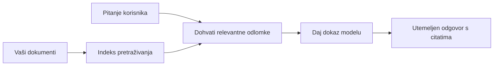

# Naučite AI da odgovara na pitanja na temelju vaših dokumenata:
## Serija 1: RAG, Azure naspram open-source alternativa i kada fino podešavanje ima smisla

> Prvi članak u seriji za 2026. godinu koji ponovno pregledava moje vodiče za Azure AI Search + Azure OpenAI dokument QA iz 2023. godine.

Navigacija serijom: [Početna stranica repozitorija](../README.md) | Sljedeći: [Serija 2 - Izradite lokalni open-source RAG sustav od početka do kraja](./series-2-open-source-rag-end-to-end.md)

## 1. Uvod - ponovno gledanje ranijeg RAG vodiča

Godine 2023. radio sam na paru vodiča o učenju ChatGPT-a da odgovara na pitanja iz PDF dokumenata koristeći Azure AI Search i Azure OpenAI. Napisao sam [LangChain verziju](https://techcommunity.microsoft.com/blog/educatordeveloperblog/teach-chatgpt-to-answer-questions-using-azure-ai-search--azure-openai-lang-chain/3969713) i također sam surađivao na pratećoj [Semantic Kernel verziji](https://techcommunity.microsoft.com/blog/educatordeveloperblog/teach-chatgpt-to-answer-questions-using-azure-ai-search--azure-openai-semantic-k/3985395) s [Lee Stottom](https://developer.microsoft.com/en-us/advocates/lee-stott), glavnim menadžerom za Microsoft Cloud zastupnike. U to je vrijeme ideja "ChatGPT na vašim podacima" mnogim programerima još bila nova. Vodiči su koristili Azure Blob Storage, Azure AI Search, Azure OpenAI, LangChain, Semantic Kernel i FAISS stil vektorsko pretraživanje za odgovaranje na pitanja iz PDF datoteka.

Taj je raniji članak bio usredotočen na jednostavan, ali važan tijek rada: prenesite dokumente, indeksirajte ih, dohvatite relevantan sadržaj i zamolite model da odgovori na temelju tog sadržaja.

Godine 2026. RAG ekosustav se značajno razvio. Azure AI Search sada podržava moderne obrasce vektorskog i hibridnog pretraživanja, Azure OpenAI je dio šireg Microsoft Foundry Models ekosustava, a noviji v1 API može koristiti standardnog OpenAI klijenta bez potrebe za mjesečnim promjenama `api-version`. Istovremeno, open-source opcije poput LangGraph, LlamaIndex, Haystack, Qdrant, Milvus, Weaviate, Chroma, Ollama i vLLM postale su praktične opcije za stvarne RAG sustave.

Zato sam htio ponovno obraditi ovu temu. Pitanje više nije samo "Kako izgraditi RAG?" Sada postoji mnogo načina za izgradnju, a važnije pitanje je "Koju arhitekturu trebam odabrati za svoju situaciju?"

Ali temeljni problem nije promijenjen.

AI model ne zna automatski vaše dokumente. Da biste izgradili koristan sustav za odgovaranje na pitanja iz dokumenata, još uvijek vam treba pouzdano dohvaćanje, utemeljenje, evaluacija i operativni tijekovi rada.

Ovaj članak nije još jedan vodič za "chat s PDF-om" od početka do kraja. Želim ovu ažuriranu seriju započeti s pitanjem koje mi je sada važnije: kada trebate odabrati upravljanu Azure arhitekturu, kada open-source RAG paket, i kada fino podešavanje zaista ima smisla?

Ovo je prvi članak u seriji o izgradnji AI sustava utemeljenih na dokumentima. U ovom prvom dijelu usredotočit ćemo se na arhitektonske odluke: zašto je RAG važan, kada su Azure upravljane usluge korisne, kada open-source alternative imaju smisla i gdje se fino podešavanje uklapa.

Nakon izgradnje i ponovnog pregledavanja sustava za QA dokumenata, postao sam manje zainteresiran za to koji alat izgleda najbolje u demo verziji, a više za to koja arhitektura preživljava stvarne korisnike, promjenjive dokumente, dopuštenja, kvarove i održavanje.

## 2. Zašto vašem AI-u treba sustav za pretraživanje

Veliki jezični modeli trenirani su na širokim javnim i licenciranim podacima. Mogu znati mnogo o općim temama, ali ne znaju automatski vaše privatne PDF-ove, interne politike, korporativne procedure, istraživačke arhive, školske materijale, bilješke korisničke podrške ili nedavno ažuriranu dokumentaciju.

Jednostavan način razmišljanja o RAG-u je ovaj: umjesto da očekujemo da model pamti svaki dokument, mi mu dajemo sustav za pretraživanje. Kad korisnik postavi pitanje, sustav prvo pronalazi najrelevantnije dijelove informacija, a zatim ih daje modelu kao kontekst.

To je važno jer su mnogi stvarni izvori znanja privatni, stalno se mijenjaju, osjetljivi na dopuštenja, pohranjeni u više sustava, napisani u mnogim formatima i preveliki da bi se zalijepili izravno u prompt.

Na primjer, ako škola, tvrtka ili istraživački tim ima 10.000 internih dokumenata, model ne može pouzdano odgovarati iz tih dokumenata osim ako sustav ne pronađe prave dijelove u pravo vrijeme.

To prirodno dovodi do čestog pitanja:

Zašto ne samo fino podesiti model?

Fino podešavanje može biti korisno, ali obično nije prvi pravi alat za znanje iz dokumenata. Ako se znanje često mijenja, ako su citati važni ili ako su važna prava pristupa, RAG je obično bolja početna točka. Fino podešavanje bolje odgovara za učenje ponašanja, stila, formata izlaza i obrazaca zadataka.

## 3. RAG arhitektura u praksi

Zamislite da gradite AI asistenta za školu. Asistent treba odgovarati na pitanja iz PDF-ova s pravilnicima, vodiča za kolegije, internih stranica FAQ i nedavno ažuriranih obavijesti.

Ako student pita: "Mogu li koristiti generativni AI za moj završni zadatak?", sustav ne bi trebao odgovarati iz općeg "pamćenja" modela. Prvo bi trebao pronaći relevantan školski pravilnik, dohvatiti odjeljak o korištenju AI-ja i zatim zamoliti model da odgovori koristeći taj dokaz.

To je RAG u praksi.

Na visokoj razini, tijek možete zamisliti ovako:

Detalji mogu biti složeniji, ali osnovna je ideja jednostavna: model ne odgovara sam. Odgovara s prikupljenim dokazima.

Prvo se dokumenti unose iz sustava za pohranu poput Azure Blob Storage, SharePoint, GitHub ili internog CMS-a. Zatim ih sustav parsira u tekst pritom čuvajući korisnu strukturu poput naslova, brojeva stranica, tablica, odjeljaka i lokacija izvora.

Zatim se sadržaj dijeli na dijelove. Ovaj korak zvuči jednostavno, ali je jedna od najvažnijih komponenti sustava. Ako je dio previše mali, može izgubiti okolni kontekst. Ako je dio prevelik, može uključiti nepovezane informacije i učiniti vraćanje manje preciznim.

Nakon dijeljenja na dijelove, sustav kreira ugnježdene prikaze (embeddinge) i pohranjuje ih u pretraživi indeks zajedno s izvornim tekstom i metapodacima poput naziva datoteke, broja stranice, dopuštenja, verzije dokumenta i URL-a izvora.

Kad korisnik postavi pitanje, sustav dohvaća kandidatske dijelove koristeći pretraživanje po ključnim riječima, vektorsko pretraživanje ili hibridno pretraživanje. Reranker može zatim prerasporediti te dijelove tako da se najkorisniji dokazi nalaze pri vrhu.

Na kraju, model prima pitanje i prikupljene dokaze. Odgovor bi trebao biti utemeljen na tim dokazima i sadržavati citate kako bi korisnik mogao pregledati izvor.

Važno je da RAG nije samo "stavi PDF-ove u vektorsku bazu podataka." Kvaliteta odgovora ovisi o cijelom tijeku rada: parsiranju, dijeljenju, dohvaćanju, prerangiranju, promptiranju, citiranju i evaluaciji.

Zato je struktura dokumenta važna. U PDF-u, naslov, tablica, fusnota ili granica stranice mogu promijeniti značenje odlomka. Na Azureu, Document Layout vještina koristi mogućnosti Azure Document Intelligence za proizvodnju izlaza svjesnog strukture, što može poboljšati kvalitetu dijeljenja i vraćanja za RAG sustave.

## 4. Što se promijenilo od 2023. godine?

Vodič iz 2023. bio je dobar početak za svoje vrijeme:

- Azure Blob Storage pohranjivao je PDF datoteke.
- Azure AI Search indeksirao je sadržaj.
- LangChain je povezao dohvaćanje s Azure OpenAI.
- FAISS je radio kao jednostavna lokalna vektorska baza.
- Primjer je koristio `gpt-35-turbo` i `text-embedding-ada-002`.

Godine 2026. moderna verzija trebala bi odražavati nekoliko promjena.

Prvo, dohvaćanje je sazrelo. Godine 2023. mnogi demo primjeri koristili su jednostavno vektorsko pretraživanje po sličnosti. Danas je hibridno pretraživanje često podrazumijevana početna točka za ozbiljnu QA na dokumentima. Azure AI Search podržava hibridno pretraživanje kombiniranjem upita po ključnim riječima i vektorima u jednom zahtjevu i spajanjem rezultata s Reciprocal Rank Fusion. Semantic ranker može zatim prerangirati tekstualne rezultate među punim tekstom, vektorskim i hibridnim rezultatima.

Drugo, unos podataka je sofisticiraniji. Umjesto ručnog dijeljenja svakog dokumenta pomoću aplikacijskog koda, Azure AI Search podržava integriranu vektorizaciju za dijeljenje, ugnježđivanje i vektorizaciju u vrijeme upita. Za PDF-ove i opterećenja bogata dokumentima, Document Layout vještina može sačuvati više strukture nego dijeljenje na fiksne veličine dijelova.

Treće, orkestracija je važnija. Težak dio često nije sam LLM API poziv. Težak dio je rukovanje kvarovima, ponovnim pokušajima, zastarjelim dohvaćanjem, kvalitetom dijelova, dugotrajnim tijekovima rada, ljudskom revizijom i evaluacijom u velikoj skali. Tu alati orijentirani na tijekove rada kao što su LangGraph, LlamaIndex tijekovi rada, Haystack pipeline-i i alati za evaluaciju i nadzor na platformnoj razini postaju relevantniji nego jedinstveni linearni lanac.

Četvrto, evaluacija više nije opcionalna. Demo može impresionirati jednim pitanjem. Produkcijski sustav treba testne skupove, provjere regresije, metrike dohvaćanja, provjere utemeljenosti i nadzor. Bez evaluacije teško je znati poboljšava li se sustav ili se samo mijenja.

## 5. Odabir između Azure i open-source RAG paketa

Ne mislim da je korisno pitanje "Je li Azure bolji od open source?" ili "Je li open source bolji od Azurea?"

Korisno je pitanje: kakav sustav gradite, tko će njime upravljati, koji su vaši uvjeti i koje načine kvara ne možete podnijeti?

Kad sam počeo graditi primjere QA dokumenata, uglavnom sam razmišljao radi li dohvaćanje. Mogu li prenijeti PDF-ove, pretražiti ih i generirati odgovor? To je bio razuman početak.

Nakon rada s realnijim AI tijekovima rada, moja se evaluacija promijenila. Sada gledam četiri stvari prije odabira RAG paketa:

- identitet i dopuštenja
- kvaliteta dohvaćanja
- pouzdanost tijeka rada
- operativno vlasništvo

Ta četiri područja govore mnogo više od samog modelnog benchmarka.

Azure arhitekture obično imaju smisla kada je integracija u poslovni sustav najteži dio. Ako tim već ovisi o Microsoft Entra ID-u, Microsoft 365, Azure Storageu, privatnim mrežama, RBAC-u i nadzoru u Azureu, Azure AI Search i Azure OpenAI mogu smanjiti mnogo operativne složenosti. U takvom okruženju, Azure nije samo API za modele. Vrijednost je u okružujućem sustavu: identitetu, upravljanju, upravljanom pretraživanju, integraciji sigurnosti, podršci i poznatim operacijama.

Open-source arhitekture obično imaju smisla kada je fleksibilnost najteži dio. Ako tim treba lokalnu inferenciju, prenosivost u oblaku, prilagođeni proces dohvaćanja, specijalizirano prerangiranje ili izravnu kontrolu nad vektorskom bazom podataka i slojem za posluživanje modela, open-source paket može biti bolji izbor. Kompromis je da tim preuzima veći dio posla oko pouzdanosti: sigurnosne kopije, skaliranje, latenciju, migracije, nadzor i sigurnost.

U praksi mnogi produkcijski AI sustavi nisu čisto cloud-native ili čisto open-source. Često su to hibridni sustavi koji balansiraju operativnu jednostavnost, prenosivost, upravljanje i inženjersku fleksibilnost.

Na primjer, ne bih se iznenadio da netko koristi Azure OpenAI za pristup modelu, LangGraph za orkestraciju tijeka rada, Azure hosting za implementaciju i open-source vektorsku bazu podataka za određeni zahtjev dohvaćanja. To nije arhitektonska nekonzistentnost. To je odabir prave razine upravljane usluge i inženjerske kontrole za svaki dio sustava.

Sviđaju mi se hibridne arhitekture kad upravljana platforma rješava važne poslovne probleme, dok open-source komponente timu daju fleksibilnost tamo gdje je zaista važna.

## 6. Praktični vodič za odluke

Evo tablice odlučivanja koju bih koristio s timom prije odabira RAG paketa:

| Područje odluke | Azure upravljani paket je jači kad... | Open-source paket je jači kad... |
| --- | --- | --- |
| Identitet i pristup | Centralni su Entra ID, RBAC, upravljani identitet i poslovna dopuštenja | Prevladava prilagođena autorizacija, ne-Microsoft identitet ili aplikacijska logika pristupa |
| Operacije | Tim želi upravljanu infrastrukturu, podršku, SLA-e i jednostavnije uključivanje | Tim može upravljati vektorskim bazama, posluživanjem modela, sigurnosnim kopijama i skaliranjem |
| Dohvaćanje | Hibridno pretraživanje, semantičko rangiranje, filtri i pretraživanje metapodataka pokrivaju većinu potreba | Tim treba prilagođeno dohvaćanje, specijalizirano prerangiranje ili eksperimentalno indeksiranje |
| Prenosivost | Prihvatljiva ili poželjna je usklađenost s Azure ekosustavom | Izbjegavanje zaključavanja u oblaku je strogi zahtjev |
| Inferencija | Važno je upravljanje Azure OpenAI-jem, mrežna povezanost i poslovna kontrola | Potrebna je lokalna inferencija, prilagođeni modeli ili samostalno hostanje servisa |
| Trošak | Smanjenje inženjerskog i operativnog napora važnije je od prilagođavanja infrastrukture | Skala je dovoljno velika da opravda pažljivo optimiziranje infrastrukture |
| Eksperimentiranje | Stabilnost i integracija u poslovni sustav važniji su od čestih promjena komponenti | Tim brzo iterira na agentima, alatima, memoriji i tijekovima dohvaćanja |

Moje praktično pravilo je jednostavno:

- Počnite s Azureom kada su integracija u poslovni sustav, sigurnost i operativna jednostavnost glavni rizici.
- Počnite s open sourceom kada su prenosivost, prilagodba ili lokalna kontrola glavni rizici.
- Koristite hibridni paket kada su oba istinita.

Zato također ne bih započeo 2026. seriju o RAG-u najprije s kodom. Kod je važan, ali odabir arhitekture dolazi prije implementacije. Jednostavan demo može sakriti najteže izbore. Dobar RAG sustav te izbore čini eksplicitnima.

## 7. Gdje fino podešavanje ima smisla

Fino podešavanje se često spominje zajedno s RAG-om, ali mislim da je važno razdvojiti te dvije stvari.

RAG je obično bolji izbor kad sustav treba svježe, privatno, osjetljivo na dopuštenja ili izvorno utemeljeno znanje. Ako odgovor treba citirati dokumente, odražavati nedavna ažuriranja ili poštivati korisnička pristupna pravila, dohvaćanje treba biti dio arhitekture.
Fino podešavanje je korisnije kada znanje nije glavni problem. Može pomoći kada želite da model slijedi specifični izlazni format, uskladi se sa stilom odgovora specifičnim za domen, dosljednije izvršava stabilan zadatak ili smanji količinu uputa potrebnih u svakom upitu.

U praksi, ta dva mogu raditi zajedno. Pomoćnik za podršku može koristiti RAG za dohvaćanje najnovije politike, dok fino podešen model uči preferiranu strukturu i ton odgovora tvrtke.

Greška je tretirati fino podešavanje kao zamjenu za spremište dokumenata. Ono ne uklanja potrebu za dohvatom kada sustav mora odgovarati na temelju svježih, privatnih ili podložnih dozvolama podataka.

## 8. Kamo Ova Serija Ide Slijedeće

Ovaj članak je sloj donošenja odluka. Prije pisanja koda, želio sam učiniti kompromise eksplicitnima: RAG vs fino podešavanje, Azure vs open source, upravljane usluge vs kontrola operacija.

Prije prelaska na implementaciju, želim ovdje ostaviti jednu točku: u mnogim enterprise AI sustavima, model je samo jedna komponenta. Kvaliteta dohvaćanja, orkestracija, evaluacija, dozvole i operativna pouzdanost često su ono što određuje hoće li sustav uspjeti izvan demonstracijske faze.

U sljedećim dijelovima ove serije, planiram dublje ući u praktičnu stranu AI sustava temeljenih na dokumentima: prvo ćemo izgraditi lokalni open-source RAG tijek rada, zatim ponovno izgraditi isti scenarij s Azure AI Search i Azure OpenAI, a potom ocijeniti radi li sustav doista.

Mogu prilagoditi redoslijed kako se serija razvija, ali cilj će ostati isti: prijeći iz jednostavne demonstracije i pokazati kako razmišljati o RAG sustavima koji se mogu održavati, evaluirati i upravljati.

## 9. Reference i Resursi

Izvorni tutorijali:

- [Teach ChatGPT to Answer Questions: Using Azure AI Search & Azure OpenAI (Lang Chain)](https://techcommunity.microsoft.com/blog/educatordeveloperblog/teach-chatgpt-to-answer-questions-using-azure-ai-search--azure-openai-lang-chain/3969713)
- [Teach ChatGPT to Answer Questions: Using Azure AI Search & Azure OpenAI (Semantic Kernel)](https://techcommunity.microsoft.com/blog/educatordeveloperblog/teach-chatgpt-to-answer-questions-using-azure-ai-search--azure-openai-semantic-k/3985395)

Azure:

- [Azure AI Search REST API versions](https://learn.microsoft.com/en-us/rest/api/searchservice/search-service-api-versions)
- [Hybrid search in Azure AI Search](https://learn.microsoft.com/en-us/azure/search/hybrid-search-how-to-query)
- [Integrated vectorization in Azure AI Search](https://learn.microsoft.com/en-us/azure/search/vector-search-integrated-vectorization)
- [Document Layout skill in Azure AI Search](https://learn.microsoft.com/en-us/azure/search/cognitive-search-skill-document-intelligence-layout)
- [Chunk and vectorize by document layout](https://learn.microsoft.com/en-us/azure/search/search-how-to-semantic-chunking)
- [Semantic ranking in Azure AI Search](https://learn.microsoft.com/en-us/azure/search/semantic-search-overview)
- [Azure OpenAI / Microsoft Foundry API version lifecycle](https://learn.microsoft.com/en-us/azure/foundry/openai/api-version-lifecycle)
- [Foundry Models sold by Azure](https://learn.microsoft.com/en-us/azure/foundry/foundry-models/concepts/models-sold-directly-by-azure)
- [Microsoft Foundry fine-tuning considerations](https://learn.microsoft.com/en-us/azure/foundry/openai/concepts/fine-tuning-considerations)
- [Microsoft Foundry observability](https://learn.microsoft.com/en-us/azure/foundry/concepts/observability)
- [Run evaluations in Microsoft Foundry](https://learn.microsoft.com/en-us/azure/foundry/how-to/evaluate-generative-ai-app)

Open-source:

- [LangGraph documentation](https://docs.langchain.com/oss/python/langgraph/overview)
- [LlamaIndex documentation](https://developers.llamaindex.ai/python/framework/)
- [Haystack documentation](https://docs.haystack.deepset.ai/)
- [Qdrant documentation](https://qdrant.tech/documentation/overview/)
- [Milvus documentation](https://milvus.io/docs/overview.md)
- [Weaviate documentation](https://docs.weaviate.io/weaviate/current/)
- [Chroma documentation](https://docs.trychroma.com/docs/overview/introduction)
- [Ollama embeddings](https://docs.ollama.com/capabilities/embeddings)
- [vLLM OpenAI-compatible server](https://docs.vllm.ai/en/latest/serving/openai_compatible_server.html)
- [BGE embedding models](https://huggingface.co/BAAI/bge-large-en-v1.5)
- [E5 embedding models](https://huggingface.co/intfloat/e5-large-v2)
- [Instructor embedding models](https://huggingface.co/hkunlp/instructor-large)

Sljedeće: [Serija 2 - Izgradnja lokalnog open-source RAG sustava od početka do kraja](./series-2-open-source-rag-end-to-end.md)

---

<!-- CO-OP TRANSLATOR DISCLAIMER START -->
**Napomena**:
Ovaj dokument je preveden korištenjem AI prevoditeljskog servisa [Co-op Translator](https://github.com/Azure/co-op-translator). Iako težimo točnosti, imajte na umu da automatski prijevodi mogu sadržavati greške ili netočnosti. Izvorni dokument na izvornom jeziku treba smatrati autoritativnim izvorom. Za važne informacije preporuča se profesionalni ljudski prijevod. Nismo odgovorni za bilo kakva nesporazumevanja ili pogrešne interpretacije koje proizlaze iz korištenja ovog prijevoda.
<!-- CO-OP TRANSLATOR DISCLAIMER END -->