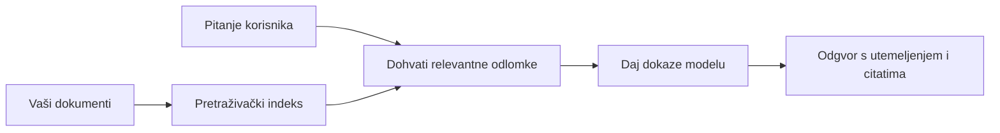

# Naučite AI odgovarati na pitanja na temelju vaših dokumenata:
## Serija 1: RAG, Azure vs Open-Source alternative i kada ima smisla fino podešavanje

> Prvi članak u seriji iz 2026. godine koji ponovno pristupa mojim tutorialima iz 2023. o Azure AI Search + Azure OpenAI dokumentnom QA.

## 1. Uvod - Ponovno razmatranje ranijeg RAG tutoriala

Godine 2023. radio sam na paru tutoriala o tome kako naučiti ChatGPT da odgovara na pitanja iz PDF dokumenata koristeći Azure AI Search i Azure OpenAI. Napisao sam [LangChain verziju](https://techcommunity.microsoft.com/blog/educatordeveloperblog/teach-chatgpt-to-answer-questions-using-azure-ai-search--azure-openai-lang-chain/3969713), a također sam bio koautor popratne [Semantic Kernel verzije](https://techcommunity.microsoft.com/blog/educatordeveloperblog/teach-chatgpt-to-answer-questions-using-azure-ai-search--azure-openai-semantic-k/3985395) s [Lee Stottom](https://developer.microsoft.com/en-us/advocates/lee-stott), glavnim menadžerom za zagovaranje u oblaku u Microsoftu. U to vrijeme ideja "ChatGPT na vašim podacima" još je za mnoge developere bila nova. Tutoriali su koristili Azure Blob Storage, Azure AI Search, Azure OpenAI, LangChain, Semantic Kernel i FAISS-stil vektorske pretrage za odgovaranje na pitanja iz PDF datoteka.

Taj raniji članak fokusirao se na jednostavan, ali važan radni tok: učitajte dokumente, indeksirajte ih, dohvatite relevantan sadržaj i pitajte model da odgovori na temelju tog sadržaja.

Godine 2026. RAG ekosustav je značajno narastao. Azure AI Search sada podržava moderne vektorske i hibridne obrasce dohvaćanja, Azure OpenAI je dio šireg Microsoft Foundry Models ekosustava, a noviji v1 API može koristiti standardnog OpenAI klijenta bez potrebe za mjesečnim izmjenama `api-version`. Istovremeno, open-source opcije poput LangGraph, LlamaIndex, Haystack, Qdrant, Milvus, Weaviate, Chroma, Ollama i vLLM postale su praktični izbori za stvarne RAG sustave.

Zato sam htio ponovno pristupiti ovoj temi. Pitanje više nije samo "Kako gradim RAG?" Sada postoji mnogo načina za izgradnju, a važnije pitanje je "Koju arhitekturu trebam izabrati za svoju situaciju?"

No, temeljni problem nije se promijenio.

AI model ne poznaje automatski vaše dokumente. Da biste izgradili koristan sustav za odgovaranje na pitanja na temelju dokumenata, i dalje vam trebaju pouzdani načini dohvaćanja, utemeljenja, evaluacije i operativni radni tokovi.

Ovaj članak nije još jedan end-to-end "razgovor s PDF-om" tutorial. Želim započeti ovu nadograđenu seriju pitanjem koje mi je sada važnije: kada trebate odabrati upravljanu Azure arhitekturu, kada otvoreni RAG stack i kada ima smisla fino podešavanje?

Ovo je prvi članak u seriji o izgradnji AI sustava utemeljenih na dokumentima. U ovom prvom dijelu fokusirat ćemo se na odluke o arhitekturi: zašto je RAG važan, kada su korisne Azure upravljane usluge, kada imaju smisla open-source alternative i gdje fino podešavanje ima ulogu.

Nakon što sam gradio i ponovno razmatrao dokumentacijske QA sustave, sve me manje zanima koji alat izgleda najbolje u demo verziji, a više me zanima koja arhitektura preživljava prave korisnike, promjenjive dokumente, dozvole, kvarove i održavanje.

## 2. Zašto vašoj AI treba sustav pretraživanja

Veliki jezični modeli trenirani su na širokim javnim i licenciranim podacima. Mogu znati mnogo o općim temama, ali ne poznaju automatski vaše privatne PDF-ove, interne politike, poduzećne procedure, arhive istraživanja, materijale za nastavu, bilješke korisničke podrške ili nedavno ažuriranu dokumentaciju.

Jednostavan način razmišljanja o RAG-u jest ovo: umjesto da očekujemo od modela da pamti svaki dokument, dali smo mu sustav pretraživanja. Kad korisnik postavi pitanje, sustav najprije pronalazi najrelevantnije dijelove informacija, a zatim ih daje modelu kao kontekst.

To je važno jer su mnogi izvori stvarnog znanja privatni, stalno se mijenjaju, osjetljivi na dozvole, pohranjeni u više sustava, napisani u mnogim formatima i preveliki da bi se izravno zalijepili u prompt.

Na primjer, ako škola, tvrtka ili istraživački tim ima 10.000 internih dokumenata, model ne može pouzdano odgovarati na temelju tih dokumenata osim ako sustav ne dohvaća ispravne dijelove u pravo vrijeme.

To prirodno vodi do čestog pitanja:

Zašto jednostavno ne fino podesiti model?

Fino podešavanje može biti korisno, ali obično nije prvi pravi alat za znanje iz dokumenata. Ako se znanje često mijenja, ako su citati važni ili ako su važne pristupne dozvole, RAG je obično bolja početna točka. Fino podešavanje prikladnije je za poučavanje ponašanja, stila, formata izlaza i obrazaca zadataka.

## 3. RAG arhitektura u praksi

Zamislite da gradite AI asistenta za školu. Asistent treba odgovarati na pitanja iz PDF dokumenata o politikama, vodiča za tečajeve, internih FAQ stranica i nedavno ažuriranih obavijesti.

Ako student postavi pitanje: "Mogu li koristiti generativnu AI za svoj završni zadatak?", sustav ne bi trebao odgovarati iz općeg modelovog pamćenja. Trebao bi prvo pronaći relevantnu školsku politiku, dohvatiti odjeljak o korištenju AI i zatim zamoliti model da odgovori koristeći te dokaze.

To je RAG u praksi.

Na visokoj razini, tok možete zamisliti ovako:

Detalji mogu postati sofisticiraniji, ali osnovna je ideja jednostavna: model ne odgovara sam. Odgovara s dohvaćenim dokazima.

Prvo se dokumenti učitavaju iz sustava za pohranu kao što su Azure Blob Storage, SharePoint, GitHub ili interni CMS. Zatim ih sustav pretvara u tekst uz očuvanje korisne strukture kao što su naslovi, brojevi stranica, tablice, odjeljci i izvorišne lokacije.

Sljedeće, sadržaj se dijeli na dijelove. Ovaj korak izgleda jednostavno, ali jedan je od najvažnijih dijelova sustava. Ako je dio premalen, može izgubiti okolni kontekst. Ako je dio prevelik, može uključiti nepovezane informacije i smanjiti preciznost dohvaćanja.

Nakon segmentacije, sustav kreira ugniježđene vektore (embedding) i pohranjuje ih u pretraživi indeks zajedno s izvornim tekstom i metapodacima poput imena datoteke, broja stranice, dozvola, verzije dokumenta i URL-a izvora.

Kad korisnik postavi pitanje, sustav dohvaća kandidatske dijelove koristeći pretraživanje prema ključnim riječima, vektorsko pretraživanje ili hibridno pretraživanje. Reranker može zatim prerasporediti te dijelove tako da se najkorisniji dokazi nađu pri vrhu.

Na kraju, model prima pitanje i dohvaćene dokaze. Odgovor treba biti utemeljen na tim dokazima i vratiti citate kako bi korisnik mogao provjeriti izvor.

Važna stvar je da RAG nije samo "stavite PDF-ove u vektorsku bazu podataka." Kvaliteta odgovora ovisi o cijelom radnom procesu: parsiranju, segmentaciji, dohvaćanju, rerankingu, promptiranju, citiranju i evaluaciji.

Zato je struktura dokumenta važna. U PDF-u, naslov, tablica, fusnota ili granica stranice mogu promijeniti značenje odlomka. Na Azureu, Document Layout vještina koristi mogućnosti Azure Document Intelligence za izvođenje izlaza osjetljivog na strukturu, što može poboljšati kvalitetu segmentacije i dohvaćanja za RAG sustave.

## 4. Što se promijenilo od 2023.?

Tutorial iz 2023. bio je dobar početak za tadašnje vrijeme:

- Azure Blob Storage pohranjivao je PDF datoteke.
- Azure AI Search indeksirao je sadržaj.
- LangChain povezivao dohvaćanje s Azure OpenAI.
- FAISS je radio kao jednostavna lokalna vektorska baza.
- Primjer je koristio `gpt-35-turbo` i `text-embedding-ada-002`.

Godine 2026. moderna verzija trebala bi odražavati nekoliko promjena.

Prvo, dohvaćanje je sazrjelo. Godine 2023. mnogi demo primjeri koristili su jednostavnu pretragu po vektorskoj sličnosti. Danas je hibridno dohvaćanje često zadani početak za ozbiljni dokumentacijski QA. Azure AI Search podržava hibridno pretraživanje kombiniranjem ključnih riječi i vektorskih upita u jednom zahtjevu te spajanjem rezultata Reciprocal Rank Fusion metodom. Semantički rangirnik može potom rerankirati tekstualni dio rezultata punog teksta, vektora i hibrida.

Drugo, unos podataka je sofisticiraniji. Umjesto ručnog dijeljenja svakog dokumenta aplikacijskim kodom, Azure AI Search podržava integriranu vektorizaciju za segmentaciju, ugniježđivanje i vektorizaciju u vrijeme upita. Za PDF-ove i radna opterećenja bogata dokumentima, Document Layout vještina može sačuvati više strukture nego fiksne veličine dijelovi.

Treće, orkestracija je važnija. Težak dio često nije sam LLM API poziv. Težak dio je upravljanje kvarovima, ponovnim pokušajima, zastarjelim dohvatom, kvalitetom dijelova, dugotrajnim radnim tokovima, ljudskim pregledom i evaluacijom na velikoj skali. Tu alati orijentirani na radni tok poput LangGraph, LlamaIndex workflowa, Haystack pipelineova i alata za evaluaciju i nadzor na platformnoj razini postaju relevantniji od jednolančanog pristupa.

Četvrto, evaluacija više nije opcionalna. Demo može izgledati impresivno s jednim pitanjem. Produkcijski sustav treba testne skupove, regresijske provjere, metrike dohvaćanja, provjere utemeljenosti i monitoring. Bez evaluacije teško je znati poboljšava li se sustav ili se samo mijenja.

## 5. Odabir između Azure i Open-Source RAG stackova

Ne mislim da je korisno pitanje "Je li Azure bolji od open source-a?" ili "Je li open source bolji od Azure-a?"

Korisno je pitanje: kakav sustav gradite, tko će ga upravljati, koja ograničenja imate i koji su načini kvarova neprihvatljivi?

Kad sam počinjao graditi primjere za dokumentacijski QA, uglavnom sam razmišljao o tome radi li dohvaćanje. Mogu li učitati PDF-ove, pretraživati ih i generirati odgovor? To je bila razumna početna točka.

Nakon rada na realističnijim AI radnim tokovima, moja evaluacija se promijenila. Sad razmatram četiri stvari prije odabira RAG stacka:

- identitet i dozvole
- kvaliteta dohvaćanja
- pouzdanost radnog toka
- operativno vlasništvo

Ta četiri područja govore vam mnogo više od same benchmark ocjene modela.

Azure-based arhitekture obično imaju smisla kada je integracija u poduzeće težak dio. Ako tim već ovisi o Microsoft Entra ID, Microsoft 365, Azure Storage, privatnoj mreži, RBAC-u i Azure monitoringu, Azure AI Search i Azure OpenAI mogu smanjiti puno operativne složenosti. U tom okruženju, Azure nije samo model API. Vrijednost je u okolnome sustavu: identitet, upravljanje, upravljano pretraživanje, integracija sigurnosti, podrška i poznate operacije.

Open-source arhitekture obično imaju smisla kada je fleksibilnost ključni izazov. Ako timu treba lokalno izvođenje, prenosivost u oblak, prilagođeni pipeline dohvaćanja, specijalizirani reranking ili izravan nadzor nad vektorskom bazom i slojem za posluživanje modela, open-source stack može biti bolji izbor. Cijena je što tim preuzima veću odgovornost za pouzdanost: backup, skaliranje, latenciju, migracije, monitoring i sigurnost.

U praksi, mnogi produkcijski AI sustavi nisu čisto cloud-native ili čisto open-source. Često su to hibridni sustavi koji balansiraju operativnu jednostavnost, prenosivost, upravljanje i inženjersku fleksibilnost.

Na primjer, ne bih se iznenadio vidjeti sustav koji koristi Azure OpenAI za pristup modelu, LangGraph za orkestraciju radnog toka, Azure hostiranje za deploy, i open-source vektorsku bazu za specifični zahtjev dohvaćanja. To nije arhitektonska nekonzistentnost. To je odabir pravog nivoa upravljane usluge i inženjerske kontrole za svaki dio sustava.

Sviđaju mi se hibridne arhitekture kad upravljana platforma rješava važne poslovne probleme, a open-source komponente timu daju fleksibilnost tamo gdje je to stvarno važno.

## 6. Praktični vodič za odluke

Evo tablice odluka koju bih koristio s timom prije odabira RAG stacka:

| Područje odluke | Azure upravljani stack je jači kad... | Open-source stack je jači kad... |
| --- | --- | --- |
| Identitet i pristup | Entra ID, RBAC, upravljani identitet i dozvole na razini poduzeća su ključni | prilagođena autentikacija, ne-Microsoft identitet ili aplikacijska logika pristupa dominiraju |
| Operacije | tim želi upravljanu infrastrukturu, podršku, SLA-e i jednostavnije uvođenje | tim može upravljati vektorskim bazama, posluživanje modela, backupima i skaliranjem |
| Dohvaćanje | hibridno pretraživanje, semantičko rangiranje, filteri i pretraživanje metapodataka pokrivaju većinu potreba | tim treba prilagođeno dohvaćanje, specijalizirani reranking ili eksperimentalno indeksiranje |
| Prenosivost | usklađenost s Azure ekosustavom je prihvatljiva ili preferirana | izbjegavanje zaključavanja u oblaku je strogi zahtjev |
| Izvođenje | upravljanje Azure OpenAI, mreža i kontrole na razini poduzeća su važne | lokalno izvođenje, prilagođeni modeli ili samostalno posluživanje su potrebni |
| Trošak | smanjenje inženjerskog i operativnog napora važnije je od prilagodbe infrastrukture | opseg je dovoljno velik da opravda optimizaciju infrastrukture |
| Eksperimentiranje | stabilnost i integracija u poduzeće važniji su od čestih promjena komponenti | tim brzo iterira na agentima, alatima, memoriji i radnim tokovima dohvaćanja |

Moje pravilo palca je jednostavno:

- Počnite s Azureom kada su integracija u poduzeće, sigurnost i operativna jednostavnost glavni rizici.
- Počnite s open source-om kada su prenosivost, prilagodba ili lokalna kontrola glavni rizici.
- Koristite hibridni stack kad su oba istinita.

Zato također ne bih započinjao 2026. RAG seriju s kodom kao prvim korakom. Kod je važan, ali izbor arhitekture dolazi prije implementacije. Jednostavan demo može skrivati najteže odluke. Dobar RAG sustav ih čini eksplicitnim.

## 7. Gdje fino podešavanje ima ulogu

Fino podešavanje se često spominje zajedno s RAG-om, ali mislim da je važno razlikovati ta dva.

RAG je obično bolji izbor kada sustav treba svježe, privatno, osjetljivo na dozvole ili na izvor utemeljeno znanje. Ako odgovor treba citirati dokumente, odražavati nedavna ažuriranja ili poštivati specifična pravila pristupa korisniku, dohvaćanje treba biti dio arhitekture.

Fino podešavanje je korisnije kad znanje nije glavni problem. Može pomoći kada želite da model slijedi specifičan format izlaza, odgovara u stilu vezanom za domen, dosljednije izvodi stabilan zadatak ili smanjuje količinu uputa potrebnih u svakom promptu.
U praksi, ova dva mogu raditi zajedno. Pomoćni asistent za podršku mogao bi koristiti RAG za dohvaćanje najnovije politike, dok model koji je specijaliziran uči preferiranu strukturu odgovora i ton tvrtke.

Pogreška je tretirati fino podešavanje kao zamjenu za spremište dokumenata. Ono ne uklanja potrebu za dohvaćanjem kad sustav mora odgovoriti na temelju svježih, privatnih ili podataka osjetljivih na dozvole.

## 8. Kamo Ova Serija Dalje Ide

Ovaj članak je sloj donošenja odluka. Prije pisanja koda, želio sam jasno iskazati ustupke: RAG nasuprot fino podešavanju, Azure naspram open source, upravljane usluge naspram operativne kontrole.

Prije prelaska na implementaciju, želim ovdje ostaviti jednu točku: u mnogim poslovnim AI sustavima, model je samo jedan sastavni dio. Kvaliteta dohvaćanja, orkestracija, evaluacija, dozvole i operativna pouzdanost često su ti koji određuju hoće li sustav uspjeti izvan demonstracijske faze.

U sljedećim dijelovima ove serije planiram dublje ući u praktični aspekt AI sustava utemeljenih na dokumentima: kako izgraditi arhitekturu temeljenu na Azureu, kako se otvorene alternative uspoređuju u praksi i kako procijeniti radi li RAG sustav zapravo.

Mogu prilagoditi redoslijed kako se serija razvija, ali cilj će ostati isti: prijeći preko jednostavne demonstracije i pokazati kako razmišljati o RAG sustavima koji se mogu održavati, evaluirati i upravljati njima.

## 9. Reference i Resursi

Izvorni tutorijali:

- [Teach ChatGPT to Answer Questions: Using Azure AI Search & Azure OpenAI (Lang Chain)](https://techcommunity.microsoft.com/blog/educatordeveloperblog/teach-chatgpt-to-answer-questions-using-azure-ai-search--azure-openai-lang-chain/3969713)
- [Teach ChatGPT to Answer Questions: Using Azure AI Search & Azure OpenAI (Semantic Kernel)](https://techcommunity.microsoft.com/blog/educatordeveloperblog/teach-chatgpt-to-answer-questions-using-azure-ai-search--azure-openai-semantic-k/3985395)

Azure:

- [Azure AI Search REST API verzije](https://learn.microsoft.com/en-us/rest/api/searchservice/search-service-api-versions)
- [Hibridno pretraživanje u Azure AI Search](https://learn.microsoft.com/en-us/azure/search/hybrid-search-how-to-query)
- [Integrirana vektorizacija u Azure AI Search](https://learn.microsoft.com/en-us/azure/search/vector-search-integrated-vectorization)
- [Dokument Layout skill u Azure AI Search](https://learn.microsoft.com/en-us/azure/search/cognitive-search-skill-document-intelligence-layout)
- [Podjela na dijelove i vektorizacija prema rasporedu dokumenta](https://learn.microsoft.com/en-us/azure/search/search-how-to-semantic-chunking)
- [Semantičko rangiranje u Azure AI Search](https://learn.microsoft.com/en-us/azure/search/semantic-search-overview)
- [Azure OpenAI / Microsoft Foundry API verzijski životni ciklus](https://learn.microsoft.com/en-us/azure/foundry/openai/api-version-lifecycle)
- [Foundry modeli prodani od strane Azure](https://learn.microsoft.com/en-us/azure/foundry/foundry-models/concepts/models-sold-directly-by-azure)
- [Microsoft Foundry razmatranja za fino podešavanje](https://learn.microsoft.com/en-us/azure/foundry/openai/concepts/fine-tuning-considerations)
- [Microsoft Foundry vidljivost](https://learn.microsoft.com/en-us/azure/foundry/concepts/observability)
- [Pokreni evaluacije u Microsoft Foundry](https://learn.microsoft.com/en-us/azure/foundry/how-to/evaluate-generative-ai-app)

Open-source:

- [LangGraph dokumentacija](https://docs.langchain.com/oss/python/langgraph/overview)
- [LlamaIndex dokumentacija](https://developers.llamaindex.ai/python/framework/)
- [Haystack dokumentacija](https://docs.haystack.deepset.ai/)
- [Qdrant dokumentacija](https://qdrant.tech/documentation/overview/)
- [Milvus dokumentacija](https://milvus.io/docs/overview.md)
- [Weaviate dokumentacija](https://docs.weaviate.io/weaviate/current/)
- [Chroma dokumentacija](https://docs.trychroma.com/docs/overview/introduction)
- [Ollama ugradnje](https://docs.ollama.com/capabilities/embeddings)
- [vLLM OpenAI-kompatibilni server](https://docs.vllm.ai/en/latest/serving/openai_compatible_server.html)
- [BGE modeli ugradnje](https://huggingface.co/BAAI/bge-large-en-v1.5)
- [E5 modeli ugradnje](https://huggingface.co/intfloat/e5-large-v2)
- [Instructor modeli ugradnje](https://huggingface.co/hkunlp/instructor-large)

---

<!-- CO-OP TRANSLATOR DISCLAIMER START -->
**Napomena**:
Ovaj dokument je preveden korištenjem AI prevoditeljskog servisa [Co-op Translator](https://github.com/Azure/co-op-translator). Iako težimo točnosti, imajte na umu da automatski prijevodi mogu sadržavati greške ili netočnosti. Izvorni dokument na izvornom jeziku treba smatrati autoritativnim izvorom. Za važne informacije preporuča se profesionalni ljudski prijevod. Nismo odgovorni za bilo kakva nesporazumevanja ili pogrešne interpretacije koje proizlaze iz korištenja ovog prijevoda.
<!-- CO-OP TRANSLATOR DISCLAIMER END -->