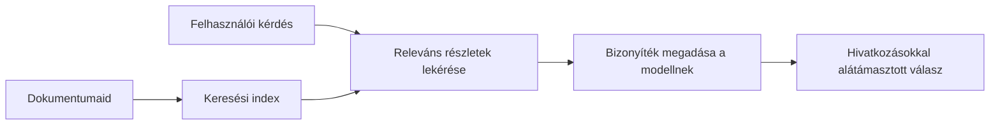

# Tanítsd meg az MI-t arra, hogy válaszoljon a dokumentumaid alapján feltett kérdésekre:
## 1. sorozat: RAG, Azure vs nyílt forráskódú alternatívák, és mikor érdemes finomhangolni

> Egy 2026-os sorozat első cikke, amelyben újragondolom a 2023-as Azure AI Search + Azure OpenAI dokumentum-gyakorlati útmutatóimat.

Sorozat navigáció: [Tároló főoldala](../README.md) | Következő: [2. sorozat – Helyi nyílt forráskódú RAG rendszer építése a kezdetektől a végéig](./series-2-open-source-rag-end-to-end.md)

## 1. Bevezető – Egy korábbi RAG útmutató újragondolása

2023-ban két útmutatón dolgoztam, amelyben arról tanítottam a ChatGPT-t, hogyan válaszoljon kérdésekre PDF dokumentumokból az Azure AI Search és az Azure OpenAI használatával. Én írtam a [LangChain verziót](https://techcommunity.microsoft.com/blog/educatordeveloperblog/teach-chatgpt-to-answer-questions-using-azure-ai-search--azure-openai-lang-chain/3969713), és társszerzője voltam a kísérő [Semantic Kernel verziónak](https://techcommunity.microsoft.com/blog/educatordeveloperblog/teach-chatgpt-to-answer-questions-using-azure-ai-search--azure-openai-semantic-k/3985395) [Lee Stott](https://developer.microsoft.com/en-us/advocates/lee-stott)-tal, a Microsoft Principal Cloud Advocate Managerével. Akkoriban a „ChatGPT adatbázison alapuló működése” sok fejlesztő számára még újnak számított. Az útmutatók az Azure Blob Storage-t, Azure AI Search-t, Azure OpenAI-t, LangChain-t, Semantic Kernel-t és FAISS-stílusú vektor alapú keresést használtak kérdések megválaszolására PDF fájlokból.

Az akkori cikk egy egyszerű, de fontos munkafolyamatra koncentrált: dokumentumokat feltölteni, indexelni, releváns tartalmat lekérni, majd egy modellt megkérni, hogy a tartalom alapján válaszoljon.

2026-ra a RAG ökoszisztéma jelentősen fejlődött. Az Azure AI Search immár támogatja a modern vektor- és hibrid lekérdezési mintákat, az Azure OpenAI a Microsoft Foundry Models szélesebb ökoszisztéma része, és az újabb v1 API már az OpenAI szabványos kliensével működik anélkül, hogy havonta kellene az `api-version`-t változtatni. Ezzel párhuzamosan a nyílt forráskódú megoldások, mint a LangGraph, LlamaIndex, Haystack, Qdrant, Milvus, Weaviate, Chroma, Ollama és vLLM gyakorlati lehetőséggé váltak valódi RAG rendszerekhez.

Ezért akartam újra áttekinteni ezt a témát. A kérdés már nem pusztán az, hogy „Hogyan építsek RAG-et?” Sokféle módja van már a megvalósításnak, a fontosabb kérdés az, hogy „Melyik architektúrát válasszam az adott helyzetemre?”

De az alapvető probléma nem változott.

Egy MI modell nem ismeri automatikusan a dokumentumaidat. Egy hasznos dokumentum-alapú kérdés-válasz rendszer kiépítéséhez még mindig megbízható lekérésre, alapokra helyezésre, értékelésre és működési munkafolyamatokra van szükség.

Ez a cikk nem egy újabb „chat PDF-fel” végponttól végpontig tutorial. Ezt a frissített sorozatot azzal a kérdéssel indítom, ami mostanra fontosabb: mikor válasszunk menedzselt Azure architektúrát, mikor érdemes nyílt forráskódú RAG-rendszert, és mikor van valóban értelme a finomhangolásnak?

Ez a cikk egy sorozat első része a dokumentum-földelt AI rendszerek építéséről. Ebben az első részben az architektúra döntésekre fókuszálunk: miért fontos a RAG, mikor hasznosak az Azure-alapú menedzselt szolgáltatások, mikor érdemes nyílt forráskódú alternatívákban gondolkodni, és hol helyezkedik el a finomhangolás.

Dokumentum QA rendszerek építése és újragondolása után kevésbé érdekel, hogy egy eszköz hogyan fest egy demóban, és sokkal inkább az, melyik architektúra bírja ki a valódi felhasználókat, változó dokumentumokat, jogosultságokat, hibákat és karbantartást.

## 2. Miért van szüksége az MI-dnek egy keresőrendszerre

A nagy nyelvi modelleket széles körű nyilvános és licencelt adatokkal tanították. Lehet, hogy sok mindent tud általános témákról, de nem ismeri automatikusan a privát PDF-jeidet, belső szabályzataidat, vállalati eljárásaidat, kutatási archívumaidat, tantermi anyagaidat, ügyfélszolgálati jegyzeteidet vagy a nemrég frissített dokumentációt.

Egyszerűen így lehet gondolkodni a RAG-ről: ahelyett, hogy elvárnánk a modelltől, hogy minden dokumentumot megjegyezzen, adunk neki egy keresőrendszert. Amikor a felhasználó kérdez, a rendszer először megtalálja a releváns információdarabokat, majd ezeket a darabokat adja a modellnek kontextusként.

Ez azért fontos, mert sok valós tudásforrás privát, folyamatosan változó, jogosultság-érzékeny, több rendszeren tárolt, sokféle formátumban írt, és túl nagy ahhoz, hogy közvetlenül promptba másoljuk.

Például ha egy iskola, cég vagy kutatócsoport 10 000 belső dokumentummal rendelkezik, a modell nem tud megbízhatóan válaszolni ezekből a dokumentumokból, hacsak a rendszer nem szedi ki a megfelelő részeket a megfelelő időben.

Ez természetesen egy gyakori kérdéshez vezet:

Miért ne finomhangolnánk egyszerűen a modellt?

A finomhangolás hasznos lehet, de általában nem a megfelelő első eszköz a dokumentum-alapú tudáshoz. Ha a tudás gyakran változik, a hivatkozások számítanak vagy a hozzáférési jogosultságok lényegesek, a RAG rendszer általában jobb kiindulópont. A finomhangolás inkább a viselkedés, a stílus, a kimeneti formátum és a feladatsémák tanítására való.

## 3. A RAG architektúra a gyakorlatban

Képzeld el, hogy egy iskola számára építesz egy MI asszisztenst. Az asszisztensnek tudnia kell válaszolni olyan kérdésekre, amelyek szabályzati PDF-ekből, tanfolyami útmutatókból, belső GYIK oldalakból és a nemrég frissített közleményekből származnak.

Ha egy diák megkérdezi: „Használhatok generatív MI-t a záró dolgozatomhoz?”, a rendszer nem a modell általános memóriájából válaszoljon. Először meg kell találnia a releváns iskola szabályzatot, le kell kérnie a MI használatáról szóló részt, majd a modellt megkérni, hogy ezt a bizonyítékot felhasználva válaszoljon.

Ez a RAG a gyakorlatban.

Magas szinten a folyamat így néz ki:

A részletek bonyolultabbá válhatnak, de az alapvető ötlet egyszerű: a modell nem egyedül válaszol. A visszakeresett bizonyítékkal válaszol.

Először a dokumentumokat betöltik tárolórendszerekből, mint az Azure Blob Storage, SharePoint, GitHub vagy egy belső CMS. Aztán a rendszer szöveggé alakítja őket, miközben megőrzi a hasznos struktúrát, mint a címsorok, oldalszámok, táblázatok, szakaszok és forráshelyek.

Ezután a tartalmat darabokra törik. Ez a lépés egyszerűnek hangzik, de a rendszer egyik legfontosabb része. Ha a darab túl kicsi, elveszítheti a környező kontextust. Ha túl nagy, olyan, nem kapcsolódó információkat tartalmaz, amelyek csökkentik a lekérés pontosságát.

A darabolás után a rendszer beágyazásokat készít, majd egy kereshető indexben tárolja őket az eredeti szöveggel és metaadatokkal együtt, mint például fájlnév, oldalszám, jogosultságok, dokumentumverzió és forrás URL.

Amikor a felhasználó kérdez, a rendszer kulcsszavas keresés, vektor keresés vagy hibrid keresés segítségével megtalálja a jelölt darabokat. Egy újrarendező pedig felülrendezheti ezeket, hogy a leginformatívabb bizonyítékok a tetején legyenek.

Végül a modell megkapja a kérdést és a visszakeresett bizonyítékokat. A válasznak ezen bizonyítékokon kell alapulnia, és idézeteket kell tartalmaznia, hogy a felhasználó ellenőrizhesse a forrást.

A lényeg, hogy a RAG nem csupán annyi, hogy „békeljetek be PDF-eket egy vektor adatbázisba.” A válasz minősége a teljes munkafolyamat függvénye: elemzés, darabolás, lekérés, újrarendezés, promptok, forrásmegjelölés és értékelés.

Ezért fontos a dokumentum szerkezete. Egy PDF-ben egy címsor, táblázat, lábjegyzet vagy oldaltörés megváltoztathatja egy szövegrész értelmét. Az Azure Document Layout skill az Azure Document Intelligence elrendezési képességeit használja, hogy szerkezetérzékeny outputot adjon, amely javíthatja a darabolás és lekérés minőségét RAG rendszereknél.

## 4. Mi változott 2023 óta?

A 2023-as útmutató akkoriban jó kiindulópont volt:

- Azure Blob Storage tárolta a PDF fájlokat.
- Azure AI Search indexelte a tartalmat.
- LangChain összekötötte a lekérést az Azure OpenAI-jal.
- FAISS egyszerű helyi vektor adatbázisként működött.
- A példa `gpt-35-turbo` és `text-embedding-ada-002` modelleket használt.

2026-ra a modern verziónak több változást is tükröznie kell.

Először: a lekérés kifinomultabbá vált. 2023-ban sok demo egyszerű vektorhasonlóságon alapuló keresést alkalmazott. Ma a hibrid lekérés a komoly dokumentum-gyakorlati rendszerek alapértelmezett kezdőpontja. Az Azure AI Search támogatja a hibrid keresést, amely kulcsszavas és vektoros lekérdezést egyesít egy kérésben, majd eredményeket egyesít Reciprocal Rank Fusion-nal. A szemantikus rendező pedig újrarendeli a teljes szöveget, vektort és hibrid eredményeket.

Másodszor, a betöltés kifinomultabb. Az egyedi dokumentumok kézi darabolása helyett az Azure AI Search integrált vektoralapú feldolgozást kínál daraboláshoz, beágyazáshoz és lekérdezés idejű vektoralapú kiértékeléshez. A PDF-ek és dokumentumokkal terhelt munkaterhelések esetén a Document Layout skill több szerkezetet őriz meg, mint a fix méretű darabok.

Harmadszor, az összehangolás fontosabbá vált. A nehéz rész gyakran nem magának az LLM API hívásnak a kezelése. A nehézség a hibák kezelése, újrapróbálkozások, elavult lekérések, darabbeli minőség, hosszú folyamatok, emberi átnézés és méretezett értékelés. Itt válnak fontossá a folyamat-orientált eszközök, mint a LangGraph, LlamaIndex munkafolyamatok, Haystack csővezetékek és platformszintű értékelési és megfigyelési eszközök, melyek fontosabbak lehetnek, mint egy egyszerű, lineáris lánc.

Negyedszer, az értékelés már nem opcionális. Egy demó egy kérdéssel impresszív lehet. Egy éles rendszernek kell hogy legyen tesztadat-készlete, regressziós ellenőrzése, lekérdezési mutatók, alaposság-ellenőrzés és monitorozás. Értékelés nélkül nehéz tudni, fejlődik-e a rendszer vagy csak változik.

## 5. Választás az Azure és a nyílt forráskódú RAG csomagok között

Nem hiszem, hogy hasznos kérdés az, hogy „Az Azure jobb-e, mint a nyílt forráskódú megoldás?” vagy „A nyílt forráskód jobb-e, mint az Azure?”

A hasznos kérdés az, hogy milyen rendszert építesz, ki fogja üzemeltetni, milyen korlátaid vannak, és mely hibamódok elfogadhatatlanok?

Amikor elkezdtem dokumentum QA példákat építeni, főleg az érdekelt, működött-e a lekérés. Fel tudok-e tölteni PDF-eket, tudok-e keresni bennük, és válaszolni? Ez egy ésszerű kezdő lépés volt.

Reálisabb MI munkafolyamatokon átmenve az értékelésem megváltozott. Most négy dolgot veszek figyelembe, mielőtt RAG csomagot választok:

- azonosítás és jogosultságok
- lekérés minősége
- munkafolyamat megbízhatósága
- üzemeltetési tulajdonjog

Ezek a négy terület többet mondanak, mint egy modell mérőszám.

Azure-alapú architektúrák általában akkor érdemesek, ha a vállalati integráció a nehézség. Ha egy csapat már Microsoft Entra ID-t, Microsoft 365-öt, Azure tárolást, privát hálózatot, RBAC-ot és Azure monitorozást használ, az Azure AI Search és Azure OpenAI sok üzemeltetési komplexitást csökkenthet. Ebben a környezetben az Azure nem csak modell API. Az érték a környező rendszerben van: azonosítás, irányítás, menedzselt keresés, biztonsági integráció, támogatás és ismert üzemeltetés.

Nyílt forráskódú architektúrák akkor érdemesek, ha a rugalmasság a nehézség. Ha a csapatnak helyi dedukció, felhőfüggetlenség, egyedi lekérési csővezeték, specializált újrarendezés vagy közvetlen kontroll kell a vektor adatbázis és modellszolgáltatás felett, a nyílt forráskódú megoldás jobb választás lehet. A kompromisszum, hogy a csapat több felelősséget vállal a megbízhatóságért: biztonsági mentések, méretezés, késleltetés, migrációk, monitorozás és biztonság.

Gyakorlatban sok éles MI rendszer nem tisztán felhő-alapú vagy tisztán nyílt forráskódú. Gyakran hibrid rendszerek, amelyek kiegyensúlyozzák az üzemeltetési egyszerűséget, hordozhatóságot, irányítást és mérnöki rugalmasságot.

Például nem lepődnék meg, ha egy rendszer az Azure OpenAI-t használja modell-hozzáférésre, LangGraph-ot munkafolyamat-összehangolásra, Azure tárhelyet telepítéshez és egy nyílt forráskódú vektor-adatbázist egy speciális lekéréshozzáférési igényre. Ez nem architekturális ellentmondás. Ez az egyes rendszer részek megfelelő szintű menedzselt szolgáltatás és mérnöki kontroll kiválasztása.

Kedvelem a hibrid architektúrákat, amikor a menedzselt platform fontos vállalati problémákat old meg, míg a nyílt forráskódú komponensek rugalmasságot adnak ott, ahol az igazán számít.

## 6. Egy gyakorlati döntési útmutató

Itt van egy döntési táblázat, amit egy csapattal használnék RAG csomag választása előtt:

| Döntési terület | Az Azure menedzselt csomag erősebb, ha... | A nyílt forráskódú csomag erősebb, ha... |
| --- | --- | --- |
| Azonosítás és hozzáférés | Entra ID, RBAC, menedzselt identitás és vállalati jogosultságok központiak | egyedi hitelesítés, nem Microsoft identitás vagy alkalmazás-specifikus hozzáférési logika dominál |
| Üzemeltetés | a csapat menedzselt infrastruktúrát, támogatást, SLA-kat és egyszerűbb beállítást akar | a csapat képes vektoradatbázisokat, modellszolgáltatást, biztonsági mentéseket és méretezést üzemeltetni |
| Lekérés | hibrid keresés, szemantikus rangsorolás, szűrők és metaadat keresés a legtöbb igényt lefedik | a csapatnak egyedi lekérésre, speciális újrarendezésre vagy kísérleti indexelésre van szüksége |
| Hordozhatóság | az Azure ökoszisztéma elfogadható vagy preferált | a felhős bezártság elkerülése szükséges |
| Dedukció | az Azure OpenAI irányítás, hálózat és vállalati kontroll számít | helyi dedukció, egyedi modellek vagy saját hostolt szolgáltatás szükséges |
| Költség | a mérnöki és üzemeltetési erőfeszítés csökkentése fontosabb, mint az infrastruktúra finomhangolása | a méret elég nagy a gondos infrastruktúra optimalizációhoz |
| Kísérletezés | stabilitás és vállalati integráció fontosabb, mint a gyakori komponensváltás | a csapat gyorsan iterál az ügynökökön, eszközökön, memórián és lekérdezési munkafolyamatokon |

Az aranyszabályom egyszerű:

- Az Azure-dal indíts, ha a vállalati integráció, biztonság és üzemeltetési egyszerűség a fő kockázat.
- Nyílt forráskódúval indíts, ha a hordozhatóság, személyre szabhatóság vagy helyi kontroll a fő kockázat.
- Használj hibrid csomagot, ha mindkettő igaz.

Ezért sem kezdenék 2026-os RAG sorozatot elsőként kóddal. A kód fontos, de az architektúra kiválasztás előzi meg a megvalósítást. Egy egyszerű demo elrejtheti a legnehezebb döntéseket. Egy jó RAG rendszer megmutatja ezeket a döntéseket.

## 7. Hol illeszkedik a finomhangolás

A finomhangolást gyakran említik együtt a RAG-gel, de fontos kettéválasztani a kettőt.

A RAG általában jobb választás, ha a rendszernek friss, privát, jogosultság-érzékeny vagy forrásalapú tudásra van szüksége. Ha a válasznak dokumentumokra kell hivatkoznia, tükröznie a frissítéseket vagy tiszteletben tartania felhasználó-specifikus hozzáférési szabályokat, a lekérésnek része kell hogy legyen az architektúrának.
A finomhangolás hasznosabb, ha a tudás nem a fő probléma. Segíthet, ha azt szeretnénk, hogy a modell egy adott kimeneti formátumot kövessen, egy adott szakterülethez illő válaszstílust alkalmazzon, egy stabil feladatot következetesebben hajtson végre, vagy csökkentse az egyes utasításokban szükséges instrukciók mennyiségét.

Gyakorlatban a kettő együtt is működhet. Egy ügyfélszolgálati asszisztens például RAG-et használhat a legfrissebb irányelv lekérésére, miközben egy finomhangolt modell megtanulja a vállalat preferált válaszstruktúráját és hangnemét.

A hibát az jelenti, ha a finomhangolást dokumentumtár helyettesítőjeként kezelik. Nem szünteti meg a lekérdezés szükségességét, amikor a rendszernek friss, privát vagy jogosultság-érzékeny adatokból kell válaszolnia.

## 8. Hová tart ez a sorozat

Ez a cikk a döntéshozatali réteg. Mielőtt kódot írok, szerettem volna világossá tenni a kompromisszumokat: RAG kontra finomhangolás, Azure kontra nyílt forráskód, felügyelt szolgáltatások kontra működésbeli kontroll.

Mielőtt a megvalósításra térnék, még egy pontot szeretnék megemlíteni: sok vállalati AI rendszerben maga a modell csak egy komponens. Gyakran a lekérés minősége, az összehangolás, az értékelés, a jogosultságok és az üzemeltetési megbízhatóság dönti el, hogy a rendszer a demó szintjén túl sikeres lesz-e.

A sorozat következő részeiben mélyebben bele kívánok menni a dokumentum-alapú AI rendszerek gyakorlati oldalába: először egy helyi, nyílt forráskódú RAG munkafolyamatot építek, majd ugyanazt a forgatókönyvet újraalkotom Azure AI Search és Azure OpenAI használatával, majd kiértékelem, hogy a rendszer valóban működik-e.

A sorozat fejlődésével módosíthatom a sorrendet, de a cél változatlan marad: túllépni egy egyszerű demón, és bemutatni, hogyan gondolkodjunk karbantartható, értékelhető és üzemeltethető RAG rendszerekről.

## 9. Hivatkozások és források

Eredeti oktatóanyagok:

- [Teach ChatGPT to Answer Questions: Using Azure AI Search & Azure OpenAI (Lang Chain)](https://techcommunity.microsoft.com/blog/educatordeveloperblog/teach-chatgpt-to-answer-questions-using-azure-ai-search--azure-openai-lang-chain/3969713)
- [Teach ChatGPT to Answer Questions: Using Azure AI Search & Azure OpenAI (Semantic Kernel)](https://techcommunity.microsoft.com/blog/educatordeveloperblog/teach-chatgpt-to-answer-questions-using-azure-ai-search--azure-openai-semantic-k/3985395)

Azure:

- [Azure AI Search REST API versions](https://learn.microsoft.com/en-us/rest/api/searchservice/search-service-api-versions)
- [Hybrid search in Azure AI Search](https://learn.microsoft.com/en-us/azure/search/hybrid-search-how-to-query)
- [Integrated vectorization in Azure AI Search](https://learn.microsoft.com/en-us/azure/search/vector-search-integrated-vectorization)
- [Document Layout skill in Azure AI Search](https://learn.microsoft.com/en-us/azure/search/cognitive-search-skill-document-intelligence-layout)
- [Chunk and vectorize by document layout](https://learn.microsoft.com/en-us/azure/search/search-how-to-semantic-chunking)
- [Semantic ranking in Azure AI Search](https://learn.microsoft.com/en-us/azure/search/semantic-search-overview)
- [Azure OpenAI / Microsoft Foundry API version lifecycle](https://learn.microsoft.com/en-us/azure/foundry/openai/api-version-lifecycle)
- [Foundry Models sold by Azure](https://learn.microsoft.com/en-us/azure/foundry/foundry-models/concepts/models-sold-directly-by-azure)
- [Microsoft Foundry fine-tuning considerations](https://learn.microsoft.com/en-us/azure/foundry/openai/concepts/fine-tuning-considerations)
- [Microsoft Foundry observability](https://learn.microsoft.com/en-us/azure/foundry/concepts/observability)
- [Run evaluations in Microsoft Foundry](https://learn.microsoft.com/en-us/azure/foundry/how-to/evaluate-generative-ai-app)

Nyílt forráskód:

- [LangGraph documentation](https://docs.langchain.com/oss/python/langgraph/overview)
- [LlamaIndex documentation](https://developers.llamaindex.ai/python/framework/)
- [Haystack documentation](https://docs.haystack.deepset.ai/)
- [Qdrant documentation](https://qdrant.tech/documentation/overview/)
- [Milvus documentation](https://milvus.io/docs/overview.md)
- [Weaviate documentation](https://docs.weaviate.io/weaviate/current/)
- [Chroma documentation](https://docs.trychroma.com/docs/overview/introduction)
- [Ollama embeddings](https://docs.ollama.com/capabilities/embeddings)
- [vLLM OpenAI-compatible server](https://docs.vllm.ai/en/latest/serving/openai_compatible_server.html)
- [BGE embedding models](https://huggingface.co/BAAI/bge-large-en-v1.5)
- [E5 embedding models](https://huggingface.co/intfloat/e5-large-v2)
- [Instructor embedding models](https://huggingface.co/hkunlp/instructor-large)

Következő: [Series 2 - Build a Local Open-Source RAG System End to End](./series-2-open-source-rag-end-to-end.md)

---

<!-- CO-OP TRANSLATOR DISCLAIMER START -->
**Jogi nyilatkozat**:
Ez a dokumentum az AI fordítási szolgáltatás, a [Co-op Translator](https://github.com/Azure/co-op-translator) segítségével készült. Bár az pontosságra törekszünk, kérjük, vegye figyelembe, hogy az automatikus fordítások hibákat vagy pontatlanságokat tartalmazhatnak. Az eredeti dokumentum az anyanyelvén tekintendő hiteles forrásnak. Fontos információk esetén professzionális emberi fordítást javasolunk. Nem vállalunk felelősséget semmilyen félreértésért vagy téves értelmezésért, amely ebből a fordításból ered.
<!-- CO-OP TRANSLATOR DISCLAIMER END -->