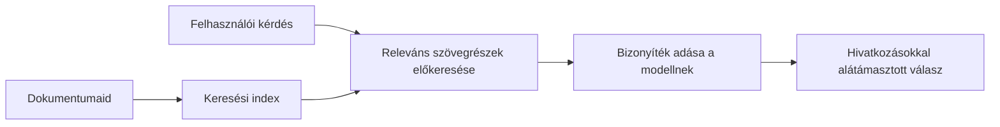

# Tanítsd meg az MI-t, hogy a dokumentumaid alapján válaszoljon a kérdésekre:
## 1. sorozat: RAG, Azure vs. nyílt forráskódú alternatívák és mikor érdemes finomhangolni

> Az első cikk egy 2026-os sorozatban, amely újra áttekinti a 2023-as Azure AI Search + Azure OpenAI dokumentumkérdés-válasz oktatóanyagaimat.

## 1. Bevezető – Egy korábbi RAG oktatóanyag újratárgyalása

2023-ban két oktatóanyagon dolgoztam, amelyek arról szóltak, hogyan tanítható a ChatGPT arra, hogy PDF dokumentumokból válaszoljon kérdésekre az Azure AI Search és az Azure OpenAI használatával. Én írtam a [LangChain verziót](https://techcommunity.microsoft.com/blog/educatordeveloperblog/teach-chatgpt-to-answer-questions-using-azure-ai-search--azure-openai-lang-chain/3969713), és társszerzőként dolgoztam a kísérő [Semantic Kernel verzión](https://techcommunity.microsoft.com/blog/educatordeveloperblog/teach-chatgpt-to-answer-questions-using-azure-ai-search--azure-openai-semantic-k/3985395) is [Lee Stott](https://developer.microsoft.com/en-us/advocates/lee-stott) mellett, aki a Microsoftnál Principal Cloud Advocate Manager. Akkoriban a „ChatGPT a te adataiddal” gondolata még új volt sok fejlesztő számára. Az oktatóanyagok az Azure Blob Storage-t, Azure AI Search-t, Azure OpenAI-t, LangChain-t, Semantic Kernelt és FAISS-stílusú vektorlekérdezést használtak PDF fájlokból való kérdésfeltevéshez.

A korábbi cikk egy egyszerű, de fontos munkafolyamatra összpontosított: dokumentumok feltöltése, indexelése, releváns tartalom lekérése, és a modell megkérdezése az adott tartalom alapján válaszadásra.

2026-ra a RAG ökoszisztéma jelentősen kibővült. Az Azure AI Search most már támogatja a modern vektoros és hibrid lekérdezési mintákat, az Azure OpenAI a Microsoft Foundry Models szélesebb ökoszisztémájának része lett, és az újabb v1 API a szabványos OpenAI kliens használatát teszi lehetővé havi `api-version` változtatások nélkül. Eközben olyan nyílt forráskódú lehetőségek, mint a LangGraph, LlamaIndex, Haystack, Qdrant, Milvus, Weaviate, Chroma, Ollama és vLLM gyakorlati választásokká váltak valódi RAG rendszerekhez.

Ezért szerettem volna újra áttekinteni ezt a témát. A kérdés már nem csak annyi, hogy „Hogyan építsek RAG-et?” Sokféleképpen lehet ma már felépíteni, és a fontosabb kérdés az, hogy „Milyen architektúrát válasszak az adott helyzethez?”

De a lényegi probléma nem változott.

Egy MI modell önmagától nem ismeri a dokumentumaidat. Hasznos dokumentum-kérdés-válasz rendszert építeni továbbra is megbízható lekérdezést, alapozást, kiértékelést és működési munkafolyamatokat igényel.

Ez a cikk nem egy újabb zéró végpontú „chat PDF-fel” oktatóanyag. Ezt a frissített sorozatot azzal a kérdéssel szeretném kezdeni, ami most jobban érdekel: mikor válassz kezelt Azure architektúrát, mikor nyílt forráskódú RAG megoldást, és mikor érdemes ténylegesen finomhangolni?

Ez az első cikk egy sorozatban, amely dokumentum-alapú MI rendszerek építéséről szól. Ebben az első részben az architektúra döntésekre fókuszálunk: miért számít a RAG, mikor hasznosak az Azure-alapú kezelt szolgáltatások, mikor érdemes nyílt forrású alternatívákat választani, és hová illeszkedik a finomhangolás.

Miután több dokumentum QA rendszert építettem és újra átnéztem, kevésbé érdekel már, melyik eszköz néz ki jól egy demóban, és sokkal inkább, melyik architektúra bírja ki a valós felhasználók, változó dokumentumok, jogosultságok, hibák és karbantartás igényét.

## 2. Miért van szüksége az MI-dnek egy keresőrendszerre

A nagy nyelvi modelleket széles körű, nyilvános és licencelt adatokon képezik. Lehet, hogy sokat tudnak általános témákról, de önmaguktól nem ismerik a privát PDF-jeidet, belső szabályzatokat, vállalati eljárásokat, kutatási archívumokat, osztálytermi anyagokat, ügyfélszolgálati jegyzeteket vagy a nemrég frissített dokumentációt.

A RAG-ról egyszerűen így gondolkodhatunk: ahelyett, hogy elvárnánk a modelltől, hogy emlékezzen minden dokumentumra, adunk neki egy keresőrendszert. Amikor egy felhasználó kérdést tesz fel, a rendszer először megkeresi a legrelevánsabb információdarabokat, majd ezeket adja át a modellnek kontextusként.

Ez azért fontos, mert sok valódi tudásforrás privát, folyamatosan változik, jogosultságérzékeny, több rendszerben tárolt, sokféle formátumban írt, és túl nagy ahhoz, hogy közvetlenül beillesszük a promptba.

Például ha egy iskola, cég vagy kutatócsoport 10 000 belső dokumentummal rendelkezik, a modell nem tud megbízhatóan válaszolni ezekből, ha a rendszer nem kérdezi le a megfelelő részeket a megfelelő időben.

Ez természetesen felvet egy gyakori kérdést:

Miért ne finomhangolnánk csak a modellt?

A finomhangolás lehet hasznos, de általában nem az első eszköz dokumentumismerethez. Ha a tudás gyakran változik, ha a hivatkozások számítanak, vagy ha a hozzáférési jogosultságok számítanak, akkor a RAG általában jobb kiindulópont. A finomhangolás inkább viselkedés, stílus, kimeneti formátum és feladatminták megtanítására való.

## 3. RAG architektúra a gyakorlatban

Képzeld el, hogy egy iskolai MI asszisztensét építed. Az asszisztensnek válaszolnia kell kérdésekre szemlélet- és szabályzat-PDF-ekből, tanfolyami útmutatókból, belső GYIK oldalakból és frissített bejelentésekből.

Ha egy diák megkérdezi: „Használhatok generatív MI-t a záródolgozatomhoz?”, a rendszer nem a modell általános memóriájából válaszoljon. Először meg kell találnia a releváns iskolai szabályzatot, ki kell nyernie a mesterséges intelligencia használatával kapcsolatos részt, és utána kell kérnie a modellt, hogy azzal az bizonyítékkal válaszoljon.

Ez a RAG a gyakorlatban.

Magas szinten így érdemes elképzelni a folyamatot:

A részletek tovább finomodhatnak, de az alapgondolat egyszerű: a modell nem magától válaszol. A lekért bizonyítékokkal válaszol.

Először az adatokat betöltik tárolórendszerekből, mint az Azure Blob Storage, SharePoint, GitHub vagy egy belső CMS. Ezután a rendszer szöveggé dolgozza fel a dokumentumokat úgy, hogy megőrzi a hasznos szerkezeti elemeket, mint a címsorok, oldalszámok, táblázatok, szakaszok és forráshelyek.

Ezután a tartalmat darabokra bontja. Ez a lépés egyszerűnek hangzik, de a legfontosabb része a rendszernek. Ha a darab túl kicsi, elveszítheti a környező kontextust. Ha túl nagy, irreleváns információkat is tartalmazhat, ami pontatlanabb lekérést eredményez.

A darabolás után a rendszer létrehozza az embeddingeket, és egy kereshető indexben tárolja az eredeti szöveggel és metaadatokkal (például fájlnév, oldalszám, jogosultságok, dokumentumverzió, forrás URL) együtt.

Amikor a felhasználó kérdést tesz fel, a rendszer kulcsszavas kereséssel, vektoros kereséssel vagy hibrid kereséssel hívja le jelölt darabokat. Egy rangsoroló átrendezheti ezt a listát úgy, hogy a leghasznosabb bizonyítékok kerüljenek a lista elejére.

Végül a modell megkapja a kérdést és a lekért bizonyítékokat. A válasznak az adott bizonyítékon kell alapulnia, és hivatkozásokat kell visszaadnia, hogy a felhasználó megvizsgálhassa a forrást.

Fontos hangsúlyozni, hogy a RAG nem „csak PDF-eket rakni egy vektoradatbázisba”. A válasz minősége a teljes munkafolyamattól függ: a feldolgozástól, darabolástól, lekéréstől, átrendezéstől, rávezetéstől, hivatkozástól és kiértékeléstől.

Ezért számít a dokumentum szerkezete. Egy PDF-ben egy címsor, táblázat, lábjegyzet vagy oldaltörés megváltoztathat egy szakasz értelmét. Az Azure-on a Document Layout képesség az Azure Document Intelligence elrendezés-felismerő funkcióit használja a szerkezet-tudatos output előállításához, ami javíthatja a darabolás és lekérés minőségét RAG rendszerekben.

## 4. Mi változott 2023 óta?

A 2023-as oktatóanyag jó kiindulópont volt annak idején:

- Az Azure Blob Storage tárolta a PDF fájlokat.
- Az Azure AI Search indexelte a tartalmat.
- A LangChain kötötte össze a lekérést az Azure OpenAI-val.
- A FAISS egyszerű helyi vektor-adatbázisként működött.
- A példa a `gpt-35-turbo` és a `text-embedding-ada-002` modelleket használta.

2026-ra egy modern verziónak több változást is tükröznie kell.

Először, a lekérdezés érettebb lett. 2023-ban sok demó egyszerű vektorhasonlóság keresést használt. Ma a hibrid lekérdezés gyakran az alapértelmezett kezdőpont súlyos dokumentum QA-hoz. Az Azure AI Search hibrid keresést támogat kulcsszó- és vektoros lekérdezések kombinálásával egyetlen kérésben, majd az eredményeket Reciprocal Rank Fusion-nal egyesíti. A szemantikus rangsoroló aztán újrarendezheti a teljes szöveges, vektoros és hibrid találatokat.

Másodszor, a betöltés kifinomultabb. Ahelyett, hogy az alkalmazáskód minden dokumentumot kézzel darabolna fel, az Azure AI Search beépített vektorizációt támogat daraboláshoz, embeddinghez és lekérdezés alatt végzett vektorizációhoz. PDF-ek és dokumentumigényes feladatok esetén a Document Layout képesség jobban megőrzi a szerkezetet, mint a fix méretű darabok.

Harmadszor, az ütemezés egyre fontosabbá válik. A nehéz rész gyakran nem az LLM API hívás maga. A nehézség a hibák kezelése, az újrapróbálkozások, az elavult lekérések, a darabok minősége, hosszú futamidejű munkafolyamatok, emberi felülvizsgálat és méretezhető kiértékelés kezelése. Itt válnak relevánsabbá a munkafolyamat-orientált eszközök, mint a LangGraph, LlamaIndex munkafolyamatai, Haystack pipeline-ok, valamint a platform szintű kiértékelési és megfigyelési eszközök, mintsem egyetlen lineáris lánc.

Negyedszer, a kiértékelés már nem opcionális. Egy demó jól nézhet ki egy kérdéssel. Egy éles rendszer tesztkészleteket, regressziós ellenőrzéseket, lekérdezési mutatókat, alapozottsági ellenőrzéseket és monitorozást igényel. Kiértékelés nélkül nehéz tudni, hogy a rendszer javul-e vagy csak változik.

## 5. Azure vagy nyílt forráskódú RAG verem választása

Nem hiszem, hogy az értelmes kérdés az, hogy „Az Azure jobb-e a nyílt forráskódnál?” vagy „A nyílt forráskód jobb-e, mint az Azure?”

Az értelmes kérdés az: milyen rendszer építesz, ki fogja üzemeltetni, milyen korlátaid vannak, és mely hibamódok elfogadhatatlanok?

Amikor elkezdtem dokumentum QA példákat építeni, főleg arról gondolkodtam, működik-e a lekérdezés. Fel tudok-e tölteni PDF-eket, meg tudom-e keresni őket, és tudok-e választ generálni? Ez reális kiindulópont volt.

Ahogy valósághűbb MI munkafolyamatokat dolgoztam végig, megváltozott a kiértékelésem. Most már négy dolgot nézek meg RAG verem választás előtt:

- identitás és jogosultságok
- lekérdezés minősége
- munkafolyamat megbízhatósága
- működtetési tulajdonlás

Ezek a négy terület sokkal többet mondanak egy modelleszköz-benchmarknál.

Az Azure-alapú architektúrák általában akkor értelmesek, ha a vállalati integráció a nehézség. Ha egy csapat már Microsoft Entra ID-re, Microsoft 365-re, Azure Storage-ra, privát hálózatra, RBAC-ra és Azure monitorozásra alapoz, az Azure AI Search és Azure OpenAI sok működtetési komplexitást tud csökkenteni. Ebben a környezetben az Azure nemcsak egy modell API. Az érték a környező rendszerben van: identitásban, irányításban, kezelt keresésben, biztonsági integrációban, támogatásban és megszokott működtetésben.

A nyílt forráskódú architektúrák általában akkor értelmesek, ha a rugalmasság a nehézség. Ha a csapat helyi inferenciára, felhőportabilitásra, egyedi lekérdezési pipeline-ra, speciális újrarendezésre vagy közvetlen ellenőrzésre vágyik a vektoradatbázis és modell-szolgáltatási réteg felett, egy nyílt forráskódú verem jobb választás lehet. Az ár az, hogy a csapatnak kell többet vállalnia a megbízhatóság fenntartásából: mentések, skálázás, késleltetés, migrációk, monitorozás és biztonság.

Gyakorlatban sok éles MI rendszer nem tisztán felhő natív vagy tisztán nyílt forráskódú. Gyakran hibrid rendszerek, amelyek az üzemeltetési egyszerűséget, portabilitást, irányítást és mérnöki rugalmasságot egyensúlyoznak.

Például nem lepődnék meg, ha egy rendszer az Azure OpenAI-t használná modellhozzáférésre, LangGraph-t munkafolyamat-ütemezésre, Azure hosztingot a telepítéshez, és egy nyílt forráskódú vektoradatbázist egy specifikus lekérdezési követelményhez. Ez nem architekturális ellentmondás. Ez a megfelelő szintű kezelt szolgáltatás és mérnöki kontroll választása az egyes rendszerkomponensekhez.

Én kedvelem a hibrid architektúrákat, amikor a kezelt platform fontos vállalati problémákat old meg, míg a nyílt forrású komponensek rugalmasságot adnak a csapatnak ott, ahol igazán számít.

## 6. Gyakorlati döntési útmutató

Íme a döntési táblázat, amit csapattal használnék RAG verem választás előtt:

| Döntési terület | Az Azure kezelt verem erősebb, ha... | A nyílt forráskódú verem erősebb, ha... |
| --- | --- | --- |
| Identitás és hozzáférés | Entra ID, RBAC, kezelt identitás és vállalati jogosultságok központiak | egyedi hitelesítés, nem Microsoft identitás, vagy alkalmazás-specifikus hozzáférés dominál |
| Működtetés | a csapat kezelt infrastruktúrát, támogatást, SLA-kat és egyszerűbb betanulást akar | a csapat képes vektoradatbázisokat, modell-szolgáltatást, mentéseket és skálázást működtetni |
| Lekérdezés | hibrid keresés, szemantikus rangsorolás, szűrők és metaadat-keresés lefedi a legtöbb igényt | a csapat egyedi lekérést, speciális újrarendezést vagy kísérleti indexelést igényel |
| Portabilitás | az Azure ökoszisztéma elfogadható vagy preferált | a felhőhöz való lock-in elkerülése kemény követelmény |
| Inferencia | az Azure OpenAI irányítás, hálózat és vállalati szabályozás számít | helyi inferencia, egyedi modellek vagy önálló hosztolás szükséges |
| Költség | mérnöki és működtetési erőfeszítések csökkentése fontosabb az infrastruktúra hangolásánál | a lépték elég nagy a körültekintő infrastruktúra-optimalizáláshoz |
| Kísérletezés | stabilitás és vállalati integráció fontosabb a gyakori komponensváltásnál | a csapat gyorsan iterál ügynökökön, eszközökön, memórián és lekérdezési munkafolyamatokon |

Az ökölszabályom egyszerű:

- Az Azure-t válaszd, ha a vállalati integráció, biztonság és működtetési egyszerűség a fő kockázat.
- A nyílt forrást válaszd, ha a portabilitás, testreszabás vagy helyi kontroll a fő kockázat.
- Hibrid veremet akkor használj, ha mindkettő igaz.

Ezért sem kezdeném 2026-ban a RAG sorozatot először kóddal. A kód fontos, de az architektúra választás megelőzi a megvalósítást. Egy egyszerű demó elrejtheti a legnehezebb döntéseket. Egy jó RAG rendszer világosan kimondja ezeket a választásokat.

## 7. Hová illeszkedik a finomhangolás

A finomhangolás gyakran együtt merül fel a RAG-gel, de fontos különválasztani a kettőt.

A RAG általában jobb választás, ha a rendszernek friss, privát, jogosultságérzékeny vagy forrás-alapú tudásra van szüksége. Ha a válasznak hivatkoznia kell dokumentumokra, tükröznie kell a nemrégiben történt frissítéseket, vagy tiszteletben kell tartania felhasználó-specifikus hozzáférési szabályokat, a lekérdezésnek része kell hogy legyen az architektúrának.

A finomhangolás inkább akkor hasznos, ha a tudás nem a fő probléma. Segíthet, ha azt szeretnéd, hogy a modell egy adott kimeneti formátumot kövessen, egy adott domén-specifikus válaszstílust alkalmazzon, stabilabbá tegye egy feladat végrehajtását vagy csökkentse az utasítások mennyiségét minden promptban.
A gyakorlatban a kettő együtt is működhet. Egy támogatási asszisztens például RAG-et használhat a legfrissebb irányelv lekéréséhez, miközben egy finomhangolt modell megtanulja a vállalat preferált válaszstruktúráját és hangnemét.

A hiba az, hogy a finomhangolást dokumentumtároló helyettesítőjeként kezelik. Ez nem szünteti meg a lekérdezés szükségességét, amikor a rendszernek friss, privát vagy engedélyköteles adatból kell válaszolnia.

## 8. Hová megy ez a sorozat ezután

Ez a cikk a döntéshozatali réteg. Mielőtt kódot írtam volna, világossá akartam tenni a kompromisszumokat: RAG vs finomhangolás, Azure vs nyílt forráskód, felügyelt szolgáltatások vs operatív kontroll.

Mielőtt a megvalósításra térnék, hadd hagyjak itt egy gondolatot: sok vállalati MI rendszerben a modell csak egy komponens. A lekérdezés minősége, az összehangolás, az értékelés, az engedélyek és az operatív megbízhatóság gyakran eldönti, hogy a rendszer túllép-e a bemutató stádiumán.

A sorozat következő részeiben mélyebben belemegyek a dokumentum-alapú MI rendszerek gyakorlati oldalába: hogyan építsünk Azure-alapú architektúrát, hogyan viszonyulnak a nyílt forráskódú alternatívák a gyakorlatban, és hogyan értékeljük, hogy egy RAG rendszer valóban működik-e.

Lehet, hogy a sorrenden módosítok a sorozat fejlődésével, de a cél változatlan marad: túllépni egy egyszerű bemutatón, és megmutatni, hogyan kell gondolkodni olyan RAG rendszerekről, amelyeket karbantarthatunk, értékelhetünk és működtethetünk.

## 9. Hivatkozások és források

Eredeti oktatóanyagok:

- [Teach ChatGPT to Answer Questions: Using Azure AI Search & Azure OpenAI (Lang Chain)](https://techcommunity.microsoft.com/blog/educatordeveloperblog/teach-chatgpt-to-answer-questions-using-azure-ai-search--azure-openai-lang-chain/3969713)
- [Teach ChatGPT to Answer Questions: Using Azure AI Search & Azure OpenAI (Semantic Kernel)](https://techcommunity.microsoft.com/blog/educatordeveloperblog/teach-chatgpt-to-answer-questions-using-azure-ai-search--azure-openai-semantic-k/3985395)

Azure:

- [Azure AI Search REST API verziók](https://learn.microsoft.com/en-us/rest/api/searchservice/search-service-api-versions)
- [Hibrid keresés az Azure AI Search-ben](https://learn.microsoft.com/en-us/azure/search/hybrid-search-how-to-query)
- [Integrált vektorizáció az Azure AI Search-ben](https://learn.microsoft.com/en-us/azure/search/vector-search-integrated-vectorization)
- [Dokumentum elrendezési képesség az Azure AI Search-ben](https://learn.microsoft.com/en-us/azure/search/cognitive-search-skill-document-intelligence-layout)
- [Darabolás és vektorizálás dokumentumelrendezés szerint](https://learn.microsoft.com/en-us/azure/search/search-how-to-semantic-chunking)
- [Szemantikus rangsorolás az Azure AI Search-ben](https://learn.microsoft.com/en-us/azure/search/semantic-search-overview)
- [Azure OpenAI / Microsoft Foundry API verzió életciklus](https://learn.microsoft.com/en-us/azure/foundry/openai/api-version-lifecycle)
- [Foundry modellek, amelyeket az Azure közvetlenül értékesít](https://learn.microsoft.com/en-us/azure/foundry/foundry-models/concepts/models-sold-directly-by-azure)
- [Microsoft Foundry finomhangolási megfontolások](https://learn.microsoft.com/en-us/azure/foundry/openai/concepts/fine-tuning-considerations)
- [Microsoft Foundry megfigyelhetőség](https://learn.microsoft.com/en-us/azure/foundry/concepts/observability)
- [Értékelések futtatása Microsoft Foundry-ban](https://learn.microsoft.com/en-us/azure/foundry/how-to/evaluate-generative-ai-app)

Nyílt forráskód:

- [LangGraph dokumentáció](https://docs.langchain.com/oss/python/langgraph/overview)
- [LlamaIndex dokumentáció](https://developers.llamaindex.ai/python/framework/)
- [Haystack dokumentáció](https://docs.haystack.deepset.ai/)
- [Qdrant dokumentáció](https://qdrant.tech/documentation/overview/)
- [Milvus dokumentáció](https://milvus.io/docs/overview.md)
- [Weaviate dokumentáció](https://docs.weaviate.io/weaviate/current/)
- [Chroma dokumentáció](https://docs.trychroma.com/docs/overview/introduction)
- [Ollama beágyazások](https://docs.ollama.com/capabilities/embeddings)
- [vLLM OpenAI-kompatibilis szerver](https://docs.vllm.ai/en/latest/serving/openai_compatible_server.html)
- [BGE beágyazó modellek](https://huggingface.co/BAAI/bge-large-en-v1.5)
- [E5 beágyazó modellek](https://huggingface.co/intfloat/e5-large-v2)
- [Instructor beágyazó modellek](https://huggingface.co/hkunlp/instructor-large)

---

<!-- CO-OP TRANSLATOR DISCLAIMER START -->
**Jogi nyilatkozat**:
Ez a dokumentum az AI fordítási szolgáltatás, a [Co-op Translator](https://github.com/Azure/co-op-translator) segítségével készült. Bár az pontosságra törekszünk, kérjük, vegye figyelembe, hogy az automatikus fordítások hibákat vagy pontatlanságokat tartalmazhatnak. Az eredeti dokumentum az anyanyelvén tekintendő hiteles forrásnak. Fontos információk esetén professzionális emberi fordítást javasolunk. Nem vállalunk felelősséget semmilyen félreértésért vagy téves értelmezésért, amely ebből a fordításból ered.
<!-- CO-OP TRANSLATOR DISCLAIMER END -->