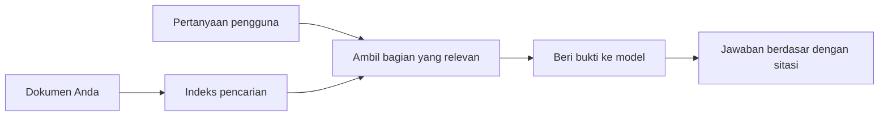

# Ajari AI Menjawab Pertanyaan Berdasarkan Dokumen Anda:
## Seri 1: RAG, Azure vs Alternatif Open-Source, dan Kapan Fine-Tuning Masuk Akal

> Artikel pertama dalam seri 2026 yang meninjau kembali tutorial QA dokumen Azure AI Search + Azure OpenAI saya tahun 2023.

Navigasi seri: [Beranda repositori](../README.md) | Berikutnya: [Seri 2 - Bangun Sistem RAG Open-Source Lokal dari Awal hingga Akhir](./series-2-open-source-rag-end-to-end.md)

## 1. Intro - Meninjau Kembali Tutorial RAG Sebelumnya

Pada tahun 2023, saya mengerjakan sepasang tutorial tentang mengajarkan ChatGPT menjawab pertanyaan dari dokumen PDF menggunakan Azure AI Search dan Azure OpenAI. Saya menulis [versi LangChain](https://techcommunity.microsoft.com/blog/educatordeveloperblog/teach-chatgpt-to-answer-questions-using-azure-ai-search--azure-openai-lang-chain/3969713), dan saya juga turut menulis [versi Semantic Kernel](https://techcommunity.microsoft.com/blog/educatordeveloperblog/teach-chatgpt-to-answer-questions-using-azure-ai-search--azure-openai-semantic-k/3985395) bersama [Lee Stott](https://developer.microsoft.com/en-us/advocates/lee-stott), seorang Principal Cloud Advocate Manager di Microsoft. Saat itu, ide "ChatGPT pada data Anda" masih terasa baru bagi banyak pengembang. Tutorial tersebut menggunakan Azure Blob Storage, Azure AI Search, Azure OpenAI, LangChain, Semantic Kernel, dan pengambilan vektor gaya FAISS untuk menjawab pertanyaan dari file PDF.

Artikel sebelumnya berfokus pada alur kerja sederhana tapi penting: mengunggah dokumen, mengindeksnya, mengambil konten yang relevan, dan meminta model menjawab berdasarkan konten tersebut.

Pada tahun 2026, ekosistem RAG telah berkembang pesat. Azure AI Search kini mendukung pola pengambilan vektor modern dan hibrida, Azure OpenAI adalah bagian dari ekosistem Microsoft Foundry Models yang lebih luas, dan API v1 yang baru dapat menggunakan klien OpenAI standar tanpa perlu perubahan `api-version` bulanan. Pada saat yang sama, opsi open-source seperti LangGraph, LlamaIndex, Haystack, Qdrant, Milvus, Weaviate, Chroma, Ollama, dan vLLM telah menjadi pilihan praktis untuk sistem RAG nyata.

Itulah mengapa saya ingin meninjau kembali topik ini. Pertanyaan tidak lagi hanya "Bagaimana saya membangun RAG?" Sekarang ada banyak cara untuk membangunnya, dan pertanyaan yang lebih penting adalah "Arsitektur mana yang harus saya pilih untuk situasi saya?"

Namun masalah inti tidak berubah.

Model AI tidak secara otomatis mengetahui dokumen Anda. Untuk membangun sistem tanya jawab dokumen yang berguna, Anda masih membutuhkan pengambilan yang andal, pembumian, evaluasi, dan alur kerja operasional.

Artikel ini bukan tutorial "chat dengan PDF" end-to-end lainnya. Saya ingin memulai seri terkini ini dengan pertanyaan yang kini lebih saya pedulikan: kapan Anda harus memilih arsitektur Azure yang dikelola, kapan memilih tumpukan RAG open-source, dan kapan fine-tuning benar-benar masuk akal?

Ini adalah artikel pertama dalam seri tentang membangun sistem AI berbasis dokumen. Di bagian pertama ini, kita akan fokus pada keputusan arsitektur: mengapa RAG penting, kapan layanan terkelola berbasis Azure berguna, kapan alternatif open-source masuk akal, dan di mana fine-tuning cocok.

Setelah membangun dan meninjau kembali sistem QA dokumen, saya menjadi kurang tertarik pada alat mana yang terlihat terbaik dalam demo dan lebih tertarik pada arsitektur mana yang bertahan dari pengguna nyata, dokumen yang berubah, izin, kegagalan, dan pemeliharaan.

## 2. Mengapa AI Anda Membutuhkan Sistem Pencarian

Model bahasa besar dilatih dari data publik luas dan berlisensi. Mereka mungkin tahu banyak tentang topik umum, tetapi mereka tidak secara otomatis mengetahui PDF pribadi Anda, kebijakan internal, prosedur perusahaan, arsip riset, materi kelas, catatan dukungan pelanggan, atau dokumentasi yang baru diperbarui.

Cara sederhana memahami RAG adalah seperti ini: alih-alih mengharapkan model mengingat setiap dokumen, kita memberinya sistem pencarian. Ketika pengguna mengajukan pertanyaan, sistem pertama-tama menemukan potongan informasi paling relevan, lalu memberikan potongan tersebut ke model sebagai konteks.

Ini penting karena banyak sumber pengetahuan dunia nyata bersifat pribadi, terus berubah, sensitif terhadap izin, tersimpan dalam banyak sistem berbeda, ditulis dalam banyak format, dan terlalu besar untuk ditempel langsung ke prompt.

Misalnya, jika sebuah sekolah, perusahaan, atau tim riset memiliki 10.000 dokumen internal, model tidak dapat menjawab dari dokumen tersebut secara andal kecuali sistem mengambil bagian yang tepat pada waktu yang tepat.

Ini secara alami menimbulkan pertanyaan umum:

Mengapa tidak cukup dengan fine-tuning model?

Fine-tuning bisa berguna, tetapi biasanya bukan alat pertama yang tepat untuk pengetahuan dokumen. Jika pengetahuan sering berubah, jika kutipan penting, atau jika izin akses penting, RAG biasanya merupakan titik awal yang lebih baik. Fine-tuning lebih cocok untuk mengajarkan perilaku, gaya, format output, dan pola tugas.

## 3. Arsitektur RAG dalam Praktek

Bayangkan Anda membangun asisten AI untuk sebuah sekolah. Asisten tersebut perlu menjawab pertanyaan dari PDF kebijakan, panduan kursus, halaman FAQ internal, dan pengumuman yang baru diperbarui.

Jika seorang siswa bertanya, "Bolehkah saya menggunakan AI generatif untuk tugas akhir saya?", sistem tidak boleh menjawab dari memori umum model. Sistem harus terlebih dahulu menemukan kebijakan sekolah yang relevan, mengambil bagian tentang penggunaan AI, lalu meminta model menjawab menggunakan bukti tersebut.

Itulah RAG dalam praktek.

Secara garis besar, Anda dapat membayangkan alurnya seperti ini:

Detailnya bisa menjadi lebih canggih, tapi ide dasarnya sederhana: model tidak menjawab sendirian. Ia menjawab dengan bukti yang diambil.

Pertama, dokumen diambil dari sistem penyimpanan seperti Azure Blob Storage, SharePoint, GitHub, atau CMS internal. Lalu sistem mengurai dokumen menjadi teks sambil mempertahankan struktur berguna seperti judul, nomor halaman, tabel, bagian, dan lokasi sumber.

Selanjutnya, konten dibagi menjadi potongan-potongan. Langkah ini terdengar sederhana, tetapi merupakan salah satu bagian terpenting sistem. Jika potongan terlalu kecil, mungkin kehilangan konteks sekitar. Jika potongan terlalu besar, mungkin memuat informasi tidak terkait dan membuat pengambilan kurang presisi.

Setelah pembagian potongan, sistem membuat embedding dan menyimpannya dalam indeks yang bisa dicari bersama dengan teks asli dan metadata seperti nama file, nomor halaman, izin, versi dokumen, dan URL sumber.

Ketika pengguna mengajukan pertanyaan, sistem mengambil potongan kandidat menggunakan pencarian kata kunci, pencarian vektor, atau pencarian hibrida. Reranker kemudian dapat menyusun ulang potongan-potongan tersebut sehingga bukti paling berguna ditempatkan di bagian atas.

Akhirnya, model menerima pertanyaan dan bukti yang diambil. Jawaban harus berlandaskan bukti tersebut dan mengembalikan kutipan agar pengguna dapat memeriksa sumbernya.

Poin pentingnya adalah RAG bukan hanya "memasukkan PDF ke dalam database vektor." Kualitas jawaban tergantung pada seluruh alur kerja: penguraian, pembagian potongan, pengambilan, penyusunan ulang, pemberian prompt, penulisan kutipan, dan evaluasi.

Inilah sebabnya struktur dokumen sangat penting. Dalam PDF, sebuah judul, tabel, catatan kaki, atau batas halaman dapat mengubah makna sebuah bagian. Di Azure, keterampilan Document Layout menggunakan kemampuan layout Azure Document Intelligence untuk menghasilkan output yang sadar struktur, yang dapat meningkatkan kualitas pembagian potongan dan pengambilan untuk sistem RAG.

## 4. Apa yang Berubah Sejak 2023?

Tutorial 2023 adalah titik awal yang baik untuk zamannya:

- Azure Blob Storage menyimpan file PDF.
- Azure AI Search mengindeks konten.
- LangChain menghubungkan pengambilan ke Azure OpenAI.
- FAISS berfungsi sebagai penyimpanan vektor lokal sederhana.
- Contoh menggunakan `gpt-35-turbo` dan `text-embedding-ada-002`.

Pada 2026, versi modern harus mencerminkan beberapa perubahan.

Pertama, pengambilan telah matang. Pada 2023, banyak demo menggunakan pencarian kesamaan vektor sederhana. Hari ini, pengambilan hibrida sering menjadi titik awal default untuk QA dokumen serius. Azure AI Search mendukung pencarian hibrida dengan menggabungkan kueri kata kunci dan vektor dalam satu permintaan dan menggabungkan hasil dengan Reciprocal Rank Fusion. Semantic ranker kemudian dapat menyusun ulang sisi teks dari hasil full-text, vektor, dan hibrida.

Kedua, ingesting lebih canggih. Alih-alih memecah manual setiap dokumen dengan kode aplikasi, Azure AI Search mendukung vektorisasi terintegrasi untuk pembagian potongan, embedding, dan vektorisasi saat kueri. Untuk PDF dan beban kerja dokumen berat, keterampilan Document Layout dapat mempertahankan lebih banyak struktur dibanding potongan ukuran tetap.

Ketiga, orkestrasi menjadi lebih penting. Bagian sulit seringkali bukan panggilan API LLM itu sendiri. Bagian sulit adalah menangani kegagalan, percobaan ulang, pengambilan usang, kualitas potongan, alur kerja berjalan lama, tinjauan manusia, dan evaluasi dalam skala besar. Di sinilah alat berorientasi alur kerja seperti LangGraph, alur kerja LlamaIndex, pipeline Haystack, dan alat evaluasi serta observabilitas tingkat platform menjadi lebih relevan dibandingkan rantai linear tunggal.

Keempat, evaluasi tidak lagi opsional. Demo dapat terlihat mengesankan dengan satu pertanyaan. Sistem produksi membutuhkan set tes, pemeriksaan regresi, metrik pengambilan, pemeriksaan pembumian, dan pemantauan. Tanpa evaluasi, sulit mengetahui apakah sistem membaik atau hanya berubah.

## 5. Memilih Antara Tumpukan RAG Azure dan Open-Source

Saya tidak berpikir pertanyaan yang berguna adalah "Apakah Azure lebih baik dari open source?" atau "Apakah open source lebih baik dari Azure?"

Pertanyaan yang berguna adalah: jenis sistem apa yang Anda bangun, siapa yang akan mengoperasikannya, apa kendala yang Anda miliki, dan mode kegagalan apa yang tidak dapat diterima?

Ketika saya mulai membuat contoh QA dokumen, saya paling memikirkan apakah pengambilan berjalan. Apakah saya bisa mengunggah PDF, mencari, dan menghasilkan jawaban? Itu adalah titik awal yang masuk akal.

Setelah melewati alur kerja AI yang lebih realistis, evaluasi saya berubah. Sekarang saya melihat empat hal sebelum memilih tumpukan RAG:

- identitas dan izin
- kualitas pengambilan
- keandalan alur kerja
- kepemilikan operasional

Keempat area tersebut memberi tahu Anda jauh lebih banyak daripada hanya tolok ukur model.

Arsitektur berbasis Azure biasanya masuk akal ketika integrasi perusahaan adalah bagian tersulit. Jika tim sudah bergantung pada Microsoft Entra ID, Microsoft 365, Azure Storage, jaringan privat, RBAC, dan pemantauan Azure, Azure AI Search dan Azure OpenAI dapat mengurangi banyak kompleksitas operasional. Dalam lingkungan itu, Azure bukan hanya API model. Nilainya adalah sistem sekitar: identitas, tata kelola, pencarian terkelola, integrasi keamanan, dukungan, dan operasi yang sudah dikenal.

Arsitektur open-source biasanya masuk akal ketika fleksibilitas adalah bagian tersulit. Jika tim membutuhkan inferensi lokal, portabilitas cloud, pipeline pengambilan khusus, penyusunan ulang khusus, atau kendali langsung atas database vektor dan lapisan penyajian model, tumpukan open-source bisa jadi cocok. Pertukaran adalah tim memiliki lebih banyak pekerjaan untuk keandalan: cadangan, penskalaan, latensi, migrasi, pemantauan, dan keamanan.

Dalam praktiknya, banyak sistem AI produksi tidak murni cloud-native atau murni open-source. Mereka sering kali sistem hibrida yang menyeimbangkan kesederhanaan operasional, portabilitas, tata kelola, dan fleksibilitas rekayasa.

Misalnya, saya tidak akan terkejut melihat sistem menggunakan Azure OpenAI untuk akses model, LangGraph untuk orkestrasi alur kerja, hosting Azure untuk penyebaran, dan database vektor open-source untuk kebutuhan pengambilan tertentu. Itu bukan inkonsistensi arsitektur. Itu adalah memilih tingkat layanan terkelola dan kendali rekayasa yang tepat untuk setiap bagian sistem.

Saya menyukai arsitektur hibrida ketika platform terkelola menyelesaikan masalah penting perusahaan, sementara komponen open-source memberi tim fleksibilitas di mana hal itu benar-benar penting.

## 6. Panduan Keputusan Praktis

Berikut tabel keputusan yang akan saya gunakan dengan tim sebelum memilih tumpukan RAG:

| Area keputusan | Tumpukan terkelola Azure lebih kuat ketika... | Tumpukan open-source lebih kuat ketika... |
| --- | --- | --- |
| Identitas dan akses | Entra ID, RBAC, identitas terkelola, dan izin perusahaan adalah pusatnya | otentikasi khusus, identitas non-Microsoft, atau logika akses spesifik aplikasi mendominasi |
| Operasi | tim menginginkan infrastruktur terkelola, dukungan, SLA, dan onboarding lebih sederhana | tim dapat mengoperasikan database vektor, penyajian model, cadangan, dan penskalaan |
| Pengambilan | pencarian hibrida, peringkat semantik, filter, dan pencarian metadata mencakup sebagian besar kebutuhan | tim membutuhkan pengambilan khusus, penyusunan ulang khusus, atau pengindeksan eksperimental |
| Portabilitas | keselarasan ekosistem Azure dapat diterima atau diutamakan | menghindari penguncian cloud adalah persyaratan utama |
| Inferensi | tata kelola, jaringan, dan kontrol perusahaan Azure OpenAI penting | inferensi lokal, model khusus, atau penyajian mandiri diperlukan |
| Biaya | mengurangi upaya rekayasa dan operasi lebih penting daripada penyetelan infrastruktur | skala cukup besar untuk membenarkan optimasi infrastruktur yang cermat |
| Eksperimen | stabilitas dan integrasi perusahaan lebih penting daripada sering mengubah komponen | tim cepat beriterasi pada agen, alat, memori, dan alur kerja pengambilan |

Aturan praktis saya sederhana:

- Mulailah dengan Azure ketika integrasi perusahaan, keamanan, dan kesederhanaan operasional adalah risiko utama.
- Mulailah dengan open source ketika portabilitas, kustomisasi, atau kendali lokal adalah risiko utama.
- Gunakan tumpukan hibrida ketika keduanya benar.

Ini juga alasan saya tidak memulai seri RAG 2026 dengan kode terlebih dahulu. Kode penting, tapi pemilihan arsitektur datang sebelum implementasi. Demo sederhana bisa menyembunyikan pilihan tersulit. Sistem RAG yang baik membuat pilihan tersebut eksplisit.

## 7. Di Mana Fine-Tuning Masuk

Fine-tuning sering disebut bersamaan dengan RAG, tetapi saya pikir penting untuk memisahkan keduanya.

RAG biasanya pilihan yang lebih baik ketika sistem membutuhkan pengetahuan yang baru, pribadi, sensitif terhadap izin, atau berbasis sumber. Jika jawaban harus mengutip dokumen, mencerminkan pembaruan terkini, atau menghormati aturan akses pengguna, pengambilan harus menjadi bagian dari arsitektur.
Fine-tuning lebih berguna ketika pengetahuan bukanlah masalah utama. Ini bisa membantu ketika Anda ingin model mengikuti format output tertentu, menyesuaikan gaya respons spesifik domain, melakukan tugas yang stabil dengan lebih konsisten, atau mengurangi jumlah instruksi yang dibutuhkan di setiap prompt.

Dalam praktiknya, keduanya bisa bekerja bersama. Asisten dukungan mungkin menggunakan RAG untuk mengambil kebijakan terbaru, sementara model yang di-fine-tune mempelajari struktur jawaban dan nada suara yang disukai perusahaan.

Kesalahan adalah memperlakukan fine-tuning sebagai pengganti penyimpanan dokumen. Ini tidak menghilangkan kebutuhan akan pengambilan saat sistem harus menjawab dari data yang baru, pribadi, atau sensitif terhadap izin.

## 8. Ke Mana Seri Ini Akan Berlanjut

Artikel ini adalah lapisan pengambilan keputusan. Sebelum menulis kode, saya ingin membuat tradeoff menjadi eksplisit: RAG vs fine-tuning, Azure vs open source, layanan terkelola vs kontrol operasi.

Sebelum masuk ke implementasi, saya ingin meninggalkan satu poin di sini: dalam banyak sistem AI perusahaan, model hanyalah salah satu komponen. Kualitas pengambilan, orkestrasi, evaluasi, izin, dan keandalan operasional sering kali menentukan apakah sistem berhasil melewati tahap demo.

Pada bagian berikutnya dari seri ini, saya berencana untuk menggali lebih dalam sisi praktis sistem AI yang berlandaskan dokumen: pertama membangun alur kerja RAG open source lokal, kemudian membangun kembali skenario yang sama dengan Azure AI Search dan Azure OpenAI, lalu mengevaluasi apakah sistem tersebut benar-benar bekerja.

Saya mungkin menyesuaikan urutan saat seri berkembang, tetapi tujuannya tetap sama: melampaui demo sederhana dan menunjukkan cara berpikir tentang sistem RAG yang dapat dipelihara, dievaluasi, dan dioperasikan.

## 9. Referensi dan Sumber Daya

Tutorial asli:

- [Teach ChatGPT to Answer Questions: Using Azure AI Search & Azure OpenAI (Lang Chain)](https://techcommunity.microsoft.com/blog/educatordeveloperblog/teach-chatgpt-to-answer-questions-using-azure-ai-search--azure-openai-lang-chain/3969713)
- [Teach ChatGPT to Answer Questions: Using Azure AI Search & Azure OpenAI (Semantic Kernel)](https://techcommunity.microsoft.com/blog/educatordeveloperblog/teach-chatgpt-to-answer-questions-using-azure-ai-search--azure-openai-semantic-k/3985395)

Azure:

- [Azure AI Search REST API versions](https://learn.microsoft.com/en-us/rest/api/searchservice/search-service-api-versions)
- [Hybrid search in Azure AI Search](https://learn.microsoft.com/en-us/azure/search/hybrid-search-how-to-query)
- [Integrated vectorization in Azure AI Search](https://learn.microsoft.com/en-us/azure/search/vector-search-integrated-vectorization)
- [Document Layout skill in Azure AI Search](https://learn.microsoft.com/en-us/azure/search/cognitive-search-skill-document-intelligence-layout)
- [Chunk and vectorize by document layout](https://learn.microsoft.com/en-us/azure/search/search-how-to-semantic-chunking)
- [Semantic ranking in Azure AI Search](https://learn.microsoft.com/en-us/azure/search/semantic-search-overview)
- [Azure OpenAI / Microsoft Foundry API version lifecycle](https://learn.microsoft.com/en-us/azure/foundry/openai/api-version-lifecycle)
- [Foundry Models sold by Azure](https://learn.microsoft.com/en-us/azure/foundry/foundry-models/concepts/models-sold-directly-by-azure)
- [Microsoft Foundry fine-tuning considerations](https://learn.microsoft.com/en-us/azure/foundry/openai/concepts/fine-tuning-considerations)
- [Microsoft Foundry observability](https://learn.microsoft.com/en-us/azure/foundry/concepts/observability)
- [Run evaluations in Microsoft Foundry](https://learn.microsoft.com/en-us/azure/foundry/how-to/evaluate-generative-ai-app)

Open-source:

- [LangGraph documentation](https://docs.langchain.com/oss/python/langgraph/overview)
- [LlamaIndex documentation](https://developers.llamaindex.ai/python/framework/)
- [Haystack documentation](https://docs.haystack.deepset.ai/)
- [Qdrant documentation](https://qdrant.tech/documentation/overview/)
- [Milvus documentation](https://milvus.io/docs/overview.md)
- [Weaviate documentation](https://docs.weaviate.io/weaviate/current/)
- [Chroma documentation](https://docs.trychroma.com/docs/overview/introduction)
- [Ollama embeddings](https://docs.ollama.com/capabilities/embeddings)
- [vLLM OpenAI-compatible server](https://docs.vllm.ai/en/latest/serving/openai_compatible_server.html)
- [BGE embedding models](https://huggingface.co/BAAI/bge-large-en-v1.5)
- [E5 embedding models](https://huggingface.co/intfloat/e5-large-v2)
- [Instructor embedding models](https://huggingface.co/hkunlp/instructor-large)

Selanjutnya: [Seri 2 - Bangun Sistem RAG Open-Source Lokal dari Awal hingga Akhir](./series-2-open-source-rag-end-to-end.md)

---

<!-- CO-OP TRANSLATOR DISCLAIMER START -->
**Penafian**:
Dokumen ini telah diterjemahkan menggunakan layanan terjemahan AI [Co-op Translator](https://github.com/Azure/co-op-translator). Meskipun kami berupaya untuk mencapai akurasi, harap diketahui bahwa terjemahan otomatis mungkin mengandung kesalahan atau ketidakakuratan. Dokumen asli dalam bahasa aslinya harus dianggap sebagai sumber yang sah. Untuk informasi penting, disarankan menggunakan terjemahan profesional oleh manusia. Kami tidak bertanggung jawab atas kesalahpahaman atau penafsiran yang keliru yang timbul dari penggunaan terjemahan ini.
<!-- CO-OP TRANSLATOR DISCLAIMER END -->