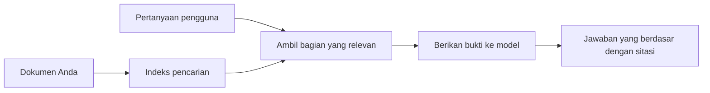

# Mengajari AI untuk Menjawab Pertanyaan Berdasarkan Dokumen Anda:
## Seri 1: RAG, Azure vs Alternatif Open-Source, dan Kapan Fine-Tuning Masuk Akal

> Artikel pertama dalam seri 2026 yang mengulas ulang tutorial saya tentang Azure AI Search + Azure OpenAI untuk QA dokumen tahun 2023.

## 1. Pendahuluan - Mengulas Kembali Tutorial RAG Sebelumnya

Pada tahun 2023, saya membuat sepasang tutorial tentang mengajari ChatGPT menjawab pertanyaan dari dokumen PDF menggunakan Azure AI Search dan Azure OpenAI. Saya menulis [versi LangChain](https://techcommunity.microsoft.com/blog/educatordeveloperblog/teach-chatgpt-to-answer-questions-using-azure-ai-search--azure-openai-lang-chain/3969713), dan saya juga ikut menulis versi pendamping [Semantic Kernel](https://techcommunity.microsoft.com/blog/educatordeveloperblog/teach-chatgpt-to-answer-questions-using-azure-ai-search--azure-openai-semantic-k/3985395) dengan [Lee Stott](https://developer.microsoft.com/en-us/advocates/lee-stott), seorang Principal Cloud Advocate Manager di Microsoft. Saat itu, ide "ChatGPT pada data Anda" masih terasa baru bagi banyak pengembang. Tutorial tersebut menggunakan Azure Blob Storage, Azure AI Search, Azure OpenAI, LangChain, Semantic Kernel, dan pengambilan vektor gaya FAISS untuk menjawab pertanyaan dari file PDF.

Artikel sebelumnya berfokus pada alur kerja sederhana tapi penting: mengunggah dokumen, mengindeksnya, mengambil konten relevan, dan meminta model untuk menjawab berdasarkan konten itu.

Pada 2026, ekosistem RAG telah berkembang pesat. Azure AI Search kini mendukung pola pengambilan modern berbasis vektor dan hybrid, Azure OpenAI menjadi bagian dari ekosistem Microsoft Foundry Models yang lebih luas, dan API versi baru v1 dapat menggunakan klien OpenAI standar tanpa perlu perubahan `api-version` bulanan. Pada waktu yang sama, opsi open-source seperti LangGraph, LlamaIndex, Haystack, Qdrant, Milvus, Weaviate, Chroma, Ollama, dan vLLM telah menjadi pilihan praktis untuk sistem RAG yang nyata.

Itulah mengapa saya ingin mengulas kembali topik ini. Pertanyaannya tidak lagi hanya "Bagaimana saya membangun RAG?" Ada banyak cara untuk membangunnya sekarang, dan pertanyaan yang lebih penting adalah "Arsitektur mana yang harus saya pilih untuk situasi saya?"

Namun masalah inti belum berubah.

Model AI tidak otomatis mengetahui dokumen Anda. Untuk membangun sistem tanya jawab dokumen yang berguna, Anda masih memerlukan pengambilan yang andal, dasar (grounding), evaluasi, dan alur kerja operasional.

Artikel ini bukan tutorial "chat dengan PDF" yang lengkap. Saya ingin memulai seri pembaruan ini dengan pertanyaan yang kini lebih saya perhatikan: kapan Anda harus memilih arsitektur Azure yang dikelola, kapan harus memilih stack RAG open-source, dan kapan fine-tuning benar-benar masuk akal?

Ini adalah artikel pertama dalam seri tentang membangun sistem AI yang berlandaskan dokumen. Pada bagian pertama ini, kita akan fokus pada keputusan arsitektur: mengapa RAG penting, kapan layanan terkelola Azure berguna, kapan alternatif open-source masuk akal, dan di mana fine-tuning cocok.

Setelah membangun dan mengulas kembali sistem QA dokumen, saya menjadi kurang tertarik pada alat mana yang terlihat terbaik dalam demo dan lebih tertarik pada arsitektur mana yang bertahan menghadapi pengguna nyata, dokumen yang berubah-ubah, izin akses, kegagalan, dan pemeliharaan.

## 2. Mengapa AI Anda Membutuhkan Sistem Pencarian

Model bahasa besar dilatih pada data publik dan berlisensi yang luas. Mereka mungkin tahu banyak tentang topik umum, tetapi mereka tidak otomatis mengetahui PDF pribadi Anda, kebijakan internal, prosedur perusahaan, arsip riset, materi kelas, catatan dukungan pelanggan, atau dokumentasi yang baru diperbarui.

Cara sederhana memikirkan RAG adalah ini: alih-alih mengharapkan model mengingat setiap dokumen, kita memberinya sistem pencarian. Ketika pengguna mengajukan pertanyaan, sistem ini pertama-tama menemukan potongan informasi paling relevan, lalu memberikan bagian tersebut ke model sebagai konteks.

Ini penting karena banyak sumber pengetahuan dunia nyata bersifat pribadi, terus berubah, sensitif izin aksesnya, disimpan di berbagai sistem, ditulis dalam banyak format, dan terlalu besar untuk langsung ditempelkan ke prompt.

Misalnya, jika sebuah sekolah, perusahaan, atau tim riset memiliki 10.000 dokumen internal, model tidak bisa menjawab secara andal dari dokumen-dokumen itu kecuali sistem mengambil bagian yang tepat pada waktu yang tepat.

Ini secara alami memunculkan pertanyaan umum:

Kenapa tidak cukup melakukan fine-tuning model?

Fine-tuning bisa berguna, tapi biasanya bukan alat pertama yang tepat untuk pengetahuan dokumen. Jika pengetahuan sering berubah, jika kutipan penting, atau jika izin akses penting, RAG biasanya adalah titik awal yang lebih baik. Fine-tuning lebih cocok untuk mengajari model perilaku, gaya, format keluaran, dan pola tugas.

## 3. Arsitektur RAG dalam Praktek

Bayangkan Anda sedang membangun asisten AI untuk sebuah sekolah. Asisten ini harus menjawab pertanyaan dari PDF kebijakan, panduan kursus, halaman FAQ internal, dan pengumuman terbaru.

Jika seorang siswa bertanya, "Apakah saya boleh menggunakan AI generatif untuk tugas akhir saya?", sistem tidak boleh menjawab dari memori umum model. Sistem harus pertama kali menemukan kebijakan sekolah yang relevan, mengambil bagian tentang penggunaan AI, kemudian meminta model menjawab menggunakan bukti tersebut.

Itulah RAG dalam praktik.

Secara garis besar, alurnya bisa dipikirkan seperti ini:

Rinciannya bisa menjadi lebih canggih, tapi ide dasarnya sederhana: model tidak menjawab sendiri. Model menjawab dengan bukti yang diambil.

Pertama, dokumen diambil dari sistem penyimpanan seperti Azure Blob Storage, SharePoint, GitHub, atau CMS internal. Kemudian sistem memparsing dokumen ke dalam teks sambil mempertahankan struktur yang berguna seperti judul, nomor halaman, tabel, bagian, dan lokasi sumber.

Selanjutnya, konten dibagi menjadi potongan-potongan. Langkah ini terdengar sederhana, tapi merupakan bagian paling penting dari sistem. Jika potongan terlalu kecil, konteks sekitarnya bisa hilang. Jika potongan terlalu besar, bisa termasuk informasi yang tidak relevan dan membuat pengambilan kurang tepat.

Setelah pemotongan, sistem membuat embedding dan menyimpannya dalam indeks pencarian bersama dengan teks asli dan metadata seperti nama file, nomor halaman, izin akses, versi dokumen, dan URL sumber.

Ketika pengguna mengajukan pertanyaan, sistem mengambil potongan kandidat menggunakan pencarian kata kunci, pencarian vektor, atau pencarian hybrid. Reranker dapat menyusun ulang potongan tersebut supaya bukti paling berguna berada di bagian atas.

Akhirnya, model menerima pertanyaan dan bukti yang diambil. Jawaban harus berlandaskan bukti itu dan mencantumkan kutipan agar pengguna bisa memeriksa sumber.

Poin pentingnya adalah RAG bukan hanya "memasukkan PDF ke basis data vektor." Kualitas jawaban bergantung pada keseluruhan alur kerja: parsing, pemotongan, pengambilan, penyusunan ulang, penyusunan prompt, kutipan, dan evaluasi.

Ini sebabnya struktur dokumen penting. Dalam PDF, sebuah judul, tabel, catatan kaki, atau batas halaman bisa mengubah arti sebuah bagian. Di Azure, keterampilan Document Layout menggunakan kemampuan tata letak Azure Document Intelligence untuk menghasilkan keluaran yang sadar struktur, yang dapat meningkatkan kualitas pemotongan dan pengambilan untuk sistem RAG.

## 4. Apa yang Berubah Sejak 2023?

Tutorial 2023 adalah titik awal yang baik untuk zamannya:

- Azure Blob Storage menyimpan file PDF.
- Azure AI Search mengindeks konten.
- LangChain menghubungkan pengambilan ke Azure OpenAI.
- FAISS digunakan sebagai penyimpan vektor lokal sederhana.
- Contoh menggunakan `gpt-35-turbo` dan `text-embedding-ada-002`.

Pada 2026, versi modern harus mencerminkan beberapa perubahan.

Pertama, pengambilan sudah matang. Pada 2023, banyak demo menggunakan pencarian kesamaan vektor sederhana. Hari ini, pengambilan hybrid seringkali menjadi titik awal default untuk QA dokumen serius. Azure AI Search mendukung pencarian hybrid dengan menggabungkan kueri kata kunci dan kueri vektor dalam satu permintaan dan menggabungkan hasil dengan Reciprocal Rank Fusion. Penyusun peringkat semantik kemudian dapat menyusun ulang hasil teks dari pencarian full-text, vektor, dan hybrid.

Kedua, proses pengambilan dokumen lebih canggih. Alih-alih membagi dokumen secara manual dengan kode aplikasi, Azure AI Search mendukung vektorisasi terintegrasi untuk pemotongan, embedding, dan vektorisasi saat kueri. Untuk PDF dan beban kerja berat dokumen, keterampilan Document Layout dapat mempertahankan lebih banyak struktur dibanding potongan berukuran tetap.

Ketiga, orkestrasi menjadi lebih penting. Bagian sulit seringkali bukan panggilan API LLM itu sendiri. Bagian sulit adalah menangani kegagalan, pengulangan, pengambilan data lama, kualitas potongan, alur kerja yang berjalan lama, tinjauan manusia, dan evaluasi dalam skala besar. Di sini alat berbasis alur kerja seperti LangGraph, alur kerja LlamaIndex, pipeline Haystack, dan alat evaluasi serta observabilitas tingkat platform menjadi lebih relevan daripada rantai linear tunggal.

Keempat, evaluasi bukan lagi opsional. Demo bisa tampak mengesankan dengan satu pertanyaan. Sistem produksi membutuhkan set pengujian, pemeriksaan regresi, metrik pengambilan, pemeriksaan dasar, dan pemantauan. Tanpa evaluasi, sulit mengetahui apakah sistem membaik atau hanya berubah.

## 5. Memilih Antara Stack RAG Azure dan Open-Source

Saya tidak berpikir pertanyaan yang berguna adalah "Apakah Azure lebih baik dari open source?" atau "Apakah open source lebih baik dari Azure?"

Pertanyaan yang berguna adalah: jenis sistem apa yang Anda bangun, siapa yang akan mengoperasikannya, batasan apa yang Anda miliki, dan mode kegagalan mana yang tidak dapat diterima?

Saat saya mulai membangun contoh QA dokumen, saya hanya memikirkan apakah pengambilan berfungsi. Bisakah saya mengunggah PDF, mencarinya, dan menghasilkan jawaban? Itu titik awal yang masuk akal.

Setelah mengerjakan alur kerja AI yang lebih realistis, evaluasi saya berubah. Saya sekarang melihat empat hal sebelum memilih stack RAG:

- identitas dan izin akses
- kualitas pengambilan
- keandalan alur kerja
- kepemilikan operasional

Keempat area ini memberi tahu Anda jauh lebih banyak daripada hanya tolok ukur model.

Arsitektur berbasis Azure biasanya masuk akal saat integrasi perusahaan adalah bagian tersulit. Jika tim sudah bergantung pada Microsoft Entra ID, Microsoft 365, Azure Storage, jaringan privat, RBAC, dan pemantauan Azure, Azure AI Search dan Azure OpenAI dapat mengurangi banyak kompleksitas operasional. Dalam lingkungan itu, Azure bukan hanya API model. Nilainya adalah sistem di sekitarnya: identitas, tata kelola, pencarian terkelola, integrasi keamanan, dukungan, dan operasi yang sudah dikenali.

Arsitektur open-source biasanya masuk akal saat fleksibilitas adalah bagian tersulit. Jika tim membutuhkan inferensi lokal, portabilitas cloud, pipeline pengambilan khusus, penyusunan ulang khusus, atau kontrol langsung terhadap basis data vektor dan lapisan penyajian model, stack open-source bisa lebih cocok. Trade-off-nya adalah tim bertanggung jawab lebih pada pekerjaan keandalan: cadangan, penskalaan, latensi, migrasi, pemantauan, dan keamanan.

Dalam praktiknya, banyak sistem AI produksi bukan murni cloud-native atau murni open-source. Mereka sering sistem hybrid yang menyeimbangkan kesederhanaan operasional, portabilitas, tata kelola, dan fleksibilitas teknik.

Misalnya, saya tidak akan terkejut melihat sistem menggunakan Azure OpenAI untuk akses model, LangGraph untuk orkestrasi alur kerja, hosting Azure untuk deployment, dan basis data vektor open-source untuk kebutuhan pengambilan tertentu. Itu bukan inkonsistensi arsitektur. Itu memilih tingkat layanan terkelola dan kontrol rekayasa tepat untuk setiap bagian sistem.

Saya suka arsitektur hybrid ketika platform terkelola menyelesaikan masalah perusahaan yang penting, sementara komponen open-source memberikan fleksibilitas pada bagian yang benar-benar penting.

## 6. Panduan Keputusan Praktis

Berikut tabel keputusan yang akan saya gunakan dengan tim sebelum memilih stack RAG:

| Area Keputusan | Stack Azure terkelola lebih kuat ketika... | Stack open-source lebih kuat ketika... |
| --- | --- | --- |
| Identitas dan akses | Entra ID, RBAC, identitas terkelola, dan izin perusahaan adalah pusat | autentikasi khusus, identitas non-Microsoft, atau logika akses aplikasi dominan |
| Operasi | tim menginginkan infrastruktur terkelola, dukungan, SLA, dan onboarding lebih sederhana | tim bisa mengoperasikan basis data vektor, penyajian model, cadangan, dan penskalaan |
| Pengambilan | pencarian hybrid, peringkat semantik, filter, dan pencarian metadata memenuhi sebagian besar kebutuhan | tim butuh pengambilan khusus, penyusunan ulang khusus, atau pengindeksan eksperimental |
| Portabilitas | keselarasan dengan ekosistem Azure dapat diterima atau disukai | menghindari ketergantungan cloud adalah persyaratan yang sulit |
| Inferensi | tata kelola Azure OpenAI, jaringan, dan kontrol perusahaan penting | inferensi lokal, model khusus, atau penyajian mandiri diperlukan |
| Biaya | mengurangi usaha teknik dan operasi lebih penting daripada penyetelan infrastruktur | skala cukup besar untuk membenarkan optimasi infrastruktur yang cermat |
| Eksperimen | stabilitas dan integrasi perusahaan lebih penting daripada sering mengganti komponen | tim ingin iterasi cepat pada agen, alat, memori, dan alur pengambilan |

Aturan praktis saya sederhana:

- Mulailah dengan Azure ketika integrasi perusahaan, keamanan, dan kesederhanaan operasional adalah risiko utama.
- Mulailah dengan open source ketika portabilitas, kustomisasi, atau kontrol lokal adalah risiko utama.
- Gunakan stack hybrid ketika keduanya benar.

Ini juga alasan mengapa saya tidak akan memulai seri RAG tahun 2026 dengan kode terlebih dahulu. Kode penting, tapi pemilihan arsitektur lebih dahulu sebelum implementasi. Demo sederhana bisa menyembunyikan pilihan paling sulit. Sistem RAG yang baik membuat pilihan itu jelas.

## 7. Di Mana Fine-Tuning Masuk

Fine-tuning sering disebut bersama RAG, tapi saya pikir penting untuk memisahkan keduanya.

RAG biasanya pilihan yang lebih baik saat sistem memerlukan pengetahuan yang segar, pribadi, sensitif izin, atau berlandaskan sumber. Jika jawaban harus mengutip dokumen, mencerminkan pembaruan terbaru, atau menghormati aturan akses pengguna spesifik, pengambilan harus menjadi bagian arsitektur.

Fine-tuning lebih berguna saat pengetahuan bukan masalah utama. Bisa membantu ketika Anda ingin model mengikuti format keluaran tertentu, mencocokkan gaya respons khusus domain, melakukan tugas stabil dengan konsisten, atau mengurangi instruksi yang dibutuhkan di setiap prompt.
Dalam praktiknya, keduanya dapat bekerja bersama. Asisten dukungan mungkin menggunakan RAG untuk mengambil kebijakan terbaru, sementara model yang disetel ulang mempelajari struktur dan nada jawaban yang diinginkan perusahaan.

Kesalahannya adalah menganggap fine-tuning sebagai pengganti penyimpanan dokumen. Fine-tuning tidak menghilangkan kebutuhan untuk pengambilan saat sistem harus menjawab dari data yang baru, pribadi, atau sensitif terhadap izin.

## 8. Ke Mana Seri Ini Selanjutnya

Artikel ini adalah lapisan pengambilan keputusan. Sebelum menulis kode, saya ingin membuat pertukaran ini menjadi eksplisit: RAG vs fine-tuning, Azure vs open source, layanan terkelola vs kontrol operasional.

Sebelum melanjutkan ke implementasi, saya ingin meninggalkan satu poin di sini: dalam banyak sistem AI perusahaan, model hanyalah satu komponen. Kualitas pengambilan, orkestrasi, evaluasi, izin, dan keandalan operasional sering kali menentukan apakah sistem berhasil melewati tahap demo.

Di bagian selanjutnya dari seri ini, saya berencana untuk membahas lebih dalam sisi praktis sistem AI yang berbasis dokumen: bagaimana membangun arsitektur berbasis Azure, bagaimana alternatif open source dibandingkan dalam praktik, dan bagaimana mengevaluasi apakah sistem RAG benar-benar bekerja.

Saya mungkin menyesuaikan urutan seiring berkembangnya seri, tetapi tujuannya tetap sama: bergerak melewati demo sederhana dan menunjukkan cara berpikir tentang sistem RAG yang dapat dipelihara, dievaluasi, dan dioperasikan.

## 9. Referensi dan Sumber Daya

Tutorial asli:

- [Ajari ChatGPT Menjawab Pertanyaan: Menggunakan Azure AI Search & Azure OpenAI (Lang Chain)](https://techcommunity.microsoft.com/blog/educatordeveloperblog/teach-chatgpt-to-answer-questions-using-azure-ai-search--azure-openai-lang-chain/3969713)
- [Ajari ChatGPT Menjawab Pertanyaan: Menggunakan Azure AI Search & Azure OpenAI (Semantic Kernel)](https://techcommunity.microsoft.com/blog/educatordeveloperblog/teach-chatgpt-to-answer-questions-using-azure-ai-search--azure-openai-semantic-k/3985395)

Azure:

- [Versi REST API Azure AI Search](https://learn.microsoft.com/en-us/rest/api/searchservice/search-service-api-versions)
- [Pencarian hibrida di Azure AI Search](https://learn.microsoft.com/en-us/azure/search/hybrid-search-how-to-query)
- [Vektorisasi terintegrasi di Azure AI Search](https://learn.microsoft.com/en-us/azure/search/vector-search-integrated-vectorization)
- [Keterampilan Tata Letak Dokumen di Azure AI Search](https://learn.microsoft.com/en-us/azure/search/cognitive-search-skill-document-intelligence-layout)
- [Membagi dan vektorisasi berdasarkan tata letak dokumen](https://learn.microsoft.com/en-us/azure/search/search-how-to-semantic-chunking)
- [Peringkat semantik di Azure AI Search](https://learn.microsoft.com/en-us/azure/search/semantic-search-overview)
- [Siklus hidup versi API Azure OpenAI / Microsoft Foundry](https://learn.microsoft.com/en-us/azure/foundry/openai/api-version-lifecycle)
- [Model Foundry yang dijual oleh Azure](https://learn.microsoft.com/en-us/azure/foundry/foundry-models/concepts/models-sold-directly-by-azure)
- [Pertimbangan fine-tuning Microsoft Foundry](https://learn.microsoft.com/en-us/azure/foundry/openai/concepts/fine-tuning-considerations)
- [Observabilitas Microsoft Foundry](https://learn.microsoft.com/en-us/azure/foundry/concepts/observability)
- [Jalankan evaluasi di Microsoft Foundry](https://learn.microsoft.com/en-us/azure/foundry/how-to/evaluate-generative-ai-app)

Open-source:

- [Dokumentasi LangGraph](https://docs.langchain.com/oss/python/langgraph/overview)
- [Dokumentasi LlamaIndex](https://developers.llamaindex.ai/python/framework/)
- [Dokumentasi Haystack](https://docs.haystack.deepset.ai/)
- [Dokumentasi Qdrant](https://qdrant.tech/documentation/overview/)
- [Dokumentasi Milvus](https://milvus.io/docs/overview.md)
- [Dokumentasi Weaviate](https://docs.weaviate.io/weaviate/current/)
- [Dokumentasi Chroma](https://docs.trychroma.com/docs/overview/introduction)
- [Embedding Ollama](https://docs.ollama.com/capabilities/embeddings)
- [Server kompatibel OpenAI vLLM](https://docs.vllm.ai/en/latest/serving/openai_compatible_server.html)
- [Model embedding BGE](https://huggingface.co/BAAI/bge-large-en-v1.5)
- [Model embedding E5](https://huggingface.co/intfloat/e5-large-v2)
- [Model embedding Instructor](https://huggingface.co/hkunlp/instructor-large)

---

<!-- CO-OP TRANSLATOR DISCLAIMER START -->
**Penafian**:
Dokumen ini telah diterjemahkan menggunakan layanan terjemahan AI [Co-op Translator](https://github.com/Azure/co-op-translator). Meskipun kami berupaya untuk mencapai akurasi, harap diketahui bahwa terjemahan otomatis mungkin mengandung kesalahan atau ketidakakuratan. Dokumen asli dalam bahasa aslinya harus dianggap sebagai sumber yang sah. Untuk informasi penting, disarankan menggunakan terjemahan profesional oleh manusia. Kami tidak bertanggung jawab atas kesalahpahaman atau penafsiran yang keliru yang timbul dari penggunaan terjemahan ini.
<!-- CO-OP TRANSLATOR DISCLAIMER END -->