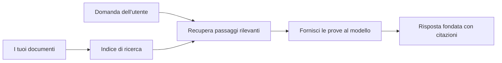

# Insegna all'IA a Rispondere alle Domande Basate sui Tuoi Documenti:
## Serie 1: RAG, Azure vs Alternative Open-Source, e Quando il Fine-Tuning Ha Senso

> Il primo articolo di una serie del 2026 che riprende i miei tutorial del 2023 su Azure AI Search + Azure OpenAI per il QA dei documenti.

Navigazione della serie: [Home del repository](../README.md) | Successivo: [Serie 2 - Costruire un Sistema RAG Open-Source Locale End to End](./series-2-open-source-rag-end-to-end.md)

## 1. Intro - Riprendere un Tutorial RAG Precedente

Nel 2023, ho lavorato su una coppia di tutorial su come insegnare a ChatGPT a rispondere alle domande da documenti PDF usando Azure AI Search e Azure OpenAI. Ho scritto la [versione LangChain](https://techcommunity.microsoft.com/blog/educatordeveloperblog/teach-chatgpt-to-answer-questions-using-azure-ai-search--azure-openai-lang-chain/3969713), e ho anche co-autore della versione complementare [Semantic Kernel](https://techcommunity.microsoft.com/blog/educatordeveloperblog/teach-chatgpt-to-answer-questions-using-azure-ai-search--azure-openai-semantic-k/3985395) con [Lee Stott](https://developer.microsoft.com/en-us/advocates/lee-stott), Principal Cloud Advocate Manager di Microsoft. All'epoca, l'idea di "ChatGPT sui tuoi dati" era ancora nuova per molti sviluppatori. I tutorial utilizzavano Azure Blob Storage, Azure AI Search, Azure OpenAI, LangChain, Semantic Kernel e il recupero vettoriale in stile FAISS per rispondere alle domande da file PDF.

Quel precedente articolo si concentrava su un workflow semplice ma importante: caricare documenti, indicizzarli, recuperare contenuti rilevanti e chiedere a un modello di rispondere basandosi su quei contenuti.

Nel 2026, l'ecosistema RAG è cresciuto significativamente. Azure AI Search ora supporta schemi moderni di recupero vettoriale e ibrido, Azure OpenAI fa parte del più ampio ecosistema Microsoft Foundry Models, e la nuova API v1 può usare il client OpenAI standard senza richiedere cambi mensili della versione `api-version`. Allo stesso tempo, opzioni open-source come LangGraph, LlamaIndex, Haystack, Qdrant, Milvus, Weaviate, Chroma, Ollama, e vLLM sono diventate scelte praticabili per sistemi RAG reali.

Ecco perché volevo riprendere questo argomento. La domanda non è più solo "Come costruisco RAG?" Ora ci sono molti modi di costruirlo, e la domanda più importante è "Quale architettura dovrei scegliere per la mia situazione?"

Ma il problema centrale non è cambiato.

Un modello AI non conosce automaticamente i tuoi documenti. Per costruire un sistema utile di domande-risposte basate su documenti, hai comunque bisogno di recupero affidabile, ancoraggio, valutazione e workflow operativi.

Questo articolo non è un altro tutorial end-to-end "chat con PDF". Voglio iniziare questa serie aggiornata con la domanda a cui ora do più importanza: quando dovresti scegliere un'architettura Azure gestita, quando dovresti scegliere uno stack RAG open-source, e quando il fine-tuning ha veramente senso?

Questo è il primo articolo di una serie sulla costruzione di sistemi AI ancorati ai documenti. In questa prima parte, ci concentreremo sulle decisioni architetturali: perché RAG è importante, quando i servizi gestiti basati su Azure sono utili, quando alternative open-source hanno senso, e dove si colloca il fine-tuning.

Dopo aver costruito e rivisto sistemi di QA su documenti, mi sono interessato meno a quale strumento appare meglio in una demo e più a quale architettura resiste a utenti reali, documenti che cambiano, permessi, fallimenti e manutenzione.

## 2. Perché la Tua AI ha Bisogno di un Sistema di Ricerca

I grandi modelli linguistici sono addestrati su dati pubblici ampi e dati con licenza. Possono sapere molto su argomenti generali, ma non conoscono automaticamente i tuoi PDF privati, le politiche interne, le procedure aziendali, gli archivi di ricerca, i materiali didattici, le note di supporto clienti o la documentazione aggiornata di recente.

Un modo semplice per pensare a RAG è questo: invece di aspettarsi che il modello ricordi ogni documento, gli forniamo un sistema di ricerca. Quando un utente fa una domanda, il sistema prima trova le informazioni più rilevanti, quindi dà quei pezzi al modello come contesto.

Questo è importante perché molte fonti di conoscenza del mondo reale sono private, in continua evoluzione, sensibili ai permessi, conservate su più sistemi, scritte in molti formati, e troppo grandi per essere incollate direttamente in un prompt.

Ad esempio, se una scuola, un'azienda o un team di ricerca ha 10.000 documenti interni, il modello non può rispondere affidabilmente a partire da quei documenti a meno che il sistema non recuperi le parti giuste al momento giusto.

Questo porta naturalmente a una domanda comune:

Perché non fare direttamente il fine-tuning del modello?

Il fine-tuning può essere utile, ma di solito non è lo strumento giusto come primo approccio per la conoscenza documentale. Se la conoscenza cambia spesso, se le citazioni sono importanti, o se i permessi di accesso contano, RAG è solitamente il punto di partenza migliore. Il fine-tuning è più adatto per insegnare comportamenti, stili, formati di output e schemi di compiti.

## 3. Architettura RAG nella Pratica

Immagina di costruire un assistente AI per una scuola. L'assistente deve rispondere a domande da PDF di politiche, guide dei corsi, pagine FAQ interne, e annunci aggiornati recentemente.

Se uno studente chiede, "Posso usare l'IA generativa per il mio compito finale?", il sistema non dovrebbe rispondere dalla memoria generale del modello. Prima dovrebbe trovare la politica scolastica rilevante, recuperare la sezione sull'uso dell'IA, e poi chiedere al modello di rispondere usando quelle prove.

Questo è RAG nella pratica.

A un alto livello, puoi immaginare il flusso così:

I dettagli possono diventare più sofisticati, ma l'idea di base è semplice: il modello non risponde da solo. Risponde con prove recuperate.

Prima, i documenti vengono acquisiti da sistemi di archiviazione come Azure Blob Storage, SharePoint, GitHub o un CMS interno. Poi il sistema li analizza in testo preservando strutture utili come titoli, numeri di pagina, tabelle, sezioni e posizioni della sorgente.

Successivamente, il contenuto viene suddiviso in chunk. Questo passaggio sembra semplice, ma è una delle parti più importanti del sistema. Se un chunk è troppo piccolo, potrebbe perdere il contesto circostante. Se è troppo grande, potrebbe includere informazioni non correlate e rendere il recupero meno preciso.

Dopo la suddivisione in chunk, il sistema crea embedding e li memorizza in un indice ricercabile insieme al testo originale e metadati come nome file, numero pagina, permessi, versione del documento e URL sorgente.

Quando l'utente fa una domanda, il sistema recupera chunk candidati usando ricerca per parola chiave, ricerca vettoriale o ricerca ibrida. Un classificatore può quindi riordinare quei chunk in modo che le prove più utili siano al top.

Infine, il modello riceve la domanda e le prove recuperate. La risposta dovrebbe essere ancorata a quelle prove e restituire citazioni così che l'utente possa ispezionare la fonte.

Il punto importante è che RAG non è solo "mettere PDF in un database vettoriale." La qualità della risposta dipende dall'intero workflow: parsing, chunking, recupero, riordinamento, prompting, citazioni, e valutazione.

Ecco perché la struttura del documento conta. In un PDF, un titolo, una tabella, una nota a piè di pagina o un confine di pagina possono cambiare il significato di un passaggio. Su Azure, la skill Document Layout usa le capacità di layout di Azure Document Intelligence per produrre un output consapevole della struttura, che può migliorare chunking e qualità del recupero per i sistemi RAG.

## 4. Cosa è Cambiato dal 2023?

Il tutorial del 2023 era un buon punto di partenza per il suo tempo:

- Azure Blob Storage archiviava i file PDF.
- Azure AI Search indicizzava i contenuti.
- LangChain collegava il recupero ad Azure OpenAI.
- FAISS funzionava come semplice archivio vettoriale locale.
- L'esempio usava `gpt-35-turbo` e `text-embedding-ada-002`.

Nel 2026, una versione moderna dovrebbe riflettere diversi cambiamenti.

Primo, il recupero è maturato. Nel 2023, molte demo usavano una semplice ricerca di similarità vettoriale. Oggi, il recupero ibrido è spesso il punto di partenza predefinito per sistemi seri di QA su documenti. Azure AI Search supporta la ricerca ibrida combinando query per parola chiave e vettoriali in una singola richiesta e unendo i risultati con Reciprocal Rank Fusion. Il ranker semantico può poi riordinare il lato testo di risultati full-text, vettoriali e ibridi.

Secondo, l'ingestione è più sofisticata. Invece di suddividere manualmente ogni documento con codice applicativo, Azure AI Search supporta la vettorizzazione integrata per chunking, embedding e vettorizzazione a tempo di query. Per PDF e carichi di lavoro documentali intensi, la skill Document Layout può preservare più struttura rispetto a chunk di dimensione fissa.

Terzo, l'orchestrazione conta di più. La parte difficile spesso non è la chiamata API al LLM stessa. È gestire fallimenti, retry, recupero obsoleto, qualità dei chunk, workflow lunghi, revisione umana e valutazione su scala. Qui strumenti orientati al workflow come LangGraph, flussi di lavoro LlamaIndex, pipeline Haystack e strumenti di valutazione e osservabilità a livello di piattaforma diventano più rilevanti di una singola catena lineare.

Quarto, la valutazione non è più opzionale. Una demo può sembrare impressionante con una domanda. Un sistema di produzione ha bisogno di set di test, controlli di regressione, metriche di recupero, controlli di ancoraggio e monitoraggio. Senza valutazione è difficile sapere se il sistema sta migliorando o solo cambiando.

## 5. Scegliere tra Stack RAG Azure e Open-Source

Non penso che la domanda utile sia "Azure è migliore dell'open source?" o "L'open source è migliore di Azure?"

La domanda utile è: che tipo di sistema stai costruendo, chi lo opererà, quali vincoli hai, e quali modalità di fallimento sono inaccettabili?

Quando ho iniziato a costruire esempi di QA su documenti, pensavo soprattutto se il recupero funzionasse. Potevo caricare PDF, cercarli e generare una risposta? Era un buon punto di partenza.

Dopo aver lavorato su workflow AI più realistici, la mia valutazione è cambiata. Ora guardo a quattro cose prima di scegliere uno stack RAG:

- identità e permessi
- qualità del recupero
- affidabilità del workflow
- proprietà operativa

Questi quattro aspetti ti dicono molto più di un semplice benchmark modello.

Le architetture basate su Azure solitamente hanno senso quando l'integrazione aziendale è la parte difficile. Se un team dipende già da Microsoft Entra ID, Microsoft 365, Azure Storage, networking privato, RBAC e monitoraggio Azure, Azure AI Search e Azure OpenAI possono ridurre molta complessità operativa. In quell'ambiente, Azure non è solo un'API modello. Il valore è il sistema circostante: identità, governance, ricerca gestita, integrazione sicurezza, supporto e operazioni familiari.

Le architetture open-source solitamente hanno senso quando la flessibilità è la parte difficile. Se il team ha bisogno di inferenza locale, portabilità cloud, pipeline di recupero personalizzate, riordino specializzato, o controllo diretto del database vettoriale e del livello di servizio del modello, uno stack open-source può essere la scelta migliore. Il compromesso è che il team possiede più del lavoro di affidabilità: backup, scaling, latenza, migrazioni, monitoraggio e sicurezza.

In pratica, molti sistemi AI di produzione non sono puramente cloud native o puramente open-source. Spesso sono sistemi ibridi che bilanciano semplicità operativa, portabilità, governance e flessibilità ingegneristica.

Ad esempio, non mi sorprenderebbe vedere un sistema usare Azure OpenAI per accesso al modello, LangGraph per orchestrazione dei workflow, hosting Azure per il deployment, e un database vettoriale open-source per una specifica esigenza di recupero. Quello non è incoerenza architetturale. È scegliere il giusto livello di servizio gestito e controllo ingegneristico per ogni parte del sistema.

Mi piacciono le architetture ibride quando la piattaforma gestita risolve problemi aziendali importanti, mentre i componenti open-source danno al team flessibilità dove conta davvero.

## 6. Una Guida Pratica alla Decisione

Ecco la tabella decisionale che userei con un team prima di scegliere uno stack RAG:

| Area decisionale | Lo stack gestito Azure è più forte quando… | Lo stack open-source è più forte quando… |
| --- | --- | --- |
| Identità e accesso | Entra ID, RBAC, identità gestita e permessi enterprise sono centrali | autenticazione personalizzata, identità non Microsoft o logiche di accesso app-specifiche predominano |
| Operazioni | il team vuole infrastruttura gestita, supporto, SLA e onboarding semplificato | il team può operare database vettoriali, servizio modelli, backup e scaling |
| Recupero | ricerca ibrida, ranking semantico, filtri e ricerca con metadata coprono la maggior parte delle esigenze | il team necessita di recupero personalizzato, riordino specializzato o indicizzazione sperimentale |
| Portabilità | allineamento all’ecosistema Azure è accettabile o preferito | evitare il lock-in cloud è un requisito inderogabile |
| Inferenza | governance Azure OpenAI, networking e controlli enterprise sono importanti | inferenza locale, modelli personalizzati o hosting autonomo sono richiesti |
| Costo | ridurre sforzi ingegneristici e operativi conta più dell’ottimizzazione dell’infrastruttura | la scala è sufficientemente grande da giustificare un’ottimizzazione infrastrutturale attenta |
| Sperimentazione | stabilità e integrazione enterprise contano più di cambiare componenti spesso | il team itera rapidamente su agenti, strumenti, memoria e workflow di recupero |

La mia regola empirica è semplice:

- Inizia con Azure quando integrazione enterprise, sicurezza e semplicità operativa sono i rischi principali.
- Inizia con open source quando portabilità, personalizzazione o controllo locale sono i rischi principali.
- Usa uno stack ibrido quando entrambi sono veri.

Questo è anche il motivo per cui non inizierei una serie RAG 2026 prima con il codice. Il codice è importante, ma la selezione dell'architettura viene prima dell'implementazione. Una demo semplice può nascondere le scelte più difficili. Un buon sistema RAG rende esplicite quelle scelte.

## 7. Dove si Colloca il Fine-Tuning

Il fine-tuning è spesso menzionato insieme a RAG, ma penso sia importante separarli.

RAG è di solito la scelta migliore quando il sistema ha bisogno di conoscenza fresca, privata, sensibile ai permessi o ancorata alle fonti. Se la risposta deve citare documenti, riflettere aggiornamenti recenti o rispettare regole di accesso specifiche per utente, il recupero dovrebbe far parte dell'architettura.
La messa a punto è più utile quando la conoscenza non è il problema principale. Può aiutare quando si vuole che il modello segua un formato di output specifico, corrisponda a uno stile di risposta specifico per un dominio, esegua un compito stabile in modo più coerente o riduca la quantità di istruzioni necessarie in ogni prompt.

In pratica, i due possono lavorare insieme. Un assistente di supporto potrebbe usare RAG per recuperare l'ultima politica, mentre un modello fine-tuned apprende la struttura e il tono della risposta preferiti dall'azienda.

L'errore è considerare la messa a punto come una sostituzione di un archivio di documenti. Non elimina la necessità di recupero quando il sistema deve rispondere da dati freschi, privati o sensibili ai permessi.

## 8. Dove Va Questa Serie Successivamente

Questo articolo è lo strato decisionale. Prima di scrivere codice, volevo rendere espliciti i compromessi: RAG vs messa a punto, Azure vs open source, servizi gestiti vs controllo operativo.

Prima di passare all'implementazione, voglio lasciare un punto qui: in molti sistemi IA aziendali, il modello è solo un componente. La qualità del recupero, l'orchestrazione, la valutazione, i permessi e l'affidabilità operativa sono spesso ciò che determina se il sistema ha successo oltre la fase demo.

Nelle prossime parti di questa serie, ho intenzione di approfondire il lato pratico dei sistemi IA basati su documenti: prima costruendo un workflow RAG open source locale, poi ricostruendo lo stesso scenario con Azure AI Search e Azure OpenAI, e quindi valutando se il sistema funziona effettivamente.

Potrei modificare l'ordine man mano che la serie si sviluppa, ma l'obiettivo rimarrà lo stesso: andare oltre una semplice demo e mostrare come pensare ai sistemi RAG che possono essere mantenuti, valutati e operati.

## 9. Riferimenti e Risorse

Tutorial originali:

- [Insegnare a ChatGPT a Rispondere alle Domande: Usare Azure AI Search & Azure OpenAI (Lang Chain)](https://techcommunity.microsoft.com/blog/educatordeveloperblog/teach-chatgpt-to-answer-questions-using-azure-ai-search--azure-openai-lang-chain/3969713)
- [Insegnare a ChatGPT a Rispondere alle Domande: Usare Azure AI Search & Azure OpenAI (Semantic Kernel)](https://techcommunity.microsoft.com/blog/educatordeveloperblog/teach-chatgpt-to-answer-questions-using-azure-ai-search--azure-openai-semantic-k/3985395)

Azure:

- [Versioni API REST di Azure AI Search](https://learn.microsoft.com/en-us/rest/api/searchservice/search-service-api-versions)
- [Ricerca ibrida in Azure AI Search](https://learn.microsoft.com/en-us/azure/search/hybrid-search-how-to-query)
- [Vettorizzazione integrata in Azure AI Search](https://learn.microsoft.com/en-us/azure/search/vector-search-integrated-vectorization)
- [Skill Layout Documento in Azure AI Search](https://learn.microsoft.com/en-us/azure/search/cognitive-search-skill-document-intelligence-layout)
- [Suddividi e vettorizza per layout documento](https://learn.microsoft.com/en-us/azure/search/search-how-to-semantic-chunking)
- [Ranking semantico in Azure AI Search](https://learn.microsoft.com/en-us/azure/search/semantic-search-overview)
- [Lifecycle versione API di Azure OpenAI / Microsoft Foundry](https://learn.microsoft.com/en-us/azure/foundry/openai/api-version-lifecycle)
- [Modelli Foundry venduti da Azure](https://learn.microsoft.com/en-us/azure/foundry/foundry-models/concepts/models-sold-directly-by-azure)
- [Considerazioni sulla messa a punto di Microsoft Foundry](https://learn.microsoft.com/en-us/azure/foundry/openai/concepts/fine-tuning-considerations)
- [Osservabilità di Microsoft Foundry](https://learn.microsoft.com/en-us/azure/foundry/concepts/observability)
- [Eseguire valutazioni in Microsoft Foundry](https://learn.microsoft.com/en-us/azure/foundry/how-to/evaluate-generative-ai-app)

Open source:

- [Documentazione LangGraph](https://docs.langchain.com/oss/python/langgraph/overview)
- [Documentazione LlamaIndex](https://developers.llamaindex.ai/python/framework/)
- [Documentazione Haystack](https://docs.haystack.deepset.ai/)
- [Documentazione Qdrant](https://qdrant.tech/documentation/overview/)
- [Documentazione Milvus](https://milvus.io/docs/overview.md)
- [Documentazione Weaviate](https://docs.weaviate.io/weaviate/current/)
- [Documentazione Chroma](https://docs.trychroma.com/docs/overview/introduction)
- [Embeddings Ollama](https://docs.ollama.com/capabilities/embeddings)
- [Server compatibile OpenAI vLLM](https://docs.vllm.ai/en/latest/serving/openai_compatible_server.html)
- [Modelli embedding BGE](https://huggingface.co/BAAI/bge-large-en-v1.5)
- [Modelli embedding E5](https://huggingface.co/intfloat/e5-large-v2)
- [Modelli embedding Instructor](https://huggingface.co/hkunlp/instructor-large)

Prossimo: [Serie 2 - Costruire un Sistema RAG Open Source Locale End to End](./series-2-open-source-rag-end-to-end.md)

---

<!-- CO-OP TRANSLATOR DISCLAIMER START -->
**Disclaimer**:
Questo documento è stato tradotto utilizzando il servizio di traduzione AI [Co-op Translator](https://github.com/Azure/co-op-translator). Sebbene ci impegniamo per garantire la precisione, si prega di notare che le traduzioni automatizzate possono contenere errori o imprecisioni. Il documento originale nella sua lingua nativa deve essere considerato la fonte autorevole. Per informazioni critiche, si raccomanda una traduzione professionale effettuata da un essere umano. Non siamo responsabili per eventuali malintesi o interpretazioni errate derivanti dall’uso di questa traduzione.
<!-- CO-OP TRANSLATOR DISCLAIMER END -->