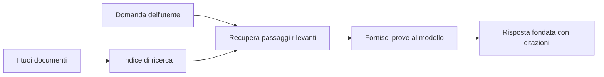

# Insegna all’AI a Rispondere alle Domande Basandosi sui Tuoi Documenti:
## Serie 1: RAG, Azure vs Alternative Open-Source, e Quando Ha Senso il Fine-Tuning

> Il primo articolo di una serie del 2026 che riprende i miei tutorial del 2023 su Azure AI Search + Azure OpenAI per il QA dei documenti.

## 1. Introduzione - Riprendere un Precedente Tutorial su RAG

Nel 2023, ho lavorato su una coppia di tutorial su come insegnare a ChatGPT a rispondere alle domande da documenti PDF usando Azure AI Search e Azure OpenAI. Ho scritto la [versione LangChain](https://techcommunity.microsoft.com/blog/educatordeveloperblog/teach-chatgpt-to-answer-questions-using-azure-ai-search--azure-openai-lang-chain/3969713), e ho anche co-autore la versione companion [Semantic Kernel](https://techcommunity.microsoft.com/blog/educatordeveloperblog/teach-chatgpt-to-answer-questions-using-azure-ai-search--azure-openai-semantic-k/3985395) con [Lee Stott](https://developer.microsoft.com/en-us/advocates/lee-stott), Principal Cloud Advocate Manager in Microsoft. All’epoca, l’idea di "ChatGPT sui tuoi dati" sembrava ancora nuova a molti sviluppatori. I tutorial usavano Azure Blob Storage, Azure AI Search, Azure OpenAI, LangChain, Semantic Kernel e il recupero vettoriale in stile FAISS per rispondere a domande da file PDF.

Quel precedente articolo si concentrava su un flusso di lavoro semplice ma importante: caricare i documenti, indicizzarli, recuperare contenuti rilevanti e chiedere a un modello di rispondere basandosi su quei contenuti.

Nel 2026, l’ecosistema RAG è cresciuto significativamente. Azure AI Search ora supporta pattern moderni di recupero vettoriale e ibrido, Azure OpenAI fa parte del più ampio ecosistema Microsoft Foundry Models, e la nuova API v1 può usare il client standard OpenAI senza richiedere cambiamenti mensili di `api-version`. Allo stesso tempo, opzioni open-source come LangGraph, LlamaIndex, Haystack, Qdrant, Milvus, Weaviate, Chroma, Ollama e vLLM sono diventate scelte praticabili per sistemi RAG reali.

Ecco perché volevo riprendere questo tema. La domanda non è più solo "Come costruisco RAG?" Ora ci sono molti modi per costruirlo, e la domanda più importante è "Quale architettura dovrei scegliere per la mia situazione?"

Ma il problema centrale non è cambiato.

Un modello AI non conosce automaticamente i tuoi documenti. Per costruire un sistema utile di risposta a domande basate su documenti, serve ancora un recupero affidabile, un fondamento, una valutazione e flussi operativi.

Questo articolo non è un altro tutorial end-to-end "chat con PDF". Voglio iniziare questa serie aggiornata con la domanda che ora mi interessa di più: quando dovresti scegliere un’architettura Azure gestita, quando una stack RAG open-source, e quando il fine-tuning ha veramente senso?

Questo è il primo articolo di una serie sulla costruzione di sistemi AI basati su documenti. In questa prima parte, ci concentreremo sulle decisioni di architettura: perché RAG è importante, quando i servizi gestiti Azure sono utili, quando le alternative open-source hanno senso e dove si colloca il fine-tuning.

Dopo aver costruito e rivisitato sistemi di QA su documenti, sono diventato meno interessato a quale strumento funzioni meglio in una demo e più interessato a quale architettura resiste agli utenti reali, ai documenti che cambiano, ai permessi, ai guasti e alla manutenzione.

## 2. Perché la Tua AI ha Bisogno di un Sistema di Ricerca

I grandi modelli linguistici sono addestrati su dati pubblici e concessi in licenza di ampia portata. Possono sapere molto su argomenti generali, ma non conoscono automaticamente i tuoi PDF privati, le politiche interne, le procedure aziendali, gli archivi di ricerca, i materiali di lezione, le note di supporto clienti o la documentazione recentemente aggiornata.

Un modo semplice per pensare a RAG è questo: invece di aspettarti che il modello ricordi ogni documento, gli forniamo un sistema di ricerca. Quando un utente fa una domanda, il sistema prima trova i pezzi di informazione più rilevanti, poi li consegna al modello come contesto.

Questo è importante perché molte fonti di conoscenza del mondo reale sono private, in continuo cambiamento, sensibili a permessi, archiviate su più sistemi, scritte in molti formati e troppo grandi per essere incollate direttamente in un prompt.

Per esempio, se una scuola, un’azienda o un team di ricerca ha 10.000 documenti interni, il modello non può rispondere da quei documenti in modo affidabile a meno che il sistema non recuperi le parti giuste al momento giusto.

Questo porta naturalmente a una domanda comune:

Perché non fare solo fine-tuning del modello?

Il fine-tuning può essere utile, ma solitamente non è lo strumento giusto per la conoscenza documentale. Se la conoscenza cambia spesso, se le citazioni contano o se i permessi di accesso contano, RAG è solitamente il punto di partenza migliore. Il fine-tuning è più adatto per insegnare comportamenti, stili, formati di output e modelli di compito.

## 3. Architettura RAG in Pratica

Immagina di costruire un assistente AI per una scuola. L’assistente deve rispondere a domande da PDF di politiche, guide ai corsi, pagine FAQ interne e annunci recentemente aggiornati.

Se uno studente chiede: "Posso usare AI generativa per il mio compito finale?", il sistema non dovrebbe rispondere dalla memoria generale del modello. Dovrebbe prima trovare la politica scolastica rilevante, recuperare la sezione sull’uso dell’AI e poi chiedere al modello di rispondere usando quella evidenza.

Questo è RAG in pratica.

A un livello alto, puoi pensare al flusso così:

I dettagli possono diventare più sofisticati, ma l’idea di base è semplice: il modello non risponde da solo. Risponde con evidenze recuperate.

Prima, i documenti sono importati da sistemi di storage come Azure Blob Storage, SharePoint, GitHub o un CMS interno. Poi il sistema li analizza in testo preservando strutture utili come titoli, numeri di pagina, tabelle, sezioni e posizioni della fonte.

Successivamente, il contenuto viene suddiviso in chunk. Questo passaggio sembra semplice, ma è una delle parti più importanti del sistema. Se un chunk è troppo piccolo, potrebbe perdere il contesto circostante. Se un chunk è troppo grande, potrebbe includere informazioni non correlate e rendere il recupero meno preciso.

Dopo la suddivisione in chunk, il sistema crea embedding e li memorizza in un indice ricercabile insieme al testo originale e ai metadati come nome file, numero pagina, permessi, versione del documento e URL sorgente.

Quando l’utente fa una domanda, il sistema recupera chunk candidati usando ricerche per parola chiave, vettoriali o ibride. Un reranker può quindi riordinare quei chunk affinché l’evidenza più utile sia in cima.

Infine, il modello riceve la domanda e l’evidenza recuperata. La risposta deve essere basata su quell’evidenza e restituire citazioni così l’utente può ispezionare la fonte.

Il punto importante è che RAG non significa solo "mettere PDF in un database vettoriale." La qualità della risposta dipende da tutto il flusso di lavoro: parsing, chunking, recupero, riordinamento, prompting, citazioni e valutazione.

Ecco perché la struttura del documento conta. In un PDF, un’intestazione, tabella, nota a piè di pagina o limite di pagina può cambiare il significato di un passaggio. Su Azure, la skill Document Layout usa capacità di layout di Azure Document Intelligence per produrre output consapevoli della struttura, il che può migliorare chunking e qualità del recupero per sistemi RAG.

## 4. Cosa è Cambiato Dal 2023?

Il tutorial del 2023 era un buon punto di partenza per il suo tempo:

- Azure Blob Storage memorizzava i file PDF.
- Azure AI Search indicizzava i contenuti.
- LangChain collegava il recupero a Azure OpenAI.
- FAISS funzionava come semplice archivio vettoriale locale.
- L’esempio usava `gpt-35-turbo` e `text-embedding-ada-002`.

Nel 2026, una versione moderna dovrebbe riflettere diversi cambiamenti.

Innanzitutto, il recupero è maturato. Nel 2023, molte demo usavano una semplice ricerca di somiglianza vettoriale. Oggi, il recupero ibrido è spesso il punto di partenza predefinito per un QA documentale serio. Azure AI Search supporta la ricerca ibrida combinando query per parola chiave e vettori in una singola richiesta e unendo i risultati con Reciprocal Rank Fusion. Un semantic ranker può poi riordinare la parte testuale dei risultati full-text, vettoriali e ibridi.

Secondo, l’ingestione è più sofisticata. Invece di suddividere manualmente ogni documento con codice applicativo, Azure AI Search supporta la vettorizzazione integrata per chunking, embedding e vettorizzazione a tempo di query. Per PDF e carichi documentali pesanti, la skill Document Layout può preservare più struttura rispetto a chunk di dimensione fissa.

Terzo, l’orchestrazione conta di più. La parte difficile spesso non è la chiamata API LLM stessa. La parte difficile è gestire guasti, ritenti, recupero obsoleto, qualità dei chunk, flussi di lavoro a lunga durata, revisione umana e valutazione su scala. Qui strumenti orientati ai workflow come LangGraph, workflow LlamaIndex, pipeline Haystack e strumenti di valutazione e osservabilità a livello piattaforma diventano più rilevanti di una singola catena lineare.

Quarto, la valutazione non è più opzionale. Una demo può sembrare impressionante con una domanda. Un sistema di produzione ha bisogno di set di test, controlli di regressione, metriche di recupero, controlli di fondamento e monitoraggio. Senza valutazione, è difficile sapere se il sistema sta migliorando o sta solo cambiando.

## 5. Scegliere Tra Stack Azure e Open-Source RAG

Non penso che la domanda utile sia "Azure è migliore dell’open source?" o "L’open source è migliore di Azure?"

La domanda utile è: che tipo di sistema stai costruendo, chi lo gestirà, quali vincoli hai, e quali modalità di errore sono inaccettabili?

Quando ho iniziato a costruire esempi di QA documentale, pensavo soprattutto se il recupero funzionasse. Potevo caricare PDF, cercarli e generare una risposta? Quello era un punto di partenza ragionevole.

Dopo aver affrontato flussi di lavoro AI più realistici, la mia valutazione è cambiata. Ora guardo quattro cose prima di scegliere uno stack RAG:

- identità e permessi
- qualità del recupero
- affidabilità del workflow
- proprietà operativa

Questi quattro aspetti dicono molto più di un semplice benchmark del modello.

Le architetture basate su Azure di solito hanno senso quando l’integrazione aziendale è la parte difficile. Se un team dipende già da Microsoft Entra ID, Microsoft 365, Azure Storage, networking privato, RBAC e monitoraggio Azure, Azure AI Search e Azure OpenAI possono ridurre molta complessità operativa. In quell’ambiente, Azure non è solo un’API modello. Il valore è il sistema circostante: identità, governance, ricerca gestita, integrazione sicurezza, supporto e operazioni familiari.

Le architetture open-source di solito hanno senso quando la flessibilità è la parte difficile. Se il team ha bisogno di inferenza locale, portabilità cloud, pipeline di recupero personalizzata, riordinamento specializzato o controllo diretto sul database vettoriale e livello di serving modello, uno stack open-source può essere la soluzione migliore. Il compromesso è che il team si assume più responsabilità sull’affidabilità: backup, scalabilità, latenza, migrazioni, monitoraggio e sicurezza.

In pratica, molti sistemi AI di produzione non sono puramente cloud-native o puramente open-source. Sono spesso sistemi ibridi che bilanciano semplicità operativa, portabilità, governance e flessibilità ingegneristica.

Per esempio, non mi sorprenderebbe vedere un sistema che usa Azure OpenAI per l’accesso al modello, LangGraph per l’orchestrazione del workflow, hosting Azure per il deployment e un database vettoriale open-source per un requisito specifico di recupero. Questo non è incoerenza architetturale. È scegliere il giusto livello di servizio gestito e controllo ingegneristico per ogni parte del sistema.

Mi piacciono le architetture ibride quando la piattaforma gestita risolve problemi importanti aziendali, mentre componenti open-source danno al team flessibilità dove conta davvero.

## 6. Una Guida Pratica per le Decisioni

Ecco la tabella decisoria che userei con un team prima di scegliere uno stack RAG:

| Area decisionale | Lo stack gestito Azure è più forte quando... | Lo stack open-source è più forte quando... |
| --- | --- | --- |
| Identità e accesso | Entra ID, RBAC, identità gestita e permessi aziendali sono centrali | domina autenticazione personalizzata, identità non Microsoft o logica di accesso specifica app |
| Operazioni | il team vuole infrastruttura gestita, supporto, SLA e onboarding più semplice | il team può gestire database vettoriali, serving modelli, backup e scalabilità |
| Recupero | ricerca ibrida, ranking semantico, filtri e ricerca metadati coprono la maggior parte dei bisogni | il team necessita di recupero personalizzato, riordinamento specializzato o indicizzazione sperimentale |
| Portabilità | l’allineamento all’ecosistema Azure è accettabile o preferito | evitare il lock-in del cloud è un requisito vincolante |
| Inferenza | la governance Azure OpenAI, networking e controlli aziendali contano | è richiesta inferenza locale, modelli custom o serving self-hosted |
| Costo | ridurre sforzi ingegneristici e operativi conta più dell’ottimizzazione infrastrutturale | la scala è abbastanza grande da giustificare una ottimizzazione infrastrutturale attenta |
| Sperimentazione | stabilità e integrazione aziendale contano più di cambiare spesso componenti | il team itera velocemente su agenti, strumenti, memoria e flussi di recupero |

La mia regola empirica è semplice:

- Parti da Azure quando integrazione aziendale, sicurezza e semplicità operativa sono i rischi principali.
- Parti da open source quando portabilità, personalizzazione o controllo locale sono i rischi principali.
- Usa uno stack ibrido quando entrambi sono veri.

Ecco perché non inizierei una serie RAG 2026 con il codice prima di tutto. Il codice è importante, ma la selezione dell’architettura viene prima dell’implementazione. Una demo semplice può nascondere le scelte più difficili. Un buon sistema RAG rende esplicite quelle scelte.

## 7. Dove Sta il Fine-Tuning

Il fine-tuning è spesso menzionato insieme a RAG, ma penso sia importante separarli.

RAG è solitamente la scelta migliore quando il sistema ha bisogno di conoscenza fresca, privata, sensibile ai permessi o fondata su fonti. Se la risposta deve citare documenti, riflettere aggiornamenti recenti o rispettare regole di accesso specifiche per utente, il recupero dovrebbe far parte dell’architettura.

Il fine-tuning è più utile quando la conoscenza non è il problema principale. Può aiutare quando vuoi che il modello segua un formato di output specifico, corrisponda a uno stile di risposta dominio-specifico, esegua un compito stabile in modo più coerente o riduca la quantità di istruzioni necessarie in ogni prompt.
In pratica, i due possono lavorare insieme. Un assistente di supporto potrebbe utilizzare RAG per recuperare l'ultima politica, mentre un modello fine-tuned apprende la struttura e il tono di risposta preferiti dall'azienda.

L'errore è considerare il fine-tuning come una sostituzione di un documento archivio. Non elimina la necessità di recupero quando il sistema deve rispondere da dati freschi, privati o sensibili alle autorizzazioni.

## 8. Dove va questa serie

Questo articolo è il livello decisionale. Prima di scrivere codice, volevo rendere espliciti i compromessi: RAG vs fine-tuning, Azure vs open source, servizi gestiti vs controllo operativo.

Prima di passare all'implementazione, voglio lasciare un punto qui: in molti sistemi AI aziendali, il modello è solo un componente. La qualità del recupero, l'orchestrazione, la valutazione, le autorizzazioni e l'affidabilità operativa sono spesso ciò che determina se il sistema ha successo oltre la fase demo.

Nelle parti successive di questa serie, ho intenzione di approfondire l'aspetto pratico dei sistemi AI basati su documenti: come costruire un'architettura basata su Azure, come si confrontano le alternative open source in pratica, e come valutare se un sistema RAG funziona effettivamente.

Potrei modificare l'ordine man mano che la serie si sviluppa, ma l'obiettivo rimarrà lo stesso: andare oltre una semplice demo e mostrare come pensare ai sistemi RAG che possono essere mantenuti, valutati e gestiti.

## 9. Riferimenti e risorse

Tutorial originali:

- [Teach ChatGPT to Answer Questions: Using Azure AI Search & Azure OpenAI (Lang Chain)](https://techcommunity.microsoft.com/blog/educatordeveloperblog/teach-chatgpt-to-answer-questions-using-azure-ai-search--azure-openai-lang-chain/3969713)
- [Teach ChatGPT to Answer Questions: Using Azure AI Search & Azure OpenAI (Semantic Kernel)](https://techcommunity.microsoft.com/blog/educatordeveloperblog/teach-chatgpt-to-answer-questions-using-azure-ai-search--azure-openai-semantic-k/3985395)

Azure:

- [Azure AI Search REST API versions](https://learn.microsoft.com/en-us/rest/api/searchservice/search-service-api-versions)
- [Hybrid search in Azure AI Search](https://learn.microsoft.com/en-us/azure/search/hybrid-search-how-to-query)
- [Integrated vectorization in Azure AI Search](https://learn.microsoft.com/en-us/azure/search/vector-search-integrated-vectorization)
- [Document Layout skill in Azure AI Search](https://learn.microsoft.com/en-us/azure/search/cognitive-search-skill-document-intelligence-layout)
- [Chunk and vectorize by document layout](https://learn.microsoft.com/en-us/azure/search/search-how-to-semantic-chunking)
- [Semantic ranking in Azure AI Search](https://learn.microsoft.com/en-us/azure/search/semantic-search-overview)
- [Azure OpenAI / Microsoft Foundry API version lifecycle](https://learn.microsoft.com/en-us/azure/foundry/openai/api-version-lifecycle)
- [Foundry Models sold by Azure](https://learn.microsoft.com/en-us/azure/foundry/foundry-models/concepts/models-sold-directly-by-azure)
- [Microsoft Foundry fine-tuning considerations](https://learn.microsoft.com/en-us/azure/foundry/openai/concepts/fine-tuning-considerations)
- [Microsoft Foundry observability](https://learn.microsoft.com/en-us/azure/foundry/concepts/observability)
- [Run evaluations in Microsoft Foundry](https://learn.microsoft.com/en-us/azure/foundry/how-to/evaluate-generative-ai-app)

Open-source:

- [LangGraph documentation](https://docs.langchain.com/oss/python/langgraph/overview)
- [LlamaIndex documentation](https://developers.llamaindex.ai/python/framework/)
- [Haystack documentation](https://docs.haystack.deepset.ai/)
- [Qdrant documentation](https://qdrant.tech/documentation/overview/)
- [Milvus documentation](https://milvus.io/docs/overview.md)
- [Weaviate documentation](https://docs.weaviate.io/weaviate/current/)
- [Chroma documentation](https://docs.trychroma.com/docs/overview/introduction)
- [Ollama embeddings](https://docs.ollama.com/capabilities/embeddings)
- [vLLM OpenAI-compatible server](https://docs.vllm.ai/en/latest/serving/openai_compatible_server.html)
- [BGE embedding models](https://huggingface.co/BAAI/bge-large-en-v1.5)
- [E5 embedding models](https://huggingface.co/intfloat/e5-large-v2)
- [Instructor embedding models](https://huggingface.co/hkunlp/instructor-large)

---

<!-- CO-OP TRANSLATOR DISCLAIMER START -->
**Disclaimer**:
Questo documento è stato tradotto utilizzando il servizio di traduzione AI [Co-op Translator](https://github.com/Azure/co-op-translator). Sebbene ci impegniamo per garantire la precisione, si prega di notare che le traduzioni automatizzate possono contenere errori o imprecisioni. Il documento originale nella sua lingua nativa deve essere considerato la fonte autorevole. Per informazioni critiche, si raccomanda una traduzione professionale effettuata da un essere umano. Non siamo responsabili per eventuali malintesi o interpretazioni errate derivanti dall’uso di questa traduzione.
<!-- CO-OP TRANSLATOR DISCLAIMER END -->