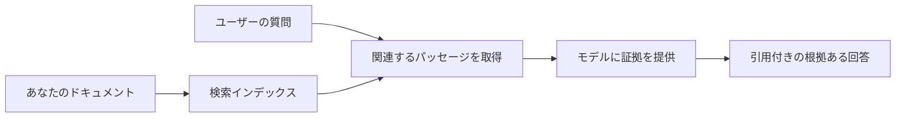

# ドキュメントに基づいてAIに質問への回答を教える方法：
## シリーズ1：RAG、Azureとオープンソース代替、およびファインチューニングが有効な場合

> 2023年のAzure AI Search + Azure OpenAIドキュメントQAチュートリアルを見直す2026年のシリーズの最初の記事。

シリーズナビゲーション：[リポジトリホーム](../README.md) | 次へ：[シリーズ2 - ローカルオープンソースRAGシステムをエンドツーエンドで構築](./series-2-open-source-rag-end-to-end.md)

## 1. はじめに - 以前のRAGチュートリアルを振り返る

2023年、私はChatGPTにAzure AI SearchとAzure OpenAIを使ってPDFドキュメントから質問に答えさせる方法を教えるチュートリアルを二つ作成しました。[LangChain版](https://techcommunity.microsoft.com/blog/educatordeveloperblog/teach-chatgpt-to-answer-questions-using-azure-ai-search--azure-openai-lang-chain/3969713)を執筆し、またMicrosoftのプリンシパルクラウドアドボケイトマネージャーである[Lee Stott](https://developer.microsoft.com/en-us/advocates/lee-stott)と共著でコンパニオンの[Semantic Kernel版](https://techcommunity.microsoft.com/blog/educatordeveloperblog/teach-chatgpt-to-answer-questions-using-azure-ai-search--azure-openai-semantic-k/3985395)も作成しました。当時、「ChatGPTを自分のデータで使う」という考えは多くの開発者にとってまだ新鮮でした。これらのチュートリアルでは、Azure Blob Storage、Azure AI Search、Azure OpenAI、LangChain、Semantic Kernel、およびFAISSスタイルのベクトル検索を使ってPDFファイルからの質問に答える方法を紹介していました。

この以前の記事は、シンプルながら重要なワークフローに焦点を当てていました：ドキュメントをアップロードし、インデックスを作成し、関連コンテンツを検索し、そのコンテンツに基づいてモデルに回答させるという流れです。

2026年になると、RAGのエコシステムは大きく成長しました。Azure AI Searchは最新のベクトル検索およびハイブリッド検索パターンをサポートし、Azure OpenAIはMicrosoft Foundry Modelsエコシステムの一部となり、より新しいv1 APIは月ごとの`api-version`変更なしで標準OpenAIクライアントを使用できます。同時に、LangGraph、LlamaIndex、Haystack、Qdrant、Milvus、Weaviate、Chroma、Ollama、vLLMなどのオープンソースオプションが実用的な本格的RAGシステムの選択肢になっています。

だからこそ、このトピックを改めて見直したいと思いました。もはや「どうやってRAGを構築するか」だけが問題ではありません。多くの構築方法が存在し、より重要なのは「自分の状況でどのアーキテクチャを選ぶべきか？」という問いです。

しかし、核心の問題は変わっていません。

AIモデルは自動的にあなたのドキュメントを知っているわけではありません。役立つドキュメント質問応答システムを構築するには、信頼できる検索、根拠付け、評価、および運用ワークフローが依然として必要です。

この記事は別のエンドツーエンドの「PDFとのチャット」チュートリアルではありません。今回のシリーズは私が今もっと気にしている問い、すなわち「いつマネージドなAzureアーキテクチャを選ぶべきか」「いつオープンソースのRAGスタックを選ぶべきか」「そしてファインチューニングはいつ実際に意味があるのか？」という質問から始めたいと思います。

これはドキュメントに根差したAIシステム構築に関するシリーズの最初の記事です。この第一部ではアーキテクチャの決定に焦点を当てます：なぜRAGが重要か、いつAzureベースのマネージドサービスが有用か、いつオープンソースの代替が妥当か、そしてファインチューニングがどこに適合するか。

ドキュメントQAシステムを構築し見直した結果、私はデモでどのツールがよく見えるかよりも、実際のユーザー、変化するドキュメント、権限、障害、メンテナンスに耐えられるアーキテクチャにより興味を持つようになりました。

## 2. なぜあなたのAIには検索システムが必要か

大規模言語モデルは広範な公開データやライセンスデータで訓練されています。一般的なトピックについては多くを知っていても、あなたのプライベートPDF、社内ポリシー、企業手順、研究アーカイブ、教室教材、カスタマーサポートノート、最近更新されたドキュメントを自動で知っているわけではありません。

RAGを理解する簡単な方法はこう考えることです：モデルにすべてのドキュメントを記憶させるのではなく、検索システムを与えるのです。ユーザーが質問すると、まずシステムが最も関連性の高い情報を探し、それらをモデルに文脈として提供します。

これは重要です。なぜなら多くの実世界の知識ソースはプライベートで、常に変化し、権限に敏感で、複数のシステムに分散し、多様なフォーマットで書かれており、プロンプトに直接貼り付けるには大きすぎるからです。

たとえば、学校や企業、研究チームに1万件の内部ドキュメントがある場合、モデルは適切なタイミングで適切な部分を検索しなければ、それらのドキュメントから信頼性のある回答はできません。

ここでよくある疑問に自然に繋がります：

なぜ単にファインチューニングしないのか？

ファインチューニングは役立つ場合もありますが、通常ドキュメント知識には最初の手段として適切ではありません。知識が頻繁に変わる場合、出典が重要な場合、アクセス権が重要な場合は、通常RAGがより良い出発点となります。ファインチューニングは行動やスタイル、出力フォーマット、タスクパターンを教えるのに向いています。

## 3. 実際のRAGアーキテクチャ

学校のAIアシスタントを構築すると想像してください。そのアシスタントはポリシーPDF、コースガイド、社内FAQページ、最近更新されたお知らせから質問に答える必要があります。

学生が「最終課題に生成AIを使えますか？」と尋ねた場合、システムはモデルの一般的な記憶から答えるべきではありません。最初に関連する学校のポリシーを見つけ、AI利用に関するセクションを取得し、その証拠を使ってモデルに回答させるべきです。

これがRAGの実践例です。

大まかにこの流れを考えることができます：

詳細はもっと洗練されることがありますが、基本的な考え方はシンプルです：モデルは単独で答えるのではなく、検索した証拠と共に答えます。

まず、ドキュメントはAzure Blob Storage、SharePoint、GitHub、または内部CMSなどのストレージシステムから取り込みます。次に見出し、ページ番号、表、セクション、ソース位置などの有用な構造を保持しつつ、テキストにパースします。

次にコンテンツをチャンクに分割します。このステップは簡単に思えますが、システムの最も重要な部分の一つです。チャンクが小さすぎると周囲の文脈を失い、大きすぎると無関係な情報を含み検索精度が落ちます。

チャンク分割後、システムは埋め込みを作成し、元のテキストやファイル名、ページ番号、権限、ドキュメントバージョン、ソースURLなどのメタデータと共に検索可能なインデックスに保存します。

ユーザーが質問すると、キーワード検索、ベクトル検索、またはハイブリッド検索を使って候補チャンクを取得します。リランキングを使い最も有用な証拠が上位に来るように並び替えることもあります。

最後にモデルは質問と取得した証拠を受け取ります。回答はその証拠に根ざすべきで、出典を返してユーザーがソースを確認できるようにします。

重要なのは、RAGは「PDFをベクトルデータベースに入れるだけ」ではないことです。回答の質はパース、チャンク分割、検索、再ランキング、プロンプト設計、出典、評価という全体のワークフローに依存します。

だからこそドキュメント構造が重要になるのです。PDFでは見出し、表、脚注、ページ区切りが文章の意味を変えることがあります。AzureではDocument LayoutスキルがAzure Document Intelligenceのレイアウト機能を使って構造認識された出力を生成し、チャンク分割と検索の質をRAGシステム向けに向上させます。

## 4. 2023年から何が変わったか？

2023年のチュートリアルは当時として良い出発点でした：

- Azure Blob StorageがPDFファイルを保存
- Azure AI Searchがコンテンツをインデックス化
- LangChainが検索からAzure OpenAIへ接続
- FAISSがシンプルなローカルベクトルストアとして機能
- 例では`gpt-35-turbo`と`text-embedding-ada-002`を使用

2026年の現代版は以下の変化を反映する必要があります。

まず、検索が成熟しました。2023年は多くのデモが単純なベクトル類似度検索を使っていましたが、今日ではハイブリッド検索が本格的なドキュメントQAのデフォルトの出発点です。Azure AI Searchはキーワード検索とベクトル検索を単一リクエストで組み合わせ、結果をReciprocal Rank Fusionで統合可能です。Semantic rankerは全文検索、ベクトル検索、ハイブリッド検索結果のテキスト側を再ランク付けできます。

次に、取り込みがより洗練されました。すべてのドキュメントをアプリケーションコードで手動分割する代わりに、Azure AI Searchはチャンク分割、埋め込み作成、クエリ時のベクトル化を統合してサポートしています。PDFやドキュメントが多いワークロード向けにDocument Layoutスキルは固定サイズチャンクよりも多くの構造を保持できます。

三番目に、オーケストレーションがより重要に。困難なのはしばしばLLM API呼び出し自体ではありません。失敗処理、再試行、陳腐化した検索、チャンクの質、長時間実行されるワークフロー、人によるレビュー、大規模評価の管理が難しいのです。このためLangGraph、LlamaIndexのワークフロー、Haystackのパイプライン、プラットフォームレベルの評価・可観測性ツールが単純な連鎖より重要になっています。

四番目に、評価がもはや任意ではありません。デモは一つの質問で印象的に見えても、本格システムはテストセット、回帰チェック、検索指標、根拠の検証、監視が必要です。評価なしにはシステムが改善しているのか単に変わっているだけなのか判断できません。

## 5. AzureとオープンソースRAGスタックの選択

「Azureはオープンソースより良い？」や「オープンソースはAzureより良い？」という問いは有用ではないと思います。

有用なのは「どんなシステムを構築し、誰が運用し、どんな制約があり、どんな失敗モードが許容できないか？」という問いです。

私がドキュメントQA例を作り始めた頃は、主に検索が機能するかが関心事でした。PDFをアップロードして検索し、回答を生成できれば十分な出発点でした。

より現実的なAIワークフローを経験するうちに、私の評価基準は変わりました。今はRAGスタックを選ぶ前に以下4つの点を見ます：

- アイデンティティと権限
- 検索の質
- ワークフローの信頼性
- 運用の所有権

これら4点はモデルのベンチマークだけより遥かに多くの情報を与えます。

Azureベースのアーキテクチャは、企業統合が難しい場合によく適しています。チームがすでにMicrosoft Entra ID、Microsoft 365、Azure Storage、プライベートネットワーク、RBAC、Azure監視に依存しているなら、Azure AI SearchとAzure OpenAIは多くの運用複雑性を軽減できます。その環境ではAzureは単なるモデルAPI以上の価値があります：アイデンティティ、ガバナンス、マネージド検索、セキュリティ統合、サポート、そして馴染みのある運用です。

オープンソースアーキテクチャは柔軟性が課題の場合に適しています。チームがローカル推論、クラウドポータビリティ、カスタム検索パイプライン、専門的な再ランキング、ベクトルデータベースやモデルサービング層の直接制御を必要とする場合はオープンソースがより適合します。代償は信頼性に関する作業をチームがより多く管理しなければならないこと：バックアップ、スケーリング、レイテンシー、マイグレーション、監視、セキュリティなどです。

実際、多くの本番AIシステムは純粋にクラウドネイティブでも純粋なオープンソースでもありません。しばしば運用のシンプルさ、ポータビリティ、ガバナンス、エンジニアリングの柔軟性のバランスを取るハイブリッドシステムです。

例えば、モデルアクセスにAzure OpenAIを使い、ワークフローのオーケストレーションにLangGraphを使い、デプロイにAzureホスティングを使い、特定の検索要件にオープンソースのベクトルDBを使うというシステムは珍しくないでしょう。それはアーキテクチャの不整合ではありません。システムの各パートに最適なマネージドサービスとエンジニアリング制御のレベルを選んでいるのです。

私は重要な企業課題を解決するマネージドプラットフォームと、チームに柔軟性を与えるオープンソースコンポーネントの組み合わせを好みます。

## 6. 実践的な意思決定ガイド

以下はチームでRAGスタックを選ぶ前に使う意思決定表です：

| 判断領域 | 以下の場合、Azureマネージドスタックが強い | 以下の場合、オープンソーススタックが強い |
| --- | --- | --- |
| アイデンティティとアクセス | Entra ID、RBAC、マネージドID、企業権限が中心 | カスタム認証、非Microsoftアイデンティティ、またはアプリ固有のアクセスロジックが主体 |
| 運用 | チームがマネージドインフラ、サポート、SLA、簡単なオンボーディングを望む | チームがベクトルDB、モデルサービング、バックアップ、スケーリングを運用可能 |
| 検索 | ハイブリッド検索、セマンティックランキング、フィルター、メタデータ検索が大部分のニーズをカバー | カスタム検索、専門的再ランキング、実験的インデックスが必要 |
| ポータビリティ | Azureエコシステムとの親和性が許容または好ましい | クラウドロックイン回避が強い要件 |
| 推論 | Azure OpenAIのガバナンス、ネットワーク管理、企業コントロールが重要 | ローカル推論、カスタムモデル、セルフホスティングが必要 |
| コスト | エンジニアリングと運用負荷軽減がインフラ最適化より重要 | スケールが十分大きく慎重なインフラ調整が正当化される |
| 実験 | 安定性と企業統合が頻繁なコンポーネント変更より重要 | チームがエージェント、ツール、メモリ、検索ワークフローを素早く反復している |

私の経験則はシンプルです：

- 企業統合、セキュリティ、運用の簡素さが主要なリスクならAzureから始める。
- ポータビリティ、カスタマイズ、ローカル制御が主なリスクならオープンソースから始める。
- 両方が真ならハイブリッドスタックを使う。

だからこそ2026年のRAGシリーズはコードから始めないのです。コードは重要ですが、実装の前にアーキテクチャ選択が必要です。シンプルなデモは最も難しい選択を隠してしまいます。良いRAGシステムはそれらの選択を明示します。

## 7. ファインチューニングが適合する場所

ファインチューニングはしばしばRAGと一緒に言及されますが、この二つは明確に分けることが重要だと思います。

RAGは通常、新鮮でプライベート、権限に敏感、ソースに根差した知識が必要なシステムでより適した選択肢です。回答がドキュメントを引用し、最新の内容を反映し、ユーザーごとのアクセスルールを尊重すべきなら、検索はアーキテクチャの一部でなければなりません。
ファインチューニングは、知識が主要な問題でない場合により有用です。モデルに特定の出力フォーマットを従わせたい場合、ドメイン固有の応答スタイルに合わせたい場合、安定したタスクをより一貫して実行したい場合、または毎回のプロンプトで必要な指示量を減らしたい場合に役立ちます。

実際には、両者は一緒に機能することができます。サポートアシスタントは最新のポリシーを取得するためにRAGを使用し、一方でファインチューニングされたモデルは会社が好む回答構造とトーンを学習します。

誤りは、ファインチューニングをドキュメントストアの代替とみなすことです。システムが最新の、非公開の、または許可が必要なデータから回答しなければならない場合、検索の必要性をなくすことはできません。

## 8. このシリーズの次の展開

この記事は意思決定レイヤーです。コードを書く前に、トレードオフを明示的に示したかった：RAG対ファインチューニング、Azure対オープンソース、マネージドサービス対運用管理。

実装に進む前に、ここで一つのポイントを残しておきたい：多くの企業向けAIシステムにおいて、モデルは一つの構成要素に過ぎません。検索品質、オーケストレーション、評価、権限、運用の信頼性が、システムがデモ段階を超えて成功するかを決定することが多いです。

このシリーズの次回以降では、ドキュメントに基づくAIシステムの実践的側面に深く入り込む予定です。まずローカルなオープンソースRAGワークフローの構築、次にAzure AI SearchとAzure OpenAIを用いて同じシナリオを再構築し、最後にシステムが実際に機能しているかどうかを評価します。

シリーズの進行に伴い順序を調整する場合がありますが、目標は変わりません。単純なデモを超え、メンテナンス、評価、運用が可能なRAGシステムの考え方を示すことです。

## 9. 参考文献とリソース

オリジナルチュートリアル:

- [Teach ChatGPT to Answer Questions: Using Azure AI Search & Azure OpenAI (Lang Chain)](https://techcommunity.microsoft.com/blog/educatordeveloperblog/teach-chatgpt-to-answer-questions-using-azure-ai-search--azure-openai-lang-chain/3969713)
- [Teach ChatGPT to Answer Questions: Using Azure AI Search & Azure OpenAI (Semantic Kernel)](https://techcommunity.microsoft.com/blog/educatordeveloperblog/teach-chatgpt-to-answer-questions-using-azure-ai-search--azure-openai-semantic-k/3985395)

Azure:

- [Azure AI Search REST API versions](https://learn.microsoft.com/en-us/rest/api/searchservice/search-service-api-versions)
- [Hybrid search in Azure AI Search](https://learn.microsoft.com/en-us/azure/search/hybrid-search-how-to-query)
- [Integrated vectorization in Azure AI Search](https://learn.microsoft.com/en-us/azure/search/vector-search-integrated-vectorization)
- [Document Layout skill in Azure AI Search](https://learn.microsoft.com/en-us/azure/search/cognitive-search-skill-document-intelligence-layout)
- [Chunk and vectorize by document layout](https://learn.microsoft.com/en-us/azure/search/search-how-to-semantic-chunking)
- [Semantic ranking in Azure AI Search](https://learn.microsoft.com/en-us/azure/search/semantic-search-overview)
- [Azure OpenAI / Microsoft Foundry API version lifecycle](https://learn.microsoft.com/en-us/azure/foundry/openai/api-version-lifecycle)
- [Foundry Models sold by Azure](https://learn.microsoft.com/en-us/azure/foundry/foundry-models/concepts/models-sold-directly-by-azure)
- [Microsoft Foundry fine-tuning considerations](https://learn.microsoft.com/en-us/azure/foundry/openai/concepts/fine-tuning-considerations)
- [Microsoft Foundry observability](https://learn.microsoft.com/en-us/azure/foundry/concepts/observability)
- [Run evaluations in Microsoft Foundry](https://learn.microsoft.com/en-us/azure/foundry/how-to/evaluate-generative-ai-app)

オープンソース:

- [LangGraph documentation](https://docs.langchain.com/oss/python/langgraph/overview)
- [LlamaIndex documentation](https://developers.llamaindex.ai/python/framework/)
- [Haystack documentation](https://docs.haystack.deepset.ai/)
- [Qdrant documentation](https://qdrant.tech/documentation/overview/)
- [Milvus documentation](https://milvus.io/docs/overview.md)
- [Weaviate documentation](https://docs.weaviate.io/weaviate/current/)
- [Chroma documentation](https://docs.trychroma.com/docs/overview/introduction)
- [Ollama embeddings](https://docs.ollama.com/capabilities/embeddings)
- [vLLM OpenAI-compatible server](https://docs.vllm.ai/en/latest/serving/openai_compatible_server.html)
- [BGE embedding models](https://huggingface.co/BAAI/bge-large-en-v1.5)
- [E5 embedding models](https://huggingface.co/intfloat/e5-large-v2)
- [Instructor embedding models](https://huggingface.co/hkunlp/instructor-large)

次へ: [Series 2 - Build a Local Open-Source RAG System End to End](./series-2-open-source-rag-end-to-end.md)

---

<!-- CO-OP TRANSLATOR DISCLAIMER START -->
**免責事項**：
本書類は AI 翻訳サービス [Co-op Translator](https://github.com/Azure/co-op-translator) を使用して翻訳されています。正確性を期していますが、自動翻訳には誤りや不正確な部分が含まれる可能性があることをご承知おきください。原文の原語版が正式な情報源とみなされるべきです。重要な情報については、専門の人間による翻訳を推奨します。本翻訳の利用により生じたいかなる誤解や解釈違いについても、当方は責任を負いかねます。
<!-- CO-OP TRANSLATOR DISCLAIMER END -->