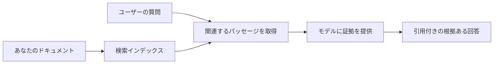

# ドキュメントに基づいて質問に答えるAIの教育：
## シリーズ 1：RAG、Azure対オープンソースの代替案、およびファインチューニングが有効な場合

> 2023年のAzure AI Search + Azure OpenAIドキュメントQAチュートリアルを見直す2026年のシリーズ最初の記事です。

## 1. はじめに - 以前のRAGチュートリアルを振り返る

2023年に、Azure AI SearchとAzure OpenAIを使用してPDFドキュメントから質問に答えるChatGPTの教育に関する二つのチュートリアルを作成しました。[LangChain版](https://techcommunity.microsoft.com/blog/educatordeveloperblog/teach-chatgpt-to-answer-questions-using-azure-ai-search--azure-openai-lang-chain/3969713)を書き、マイクロソフトのプリンシパルクラウドアドボケートマネージャーである[Lee Stott](https://developer.microsoft.com/en-us/advocates/lee-stott)と共同で[Semantic Kernel版](https://techcommunity.microsoft.com/blog/educatordeveloperblog/teach-chatgpt-to-answer-questions-using-azure-ai-search--azure-openai-semantic-k/3985395)も執筆しました。当時、「データに対するChatGPT」という考えは多くの開発者にとってまだ新しいものでした。これらのチュートリアルは、Azure Blob Storage、Azure AI Search、Azure OpenAI、LangChain、Semantic Kernel、およびFAISSスタイルのベクトル検索を使用してPDFファイルから質問に答えるものでした。

以前の記事はシンプルながら重要なワークフローに焦点を当てていました：ドキュメントのアップロード、インデックス付け、関連コンテンツの検索、そしてそのコンテンツを基にモデルに質問させることです。

2026年になると、RAGエコシステムは大幅に成長しました。Azure AI Searchは現代的なベクトルおよびハイブリッド検索パターンをサポートし、Azure OpenAIはMicrosoft Foundry Modelsエコシステムの一部となり、新しいv1 APIは月次の`api-version`変更を必要とせず標準のOpenAIクライアントが使えます。一方で、LangGraph、LlamaIndex、Haystack、Qdrant、Milvus、Weaviate、Chroma、Ollama、vLLMなどのオープンソースオプションも実用的なRAGシステムの選択肢となっています。

だからこそ、このテーマを再訪したいと考えました。もはや「RAGをどう作るか」だけの問題ではありません。今では多くの構築方法があり、より重要な質問は「自分の状況にどのアーキテクチャを選ぶべきか？」です。

しかし、根本的な問題は変わっていません。

AIモデルは自動的にあなたのドキュメントを知っているわけではありません。使えるドキュメント質問応答システムを構築するには、依然として信頼できる検索、根拠付け、評価、運用ワークフローが必要です。

この記事はまた別のエンドツーエンドの「PDFとチャット」チュートリアルではありません。この更新シリーズは、私が今もっと関心を持つ次の疑問から始めたいと思います：管理されたAzureアーキテクチャを選ぶべきタイミング、オープンソースRAGスタックを選ぶべきタイミング、ファインチューニングは実際にいつ意味があるのか？

これはドキュメントに根ざしたAIシステム構築シリーズの最初の記事です。このパートではアーキテクチャの決定に焦点を当てます：なぜRAGは重要なのか、いつAzureベースの管理サービスが有用なのか、いつオープンソース代替が適しているのか、そしてファインチューニングの位置づけはどこか。

ドキュメントQAシステムの構築と振り返りを重ねる中で、デモでどのツールがかっこよく見えるかよりも、実際のユーザー、変化するドキュメント、権限、障害、保守に耐えうるアーキテクチャに興味が移ってきています。

## 2. なぜAIには検索システムが必要か

大規模言語モデルは広範な公開情報やライセンスされたデータで訓練されています。一般的な話題については多くを知っているかもしれませんが、あなたのプライベートなPDF、内部ポリシー、企業手順、研究アーカイブ、授業資料、カスタマーサポートメモ、最近更新されたドキュメントを自動的には知りません。

RAGを考える簡単な方法はこうです：モデルがすべてのドキュメントを記憶すると期待する代わりに、検索システムを提供します。ユーザーが質問をしたとき、まず関連性の高い情報の断片を検索し、モデルにその断片を文脈として与えて答えさせます。

これは多くの実際の知識源がプライベートで、常に変化し、権限に敏感で、複数のシステムにまたがり、多様なフォーマットで書かれていて、プロンプトに直接貼り付けるには大きすぎるという事情に関わります。

例えば、学校、企業、研究チームが1万件の内部ドキュメントを持っていても、適切なタイミングで正しい部分を検索しない限り、モデルはそれらのドキュメントから確実に答えられません。

ここでよくある疑問が出てきます：

なぜ単にファインチューニングしないのか？

ファインチューニングは有用ですが、通常はドキュメント知識の最初のツールとして適切ではありません。知識が頻繁に変わる場合、引用が重要な場合、アクセス権が重要な場合、RAGがより良いスタートポイントです。ファインチューニングは振る舞い、スタイル、出力フォーマット、タスクパターンの教育に向いています。

## 3. RAGアーキテクチャの実際

学校のAIアシスタントを構築すると想像してください。そのアシスタントはポリシーPDF、コースガイド、内部FAQページ、最近更新されたお知らせからの質問に答える必要があります。

もし生徒が「期末課題に生成AIを使ってもいいですか？」と聞いたら、システムはモデルの一般的な記憶から答えるべきではありません。まず関連する学校のポリシーを見つけて、AI利用に関するセクションを取得し、その証拠を使ってモデルに答えさせる必要があります。

これが実践におけるRAGです。

大まかには、フローは次のように考えられます：

詳細はもっと複雑になることがありますが、基本的な考えはシンプルです：モデルは単独で答えません。検索された証拠と共に答えます。

まず、Azure Blob Storage、SharePoint、GitHub、内部CMSなどのストレージシステムからドキュメントを取り込みます。次に、見出し、ページ番号、表、セクション、ソース位置などの有用な構造を保持しながらテキストに解析します。

その後、コンテンツはチャンク（断片）に分割されます。このステップは単純に聞こえますが、システムの最重要部分の一つです。チャンクが小さすぎると周囲の文脈を失う可能性があり、大きすぎると無関係な情報を含み検索精度が下がります。

チャンク分割の後、システムは埋め込み表現（embedding）を作成し、元のテキストやファイル名、ページ番号、権限、ドキュメントバージョン、ソースURLなどのメタデータと共に検索可能なインデックスに保存します。

ユーザーが質問すると、キーワード検索、ベクトル検索、ハイブリッド検索を使って候補チャンクを取得します。リランキング機能によりそれらのチャンクの順序を入れ替え、最も有用な証拠を上位に配置できます。

最後にモデルは質問と取得された証拠を受け取り、応答はその証拠に基づき、出典を返してユーザーがソースを確認できるようにします。

重要なのは、RAGは単に「PDFをベクトルデータベースに入れる」以上のものだということです。回答の質は、解析、チャンク分割、検索、リランキング、プロンプト作成、引用、評価という全体のワークフローに依存しています。

だからこそ、ドキュメントの構造が重要です。PDFでは、見出し、表、脚注、ページ区切りが文の意味を変えることがあります。AzureではDocument LayoutスキルがAzure Document Intelligenceのレイアウト能力を用い、構造認識の出力を生成し、RAGシステムのチャンク分割と検索品質を向上させます。

## 4. 2023年以降の変化

2023年のチュートリアルは当時の良い出発点でした：

- Azure Blob StorageにPDFを保存
- Azure AI Searchでコンテンツをインデックス化
- LangChainでAzure OpenAIの検索連携
- FAISSを単純なローカルベクトルストアとして使用
- `gpt-35-turbo`と`text-embedding-ada-002`を利用

2026年の現代版は以下の変化を反映すべきです。

まず検索が成熟しました。2023年は多くのデモが単純なベクトル類似検索を使っていましたが、現在は真剣なドキュメントQAではハイブリッド検索がデフォルトの出発点です。Azure AI Searchはキーワード検索とベクトル検索を組み合わせた単一リクエストでのハイブリッド検索をサポートし、結果をReciprocal Rank Fusionでマージします。Semantic rankerは全文検索、ベクトル検索、ハイブリッド検索のテキスト部分をリランキングできます。

次に取り込みがより高度になっています。すべてのドキュメントをアプリケーションコードで手動分割する代わりに、Azure AI Searchはチャンク分割、埋め込み作成、クエリ時ベクトル化を統合的にサポートします。PDFやドキュメント大量処理のためにDocument Layoutスキルは固定サイズチャンクより多くの構造を保持できます。

三番目にオーケストレーションの重要性が増しています。困難なのはLLM API呼び出しそのものではなく、障害処理、再試行、古い検索結果、チャンク品質、長時間実行ワークフロー、人間のレビュー、スケールのある評価対応を管理することです。これに関してLangGraph、LlamaIndexワークフロー、Haystackパイプライン、プラットフォームレベルの評価・可観測性ツールが単一リニアチェーンより重要です。

四番目に評価が必須になりました。デモは一つの質問で印象的に見えるかもしれませんが、本番システムはテストセット、回帰チェック、検索評価指標、根拠チェック、監視が必要です。評価がなければ改善か変化かわかりません。

## 5. AzureとオープンソースRAGスタックの選択

「Azureがオープンソースより良いか？」や「オープンソースがAzureより良いか？」は有用な質問ではないと思います。

有用なのは：「何を作るのか、誰が運用するのか、どんな制約があるか、どの失敗モードが許容できないか？」です。

ドキュメントQA例を作り始めた時は検索が動くかどうかしか考えていませんでした。PDFをアップロードして検索し回答を生成できればOKと考えていました。それは合理的な出発点でした。

より現実的なAIワークフローに取り組むと評価観点は変わりました。今はRAGスタックを選ぶ前に次の4点を検討します：

- アイデンティティと権限
- 検索品質
- ワークフローの信頼性
- 運用の所有権

これら4つはモデルベンチマーク以上に多くを教えてくれます。

エンタープライズ統合が困難な場合はAzureベースのアーキテクチャが理にかなっています。チームがすでにMicrosoft Entra ID、Microsoft 365、Azure Storage、プライベートネットワーク、RBAC、Azure監視に依存しているなら、Azure AI SearchやAzure OpenAIは運用の複雑さを大幅に軽減します。その環境でAzureは単なるモデルAPIではありません。価値は周辺システム：アイデンティティ、ガバナンス、管理型検索、セキュリティ統合、サポート、慣れた運用にあります。

柔軟性が困難な場合はオープンソースアーキテクチャが理にかなっています。チームがローカル推論、クラウド移植性、カスタム検索パイプライン、特殊リランキング、ベクトルDBやモデルサービングの直接制御を必要とする場合、オープンソーススタックが合います。代償は信頼性業務の多くをチームが引き受けること：バックアップ、スケーリング、レイテンシ、マイグレーション、監視、セキュリティです。

実際には多くの本番AIシステムは純粋なクラウドネイティブでも純粋なオープンソースでもありません。運用のシンプルさ、移植性、ガバナンス、エンジニアリングの柔軟性をバランスさせたハイブリッドシステムが多いです。

例えばAzure OpenAIをモデルアクセスに使い、LangGraphでワークフローオーケストレーションを行い、Azure上でホスティングし、特定の検索要件にオープンソースベクトルDBを使うシステムを見ても驚きません。それはアーキテクチャの不整合ではなく、それぞれの部分で適切な管理サービスとエンジニアリング制御レベルを選んでいるのです。

管理されたプラットフォームが重要なエンタープライズ問題を解決しながら、オープンソースのコンポーネントが実際に重要な柔軟性をチームに与えるハイブリッドアーキテクチャが私は好きです。

## 6. 実践的な意思決定ガイド

RAGスタックを選ぶ前にチームで使う意思決定表は以下の通りです：

| 決定領域 | Azure管理スタックが強い場合… | オープンソーススタックが強い場合… |
| --- | --- | --- |
| アイデンティティとアクセス | Entra ID、RBAC、管理ID、エンタープライズ権限が中心 | カスタム認証、非Microsoftアイデンティティ、アプリ固有アクセスロジックが主導 |
| 運用 | チームが管理インフラ、サポート、SLA、簡単なオンボーディングを望む | チームがベクトルDB、モデル運用、バックアップ、スケーリングを扱える |
| 検索 | ハイブリッド検索、セマンティックランキング、フィルター、メタデータ検索が大半のニーズをカバー | チームがカスタム検索、特殊リランキング、実験的インデックス化を必要とする |
| 移植性 | Azureエコシステムとの整合性が許容または好ましい | クラウドロックイン回避が厳格な必須条件 |
| 推論 | Azure OpenAIのガバナンス、ネットワーク、エンタープライズ管理が重要 | ローカル推論、カスタムモデル、セルフホスティングが必要 |
| コスト | インフラチューニングよりエンジニアリング・運用軽減が重要 | 規模が大きくインフラ最適化が正当化できる |
| 実験 | 安定性とエンタープライズ統合が頻繁なコンポーネント変更より優先 | チームがエージェント、ツール、メモリー、検索ワークフローを素早く反復する |

私の経験則はシンプルです：

- エンタープライズ統合、セキュリティ、運用の簡素さが主な懸念ならAzureから始める。
- 移植性、カスタマイズ、ローカル制御が主な懸念ならオープンソースから始める。
- 両方ある場合はハイブリッドスタックを使う。

これが2026年RAGシリーズをコードから始めない理由でもあります。コードは重要ですが、アーキテクチャ選択が実装に先行します。シンプルなデモは最難関の選択を隠しがちです。良いRAGシステムはその選択を明示化します。

## 7. ファインチューニングの位置づけ

ファインチューニングはしばしばRAGと一緒に語られますが、この二つを分けることが重要だと思います。

RAGはシステムが新鮮で、プライベートで、権限に敏感で、証拠に基づく知識を必要とするとき通常より適切です。答えがドキュメントを引用し、最近の更新を反映し、ユーザー固有のアクセス制限を尊重すべきなら検索はアーキテクチャの一部にすべきです。

ファインチューニングは知識が主問題でない場合にさらに役立ちます。モデルに特定の出力形式に従わせたり、ドメイン固有の応答スタイルと一致させたり、安定したタスクを一貫して実行させたり、毎回のプロンプト指示を減らしたりしたいときに有用です。
実際には、両者は共に機能することができます。サポートアシスタントは最新のポリシーを取得するためにRAGを使用し、一方でファインチューニングされたモデルは会社の好ましい回答構造とトーンを学習します。

誤りは、ファインチューニングをドキュメントストアの代替と見なすことです。システムが新鮮でプライベート、または権限が必要なデータから回答しなければならない場合、検索の必要性をなくすものではありません。

## 8. このシリーズの次の展開

この記事は意思決定の層です。コードを書く前に、トレードオフを明示的にしたいと思いました：RAG 対 ファインチューニング、Azure 対 オープンソース、マネージドサービス 対 運用コントロール。

実装に進む前に、ここで一点だけ述べておきたいことがあります。多くのエンタープライズAIシステムでは、モデルは単なるコンポーネントの一つに過ぎません。検索品質、オーケストレーション、評価、権限、運用の信頼性こそが、システムがデモ段階を超えて成功するかどうかを左右することが多いのです。

このシリーズの次回以降では、ドキュメントに基づくAIシステムの実践的側面により深く踏み込む予定です。Azureベースのアーキテクチャの構築方法、オープンソースの代替手段が実際にどう比較されるか、そしてRAGシステムが実際に機能しているかどうかの評価方法について解説します。

シリーズの進行に合わせて順序を調整するかもしれませんが、目標は変わりません。単なるデモを超えて、メンテナンス、評価、運用が可能なRAGシステムについて考える方法を示すことです。

## 9. 参考文献とリソース

オリジナルチュートリアル：

- [Teach ChatGPT to Answer Questions: Using Azure AI Search & Azure OpenAI (Lang Chain)](https://techcommunity.microsoft.com/blog/educatordeveloperblog/teach-chatgpt-to-answer-questions-using-azure-ai-search--azure-openai-lang-chain/3969713)
- [Teach ChatGPT to Answer Questions: Using Azure AI Search & Azure OpenAI (Semantic Kernel)](https://techcommunity.microsoft.com/blog/educatordeveloperblog/teach-chatgpt-to-answer-questions-using-azure-ai-search--azure-openai-semantic-k/3985395)

Azure：

- [Azure AI Search REST API versions](https://learn.microsoft.com/en-us/rest/api/searchservice/search-service-api-versions)
- [Hybrid search in Azure AI Search](https://learn.microsoft.com/en-us/azure/search/hybrid-search-how-to-query)
- [Integrated vectorization in Azure AI Search](https://learn.microsoft.com/en-us/azure/search/vector-search-integrated-vectorization)
- [Document Layout skill in Azure AI Search](https://learn.microsoft.com/en-us/azure/search/cognitive-search-skill-document-intelligence-layout)
- [Chunk and vectorize by document layout](https://learn.microsoft.com/en-us/azure/search/search-how-to-semantic-chunking)
- [Semantic ranking in Azure AI Search](https://learn.microsoft.com/en-us/azure/search/semantic-search-overview)
- [Azure OpenAI / Microsoft Foundry API version lifecycle](https://learn.microsoft.com/en-us/azure/foundry/openai/api-version-lifecycle)
- [Foundry Models sold by Azure](https://learn.microsoft.com/en-us/azure/foundry/foundry-models/concepts/models-sold-directly-by-azure)
- [Microsoft Foundry fine-tuning considerations](https://learn.microsoft.com/en-us/azure/foundry/openai/concepts/fine-tuning-considerations)
- [Microsoft Foundry observability](https://learn.microsoft.com/en-us/azure/foundry/concepts/observability)
- [Run evaluations in Microsoft Foundry](https://learn.microsoft.com/en-us/azure/foundry/how-to/evaluate-generative-ai-app)

オープンソース：

- [LangGraph documentation](https://docs.langchain.com/oss/python/langgraph/overview)
- [LlamaIndex documentation](https://developers.llamaindex.ai/python/framework/)
- [Haystack documentation](https://docs.haystack.deepset.ai/)
- [Qdrant documentation](https://qdrant.tech/documentation/overview/)
- [Milvus documentation](https://milvus.io/docs/overview.md)
- [Weaviate documentation](https://docs.weaviate.io/weaviate/current/)
- [Chroma documentation](https://docs.trychroma.com/docs/overview/introduction)
- [Ollama embeddings](https://docs.ollama.com/capabilities/embeddings)
- [vLLM OpenAI-compatible server](https://docs.vllm.ai/en/latest/serving/openai_compatible_server.html)
- [BGE embedding models](https://huggingface.co/BAAI/bge-large-en-v1.5)
- [E5 embedding models](https://huggingface.co/intfloat/e5-large-v2)
- [Instructor embedding models](https://huggingface.co/hkunlp/instructor-large)

---

<!-- CO-OP TRANSLATOR DISCLAIMER START -->
**免責事項**：
本書類は AI 翻訳サービス [Co-op Translator](https://github.com/Azure/co-op-translator) を使用して翻訳されています。正確性を期していますが、自動翻訳には誤りや不正確な部分が含まれる可能性があることをご承知おきください。原文の原語版が正式な情報源とみなされるべきです。重要な情報については、専門の人間による翻訳を推奨します。本翻訳の利用により生じたいかなる誤解や解釈違いについても、当方は責任を負いかねます。
<!-- CO-OP TRANSLATOR DISCLAIMER END -->