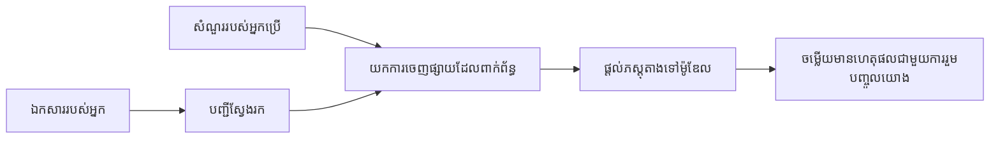

# បង្រៀន AI ដើម្បីឆ្លើយសំណួរតាមឯកសាររបស់អ្នក៖
## ស៊េរី១៖ RAG, Azure ក្រៅពីជម្រើសប្រភពបើក និងពេលណាដែលការតម្រែតម្រងគឺមានអត្ថិភាព

> អត្ថបទដំបូងក្នុងស៊េរីឆ្នាំ ២០២៦ ដែលពិនិត្យឡើងវិញនូវមេរៀន QA ឯកសារ Azure AI Search + Azure OpenAI ឆ្នាំ ២០២៣ របស់ខ្ញុំ។

ការរុករកស៊េរី៖ [ផ្ទះឃ្លាំង](../README.md) | បន្ទាប់៖ [ស៊េរី ២ - បង្កើតប្រព័ន្ធ RAG ប្រភពបើកក្នុងស្រុកពីដើមដល់ចប់](./series-2-open-source-rag-end-to-end.md)

## ១. សេចក្តីផ្ដើម - ពិនិត្យឡើងវិញមេរៀន RAG មុននេះ

នៅឆ្នាំ ២០២៣ ខ្ញុំបានធ្វើការលើមេរៀនពីរដែលបង្រៀន ChatGPT ឱ្យឆ្លើយសំណួរពីឯកសារ PDF ដោយប្រើ Azure AI Search និង Azure OpenAI។ ខ្ញុំបានសរសេរ [ជំនាន់ LangChain](https://techcommunity.microsoft.com/blog/educatordeveloperblog/teach-chatgpt-to-answer-questions-using-azure-ai-search--azure-openai-lang-chain/3969713) ហើយក៏បានរួមភារកិច្ចសរសេរ [ជំនាន់ Semantic Kernel](https://techcommunity.microsoft.com/blog/educatordeveloperblog/teach-chatgpt-to-answer-questions-using-azure-ai-search--azure-openai-semantic-k/3985395) ជាមួយ [Lee Stott](https://developer.microsoft.com/en-us/advocates/lee-stott) ប្រធានគ្រប់គ្រង Cloud Advocate Manager នៅ Microsoft។ នៅពេលនោះ គំនិត "ChatGPT លើទិន្នន័យរបស់អ្នក" តែងតែមានអារម្មណ៍ថ្មីសម្រាប់អ្នកអភិវឌ្ឍជាច្រើន។ មេរៀនបានប្រើ Azure Blob Storage, Azure AI Search, Azure OpenAI, LangChain, Semantic Kernel, និង FAISS-style vector retrieval ដើម្បីឆ្លើយសំណួរពីឯកសារ PDF។

អត្ថបទមុននេះផ្ដោតលើលំនាំការងារគ្រឹះមួយដែលសាមញ្ញ ប៉ុន្តែសំខាន់៖ អាប់ឡូដឯកសារ, កំណត់ពិន្ទុ, រកមាតិកាដែលពាក់ព័ន្ធ, ហើយសួរអ្នកម៉ូដែលឱ្យឆ្លើយបញ្ជាក់តាមមាតិកានោះ។

នៅឆ្នាំ ២០២៦ ប្រព័ន្ធ RAG បានកើនឡើងយ៉ាងច្រើន។ Azure AI Search ឥឡូវនេះគាំទ្រទិន្ន័យវ៉ិចទ័រ និងលំនាំស្វែងរកកម្រិតលាយសព្វថ្ងៃ, Azure OpenAI ជាប្រព័ន្ធមួយនៃ Microsoft Foundry Models, ហើយ API v1 ថ្មីអាចប្រើក្រុមអតិថិជន OpenAI តាមស្តង់ដារដោយមិនចាំបាច់ផ្លាស់ប្ដូរជាបន្ទាន់ `api-version` រៀងរាល់ខែ។ នៅខណៈពេលដដែល ជម្រើសប្រភពបើកដូចជា LangGraph, LlamaIndex, Haystack, Qdrant, Milvus, Weaviate, Chroma, Ollama, និង vLLM បានក្លាយជាជម្រើសជាក់ស្តែងសម្រាប់ប្រព័ន្ធ RAG ពិតប្រាកដ។

ហេតុនេះហើយខ្ញុំចង់ពិនិត្យឡើងវិញប្រធានបទនេះ។ សំណួរឥឡូវនេះមិនមែនគ្រាន់តែ "តើត្រូវបង្កើត RAG ដូចម្តេច?" ទេ។ ត្រូវមានវិធីសាស្រ្តច្រើនក្នុងការបង្កើតវា ហើយសំណួរសំខាន់ទៀតគឺ "តើអាជីពណាមួយដែលខ្ញុំគួរជ្រើសរើសសម្រាប់ស្ថានភាពរបស់ខ្ញុំ?"

ប៉ុន្តែក្នុងមូលដ្ឋានបញ្ហាមិនបានផ្លាស់ប្តូរ។

ម៉ូដែល AI មិនទាន់ដឹងឯកសាររបស់អ្នកដោយស្វ័យប្រវត្តិ។ ដើម្បីបង្កើតប្រព័ន្ធឆ្លើយសំណួរដោយផ្អែកលើឯកសារដែលមានប្រយោជន៍ អ្នកត្រូវការទំនាក់ទំនងស្វែងរកទិន្នន័យមានទំនុកចិត្ត ការបញ្ជាក់ ដំណោះស្រាយ និងលំនាំប្រតិបត្តិការ។

អត្ថបទនេះមិនមែនជាមេរៀន "ជជែកជាមួយ PDF" ពីដើមដល់ចប់ទេ។ ខ្ញុំចង់ចាប់ផ្ដើមស៊េរីបានបង្កើតឡើងវិញនេះជាមួយសំណួរដែលខ្ញុំពិតជាផ្តោតចិត្ត៖ ពេលណាអ្នកគួរជ្រើសរើសរចនាសម្ព័ន្ធ Azure ដែលគ្រប់គ្រងរួច, ពេលណាអ្នកគួរជ្រើសរើសសន្លឹក RAG ប្រភពបើក, និងពេលណាការតម្រែតម្រងមានប្រយោជន៍ពិតប្រាកដ?

នេះជាអត្ថបទដំបូងក្នុងស៊េរីស្តីអំពីការបង្កើតប្រព័ន្ធ AI ផ្អែកលើឯកសារ។ ក្នុងផ្នែកដំបូងនេះ យើងនឹងផ្ដោតលើការសម្រេចចិត្តរចនាសម្ព័ន្ធ៖ ហេតុអ្វី RAG មានសារៈសំខាន់, ពេលណាសេវាកម្មគ្រប់គ្រងអាស្រ័យលើ Azure មានប្រយោជន៍, ពេលណាចំណងជើងប្រភពបើកសមរម្យ, និងកន្លែងដែលការតម្រែតម្រងបូវសម្ងាត់។

បន្ទាប់ពីបង្រៀន និងពិនិត្យឡើងវិញប្រព័ន្ធ QA ឯកសារ ខ្ញុំមានចំណាប់អារម្មណ៍តិចចំពោះឧបករណ៍ណាមួយដែលមើលទៅល្អនៅក្នុងសំណួរបង្ហាញ និងចំណាប់អារម្មណ៍ច្រើនក្នុងការរចនាសម្ព័ន្ធណាដែលអាចធ្វើបានក្នុងពេលប្រាក់ចំណូលផលិតកម្មពិតប្រាកដ ពិន្ទុឯកសារផ្លាស់ប្តូរ ការអនុញ្ញាត បរាជ័យ និងការថែទាំ។

## ២. ហេតុអ្វី AI របស់អ្នកត្រូវការប្រព័ន្ធស្វែងរក

ម៉ូដែលភាសាធំៗត្រូវបានបណ្តុះបណ្តាលលើទិន្នន័យសាធារណៈទូលំទូលាយនិងបានអនុញ្ញាត។ ពួកវាអាចដឹងច្រើនអំពីប្រធានបទទូទៅ ប៉ុន្តាពួកវាមិនដឹងឯកសារ PDF ផ្ទាល់ខ្លួនរបស់អ្នក នីតិវិធីខាងក្នុង បទបញ្ជារដ្ឋបាល របៀបធ្វើធុរកិច្ច វិចិត្រសាស្រ្តស្រាវជ្រាវ សម្ភារៈថ្នាក់រៀន កំណត់ត្រាសេវាកម្មអតិថិជន ឬឯកសារឆ្លើយប្រែប្រួលថ្មីៗទេ។

វិធីសាស្ត្រងាយៗក្នុងការគិតអំពី RAG គឺ៖ មិនបង្ហាញការរំពឹងថាម៉ូដែលនឹងចងចាំឯកសារទាំងអស់ទេ ប៉ុន្តែយើងផ្តល់ប្រព័ន្ធស្វែងរកទៅវា។ នៅពេលអ្នកប្រើប្រាស់សួរសំណួរ ប្រព័ន្ធនឹងស្វែងរកព័ត៌មានដែលពាក់ព័ន្ធបំផុតជាមុន ហើយបន្ថែមព័ត៌មានទាំងនោះជាចំណុចបរិបទសម្រាប់ម៉ូដែលឱ្យឆ្លើយ។

វាមានសារៈសំខាន់ ព្រោះប្រភពចំណេះដឹងជាច្រើននៅក្នុងពិភពបច្ចុប្បន្នមានប្រជាប្រិយភាពផ្ទាល់ខ្លួន កំពុងផ្លាស់ប្ដូរបានជាប្រចាំ មានការសង្គ្រោះថ្នាក់ ថែទាំមើលចាំបាច់ គ្រប់គ្រងបណ្ដាញផ្សេងៗ មានទ្រង់ទ្រាយច្រើន និងធំធេងពេកផ្ទេរចូលបញ្ហាក្នុងពេលតែមួយ។

ឧទាហរណ៍ ប្រសិនបើសាលា ក្រុមហ៊ុន ឬក្រុមស្រាវជ្រាវ មានឯកសារខាងក្នុងរហូតដល់ ១០,០០០ ខ្ទង់ ម៉ូដែលមិនអាចឆ្លើយពីឯកសារទាំងនោះបានយ៉ាងទៀងទាត់ទេ លុះត្រាតែប្រព័ន្ធស្វែងរកបានផ្តល់ផ្នែកដែលត្រឹមត្រូវនៅពេលត្រឹមត្រូវ។

នេះធ្វើឱ្យខ្លួនឯងឆ្ពោះទៅរកសំណួរមួយដែលធម្មតា៖

ហេតុអ្វីមិនត្រឹមត្រូវតែតម្រែតម្រងម៉ូដែល?

ការតម្រែតម្រងអាចមានប្រយោជន៍ ប៉ុន្តាច្រើនពេលវាមិនមែនជាឧបករណ៍ដំបូងសម្រាប់ចំណេះដឹងឯកសារ។ ប្រសិនបើចំណេះដឹងផ្លាស់ប្ដូរជាប្រចាំ ប្រសិនបើការអះអាងមេត្តាសម្រួល ឬការអនុញ្ញាតចូលមានសារៈសំខាន់ RAG ជាជម្រើសដំបូងល្អជាង។ ការតម្រែតម្រងល្អសម្រាប់បង្រៀនអារម្មណ៍, រចនាប័ទ្ម, ទ្រង់ទ្រាយលទ្ធផល និងលំនាំភារកិច្ច។

## ៣. រចនាសម្ព័ន្ធ RAG ក្នុងការអនុវត្ត

សូមនិយាយថាអ្នកកំពុងបង្កើតជំនួយការចីវិត AI សម្រាប់សាលា។ ជំនួយការត្រូវឆ្លើយសំណួរពីឯកសារពិន័យអំពីគោលការណ៍ សៀវភៅណែនាំ 코스, ទំព័រ FAQ ខាងក្នុង និងប្រកាសថ្មីៗ។

បើសិស្សសួរ "តើខ្ញុំអាចប្រើ AI កំណើតសម្រាប់ការងារចុងក្រោយរបស់ខ្ញុំបានទេ?" ប្រព័ន្ធមិនគួរឆ្លើយពីចងចាំទូទៅរបស់ម៉ូដែលទេ។ គួរត្រួតពិនិត្យគោលការណ៍សាលាដែលពាក់ព័ន្ធសិន រកយកផ្នែកអំពីការប្រើប្រាស់ AI ហើយបន្ទាប់មកសួរម៉ូដែលឱ្យឆ្លើយដោយប្រើភស្តុតាងនោះ។

នេះហើយជារូបមន្ត RAG។

នៅលំដាប់ខ្ពស់ អ្នកអាចគិតលំនាំដូចខាងក្រោម៖

ព័ត៌មានលម្អិតអាចក្លាយជាស្មុគស្មាញបន្ថែម ប៉ុន្តាសំខាន់ គឺម៉ូដែលមិនឆ្លើយតែឯងទេ។ វាឆ្លើយដោយមានភស្តុតាងដែលបានយកមកវិញផង។

ជាលើកដំបូង ឯកសារត្រូវបានបញ្ចូលពីប្រព័ន្ធផ្ទុកដូចជា Azure Blob Storage, SharePoint, GitHub ឬ CMS ខាងក្នុងផ្សេងទៀត។ បន្ទាប់ប្រព័ន្ធបំបែកឯកសារជាអត្ថបទ ខណៈរក្សារចនាសម្ព័ន្ធដែលមានប្រយោជន៍ដូចជាឈ្មោះនៃក្បាលទំព័រ, លេខទំព័រ, តារាង, ផ្នែក និងទីតាំងប្រភព។

បន្ទាប់មក ខ្លឹមសារត្រូវបានបំបែកជា​ផ្នែកតូចៗ។ ជំហាននេះហាក់ដូចជាសាមញ្ញ ប៉ុន្តែនេះគឺជាផ្នែកសំខាន់បំផុតនៃប្រព័ន្ធ។ ប្រសិនបើផ្នែកតូចពេកវាអាចបាត់បង់បរិបទជុំវិញ។ ប្រសិនបើផ្នែកធំពេក វាអាចរួមបញ្ចូលព័ត៌មានមិនទាក់ទងហើយធ្វើឱ្យការស្វែងរកភាពត្រឹមត្រូវកាន់តែចុះ។

បន្ទាប់ពីបំបែក, ប្រព័ន្ធបង្កើត embeddings ហើយរក្សាទុកក្នុងតារាងស្វែងរកជាពីសង្ស័យជាមួយអត្ថបទដើមនិងមាតាវិទ្យាដូចជាឈ្មោះឯកសារ, លេខទំព័រ, បណ្ដឹង, កំណែឯកសារ និង URL ប្រភព។

ពេលអ្នកប្រើប្រាស់សួរសំណួរ ប្រព័ន្ធចាប់យកផ្នែកដែលអាចជាអ្នកដាក់បេក្ខជន ដោយប្រើការស្វែងរកពាក្យគន្លឹះ, ស្វែងរកវ៉ិចទ័រ ឬស្វែងរកផ្លូវលាយ។ កម្មវិធីបញ្ចេីញឡើងវិញអាចរៀបចំតម្រៀបផ្នែកទាំងនោះជាថ្មី ដើម្បីឱ្យភស្តុតាងមានប្រយោជន៍បំផុតត្រូវបានដាក់នៅក្បាល។

ចុងក្រោយ ម៉ូដែលទទួលបានសំណួរជាមួយភស្តុតាងដែលបានយកមកវិញ។ ចម្លើយគួរត្រូវបានគាំទ្រដោយភស្តុតាងនោះ ហើយត្រូវផ្ដល់យោងឲ្យអ្នកប្រើប្រាស់អាចពិនិត្យប្រភពបាន។

ចំណុចសំខាន់ គឺថា RAG មិនមែនគ្រាន់តែ "ដាក់ PDF ចូលក្នុងមូលដ្ឋានទិន្នន័យវ៉ិចទ័រ" ទេ។ គុណភាពនៃការឆ្លើយឡើងនៅលើលំនាំការងារទាំងមូល៖ បង្ហាញ, បំបែក, ស្វែងរក, បញ្ជេីញឡើងវិញ, ការផ្ដល់សំណួរ, ការយោង និងការវាយតម្លៃ។

ហេតុនេះហើយរចនាសម្ព័ន្ធឯកសារមានសារៈសំខាន់។ ក្នុង PDF, ក្បាល, តារាង, សម្គាល់ជើងទំព័រ ឬព្រំប្រទល់ទំព័រអាចផ្លាស់ប្ដូរចំណុចន័យនៃអត្ថបទ។ នៅលើ Azure ជំនាញ Document Layout ប្រើសមត្ថភាព Azure Document Intelligence សម្រាប់បង្កើតចេញលំអរ ដែលអាចបង្កើនគុណភាពបំបែក និងស្វែងរកសម្រាប់ប្រព័ន្ធ RAG។

## ៤. តើមានអ្វីផ្លាស់ប្ដូរពីឆ្នាំ ២០២៣?

មេរៀនឆ្នាំ ២០២៣ ជាចំណុចចាប់ផ្ដើមល្អសម្រាប់ពេលនោះ៖

- Azure Blob Storage បានផ្ទុកឯកសារ PDF។
- Azure AI Search បានកំណត់ពិន្ទុមាតិកា។
- LangChain បានភ្ជាប់ការស្វែងរកទៅ Azure OpenAI។
- FAISS ប្រើជា មូលដ្ឋានទិន្នន័យវ៉ិចទ័រជាក្នុងស្រុក។
- ឧទាហរណ៍បានប្រើ `gpt-35-turbo` និង `text-embedding-ada-002`។

នៅឆ្នាំ ២០២៦ ជំនាន់ទំនើបគួរតែបង្ហាញពីការផ្លាស់ប្ដូរច្រើន។

ដំបូង, ការស្វែងរកបានមានភាពទទួលខុសត្រូវបំផុត។ នៅឆ្នាំ ២០២៣ ការបង្ហាញជាច្រើនប្រើស្វែងរកវ៉ិចទ័រងាយៗ។ ឥឡូវនេះ, ការស្វែងរកលាយសមរម្យគឺជាចំណុចចាប់ផ្ដើមសម្រាប់ធ្វើ QA ឯកសារយ៉ាងខ្ពស់។ Azure AI Search គាំទ្រការស្វែងរកលាយសមរម្យ ដោយបញ្ចូលសំណួរពាក្យគន្លឹះ និងវ៉ិចទ័រជាការស្នើសុំតែមួយហើយបញ្ចូលលទ្ធផលជាមួយ Reciprocal Rank Fusion។ Semantic ranker អាចរៀបចំលំដាប់ឡើងវិញសម្រាប់បញ្ហារក្សាទុកពិចារណា, វ៉ិចទ័រ, និងលទ្ធផលលាយសមរម្យ។

ជារូបមន្តទីពីរ, ការបញ្ចូលទិន្នន័យមានភាពឆ្លាតវៃ។ ជំនួសការបំបែកឯកសារជាមានដៃមួយៗជាមួយកូដកម្មវិធី Azure AI Search គាំទ្រការវ៉ិចទ័រលាយសំរាប់បំបែក, បង្កើត embeddings និងការវ៉ិចទ័រលើសំណួរនាពេលស្នើសុំ។ សម្រាប់ PDF និងការងារច្រើនឯកសារ ជំនាញ Document Layout អាចរក្សារចនាសម្ព័ន្ធច្រើនជាងផ្នែកកំណត់ទំហំ។

ជាមន្ត្រីទីបី, ការត្រួតពិនិត្យការត្រួតពិនិត្យបណ្តាញមានសារៈសំខាន់ពេក។ ភាពរឹងមាំមិនមែនជាការហៅ API LLM ប៉ុណ្ណោះទេ ប៉ុន្តែត្រូវគ្រប់គ្រងការបរាជ័យ, ព្យាយាមម្តងទៀត, ទិន្នន័យចាស់, គុណភាពផ្នែកបំបែក, លំនាំវដ្តរយៈពេលវែង, ការត្រួតពិនិត្យដោយមនុស្ស និងការវាយតម្លៃនៅកម្រិតធំ។ នេះជាកន្លែងឧបករណ៍នៃលំនាំកម្មវិធី ដូចជា LangGraph, របៀបការងារ LlamaIndex, ការហូរទឹក Haystack, និងឧបករណ៍វាយតម្លៃ និងមើលឃើញតាមវេទិកាកាន់តែពាក់ព័ន្ធជាងខ្សែតែមួយ។

ជាមន្ត្រីទីបួន, ការវាយតម្លៃមិនមែនជាជម្រើសទេ។ ប្រើមួយសំណួរតែមួយủសមាច់ត្រឡប់តាមប្រព័ន្ធ។ ប្រព័ន្ធផលិតកម្មត្រូវការប៉ះពាល់បញ្ជាក់ទាញតេស្ត, ផ្ទៀងផ្ទាត់ធម្មតា, ម៉េត្រិចស្វែងរក, ការត្រួតពិនិត្យភាពគាំទ្រ និងការត្រួតពិនិត្យមើលរាយការណ៍។ ពុំមានការវាយតម្លៃពិបាកដឹងថាប្រព័ន្ធកំពុងធ្វើល្អ ឬត្រឹមតែផ្លាស់ប្តូរ។

## ៥. ជ្រើសរើសរវាង Azure និងសន្លឹក RAG ប្រភពបើក

ខ្ញុំមិនគិតថាសំណួរដែលមានប្រយោជន៍គឺ "តើ Azure ល្អជាងប្រភពបើកទេ?" ឬ "ប្រភពបើកល្អជាង Azure ទេ?"។

សំណួរដែលមានប្រយោជន៍គឺ៖ តើប្រព័ន្ធបែបណាដែលអ្នកកំពុងបង្កើត? អ្នកណាដែលនឹងដំណើរការ? ការកំណត់លក្ខខណ្ឌមានអ្វីខ្លះ? ហើយអ្វីដែលមិនអាចទទួលយឺតបាន?

ពេលខ្ញុំចាប់ផ្ដើមបង្កើតឧទាហរណ៍ QA ឯកសារ ខ្ញុំគិតគ្រាន់តែថាការស្វែងរកដំណើរការបានទេ? តើខ្ញុំអាចអាប់ឡូដ PDF, ស្វែងរកពួកវា, និងបង្កើតចម្លើយបានទេ? នេះជាចំណុចចាប់ផ្ដើមសមរម្យ។

បន្ទាប់ពីធ្វើការងារជាមួយលំនាំ AI ជាក់ស្តែង ការវាយតម្លៃខ្ញុំបានផ្លាស់ប្តូរ។ ឥឡូវនេះ ខ្ញុំមើលទៅលើបួនរបស់មុនជ្រើសរើសសន្លឹក RAG:

- អត្តសញ្ញាណ និងការអនុញ្ញាត
- គុណភាពស្វែងរក
- ភាពទៀងទាត់លំនាំប្រតិបត្តិការ
- កម្មវិធីដោះស្រាយបុគ្គលិក

បួនដែននេះប្រាប់អ្នកច្រើនជាងគំរូម៉ូដែលតែមួយ។

រចនាសម្ព័ន្ធអាស្រ័យលើ Azure ភាគច្រើនសមរម្យនៅពេលបញ្ហារួមបញ្ចូលសហគ្រាស។ ប្រសិនបើក្រុមដដែលពឹងផ្អែកលើ Microsoft Entra ID, Microsoft 365, Azure Storage, បណ្ដាញឯកជន, RBAC, និងការត្រួតពិនិត្យ Azure AI Search និង Azure OpenAI អាចកាត់បន្ថយរាល់ភាពស្មុគស្មាញប្រតិបត្តិការ។ នៅក្នុងបរិបទនេះ Azure មិនមែនគ្រាន់តែ API ម៉ូដែលទេ តម្លៃគឺប្រព័ន្ធជុំវិញ៖ អត្តសញ្ញាណ, រៀបចំគ្រប់គ្រង, ស្វែងរកគ្រប់គ្រង, បញ្ចូលសុវត្ថិភាព, គាំទ្រ, និងប្រតិបត្តិការដែលស្គាល់។

រចនាសម្ព័ន្ធប្រភពបើកភាគច្រើនសមរម្យនៅពេលភាពបត់បែនជារឿងតំបន់។ ប្រសិនបើក្រុមត្រូវការសាកល្បងក្នុងស្រុក, ផ្សេងឆ្ងាយ, បណ្ដាញស្វែងរកផ្ទាល់ខ្លួន, ការតម្រៀបឡើងវិញពិសេស, ឬការគ្រប់គ្រងផ្ទាល់លើមូលដ្ឋានទិន្នន័យវ៉ិចទ័រនិងសេវាអ្នកម៉ូដែល រចនាសម្ព័ន្ធប្រភពបើកជាជម្រើសល្អជាង។ ការប្រាក់គឺក្រុមគ្រប់គ្រងការ​ខ្សែភាពយន្ត: ការបម្រុងទុក, ការពង្រីក, ពេលយឺត, ការផ្លាស់ប្តូរ, ការត្រួតពិនិត្យ និងសុវត្ថិភាព។

ក្នុងការអនុវត្ត អ្នកជាច្រើនប្រព័ន្ធ AI ផលិតកម្មមិនមែនជាប្រព័ន្ធពេញលេញប្រភពបើក ឬ cloud-native ទេ។ ពួកវាធម្មតាជាប្រព័ន្ធឡាយ សម្យបន្ធូរយ៉ាងមានប្រសិទ្ធភាព តម្លាភាព, ការបញ្ជាក់គ្រប់គ្រង, និងភាពបត់បែនវិស្វកម្ម។

ឧទាហរណ៍ ខ្ញុំមិនភ្ញាក់ផ្អើលទេដែលឃើញប្រព័ន្ធមួយប្រើ Azure OpenAI សម្រាប់ចូលម៉ូដែល, LangGraph សម្រាប់លំនាំកម្មវិធី, ហូសទីង Azure សម្រាប់ការចំណុះ និងមូលដ្ឋានទិន្នន័យវ៉ិចទ័រប្រភពបើកសម្រាប់តម្រូវការស្វែងរកពិសេសមួយ។ នេះមិនមែនជាការមិនសមស្របរចនាសម្ព័ន្ធទេ។ នេះគឺជាការជ្រើសរើសកម្រិតសេវាកម្មគ្រប់គ្រងនិងការត្រួតពិនិត្យវិស្វកម្មត្រឹមត្រូវសម្រាប់ផ្នែកនីមួយៗនៃប្រព័ន្ធ។

ខ្ញុំចូលចិត្តរចនាសម្ព័ន្ធឡាយនៅពេលវេទិកាគ្រប់គ្រងដោះស្រាយបញ្ហាសហគ្រាសសំខាន់ៗ ខណៈធ្វើឱ្យធាតុប្រភពបើកផ្តល់ភាពបត់បែនឱ្យក្រុមនៅកន្លែងដែលវាមានអត្ថន័យពិតប្រាកដ។

## ៦. មគ្គុទេសក៍សម្រេចចិត្តជាក់ស្ដែង

នេះជាតារាងសម្រេចចិត្តដែលខ្ញុំនឹងប្រើជាមួយក្រុម មុនជ្រើសរើសសន្លឹក RAG៖

| តំបន់សម្រេចចិត្ត | សន្លឹកគ្រប់គ្រង Azure ខ្លាំងជាងពេល... | សន្លឹកប្រភពបើកខ្លាំងជាងពេល... |
| --- | --- | --- |
| អត្តសញ្ញាណ និងការចូលប្រើ | Entra ID, RBAC, អត្តសញ្ញាណគ្រប់គ្រង, និងការអនុញ្ញាតសហគ្រាសជាមូលដ្ឋាន | ការផ្ទេរការអនុញ្ញាតផ្ទាល់ខ្លួន, អត្តសញ្ញាណក្រៅ Microsoft ឬច្បាប់ចូលប្រើប្រើកម្មវិធីជាអ្នកគ្រប់គ្រង |
| ប្រតិបត្តិការ | ក្រុមចង់បានហេដ្ឋារចនាសម្ព័ន្ធគ្រប់គ្រង, គាំទ្រ, SLA, និងការចុះបញ្ជីងាយស្រួល | ក្រុមអាចដំណើរការមូលដ្ឋានទិន្នន័យវ៉ិចទ័រ, សេវាម៉ូដែល, ការបម្រុងទុក, និងការពង្រីក |
| ការស្វែងរក | ស្វែងរកលាយសមរម្យ, រៀបចំតម្រៀប, ការវាយតម្លៃ, និងការស្វែងរកមាតាវិទ្យាគ្របដណ្តប់តម្រូវការ | ក្រុមត្រូវការស្វែងរកផ្ទាល់ខ្លួន, ការតម្រៀបឡើងវិញពិសេស, ឬការបណ្ដុះបណ្ដាលលើកំណត់ត្រា |
| ការទស្សនភាព | សមាតភាពជាមួយអេកូស៊ីស្ទែម Azure ទទួលយកបាន ឬនឹកស្រមៃ | ការជៀសវាងការចំណាកស្រុកទៅ cloud ជាសារៈសំខាន់ |
| ការហៅ | អាជ្ញាប័ណ្ណ Azure OpenAI, បណ្តាញ និងការគ្រប់គ្រងសហគ្រាសមានអត្ថន័យ | ការបង្ការ inference ក្នុងស្រុក, ម៉ូដែលផ្ទាល់ខ្លួន, ឬសេវាពីខ្លួនឯងចាំបាច់ |
| ថ្លៃ | ការកាត់បន្ថយការខិតខំវិស្វកម្ម និងប្រតិបត្តិការ អាងថ្លៃជាងការកែប្រែហេដ្ឋារចនាសម្ព័ន្ធ | ទំហំនៃសមត្ថភាពគ្រប់គ្រងធំគ្រប់គ្រាន់ ដើម្បីចំណាយពេលម៉ត់ចត់លើការលៃតម្រូវហេដ្ឋារចនាសម្ព័ន្ធ |
| ការសាកល្បង | ភាពរឹងមាំនិងការរួមបញ្ចូលសហគ្រាសមានតម្លៃជាងការផ្លាស់ប្ដូរធាតុខ្លួន | ក្រុមកំពុងបន្តអភិវឌ្ឍលឿនលើភ្នាក់ងារ ឧបករណ៍ ចងចាំ និងលំនាំស្វែងរក |

ច្បាប់ដៃខ្ញុំសាមញ្ញ៖

- ចាប់ផ្ដើមជាមួយ Azure នៅពេលបញ្ហាសហគ្រាស សុវត្ថិភាព និងភាពសាមញ្ញប្រតិបត្តិការ ជាហានិភ័យសំខាន់។
- ចាប់ផ្ដើមជាមួយប្រភពបើក នៅពេលភាពទស្សនភាព ការផ្ទាល់ខ្លួន ឬការត្រួតពិនិត្យក្នុងស្រុក ជាហានិភ័យសំខាន់។
- ប្រើសន្លឹកឡាយនៅពេលពីរប្រភេទនេះពិតប្រាកដ។

ហេតុផលនេះផងដែលខ្ញុំមិនចាប់ផ្ដើមស៊េរី RAG ឆ្នាំ ២០២៦ ជាមួយកូដជាមុនទេ។ កូដសំខាន់ ប៉ុន្តារើសរចនាសម្ព័ន្ធមុនអនុវត្ត។ តែបង្ហាញឯករាជ្យអាចលាក់ការជ្រើសរើសដ៏ខ្ល hardest។ ប្រព័ន្ធ RAG ល្អធ្វើអោយជម្រើសនោះច្បាស់លាស់។

## ៧. កន្លែងដែលការតម្រែតម្រងសម្រួល

ការតម្រែតម្រងតែងតែបាននិយាយរួមជាមួយ RAG ប៉ុន្តែខ្ញុំគិតថាយ៉ាងល្អក្នុងការបំបែកពីគ្នា។

RAG ជាជម្រើសល្អក្នុងករណីប្រព័ន្ធត្រូវការចំណេះដឹងថ្មី ផ្ទាល់ខ្លួន មានការសង្គ្រោះថ្នាក់ ឬច្បាប់ប្រភពមូលដ្ឋាន។ ប្រសិនបើចម្លើយត្រូវបញ្ជាក់ឯកសារ បញ្ចេញការអាប់ដេតថ្មីៗ ឬគោរពច្បាប់ចូលប្រើជាក់លាក់ការស្វែងរកគួរត្រូវបញ្ចូលក្នុងរចនាសម្ព័ន្ធ។
ការតម្រឹមលំអិតមានប្រយោជន៍ច្រើនបើចំណេះដឹងមិនមែនជាបញ្ហាសំខាន់ទេ។ វាអាចជួយបានពេលដែលអ្នកចង់ឲ្យម៉ូដែលអនុវត្តតាមទ្រង់ទ្រាយលទ្ធផលជាក់លាក់ ម្ជុលតាមរបៀបឆ្លើយតបពាក់ព័ន្ធនឹងវិស័យ បំពេញភារកិច្ចមួយយ៉ាងមានស្ថិរភាពយ៉ាងទៀងទាត់ ឬកាត់បន្ថយចំនួនការណែនាំដែលត្រូវការនៅក្នុងរាល់ការសុំ។

នៅក្នុងអនុវត្តភាពទាំងពីរ អាចធ្វើការសហការ។ ជំនួយការជំនួយអាចប្រើ RAG ដើម្បីយកគោលនយោបាយថ្មីៗ មួយខណៈម៉ូដែលដ៏តម្រឹមបានរៀនរចនាសម្ព័ន្ធពាក្យឆ្លើយដែលក្រុមហ៊ុនពេញចិត្ត និងសំឡេង។

កំហុសគឺព្យាយាមចាត់ទុកការតម្រឹមលំអិតជាជំនួសសម្រាប់ហាងឯកសារ។ វាមិនលើកលែងការដកយកពេលប្រព័ន្ធត្រូវឆ្លើយបានពីទិន្នន័យថ្មី ដែលជាន់សិទ្ធិឬមានការកំណត់សិទ្ធិឯកជន។

## 8. តើស៊េរីនេះទៅឆ្វេងណា

អត្ថបទនេះគឺជស្រទាប់សម្រេចចិត្ត។ មុននឹងសរសេរកូដ ខ្ញុំចង់ធ្វើអោយទំនាក់ទំនងច្បាស់លាស់៖ RAG ប្រឆាំង fine-tuning, Azure ប្រឆាំង open source, សេវាដំណើរការតាមគ្រប់គ្រង ប្រឆាំងការគ្រប់គ្រងប្រតិបត្តិការ។

មុនផ្លាស់ទៅការអនុវត្ត ខ្ញុំចង់ទុកចំណុចមួយនៅទីនេះ៖ ក្នុងប្រព័ន្ធ AI សេវាសាធារណៈជាច្រើន ម៉ូដែលគឺជាផ្នែកមួយតែមួយ។ គុណភាពការដកយក, ការសម្របសម្រួល, ការប៉ាន់ប្រមាណ, សិទ្ធិ, និងស្ថិរភាពប្រតិបត្តិការគឺជារឿងដែលសំខាន់ក្នុងការកំណត់ថាប្រព័ន្ធនោះជោគជ័យនៅលើឈុតបង្ហាញឬអត់។

នៅផ្នែកបន្ទាប់នៃស៊េរីនេះ ខ្ញុំនឹងបញ្ជ្រាបច្រើនទៅផ្នែកអនុវត្តន៍នៃប្រព័ន្ធ AI ផ្អែកលើឯកសារ៖ សាងសង់ប្រព័ន្ធ RAG open-source មួយក្នុងតំបន់ ម្តង ម្តងបង្កើតឡើងវិញស្ថានការណ៍ដូចគ្នាដោយ Azure AI Search និង Azure OpenAI ទៅក្នុងការវាយតម្លៃថាប្រព័ន្ធនោះធ្វើការ ប្រសើរពិតឬអត់។

ខ្ញុំអាចផ្លាស់ប្តូរលំដាប់តាមដំណើរអភិវឌ្ឍដើម្បីស៊េរីតែគោលបំណងនឹងនៅដដែល៖ ដើម្បីឆ្លៀតកន្លែងពីវីដេអូឆ្លាក់មួយ និងបង្ហាញវិធីគិតអំពីប្រព័ន្ធ RAG ដែលអាចថែរក្សា វាយតម្លៃ និងដំណើរការ។

## 9. ឯកសារ និងធនធាន

មេរៀនដើម៖

- [បង្រៀន ChatGPT ដើម្បីឆ្លើយសំណួរ៖ ប្រើ Azure AI Search និង Azure OpenAI (Lang Chain)](https://techcommunity.microsoft.com/blog/educatordeveloperblog/teach-chatgpt-to-answer-questions-using-azure-ai-search--azure-openai-lang-chain/3969713)
- [បង្រៀន ChatGPT ដើម្បីឆ្លើយសំណួរ៖ ប្រើ Azure AI Search និង Azure OpenAI (Semantic Kernel)](https://techcommunity.microsoft.com/blog/educatordeveloperblog/teach-chatgpt-to-answer-questions-using-azure-ai-search--azure-openai-semantic-k/3985395)

Azure៖

- [កំណែ API REST របស់ Azure AI Search](https://learn.microsoft.com/en-us/rest/api/searchservice/search-service-api-versions)
- [ការស្វែងរករួមបញ្ចូលនៅក្នុង Azure AI Search](https://learn.microsoft.com/en-us/azure/search/hybrid-search-how-to-query)
- [ការរួមបញ្ចូលវ៉ិចទ័រនៅក្នុង Azure AI Search](https://learn.microsoft.com/en-us/azure/search/vector-search-integrated-vectorization)
- [ជំនាញរចនាបត្រឯកសារនៅក្នុង Azure AI Search](https://learn.microsoft.com/en-us/azure/search/cognitive-search-skill-document-intelligence-layout)
- [បំបែក និងវ៉ិចទ័រតាមរចនាបត្រឯកសារ](https://learn.microsoft.com/en-us/azure/search/search-how-to-semantic-chunking)
- [ការថ្នាក់វាយតម្លៃ Semantic នៅក្នុង Azure AI Search](https://learn.microsoft.com/en-us/azure/search/semantic-search-overview)
- [ជីវិតវគ្គ API របស់ Azure OpenAI / Microsoft Foundry](https://learn.microsoft.com/en-us/azure/foundry/openai/api-version-lifecycle)
- [ម៉ូដែល Foundry ដែលបានលក់ដោយ Azure](https://learn.microsoft.com/en-us/azure/foundry/foundry-models/concepts/models-sold-directly-by-azure)
- [ការពិចារណាតម្រឹមម៉ាស៊ីន Microsoft Foundry](https://learn.microsoft.com/en-us/azure/foundry/openai/concepts/fine-tuning-considerations)
- [ការតាមដាន Microsoft Foundry](https://learn.microsoft.com/en-us/azure/foundry/concepts/observability)
- [រត់ការវាយតម្លៃនៅ Microsoft Foundry](https://learn.microsoft.com/en-us/azure/foundry/how-to/evaluate-generative-ai-app)

Open-source៖

- [ឯកសារ LangGraph](https://docs.langchain.com/oss/python/langgraph/overview)
- [ឯកសារ LlamaIndex](https://developers.llamaindex.ai/python/framework/)
- [ឯកសារ Haystack](https://docs.haystack.deepset.ai/)
- [ឯកសារ Qdrant](https://qdrant.tech/documentation/overview/)
- [ឯកសារ Milvus](https://milvus.io/docs/overview.md)
- [ឯកសារ Weaviate](https://docs.weaviate.io/weaviate/current/)
- [ឯកសារ Chroma](https://docs.trychroma.com/docs/overview/introduction)
- [ការបញ្ចូល Ollama](https://docs.ollama.com/capabilities/embeddings)
- [ម៉ាស៊ីនបម្រើ vLLM អនុវត្ត OpenAI](https://docs.vllm.ai/en/latest/serving/openai_compatible_server.html)
- [ម៉ូដែលបញ្ចូល BGE](https://huggingface.co/BAAI/bge-large-en-v1.5)
- [ម៉ូដែលបញ្ចូល E5](https://huggingface.co/intfloat/e5-large-v2)
- [ម៉ូដែលបញ្ចូល Instructor](https://huggingface.co/hkunlp/instructor-large)

បន្ទាប់ ៖ [ស៊េរី 2 - សាងសង់ប្រព័ន្ធ RAG open-source ក្នុងតំបន់ពីដើមដល់ចុង](./series-2-open-source-rag-end-to-end.md)

---

<!-- CO-OP TRANSLATOR DISCLAIMER START -->
**ការបដិសេធ**:
ឯកសារនេះត្រូវបានបម្លែងភាសា ដោយប្រើសេវាបម្លែងភាសា AI [Co-op Translator](https://github.com/Azure/co-op-translator)។ ទោះយើងខ្ញុំមានក្តីប្រាថ្នាឱ្យបានច្បាស់លាស់ តែសូមយល់ដឹងថាការបម្លែងដោយស្វ័យប្រវត្តិក៏អាចមានកំហុសឬភាពមិនត្រឹមត្រូវ។ ឯកសារដើមជាភាសាទីតាំងគួរត្រូវបានគេប្រើជាប្រភពច្បាស់លាស់។ សម្រាប់ព័ត៌មានសំខាន់ៗ សូមណែនាំឱ្យប្រើប្រាស់ការប្រែដោយមនុស្សជំនាញ។ យើងខ្ញុំមិនទទួលខុសត្រូវចំពោះការយល់ច្រឡំ ឬការបកស្រាយខុសបន្ទាប់ពីការប្រើប្រាស់ការបម្លែងនេះនោះទេ។
<!-- CO-OP TRANSLATOR DISCLAIMER END -->