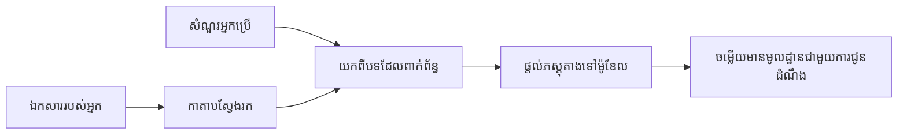

# បណ្តុះបណ្តាល AI ដើម្បីឆ្លើយសំណួរដោយផ្អែកលើឯកសាររបស់អ្នក៖
## ស៊េរីទី 1៖ RAG, Azure ប្រឆាំងជម្រើសបើកប្រភព និងពេលណាដែល Fine-Tuning មានអត្ថន័យ

> អត្ថបទដំបូងនៃស៊េរីមួយនៅឆ្នាំ 2026 ដែលពិនិត្យឡើងវិញមេរៀន Azure AI Search + Azure OpenAI ស្តីពីការប្រាប់ AI ឆ្លើយសំណួរពីឯកសារ QA ឆ្នាំ 2023 របស់ខ្ញុំ។

## 1. គំរោងមូលដ្ឋាន - ពិនិត្យឡើងវិញមេរៀន RAG មុននេះ

នៅឆ្នាំ 2023 ខ្ញុំបានធ្វើការលើមេរៀនពីរនៅស្តីពីការបង្រៀន ChatGPT ឆ្លើយសំណួរពីឯកសារប្រភេទ PDF ដោយប្រើ Azure AI Search និង Azure OpenAI។ ខ្ញុំបានសរសេរបទអត្ថបទ [LangChain](https://techcommunity.microsoft.com/blog/educatordeveloperblog/teach-chatgpt-to-answer-questions-using-azure-ai-search--azure-openai-lang-chain/3969713) ហើយក៏បានសហរៀបចំបទអត្ថបទ [Semantic Kernel](https://techcommunity.microsoft.com/blog/educatordeveloperblog/teach-chatgpt-to-answer-questions-using-azure-ai-search--azure-openai-semantic-k/3985395) ជាមួយ [Lee Stott](https://developer.microsoft.com/en-us/advocates/lee-stott) ដែលជាអ្នកគ្រប់គ្រង Principal Cloud Advocate Manager នៅ Microsoft។ នៅពេលនោះ គំនិត “ChatGPT លើទិន្នន័យរបស់អ្នក” មើលទៅជារឿងថ្មីសម្រាប់អ្នកអភិវឌ្ឍន៍ជាច្រើន។ មេរៀនបានប្រើ Azure Blob Storage, Azure AI Search, Azure OpenAI, LangChain, Semantic Kernel និងការស្វែងរកVector ដូចជា FAISS ដើម្បីឆ្លើយសំណួរពីឯកសារ PDF។

អត្ថបទមុននេះបានផ្តោតលើ ប្រេកង់នៃវេនសរសេរ៖ ផ្ទុកឯកសារ, បង្កើត index, ស្វែងរកមាតិកាដែលពាក់ព័ន្ធ និងសួរម៉ូដែលឲ្យឆ្លើយដោយផ្អែកលើមាតិកានោះ។

នៅឆ្នាំ 2026 ប្រព័ន្ធ RAG បានរីកចម្រើនយ៉ាងមានអាទិភាព។ Azure AI Search ឥឡូវនេះគាំទ្រប្រភេទការស្វែងរកវ៉ិចទ័រនិងភ្ជាប់គ្នា (hybrid retrieval patterns) ទាន់សម័យ, Azure OpenAI គឺជាផ្នែកមួយនៃអេកូសូស៊ីតម៍ Microsoft Foundry Models ដ៏ធំទូលាយ ហើយ API កំណែ v1 ថ្មីៗអាចប្រើ client OpenAI ស្តង់ដា ដោយមិនចាំបាច់ប្តូរ `api-version` រៀងរាល់ខែ។ លើសពីនេះ ការជ្រើសរើសការបើកប្រភពដូចជា LangGraph, LlamaIndex, Haystack, Qdrant, Milvus, Weaviate, Chroma, Ollama និង vLLM បានក្លាយជជម្រើសជាក់លាក់សម្រាប់ប្រព័ន្ធ RAG ពិតប្រាកដ។

នេះហើយជាការដែលខ្ញុំចង់ត្រឡប់មកពិភាក្សាលើប្រធានបទនេះម្តងទៀត។ សំណួរឥឡូវនេះមិនមែនត្រឹមតែ "តើធ្វើដូចម្តេចដើម្បីបង្កើត RAG?" ផងទេ។ ឥឡូវនេះមានវិធីជាច្រើនសម្រាប់បង្កើតវា ហើយសំណួរសំខាន់ជាងគេឥឡូវនេះគឺ "តើខ្ញុំគួរជ្រើសរើសរចនាសម្ព័ន្ធណាសម្រាប់ស្ថានភាពរបស់ខ្ញុំ?"

ប៉ុន្តែបញ្ហាមូលដ្ឋានមិនបានផ្លាស់ប្តូរទេ។

ម៉ូដែល AI មិនស្គាល់ឯកសាររបស់អ្នកដោយស្វ័យប្រវត្តិទេ។ ដើម្បីបង្កើតប្រព័ន្ធឆ្លើយសំណួរពីឯកសារដែលមានប្រយោជន៍ អ្នកត្រូវការពិភាក្សាដំណើរការស្វែងរកដែលទុកចិត្តបាន, ការគាំទ្រ (grounding), ការ<|vq_image_323|><|image_border_15|><|vq_image_12156|><|vq_image_8936|><|vq_image_8936|><|vq_image_8936|><|vq_image_8936|><|vq_image_8936|><|vq_image_8936|><|vq_image_8936|><|vq_image_8936|><|vq_image_8936|><|vq_image_8936|><|vq_image_8936|><|vq_image_8936|><|vq_image_8936|><|vq_image_7023|><|vq_image_877|>  
អត្ថបទនេះមិនមែនជាមេរៀន “chat ជាមួយ PDF” ពេញលេញម្តងទៀតទេទេ។ ខ្ញុំចង់ចាប់ផ្តើមស៊េរីដែលបានធ្វើបច្ចុប្បន្នភាពនេះជាមួយសំណួរដែលខ្ញុំចាប់អារម្មណ៍ជាងមុន៖ ពេលណាដែលអ្នកគួរជ្រើសរើសបណ្តាញ Azure មួយដែលគ្រប់គ្រងដោយគេ, ពេលណាដែលអ្នកគួរជ្រើសរើស stack RAG បើកប្រភព, ហើយពេលណាដែល fine-tuning មានអត្ថន័យពិត?

នេះជាអត្ថបទដំបូងនៅក្នុងស៊េរីស្តីពីការបង្កើតប្រព័ន្ធ AI ដែលគាំទ្រដោយឯកសារ។ នៅផ្នែកដំបូងនេះ យើងនឹងផ្តោតលើការសម្រេចចិត្តរចនាសម្ព័ន្ធ៖ ហេតុអ្វី RAG មានសារៈសំខាន់, ពេលណាសេវាកម្មគ្រប់គ្រង ដោយប្រើ Azure មានប្រយោជន៍, ពេលណាជម្រើសបើកប្រភពមានតម្លៃ និងទីតាំងដែល fine-tuning សមរម្យ។

បន្ទាប់ពីបានបង្កើត និងពិនិត្យឡើងវិញប្រព័ន្ធ QA ឯកសារ ខ្ញុំកាន់តែមានចំណាប់អារម្មណ៍តិចចំពោះឧបករណ៍មួយដែលមើលទៅល្អបង្ហាញ និងចំណាប់អារម្មណ៍ច្រើនទៅលើរចនាសម្ព័ន្ធដែលមានជីវិតឆាប់រីកចម្រើននៅក្នុងការប្រើប្រាស់ពិតប្រាកដ, ឯកសារផ្លាស់ប្ដូរ, សិទ្ធិ, ការបរាជ័យ និងការថែទាំ ។

## 2. ហេតុអ្វី AI របស់អ្នកត្រូវការប្រព័ន្ធស្វែងរក

ម៉ូដែលភាសាធំៗ ត្រូវបានបណ្តុះបណ្តាលលើទិន្នន័យសាធារណៈទូលំទូលាយ និងទិន្នន័យដែលមានអាជ្ញាប័ណ្ណ។ ពួកវាអាចស្គាល់ច្រើនពីប្រធានបទទូទៅ ប៉ុន្តែមិនស្គាល់ឯកសារ PDF ផ្ទាល់ខ្លួនរបស់អ្នក, គោលការណ៍ផ្ទៃក្នុង, ប្រតិបត្តិការអង្គភាព, ការស្រាវជ្រាវ, សម្ភារៈថ្នាក់រៀន, កំណត់ត្រាសហការគាំទ្រអតិថិជន ឬឯកសារត្រូវបានធ្វើបច្ចុប្បន្នភាពថ្មីៗទេ។

វិធីសាស្ត្រងាយស្រួលក្នុងការ​គិតអំពី RAG គឺ៖ ផ្ទុយពីការរំពឹងថាម៉ូដែលនឹងចងចាំឯកសារទាំងអស់ ពួកយើងផ្តល់ប្រព័ន្ធស្វែងរកសម្រាប់វា។ នៅពេលអ្នកប្រើសួរសំណួរ ប្រព័ន្ធនឹងស្វែងរកព័ត៌មានដែលពាក់ព័ន្ធបំផុត ហើយផ្តល់នូវព័ត៌មាននោះជាចំណុចបរិបទទៅម៉ូដែល។

វាមានសារៈសំខាន់ព្រោះធនធានចំណេះដឹងជាក់លាក់ជាច្រើនមានលក្ខណៈឯកជន, ផ្លាស់ប្ដូររហ័ស, មានការរឹតត្បិតសិទ្ធិ, បញ្ចូលក្នុងប្រព័ន្ធជាច្រើន, សរសេរផ្សេងៗ និងធំធេងពេកមិនអាចដាក់ទៅក្នុង prompt ទៅដោយផ្ទាល់។

ឧទាហរណ៍ ប្រសិនបើសាលា, ក្រុមហ៊ុន ឬក្រុមស្រាវជ្រាវមានឯកសារផ្ទៃក្នុងរហូតដល់ 10,000 ផលិតផល ម៉ូដែលមិនអាចឆ្លើយបានយ៉ាងទន់ខ្សោយ ពីឯកសារទាំងនោះទេ លុះត្រាតែប្រព័ន្ធស្វែងរកបានផ្នែកត្រឹមត្រូវនៅពេលត្រឹមត្រូវ។

នេះវាបង្កឡើងកាន់តែច្រើនសំណួរពិសេសមួយ៖

ហេតុអ្វីមិន fine-tune ម៉ូដែលផ្ទាល់ទៅ?

Fine-tuning អាចមានប្រយោជន៍ ប៉ុន្តែវាមិនមែនជាឧបករណ៍ដំបូងដែលត្រឹមត្រូវសម្រាប់ចំណេះដឹងឯកសារ។ ប្រសិនបើចំណេះដឹងផ្លាស់ប្តូរច្រើន, ប្រសិនបើចំណុចយោងមានសារៈសំខាន់, ឬប្រសិនបើសិទ្ធិចូលប្រើមានសារៈសំខាន់ RAG ជាផ្នែកដំបូងល្អ។ Fine-tuning សមរម្យសម្រាប់បង្រៀនអាកប្បកិរិយា, ស្ទីល, ទ្រង់ទ្រាយលទ្ធផល និងលំនាំការងារ។

## 3. រចនាសម្ព័ន្ធ RAG ក្នុងការអនុវត្ត

សូមស្រមៃថាអ្នកកំពុងបង្កើតជំនួយការដោយ AI សម្រាប់សាលា។ ជំនួយការនឹងត្រូវឆ្លើយសំណួរពីឯកសារគោលនយោបាយ PDF, សៀវភៅណែនាំវគ្គ, ទំព័រពីសំណួរញឹកញាប់ក្នុងផ្ទៃ និងប្រកាសដែលបានធ្វើបច្ចុប្បន្នភាពថ្មីៗ។

បើសិស្សសួរ “តើខ្ញុំអាចប្រើ AI ផលិតកម្មសម្រាប់ការងារសាកល្បងចុងក្រោយរបស់ខ្ញុំទេ?” ប្រព័ន្ធគួរត្រូវមិនឆ្លើយពីអនុស្សារណៈទូទៅរបស់ម៉ូដែលទេ។ វាគួរត្រូវរកគោលនយោបាយសាលាដែលពាក់ព័ន្ធ, ទាញយកផ្នែកអំពីការប្រើប្រាស់ AI ហើយបន្ទាប់មកសួរម៉ូដែលឲ្យឆ្លើយដោយប្រើភស្តុតាងនោះ។

នេះហើយជាការអនុវត្ត RAG។

នៅកម្រិតខ្ពស់ អ្នកអាចគិតដូចខាងក្រោម៖

ព័ត៌មានលម្អិតអាចក្លាយជារឿងស្មុគស្មាញ ប៉ុន្តែគំនិតមូលដ្ឋានគឺសាមញ្ញ៖ ម៉ូដែលមិនឆ្លើយដោយគ្មានរឿងរណៈទេ។ វាឆ្លើយជាមួយភស្តុតាងដែលបានទាញយក។

ដំបូង ឯកសារត្រូវបាននាំចូលពីប្រព័ន្ធផ្ទុកដូចជា Azure Blob Storage, SharePoint, GitHub, ឬ CMS ផ្ទៃក្នុង។ បន្ទាប់មក ប្រព័ន្ធបំបែកទិន្នន័យទៅជាអក្សរ ខណៈដែលរក្សារចនាសម្ព័ន្ធមានប្រយោជន៍និងដូចជា ចំណងជើង, លេខទំព័រ, តារាង, ផ្នែក និងទីតាំងប្រភព។

បន្ទាប់មក មាតិកាត្រូវបានបំបែកជាchunks។ ជំហាននេះសង្ខេបសាមញ្ញ ប៉ុន្តែគឺជាផ្នែកសំខាន់បំផុតនៃប្រព័ន្ធ។ ប្រសិនបើ chunk តូចពេក វាអាចខាតបរិបទជុំវិញ។ ប្រសិនបើ chunk ធំពេក វាអាចរួមបញ្ចូលព័ត៌មានដែលមិនពាក់ព័ន្ធ ហើយធ្វើឲ្យការស្វែងរកមិនត្រឹមត្រូវ។

បន្ទាប់ពីបំបែក chunk ប្រព័ន្ធបង្កើតបង្ហាញ embeddings ហើយផ្ទុកវាទៅក្នុង index ដែលអាចស្វែងរកបានជាមួយអត្ថបទដើម និងមេតាឌាតាដូចជា ឈ្មោះឯកសារ, លេខទំព័រ, សិទ្ធិ, កំណែឯកសារ និង URL ប្រភព។

នៅពេលអ្នកប្រើសួរសំណួរ ប្រព័ន្ធនឹងស្វែងយក chunk ប្រហែល ដោយប្រើ keyword search, vector search ឬ hybrid search។ ក៏អាចមាន reranker ដែលបញ្ជីក chunks ចុះវិញ ដូច្នេះភស្តុតាងដែលមានប្រយោជន៍បំផុតត្រូវបានដាក់នៅកំពូល។

បញ្ចប់ ការបញ្ចូនសំណួរ និងភស្តុតាងទៅម៉ូដែល។ ចំលើយគួរត្រូវបានបញ្ជាក់ពីភស្តុតាងនោះ និងត្រឡប់វិញចំនួនយោង ដើម្បីឲ្យអ្នកប្រើអាចពិនិត្យប្រភពបាន។

ចំណុចសំខាន់គឺ RAG មិនមែនគ្រាន់តែ “ដាក់ PDF ទៅក្នុងមូលដ្ឋានទិន្នន័យវ៉ិចទ័រ”ទេ។ គុណភាពនៃចំលើយអាស្រ័យលើដំណើរការ​ទាំងមូល៖ ការបំបែកអក្សរ, ការបំបែក chunk, ការស្វែងរក, ការតម្រៀបឡើងវិញ, ការរដ្ឋបាលការបង្ហាញ, ចំនួនយោង និងការវាយតម្លៃ។

នេះហើយដែលរចនាសម្ព័ន្ធឯកសារមានសារៈសំខាន់។ នៅក្នុង PDF, ចំណងជើង, តារាង, កំណត់ត្រាក្រោមជើងទំព័រ ឬព្រំដែនទំព័រអាចផ្លាស់ប្ដូរចំណុចន័យនៃអត្ថបទ។ នៅលើ Azure, ជំនាញ Document Layout ប្រើសមត្ថភាពនៃ Azure Document Intelligence ក្នុងការផលិតលទ្ធផលដែលយល់ដឹងពីរចនាសម្ព័ន្ធ អាចបង្កើនគុណភាព chunk និងការស្វែងរកសម្រាប់ប្រព័ន្ធ RAG។

## 4. ប្រសិនបើមានការផ្លាស់ប្ដូរពីឆ្នាំ 2023?

មេរៀនឆ្នាំ 2023 គឺជាចំណុចចាប់ផ្តើមល្អសម្រាប់ពេលនោះ៖

- Azure Blob Storage គឺផ្ទុកឯកសារ PDF។
- Azure AI Search បានបង្កើត index មាតិកា។
- LangChain បានភ្ជាប់ការស្វែងរកទៅ Azure OpenAI។
- FAISS បានដំណើរការជាគន្លង vector លែងស្រួលក្នុងមូលដ្ឋានទិន្នន័យតំបន់។
- គំរូបានប្រើ `gpt-35-turbo` និង `text-embedding-ada-002`។

នៅឆ្នាំ 2026 កំណែទំនើបគួរតែបង្ហាញពីការផ្លាស់ប្ដូរពីរបៀបខ្លះ។

ដំបូង ការស្វែងរកបានរីកចម្រើន។ នៅឆ្នាំ 2023 ច្រើននៃការបង្ហាញបានប្រើការស្វែងរកវ៉ិចទ័រដូចជា similarity search តែប៉ុណ្ណោះ។ ថ្ងៃនេះ, hybrid retrieval ជា​ចំណុចចាប់ផ្តើមដើមសម្រាប់ QA ឯកសារយ៉ាងច្រើនសំខាន់។ Azure AI Search គាំទ្រការស្វែងរក hybrid ដោយបញ្ចូលការស្វែងរកពាក្យគន្លឹះ និងវ៉ិចទ័រចូលក្នុងសំណើមួយ និងយកលទ្ធផលគ្នាជាមួយតម្លៃ Reciprocal Rank Fusion។ ប្រើ semantic ranker ដើម្បីតម្រៀបឡើងវិញលទ្ធផលផ្នែកអក្សរពេញលេញ, វ៉ិចទ័រ និង hybrid។

ទ្វីប ការនាំចូលឯកសារមានភាពស្មុគស្មាញណាស់។ ផ្ទុយពីការបំបែកផ្ទាល់មួយមួយដោយកូដកម្មវិធី, Azure AI Search គាំទ្រការរួមបញ្ចូលការ vectorization សម្រាប់ chunking, embedding, និង vectorization នៅពេលស៊ើបអង្កេត។ សម្រាប់ PDF និងបំណុលការងារឯកសារធំៗ ជំនាញ Document Layout អាចរក្សារចនាសម្ព័ន្ធច្រើនជាង chunk តាមទំហំថេរ។

បី ប្រតិបត្តិការមានអាទិភាពច្រើនជាងមុន។ ភាគច្រើននៃភាពលំបាកមិនមែនកៅអីទាក់ទងទៅកាន់ LLM API call ទេ។ ភាគច្រើននៃភាពលំបាក គឺដោះស្រាយករណីបរាជ័យ, retry, ការស្វែងរកទិន្នន័យចាស់, គុណភាព chunk, លំហូរ​ធ្វើការ​បន្តគ្រាន់តែ, ការត្រួតពិនិត្យដោយមនុស្ស និងការវាយតម្លៃដោយទូលំទូលាយ។ នេះគឺជាកន្លែងដែលឧបករណ៍ផ្ទាល់ Workflow ដូចជា LangGraph, LlamaIndex workflows, Haystack pipelines និងឧបករណ៍វាយតម្លៃកម្រិតវេទិកា និងមើលលទ្ធផលជាច្រើន មានសារៈសំខាន់ជាងខ្សែខ្សែតែមួយ។

បួន ការវាយតម្លៃមិនមែនជាជម្រើសទៀតទេ។ ការបង្ហាញអាចមើលទៅគួរសមជាមួយសំណួរតែមួយប៉ុណ្ណោះ។ ប្រព័ន្ធផលិតភាពត្រូវការកំណត់ត្រាចំណុចសាកល្បង តេស្តធ្វើរហោយ វាស់វែងការស្វែងរក ការត្រួតពិនិត្យរឹតតែមូលដ្ឋាន និងតាមដាន។ ប្រសិនបើគ្មានការវាយតម្លៃ ការយល់ពីថាតើប្រព័ន្ធកំពុងប្រសើរឬក្រាបក៏ពិបាក។

## 5. ជ្រើសរើសរវាង Azure និង Open-Source RAG Stacks

ខ្ញុំមិនចាំបាច់ថាសំណួរដែលមានប្រយោជន៍គឺ "តើ Azure ល្អជាង Open Source ទេ?" ឬ "Open Source ល្អជាង Azure ទេ?"។

សំណួរដែលមានប្រយោជន៍គឺ៖ តើប្រព័ន្ធអ្នកកំពុងបង្កើត ជាអ្នកណាផ្ដល់សេវា ចំនុចកំណត់មានអ្វីខ្លះ ហើយសំណុំបរាជ័យណាដែលមិនអាចទទួលយកបាន?

ពេលចាប់ផ្តើមបង្កើតឧទាហរណ៍ QA ឯកសារ ខ្ញុំភាគច្រើនគិតពីលទ្ធផលស្វែងរក។ តើខ្ញុំអាចផ្ទុក PDF, ស្វែងរក និងបង្កើតចំលើយបានទេ? នេះជាចំណុចចាប់ផ្តើមល្អ។

បន្ទាប់ពីប្រើលំហូរ AI ជាក់ស្តែង ជំនាញវាយតម្លៃរបស់ខ្ញុំបានផ្លាស់ប្តូរ។ ឥឡូវនេះខ្ញុំមើលនៅបួនផ្នែកមុនជ្រើសរើស stack RAG៖

- អត្តសញ្ញាណ និងសិទ្ធិ
- គុណភាពស្វែងរក
- ភាពទុកចិត្តក្នុងលំហូរ
- ការជាប់ទទួលខុសត្រូវប្រតិបត្តិការ

បួនផ្នែកនេះប្រាប់អ្នកបានច្រើនជាងការវាស់លំហូរម៉ូដែលតែមួយ។

រចនាសម្ព័ន្ធដែលប្រើ Azure ជាទូទៅសមរម្យពេលការរួមបញ្ចូលភាគីអង្គភាពធំជាបញ្ហា។ ប្រសិនបើក្រុមហ៊ុនរួមបញ្ចូល Microsoft Entra ID, Microsoft 365, Azure Storage, បណ្តាញផ្ទាល់ខ្លួន, RBAC និងការត្រួតពិនិត្យ Azure ការប្រើ Azure AI Search និង Azure OpenAI អាចបន្ថយភាពស្មុគស្មាញប្រតិបត្តិការ។ នៅបរិវេណនោះ Azure មិនត្រឹមតែ API ម៉ូដែលទេទេ។ តម្លៃគឺនៅប្រព័ន្ធជុំវិញ៖ អត្តសញ្ញាណ, ការគ្រប់គ្រង, ស្វែងរកគ្រប់គ្រង, ប្រព័ន្ធសុវត្ថិភាព, សេវាអ្នកគាំទ្រ និងប្រតិបត្តិការ​ដែលស្គាល់។

រចនាសម្ព័ន្ធបើកប្រភពសមរម្យនៅពេលលំនឹងបត់បែនជាបញ្ហា។ ប្រសិនបើក្រុមត្រូវការលែងសិក្សាផ្ទាល់, ថែមបានបូមពពក, បំណែកស្វែងរកផ្ទាល់ខ្លួន, ការតម្រៀបឡើងវិញពិសេស, ឬត្រួតពិនិត្យផ្ទាល់លើមូលដ្ឋានទិន្នន័យវ៉ិចទ័រ និងសេវាកម្មម៉ូដែល កាលានិច្ចបើកប្រភពអាចជជម្រើសល្អ។ ដំណោះស្រាយនេះ ទាមទារក្រុមយកខ្សែបណ្តឹងភាពទុកចិត្តជាច្រើន៖ គ្រប់គ្រង, ការពារ, ការផ្ទុកបម្រុង, ការពង្រីក, ការផ្លាស់ប្តូរ, ការត្រួតពិនិត្យ និងសុវត្ថិភាព។

ក្នុងការអនុវត្តជាក់ស្តែង ប្រព័ន្ធ AI ផលិតជាច្រើនមិនមែនជាសុីស្តឹមមេគូតដោយពពក ឬបើកប្រភពបរិមាណពិតទេសូម្បីតែចន្លោះទាំងពីរ។ ពួកវាជាប្រព័ន្ធហ៊ីប៊ីដដែលមានមូលដ្ឋានសាមញ្ញភាពប្រតិបត្តិ, ភាពអាចដឹកជញ្ជូនបាន, ការគ្រប់គ្រង និងខ្សែបត់បែនវាយនភាពវិស្វកម្ម។

ឧទាហរណ៍ ខ្ញុំមិនភ្ញាក់ផ្អើលឃើញ ប្រព័ន្ធមួយប្រើ Azure OpenAI សម្រាប់ចូលប្រើម៉ូដែល, LangGraph សម្រាប់ការចាត់ការ workflow, Azure សម្រាប់ការផ្ទុក និងមូលដ្ឋានទិន្នន័យវ៉ិចទ័របើកប្រភពសម្រាប់តម្រូវការស្វែងរកជាក់លាក់។ នេះមិនមែនជាការខុសគ្នារចនាសម្ព័ន្ធទេ។ នេះគឺជាការជ្រើសរើសកម្រិតសេវាកម្មគ្រប់គ្រង និងការត្រួតពិនិត្យវិស្វកម្មសម្រាប់មុខងារនីមួយៗ។

ខ្ញុំចូលចិត្តរចនាសម្ព័ន្ធហ៊ីប៊ីដពេលវេទិកាគ្រប់គ្រងដោះស្រាយបញ្ហាសំខាន់ៗរបស់អង្គភាព ខណៈដែលប្លុកបើកប្រភពផ្តល់ឱកាសបត់បែនដល់ក្រុមនៅកន្លែងដែលវាមានអត្ថន័យពិតប្រាកដ។

## 6. គំរូជំហានសំរេចចិត្តជាក់ស្តែង

នេះជាតារាងសម្រេចចិត្តដែលខ្ញុំប្រើជាមួយក្រុមមុនជ្រើសរើស stack RAG៖

| ផ្នែកសម្រេចចិត្ត | បណ្តុំគ្រប់គ្រង Azure ខ្លាំងជាងពេល... | បណ្តុំបើកប្រភព ខ្លាំងជាងពេល... |
| --- | --- | --- |
| អត្តសញ្ញាណ និងការចូលប្រើ | Entra ID, RBAC, អត្តសញ្ញាណគ្រប់គ្រង និងសិទ្ធិអង្គភាពជាចំបង | អត្តសញ្ញាណផ្ទាល់ខ្លួន, អត្តសញ្ញាណក្រៅ Microsoft ឬតុល្យភាពចូលប្រើតាមកម្មវិធីចម្បង |
| ប្រតិបត្តិការ | ក្រុមចង់បានហិរញ្ញវត្ថុគ្រប់គ្រង, សេវាគាំទ្រ, SLA និងការចូលរួមប្រតិបត្តិការងារងាយស្រួល | ក្រុមអាចប្រតិបត្តិមូលដ្ឋានទិន្នន័យវ៉ិចទ័រ, សេវាកម្មម៉ូដែល, ការផ្ទុកបម្រុង និងការពង្រីកបាន |
| ការស្វែងរក | ស្វែងរកវ៉ិចទ័រភ្ជាប់ និងការតម្រៀបសេម៉ាន្ទិច បូកការតម្រង និងមេតាឌាតា គ្របដណ្តប់តម្រូវការច្រើន | ក្រុមត្រូវការស្វែងរកផ្ទាល់ខ្លួន, ការតម្រៀបឡើងវិញពិសេស ឬការបង្កើត index ប experimentally |
| ភាពអាចដឹកជញ្ជូន | ការចូលរួមស្ថានានុភាព Azure គឺទទួលស្គាល់ ឬចូលចិត្ត | ការជៀសវាងការជាប់ច្រកពពកជាចំណុចត្រូវការលំបាក |
| ការសន្មត | ការគ្រប់គ្រង Azure OpenAI, បណ្តាញ និងការគ្រប់គ្រងអង្គភាពមានសារៈសំខាន់ | ការសន្មតក្នុងមូលដ្ឋាន, ម៉ូដែលផ្ទាល់ខ្លួន ឬសេវាកម្មដែលបានផ្ទុកដោយខ្លួនឯងទាមទារ |
| ថ្លៃ | ការកាត់បន្ថយការខិតខំវិស្វកម្ម និងប្រតិបត្តិការសំខាន់ជាងការផ្លាស់ប្តូរផ្នែកហិរញ្ញវត្ថុកក្រ | ទំហំគ្រប់គ្រាន់ដើម្បីចាប់អារម្មណ៍ការបន្ថែមប្រសិទ្ធភាពហិរញ្ញវត្ថុ |
| ការពិសោធន៍ | ភាពមានស្ថិរភាព និងការចូលរួមអង្គភាពសំខាន់ជាងការផ្លាស់ប្តូរសមាសធាតុជាញឹកញាប់ | ក្រុមកំពុងអភិវឌ្ឍយ៉ាន់យ៉ាប់លើតំណាង, ឧបករណ៍, ការចងចាំ និងលំហូរស្វែងរក |

ច្បាប់របស់ខ្ញុំគឺសាមញ្ញ៖

- ចាប់ផ្តើមជាមួយ Azure នៅពេលដែលការរួមបញ្ចូលអង្គភាព, សុវត្ថិភាព និងភាពងាយស្រួលប្រតិបត្តិការ ជាហានិភ័យសំខាន់។
- ចាប់ផ្តើមជាមួយបើកប្រភពនៅពេលភាពអាចដឹកជញ្ជូនកំណត់, ការប្ដូរតាមតម្រូវការ ឬការត្រួតពិនិត្យផ្ទាល់ក្នុងមូលដ្ឋានជាហានិភ័យសំខាន់។
- ប្រើ stack ហ៊ីប៊ីដនៅពេលពីររឿងនេះមានត្រឹមត្រូវ។

នេះក៏ជាមូលហេតុដែលខ្ញុំមិនចាប់ផ្តើមស៊េរី RAG ឆ្នាំ 2026 ជាមួយកូដជាមុនទេ។ កូដគឺសំខាន់ ប៉ុន្តែការជ្រើសរើសរចនាសម្ព័ន្ធមុនអនុវត្តគឺនៅជាមុន។ បង្ហាញសាមញ្ញអាចលាក់ការជ្រើសរើសដែលលំបាកបំផុត។ ប្រព័ន្ធ RAG ល្អបង្ហាញជាក់លាក់ពីជម្រើសទាំងនេះ។

## 7. ពេលណាដែល Fine-Tuning សមរម្យ

Fine-tuning តែងតែរំពឹងបានជាជំនិតជាមួយ RAG ប៉ុន្តែខ្ញុំយល់ថាសំខាន់ក្នុងការបំបែកពីរនេះ។

RAG ជាជម្រើសល្អប្រសើរជាធម្មតា នៅពេលប្រព័ន្ធត្រូវការជំនាញថ្មីៗ, ផ្ទៃក្នុង, មានកំណត់បរិស្ថានសិទ្ធិ ឬចំណេះដឹងដកស្រង់ពីប្រភពជាក់លាក់។ ប្រសិនបើចំលើយត្រូវចេញឯកសារ, ឆ្លើយតបការផ្លាស់ប្ដូរក្រោយ ឬគោរពច្បាប់ចូលប្រើរបស់អ្នកប្រើ RAG គួរត្រូវជាផ្នែកនៃរចនាសម្ព័ន្ធ។

Fine-tuning មានប្រយោជន៍ប៉ុន្តែមិនមែនជាបញ្ហាចម្បង។ វាអាចជួយពេលអ្នកចង់ឲ្យម៉ូដែលធ្វើតាមទ្រង់ទ្រាយលទ្ធផលជាក់លាក់, ត្រួតត្រាស្ទីលចម្លើយតាមផ្នែក, ធ្វើបទបណ្ឌិតមួយបានស្ថិតស្ថេរជាង ឬកាត់បន្ថយចំនួនការណែនាំចាំបាច់ក្នុង prompt រាល់ដង។
នៅក្នុងការអនុវត្ត ពួកទាំងពីរអាចធ្វើការជាមួយគ្នា។ ជំនួយការគាំទ្រ អាចប្រើ RAG ដើម្បីស្វែងយល់គោលនយោបាយថ្មីៗខ្លះ ក្នុងពេលដែលម៉ូដែលដែលកំណត់លំអិតរៀនរចនាសម្ព័ន្ធចម្លើយនិងសំឡេងដែលក្រុមហ៊ុនចូលចិត្ត។

កំហុសគឺការព្យាបាលការកំណត់លំអិតជាការជំនួសសម្រាប់ឃ្លាំងឯកសារ។ វាមិនលុបចោលតម្រូវការសម្រាប់ការស្វែងរកពេលដែលប្រព័ន្ធត្រូវឆ្លើយតបពីទិន្នន័យចុងក្រោយ ផ្ទាល់ខ្លួន ឬមានការអនុញ្ញាតទេ។

## 8. តំបន់ដែលស៊េរីនេះនឹងទៅបន្ត

អត្ថបទនេះជាស្រទាប់ធ្វើការសម្រេចចិត្តមួយ។ មុននឹងសរសេរកូដ ខ្ញុំចង់ធ្វើឲ្យច្បាស់ពីការជជែកជាមួយគ្នា៖ RAG ប៉ុណ្ណឹងការកំណត់លំអិត ភាពផ្សេងរវាង Azure និងប្រភពបើក ប្រើសេវាកម្មដែលគ្រប់គ្រង និងការគ្រប់គ្រងប្រតិបត្តិការ។

មុនពេលចូលទៅឱ្យការអនុវត្ត ខ្ញុំចង់ទុកចំណុចមួយ៖ ក្នុងប្រព័ន្ធ AI សហគ្រាសជាច្រើន ម៉ូដែលគឺជាផ្នែកមួយតែប៉ុណ្ណោះ។ ភាពគុណភាពនៃការស្វែងរក ការរៀបចំ ការវាយតម្លៃ សិទ្ធិ និងភាពទុកចិត្តប្រតិបត្តិការជាញឹកញាប់គឺជាអ្វីដែលកំណត់ថាប្រព័ន្ធនោះឈានទៅលើជំហានក្រោយពីការបង្ហាញសមត្ថភាពចាប់ផ្តើមឬទេ។

នៅផ្នែកបន្ទាប់នៃស៊េរីនេះ ខ្ញុំមានគម្រោងជ្រាបចូលទៅក្នុងផ្នែកអនុវត្តន៍នៃប្រព័ន្ធ AI ដែលមានមូលដ្ឋានពីឯកសារ៖ របៀបបង្កើតសំណង់ដែលមានមូលដ្ឋានលើ Azure របៀបធៀបទៅនឹងជម្រើសប្រភពបើកក្នុងការអនុវត្ត និងរបៀបវាយតម្លៃថាប្រព័ន្ធ RAG នោះកំពុងដំណើរការប្រកបដោយប្រសិទ្ធភាពមែនឬទេ។

ខ្ញុំអាចកែប្រែរបៀបរៀបចំខួបរៀងៗទៅខួបរបស់ស៊េរី ប៉ុន្តែគោលបំណងនឹងនៅដដែល គឺដើម្បីដើរចេញពីការបង្ហាញសាមញ្ញ និងបង្ហាញរបៀបគិតអំពីប្រព័ន្ធ RAG ដែលអាចថែទាំ វាយតម្លៃ និងដំណើរការបាន។

## 9. ឯកសារយោង និងធនធាន

ការបង្រៀនដើម៖

- [បង្រៀន ChatGPT ឆ្លើយសំណួរ៖ ប្រើ Azure AI Search និង Azure OpenAI (Lang Chain)](https://techcommunity.microsoft.com/blog/educatordeveloperblog/teach-chatgpt-to-answer-questions-using-azure-ai-search--azure-openai-lang-chain/3969713)
- [បង្រៀន ChatGPT ឆ្លើយសំណួរ៖ ប្រើ Azure AI Search និង Azure OpenAI (Semantic Kernel)](https://techcommunity.microsoft.com/blog/educatordeveloperblog/teach-chatgpt-to-answer-questions-using-azure-ai-search--azure-openai-semantic-k/3985395)

Azure:

- [កំណែ API REST សម្រាប់ Azure AI Search](https://learn.microsoft.com/en-us/rest/api/searchservice/search-service-api-versions)
- [ការស្វែងរកបូកបញ្ចូលក្នុង Azure AI Search](https://learn.microsoft.com/en-us/azure/search/hybrid-search-how-to-query)
- [ការបញ្ចូលវ៉ិចទ័រចូលក្នុង Azure AI Search](https://learn.microsoft.com/en-us/azure/search/vector-search-integrated-vectorization)
- [ជំនាញរចនាសម្ព័ន្ធឯកសារនៅ Azure AI Search](https://learn.microsoft.com/en-us/azure/search/cognitive-search-skill-document-intelligence-layout)
- [ចែកបំបែកនិងបម្លែងវ៉ិចទ័រតាមរចនាសម្ព័ន្ធឯកសារ](https://learn.microsoft.com/en-us/azure/search/search-how-to-semantic-chunking)
- [ការតម្រៀបតាមអត្ថន័យនៅ​ក្នុង Azure AI Search](https://learn.microsoft.com/en-us/azure/search/semantic-search-overview)
- [រង្វង់ជីវិតកំណែ API របស់ Azure OpenAI / Microsoft Foundry](https://learn.microsoft.com/en-us/azure/foundry/openai/api-version-lifecycle)
- [ម៉ូដែល Foundry ដែល Azure នាំចេញផ្ទាល់](https://learn.microsoft.com/en-us/azure/foundry/foundry-models/concepts/models-sold-directly-by-azure)
- [ការពិភាក្សាអំពីការកំណត់លំអិត Microsoft Foundry](https://learn.microsoft.com/en-us/azure/foundry/openai/concepts/fine-tuning-considerations)
- [ភាពមើលឃើញ Microsoft Foundry](https://learn.microsoft.com/en-us/azure/foundry/concepts/observability)
- [របៀបបើកការវាយតម្លៃក្នុង Microsoft Foundry](https://learn.microsoft.com/en-us/azure/foundry/how-to/evaluate-generative-ai-app)

ប្រភពបើក:

- [ឯកសារ LangGraph](https://docs.langchain.com/oss/python/langgraph/overview)
- [ឯកសារ LlamaIndex](https://developers.llamaindex.ai/python/framework/)
- [ឯកសារ Haystack](https://docs.haystack.deepset.ai/)
- [ឯកសារ Qdrant](https://qdrant.tech/documentation/overview/)
- [ឯកសារ Milvus](https://milvus.io/docs/overview.md)
- [ឯកសារ Weaviate](https://docs.weaviate.io/weaviate/current/)
- [ឯកសារ Chroma](https://docs.trychroma.com/docs/overview/introduction)
- [Ollama embeddings](https://docs.ollama.com/capabilities/embeddings)
- [ម៉ាស៊ីនបម្រើ vLLM OpenAI-compatible](https://docs.vllm.ai/en/latest/serving/openai_compatible_server.html)
- [ម៉ូដែល BGE embedding](https://huggingface.co/BAAI/bge-large-en-v1.5)
- [ម៉ូដែល E5 embedding](https://huggingface.co/intfloat/e5-large-v2)
- [ម៉ូដែល Instructor embedding](https://huggingface.co/hkunlp/instructor-large)

---

<!-- CO-OP TRANSLATOR DISCLAIMER START -->
**ការបដិសេធ**:
ឯកសារនេះត្រូវបានបម្លែងភាសា ដោយប្រើសេវាបម្លែងភាសា AI [Co-op Translator](https://github.com/Azure/co-op-translator)។ ទោះយើងខ្ញុំមានក្តីប្រាថ្នាឱ្យបានច្បាស់លាស់ តែសូមយល់ដឹងថាការបម្លែងដោយស្វ័យប្រវត្តិក៏អាចមានកំហុសឬភាពមិនត្រឹមត្រូវ។ ឯកសារដើមជាភាសាទីតាំងគួរត្រូវបានគេប្រើជាប្រភពច្បាស់លាស់។ សម្រាប់ព័ត៌មានសំខាន់ៗ សូមណែនាំឱ្យប្រើប្រាស់ការប្រែដោយមនុស្សជំនាញ។ យើងខ្ញុំមិនទទួលខុសត្រូវចំពោះការយល់ច្រឡំ ឬការបកស្រាយខុសបន្ទាប់ពីការប្រើប្រាស់ការបម្លែងនេះនោះទេ។
<!-- CO-OP TRANSLATOR DISCLAIMER END -->