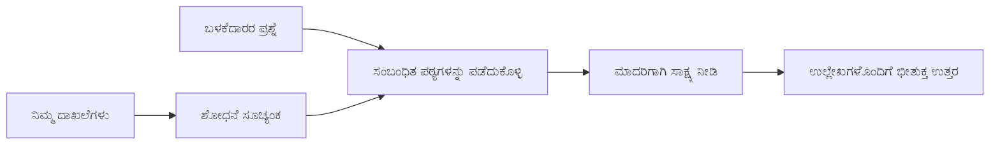

# ನಿಮ್ಮ ಡಾಕ್ಯುಮೆಂಟ್‌ಗಳ ಆಧಾರದ ಮೇಲೆ ಪ್ರಶ್ನೆಗಳಿಗೆ ಉತ್ತರಿಸಲು AI ಅನ್ನು ತರಗತಿ ಮಾಡಲು:
## ಸರಣಿ 1: RAG, Azure ವಿರುದ್ಧ open-source ಪರ್ಯಾಯಗಳು, ಮತ್ತು ಯಾಗೆ ಫೈನ್-ಟ್ಯೂನಿಂಗ್ ಅರ್ಥಮಾಡಿಕೊಳ್ಳಬೇಕು

> 2023 ರಲ್ಲಿ ನನ್ನ Azure AI Search + Azure OpenAI ಡಾಕ್ಯುಮೆಂಟ್ QA ಟ್ಯುಟೋರಿಯಲ್‌ಗಳನ್ನು ಮರುಪರಿಾಶೀಲಿಸುವ 2026 ರ ಸರಣಿಯ ಮೊದಲ ಲೇಖನ.

ಸರಣಿ ನ್ಯಾವಿಗೇಶನ್: [Repository home](../README.md) | ನಂತರ: [Series 2 - Build a Local Open-Source RAG System End to End](./series-2-open-source-rag-end-to-end.md)

## 1. ಪರಿಚಯ - ಹಿಂದಿನ RAG ಟ್ಯುಟೋರಿಯಲ್ ಅನ್ನು ಮರುಪರಿಾಶೀಲಿಸುವುದು

2023 ರಲ್ಲಿ, ನಾನು PDF ಡಾಕ್ಯುಮೆಂಟ್‌ಗಳಿಂದ ಪ್ರಶ್ನೆಗಳಿಗೆ ಉತ್ತರಿಸಲು ChatGPT ಅನ್ನು ತರಗತಿ ಹಾಕುವ ವಿಷಯದ ಕುರಿತು Azure AI Search ಮತ್ತು Azure OpenAI ಬಳಸಿ ಎರಡು ಟ್ಯುಟೋರಿಯಲ್‌ಗಳ ಮೇಲೆ ಕೆಲಸ ಮಾಡಿದೆ. ನಾನು [LangChain ಆವೃತ್ತಿ](https://techcommunity.microsoft.com/blog/educatordeveloperblog/teach-chatgpt-to-answer-questions-using-azure-ai-search--azure-openai-lang-chain/3969713) ಬರೆಯಿತು, ಮತ್ತು ನಾನು ಮತ್ತು [Lee Stott](https://developer.microsoft.com/en-us/advocates/lee-stott), Principal Cloud Advocate Manager ಆಗಿದ್ದ Microsoft ನೊಂದಿಗೆ ಜೊತೆಯಾಗಿ ಸಹಲೇಖಕರು ಆದ [Semantic Kernel ಆವೃತ್ತಿ](https://techcommunity.microsoft.com/blog/educatordeveloperblog/teach-chatgpt-to-answer-questions-using-azure-ai-search--azure-openai-semantic-k/3985395) ಕೂಡ ರೂಪಿಸಿದ್ದು. ಆ ಕಾಲದಲ್ಲಿ "ನಿಮ್ಮ ಡೇಟಾದ ಮೇಲೆ ChatGPT" ಎಂಬ ಕಲ್ಪನೆ ಬಹುತೇಕ ಅಭಿವೃದ್ಧಿ ಕಾರರಿಗೆ ಹೊಸದಾಗಿಯೇ ಅನಿಸುತ್ತಿತ್ತು. ಆ ಟ್ಯುಟೋರಿಯಲ್‌ಗಳು Azure Blob Storage, Azure AI Search, Azure OpenAI, LangChain, Semantic Kernel ಹಾಗೂ FAISS-ಶೈಲಿ ವ್ಯಕ್ಟರ್ ರಿಟ್ರಿಬ್ಯೂಷನ್ ಉಪಯೋಗಿಸಿ PDF ಫೈಲ್‌ಗಳಿಂದ ಪ್ರಶ್ನೆಗಳಿಗೆ ಉತ್ತರಿಸಲು ಉಪಯೋಗಿಸಿದವು.

ಆ ಹಿಂದಿನ ಲೇಖನವು ಸರಳ ಆದರೆ ಪ್ರಮುಖ ವರ್ಕ್ಫ್ಲೋ ಮೇಲೆ ಕೇಂದ್ರೀಕೃತವಿತ್ತು: ಡಾಕ್ಯುಮೆಂಟ್‌ಗಳನ್ನು ಅಪ್ಲೋಡ್ ಮಾಡು, ಅವುಗಳನ್ನು ಇಂಡೆಕ್ಸಿಂಗ್ ಮಾಡು, ಸಂಬಂಧಿಸಿದ ವಿಷಯಗಳನ್ನು ತರಿಸು, ನಂತರ ಆ ವಿಷಯ ಆಧಾರವಾಗಿ ಉತ್ತರಿಸಲು ಮಾದರಿಯನ್ನು ಕೇಳು.

2026 ರಲ್ಲಿಗೆ, RAG ಪರಿಸರವು ಬಹಳಷ್ಟು ವೃದ್ಧಿಯಾಗಿದೆ. Azure AI Search ಈಗ ಆಧುನಿಕ ವ್ಯಕ್ಟರ್ ಮತ್ತು ಸಂಯುಕ್ತ (ಹೈಬ್ರಿಡ್) ರಿಟ್ರಿವಲ್ ಮಾದರಿಗಳನ್ನು ಬೆಂಬಲಿಸುತ್ತದೆ, Azure OpenAI ವ್ಯಾಪಕ Microsoft Foundry Models ಪರಿಸರದ ಭಾಗವಾಗಿದೆ, ಮತ್ತು ಹೊಸ v1 API ಮಾಸಿಕ `api-version` ಬದಲಾವಣೆಗಳನ್ನು ಅಗತ್ಯವಿಲ್ಲದೆ ಸಾಮಾನ್ಯ OpenAI ಕ್ಲೈಂಟ್ ಬಳಸಬಹುದು. ಅದೇ ಸಮಯದಲ್ಲಿ, LangGraph, LlamaIndex, Haystack, Qdrant, Milvus, Weaviate, Chroma, Ollama, ಮತ್ತು vLLM ಮುಂತಾದ open-source ಆಯ್ಕೆಗಳು ನಿಜವಾಗಿಯೂ RAG ವ್ಯವಸ್ಥೆಗಳಿಗೆ ಕಾರ್ಯೋಚಿತ ಆಯ್ಕೆಯಾಗಿವೆ.

ಅದ್ದರಿಂದ ಈ ವಿಷಯವನ್ನು ಮರುಪರಿಾಶೀಲಿಸಲು ನಾನು ಬಯಸಿದೆ. ಪ್ರಶ್ನೆ ಈಗ "ನಾನು RAG ಅನ್ನು ಹೇಗೆ ನಿರ್ಮಿಸಬೇಕು?" ಮಾತ್ರವಲ್ಲ. ಇన్ని ರಚನೆಗಳಿವೆ ಮತ್ತು ಮುಖ್ಯವಾದ ಪ್ರಶ್ನೆ "ನನ್ನ ಪರಿಸ್ಥಿತಿಗೆ ಯಾವ ಆರ್ಕಿಟೆಕ್ಚರ್ ಆಯ್ಕೆ ಮಾಡಬೇಕು?" ಆಗಿದೆ.

ಆದರೆ ಮೂಲ ಸಮಸ್ಯೆ ಬದಲಾಗಿರಲಿಲ್ಲ.

ಒಂದು AI ಮಾದರಿ ಸ್ವಯಂಚಾಲಿತವಾಗಿ ನಿಮ್ಮ ಡಾಕ್ಯುಮೆಂಟ್‌ಗಳನ್ನು ತಿಳಿದಿರುವುದಿಲ್ಲ. ಉಪಯುಕ್ತ ಡಾಕ್ಯುಮೆಂಟ್-ಪ್ರಶ್ನೆ-ಉತ್ತರ ವ್ಯವಸ್ಥೆಯನ್ನು ನಿರ್ಮಿಸಲು, ನೀವು ಇನ್ನೂ ವಿಶ್ವಾಸಾರ್ಹ ರಿಟ್ರಿವಲ್, ಗ್ರೌಂಡಿಂಗ್, ಮೌಲ್ಯಮಾಪನ ಮತ್ತು ಕಾರ್ಯಾಚರಣೆ ವರ್ಕ್ಫ್ಲೋಗಳನ್ನು ಅಗತ್ಯವಿದೆ.

ಈ ಲೇಖನ ಇನ್ನೊಂದು "PDF ಜೊತೆಗೆ ಚಾಟ್" ಅಂತಿಮ ಟ್ಯುಟೋರಿಯಲ್ ಅಲ್ಲ. ನಾನು ಈ ನವೀಕೃತ ಸರಣಿಯನ್ನು ಈಗ ನಿಡಿಯತ್ತಿರುವ ಪ್ರಶ್ನೆಯಿಂದ ಪ್ರಾರಂಭಿಸಲು ಬಯಸುತ್ತೇನೆ: ನೀವು ಯಾವಾಗ ನಿರ್ವಹಿತ Azure ಆರ್ಕಿಟೆಕ್ಚರ್ ಆಯ್ಕೆ ಮಾಡಬೇಕು, open-source RAG ಸ್ಟ್ಯಾಕ್ ಆಯ್ಕೆ ಮಾಡಬೇಕು ಮತ್ತು ಫೈನ್-ಟ್ಯೂನಿಂಗ್ ಯಾವಾಗ ಅರ್ಥವನ್ನು ತರುತ್ತದೆ?

ಇದು ಡಾಕ್ಯುಮೆಂಟ್-ಗ್ರೌಂಡೆಡ್ AI ವ್ಯವಸ್ಥೆಗಳನ್ನು ನಿರ್ಮಿಸುವ ಸರಣಿಯ ಮೊದಲ ಲೇಖನ. ಈ ಮೊದಲ ಭಾಗದಲ್ಲಿ ನಾವು ಆರ್ಕಿಟೆಕ್ಚರ್ ನಿರ್ಣಯಗಳಿಗೆ ಒತ್ತು ನೀಡುತ್ತೇವೆ: RAG ಯಾಕೆ ಮುಖ್ಯ, ಯಾವಾಗ Azure ಆಧರಿತ ನಿರ್ವಹಿತ ಸೇವೆಗಳು ಉಪಯುಕ್ತ, open-source ಪರ್ಯಾಯಗಳು ಯಾವಾಗ ಅರ್ಥವಾಗುತ್ತವೆ, ಮತ್ತು ಫೈನ್-ಟ್ಯೂನಿಂಗ್ ಯಾವಾಗ ಸರಿ ಎಂದು.

ಡಾಕ್ಯೂಮೆಂಟ್ QA ವ್ಯವಸ್ಥೆಗಳನ್ನು ನಿರ್ಮಿಸಿ ಮರುಪರಿಾಶೀಲಿಸಿದ ನಂತರ, ನಾನು ಡೆಮೋದಲ್ಲಿ ಯಾವ ಸಾಧನ ಉತ್ತಮ ತೋರುತ್ತದೆ ಎಂಬುದಕ್ಕಿಂತ, ನಿಜವಾದ ಬಳಕೆದಾರರು, ಬದಲಾಗುವ ಡಾಕ್ಯುಮೆಂಟ್‌ಗಳು, ಅನುಮತಿ, ವೈಫಲ್ಯಗಳು ಮತ್ತು ನಿರ್ವಹಣೆಯನ್ನು ಎದುರಿಸುವ ಆರ್ಕಿಟೆಕ್ಚರ್ ಗೆ ಹೆಚ್ಚು ಆಸಕ್ತಿ ತೋರಿಸುತ್ತಿದ್ದೇನೆ.

## 2. ನಿಮ್ಮ AI ಗೆ ಹುಡುಕಾಟ ವ್ಯವಸ್ಥೆ 왜 ಬೇಕು

ದೊಡ್ಡ ಭಾಷಾ ಮಾದರಿಗಳನ್ನು ವ್ಯಾಪಕ ಸಾರ್ವಜನಿಕ ಮತ್ತು ಪರವಾನಗಿ ಪಡೆದ ಡೇಟಾ ಮೇಲೆ ತರಬೇತಿಗೆ ಒಳಪಡಿಸಲಾಗಿದೆ. ಅವರು ಸಾಮಾನ್ಯ ವಿಷಯಗಳನ್ನು ಬಹಳಷ್ಟು ತಿಳಿದಿದ್ದರೂ, ನಿಮ್ಮ ಖಾಸಗಿ PDF, ಆಂತರಿಕ ನೀತಿ, ಉದ್ಯಮ ಪ್ರಕ್ರಿಯೆಗಳು, ಸಂಶೋಧನಾ ಅರೈಕಲ್ಪನೆಗಳು, ತರಗತಿ ಸಾಮಗ್ರಿಗಳು, ಗ್ರಾಹಕ ಬೆಂಬಲ ಟಿಪ್ಪಣಿಗಳು ಅಥವಾ ಇತ್ತೀಚಿನ ನವೀಕರಣ ಡಾಕ್ಯುಮೆಂಟ್‌ಗಳನ್ನು ಸ್ವಯಂಚಾಲಿತವಾಗಿ ತಿಳಿಯುವುದಿಲ್ಲ.

RAG ಬಗ್ಗೆ ಸರಳವಾಗಿ ಯೋಚಿಸುವ ವಿಧಾನವೇನೆಂದರೆ: ಮಾದರಿ ಪ್ರತಿ ಡಾಕ್ಯುಮೆಂಟ್ ಅನ್ನು ನೆನಪಿನಲ್ಲಿ ಇಡುವುದನ್ನು ನಿರೀಕ್ಷಿಸುವ ಬದಲು, ನಾವು ಅದಕ್ಕೆ ಹುಡುಕಾಟ ವ್ಯವಸ್ಥೆಯನ್ನು ಕೊಡುವುದು. ಬಳಕೆದಾರನು ಪ್ರಶ್ನೆ ಕೇಳಿದಾಗ, ವ್ಯವಸ್ಥೆ ಮೊದಲು ಅತ್ಯಂತ ಸಂಬಂಧಿತ ಮಾಹಿತಿಯ ತುಂಡುಗಳನ್ನು ಕಂಡುಹಿಡಿದಿದೆ, ನಂತರ ಆ ತುಂಡುಗಳನ್ನು ಪ್ರಾಸಂಗಿಕತೆಯಾಗಿ ನೀಡುತ್ತದೆ.

ಇದು ಮುಖ್ಯವಾಗಿದೆ ಏಕೆಂದರೆ ಅನೇಕ ನೈಜ ಜಾಗತಿಕ ಜ್ಞಾನ ಮೂಲಗಳು ಖಾಸಗಿ, ನಿರಂತರ ಬದಲಾವಣೆ ಹೊಂದಿದ, ಅನುಮತಿಗುಂಡಾಗಿರುವ, ಬಹು- ವ್ಯವಸ್ಥೆಗಳಲ್ಲಿ ಸಂಗ್ರಹಿತ, ವಿವಿಧ ಸ್ವರೂಪಗಳಲ್ಲಿ ಬರೆಯಲ್ಪಟ್ಟ, ಮತ್ತು ತುಂಬಾ ದೊಡ್ಡದಾಗಿ ಇದ್ದು ನೇರವಾಗಿ ಪ್ರಾಂಪ್ಟ್‌ಗೆ ನಕಲಿಸುವುದಕ್ಕೆ ಅತಿಯಾಗಿ.

ಉದಾಹರಣೆಗೆ, ಒಂದು ಶಾಲೆ, ಕಂಪನಿ, ಅಥವಾ ಸಂಶೋಧನಾ ತಂಡದ 10,000 ಆಂತರಿಕ ಡಾಕ್ಯುಮೆಂಟ್‌ಗಳಿದ್ದರೆ, ಸರಿಯಾದ ಭಾಗಗಳನ್ನು ಸರಿಯಾದ ಸಮಯದಲ್ಲಿ ಪಡೆಯದೇ ಮಾದರಿ ಆ ಡಾಕ್ಯುಮೆಂಟ್‌ಗಳಿಂದ ವಿಶ್ವಾಸಾರ್ಹವಾಗಿ ಉತ್ತರಿಸಲು ಸಾಧ್ಯವಿಲ್ಲ.

ಇದು ಸಹಜವಾಗಿ ಸಾಮಾನ್ಯ ಪ್ರಶ್ನೆಗೆ ದಾರಿ ಮಾಡಿಸುತ್ತವೆ:

ಮಾದರಿಯನ್ನು ಫೈನ್-ಟ್ಯೂನ್ ಮಾಡುವುದೇ ಏಕೆ ಅಲ್ಲ?

ಫೈನ್-ಟ್ಯೂನಿಂಗ್ ಉಪಯುಕ್ತವಾಗಬಹುದು, ಆದರೆ ಸಾಮಾನ್ಯವಾಗಿ ಡಾಕ್ಯುಮೆಂಟ್ ಜ್ಞಾನಕ್ಕೆ ಮೊದಲ ಉಪಕರಣವಾಗಿ ಸರಿಯಾದದಾಗಿರುವುದಿಲ್ಲ. ಜ್ಞಾನ ಹೆಚ್ಚು ಬದಲಾಗುತ್ತಿದ್ದರೆ, ಉಲ್ಲೇಖಗಳು ಮುಖ್ಯವಾಗಿದ್ದರೆ, ಅಥವಾ ಪ್ರವೇಶ ನಿಯಮಗಳು ಪ್ರಮುಖವಾದರೆ, RAG ಸಾಮಾನ್ಯವಾಗಿ ಉತ್ತಮ ಪ್ರಾರಂಭದ ಬಿಂದುವಾಗಿರುತ್ತದೆ. ಫೈನ್-ಟ್ಯೂನಿಂಗ್ ವರ್ತನೆ, ಶೈಲಿ, output ಸ್ವರೂಪ ಮತ್ತು ಕಾರ್ಯ ಮಾದರಿಗಳನ್ನು ಕಲಿಸಲು ಉತ್ತಮವಾಗಿದೆ.

## 3. RAG ಆರ್ಕಿಟೆಕ್ಚರ್ ಪ್ರಾಯೋಗಿಕವಾಗಿ

ನೀವು ಶಾಲೆಗೆ AI ಸಹಾಯಕರನ್ನು ನಿರ್ಮಿಸುತ್ತಿದ್ದೀರಿ ಎಂದು ಕಲ್ಪಿಸಿ. ಸಹಾಯಕನು ನೀತಿಪಿಡಿ, کورس ಮಾರ್ಗದರ್ಶಿ, ಆಂತರಿಕ FAQ ಪುಟಗಳು ಮತ್ತು ಇತ್ತೀಚಿನ ನವೀಕರಣ ಘೋಷಣೆಗಳಿಂದ ಪ್ರಶ್ನೆಗಳಿಗೆ ಉತ್ತರಿಸಬೇಕಾಗುತ್ತದೆ.

ಒಂದು ವಿದ್ಯಾರ್ಥಿ ಕೇಳಿದರೆ, "ನಾನು ನನ್ನ ಅಂತಿಮ ಹುದ್ದೆಗಾಗಿ ಜನರೇಟಿವ್ AI ಅನ್ನು ಉಪಯೋಗಿಸಬಹುದುವೇ?", ವ್ಯವಸ್ಥೆ ಮಾದರಿಯ ಸಾಮಾನ್ಯ ನೆನಪಿನಿಂದ ಉತ್ತರಿಸಬಾರದು. ಮೊದಲು ಸಂಬಂಧಿತ ಶಾಲೆಯ ನೀತಿ ಕಂಡುಹಿಡಿಯಬೇಕು, AI ಬಳಕೆಯ ಕುರಿತು ವಿಭಾಗವನ್ನು ಪಡೆಯಬೇಕು, ಮತ್ತು ಅದನ್ನು ಆಧಾರವಾಗಿ ಸೇವಿಸಿದ ಪ್ರಮಾಣದಿಂದ ಮಾದರಿಯನ್ನು ಕೇಳಬೇಕು.

ಇದೇ RAG ಅನ್ನು ಪ್ರಾಯೋಗಿಕವಾಗಿ.

ಒಂದು ಮೇಲ್ಸೂಚನೆಯ ಮಟ್ಟದಲ್ಲಿ, ನೀವು ಪ್ರಕ್ರಿಯೆಯನ್ನು ಈ ರೀತಿ ಯೋಚಿಸಬಹುದು:

ವಿವರಗಳು ಹೆಚ್ಚು ಸಂವಿದಾನದಾದ ಜಟಿಲವಾಗಬಹುದು, ಆದರೆ ಮೂಲ ಭಾವನೆ ಸರಳ: ಮಾದರಿ ಒಬ್ಬರಾಗಿ ಉತ್ತರಿಸುವುದು ಅಲ್ಲ. ಅದು ರಿಟ್ರೀವ್ಡ್ ದಾಖಲೆಗಳಿಂದ ಉತ್ತರ ಕೊಡುತ್ತದೆ.

ಮೊದಲು, ಡಾಕ್ಯುಮೆಂಟ್‌ಗಳನ್ನು Azure Blob Storage, SharePoint, GitHub ಅಥವಾ ಆಂತರಿಕ CMS ಗಳಂತಹ ಸಂಗ್ರಹಣಾ ವ್ಯವಸ್ಥೆಗಳಿಂದ ಪಡೆದುಕೊಳ್ಳಲಾಗುತ್ತದೆ. ನಂತರ ವ್ಯವಸ್ಥೆ ಅವುಗಳನ್ನು ಪಟ್ಟಿ ಸುತ್ತಳಿಸುವಂತೆ, ಪೇಜ್ ನಂಬರ್, ಶೀರ್ಷಿಕೆ, ಪಟ್ಟಿಕೆಗಳು, ವಿಭಾಗಗಳು, ಮತ್ತು ಮೂಲ ಸ್ಥಳಗಳನ್ನು ಉಳಿಸಿಕೊಂಡು ಪಠ್ಯಕ್ಕೆ ಪರಿವರ್ತಿಸುತ್ತದೆ.

ಮುಂದೆ, ವಿಷಯವನ್ನು ತುಂಡುಗಳಾಗಿ ವಿಭಜಿಸಲಾಗುತ್ತದೆ. ಈ ಹಂತ ಸರಳವಾಗಿ ಕೇಳಿದರೂ, ಇದು ವ್ಯವಸ್ಥೆಯ ಅತ್ಯಂತ ಪ್ರಮುಖ ಭಾಗವಾಗಿದೆ. ತುಂಡು ತುಂಬಾ ಚಿಕ್ಕಿದ್ದರೆ ಸುತ್ತಲೂ ಇರುವ ಪ್ರಾಸಂಗಿಕತೆ ಕಳೆದುಕೊಳ್ಳಬಹುದು. ತುಂಡು ತುಂಬಾ ದೊಡ್ಡದಾದರೆ, ಅನ್ವಯಿಸದ ಮಾಹಿತಿಯನ್ನು ಸೇರಿಸುವ ಸಾಧ್ಯತೆ ಇದೆ ಮತ್ತು ರಿಟ್ರಿವಲ್ ನಿಖರತೆಯನ್ನು ಕೀಳು ಮಾಡಬಹುದು.

ತುಂಡುಗಳ ನಂತರ, ವ್ಯವಸ್ಥೆ ಎಂಬೆಡ್ಡಿಂಗ್‌ಗಳನ್ನು ರಚಿಸಿ ಅವುಗಳನ್ನು ಮೂಲ ಪಠ್ಯ ಮತ್ತು ಮೆಟಾಡೇಟಾಗಳ ಜೊತೆಗೆ ಹುಡುಕಬಹುದಾದ ಅನುಕ್ರಮದಲ್ಲಿ ಸಂರಕ್ಷಿಸುತ್ತದೆ, ಉದಾಹರಣೆಗೆ ಫೈಲ್ ಹೆಸರು, ಪೇಜ್ ಸಂಖ್ಯೆ, ಅನುಮತಿಗಳು, ಡಾಕ್ಯುಮೆಂಟ್ ಆವೃತ್ತಿ ಮತ್ತು ಮೂಲ URL.

ಬಳಕೆದಾರನು ಪ್ರಶ್ನೆ ಕೇಳಿದಾಗ, ವ್ಯವಸ್ಥೆ ಕೀವರ್ಡ್ ಹುಡುಕಾಟ, ವ್ಯಕ್ಟರ್ ಹುಡುಕಾಟ ಅಥವಾ ಸಂಯುಕ್ತ ಹುಡುಕಾಟ ಬಳಸಿ ಅಭ್ಯರ್ಥಿ ತುಂಡುಗಳನ್ನು ಪಡೆಯುತ್ತದೆ. ರೀಟ್ಯಾಂಕರ್ ಆ ತುಂಡುಗಳ ಕ್ರಮವನ್ನು ಪುನಃ ನಿಗದಿಪಡಿಸುತ್ತಿದ್ದು ಅತ್ಯಂತ ಉಪಯುಕ್ತವಾದ ಪ್ರamaanವನ್ನು ಮೇಲ್ಭಾಗದಲ್ಲಿ ಇರಿಸುತ್ತದೆ.

ಅಂತಿಮವಾಗಿ, ಮಾದರಿ ಪ್ರಶ್ನೆ ಮತ್ತು ಪಡೆಯಲಾದ ಪ್ರಮಾಣವನ್ನು ಪಡೆಯುತ್ತದೆ. ಉತ್ತರವು ಆ ಪ್ರಮಾಣದಲ್ಲಿ ನೆಲೆಸಿರಬೇಕು ಮತ್ತು ಬಳಕೆದಾರರು ಮೂಲವನ್ನು ಪರಿಶೀಲಿಸಲು ಉಲ್ಲೇಖಗಳನ್ನು ನೀಡಬೇಕು.

ಮುಖ್ಯದಾಗಿ RAG ಎಂದರೆ "PDF ಗಳನ್ನು ವ್ಯಕ್ಟರ್ ಡೇಟಾಬೇಸ್ಗೆ ಹಾಕುವುದು" ಮಾತ್ರವಲ್ಲ. ಉತ್ತರದ ಗುಣಮಟ್ಟವು ಪೂರ್ಣ ವರ್ಕ್ಫ್ಲೋ ಮೇಲೆ ಅವಲಂಬಿತವಾಗಿದೆ: ಪಾರ್ಸಿಂಗ್, ತುಂಡುಗಳ ವಿಭಜನೆ, ಹುಡುಕಾಟ, ಪುನಃ ಶ್ರೇಣೀಕರಣ, ಪ್ರಾಂಪ್ಟಿಂಗ್, ಉಲ್ಲೇಖ ಮತ್ತು ಮೌಲ್ಯಮಾಪನ.

ಆದ್ದರಿಂದ ಡಾಕ್ಯುಮೆಂಟ್ ರಚನೆಯು ಮಹತ್ತರ. PDF ನಲ್ಲಿ ಶೀರ್ಷಿಕೆ, ಪಟ್ಟಿಕೆ, ಫುಟ್‌ನೋಟ್ ಅಥವಾ ಪುಟದ ಗಡಿಯಾರವು ವಿಧಾನದ ಅರ್ಥವನ್ನು ಬದಲಾಯಿಸಬಹುದು. Azure ನಲ್ಲಿ, ಡಾಕ್ಯುಮೆಂಟ್ ಲೇಔಟ್ ಕೌಶಲ್ಯವು Azure ಡಾಕ್ಯುಮೆಂಟ್ ಇಂಟೆಲಿಜೆನ್ಸ್ ಲೇಔಟ್ ಸಾಮರ್ಥ್ಯಗಳನ್ನು ಬಳಸಿಕೊಂಡು ರಚನೆ-ಜಾಗರೂಕ ಉತ್ಪನ್ನವನ್ನು ನೀಡುತ್ತದೆ, ಇದು RAG ವ್ಯವಸ್ಥೆಗಳಿಗಾಗಿ ತುಂಡುಗಳ ವಿಭಜನೆ ಮತ್ತು ಹುಡುಕಾಟ ಗುಣಮಟ್ಟವನ್ನು ಸುಧಾರಿಸಬಹುದು.

## 4. 2023ರಿಂದ ಏನು ಬದಲಾಗಿದೆ?

2023 ರ ಟ್ಯುಟೋರಿಯಲ್ ಅದರ ಕಾಲದಲ್ಲಿ ಉತ್ತಮ ಆಮಂತ್ರಣವಿತ್ತು:

- Azure Blob Storage PDF ಫೈಲ್‌ಗಳನ್ನು ಸಂಗ್ರಹಿಸಿತು.
- Azure AI Search ವಿಷಯವನ್ನು ಇಂಡೆಕ್ಸಿಂಗ್ ಮಾಡಿತು.
- LangChain ರಿಟ್ರಿವಲ್ ಅನ್ನು Azure OpenAI ಗೆ ಸಂಪರ್ಕಿಸಿತು.
- FAISS ಸರಳ ಸ್ಥಳೀಯ ವ್ಯಕ್ಟರ್ ಬುಕ್ ಸ್ಥಾಪಿತವಾಗಿತ್ತು.
- ಉದಾಹರಣೆ `gpt-35-turbo` ಮತ್ತು `text-embedding-ada-002` ಬಳಸಿತು.

2026 ರಲ್ಲಿ, ಆಧುನಿಕ ಆವೃತ್ತಿ ಕೆಲ ಬದಲಾವಣೆಗಳನ್ನು ಪ್ರತಿಬಿಂಬಿಸಬೇಕು.

ಮೊದಲು, ರಿಟ್ರಿವಲ್ ಉತ್ತೇಜಿತವಾಗಿದೆ. 2023 ರಲ್ಲಿ, ಬಹಳ ಡೆಮೋಗಳು ಸರಳ ವ್ಯಕ್ಟರ್ ಸಾದೃಶ್ಯ ಹುಡುಕಾಟವನ್ನು ಉಪಯೋಗಿಸಿದವು. ಇಂದು, ಸಂಯುಕ್ತ ರಿಟ್ರಿವಲ್ ಗಂಭೀರ ಡಾಕ್ಯುಮೆಂಟ್ QA ಗೆ ಸಾಮಾನ್ಯ ಆರಂಭವಾಗಿದೆ. Azure AI Search ಒಂದು ವಿನಂತಿಯಲ್ಲಿ ಕೀವರ್ಡ್ ಮತ್ತು ವ್ಯಕ್ಟರ್ ಪ್ರಶ್ನೆಗಳನ್ನು ಸಂಯೋಜಿಸಿ Reciprocal Rank Fusion ಉಪಯೋಗಿಸಿ ಫಲಿತಾಂಶಗಳನ್ನು ಮಿಷ್ರಣ ಮಾಡುತ್ತದೆ. Semantic ranker ನಂತರ ಸಂಪೂರ್ಣ ಪಠ್ಯ, ವ್ಯಕ್ಟರ್ ಮತ್ತು ಸಂಯುಕ್ತ ಫಲಿತಾಂಶಗಳ ಪಠ್ಯ ಭಾಗವನ್ನು ಪುನಃ ಶ್ರೇಣೀಕರಿಸಬಹುದು.

ಎರಡನೇದು, ಇಂಜೆಕ್ಷನ್ ಹೆಚ್ಚು ಸಂವಿದಾನಶೀಲವಾಗಿದೆ. ಪ್ರತಿಯೊಂದು ಡಾಕ್ಯುಮೆಂಟ್ ಅನ್ನು ಕೈಯಿಂದ ವಿಭಜಿಸಲು ಬದಲು, Azure AI Search ಗುಂಪುಗಳ ವಿಭಜನೆ, ಎಂಬೆಡ್ಡಿಂಗ್, ಮತ್ತು ಪ್ರಶ್ನಾ ಸಮಯವೆಂಬೆಡ್ಡಿಂಗ್‌ಗಾಗಿ ಪೂರ್ತಿಯಾಗಿ ಸಮಗ್ರ ವ್ಯಕ್ಟರೀಕರಣವನ್ನು ಬೆಂಬಲಿಸುತ್ತದೆ. PDF ಗಳು ಮತ್ತು ಡಾಕ್ಯುಮೆಂಟ್-ಭರಿತ ಸರಬರಾಜುಗಳಿಗೆ, ಡಾಕ್ಯುಮೆಂಟ್ ಲೇಔಟ್ ಕೌಶಲ್ಯ ನೀರ್ದಿಷ್ಟ ಅಳತೆಯ ತುಂಡುಗಳಿಗಿಂತ ಹೆಚ್ಚು ರಚನೆ ಉಳಿಸುವ ಸಾಮರ್ಥ್ಯ ಹೊಂದಿದೆ.

ಮೂರನೆಯದು, ಸಂಘಟನೆಯು ಹೆಚ್ಚು ಪ್ರಮುಖವಾಗಿದೆ. ಕಠಿಣ ಭಾಗ LLM API ಕರೆ ಅಲ್ಲ. ಕಠಿಣ ಭಾಗ ವೈಫಲ್ಯ, ಮರುಪ್ರಯತ್ನ, ಹಳೇ ರಿಟ್ರಿವಲ್, ತುಂಡು ಗುಣಮಟ್ಟ, ದೀರ್ಘಕಾಲ ಸಾಧನೆ, ಮಾನವ ವಿಮರ್ಶೆ, ಮತ್ತು ವ್ಯಾಪಕ ಮೌಲ್ಯಮಾಪನವನ್ನು ನಿರ್ವಹಿಸುವುದು. ಇಲ್ಲಿ LangGraph, LlamaIndex ವರ್ಕ್ಫ್ಲೋಗಳು, Haystack ಪೈಪ್ಲೈನ್ಗಳು ಮತ್ತು ವೇದಿಕೆ-ಮಟ್ಟದ ಮೌಲ್ಯಮಾಪನ ಮತ್ತು ಗಮನಾರ್ಹತೆ ಉಪಕರಣಗಳು ಒಂದೇ ಸರಳ ಸರಣಿಗಿಂತ ಹೆಚ್ಚು ಪ್ರಾಸಂಗಿಕವಾಗಿರುತ್ತವೆ.

ನಾಲ್ಕನೇದು, ಮೌಲ್ಯಮಾಪನ ಈಗ ಐಚ್ಛಿಕವಲ್ಲ. ಒಂದೇ ಪ್ರಶ್ನೆ ಇದ್ದರೆ ಡೆಮೋ ಅದ್ಭುತವಾಗಿ ಕಾಣಬಹುದು. ಉತ್ಪಾದನಾ ವ್ಯವಸ್ಥೆಗೆ ಪರೀಕ್ಷಾ ಸೆಟ್‌ಗಳು, ರೆಗ್ರೆಶನ್ ಪರಿಶೀಲನೆಗಳು, ರಿಟ್ರಿಯೆ್ವಲ್ ಮ್ಯಾಟ್ರಿಕ್ಸ್, ನೆಲೆಯ ಪರಿಶೀಲನೆಗಳು ಮತ್ತು ನಿಗಾದಾರಣೆ ಅಗತ್ಯ. ಮೌಲ್ಯಮಾಪನವಿಲ್ಲದೆ, ವ್ಯವಸ್ಥೆ ಸುಧಾರಿಸುತ್ತಿದೆಯೆ ಅಥವಾ ಬದಲಾಯಿಸುತ್ತಿದೆಯೆ ಎಂದು ತಿಳಿಯುವುದು ಕಷ್ಟ.

## 5. Azure ಮತ್ತು open-source RAG ಸ್ಟ್ಯಾಕ್‌ಗಳ ಮಧ್ಯೆ ಆಯ್ಕೆ

ನನಗೆ ಉಪಯುಕ್ತ ಪ್ರಶ್ನೆ "Azure	open source ಗಿಂತ ಉತ್ತಮವೇ?" ಅಥವಾ "open source Azure ಗಿಂತ ಉತ್ತಮವೇ?" ಅಲ್ಲ.

ಉಪಯುಕ್ತ ಪ್ರಶ್ನೆ: ನೀವು ಯಾವ ರೀತಿಯ ವ್ಯವಸ್ಥೆಯನ್ನು ನಿರ್ಮಿಸುತ್ತಿದ್ದೀರಿ, ಯಾರು ಅದನ್ನು ಕಾರ್ಯಗತಗೊಳಿಸುವರು, ನಿಮ್ಮ ನಿಯಂತ್ರಣಗಳಾವು, ಮತ್ತು ಯಾವ ವೈಫಲ್ಯ ಮಂತ್ರಣೀಯವಲ್ಲ?

ನಾನು ಡಾಕ್ಯುಮೆಂಟ್ QA ಉದಾಹರಣೆಗಳನ್ನು ನಿರ್ಮಿಸಲು ಆರಂಭಿಸಿದಾಗ, ನಾನು ಹೆಚ್ಚಿನ ವಿವರವಾಗಿ ರಿಟ್ರಿವಲ್ ಕಾರ್ಯನಿರ್ವಹಿಸುತ್ತಿದೆಯೇ ಎಂದು ಮಾತ್ರ ಕುತೂಹಲಪಟ್ಟಿದ್ದೆ. ನಾನು PDF ಗಳನ್ನು ಅಪ್ಲೋಡ್ ಮಾಡಿ, ಹುಡುಕಿ, ಉತ್ತರ ಉತ್ಪಾದನೆ ಮಾಡಬಹುದುವೇ ಎಂದು ನೋಡುತ್ತಿದ್ದೆ. ಅದು ತಕ್ಕ ಪ್ರಾರಂಭವಿತ್ತು.

ಹೆಚ್ಚು ನಿಜವಾದ AI ವರ್ಕ್ಫ್ಲೋಗಳನ್ನು ಹಿಂದಿನ ಬಿಂದುವಿಗೆ ತಲುಪಿದ ಮೇಲೆ, ನನ್ನ ಮೌಲ್ಯಮಾಪನ ಬದಲಾಗಿದೆ. ಈಗ, ನಾನು RAG ಸ್ಟ್ಯಾಕ್ ಆಯ್ಕೆಮಾಡುವ ಮೊದಲು ನಾಲ್ಕು ವಿಷಯಗಳನ್ನು ನೋಡುತ್ತೇನೆ:

- ಗುರುತು ಮತ್ತು ಅನುಮತಿಗಳು
- ರಿಟ್ರಿವಲ್ ಗುಣಮಟ್ಟ
- ವರ್ಕ್ಫ್ಲೋ ನಂಬಿಕೆಹಾಕಿಕೆ
- ಕಾರ್ಯಾಚರಣೆ ಮಾಲೀಕತ್ವ

ಆ ನಾಲ್ಕು ಕ್ಷೇತ್ರಗಳು ಮಾದರಿ ಬೆಂಚ್ಮಾರ್ಕ್ ಒಂದೇ ಹೋಲಿಕೆಗೆ ಹೋಲಿಸಿದರೆ ಹೆಚ್ಚಿನ ಮಾಹಿತಿಯನ್ನು ನೀಡುತ್ತವೆ.

ಉದ್ಯಮ ಏಕೀಕರಣವು ಕಠಿಣ ಭಾಗವಾಗಿದ್ದರೆ, Azure ಆಧಾರಿತ ಆರ್ಕಿಟೆಕ್ಚರ್ ಸಾಮಾನ್ಯವಾಗಿ ಅರ್ಥವಾಗುತ್ತದೆ. ಎಂಟರ್ಪ್ರೈಸ್ ತಂಡವು Microsoft Entra ID, Microsoft 365, Azure Storage, ಖಾಸಗಿ ನೆಟ್ವರ್ಕಿಂಗ್, RBAC ಮತ್ತು Azure ನಿಗಾದಾರಣೆಯನ್ನು ಅವಲಂಬಿಸಿರುವುದಾದರೆ, Azure AI Search ಮತ್ತು Azure OpenAI ಕಾರ್ಯಾಚರಣೆ ಸಾಂಕ್ರಮಿಕತೆಯನ್ನು ಕಡಿಮೆ ಮಾಡಬಹುದು. ಆ ಪರಿಸರದಲ್ಲಿ Azure ಒಬ್ಬ ಮಾದರಿ API ನಷ್ಟ ಅಲ್ಲ. ಮೌಲ್ಯವು ಸುತ್ತಲೂ ಇರುವ ವ್ಯವಸ್ಥೆಯಲ್ಲಿದೆ: ಗುರುತು, ಆಡಳಿತ, ನಿರ್ವಹಿತ ಹುಡುಕಾಟ, ಭದ್ರತೆ ಏಕೀಕರಣ, ಬೆಂಬಲ ಮತ್ತು ಪರಿದೃಷ್ಟ್ಾಯ ಕಾರ್ಯಪದ್ಧತಿ.

ಸ್ಥಳೀಯ ನಿರ್ಣಯ ಅನ್ವಯವಾಗಿ open-source ಆರ್ಕಿಟೆಕ್ಚರ್ ಸೂಕ್ತವಾಗಿರುತ್ತದೆ. ತಂಡ ಸ್ಥಳೀಯ ನಿರ್ಣಯ, ಕ್ಲೌಡ್ ಪೋರ್ಟಬಿಲಿಟಿ, ಕಸ್ಟಮ್ ರಿಟ್ರಿಯೆವಲ್ ಪೈಪ್‌ಲೈನ್, ಪರಿಣತ ಪುನಃ ಶ್ರೇಣೀಕರಣ ಅಥವಾ ವ್ಯಕ್ಟರ್ ಡೇಟಾಬೇಸ್ ಮತ್ತು ಮಾದರಿ ಸೇವಾ ಪದರದ ನೇರ ನಿಯಂತ್ರಣ ಬೇಕಾದರೆ open-source ಸ್ಟ್ಯಾಕ್ ಉತ್ತಮ ಹೊಂದಾಣಿಕೆಯಾಗಬಹುದು. ಫಲವಾಗಿ, ತಂಡ ಹೆಚ್ಚು ನಂಬಿಕೆ, ಬ್ಯಾಕಪ್, ವಿಸ್ತರಣೆ, ವಿಳಂಬ, ವಲಸೆ, ನಿಗಾದಾರಣೆ ಮತ್ತು ಭದ್ರತೆ ಕೆಲಸಗಳನ್ನು ಸ್ವೀಕರಿಸುತ್ತದೆ.

ವಾಸ್ತವದಲ್ಲಿ, ಅನೇಕ ಉತ್ಪಾದನಾ AI ವ್ಯವಸ್ಥೆಗಳು ಖಾಲಿ ಕ್ಲೌಡ್-ನ್ಯಾಟಿವ್ ಅಥವಾ ಎಇಕೆ open-source ಅಲ್ಲ. ಅವು ಅಪರೇಕ್ಷಣೀಯ ಸರಳತೆ, ಪೋರ್ಟಬಿಲಿಟಿ, ಆಡಳಿತ ಮತ್ತು ಎಂಜಿನಿಯರಿಂಗ್ ಬಲಕ್ಕೂಮುಖ್ಯತೆಯ ಜೊತೆಯಲ್ಲಿ ಸಮತೋಲನ ಹೊಂದಿರುವ ಸಂಯುಕ್ತ ವ್ಯವಸ್ಥೆಗಳಾಗಿವೆ.

ಉದಾಹರಣೆಗೆ, ನಾನು Azure OpenAI ಮಾದರಿ ಪ್ರವೇಶಕ್ಕೆ, LangGraph ವರ್ಕ್ಫ್ಲೋ ಸಂಘಟಿಸಲು, Azure ಡಿಪ್ಲಾಯ್‌ಮೆಂಟ್‌ಗೆ ಮತ್ತು open-source ವ್ಯಕ್ಟರ್ ಡೇಟಾಬೇಸ್ ನಿರ್ದಿಷ್ಟ ರಿಟ್ರಿಕ್ವೈರ್ಮೆಂಟ್‌ಗೆ ಬಳಸುತ್ತಿರುವ ವ್ಯವಸ್ಥೆಯನ್ನು ನೋಡಿದರೆ ಆಶ್ಚರ್ಯಪಡುವುದಿಲ್ಲ. ಆದುದು ಆರ್ಕಿಟೆಕ್ಚರ್ ಅಸಂಗತತೆ ಅಲ್ಲ. ಪ್ರತಿ ಭಾಗಕ್ಕೆ ಸರಿಯಾದ ನಿರ್ವಹಿತ ಸೇವೆ ಮತ್ತು ಎಂಜಿನಿಯರಿಂಗ್ ನಿಯಂತ್ರಣವನ್ನು ಆಯ್ಕೆಮಾಡುವ ಪ್ರಕ್ರೀಯೆ.

ನನಗೆ ಸಂಯುಕ್ತ ಆರ್ಕಿಟೆಕ್ಚರ್ ಇಷ್ಟ, ನಿರ್ವಹಿತ ವೇದಿಕೆ ಮಹತ್ವದ ಉದ್ಯಮ ಸಮಸ್ಯೆಗಳನ್ನು ಪರಿಹರಿಸುವಾಗ, open-source ಘಟಕಗಳು ತಂಡಕ್ಕೆ ನಿಜವಾದ ಅಗತ್ಯ ಇರುವ ಲವಚಿಕತ್ವವನ್ನು ನೀಡುತ್ತವೆ.

## 6. ಪ್ರಾಯೋಗಿಕ ನಿರ್ಣಯ ಮಾರ್ಗದರ್ಶನ

ಈ ಕೆಳಗಿನ ನಿರ್ಣಯs ಪಟ್ಟಿ ನಾನು RAG ಸ್ಟ್ಯಾಕ್ ಮಾರ್ಗದರ್ಶನಕ್ಕಾಗಿ ತಂಡದೊಡನೆ ಬಳಸಿಕೊಳ್ಳುತ್ತೇನೆ:

| ನಿರ್ಣಯ ಕ್ಷೇತ್ರ | Azure ನಿರ್ವಹಿತ ಸ್ಟ್ಯಾಕ್ ಹೆಚ್ಚು ಬಲವಾದಾಗ... | open-source ಸ್ಟ್ಯಾಕ್ ಹೆಚ್ಚು ಬಲವಾದಾಗ... |
| --- | --- | --- |
| ಗುರುತು ಮತ್ತು ಪ್ರವೇಶ | Entra ID, RBAC, ನಿರ್ವಹಿತ ಗುರುತು ಮತ್ತು ಉದ್ಯಮ ಅನುಮತಿಗಳು ಕೇಂದ್ರವಾಗಿರುವಾಗ | ಕಸ್ಟಮ್ ಪ್ರಾಮಾಣೀಕರಣ, Microsoft ಅಲ್ಲದ ಗುರುತು ಅಥವಾ ಅಪ್ಲಿಕೇಶನ್-ನಿರ್ದಿಷ್ಟ ಪ್ರವೇಶ ನಿಯಮಗಳು ಮುಗಿಯುವಾಗ |
| ಕಾರ್ಯಾಚರಣೆ | ತಂಡ ನಿರ್ವಹಿತ ಮೂಲಸೌಕರ್ಯ, ಬೆಂಬಲ, SLA ಗಳು ಮತ್ತು ಸುಲಭ ಇನ್ಬಾರ್ಡಿಂಗ್ ಬಯಸುವಾಗ | ತಂಡ ವ್ಯಕ್ಟರ್ ಡೇಟಾಬೇಸ್‌ಗಳು, ಮಾದರಿ ಸೇವೆ, ಬ್ಯಾಕಪ್ ಮತ್ತು ವಿಸ್ತರಣೆಯನ್ನು ಕಾರ್ಯಾಚರಣೆ ಮಾಡಬಹುದಾದಾಗ |
| ರಿಟ್ರಿಯೆವಲ್ | ಸಂಯುಕ್ತ ಹುಡುಕಾಟ, ಸೈಮ್ಯಾಂಟಿಕ್ ರ್ಯಾಂಕಿಂಗ್, ಫಿಲ್ಟರ್‌ಗಳು ಮತ್ತು ಮೆಟಾಡೇಟಾ ಹುಡುಕಾಟ ಹೆಚ್ಚಿನ ಅಗತ್ಯಗಳನ್ನು ಆವರಿಸುವಾಗ | ತಂಡಕ್ಕೆ ಕಸ್ಟಮ್ ರಿಟ್ರಿಯೆವಲ್, ಪರಿಣತ ಪುನಃಶ್ರೇಣೀಕರಣ ಅಥವಾ ಪ್ರಯೋಗಾತ್ಮಕ ಇಂಡೆಕ್ಸಿಂಗ್ ಬೇಕಾದಾಗ |
| ಪೋರ್ಟಬಿಲಿಟಿ | Azure ಪರಿಸರ ಹೊಂದಿಕೆ ಅನುಕೂಲಕರ ಅಥವಾ ಇಷ್ಟವಾದಾಗ | ಕ್ಲೌಡ್ ಲಾಕ್-ಇನ್ ತಡೆಯುವುದು ಕಠಿಣ ಅವಶ್ಯಕತೆಯಾಗಿದ್ದಾಗ |
| ನಿರ್ಣಯ | Azure OpenAI ಆಡಳಿತ, ನೆಟ್ವರ್ಕಿಂಗ್ ಮತ್ತು ಉದ್ಯಮ ನಿಯಂತ್ರಣ ಪ್ರಮುಖವಾಗಿದ್ದಾಗ | ಸ್ಥಳೀಯ ನಿರ್ಣಯ, ಕಸ್ಟಮ್ ಮಾದರಿಗಳು ಅಥವಾ ಸ್ವ-ಹೋಸ್ಟು ಮಾಡಿದ ಸೇವೆ ಅಗತ್ಯವಿದ್ದಾಗ |
| ವೆಚ್ಚ | ಎಂಜಿನಿಯರಿಂಗ್ ಮತ್ತು ಕಾರ್ಯಾಚರಣೆ ಪ್ರಯತ್ನ ಕಡಿಮೆ ಮಾಡುವುದು ಮೂಲಸೌಕರ್ಯ ಟ್ಯೂನಿಂಗ್ ಮುಂಚಿತವಾಗಿದ್ದಾಗ | ವ್ಯಾಸಂಗ ದೊಡ್ಡದಾಗಿದ್ದು ನಿಖರ ಮೂಲಸೌಕರ್ಯ ಸಮಸ್ಯೆ ಪರಿಹಾರಕ್ಕೆ ನ್ಯಾಯತೀರ್ಪಾಗಿದ್ದಾಗ |
| ಪ್ರಯೋಗ | ಸ್ಥಿರತೆ ಮತ್ತು ಉದ್ಯಮ ಏಕೀಕರಣ ನಿಯತವಾಗಿ ಬದಲಿಸುವ ಭಾಗಕ್ಕಿಂತ ಹೆಚ್ಚಿನ ಮಹತ್ವ ನೀಡುವಾಗ | ತಂಡ ಏಜೆಂಟ್ಗಳು, ಸಾಧನಗಳು, ಸ್ಮೃತಿ ಮತ್ತು ರಿಟ್ರಿಯೆವಲ್ ವರ್ಕ್ಫ್ಲೋಗಳನ್ನು ವೇಗವಾಗಿ ಪುನರಾವರ್ತಿಸಲು ಬಯಸಿದಾಗ |

ನನ್ನ ಸರಳ ನಿಯಮ:

- ಉದ್ಯಮ ಏಕೀಕರಣ, ಭದ್ರತೆ ಮತ್ತು ಕಾರ್ಯಾಚರಣೆ ಸರಳತೆ ಮುಖ್ಯ ಭಯವಿದ್ದರೆ Azure ಮೂಲಕ ಪ್ರಾರಂಭಿಸಿ.
- ಪೋರ್ಟಬಿಲಿಟಿ, ಕಸ್ಟಮೈಜೆಷನ್ ಅಥವಾ ಸ್ಥಳೀಯ ನಿಯಂತ್ರಣ ಮುಖ್ಯ ಭಯವಿದ್ದರೆ open-source ಮೂಲಕ ಪ್ರಾರಂಭಿಸಿ.
- ಎರಡೂ ಸತ್ಯವಾಗಿದ್ದರೆ ಸಂಯುಕ್ತ ಸ್ಟ್ಯಾಕ್ ಉಪಯೋಗಿಸಿ.

ಆದ್ದರಿಂದ ನಾನು 2026 ರ RAG ಸರಣಿಯನ್ನು ಮೊದಲು ಕೋಡ್ ಜೊತೆ ಪ್ರಾರಂಭಿಸುವನು ಎಂದು ನಿರೀಕ್ಷಿಸುವುದಿಲ್ಲ. ಕೋಡ್ ಮುಖ್ಯ, ಆದರೆ ಆರ್ಕಿಟೆಕ್ಚರ್ ಆಯ್ಕೆ ಅನುಷ್ಠಾನದ ಮುಂಚಿತವಾಗಿದೆ. ಸರಳ ಡೆಮೋ ಗಂಭೀರ ಆಯ್ಕೆಗಳನ್ನು ಮುಚ್ಚಬಹುದು. ಉತ್ತಮ RAG ವ್ಯವಸ್ಥೆ ಆ ಆಯ್ಕೆಯನ್ನು ಸ್ಪಷ್ಟಪಡಿಸುತ್ತದೆ.

## 7. ಫೈನ್-ಟ್ಯೂನಿಂಗ್ ಯಾವುದೇ ಭಾಗದಲ್ಲಿ ಹೇಗೆ ಹೊಂದಿಕೊಳ್ಳುತ್ತದೆ

ಫೈನ್-ಟ್ಯೂನಿಂಗ್ ಅನ್ನು RAG ಜೊತೆಗೆ ಬಹುಶಃ ಸೇರಿಸಲಾಗುತ್ತದೆ, ಆದರೆ ನಾನು ಇವನ್ನು ವಿಭಿನ್ನಪಡಿಸುವುದು ಮುಖ್ಯವೆಂದು ಭಾವಿಸುತ್ತೇನೆ.

RAG ಸಾಮಾನ್ಯವಾಗಿ ವ್ಯವಸ್ಥೆಗೆ تازಾ, ಖಾಸಗಿ, ಅನುಮತಿ-ಸಂವೇದಿ ಅಥವಾ ಮೂಲ ಆಧಾರಿತ ಜ್ಞಾನ ಬೇಕಾದಾಗ ಉತ್ತಮ ಆಯ್ಕೆ. ಉತ್ತರವು ಡಾಕ್ಯುಮೆಂಟ್ ಅನ್ನು ಉಲ್ಲೇಖಿಸಬೇಕಾದರೆ, ಇತ್ತೀಚಿನ ನವೀಕರಣಗಳು ಪ್ರತಿಬಿಂಬಿಸುವುದಾದರೆ, ಅಥವಾ ಬಳಕೆದಾರ-ನಿರ್ದಿಷ್ಟ ಪ್ರವೇಶ ನಿಯಮಗಳನ್ನು ಗೌರವಿಸುವುದಾದರೆ, ರಿಟ್ರಿವಲ್ ಆರ್ಕಿಟೆಕ್ಚರ್ ಭಾಗವಾಗಿರಬೇಕು.
ಫೈನ್-ಟ್ಯೂನಿಂಗ್ ಮುಖ್ಯ ಸಮಸ್ಯೆ ತಿಳುವಳಿಕೆಯಲ್ಲಿ ಇಲ್ಲದಿದ್ದಾಗ ಹೆಚ್ಚು ಉಪಯುಕ್ತವಾಗಿದೆ. ನೀವು ಮಾದರಿಯನ್ನು ನಿರ್ದಿಷ್ಟ ಔಟ್‌ಪುಟ್ ಸ್ವರೂಪವನ್ನು ಅನುಸರಿಸಲು, ಡೊಮೇನ್-ನಿರ್ದಿಷ್ಟ ಪ್ರತಿಕ್ರಿಯೆ ಶೈಲಿಯನ್ನು ಹೊಂದಿಸಲು, ಸ್ಥಿರ ಕಾರ್ಯವನ್ನು ಇನ್ನಷ್ಟು ಸತತವಾಗಿ ನಿರ್ವಹಿಸಲು ಅಥವಾ ಪ್ರತಿಯೊಂದು ಪ್ರಾಂಪ್ಟ್‌ನಲ್ಲಿ ಬೇಕಾಗುವ ಸೂಚನೆಗಳ ಪ್ರಮಾಣವನ್ನು ಕಡಿಮೆ ಮಾಡಲು ಸಹಾಯ ಮಾಡಬಹುದು.

ಪ್ರಾಯೋಗಿಕವಾಗಿ, ಎರಡೂ ಒಟ್ಟಿಗೆ ಕೆಲಸ ಮಾಡಬಹುದು. ಬೆಂಬಲ ಸಹಾಯಕನು تازಾ ನೀತಿ ಹಿಂಪಡೆಯಲು RAG ಬಳಸಬಹುದು, ಆದರೆ ಫೈನ್-ಟ್ಯೂನ್ಡ್ ಮಾದರಿ ಕಂಪನಿಯ ಪ್ರಿಯ ಉತ್ತರ ರಚನೆ ಮತ್ತು ಶೈಲಿಯನ್ನು ಕಲಿಯುತ್ತದೆ.

ತಪ್ಪು ಎಂದರೆ ಫೈನ್-ಟ್ಯೂನಿಂಗ್ ಅನ್ನು ಪத்திரಿಕೆ ಅಂಗಡಿಗಾಗಿ ಬದಲಾವಣೆ ಎಂದು ಪರಿಗಣಿಸುವುದು. ವ್ಯವಸ್ಥೆಯು ಹೊಸ, ಖಾಸಗಿ ಅಥವಾ ಅನುಮತಿ-ಸಂವೇದನಾಶೀಲ ಮಾಹಿತಿಯಿಂದ ಉತ್ತರಿಸಬೇಕಾದಾಗ ಹಿಂಪಡೆಯುವ ಅಗತ್ಯವನ್ನು ಇದು ಕಡಿಮೆ ಮಾಡುವುದಿಲ್ಲ.

## 8. ಈ ಸರಣಿ ಮುಂದೆ ಎಲ್ಲಿಗೆ ಹೋಗುತ್ತದೆ

ಈ ಲೇಖನವು ನಿರ್ಧಾರ ಕೈಕೊಳ್ಳುವ ಪದರವಾಗಿದೆ. ಕೋಡ್ ಬರೆಯುವುದಕ್ಕೂ ಮೊದಲು, ನಾನು ವ್ಯಾಪಕ ವಿವರಣೆಗಳು ಬೇಕಾಗಿವೆ: RAG ವಿರುದ್ಧ ಫೈನ್-ಟ್ಯೂನಿಂಗ್, ಅಜೂರ್ ವಿರುದ್ಧ ಓಪನ್ ಸೋರ್ಸ್, ನಿರ್ವಹಿತ ಸೇವೆಗಳು ವಿರುದ್ಧ ಕಾರ್ಯಾಚರಣಾತ್ಮಕ ನಿಯಂತ್ರಣ.

ಅನುವಾದಕ್ಕೆ ಮುಂದುವರೆಸುವುದಕ್ಕೂ ಮೊದಲು, ನಾನು ಇಲ್ಲಿ ಒಂದು ಬಿಂದುವನ್ನು ಬಿಡಲು ಇಚ್ಛಿಸುತ್ತೇನೆ: ಅನೇಕ ಉದ್ಯಮ AI ವ್ಯವಸ್ಥೆಗಳಲ್ಲೊಂದು ಮಾದರಿ ಮಾತ್ರ ಒಂದು ಘಟಕ. ಹಿಂಪಡೆಯುವ ಗುಣಮಟ್ಟ, ಸಮನ್ವಯ, ಮೌಲ್ಯಾಂಕನ, ಅನುಮತಿಗಳು ಮತ್ತು ಕಾರ್ಯಾಚರಣಾತ್ಮಕ ನಂಬಿಕೆಗಳು ಹೆಚ್ಚಿನದಾಗಿ ಹೊಂದಿವೆ ಎಂಬುದನ್ನು ವ್ಯವಸ್ಥೆ ಡೆಮೋ ಹಂತವನ್ನು ಮೇಲುಗೈ ಮಾಡುತ್ತದೆಯೇ ಎಂದು ನಿರ್ಧರಿಸಲು.

ಈ ಸರಣಿಯ ಮುಂದಿನ ಭಾಗಗಳಲ್ಲಿ, ನಾನು ಪಠ್ಯಾಧಾರಿತ AI ವ್ಯವಸ್ಥೆಗಳ ಪ್ರಾಯೋಗಿಕ ಭಾಗವನ್ನು ಇನ್ನಷ್ಟು ಆಳವಾಗಿ ನೋಡಬೇಕೆಂದು ಯೋಜಿಸಿರುವೆ: ಮೊದಲು ಸ್ಥಳೀಯ ಓಪನ್ ಸೋರ್ಸ್ RAG ಕಾರ್ಯಪಧವನ್ನು ನಿರ್ಮಿಸುವುದು, ನಂತರ ಅದೇ ಸನ್ನಿವೇಶವನ್ನು ಅಜೂರ್ AI ಸರ್ಚ್ ಮತ್ತು ಅಜೂರ್ ಓಪನ್‌ಎಐ ಬಳಸಿ ಮರುನirmaಿಸಲು, ಮತ್ತು ನಂತರ ವ್ಯವಸ್ಥೆ ನಿಜವಾಗಿಯೂ ಕಾರ್ಯನಿರ್ವಹಿಸುತ್ತಿದೆಯೇ ಎಂದು ಮೌಲ್ಯಾಂಕನ ಮಾಡಲು.

ಸರಣಿ ಅಭಿವೃದ್ದಿಯಾಗುವಂತೆ ಕ್ರಮವನ್ನು ನಾನು ಸರಿಪಡಿಸಬಹುದು, ಆದರೆ ಗುರಿ ಒಂದೇ ಇರುತ್ತದೆ: ಸರಳ ಡೆಮೋವನ್ನು ಮೀರಿಸಿ, RAG ವ್ಯವಸ್ಥೆಗಳು ನಿರ್ವಹಿಸಲಾಗಬಹುದಾಗಿರುವ, ಮೌಲ್ಯಾಂಕಿಸಲಾಗಬಹುದಾಗಿರುವ ಮತ್ತು ಕಾರ್ಯಾಚರಿಸಬಹುದಾಗಿರುವ ಬಗ್ಗೆ ಯೋಚಿಸುವ ವಿಧಾನವನ್ನು ತೋರಿಸುವುದು.

## 9. குறிப்புகள் ಮತ್ತು ಸಂಪನ್ಮೂಲಗಳು

ಮೂಲ ಟ್ಯುಟೋರಿಯಲ್ಗಳು:

- [Teach ChatGPT to Answer Questions: Using Azure AI Search & Azure OpenAI (Lang Chain)](https://techcommunity.microsoft.com/blog/educatordeveloperblog/teach-chatgpt-to-answer-questions-using-azure-ai-search--azure-openai-lang-chain/3969713)
- [Teach ChatGPT to Answer Questions: Using Azure AI Search & Azure OpenAI (Semantic Kernel)](https://techcommunity.microsoft.com/blog/educatordeveloperblog/teach-chatgpt-to-answer-questions-using-azure-ai-search--azure-openai-semantic-k/3985395)

ಅಜೂರ್:

- [Azure AI Search REST API versions](https://learn.microsoft.com/en-us/rest/api/searchservice/search-service-api-versions)
- [Hybrid search in Azure AI Search](https://learn.microsoft.com/en-us/azure/search/hybrid-search-how-to-query)
- [Integrated vectorization in Azure AI Search](https://learn.microsoft.com/en-us/azure/search/vector-search-integrated-vectorization)
- [Document Layout skill in Azure AI Search](https://learn.microsoft.com/en-us/azure/search/cognitive-search-skill-document-intelligence-layout)
- [Chunk and vectorize by document layout](https://learn.microsoft.com/en-us/azure/search/search-how-to-semantic-chunking)
- [Semantic ranking in Azure AI Search](https://learn.microsoft.com/en-us/azure/search/semantic-search-overview)
- [Azure OpenAI / Microsoft Foundry API version lifecycle](https://learn.microsoft.com/en-us/azure/foundry/openai/api-version-lifecycle)
- [Foundry Models sold by Azure](https://learn.microsoft.com/en-us/azure/foundry/foundry-models/concepts/models-sold-directly-by-azure)
- [Microsoft Foundry fine-tuning considerations](https://learn.microsoft.com/en-us/azure/foundry/openai/concepts/fine-tuning-considerations)
- [Microsoft Foundry observability](https://learn.microsoft.com/en-us/azure/foundry/concepts/observability)
- [Run evaluations in Microsoft Foundry](https://learn.microsoft.com/en-us/azure/foundry/how-to/evaluate-generative-ai-app)

ಓಪನ್-ಸೋರ್ಸ್:

- [LangGraph documentation](https://docs.langchain.com/oss/python/langgraph/overview)
- [LlamaIndex documentation](https://developers.llamaindex.ai/python/framework/)
- [Haystack documentation](https://docs.haystack.deepset.ai/)
- [Qdrant documentation](https://qdrant.tech/documentation/overview/)
- [Milvus documentation](https://milvus.io/docs/overview.md)
- [Weaviate documentation](https://docs.weaviate.io/weaviate/current/)
- [Chroma documentation](https://docs.trychroma.com/docs/overview/introduction)
- [Ollama embeddings](https://docs.ollama.com/capabilities/embeddings)
- [vLLM OpenAI-compatible server](https://docs.vllm.ai/en/latest/serving/openai_compatible_server.html)
- [BGE embedding models](https://huggingface.co/BAAI/bge-large-en-v1.5)
- [E5 embedding models](https://huggingface.co/intfloat/e5-large-v2)
- [Instructor embedding models](https://huggingface.co/hkunlp/instructor-large)

ಮುಂದೆ: [Series 2 - Build a Local Open-Source RAG System End to End](./series-2-open-source-rag-end-to-end.md)

---

<!-- CO-OP TRANSLATOR DISCLAIMER START -->
**ಅಸ್ವೀಕಾರ**:
ಈ ದಸ್ತಾವೇಜು AI ಅನುವಾದ ಸೇವೆ [Co-op Translator](https://github.com/Azure/co-op-translator) ಬಳಸಿ ಅನುವಾದಿಸಲಾಗಿದೆ. ನಾವು ನಿಖರತೆಯನ್ನು ಸಾಧಿಸಲು ಪ್ರಯತ್ನಿಸುತ್ತಿದ್ದರೂ, ದಯವಿಟ್ಟು ಗಮನಿಸಿ, ಸ್ವಯಂಚಾಲಿತ ಅನುವಾದಗಳಲ್ಲಿ ದೋಷಗಳು ಅಥವಾ ಅಸಡ್ಡೆಗಳು ಇರಬಹುದು. ಮೂಲ ಭಾಷೆಯಲ್ಲಿರುವ ಮೂಲ ದಸ್ತಾವೇಜು ಪ್ರಾಮಾಣಿಕ ಮೂಲವೆಂದು ಪರಿಗಣಿಸಬೇಕು. ಪ್ರಮುಖ ಮಾಹಿತಿಗಾಗಿ, ವೃತ್ತಿಪರ ಮಾನವ ಅನುವಾದವನ್ನು ಶಿಫಾರಸು ಮಾಡಲಾಗುತ್ತದೆ. ಈ ಅನುವಾದವನ್ನು ಬಳಸುವ ಮೂಲಕ ಉಂಟಾಗುವ ಯಾವುದೇ ತಪ್ಪು ಅರ್ಥಗಳ ಅಥವಾ ತಪ್ಪು ವ್ಯಾಖ್ಯಾನಗಳ ಬಗ್ಗೆ ನಾವು ಹೊಣೆಗಾರರಲ್ಲ.
<!-- CO-OP TRANSLATOR DISCLAIMER END -->