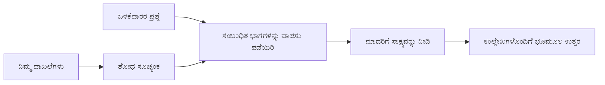

# ನಿಮ್ಮ ಡಾಕ್ಯುಮೆಂಟ್‌ಗಳ ಆಧಾರದ ಮೇಲೆ ಪ್ರಶ್ನೆಗಳಿಗೆ ಉತ್ತರಿಸುವಂತೆ AI ಅನ್ನು ಕೋರ್ ಮಾಡುವುದು:
## ಸರಣಿ 1: RAG, Azure ಮತ್ತು ಓಪನ್ ಸೋರ್ಸ್ ಪರ್ಯಾಯಗಳು, ಮತ್ತು ಫೈನ್-ಟ್ಯೂನಿಂಗ್ ಎಷ್ಟು ಹೊಂದಿಕೆಯಾಗುತ್ತದೆ

> 2023 ರ Azure AI Search + Azure OpenAI ಡಾಕ್ಯುಮೆಂಟ್ ಪ್ರಶ್ನೋತ್ತರ ಟ್ಯುಟೋರಿಯಲ್‌ಗಳನ್ನು ಮರುಪರಿಶೀಲಿಸುವ 2026 ರ ಸರಣಿಯ ಮೊದಲ ಲೇಖನ.

## 1. ಪರಿಚಯ - ಮೊದಲಿನ RAG ಟ್ಯುಟೋರಿಯಲ್ ಮರುಪರಿಶೀಲನೆ

2023 ರಲ್ಲಿ, ನಾನು Azure AI Search ಮತ್ತು Azure OpenAI ಬಳಸಿ PDF ಡಾಕ್ಯುಮೆಂಟ್‌ಗಳಿಂದ ಪ್ರಶ್ನೆಗಳಿಗೆ ಉತ್ತರಿಸುವಂತೆ ChatGPT ಅನ್ನು ತರಬೇತಿದಿಸುವ ಎರಡು ಟ್ಯುಟೋರಿಯಲ್‌ಗಳ ಮೇಲೆ ಕೆಲಸ ಮಾಡಿದೆ. ನಾನು [LangChain ಆವೃತ್ತಿಯನ್ನು](https://techcommunity.microsoft.com/blog/educatordeveloperblog/teach-chatgpt-to-answer-questions-using-azure-ai-search--azure-openai-lang-chain/3969713) ಬರೆದಿದ್ದೇನೆ ಮತ್ತು ನಾನು Principal Cloud Advocate Manager ಆಗಿರುವ [Lee Stott](https://developer.microsoft.com/en-us/advocates/lee-stott) ಅವರೊಂದಿಗೆ ಸಹಲೇಖಕರಾಗಿರುವ [Semantic Kernel ಆವೃತ್ತಿಯನ್ನು](https://techcommunity.microsoft.com/blog/educatordeveloperblog/teach-chatgpt-to-answer-questions-using-azure-ai-search--azure-openai-semantic-k/3985395) ಕೂಡ ಬರೆದಿದ್ದೇನೆ. ಆ ಸಮಯದಲ್ಲಿ, "ನಿಮ್ಮ ಡೇಟಾ ಮೇಲೆ ChatGPT" ಎಂಬ ಕಲ್ಪನೆ ಅನೇಕ ಡೆವಲಪರ್‌ಗಳಿಗೆ ಹೊಸದಾಗಿ തോರುತ್ತಿತ್ತು. ಟ್ಯುಟೋರಿಯಲ್‌ಗಳು Azure Blob Storage, Azure AI Search, Azure OpenAI, LangChain, Semantic Kernel ಮತ್ತು FAISS ಶೈಲಿ ವ್ಯೆಕ್ಟರ್ ರಿಟ್ರೀವಲ್ ಬಳಸಿಕೊಂಡು PDF ಫೈಲ್‌ಗಳಿಂದ ಪ್ರಶ್ನೆಗಳಿಗೆ ಉತ್ತರಿಸುವ ವ್ಯವಸ್ಥೆಯನ್ನು ಬಳಸಿ.

ಆ ಮೊದಲ ಲೇಖನವು ಸರಳ ಆದರೆ ಮುಖ್ಯ ಕಾರ್ಯಪ್ರವಾಹದ ಮೇಲೆ ಕೇಂದ್ರೀಕರಿಸಿತ್ತು: ಡಾಕ್ಯುಮೆಂಟ್‌ಗಳನ್ನು ಅಪ್‌ಲೋಡ್ ಮಾಡಿ, ಅವುಗಳನ್ನು ಇಂಡೆಕ್ಸು ಮಾಡಿ, ಸಂಬಂಧಿತ ವಿಷಯಗಳನ್ನು ರಿಟ್ರೀವ್ ಮಾಡಿ ಮತ್ತು ಆ ವಿಷಯವನ್ನು ಆಧರಿಸಿ ಮಾದರಿಯನ್ನು ಕೇಳಿ ಉತ್ತರಿಸುವಂತೆ.

2026 ರಲ್ಲಿ, RAG ಪರಿಸರವು ಬಹಳ ವಿಸ್ತಾರಗೊಂಡಿದೆ. Azure AI Search ಈಗ ಆಧುನಿಕ ವ್ಯೆಕ್ಟರ್ ಮತ್ತು ಮಿಶ್ರಿತ ರಿಟ್ರೀವಲ್ ಮಾದರಿಗಳನ್ನು ಬೆಂಬಲಿಸುತ್ತದೆ, Azure OpenAI Microsoft Foundry Models ಪರಿಸರದ ಭಾಗವಾಗಿದೆ, ಮತ್ತು ಹೊಸ v1 API ಮಾಸಿಕ `api-version` ಬದಲಾವಣೆಗಳಿಲ್ಲದೆ ಮಾನಕ OpenAI ಕ್ಲೈಂಟ್ ಅನ್ನು ಬಳಸಬಹುದು. ಅದೆ ವೇಳೆ, LangGraph, LlamaIndex, Haystack, Qdrant, Milvus, Weaviate, Chroma, Ollama, ಮತ್ತು vLLM ಮುಂತಾದ ಓಪನ್ ಸೋರ್ಸ್ ಆಯ್ಕೆಗಳನ್ನು ನಿಜವಾದ RAG ವ್ಯವಸ್ಥೆಗಳಿಗೆ ಪ್ರಾಯೋಗಿಕ ಆಯ್ಕೆಯಾಗಿ ಬಳಸಲಾಗುತ್ತಿದೆ.

ಇದೀಗ ಈ ವಿಷಯವನ್ನು ಮರುಪರಿಶೀಲಿಸಲು ನಾನು ಬಯಸಿದೆ. ಪ್ರಶ್ನೆ ಈಗ ಸೀಮಿತವಾಗಿಯೇ "ಹೇಗೆ RAG ನಿರ್ಮಿಸಬೇಕು?" ಅಲ್ಲ. ಅದನ್ನು ನಿರ್ಮಿಸಲು ಹಲವು ಮಾರ್ಗಗಳಿವೆ, ಮತ್ತು ಹೆಚ್ಚಾಗಿ ಮಹತ್ವದ ಪ್ರಶ್ನೆ "ನನ್ನ ಪರಿಸ್ಥಿತಿಗೆ ಯಾವ ಆರ್ಕಿಟೆಕ್ಚರ್ ಅನ್ನು ಆಯ್ಕೆ ಮಾಡಬೇಕು?" ಎಂಬುದಾಗಿದೆ.

ಆದರೆ ಮೂಲ ಸಮಸ್ಯೆ ಬದಲಾಗಿಲ್ಲ.

AI ಮಾದರಿ ನಿಮ್ಮ ಡಾಕ್ಯುಮೆಂಟ್‌ಗಳನ್ನು ಸ್ವಯಂಚಾಲಿತವಾಗಿ ತಿಳಿದಿಲ್ಲ. ಉಪಯುಕ್ತ ಡಾಕ್ಯುಮೆಂಟ್-ಪ್ರಶ್ನೋತ್ತರ ವ್ಯವಸ್ಥೆಯನ್ನು ನಿರ್ಮಿಸಲು ನೀವು ಇನ್ನೂ ನಂಬಿಗಸ್ಥವಾದ ರಿಟ್ರೀವಲ್, ನೆಲಸುಗೊಳಿಸುವಿಕೆ, ಮೌಲ್ಯಮಾಪನ, ಮತ್ತು ಕಾರ್ಯಾಚರಣೆ ಕಾರ್ಯಪ್ರವಾಹಗಳನ್ನು ಅಗತ್ಯವಿದೆ.

ಈ ಲೇಖನ ಇನ್ನೊಂದು ದ್ವಂತ-ಅಂತ್ಯ "PDF ಜೊತೆಗೆ ಚಾಟ್" ಟ್ಯುಟೋರಿಯಲ್ ಅಲ್ಲ. ನಾನು ಈ ನವೀಕರಿಸಿದ ಸರಣಿಯನ್ನು ಈಗ ಹೆಚ್ಚಿನ ಗಮನ ನೀಡುವ ಪ್ರಶ್ನೆಯಿಂದ ಪ್ರಾರಂಭಿಸಲು ಬಯಸುತ್ತೇನೆ: ನೀವು ಯಾವಾಗ ನಿರ್ವಹಿತ Azure ಆರ್ಕಿಟೆಕ್ಚರ್ ಆಯ್ಕೆ ಮಾಡಬೇಕು, ಯಾವಾಗ ಓಪನ್ ಸೋರ್ಸ್ RAG ಸ್ಟ್ಯಾಕ್ ಆಯ್ಕೆ ಮಾಡಬೇಕು, ಮತ್ತು ಯಾವಾಗ ಫೈನ್-ಟ್ಯೂನಿಂಗ್ ನಿಜವಾಗಿಯೂ ಪರಿಣಾಮಕಾರಿ?

ಇದು ಡಾಕ್ಯುಮೆಂಟ್ ಆಧಾರಿತ AI ವ್ಯವಸ್ಥೆಗಳ ನಿರ್ಮಾಣದ ಕುರಿತ ಸರಣಿಯ ಮೊದಲ ಲೇಖನವಾಗಿದೆ. ಪ್ರಥಮ ಭಾಗದಲ್ಲಿ ನಾವು ಆರ್ಕಿಟೆಕ್ಷರ್ ನಿರ್ಣಯಗಳ ಮೇಲೆ ಕೇಂದ್ರೀಕರಿಸುವೆವು: RAG ಯಾಕೆ ಮಹತ್ವವಿದೆ, ಯಾವಾಗ Azure ಆಧಾರಿತ ನಿರ್ವಹಿತ ಸೇವೆಗಳು ಉಪಯುಕ್ತ, ಯಾವಾಗ ಓಪನ್ ಸೋರ್ಸ್ ಪರ್ಯಾಯಗಳು ಹೊಂದಿಕೆಯಾಗುತ್ತವೆ, ಮತ್ತು ಫೈನ್-ಟ್ಯೂನಿಂಗ್ ಯಾವ ಸ್ಥಿತಿಗೆ ಅನ್ವಯಿಸುತ್ತದೆ.

ಡಾಕ್ಯುಮೆಂಟ್ QA ವ್ಯವಸ್ಥೆಗಳನ್ನು ನಿರ್ಮಿಸಿ ಮತ್ತು ಮರುಪರಿಶೀಲಿಸಿದ ನಂತರ, ನನಗೆ ಡೆಮೊದಲ್ಲಿ ಯಾವ ಸಾಧನವು ಉತ್ತಮದಾಗಿದೆ ಎಂಬುದರಿಗಿಂತ ನಿಜವಾದ ಬಳಕೆದಾರರು, ಬದಲಾಗುವ ಡಾಕ್ಯುಮೆಂಟ್‌ಗಳು, ಅನುಮತಿಗಳು, ವಿಫಲತೆಗಳು, ಮತ್ತು ನಿರ್ವಹಣೆಯನ್ನು ಎದುರಿಸುವ ಆರ್ಕಿಟೆಕ್ಚರ್ ಗಳು ಹೆಚ್ಚು ಆಸಕ್ತಿದಾಯಕವಾಗಿವೆ.

## 2. ನಿಮ್ಮ AI ಗೆ ಹುಡುಕಾಟ ವ್ಯವಸ್ಥೆಯ ಅಗತ್ಯವೆಂದರೆ

ವಿಸ್ತೃತ ಸಾರ್ವಜನಿಕ ಮತ್ತು ಪರವಾನಗಿ ಪಡೆದ ಡೇಟಾ ಮೇಲೆ ಟ್ರೇನ್ ಮಾಡಿದ ಲಾರ್ಜ್ ಲ್ಯಾಂಗ್ವೆಜ್ ಮಾದರಿಗಳು ಸಾಮಾನ್ಯ ವಿಷಯಗಳನ್ನು ಬೇರೆಯಾಗಿ ಬಹಳ ಗೊತ್ತಿರಬಹುದು, ಆದರೆ ಅವು ಸ್ವತಃ ನಿಮ್ಮ ಪ್ರೈವೇಟು PDFs, ಆಂತರಿಕ ನೀತಿಗಳು, ಎಂಟರ್‌ಪ್ರೈಸ್ ಪ್ರಕ್ರಿಯೆಗಳು, ಸಂಶೋಧನಾ ಆರ್ಟಿವ್ಸ್, ತರಗತಿ ವಸ್ತುಗಳು, ಗ್ರಾಹಕ ಬೆಂಬಲ ಟಿಪ್ಪಣಿಗಳು, ಅಥವಾ تازಾ ನವೀಕರಿಸಿದ ಡಾಕ್ಯುಮೆಂಟ್ ಕುರಿತು ಸ್ವಯಂಚಾಲಿತವಾಗಿ ತಿಳಿದಿಲ್ಲ.

RAG ಬಗ್ಗೆ ಸರಳವಾಗಿ ಭಾವಿಸುವುದು ಹೀಗೆ: ಮಾದರಿಯಿಂದ ಪ್ರತಿಯೊಂದು ಡಾಕ್ಯುಮೆಂಟ್ ನೆನಸಿಕೊಳ್ಳುವುದನ್ನು ನಿರೀಕ್ಷಿಸುವ ಬದಲು, ನಾವು ಅದಕ್ಕೆ ಒಂದು ಹುಡುಕಾಟ ವ್ಯವಸ್ಥೆ ನೀಡುತ್ತೇವೆ. ಬಳಕೆದಾರರು ಪ್ರಶ್ನೆ ಕೇಳಿದರೆ, ಮೊದಲಿಗೆ ನಿಯಮಿತ, ಪ್ರಸ್ತುತರಿತ ಮಾಹಿತಿಗಳನ್ನ ಹುಡುಕುತ್ತದೆ, ನಂತರ ಆ ಭಾಗಗಳನ್ನು ಮಾದರಿಗೆ ಪ್ರಸ್ತುತಿಮಾಡುತ್ತವೆ.

ಇದು ಮಹತ್ವದ್ದು ಏಕೆಂದರೆ ಅನೇಕ ನಿಜವಾದ ಜ್ಞಾನ ಮೂಲಗಳು ಖಾಸಗಿ, ಎನ್ನುತ್ತಾ ಬದಲಾಗುತ್ತವೆ, ಅನುಮತಿ-ಸಹಿತ, ಬಹು ವ್ಯವಸ್ಥೆಗಳಲ್ಲಿ ಉಳಿಸಲಾಗುತ್ತದೆ, ವಿವಿಧ ಫಾರ್ಮ್ಯಾಟ್‌ಗಳಲ್ಲಿ ಬರೆಯಲ್ಪಡುತ್ತವೆ ಮತ್ತು ಪ್ರಾಂಪ್ಟ್‌ಗೆ ನೇರವಾಗಿ ನಕಲು ಮಾಡಲು ತುಂಬಾ ದೊಡ್ಡದ್ದು.

ಉದಾಹರಣೆಗೆ, ಶಾಲೆ, ಕಂಪನಿ, ಅಥವಾ ಸಂಶೋಧನಾ ತಂಡ 10,000 ಆಂತರಿಕ ಡಾಕ್ಯುಮೆಂಟ್‌ಗಳನ್ನು ಹೊಂದಿದ್ದರೆ, ಮಾದರಿ ಅವುಗಳಿಂದ ವಿಶ್ವಾಸಮಯವಾಗಿ ಉತ್ತರಿಸಲು ಸಾಧ್ಯವಿಲ್ಲ, ಹಾಗಾದರೆ ಮಾತ್ರ ಸರಿಯಾದ ಅವಧಿಯಲ್ಲಿ ಸರಿಯಾದ ಭಾಗಗಳನ್ನು ಸಿಸ್ಟಮ್ ತರುವ ಸಾಧ್ಯತೆ.

ಈಗೊಂದು ಸಾಮಾನ್ಯ ಪ್ರಶ್ನೆ ಬರುತ್ತದೆ:

ಮಾದರಿಯನ್ನು ನೇರವಾಗಿ ಫೈನ್-ಟ್ಯೂನ್ ಮಾಡಬಲ್ಲವುವೇ?

ಫೈನ್-ಟ್ಯೂನಿಂಗ್ ಉಪಯುಕ್ತವಾಗಬಹುದು, ಆದರೆ ದಸ್ತಾವೇಜು ಜ್ಞಾನಕ್ಕೆ ಇದು ಸಾಮಾನ್ಯವಾಗಿ ಮೊದಲ ಸರಿಯಾದ ಉಪಕರಣವಲ್ಲ. ಜ್ಞಾನ ಹೆಚ್ಚಾಗುತ್ತಾ ಇದ್ದರೆ, ಉಲ್ಲೇಖಗಳು ಮುಖ್ಯವಾದರೆ, ಅಥವಾ ಪ್ರವೇಶ ಅನುಮತಿಗಳು ಮುಖ್ಯವಾದರೆ, RAG ಸಾಮಾನ್ಯ ಆರಂಭಿಕ ಆಯ್ಕೆ. ಫೈನ್-ಟ್ಯೂನಿಂಗ್ ಹೆಚ್ಚು ವರ್ತನೆ, ಶೈಲಿ, output ಫಾರ್ಮ್ಯಾಟ್, ಮತ್ತು ಕಾರ್ಯಪದ್ಧತಿಗಳನ್ನು ಕಲಿಯಲು ಸೌಕರ್ಯ.

## 3. RAG ಆರ್ಕಿಟೆಕ್ಚರ್ ಪ್ರಾಯೋಗಿಕವಾಗಿ

ನೀವು ಶಾಲೆಯ AI ಸಹಾಯಕ ನಿರ್ಮಿಸುತ್ತಿದ್ದೀರಿ ಎಂದು ಕಲ್ಪಿಸಿ. ಸಹಾಯಕ ಪಾಳಿ PDFs, ಕೋರ್ಸ್ ಗೈಡ್‌ಗಳು, ಆಂತರಿಕ FAQ ಪುಟಗಳು, ಮತ್ತು تازಾ ನವೀಕರಿಸಿದ ಪ್ರಕಟಣೆಗಳಿಂದ ಪ್ರಶ್ನೆಗಳಿಗೆ ಉತ್ತರಿಸಲು ಬೇಕಾಗಿದೆ.

ವಿದ್ಯಾರ್ಥಿ ಕೇಳಿದರೆ, "ನಾನು ನನ್ನ ಅಂತಿಮ ಕಾರ್ಯಕ್ಕಾಗಿ ಜನರೇಟಿವ್ AI ಬಳಸಬಹುದುವೇ?", ಸಿಸ್ಟಮ್ ಸಾಮಾನ್ಯ ಮಾದರಿಯ ನೆನಪಿನಿಂದ ಉತ್ತರಿಸುವುದಿಲ್ಲ. ಮೊದಲಿಗೆ ಸಂಬಂಧಿತ ಶಾಲೆಯ ನೀತಿಯನ್ನು ಹುಡುಕಿ, AI ಬಳಕೆಯ ವಿಭಾಗವನ್ನು ತರುವಂತೆ, ನಂತರ ಆ ಸಾಕ್ಷ್ಯದಿಂದ ಮಾದರಿಯನ್ನು ಕೇಳಿ ಉತ್ತರಿಸಬೇಕು.

ಅಂದರೆ RAG ನ ಪ್ರಾಯೋಗಿಕ ಚಿತ್ರಣ.

ಮೇಲೆ ಮಟ್ಟದಲ್ಲಿ, ನೀವು ಈ ರೀತಿಯಲ್ಲಿ ಕಾರ್ಯವಾಹಿಕೆಯನ್ನು ಭಾವಿಸಬಹುದು:

ವಿವರಗಳು ಹೆಚ್ಚು ಸಂವಿಧಾನಾತ್ಮಕವಾಗಬಹುದು, ಆದರೆ ಮೂಲಭೂತ ಕಲ್ಪನೆ ಸರಳ: ಮಾದರಿ ಸ್ವತಃ ಉತ್ತರಿಸುವುದಿಲ್ಲ. ಅದು ತರುತ್ತಿರುವ ಸಾಕ್ಷ್ಯಗಳೊಂದಿಗೆ ಉತ್ತರಿಸುತ್ತದೆ.

ಮೊದಲು, ಡಾಕ್ಯುಮೆಂಟ್‌ಗಳನ್ನು Azure Blob Storage, SharePoint, GitHub, ಅಥವಾ ಆಂತರಿಕ CMS ಮುಂತಾದ ಸಂಗ್ರಹಣಾ ವ್ಯವಸ್ಥೆಯಿಂದ ತೆಗೆದುಕೊಳ್ಳುತ್ತದೆ. ನಂತರ ಸಿಸ್ಟಮ್ ಅವುಗಳನ್ನು ಪಠ್ಯದಲ್ಲಿ ವಿಭಜಿಸುತ್ತದೆ ಹಾಗು ಹೆಡಿಂಗ್‌ಗಳು, ಪುಟ ಸಂಖ್ಯೆ, ಟೇಬಲ್, ವಿಭಾಗಗಳು, ಮತ್ತು ಮೂಲ ಸ್ಥಳಗಳಂತಹ ಉಪಯುಕ್ತ ರಚನೆಗಳನ್ನು ಉಳಿಸುತ್ತವೆ.

ಆನಂತರ ವಿಷಯವನ್ನು ಚಂಕ್‌ಗಳಿಗೆ ಹಂಚುತ್ತಾರೆ. ಈ ಹಂತ ಸರಳವಾಗಿ ತೋರುವುದರಷ್ಟೆ, ಆದರೆ ಇದು ಸಿಸ್ಟಮ್‌ನ ಅತ್ಯಂತ ಪ್ರಮುಖ ಭಾಗಗಳಲ್ಲಿ ಒಂದಾಗಿದೆ. ಚಂಕ್ ತುಂಬಾ ಸಣ್ಣವಾದರೆ ಸುತ್ತಲಿನ ಸಂದರ್ಭ ಕಳೆದುಕೊಳ್ಳಬಹುದು. ಚಂಕ್ ದೊಡ್ಡದಾದರೆ ಅಸಂಬಂಧಿತ ಮಾಹಿತಿ ಸೇರಬಹುದು ಮತ್ತು ರಿಟ್ರೀವಲ್ ನಿಖರತೆ ಕುಗ್ಗಬಹುದು.

ಚಂಕಿಂಗ್ ನಂತರ ಸಿಸ್ಟಮ್ ಎಂಬೆಡ್ಡಿಂಗ್‌ಗಳನ್ನು ರಚಿಸಿ, ಮೂಲ ಪಠ್ಯ ಮತ್ತು ಮೆಟಾಡೇಟಾ (ಫೈಲ್ ಹೆಸರು, ಪುಟ ಸಂಖ್ಯೆ, ಅನುಮತಿಗಳು, ಡಾಕ್ಯುಮೆಂಟ್ ಆವೃತ್ತಿ, ಮೂಲ URL) ಸಾಥಿ searchable ಇಂಡೆಕ್ಸ್‌ನಲ್ಲಿ ಸಂಗ್ರಹಿಸಲಾಗುತ್ತದೆ.

ಬಳಕೆದಾರರು ಪ್ರಶ್ನೆ ಕೇಳಿದಾಗ, ಸಿಸ್ಟಮ್ ಕೀವರ್ಡ್ ಹುಡುಕಾಟ, ವ್ಯೆಕ್ಟರ್ ಹುಡುಕಾಟ, ಅಥವಾ ಮಿಶ್ರಿತ ಹುಡುಕಾಟದಿಂದ ಅಭ್ಯರ್ಥಿ ಚಂಕ್‌ಗಳನ್ನು ಪಡೆಯುತ್ತದೆ. ರೀರೆಂಕರ್ ಆ ಚಂಕ್‌ಗಳನ್ನು ಮರುಕ್ರಮಗೊಳಿಸಿ ಬಹುಪಯೋಜನಾತ್ಮಕ ಸಾಕ್ಷ್ಯವನ್ನು ಮೇಲೆ ಇರಿಸಬಹುದು.

ಕೊನೆಯಲ್ಲಿ, ಮಾದರಿ ಪ್ರಶ್ನೆ ಮತ್ತು ರಿಟ್ರೀವ್ ಮಾಡಿದ ಸಾಕ್ಷ್ಯ ಪಡೆಯುತ್ತದೆ. ಉತ್ತರ ಆ ಸಾಕ್ಷ್ಯದಲ್ಲಿ ನೆಲಸಲಿದ್ದು, ಉಲ್ಲೇಖಗಳನ್ನು ಮರಳಿಸಬೇಕು, ಬಳಕೆದಾರನು ಮೂಲವು ಪರಿಶೀಲಿಸಬಹುದು.

ಮುಖ್ಯ ಟಿಪ್ಪಣಿ ಏನೆಂದರೆ RAG ಕೇವಲ "PDFಗಳನ್ನು ವ್ಯೆಕ್ಟರ್ ಡೇಟಾಬೇಸ್ನಲ್ಲಿ ಇಡು" ಮಾತ್ರವಲ್ಲ. ಉತ್ತರದ ಗುಣಮಟ್ಟವು ಸಂಪೂರ್ಣ ವಲ್ಪರಿಣಾಮದ ಮೇಲಿರುತ್ತದೆ: ಪಾರ್ಸಿಂಗ್, ಚಂಕಿಂಗ್, ರಿಟ್ರೀಯಲ್, ರೀರೆಂಕಿಂಗ್, ಪ್ರಾಂಪ್ಟಿಂಗ್, ಉಲ್ಲೇಖ, ಮತ್ತು ಮೌಲ್ಯಮಾಪನ.

ಆದ್ದರಿಂದ ಡಾಕ್ಯುಮೆಂಟ್ ರಚನೆ ಬಹುಮುಖ್ಯ. PDF ಯಲ್ಲಿ, ಶೀರ್ಷಿಕೆ, ಟೇಬಲ್, ಫೂಟ್ನೋಟ್, ಅಥವಾ ಪುಟ ಮಿತಿಯು ಪಠ್ಯದ ಅರ್ಥವನ್ನು ಬದಲಾಯಿಸಬಹುದು. Azure ನಲ್ಲಿ, Document Layout skill Azure Document Intelligence ರಚನೆ-ಅವಗಾಹನೆ ಶಕ್ತಿಗಳನ್ನು ಬಳಸಿಕೊಂಡು ರಚನೆ-ಜಾಗೃತ ಫಲಿತಾಂಶ ಉತ್ಪಾದಿಸುತ್ತದೆ, ಇದು RAG ವ್ಯವಸ್ಥೆಗಳ ಚಂಕಿಂಗ್ ಮತ್ತು ರಿಟ್ರೀವಲ್ ಗುಣಮಟ್ಟವನ್ನು ಸುಧಾರಿಸುತ್ತದೆ.

## 4. 2023ರಿಂದ ಏನು ಬದಲಾಗಿದೆ?

2023 ರ ಟ್ಯುಟೋರಿಯಲ್ ತನ್ನ ಕಾಲಕ್ಕೆ ಉತ್ತಮ ಆರಂಭಸ್ಥಳವಾಗಿತ್ತು:

- Azure Blob Storage PDF ಫೈಲ್‌ಗಳನ್ನು ಸಂಗ್ರಹಿಸಿತ್ತು.
- Azure AI Search ವಿಷಯವನ್ನು ಇಂಡೆಕ್ಸಿಂಗ್ ಮಾಡಿತು.
- LangChain ರಿಟ್ರೀವಲ್ ಅನ್ನು Azure OpenAI ಗೆ ಸಂಪರ್ಕ ಮಾಡಿತು.
- FAISS ಸರಳ ಸ್ಥಳೀಯ ವ್ಯೆಕ್ಟರ್ ಸ್ಟೋರ್ ಆಗಿ ಕೆಲಸ ಮಾಡಿತು.
- ಉದಾಹರಣೆಯಲ್ಲಿ `gpt-35-turbo` ಮತ್ತು `text-embedding-ada-002` ಬಳಸಿದರು.

2026 ರಲ್ಲಿ, ಆಧುನಿಕ ಆವೃತ್ತಿ ಹಲವು ಬದಲಾವಣೆಗಳನ್ನು ಪ್ರತಿಬಿಂಬಿಸಬೇಕಾಗಿದೆ.

ಮೊದಲು, ರಿಟ್ರೀವಲ್ ಮಂಗೆದು. 2023 ರಲ್ಲಿ, ಅನೇಕ ಡೆಮೊಗಳು ಸರಳ ವ್ಯೆಕ್ಟರ್ ಸಮಾನತೆ ಹುಡುಕಾಟವನ್ನು ಬಳಕೆ ಮಾಡುತ್ತಿದ್ದವು. ಇಂದು, ಗಂಭೀರ ಡಾಕ್ಯುಮೆಂಟ್ QA ಗಾಗಿ ಆಗಾಗ್ಗೆ ಮಿಶ್ರಿತ ರಿಟ್ರೀವಲ್ ಪ್ರಾರಂಭಿಕ ಬಿಂದು. Azure AI Search ಒಂದೇ ವಿನಂತಿಯಲ್ಲಿ ಕೀವರ್ಡ್ ಮತ್ತು ವ್ಯೆಕ್ಟರ್ ಪ್ರಶ್ನೆಗಳನ್ನು ಸಂಯೋಜಿಸಿ ಮಿಶ್ರಿತ ಹುಡುಕಾಟವನ್ನು ಬೆಂಬಲಿಸುತ್ತದೆ ಮತ್ತು Reciprocal Rank Fusion ಮೂಲಕ ಫಲಿತಾಂಶಗಳನ್ನು ಏಕೀಕರಿಸುತ್ತದೆ. ಸೈಮ್ಯಾಂಟಿಕ್ ರ್ಯಾಂಕರ್ ನಂತರ ಪಠ್ಯ ಭಾಗದ ಪೂರ್ಣ ಪಠ್ಯ, ವ್ಯೆಕ್ಟರ್, ಮತ್ತು ಮಿಶ್ರಿತ ಫಲಿತಾಂಶಗಳನ್ನು ಮರುಕ್ರಮಗೊಳಿಸುತ್ತದೆ.

ಎರಡನೆಯದಾಗಿ, ಇಂಜೆಷನ್ ಹೆಚ್ಚು ಸಂವಿಧಾನಾತ್ಮಕವಾಗಿದೆ. ಪ್ರತಿ ಡಾಕ್ಯುಮೆಂಟ್ ಅನ್ನು ಕೈಯಿಂದ ವಿಭಜಿಸುವ ಬದಲು, Azure AI Search ಚಂಕಿಂಗ್, ಎಂಬೆಡ್ಡಿಂಗ್, ಮತ್ತು ಪ್ರಶ್ನೆ ಸಮಯ ವ್ಯೆಕ್ಟರೈಜೆಷನ್ ಗಾಗಿ ಇಂಟಿಗ್ರೇಟೆಡ್ ವ್ಯೆಕ್ಟರೈಜೆಷನ್ ಅನ್ನು ಬೆಂಬಲಿಸುತ್ತದೆ. PDFಗಳು ಮತ್ತು ಡಾಕ್ಯುಮೆಂಟ್-ಭಾರಿತ ಕಾರ್ಯಪ್ರವಾಹಗಳಿಗೆ Document Layout skill ಸ್ಥಿರ ಗಾತ್ರದ ಚಂಕ್‌ಗಳಿಗಿಂತ ಹೆಚ್ಚಿನ ರಚನೆಯನ್ನು ಉಳಿಸಬಹುದು.

ಮೂರುನೇದು, ಓರ್ಕೆಸ್ಟ್ರೇಶನ್ ಹೆಚ್ಚು ಮಹತ್ವವಾಗಿದೆ. ಕಠಿಣ ಭಾಗವು LLM API ಕಲ್ ಅಲ್ಲ. ಕಠಿಣ ವಿಭಾಗವು ವೈಫಲ್ಯ, ಮರುಪ್ರಯತ್ನ, ಹಾಳಾದ ರಿಟ್ರೀವಲ್, ಚಂಕ್ ಗುಣಮಟ್ಟ, ದೀರ್ಘ-ನವೀನ ಕಾರ್ಯಪ್ರವಾಹಗಳು, ಮಾನವ ಪರಿಶೀಲನೆ, ಮತ್ತು ಸ್ಕೇಲ್‌ನಲ್ಲಿ ಮೌಲ್ಯಮಾಪನ ನಿರ್ವಹಿಸುವುದು. ಇದರಿಂದ LangGraph, LlamaIndex ಕಾರ್ಯಪ್ರವಾಹಗಳು, Haystack ಪೈಪ್ಲೈನ್ಗಳು, ಮತ್ತು ವೇದಿಕೆ ಮಟ್ಟದ ಮೌಲ್ಯಮಾಪನ ಮತ್ತು ಅವಲೋಕನ ಉಪಕರಣಗಳು ಏಕ ಲೀನಿಯರ್ ಚೈನ್ ಕ್ಕಿಂತ ಹೆಚ್ಚು ಸಂಬಂಧ ಹೊಂದುತ್ತವೆ.

ನಾಲ್ಕನೆಯದು, ಮೌಲ್ಯಮಾಪನ ಲಭ್ಯವಿಲ್ಲದಂತೆ ಇದ್ದೂ ಮಾರ್ಕೆ ತೋರಿಸುವ نہیں. ಒಂದು ಪ್ರಶ್ನೆ ಇರುವ ಡೆಮೊ ಹೆಚ್ಚು ಚರಿತ್ರಾತ್ಮಕ ತೋರುವ ಎಲ್ಲಾ. ಉತ್ಪಾದನಾ ವ್ಯವಸ್ಥೆಗೆ ಪರೀಕ್ಷಾ ಸೆಟ್‌ಗಳು, ರಿಗ್ರೆಶನ್ ಪರಿಶೀಲನೆ, ರಿಟ್ರೀವಲ್ ಮಿತಿಗಳು, ನೆಲಸುಗೊಳಿಸುವಿಕೆ ಪರಿಶೀಲನೆಗಳು, ಮತ್ತು ಮಾನಿಟರಿಂಗ್ ಅಗತ್ಯ. ಮೌಲ್ಯಮಾಪನ ಇಲ್ಲದೇ, ವ್ಯವಸ್ಥೆ ಸುಧಾರಿಸುತ್ತಿದ್ದಾಳೆ ಅಥವಾ ಕೇವಲ ಬದಲಾಯಿಸುತ್ತಿದ್ದಾಳೆ ಎಂಬುದು ತಿಳಿದುಕೊಳ್ಳಲು ಕಷ್ಟ.

## 5. Azure ಮತ್ತು ಓಪನ್-ಸೋರ್ಸ್ RAG ಸ್ಟ್ಯಾಕ್‌ಗಳ ನಡುವೆ ಆಯ್ಕೆ ಮಾಡುತ್ತಿರಾ

ನನಗೆ "Azure ಓಪನ್-ಸೋರ್ಸ್ ಗಿಂತ ಮೇಲು ಅಥವಾ" ಅಥವಾ "ಓಪನ್-ಸೋರ್ಸ್ Azure ಗಿಂತ ಮೇಲು" ಎಂಬ ಪ್ರಶ್ನೆ ಉಪಯುಕ್ತವಿಲ್ಲ ಎಂದು ತೋರುತ್ತದೆ.

ಉಪಯುಕ್ತ ಪ್ರಶ್ನೆ: ನೀವು ಯಾವ ರೀತಿಯ ವ್ಯವಸ್ಥೆಯನ್ನು ನಿರ್ಮಿಸುತ್ತಿದ್ದೀರಿ, ಯಾರು ಅದನ್ನು ಚಲಾಯಿಸುವರು, ಯಾವ ನಿರ್ಬಂಧಗಳಿವೆ, ಮತ್ತು ಯಾವ ವೈಫಲ್ಯ ವಿಧಾನಗಳು ಸಹ್ಯವಾಗುವುದಿಲ್ಲ?

ನಾನು ಡಾಕ್ಯುಮೆಂಟ್ QA ಉದಾಹರಣೆಗಳನ್ನು ನಿರ್ಮಿಸಲು ಆರಂಭಿಸುವಾಗ, ನಾನು ಮುಖ್ಯವಾಗಿ ಚಿಂತಿಸಿದ್ದೆವು ರಿಟ್ರೀವಲ್ ಕಾರ್ಯನಿರ್ವಹಿಸುತಿದೆಯೇ? PDFಗಳನ್ನು ಅಪ್ಲೋಡ್ ಮಾಡಿ, ಅವುಗಳನ್ನು ಹುಡುಕಿ, ಉತ್ತರ ಸೃಷ್ಟಿಸಬಹುದೇ? ಅದು ಯುಕ್ತಿಯ ಶರವಾಯ್ತು.

ಹೆಚ್ಚು ಅನ್ವಯಿಕ AI ಕಾರ್ಯಪ್ರವಾಹಗಳ ಮೂಲಕ ಕೆಲಸ ಮಾಡಿದ ನಂತರ, ನನ್ನ ಮೌಲ್ಯಮಾಪನ ಬದಲಾಗಿದೆ. ಈಗ RAG ಸ್ಟ್ಯಾಕ್ ಆಯ್ಕೆ ಮಾಡುವ ಮೊದಲು ನಾನು ನಾಲ್ಕು ವಿಷಯಗಳನ್ನು ನೋಡುತ್ತೇನೆ:

- ಗುರುತು ಮತ್ತು ಅನುಮತಿಗಳು
- ರಿಟ್ರೀವಲ್ ಗುಣಮಟ್ಟ
- ಕಾರ್ಯಪ್ರವಾಹ ಭದ್ರತೆ
- ಕಾರ್ಯಾಚರಣೆ ಸ್ವಾಮ್ಯದತೆ

ಆ ನಾಲ್ಕನೆಯ ಕ್ಷೇತ್ರಗಳು ಕೇವಲ ಮಾದರಿ ಪರಿಗಣನೆಯಿಗಿಂತ ಹೆಚ್ಚಿನ ಮಾಹಿತಿಯನ್ನು ನೀಡುತ್ತವೆ.

ಏಂಟರ್‌ಪ್ರೈಸ್ ಏಕೀಕರಣ ಕಠಿಣವಾದಾಗ Azure ಆಧಾರಿತ ಆರ್ಕಿಟೆಕ್ಚರ್‌ಗಳು ಸಾಮಾನ್ಯವಾಗಿ ಅರ್ಥ ಆಗುತ್ತವೆ. ತಂಡ ಈಗಾಗಲೇ Microsoft Entra ID, Microsoft 365, Azure Storage, ಖಾಸಗಿ ನೆಟ್ವರ್ಕಿಂಗ್, RBAC, ಮತ್ತು Azure ಮಾನಿಟರಿಂಗ್ ಮೇಲೆ ಅವಲಂಬಿತವಾಗಿದ್ದರೆ, Azure AI Search ಮತ್ತು Azure OpenAI ಕಾರ್ಯಾಚರಣೆ ಸಿಂಪ್ಲಿಸಿಟಿಯನ್ನು ಬಹಳ ಸಡಲ ಮಾಡುತ್ತದೆ. ಆ ಪರಿಸರದಲ್ಲಿ, Azure ಕೇವಲ ಮಾದರಿ API ಅಲ್ಲ. ಮೌಲ್ಯವು ಸುತ್ತಲಿನ ವ್ಯವಸ್ಥೆಯಷ್ಟೇ: ಗುರುತು, ಆಡಳಿತ, ನಿರ್ವಹಿತ ಹುಡುಕಾಟ, ಭದ್ರತೆ ಏಕೀಕರಣ, ಬೆಂಬಲ, ಮತ್ತು ಪರಿಚಿತ ಕಾರ್ಯಾಚರಣೆಗಳು.

ಫ್ಲೆಕ್ಸಿಬಿಲಿಟಿಯು ಕಠಿಣವಾದಾಗ ಓಪನ್-ಸೋರ್ಸ್ ಆರ್ಕಿಟೆಕ್ಚರ್ ಸಾಮಾನ್ಯವಾಗಿ ಅರ್ಥಪಡುತ್ತವೆ. ತಂಡ ಸ್ಥಳೀಯ ಇನ್ಫರೆನ್ಸ್, ಕ್ಲೌಡ್ ಪೋರ್ಟಬಿಲಿಟಿ, ಜ್ಞಾಪಕ retrieval ಪೈಪ್‌ಲೈನ್, ವಿಶೇಷ ಮರುಕ್ರಮಣ, ಅಥವಾ ವ್ಯೆಕ್ಟರ್ ಡೇಟಾಬೇಸ್ ಮತ್ತು ಮಾದರಿ-ಸರ್ವರ್ ಪದರದ ನೇರ ನಿಯಂತ್ರಣ ಅಗತ್ಯವಿದ್ದರೆ, ಓಪನ್-ಸೋರ್ಸ್ ಸ್ಟ್ಯಾಕ್ ಉತ್ತಮ ಹೊಂದಿಕೊಳ್ಳುವಿಕೆ. ವ್ಯಾಪ್ತಿಯಲ್ಲಿ, ತಂಡ ಹೆಚ್ಚು ನಂಬಿಕೆಯ ಕೆಲಸಗಳನ್ನು ಹೊಂದುತ್ತದೆ: ಬ್ಯಾಕಪ್‌ಗಳು, ವಿಸ್ತರಣೆ, ವಿಳಂಬ, ವಲಸೆ, ಮಾನಿಟರಿಂಗ್, ಮತ್ತು ಭದ್ರತೆ.

ಹಾಕಿಕೊಂಡು, ಬಹುತೇಕ ಉತ್ಪಾದನಾ AI ವ್ಯವಸ್ಥೆಗಳು ಸಂಪೂರ್ಣ ಕ್ಲೌಡ್-ನೇಟಿವ್ ಅಥವಾ ಸಂಪೂರ್ಣ ಓಪನ್-ಸೋರ್ಸ್ ಅಲ್ಲ. ಅವು ಕಾರ್ಯಾಚರಣಾ ಸರಳತೆ, ಪೋರ್ಟಬಿಲಿಟಿ, ಆಡಳಿತ, ಮತ್ತು ಇಂಜಿನಿಯರಿಂಗ್ ಫ್ಲೆಕ್ಸಿಬಿಲಿಟಿ ಹೇರಿಕೊಳ್ಳುವ ಸಂಶ್ಲೇಷಣಾ ವ್ಯವಸ್ಥೆ.

ಉದಾಹರಣೆಗೆ, ನಾನು ಆಶ್ಚರ್ಯಪಡುತ್ತಿರಲ್ಲ ಎಂಬುದು ಒಂದು ವ್ಯವಸ್ಥೆಯು ಮಾದರಿ ಪ್ರವೇಶಕ್ಕಾಗಿ Azure OpenAI, ಕಾರ್ಯಪ್ರವಾಹ ಓರ್ಕೆಸ್ಟ್ರೇಶನಿಗಾಗಿ LangGraph, ನಿಯೋಜನೆಯಿಗೆ Azure ಹೋಸ್ಟಿಂಗ್, ಮತ್ತು ನಿರ್ದಿಷ್ಟ retrieval ಅಗತ್ಯಕ್ಕಾಗಿ ಓಪನ್-ಸೋರ್ಸ್ ವ್ಯೆಕ್ಟರ್ ಡೇಟಾಬೇಸ್ ಬಳಸಬಹುದು. ಅದು ಆರ್ಕಿಟೆಕ್ಚರ್ ವಿರೋಧವಲ್ಲ. ಅದು ಪ್ರತಿಯೊಂದು ಭಾಗಕ್ಕೂ ಸರಿಯಾದ ಮಟ್ಟದ ನಿರ್ವಹಿತ ಸೇವೆ ಮತ್ತು ಇಂಜಿನಿಯರಿಂಗ್ ನಿಯಂತ್ರಣ ಆಯ್ಕೆ ಮಾಡುವುದು.

ನನಗೆ ಮಿಶ್ರ ಪ್ರವೃತ್ತಿ ಆರ್ಕಿಟೆಕ್ಚರ್‌ಗಳು ಇಷ್ಟ, ನಿರ್ವಹಿತ ವೇದಿಕೆ ಎಂಟರ್‌ಪ್ರೈಸ್ ಸಮಸ್ಯೆಗಳನ್ನು ಬಗೆಹರಿಸುತ್ತದೆ, ಮತ್ತು ಓಪನ್-ಸೋರ್ಸ್ ಅಂಗಾಂಶಗಳು ತಂಡಕ್ಕೆ ನಿಜವಾಗಿಯೂ ಅಗತ್ಯವಿರುವ ಸೌಲಭ್ಯಗಳನ್ನು ನೀಡುತ್ತವೆ.

## 6. ಪ್ರಯೋಗಿಕ ನಿರ್ಣಯ ಮಾರ್ಗದರ್ಶಿ

ಇಲ್ಲಿ ತಂಡದೊಂದಿಗೆ RAG ಸ್ಟ್ಯಾಕ್ ಆಯ್ಕೆಮಾಡುವ ಮುನ್ನ ನಾನು ಬಳಸುವುದು ನಿರ್ಣಯ ಪಟ್ಟಿಕೆ:

| ನಿರ್ಣಯ ಕ್ಷೇತ್ರ | Azure ನಿರ್ವಹಿತ ಸ್ಟ್ಯಾಕ್ ಶಕ್ತಿಯು ಹೆತ್ತಿರುವಾಗ... | ಓಪನ್-ಸೋರ್ಸ್ ಸ್ಟ್ಯಾಕ್ ಶಕ್ತಿಯು ಹೆತ್ತಿರುವಾಗ... |
| --- | --- | --- |
| ಗುರುತು ಮತ್ತು ಪ್ರವೇಶ | Entra ID, RBAC, ನಿರ್ವಹಿತ ಗುರುತು, ಮತ್ತು ಎಂಟರ್‌ಪ್ರೈಸ್ ಅನುಮತಿಗಳು ಕೇಂದ್ರವಾದಾಗ | ಕಸ್ಟಮ್ ಪ್ರಾಧಿಕಾರ, ಅಯ Microsoft ಗುರುತು, ಅಥವಾ ಅಪ್ಲಿಕೇಶನ್-ನಿರ್ದಿಷ್ಟ ಪ್ರವೇಶ ಲಾಜಿಕ್ അധികಾರ ಹೊಂದಿದ್ದರೆ |
| ಕಾರ್ಯಾಚರಣೆಗಳು | ತಂಡ ನಿರ್ವಹಿತ ಮೂಲಭೂತ ಸೌಕರ್ಯ, ಬೆಂಬಲ, SLAಗಳು, ಮತ್ತು ಸರಳ ಆರಂಭಿಕೆ ಬಯಸಿದಾಗ | ತಂಡ ವ್ಯೆಕ್ಟರ್ ಡೇಟಾಬೇಸ್‌ಗಳು, ಮಾದರಿ ಸರ್ವಿಂಗ್, ಬ್ಯಾಕಪ್‌ಗಳು, ಸ್ಕೇಲಿಂಗ್ ಸಂಚಾರಿಸಬಹುದಾದಾಗ |
| ರಿಟ್ರೀವಲ್ | ಮಿಶ್ರಿತ ಹುಡುಕಾಟ, ಸೈಮ್ಯಾಂಟಿಕ್ ರ್ಯಾಂಕಿಂಗ್, ಫಿಲ್ಟರ್‌ಗಳು, ಮತ್ತು ಮೆಟಾಡೇಟಾ ಹುಡುಕಾಟ ಬಹಳ ಅವಶ್ಯಕತೆಗಳನ್ನು ಪೂರೈಸುವಾಗ | ತಂಡಕ್ಕೆ ಕಸ್ಟಮ್ ರಿಟ್ರೀವಲ್, ವಿಶೇಷ ಮರುಕ್ರಮಣೆ, ಅಥವಾ ಪ್ರಯೋಗಾತ್ಮಕ ಇಂಡೆಕ್ಸಿಂಗ್ ಬೇಕಾದಾಗ |
| ಪೋರ್ಟಬಿಲಿಟಿ | Azure ಪರಿಸರ ಜೊತೆ ಹೊಂದಿಕೊಳ್ಳುವಿಕೆ ಸ್ವೀಕಾರಾರ್ಹ ಅಥವಾ ಪ್ರಾಧಾನ್ಯವಿದ್ದಾಗ | ಕ್ಲೌಡ್ ಲಾಕ್-ಇನ್ ತಪ್ಪಿಸುವುದು ಅಗತ್ಯವಿದ್ದಾಗ |
| ಇನ್ಫರೆನ್ಸ್ | Azure OpenAI ಆಡಳಿತ, ನೆಟ್ವರ್ಕಿಂಗ್, ಮತ್ತು ಎಂಟರ್‌ಪ್ರೈಸ್ ನಿಯಂತ್ರಣಗಳು ಮುಖ್ಯವಾಗಿದ್ದರೆ | ಸ್ಥಳೀಯ ಇನ್ಫರೆನ್ಸ್, ಕಸ್ಟಮ್ ಮಾದರಿ, ಅಥವಾ ಸ್ವಯಂ-ಹೋಸ್ಟೆಡ್ ಸರ್ವಿಂಗ್ ಅಗತ್ಯ |
| ವೆಚ್ಚ | ಇಂಜಿನಿಯರಿಂಗ್ ಮತ್ತು ಕಾರ್ಯಾಚರಣೆ ಪ್ರಯತ್ನ ಕಡಿಮೆ ಮಾಡುವುದು ಮೂಲಮಂತ್ರವಾಗಿದ್ದರೆ | ತೂಕವಾಗಿರುವ ಮೀಟ್ಟಿಗೆ ಉತ್ತಮ ಮೂಲಸೌಕರ್ಯ ಆಪ್ಟಿಮೈಸೇಶನ್ ಅಗತ್ಯವಿದ್ದರೆ |
| ಪ್ರಯೋಗ | ಸ್ಥಿರತೆ ಮತ್ತು ಎಂಟರ್‌ಪ್ರೈಸ್ ಏಕೀಕರಣ ಹೆಚ್ಚು ಮುಖ್ಯವಾಗಿರುವಾಗ | ತಂಡ ಏಜೆಂಟ್‌ಗಳು, ಉಪಕರಣಗಳು, ಜ್ಞಾಪಕ, ಮತ್ತು ರಿಟ್ರೀವಲ್ ಕಾರ್ಯಪ್ರವಾಹಗಳಲ್ಲಿ ಬೇಗನ iteration ಮಾಡುತ್ತಿರಲಿದ್ದರೆ |

ನನ್ನ ನಿಯಮ ಸರಳ:

- ಎಂಟರ್‌ಪ್ರೈಸ್ ಏಕೀಕರಣ, ಭದ್ರತೆ, ಮತ್ತು ಕಾರ್ಯಾಚರಣೆ ಸರಳತೆ ಮುಖ್ಯ ಅಪಾಯಗಳಾಗಿರುವಾಗ Azure ನಿಂದ ಪ್ರಾರಂಭಿಸಿ.
- ಪೋರ್ಟಬಿಲಿಟಿ, ಕಸ್ಟಮೈಸೇಶನ್, ಅಥವಾ ಸ್ಥಳೀಯ ನಿಯಂತ್ರಣ ಮುಖ್ಯ ಅಪಾಯಗಳಾಗಿರುವಾಗ ಓಪನ್-ಸೋರ್ಸ್ ನಿಂದ ಪ್ರಾರಂಭಿಸಿ.
- ಎರಡೂ ಸತ್ಯವಾಗಿದ್ದರೆ ಮಿಶ್ರ ಸ್ಟ್ಯಾಕ್ ಬಳಸಿ.

ಅದಕ್ಕಾಗಿಯೇ 2026 ರ RAG ಸರಣಿಯನ್ನು ಮೊದಲಾಗಿ ಕೋಡ್ ನಿಂದ ಪ್ರಾರಂಭಿಸುವುದಿಲ್ಲ. ಕೋಡ್ ಮಹತ್ವಪೂರ್ಣ, ಆದರೆ ಆರ್ಕಿಟೆಕ್ಚರ್ ಆಯ್ಕೆ ಜತೆಗೆ ಸುಳಿಯುವುದು ಉನ್ನತ ಪ್ರಾಥಮಿಕತೆ. ಸರಳ ಡೆಮೊ ಅತ್ಯಂತ ಕಠಿಣ ಆಯ್ಕೆಗಳನ್ನು ಮುಚ್ಚಿಬಿಡಬಹುದು. ಒಳ್ಳೆಯ RAG ವ್ಯವಸ್ಥೆ ಆ ಆಯ್ಕೆಗಳನ್ನು ಸ್ಪಷ್ಟವಾಗಿ ಮಾಡುತ್ತದೆ.

## 7. ಫೈನ್-ಟ್ಯೂನಿಂಗ್ ಯಾವಾಗ ಹೊಂದಿಕೆಯಾಗುತ್ತದೆ

ಫೈನ್-ಟ್ಯೂನಿಂಗ್ RAG ಜೊತೆಗೆ ಸಹವಾದರೆ ಹೇಳಲ್ಪಡುವುದಾದರೂ, ನಾನು ಎರಡು ಭೇದಿಸುವುದು ಮುಖ್ಯವೆಂದು ಭಾವಿಸುತ್ತೇನೆ.

RAG ಸಾಮಾನ್ಯವಾಗಿ ಹೊಸ, ಖಾಸಗಿ, ಅನುಮತಿ-ಸಂವೇದನಾಶೀಲ, ಅಥವಾ ಮೂಲದಿಂದ ನೆಲಸುಗೊಂಡ ಜ್ಞಾನ ಅಗತ್ಯವಿರುವಾಗ ಉತ್ತಮ ಆಯ್ಕೆ. ಉತ್ತರವು ಡಾಕ್ಯುಮೆಂಟ್‌ಗಳನ್ನು ಉಲ್ಲೇಖಿಸಬೇಕು, تازಾ ನವೀಕರಣಗಳನ್ನು phản ಬರುವದು, ಅಥವಾ ಬಳಕೆದಾರ-ನಿರ್ದಿಷ್ಟ ಪ್ರವೇಶ ನಿಯಮಗಳನ್ನು ಗೌರವಿಸಬೇಕು ಎಂದಾದರೆ, ರಿಟ್ರೀವಲ್ ಆರ್ಕಿಟೆಕ್ಚರ್‌ನ ಭಾಗವಾಗಿದ್ದಂತೇ ಇರಬೇಕು.

ಫೈನ್-ಟ್ಯೂನಿಂಗ್ ಜ್ಞಾನ ಮುಖ್ಯ ಸಮಸ್ಯೆಯಲ್ಲದಿದ್ದಾಗ ಉಪಯುಕ್ತ. ನೀವು ಮಾದರಿಗೆ ಒಂದು ನಿರ್ದಿಷ್ಟ output ಫಾರ್ಮ್ಯಾಟ್ ಅನುಸರಿಸುವಂತೆ, ವಿಸ್ತೃತ ಪ್ರಕ್ರಿಯೆಗೆ ಹೊಂದಿಕೊಳ್ಳುವ ಶೈಲಿ, ಸ್ಥಿರವಾದ ಕಾರ್ಯವನ್ನು ಹೆಚ್ಚು ನಂಬಿಗಸ್ಥವಾಗಿ ನಿರ್ವಹಿಸುವುದು, ಅಥವಾ ಪ್ರತೀ ಪ್ರಾಂಪ್ಟ್‌ನಲ್ಲಿ ಬೇಕಾದ ನಿರ್ದೇಶನ ಪ್ರಮಾಣವನ್ನು ಕಡಿಮೆ ಮಾಡುವುದು ಬಯಸಿದಾಗ ಇದನ್ನು ಉಪಯೋಗಿಸಬಹುದು.
ಪ್ರಯೋಗದಲ್ಲಿ, ಇವು ಎರಡೂ ಒಟ್ಟಿಗೆ ಕೆಲಸ ಮಾಡಬಹುದು. ಒಂದು ಬೆಂಬಲ ಸಹಾಯಕನು ನವೀನ ನೀತಿಯನ್ನು ಹಿಂತೆಗೆದುಕೊಳ್ಳಲು RAG ಅನ್ನು ಬಳಸಿ, ಇನ್ನೊಂದು ಉತ್ತಮ-ಶಿಕ್ಷಣ ಪಡೆದ ಮಾದರಿ ಕಂಪನಿಯ ಇಷ್ಟದ ಉತ್ತರ ರಚನೆ ಮತ್ತು ಶಬ್ದವನ್ನು ಕಲಿಯುತ್ತದೆ.

ತಪ್ಪು ಎಂದರೆ, ಉತ್ತಮ-ಶಿಕ್ಷಣವನ್ನು ಡಾಕ್ಯುಮೆಂಟ್ ಸ್ಟೋರ್‌ನ ಬದಲಾವಣೆ ಎಂದು ಪರಿಗಣಿಸುವುದು. ಹೊಸ, ಖಾಸಗಿ ಅಥವಾ ಅನುಮತಿ ಸಂವೇದನಾಶೀಲ ಮಾಹಿತಿ ನಿಂದ ವ್ಯವಸ್ಥೆಗೆ ಉತ್ತರ ನೀಡಬೇಕಾದಾಗ ಹಿಂತೆಗೆದುಕೊಳ್ಳುವ ಅಗತ್ಯವಿಲ್ಲವಾಗುವುದಿಲ್ಲ.

## 8. ಈ ಸರಣಿಯ ಮುಂದಿನ ಭಾಗವು ಏಕೆಲ್ಲಿ ಹೋಗುತ್ತದೆ

ಈ ಲೇಖನವು ನಿರ್ಣಯ ಮಾಡುವ ಹಂತವಾಗಿದೆ. ಕೋಡ್ ಬರೆಯುವ ಮುನ್ನ, ನಾನು ವ್ಯತ್ಯಾಸಗಳನ್ನು ಸ್ಪಷ್ಟವಾಗಿ ತಿಳಿಸಲು ಬಯಸಿದೆ: RAG ಮತ್ತು ಉತ್ತಮ-ಶಿಕ್ಷಣ, ಅಜೂರ್ ಮತ್ತು ಓಪನ್ ಸೋರ್ಸ್, ನಿರ್ವಹಿತ ಸೇವೆಗಳು ಮತ್ತು ಕಾರ್ಯಾಚರಣಾತ್ಮಕ ನಿಯಂತ್ರಣ.

ಕಾರ್ಯಗತಗೊಳಿಸುವಿಕೆಗೆ ಮುನ್ನ, ಇಲ್ಲಿ ಒಂದಿಷ್ಟು ಬಿಂದು ನಿಭಾಯಿಸಬೇಕು ಎಂದು ಬಯಸುತ್ತೇನೆ: ಹಲವಾರು ಎಂಟರ್ಪ್ರೈಸ್ AI ವ್ಯವಸ್ಥೆಗಳಲ್ಲಿ, ಮಾದರಿ ಒಂದು ಘಟಕ ಮಾತ್ರ. ಹಿಂತೆಗೆದುಕೊಳ್ಳುವ ಗುಣಮಟ್ಟ, ಸಂಘಟನೆ, ಮೌಲ್ಯಮಾಪನ, ಅನುಮತಿಗಳು ಮತ್ತು ಕಾರ್ಯಾಚರಣಾತ್ಮಕ ನಂಬಿಕತೆಯೇ ಕೆಲವೊಮ್ಮೆ ಡೆಮೊ ಹಂತದ ಮುಂದೆ ವ್ಯವಸ್ಥೆಯ ಯಶಸ್ಸನ್ನು ನಿರ್ಧರಿಸುತ್ತವೆ.

ಈ ಸರಣಿಯ ಮುಂದಿನ ವಿಭಾಗಗಳಲ್ಲಿ, ನಾನು ಡಾಕ್ಯುಮೆಂಟ್ ಆಧಾರಿತ AI ವ್ಯವಸ್ಥೆಗಳ ಪ್ರಾಯೋಗಿಕ ಭಾಗವನ್ನು ಆಳವಾಗಿ ನೋಡಿ: ಅಜೂರ್ ಆಧಾರಿತ ವಿನ್ಯಾಸವನ್ನು ಹೇಗೆ ನಿರ್ಮಿಸುವುದು, ಓಪನ್ ಸೋರ್ಸ್ ಪರ್ಯಾಯಗಳು ಪ್ರಾಯೋಗಿಕವಾಗಿ ಹೇಗೆ ಹೋಲಿಕೆ ಮಾಡುತ್ತವೆ, ಮತ್ತು RAG ವ್ಯವಸ್ಥೆ वास्तवದಲ್ಲಿ ಕೆಲಸ ಮಾಡುತ್ತಿದ್ದೆಯೇ ಎಂದು ಹೇಗೆ ಮೌಲ್ಯಮಾಪನ ಮಾಡಬೇಕೆಂದು.

ಸರಣಿ ಅಭಿವೃದ್ಧಿಪಡಿಸುವಂತೆ ಕ್ರಮವನ್ನು ಸದಾ ಬದಲಾಯಿಸಬಹುದು, ಆದರೆ ಗುರಿ ಬದಲಾಗುವುದಿಲ್ಲ: ಸರಳ ಡೆಮೊ ಯನ್ನು ಮೀರಿ RAG ವ್ಯವಸ್ಥೆಗಳನ್ನು ನಿರ್ವಹಿಸಲು, ಮೌಲ್ಯಮಾಪನ ಮಾಡಲು ಮತ್ತು ಕಾರ್ಯಾಚರಣೆ ಮಾಡಲು ನೀವು ಹೇಗೆ ಯೋಚಿಸಬೇಕು ಎಂದು ತೋರಿಸುವುದು.

## 9. ಉಲ್ಲೇಖಗಳು ಮತ್ತು ಸಂಪನ್ಮೂಲಗಳು

ಮೂಲ ತರಬೇತಿಗಳು:

- [Teach ChatGPT to Answer Questions: Using Azure AI Search & Azure OpenAI (Lang Chain)](https://techcommunity.microsoft.com/blog/educatordeveloperblog/teach-chatgpt-to-answer-questions-using-azure-ai-search--azure-openai-lang-chain/3969713)
- [Teach ChatGPT to Answer Questions: Using Azure AI Search & Azure OpenAI (Semantic Kernel)](https://techcommunity.microsoft.com/blog/educatordeveloperblog/teach-chatgpt-to-answer-questions-using-azure-ai-search--azure-openai-semantic-k/3985395)

ಅಜೂರ್:

- [Azure AI Search REST API versions](https://learn.microsoft.com/en-us/rest/api/searchservice/search-service-api-versions)
- [Hybrid search in Azure AI Search](https://learn.microsoft.com/en-us/azure/search/hybrid-search-how-to-query)
- [Integrated vectorization in Azure AI Search](https://learn.microsoft.com/en-us/azure/search/vector-search-integrated-vectorization)
- [Document Layout skill in Azure AI Search](https://learn.microsoft.com/en-us/azure/search/cognitive-search-skill-document-intelligence-layout)
- [Chunk and vectorize by document layout](https://learn.microsoft.com/en-us/azure/search/search-how-to-semantic-chunking)
- [Semantic ranking in Azure AI Search](https://learn.microsoft.com/en-us/azure/search/semantic-search-overview)
- [Azure OpenAI / Microsoft Foundry API version lifecycle](https://learn.microsoft.com/en-us/azure/foundry/openai/api-version-lifecycle)
- [Foundry Models sold by Azure](https://learn.microsoft.com/en-us/azure/foundry/foundry-models/concepts/models-sold-directly-by-azure)
- [Microsoft Foundry fine-tuning considerations](https://learn.microsoft.com/en-us/azure/foundry/openai/concepts/fine-tuning-considerations)
- [Microsoft Foundry observability](https://learn.microsoft.com/en-us/azure/foundry/concepts/observability)
- [Run evaluations in Microsoft Foundry](https://learn.microsoft.com/en-us/azure/foundry/how-to/evaluate-generative-ai-app)

ಒಪನ್-ಸೋರ್ಸ್:

- [LangGraph documentation](https://docs.langchain.com/oss/python/langgraph/overview)
- [LlamaIndex documentation](https://developers.llamaindex.ai/python/framework/)
- [Haystack documentation](https://docs.haystack.deepset.ai/)
- [Qdrant documentation](https://qdrant.tech/documentation/overview/)
- [Milvus documentation](https://milvus.io/docs/overview.md)
- [Weaviate documentation](https://docs.weaviate.io/weaviate/current/)
- [Chroma documentation](https://docs.trychroma.com/docs/overview/introduction)
- [Ollama embeddings](https://docs.ollama.com/capabilities/embeddings)
- [vLLM OpenAI-compatible server](https://docs.vllm.ai/en/latest/serving/openai_compatible_server.html)
- [BGE embedding models](https://huggingface.co/BAAI/bge-large-en-v1.5)
- [E5 embedding models](https://huggingface.co/intfloat/e5-large-v2)
- [Instructor embedding models](https://huggingface.co/hkunlp/instructor-large)

---

<!-- CO-OP TRANSLATOR DISCLAIMER START -->
**ಅಸ್ವೀಕಾರ**:
ಈ ದಸ್ತಾವೇಜು AI ಅನುವಾದ ಸೇವೆ [Co-op Translator](https://github.com/Azure/co-op-translator) ಬಳಸಿ ಅನುವಾದಿಸಲಾಗಿದೆ. ನಾವು ನಿಖರತೆಯನ್ನು ಸಾಧಿಸಲು ಪ್ರಯತ್ನಿಸುತ್ತಿದ್ದರೂ, ದಯವಿಟ್ಟು ಗಮನಿಸಿ, ಸ್ವಯಂಚಾಲಿತ ಅನುವಾದಗಳಲ್ಲಿ ದೋಷಗಳು ಅಥವಾ ಅಸಡ್ಡೆಗಳು ಇರಬಹುದು. ಮೂಲ ಭಾಷೆಯಲ್ಲಿರುವ ಮೂಲ ದಸ್ತಾವೇಜು ಪ್ರಾಮಾಣಿಕ ಮೂಲವೆಂದು ಪರಿಗಣಿಸಬೇಕು. ಪ್ರಮುಖ ಮಾಹಿತಿಗಾಗಿ, ವೃತ್ತಿಪರ ಮಾನವ ಅನುವಾದವನ್ನು ಶಿಫಾರಸು ಮಾಡಲಾಗುತ್ತದೆ. ಈ ಅನುವಾದವನ್ನು ಬಳಸುವ ಮೂಲಕ ಉಂಟಾಗುವ ಯಾವುದೇ ತಪ್ಪು ಅರ್ಥಗಳ ಅಥವಾ ತಪ್ಪು ವ್ಯಾಖ್ಯಾನಗಳ ಬಗ್ಗೆ ನಾವು ಹೊಣೆಗಾರರಲ್ಲ.
<!-- CO-OP TRANSLATOR DISCLAIMER END -->