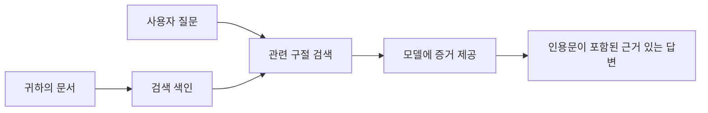

# AI에게 문서를 기반으로 질문에 답하는 법 가르치기:  
## 시리즈 1: RAG, Azure 대 오픈소스 대안, 그리고 파인튜닝이 의미 있을 때

> 2023년에 진행한 Azure AI Search + Azure OpenAI 문서 QA 튜토리얼을 다시 살펴보는 2026년 시리즈의 첫 번째 글입니다.

시리즈 탐색: [저장소 홈](../README.md) | 다음: [시리즈 2 - 로컬 오픈소스 RAG 시스템 엔드 투 엔드 구축](./series-2-open-source-rag-end-to-end.md)

## 1. 소개 - 이전 RAG 튜토리얼 다시 보기

2023년에 Azure AI Search와 Azure OpenAI를 사용하여 PDF 문서로부터 ChatGPT에게 질문에 답하는 방법을 가르치는 두 가지 튜토리얼을 작업했습니다. 저는 [LangChain 버전](https://techcommunity.microsoft.com/blog/educatordeveloperblog/teach-chatgpt-to-answer-questions-using-azure-ai-search--azure-openai-lang-chain/3969713)을 작성했고, Microsoft의 프린시펄 클라우드 어드보케이트 매니저인 [Lee Stott](https://developer.microsoft.com/en-us/advocates/lee-stott)와 함께 동반하는 [Semantic Kernel 버전](https://techcommunity.microsoft.com/blog/educatordeveloperblog/teach-chatgpt-to-answer-questions-using-azure-ai-search--azure-openai-semantic-k/3985395)도 공동 집필했습니다. 당시에는 "내 데이터 위에서 ChatGPT 실행"이라는 개념이 많은 개발자에게 여전히 새로웠습니다. 튜토리얼은 Azure Blob Storage, Azure AI Search, Azure OpenAI, LangChain, Semantic Kernel, FAISS 스타일 벡터 검색을 활용해 PDF 파일에서 질문에 답하는 방식을 다뤘습니다.

초기 글은 단순하지만 중요한 워크플로우에 초점을 맞췄습니다: 문서를 업로드하고, 인덱싱하며, 관련 콘텐츠를 검색한 다음, 모델에게 그 콘텐츠를 기반으로 답변하도록 요청하는 과정입니다.

2026년 현재 RAG 생태계는 크게 성장했습니다. Azure AI Search는 이제 최신 벡터 및 하이브리드 검색 패턴을 지원하며, Azure OpenAI는 Microsoft Foundry Models 생태계의 일부가 되었고, 최신 v1 API는 월별 `api-version` 변경 없이 표준 OpenAI 클라이언트를 사용할 수 있습니다. 동시에 LangGraph, LlamaIndex, Haystack, Qdrant, Milvus, Weaviate, Chroma, Ollama, vLLM 같은 오픈소스 옵션들도 실제 RAG 시스템에 적합한 선택지가 되었습니다.

그래서 이 주제를 다시 다루고자 합니다. 이제 질문은 단순히 "어떻게 RAG를 구축할까?"가 아닙니다. 다양한 구축 방법이 존재하며, 더 중요한 질문은 "내 상황에 맞는 아키텍처는 무엇인가?" 입니다.

하지만 핵심 문제는 변하지 않았습니다.

AI 모델이 자동으로 내 문서를 아는 것이 아닙니다. 유용한 문서 질문응답 시스템을 구축하려면 여전히 신뢰할 수 있는 검색, 근거 제공, 평가, 운영 워크플로우가 필요합니다.

이 글은 또 다른 PDF 채팅 엔드투엔드 튜토리얼이 아닙니다. 이번 업데이트 시리즈에서는 제가 현재 더욱 중요하게 생각하는 질문부터 시작하려고 합니다: 언제 관리형 Azure 아키텍처를 선택하고, 언제 오픈소스 RAG 스택을 선택하며, 파인튜닝은 언제 실제로 의미가 있을까요?

이 시리즈 첫 번째 글에서는 아키텍처 결정에 집중합니다: RAG가 중요한 이유, Azure 기반 관리형 서비스가 유용한 시점, 오픈소스 대안이 적합한 경우, 그리고 파인튜닝의 위치에 대해 살펴봅니다.

문서 QA 시스템을 구축하고 다시 보면서 저는 데모에서 어떤 도구가 좋아 보이느냐보다 실제 사용자, 문서 변경, 권한, 실패, 유지보수 상황에서 어떤 아키텍처가 견디는지에 더 관심을 갖게 되었습니다.

## 2. AI가 검색 시스템을 필요로 하는 이유

대형 언어 모델은 광범위한 공공 및 라이선스 데이터를 기반으로 훈련됩니다. 일반적인 주제에는 많이 알 수 있으나, 여러분의 개인 PDF, 내부 정책, 기업 절차, 연구 자료, 수업 자료, 고객 지원 노트, 최근 업데이트된 문서를 자동으로 알지는 못합니다.

RAG를 쉽게 생각하면 이렇습니다: 모델이 모든 문서를 기억한다고 기대하는 대신, 우리가 검색 시스템을 제공합니다. 사용자가 질문하면 시스템은 먼저 가장 관련성이 높은 정보를 찾고, 그 정보를 모델에 컨텍스트로 제공합니다.

이것이 중요한 이유는 많은 현실 세계 지식 소스가 사적이고, 끊임없이 변화하며, 권한에 민감하고, 여러 시스템에 분산되어 저장되며, 다양한 형식으로 작성되고, 프롬프트에 직접 붙여넣기에는 너무 크기 때문입니다.

예를 들어 학교, 회사, 연구팀에 내부 문서가 1만 건 있다면, 시스템이 적절한 시점에 올바른 부분을 검색하지 않는 한 모델이 그 문서들로부터 정확히 답변할 수 없습니다.

이로 인해 흔히 나오는 질문이 있습니다:

왜 굳이 파인튜닝하지 않고 검색을 사용하나요?

파인튜닝도 유용할 수 있으나 일반적으로 문서 지식에는 첫 번째 도구로 적합하지 않습니다. 지식이 자주 바뀌거나 인용이 중요하거나 접근 권한이 중요하다면 RAG가 좋은 출발점입니다. 파인튜닝은 주로 행동, 스타일, 출력 형식, 작업 패턴을 가르치는 데 더 적합합니다.

## 3. 실제 RAG 아키텍처

학교용 AI 비서를 만든다고 상상해보세요. 이 비서는 정책 문서 PDF, 강의 안내서, 내부 FAQ 페이지, 최근 공지를 바탕으로 질문에 답해야 합니다.

학생이 "기말 과제에 생성형 AI를 사용해도 되나요?"라고 묻는 경우, 시스템은 모델의 일반적인 기억에서 답하면 안 됩니다. 먼저 관련 학교 정책을 찾아 AI 사용 관련 부분을 가져온 후, 그 증거를 사용해 모델에게 답변을 요청해야 합니다.

이것이 바로 실제 RAG입니다.

대략적인 흐름은 다음과 같습니다:

  
상세 내용은 더 정교해질 수 있으나 기본 아이디어는 간단합니다: 모델이 혼자 답하는 것이 아니라 검색된 근거와 함께 답한다는 점입니다.

먼저 문서를 Azure Blob Storage, SharePoint, GitHub, 내부 CMS 같은 저장소 시스템에서 가져옵니다. 이후 문서의 제목, 페이지 번호, 표, 섹션, 출처 위치 같은 유용한 구조를 보존하면서 텍스트로 파싱합니다.

다음으로 콘텐츠를 청크 단위로 나눕니다. 이 과정은 단순해 보이지만 시스템에서 가장 중요한 부분 중 하나입니다. 청크가 너무 작으면 주변 문맥을 잃을 수 있고, 너무 크면 관련 없는 정보가 섞여 검색 정밀도가 떨어질 수 있습니다.

그 후 청크별 임베딩을 생성하고, 원문 텍스트 및 파일명, 페이지 번호, 권한, 문서 버전, 출처 URL 같은 메타데이터와 함께 검색 가능한 인덱스에 저장합니다.

사용자가 질문하면 키워드 검색, 벡터 검색, 하이브리드 검색으로 후보 청크를 찾아냅니다. 재정렬기는 가장 유용한 증거가 상단에 위치하도록 순서를 조정합니다.

마지막으로 모델은 질문과 검색된 증거를 함께 받고 답변합니다. 답변은 반드시 근거에 기반하고 인용을 포함하여 사용자가 출처를 확인할 수 있어야 합니다.

중요한 점은 RAG가 단순히 "PDF를 벡터 DB에 넣는 것"이 아니라는 것입니다. 답변 품질은 파싱, 청크 분할, 검색, 재정렬, 프롬프트 구성, 인용, 평가의 전체 워크플로우에 달려 있습니다.

그래서 문서 구조가 중요합니다. PDF에서 제목, 표, 각주, 페이지 경계는 문단의 의미를 바꿀 수 있습니다. Azure에서는 Document Layout 스킬이 Azure Document Intelligence의 레이아웃 기능을 활용해 구조 인지 출력을 생성, RAG 시스템에서 청크 분할과 검색 품질 향상을 도울 수 있습니다.

## 4. 2023년 이후 변화한 점

2023년 튜토리얼은 당시 기준으로 좋은 출발점이었습니다:

- Azure Blob Storage에 PDF 파일 저장  
- Azure AI Search가 콘텐츠 인덱싱  
- LangChain이 검색과 Azure OpenAI 연결  
- FAISS가 간단한 로컬 벡터 스토어 역할  
- 예제는 `gpt-35-turbo`와 `text-embedding-ada-002` 사용  

2026년 현대 버전은 여러 변화를 반영해야 합니다.

첫째, 검색 기술이 성숙했습니다. 2023년에는 단순 벡터 유사도 검색 시연이 많았지만, 오늘날에는 하이브리드 검색이 본격 문서 QA의 기본 시작점입니다. Azure AI Search는 키워드와 벡터 쿼리를 결합하는 하이브리드 검색을 지원하고, Reciprocal Rank Fusion으로 결과를 병합합니다. Semantic ranker는 전체 문서, 벡터, 하이브리드 결과의 텍스트 측을 재순위할 수 있습니다.

둘째, 인게스천(문서 수집·처리)이 더 정교해졌습니다. 모든 문서를 코드로 직접 쪼개지 않고도 Azure AI Search가 청크 분할, 임베딩, 쿼리 시 벡터화 기능을 통합 제공합니다. PDF나 문서 위주 작업에는 Document Layout 스킬이 고정 크기 청크보다 더 많은 구조를 보존할 수 있습니다.

셋째, 오케스트레이션이 더 중요해졌습니다. 어려운 부분은 종종 LLM API 호출 자체가 아닙니다. 실패 처리, 재시도, 오래된 검색, 청크 품질, 장시간 워크플로우, 인간 검토, 대규모 평가 관리 등이 어렵습니다. LangGraph, LlamaIndex 워크플로우, Haystack 파이프라인, 플랫폼 수준 평가 및 관측 도구가 단일 체인보다 더 중요해지고 있습니다.

넷째, 평가가 더 이상 선택 사항이 아닙니다. 하나 질문만으로도 데모는 인상적으로 보일 수 있지만, 운영 시스템에는 테스트 세트, 회귀 점검, 검색 지표, 근거 기반성 검사, 모니터링이 필요합니다. 평가 없이는 시스템이 실제로 개선되는지 아니면 단지 변화하는지만 알기 어렵습니다.

## 5. Azure와 오픈소스 RAG 스택 사이 선택

유용한 질문은 "Azure가 오픈소스보다 낫냐?"나 "오픈소스가 Azure보다 낫냐?"가 아닙니다.

유용한 질문은: 어떤 시스템을 구축하는지, 누가 운영하는지, 어떤 제약 조건이 있는지, 그리고 어떤 실패 모드가 용납 불가능한가입니다.

문서 QA 예제를 처음 만들 때 저는 대체로 검색이 작동하느냐에 집중했습니다. PDF를 올리고, 검색하며, 답변을 생성할 수 있는지 여부가 그 출발점이었습니다.

더 현실적인 AI 워크플로우를 겪으며 제 평가는 바뀌었습니다. 이제 저는 RAG 스택을 고르기 전 네 가지를 봅니다:

- 정체성 및 권한  
- 검색 품질  
- 워크플로우 신뢰성  
- 운영 주체  

이 네 가지는 단순 모델 벤치마크보다 훨씬 많은 것을 알려줍니다.

Azure 기반 아키텍처는 보통 기업 통합이 어려울 때 적합합니다. 이미 Microsoft Entra ID, Microsoft 365, Azure Storage, 프라이빗 네트워킹, RBAC, Azure 모니터링에 의존하는 팀이라면 Azure AI Search와 Azure OpenAI가 운영 복잡성을 많이 줄여줍니다. 이 환경에서 Azure는 단순 모델 API 이상입니다. 정체성, 거버넌스, 관리형 검색, 보안 통합, 지원, 익숙한 운영 환경 등 주변 시스템의 가치가 큽니다.

오픈소스 아키텍처는 유연성이 중요할 때 적합합니다. 팀이 로컬 추론, 클라우드 이식성, 맞춤 검색 파이프라인, 전문화된 재정렬, 벡터 DB 및 모델 서빙 레이어의 직접 제어가 필요하면 오픈소스 스택이 더 잘 맞습니다. 대신 신뢰성 관리, 백업, 확장, 지연 시간, 마이그레이션, 모니터링, 보안 책임을 팀이 더 많이 져야 합니다.

실제로 많은 생산 AI 시스템은 완전한 클라우드 네이티브나 완전한 오픈소스가 아닙니다. 운영 단순성, 이식성, 거버넌스, 엔지니어링 유연성의 균형을 맞춘 하이브리드 시스템인 경우가 많습니다.

예를 들어 Azure OpenAI로 모델에 접근하고, 워크플로우 오케스트레이션은 LangGraph, 배포는 Azure 호스팅, 특정 검색에는 오픈소스 벡터 DB를 사용하는 시스템을 보는 것도 놀랍지 않을 것입니다. 이는 아키텍처 불일치가 아니라 시스템 각 부분에 대해 적절한 관리형 서비스와 엔지니어링 제어 수준을 선택한 것입니다.

저는 관리형 플랫폼이 중요한 기업 문제를 해결하는 한편 오픈소스 요소가 실제로 필요한 곳에 팀에 유연성을 주는 하이브리드 아키텍처를 선호합니다.

## 6. 실용적인 결정 가이드

팀과 함께 RAG 스택을 고르기 전에 사용할 의사결정 표는 다음과 같습니다:

| 결정 영역 | Azure 관리형 스택이 강할 때... | 오픈소스 스택이 강할 때... |
| --- | --- | --- |
| 정체성 및 접근 | Entra ID, RBAC, 관리형 아이덴티티, 엔터프라이즈 권한이 중심일 때 | 맞춤 인증, 비 Microsoft 아이덴티티, 앱 전용 접근 로직이 주를 이룰 때 |
| 운영 | 팀이 관리형 인프라, 지원, SLA, 간편한 온보딩을 원할 때 | 팀이 벡터 DB, 모델 서빙, 백업, 확장을 운영할 수 있을 때 |
| 검색 | 하이브리드 검색, 의미 기반 랭킹, 필터, 메타데이터 검색으로 대부분 요구 충족 시 | 팀이 맞춤형 검색, 전문 재정렬, 실험적 인덱싱이 필요할 때 |
| 이식성 | Azure 생태계와의 정렬이 허용되거나 선호될 때 | 클라우드 락인 회피가 반드시 필요할 때 |
| 추론 | Azure OpenAI 거버넌스, 네트워킹, 엔터프라이즈 제어가 중요할 때 | 로컬 추론, 맞춤 모델, 자체 호스팅 서빙을 요구할 때 |
| 비용 | 엔지니어링과 운영 노력 감소가 인프라 튜닝보다 중요할 때 | 규모가 충분히 커서 인프라 최적화가 중요할 때 |
| 실험 | 안정성과 기업 통합이 잦은 구성 변경보다 중요할 때 | 팀이 에이전트, 도구, 메모리, 검색 워크플로우를 빠르게 반복할 때 |

저의 경험칙은 간단합니다:

- 엔터프라이즈 통합, 보안, 운영 단순성이 주요 위험일 때는 Azure부터 시작하세요.  
- 이식성, 맞춤화, 로컬 제어가 주요 위험일 때는 오픈소스로 시작하세요.  
- 둘 다 중요하면 하이브리드 스택을 사용하세요.

2026년 RAG 시리즈를 코드부터 시작하지 않는 이유도 여기에 있습니다. 코드는 중요하지만 아키텍처 선택이 먼저입니다. 단순한 데모는 가장 어려운 선택들을 숨길 수 있습니다. 좋은 RAG 시스템은 이런 선택을 명확히 합니다.

## 7. 파인튜닝의 위치

파인튜닝은 종종 RAG와 함께 언급되지만, 둘을 구분하는 것이 중요하다고 생각합니다.

시스템에 신선하고 사적이며 권한 민감하고 출처 근거가 있는 지식이 필요하면 보통 RAG가 더 나은 선택입니다. 답변에 문서를 인용해야 하거나 최근 업데이트를 반영해야 하거나 사용자별 접근 규칙을 준수해야 한다면 검색 포함 아키텍처가 필요합니다.
미세 조정은 지식이 주된 문제가 아닐 때 더 유용합니다. 특정 출력 형식을 따르게 하거나, 도메인 특화된 응답 스타일에 맞추거나, 안정적인 작업을 더 일관되게 수행하거나, 매 프롬프트마다 필요한 지시량을 줄이고자 할 때 도움이 될 수 있습니다.

실제로 이 두 가지는 함께 작동할 수 있습니다. 지원 도우미는 최신 정책을 검색하기 위해 RAG를 사용할 수 있고, 미세 조정된 모델은 회사가 선호하는 답변 구조와 톤을 학습합니다.

실수는 문서 저장소를 대체하는 수단으로 미세 조정을 간주하는 것입니다. 시스템이 새롭고 개인적이거나 권한이 필요한 데이터를 기반으로 답변해야 할 때는 검색의 필요성을 제거하지 않습니다.

## 8. 이 시리즈의 다음 방향

이 글은 의사 결정 계층입니다. 코드를 작성하기 전에 트레이드오프를 명확히 하고자 했습니다: RAG 대 미세 조정, Azure 대 오픈 소스, 관리형 서비스 대 운영 제어.

구현으로 넘어가기 전에 한 가지를 남기고자 합니다: 많은 엔터프라이즈 AI 시스템에서 모델은 하나의 구성 요소일 뿐입니다. 검색 품질, 오케스트레이션, 평가, 권한, 운영 신뢰성이 시스템이 데모 단계를 넘어 성공하는지를 결정하는 경우가 많습니다.

이 시리즈의 다음 부분에서는 문서 기반 AI 시스템의 실용적인 측면을 더 깊이 다룰 예정입니다: 먼저 로컬 오픈 소스 RAG 워크플로우를 구축하고, 그 다음 같은 시나리오를 Azure AI Search와 Azure OpenAI로 다시 구축하며, 마지막으로 시스템이 실제로 작동하는지 평가할 계획입니다.

시리즈가 진행됨에 따라 순서를 조정할 수도 있지만, 목표는 변하지 않습니다: 단순한 데모를 넘어 유지, 평가, 운영할 수 있는 RAG 시스템을 고려하는 방법을 보여주는 것입니다.

## 9. 참고자료 및 리소스

원본 튜토리얼:

- [Teach ChatGPT to Answer Questions: Using Azure AI Search & Azure OpenAI (Lang Chain)](https://techcommunity.microsoft.com/blog/educatordeveloperblog/teach-chatgpt-to-answer-questions-using-azure-ai-search--azure-openai-lang-chain/3969713)
- [Teach ChatGPT to Answer Questions: Using Azure AI Search & Azure OpenAI (Semantic Kernel)](https://techcommunity.microsoft.com/blog/educatordeveloperblog/teach-chatgpt-to-answer-questions-using-azure-ai-search--azure-openai-semantic-k/3985395)

Azure:

- [Azure AI Search REST API versions](https://learn.microsoft.com/en-us/rest/api/searchservice/search-service-api-versions)
- [Hybrid search in Azure AI Search](https://learn.microsoft.com/en-us/azure/search/hybrid-search-how-to-query)
- [Integrated vectorization in Azure AI Search](https://learn.microsoft.com/en-us/azure/search/vector-search-integrated-vectorization)
- [Document Layout skill in Azure AI Search](https://learn.microsoft.com/en-us/azure/search/cognitive-search-skill-document-intelligence-layout)
- [Chunk and vectorize by document layout](https://learn.microsoft.com/en-us/azure/search/search-how-to-semantic-chunking)
- [Semantic ranking in Azure AI Search](https://learn.microsoft.com/en-us/azure/search/semantic-search-overview)
- [Azure OpenAI / Microsoft Foundry API version lifecycle](https://learn.microsoft.com/en-us/azure/foundry/openai/api-version-lifecycle)
- [Foundry Models sold by Azure](https://learn.microsoft.com/en-us/azure/foundry/foundry-models/concepts/models-sold-directly-by-azure)
- [Microsoft Foundry fine-tuning considerations](https://learn.microsoft.com/en-us/azure/foundry/openai/concepts/fine-tuning-considerations)
- [Microsoft Foundry observability](https://learn.microsoft.com/en-us/azure/foundry/concepts/observability)
- [Run evaluations in Microsoft Foundry](https://learn.microsoft.com/en-us/azure/foundry/how-to/evaluate-generative-ai-app)

오픈 소스:

- [LangGraph documentation](https://docs.langchain.com/oss/python/langgraph/overview)
- [LlamaIndex documentation](https://developers.llamaindex.ai/python/framework/)
- [Haystack documentation](https://docs.haystack.deepset.ai/)
- [Qdrant documentation](https://qdrant.tech/documentation/overview/)
- [Milvus documentation](https://milvus.io/docs/overview.md)
- [Weaviate documentation](https://docs.weaviate.io/weaviate/current/)
- [Chroma documentation](https://docs.trychroma.com/docs/overview/introduction)
- [Ollama embeddings](https://docs.ollama.com/capabilities/embeddings)
- [vLLM OpenAI-compatible server](https://docs.vllm.ai/en/latest/serving/openai_compatible_server.html)
- [BGE embedding models](https://huggingface.co/BAAI/bge-large-en-v1.5)
- [E5 embedding models](https://huggingface.co/intfloat/e5-large-v2)
- [Instructor embedding models](https://huggingface.co/hkunlp/instructor-large)

다음: [Series 2 - Build a Local Open-Source RAG System End to End](./series-2-open-source-rag-end-to-end.md)

---

<!-- CO-OP TRANSLATOR DISCLAIMER START -->
**면책 조항**:
이 문서는 AI 번역 서비스 [Co-op Translator](https://github.com/Azure/co-op-translator)를 사용하여 번역되었습니다. 정확성을 기하기 위해 노력하고 있으나, 자동 번역은 오류나 부정확한 부분이 있을 수 있음을 유의하시기 바랍니다. 원본 문서의 원어본이 권위 있는 자료로 간주되어야 합니다. 중요한 정보의 경우, 전문가의 인간 번역을 권장합니다. 이 번역 사용으로 인해 발생하는 오해나 잘못된 해석에 대해 당사는 책임을 지지 않습니다.
<!-- CO-OP TRANSLATOR DISCLAIMER END -->