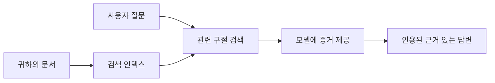

# 문서 기반 질문 응답을 위한 AI 교육:
## 시리즈 1: RAG, Azure vs 오픈 소스 대안, 그리고 파인튜닝이 적절한 시기

> 2023년 Azure AI Search + Azure OpenAI 문서 QA 튜토리얼을 2026년에 다시 살펴보는 첫 번째 글입니다.

## 1. 소개 - 이전 RAG 튜토리얼 다시 보기

2023년, 저는 Azure AI Search와 Azure OpenAI를 사용하여 PDF 문서에서 질문에 답변하도록 ChatGPT를 가르치는 튜토리얼 두 편을 작업했습니다. [LangChain 버전](https://techcommunity.microsoft.com/blog/educatordeveloperblog/teach-chatgpt-to-answer-questions-using-azure-ai-search--azure-openai-lang-chain/3969713)을 썼고, 또한 마이크로소프트의 수석 클라우드 옹호자 매니저인 [Lee Stott](https://developer.microsoft.com/en-us/advocates/lee-stott)와 함께 [Semantic Kernel 버전](https://techcommunity.microsoft.com/blog/educatordeveloperblog/teach-chatgpt-to-answer-questions-using-azure-ai-search--azure-openai-semantic-k/3985395)을 공동 집필했습니다. 당시 "내 데이터에 ChatGPT 적용"이라는 개념은 많은 개발자에게 여전히 새로웠습니다. 튜토리얼은 Azure Blob Storage, Azure AI Search, Azure OpenAI, LangChain, Semantic Kernel, 그리고 FAISS 스타일의 벡터 검색을 사용하여 PDF 파일에서 질문에 답했습니다.

그 이전 글은 간단하지만 중요한 워크플로우에 중점을 두었습니다: 문서 업로드, 인덱싱, 관련 콘텐츠 검색, 모델에 해당 내용을 기반으로 답변 요청.

2026년 현재, RAG 생태계는 크게 성장했습니다. Azure AI Search는 이제 현대적 벡터 및 하이브리드 검색 패턴을 지원하며, Azure OpenAI는 마이크로소프트 Foundry Models 생태계의 일부이고, 최신 v1 API는 매월 `api-version` 변경 없이 표준 OpenAI 클라이언트를 사용할 수 있습니다. 동시에 LangGraph, LlamaIndex, Haystack, Qdrant, Milvus, Weaviate, Chroma, Ollama, vLLM 같은 오픈 소스 옵션도 실제 RAG 시스템에 실용적인 선택지가 되었습니다.

그래서 이 주제를 다시 살펴보고 싶었습니다. 이제 질문은 단순히 "RAG를 어떻게 만들지?"가 아니라, 여러 방법이 생겼고, 더 중요한 질문은 "내 상황에 어떤 아키텍처가 적합할까?"입니다.

하지만 핵심 문제는 변하지 않았습니다.

AI 모델은 자동으로 당신의 문서를 알지 못합니다. 유용한 문서 기반 질문 응답 시스템을 구축하려면 여전히 신뢰할 수 있는 검색, 근거 제시, 평가, 운영 워크플로우가 필요합니다.

이 글은 또 다른 PDF와 ‘대화하는’ 완전한 엔드 투 엔드 튜토리얼이 아닙니다. 이제 제가 더 관심을 가지는 질문으로 시작하고자 합니다: 관리형 Azure 아키텍처를 선택할 때, 오픈 소스 RAG 스택을 선택할 때, 그리고 언제 파인튜닝이 실제로 적절한가?

이것은 문서 기반 AI 시스템 구축 시리즈의 첫 번째 글입니다. 이 첫 부분에서는 아키텍처 결정에 대해 집중할 것입니다: 왜 RAG가 중요한지, Azure 관리형 서비스가 유용한 경우, 오픈 소스 대안이 적합한 경우, 그리고 파인튜닝이 어디에 들어가는지.

문서 QA 시스템을 구축하고 다시 검토하면서, 데모에서 어떤 도구가 좋아 보이는지보다 실제 사용자, 문서 변경, 권한, 장애, 유지보수를 견디는 아키텍처에 더 관심이 생겼습니다.

## 2. AI에 검색 시스템이 필요한 이유

대규모 언어 모델은 광범위한 공개 및 라이센스 데이터로 학습됩니다. 일반적인 주제에 대해 많이 알 수 있지만, 당신의 비공개 PDF, 내부 정책, 기업 절차, 연구 자료, 수업 자료, 고객 지원 메모 또는 최근 업데이트된 문서를 자동으로 알지는 못합니다.

RAG를 이해하는 간단한 방법은 이렇습니다: 모델이 모든 문서를 기억하기를 기대하지 말고, 검색 시스템을 제공합니다. 사용자가 질문하면, 시스템은 먼저 가장 관련성 높은 정보를 찾고, 그 정보를 모델에 컨텍스트로 제공합니다.

이것이 중요한 이유는 많은 실제 지식 출처가 비공개이고, 계속 변하며, 권한에 민감하고, 여러 시스템에 나뉘어 저장되어 있고, 다양한 형식으로 작성되어 있으며, 너무 커서 프롬프트에 직접 붙여넣기 어렵기 때문입니다.

예를 들어 학교, 회사, 연구팀에 10,000개의 내부 문서가 있다면, 모델이 문서에서 신뢰성 있게 답변하려면 적절한 부분을 적시에 검색해야 합니다.

이로 인해 흔한 질문이 자연스럽게 나옵니다:

왜 그냥 파인튜닝하지 않나요?

파인튜닝도 유용하지만, 문서 지식에 대한 첫 번째 도구로는 보통 적합하지 않습니다. 지식이 자주 변경되거나, 인용이 중요하거나, 액세스 권한이 중요한 경우, RAG가 더 나은 시작점입니다. 파인튜닝은 행동, 스타일, 출력 형식, 작업 패턴 교육에 더 적합합니다.

## 3. 실제 RAG 아키텍처

학교용 AI 어시스턴트를 만든다고 상상해 보십시오. 어시스턴트는 정책 PDF, 강의 안내서, 내부 FAQ 페이지, 최근 공지에서 질문에 답해야 합니다.

학생이 "최종 과제에 생성 AI를 사용해도 되나요?"라고 묻는다면, 시스템은 모델의 일반 기억에서 답변해서는 안 됩니다. 먼저 관련 학교 정책을 찾고, AI 사용에 관한 부분을 검색한 후, 그 증거를 바탕으로 모델에 답변을 요청해야 합니다.

이것이 실제 RAG입니다.

높은 수준에서 흐름은 다음과 같습니다:

세부사항은 더 정교해질 수 있지만 기본 생각은 간단합니다: 모델이 혼자 답하지 않습니다. 검색한 증거와 함께 답변합니다.

먼저 문서를 Azure Blob Storage, SharePoint, GitHub, 내부 CMS 같은 저장 시스템에서 수집합니다. 그런 다음 문서를 텍스트로 파싱하되 제목, 페이지 번호, 표, 섹션, 출처 위치 같은 유용한 구조를 보존합니다.

다음, 콘텐츠를 청크로 나눕니다. 이 단계는 간단해 보이나 가장 중요한 부분 중 하나입니다. 청크가 너무 작으면 주변 문맥을 잃을 수 있고, 너무 크면 관련 없는 정보가 포함되어 검색 정확도가 떨어질 수 있습니다.

청크 분할 후, 시스템은 임베딩을 생성하고 원본 텍스트 및 파일명, 페이지 번호, 권한, 문서 버전, 출처 URL 같은 메타데이터와 함께 검색 가능한 인덱스에 저장합니다.

사용자가 질문하면 시스템은 키워드 검색, 벡터 검색 또는 하이브리드 검색을 사용해 후보 청크를 검색합니다. 재정렬기가 그런 청크들을 재배치해 가장 유용한 증거가 상단에 오도록 할 수 있습니다.

마지막으로, 모델에 질문과 검색된 증거를 전달합니다. 답변은 그 증거에 근거해야 하며, 사용자가 출처를 확인할 수 있도록 인용을 포함해야 합니다.

중요한 점은 RAG가 단순히 "PDF를 벡터 데이터베이스에 넣는 것"이 아니라는 것입니다. 답변 품질은 전체 워크플로우: 파싱, 청크 분할, 검색, 재정렬, 프롬프트 작성, 인용, 평가에 달려 있습니다.

그래서 문서 구조가 중요합니다. PDF에서 제목, 표, 각주, 페이지 구분은 구문의 의미를 바꿀 수 있습니다. Azure에서는 Document Layout 스킬이 Azure Document Intelligence의 레이아웃 기능을 사용해 구조 인식 출력을 만들어, RAG 시스템의 청크 분할과 검색 품질을 향상시킵니다.

## 4. 2023년 이후 무엇이 바뀌었나?

2023년 튜토리얼은 그 당시 좋은 출발점이었습니다:

- Azure Blob Storage에 PDF 파일 저장.
- Azure AI Search가 콘텐츠 인덱싱.
- LangChain이 검색과 Azure OpenAI 연결.
- FAISS가 간단한 로컬 벡터 저장소 역할.
- 예제로 `gpt-35-turbo`와 `text-embedding-ada-002` 사용.

2026년 현재, 최신 버전은 몇 가지 변화를 반영해야 합니다.

첫째, 검색 기술이 성숙해졌습니다. 2023년엔 많은 데모가 단순 벡터 유사성 검색을 사용했으나 오늘날에는 심도 있는 문서 QA의 기본 시작점으로 하이브리드 검색이 일반적입니다. Azure AI Search는 키워드 검색과 벡터 검색을 하나의 요청으로 결합한 하이브리드 검색을 지원하고, Reciprocal Rank Fusion으로 결과를 병합합니다. 시맨틱 랭커를 통해 원문, 벡터, 하이브리드 결과의 텍스트 측면을 재정렬할 수 있습니다.

둘째, 수집(인제스션)이 더 정교해졌습니다. 매번 애플리케이션 코드로 문서를 수동 분할하는 대신, Azure AI Search는 청크 분할, 임베딩 생성, 쿼리 시 임베딩을 통합 벡터화로 지원합니다. PDF 및 문서 중심 작업에서는 Document Layout 스킬이 고정 크기 청크보다 더 많은 구조 정보를 보존합니다.

셋째, 오케스트레이션의 중요성이 커졌습니다. 어려운 부분은 대개 LLM API 호출 자체가 아닙니다. 실패 처리, 재시도, 오래된 검색 결과, 청크 품질, 장기 실행 워크플로우, 사람 검토, 대규모 평가 처리 등입니다. 여기서 LangGraph, LlamaIndex 워크플로우, Haystack 파이프라인, 플랫폼 수준 평가 및 관측 도구 같은 워크플로우 지향 도구가 단일 선형 체인보다 더 적합해집니다.

넷째, 평가가 더 이상 선택 사항이 아닙니다. 데모는 한 번 질문으로 인상적일 수 있지만, 실제 프로덕션 시스템에는 테스트 세트, 회귀 검사, 검색 메트릭, 근거 검증 및 모니터링이 필요합니다. 평가 없이는 시스템이 개선 중인지 아니면 단순히 변한 것인지 알기 어렵습니다.

## 5. Azure와 오픈 소스 RAG 스택 사이 선택하기

유용한 질문은 "Azure가 오픈 소스보다 더 좋은가?" 또는 "오픈 소스가 Azure보다 더 좋은가?"가 아닙니다.

유용한 질문은: 어떤 종류의 시스템을 만드는가, 누가 운영하는가, 어떤 제약이 있는가, 어떤 오류 모드가 용납되지 않는가? 입니다.

처음 문서 QA 예제를 만들 때는 주로 검색이 작동하는지 여부를 생각했습니다. PDF를 업로드하고, 검색하고, 답변을 생성할 수 있나? 그게 합리적 시작점이었습니다.

더 현실적인 AI 워크플로우를 경험한 후 평가 기준이 바뀌었습니다. 이제는 RAG 스택을 선택하기 전에 다음 네 가지를 봅니다:

- 신원 및 권한
- 검색 품질
- 워크플로우 신뢰성
- 운영 소유권

이 네 가지는 모델 벤치마크만 보는 것보다 훨씬 더 많은 것을 알려줍니다.

엔터프라이즈 통합이 어려운 부분일 때 Azure 기반 아키텍처가 보통 적합합니다. 이미 팀에서 Microsoft Entra ID, Microsoft 365, Azure Storage, 프라이빗 네트워킹, RBAC, Azure 모니터링에 의존 중이라면, Azure AI Search와 Azure OpenAI는 운영 복잡성을 크게 줄일 수 있습니다. 그 환경에서 Azure는 단순 모델 API가 아니라 신원, 거버넌스, 관리형 검색, 보안 통합, 지원, 익숙한 운영 체계 같은 주위 시스템의 가치가 더 큽니다.

유연성이 중요한 경우에는 오픈 소스 아키텍처가 적합한 경우가 많습니다. 팀이 로컬 추론, 클라우드 이식성, 맞춤 검색 파이프라인, 특수 재정렬, 벡터 DB 및 모델 서빙 계층 직접 제어를 원할 때, 오픈 소스 스택이 더 맞을 수 있습니다. 단점은 백업, 확장, 지연, 마이그레이션, 모니터링, 보안 등 신뢰성 관리 대부분을 팀이 직접 책임져야 한다는 점입니다.

실제로 많은 프로덕션 AI 시스템은 순수 클라우드 네이티브도, 순수 오픈 소스도 아닙니다. 운영 단순성, 이식성, 거버넌스, 엔지니어링 유연성 사이 균형을 맞춘 하이브리드 시스템인 경우가 많습니다.

예를 들어, 모델 액세스용 Azure OpenAI, 워크플로우 오케스트레이션용 LangGraph, 배포용 Azure 호스팅, 특정 검색 요구사항에 대해 오픈 소스 벡터 DB를 함께 사용하는 시스템도 있을 수 있습니다. 이것은 아키텍처 불일치가 아니라, 시스템 각 부분에 맞는 적정 관리형 서비스와 엔지니어링 제어 수준을 선택한 것입니다.

저는 관리형 플랫폼이 중요한 엔터프라이즈 문제를 해결하고, 오픈 소스 구성 요소가 실제로 중요한 부분에서 팀에 유연성을 주는 하이브리드 아키텍처를 선호합니다.

## 6. 실제 결정 가이드

RAG 스택 선택 전에 팀과 함께 사용할 결정표는 다음과 같습니다:

| 결정 영역 | Azure 관리형 스택이 강할 때... | 오픈 소스 스택이 강할 때... |
| --- | --- | --- |
| 신원 및 접근 | Entra ID, RBAC, 관리형 신원, 기업 권한 중심 | 커스텀 인증, 비마이크로소프트 신원, 앱별 접근 로직 중심 |
| 운영 | 팀이 관리형 인프라, 지원, SLA, 간편 온보딩을 원할 때 | 팀이 벡터 DB, 모델 서빙, 백업, 확장 운영 가능할 때 |
| 검색 | 하이브리드 검색, 시맨틱 랭킹, 필터, 메타데이터 검색으로 대부분 요구 충족 가능할 때 | 팀이 맞춤 검색, 특수 재정렬, 실험적 인덱싱 필요할 때 |
| 이식성 | Azure 생태계 일치가 허용되거나 선호될 때 | 클라우드 종속을 피하는 것이 필수일 때 |
| 추론 | Azure OpenAI 거버넌스, 네트워킹, 엔터프라이즈 제어가 중요할 때 | 로컬 추론, 맞춤 모델, 자체 호스팅 서빙이 필요할 때 |
| 비용 | 엔지니어링 및 운영 노력 경감이 인프라 튜닝보다 중요할 때 | 규모가 커서 인프라 최적화가 정당화될 때 |
| 실험 | 안정성 및 기업 통합이 구성 요소 빈번한 변경보다 중요할 때 | 팀이 에이전트, 도구, 메모리, 검색 워크플로우를 빠르게 반복할 때 |

간단한 경험 법칙은:

- 기업 통합, 보안, 운영 단순성이 주요 위험이라면 Azure로 시작.
- 이식성, 맞춤화, 로컬 제어가 주요 위험이라면 오픈 소스로 시작.
- 둘 다 해당되면 하이브리드 스택 사용.

그래서 2026년 RAG 시리즈를 코드부터 시작하지 않는 이유도 여기에 있습니다. 코드는 중요하지만 아키텍처 선택이 구현보다 앞서야 합니다. 간단한 데모는 가장 어려운 선택을 숨길 수 있습니다. 좋은 RAG 시스템은 그 선택을 명확히 합니다.

## 7. 파인튜닝의 역할

파인튜닝은 종종 RAG와 함께 언급되지만, 둘을 분리하는 것이 중요합니다.

시스템이 최신, 비공개, 권한 민감, 출처 기반 지식을 필요로 할 때 보통 RAG가 더 나은 선택입니다. 답변이 문서를 인용하거나 최근 업데이트를 반영하거나 사용자별 접근 규칙을 존중해야 한다면 검색이 아키텍처의 일부여야 합니다.

파인튜닝은 지식이 주된 문제가 아닐 때 더 유용합니다. 특정 출력 형식을 따르거나, 도메인 특화 응답 스타일에 맞추거나, 안정적인 작업을 더 일관되게 수행하거나, 매 프롬프트마다 필요한 지시량을 줄이고자 할 때 도움됩니다.
실제로 두 가지는 함께 작동할 수 있습니다. 지원 어시스턴트는 RAG를 사용하여 최신 정책을 검색할 수 있으며, 미세 조정된 모델은 회사가 선호하는 답변 구조와 톤을 학습할 수 있습니다.

잘못된 점은 미세 조정을 문서 저장소의 대체물로 간주하는 것입니다. 시스템이 새롭고 개인적이며 권한이 필요한 데이터에서 답변해야 할 때에는 검색이 여전히 필요하므로 미세 조정이 그 필요성을 없애지 않습니다.

## 8. 이 시리즈의 다음 방향

이 글은 의사 결정 계층입니다. 코드를 작성하기 전에 트레이드오프를 명확히 하고자 했습니다: RAG 대 미세 조정, Azure 대 오픈 소스, 관리형 서비스 대 운영 제어.

구현으로 넘어가기 전에 한 가지를 남기고자 합니다: 많은 엔터프라이즈 AI 시스템에서 모델은 단지 하나의 구성요소일 뿐입니다. 검색 품질, 오케스트레이션, 평가, 권한, 운영 신뢰성이 데모 단계를 넘어서 시스템이 성공하는지 여부를 결정하는 경우가 많습니다.

이 시리즈의 다음 부분에서는 문서 기반 AI 시스템의 실제적인 측면에 더 깊이 들어갈 계획입니다: Azure 기반 아키텍처 구축 방법, 오픈 소스 대안의 실제 비교, 그리고 RAG 시스템이 실제로 작동하는지 평가하는 방법 등을 다룰 것입니다.

시리즈가 진행됨에 따라 순서를 조정할 수도 있지만 목표는 동일하게 유지할 것입니다: 단순한 데모를 넘어서 지속 가능하고 평가 가능하며 운영 가능한 RAG 시스템에 대해 고민하는 방법을 보여주는 것입니다.

## 9. 참고 문헌 및 자료

원본 튜토리얼:

- [Teach ChatGPT to Answer Questions: Using Azure AI Search & Azure OpenAI (Lang Chain)](https://techcommunity.microsoft.com/blog/educatordeveloperblog/teach-chatgpt-to-answer-questions-using-azure-ai-search--azure-openai-lang-chain/3969713)
- [Teach ChatGPT to Answer Questions: Using Azure AI Search & Azure OpenAI (Semantic Kernel)](https://techcommunity.microsoft.com/blog/educatordeveloperblog/teach-chatgpt-to-answer-questions-using-azure-ai-search--azure-openai-semantic-k/3985395)

Azure:

- [Azure AI Search REST API versions](https://learn.microsoft.com/en-us/rest/api/searchservice/search-service-api-versions)
- [Hybrid search in Azure AI Search](https://learn.microsoft.com/en-us/azure/search/hybrid-search-how-to-query)
- [Integrated vectorization in Azure AI Search](https://learn.microsoft.com/en-us/azure/search/vector-search-integrated-vectorization)
- [Document Layout skill in Azure AI Search](https://learn.microsoft.com/en-us/azure/search/cognitive-search-skill-document-intelligence-layout)
- [Chunk and vectorize by document layout](https://learn.microsoft.com/en-us/azure/search/search-how-to-semantic-chunking)
- [Semantic ranking in Azure AI Search](https://learn.microsoft.com/en-us/azure/search/semantic-search-overview)
- [Azure OpenAI / Microsoft Foundry API version lifecycle](https://learn.microsoft.com/en-us/azure/foundry/openai/api-version-lifecycle)
- [Foundry Models sold by Azure](https://learn.microsoft.com/en-us/azure/foundry/foundry-models/concepts/models-sold-directly-by-azure)
- [Microsoft Foundry fine-tuning considerations](https://learn.microsoft.com/en-us/azure/foundry/openai/concepts/fine-tuning-considerations)
- [Microsoft Foundry observability](https://learn.microsoft.com/en-us/azure/foundry/concepts/observability)
- [Run evaluations in Microsoft Foundry](https://learn.microsoft.com/en-us/azure/foundry/how-to/evaluate-generative-ai-app)

오픈 소스:

- [LangGraph documentation](https://docs.langchain.com/oss/python/langgraph/overview)
- [LlamaIndex documentation](https://developers.llamaindex.ai/python/framework/)
- [Haystack documentation](https://docs.haystack.deepset.ai/)
- [Qdrant documentation](https://qdrant.tech/documentation/overview/)
- [Milvus documentation](https://milvus.io/docs/overview.md)
- [Weaviate documentation](https://docs.weaviate.io/weaviate/current/)
- [Chroma documentation](https://docs.trychroma.com/docs/overview/introduction)
- [Ollama embeddings](https://docs.ollama.com/capabilities/embeddings)
- [vLLM OpenAI-compatible server](https://docs.vllm.ai/en/latest/serving/openai_compatible_server.html)
- [BGE embedding models](https://huggingface.co/BAAI/bge-large-en-v1.5)
- [E5 embedding models](https://huggingface.co/intfloat/e5-large-v2)
- [Instructor embedding models](https://huggingface.co/hkunlp/instructor-large)

---

<!-- CO-OP TRANSLATOR DISCLAIMER START -->
**면책 조항**:
이 문서는 AI 번역 서비스 [Co-op Translator](https://github.com/Azure/co-op-translator)를 사용하여 번역되었습니다. 정확성을 기하기 위해 노력하고 있으나, 자동 번역은 오류나 부정확한 부분이 있을 수 있음을 유의하시기 바랍니다. 원본 문서의 원어본이 권위 있는 자료로 간주되어야 합니다. 중요한 정보의 경우, 전문가의 인간 번역을 권장합니다. 이 번역 사용으로 인해 발생하는 오해나 잘못된 해석에 대해 당사는 책임을 지지 않습니다.
<!-- CO-OP TRANSLATOR DISCLAIMER END -->