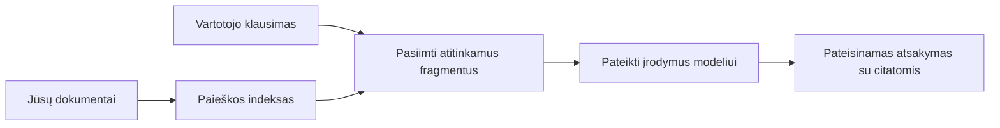

# Išmokykite DI atsakyti į klausimus pagal jūsų dokumentus:
## 1 serija: RAG, Azure prieš atvirojo kodo alternatyvas ir kada prasminga atlikti tikslinį mokymą

> Pirmasis 2026 metų serijos straipsnis, peržiūrintis mano 2023 metų Azure AI Search + Azure OpenAI dokumentų klausimų-atsakymų pamokas.

Serijos navigacija: [Sąrašo pradžia](../README.md) | Toliau: [2 serija - Sukurkite vietinę atvirojo kodo RAG sistemą nuo pradžios iki pabaigos](./series-2-open-source-rag-end-to-end.md)

## 1. Įvadas – ankstesnės RAG pamokos peržiūra

2023 metais aš dirbau su dviem pamokomis apie tai, kaip išmokyti ChatGPT atsakyti į klausimus iš PDF dokumentų naudojant Azure AI Search ir Azure OpenAI. Aš parašiau [LangChain versiją](https://techcommunity.microsoft.com/blog/educatordeveloperblog/teach-chatgpt-to-answer-questions-using-azure-ai-search--azure-openai-lang-chain/3969713), taip pat bendradarbiavau kuriant papildomą [Semantic Kernel versiją](https://techcommunity.microsoft.com/blog/educatordeveloperblog/teach-chatgpt-to-answer-questions-using-azure-ai-search--azure-openai-semantic-k/3985395) kartu su [Lee Stott](https://developer.microsoft.com/en-us/advocates/lee-stott), Microsoft pagrindiniu debesijos advokatu. Tuo metu „ChatGPT ant jūsų duomenų“ idėja daugeliui kūrėjų dar buvo naujiena. Pamokos naudojo Azure Blob Storage, Azure AI Search, Azure OpenAI, LangChain, Semantic Kernel ir FAISS tipo vektorinį atpažinimą atsakymams gauti iš PDF failų.

Ankstesnis straipsnis buvo sutelktas į paprastą, bet svarbų darbo eigą: įkelti dokumentus, indeksuoti juos, gauti atitinkamą turinį ir paprašyti modelio atsakyti remiantis tuo turiniu.

2026 metais RAG ekosistema stipriai išaugo. Azure AI Search dabar palaiko modernius vektorių ir hibridinius paieškos modelius, Azure OpenAI yra integruotas į platesnę Microsoft Foundry Models ekosistemą, o naujesnis v1 API leidžia naudoti standartinį OpenAI klientą be būtinybės kas mėnesį keisti `api-version`. Tuo pačiu, atvirojo kodo sprendimai, tokie kaip LangGraph, LlamaIndex, Haystack, Qdrant, Milvus, Weaviate, Chroma, Ollama ir vLLM, tapo praktiškomis galimybėmis realioms RAG sistemoms.

Todėl norėjau dar kartą aptarti šią temą. Klausimas dabar ne tik „Kaip sukurti RAG?“. Dabar yra daug būdų jį sukurti, o svarbesnis klausimas yra „Kokią architektūrą pasirinkti mano situacijai?“

Tačiau pagrindinė problema nepasikeitė.

DI modelis savaime nežino jūsų dokumentų. Norint sukurti naudingą dokumentų klausimų-atsakymų sistemą, vis dar reikalingi patikimi paieškos, pagrindimo, vertinimo ir operaciniai procesai.

Šis straipsnis nėra dar viena „chat su PDF“ pamoka nuo pradžios iki galo. Noriu pradėti šią atnaujintą seriją su man dabar svarbesniu klausimu: kada verta rinktis valdomą Azure architektūrą, kada – atvirojo kodo RAG rinkinį, o kada tikslinis mokymas iš tiesų yra prasmingas?

Tai pirmasis straipsnis apie dokumentais grįstų DI sistemų kūrimą. Šio pirmojo dalyko fokusas bus architektūros sprendimai: kodėl RAG svarbus, kada naudingi Azure valdomi servisai, kada prasmingos atvirojo kodo alternatyvos ir kur derėtų taikyti tikslinį mokymą.

Per kūrimo ir dokumentų QA sistemų peržiūrą aš pradėjau mažiau domėtis, kuris įrankis atrodo geriau demonstracijoje, o labiau – kuri architektūra ištveria tikrus vartotojus, kintančius dokumentus, leidimus, gedimus ir priežiūrą.

## 2. Kodėl jūsų DI reikia paieškos sistemos

Dideli kalbos modeliai mokomi plačių viešųjų ir licencijuotų duomenų rinkinių pagrindu. Jie gali žinoti daug apie bendras temas, bet savaime nežino jūsų privačių PDF failų, vidinių politikų, įmonių procedūrų, tyrimų archyvų, klasės medžiagos, klientų palaikymo pastabų ar neseniai atnaujintos dokumentacijos.

Paprastas būdas suprasti RAG yra toks: vietoj to, kad tikėtumėtės, jog modelis atsimins kiekvieną dokumentą, mes jam suteikiame paieškos sistemą. Kai vartotojas užduoda klausimą, sistema pirmiausia suranda aktualiausias informacijos dalis, o tada pateikia jas modeliui kaip kontekstą.

Tai svarbu, nes daugelis realių žinių šaltinių yra privačios, nuolat kinta, jautrios leidimams, saugomos keliose sistemose, rašytos įvairiais formatais ir yra per didelės, kad būtų galima tiesiogiai įklijuoti į užklausą.

Pavyzdžiui, jei mokykla, įmonė ar tyrimų komanda turi 10 000 vidinių dokumentų, modelis negalės patikimai atsakyti iš jų, nebent sistema laiku atgaus tinkamas dalis.

Tai natūraliai veda prie dažnai užduodamo klausimo:

Kodėl gi ne tiksliai nemokyti modelio?

Tikslinis mokymas gali būti naudingas, bet dažniausiai nėra tinkamas pirmas įrankis dokumentų žinioms. Jei žinios dažnai keičiasi, jei svarbūs citatos ar prieigos leidimai, RAG dažnai yra geresnė pradžia. Tikslinis mokymas labiau tinka elgesio, stiliaus, išėjimo formato ir užduočių schemų mokymui.

## 3. RAG architektūra praktikoje

Įsivaizduokite, kad kuriate DI asistentą mokyklai. Šis asistentas turi atsakyti į klausimus iš politikos PDF failų, kursų vadovų, vidinių DUK puslapių ir neseniai atnaujintų pranešimų.

Jei mokinys klausia: „Ar galiu naudoti generatyvią DI savo baigiamajam darbui?“, sistema neturėtų atsakyti remdamasi bendru modelio atminties turiniu. Ji pirmiausia turėtų surasti atitinkamą mokyklos politiką, gauti skyrių apie DI naudojimą ir tik tada paprašyti modelio atsakyti naudodama tą įrodymą.

Tai yra RAG praktikoje.

Plačiau, darbo eiga gali atrodyti taip:

Detalės gali būti sudėtingesnės, bet pagrindinė idėja paprasta: modelis neatsako vienas. Jis atsako remdamasis surinktais įrodymais.

Pirmiausia dokumentai įtraukiami iš saugojimo sistemų kaip Azure Blob Storage, SharePoint, GitHub ar vidinio CMS. Tada sistema juos analizuoja į tekstą išlaikydama naudingą struktūrą, tokią kaip antraštės, puslapio numeriai, lentelės, skyriai ir šaltinių vietos.

Toliau turinys skaidomas į dalis. Šis žingsnis atrodo paprastas, bet yra vienas svarbiausių sistemos elementų. Jei dalis per maža, prarandamas aplinkinis kontekstas. Jei per didelė, gali būti įtraukta nesusijusi informacija, o paieška tampa mažiau tiksli.

Po dalijimo suformuojami įdėjiniai vektoriai ir saugomi paieškos indekse kartu su originaliu tekstu ir metaduomenimis, tokiais kaip failo pavadinimas, puslapio numeris, leidimai, dokumento versija ir šaltinio URL.

Kai vartotojas užduoda klausimą, sistema surenka tinkamas dalis naudodama raktinių žodžių, vektorų arba hibridinės paieškos metodus. Pervertintojas (reranker) gali pertvarkyti šias dalis, kad naudingiausi įrodymai būtų aukščiausi.

Galiausiai modelis gauna klausimą ir surinktus įrodymus. Atsakymas turi būti grindžiamas tuo įrodymu ir pateikti citatas, kad vartotojas galėtų peržiūrėti šaltinį.

Svarbiausia yra tai, kad RAG nėra vien „įdėk PDF į vektorinę duomenų bazę“. Atsakymo kokybė priklauso nuo visos darbo eigos: analizės, skaidymo, paieškos, pervertinimo, užklausos sudarymo, citavimo ir vertinimo.

Todėl dokumento struktūra svarbi. PDF faile antraštė, lentelė, paantraštė ar puslapio riba gali pakeisti teksto prasmę. Azure aplinkoje Document Layout įgūdis naudoja Azure Document Intelligence maketavimo galimybes, kad gautų struktūrizuotą išvestį, pagerinančią teksto skaidymą ir paieškos kokybę RAG sistemose.

## 4. Kas pasikeitė nuo 2023 metų?

2023 metų pamoka buvo gera pradžia savo laikui:

- Azure Blob Storage saugojo PDF failus.
- Azure AI Search indeksavo turinį.
- LangChain susiejo paiešką su Azure OpenAI.
- FAISS veikė kaip paprasta lokali vektorinė saugykla.
- Pavyzdyje naudotas `gpt-35-turbo` ir `text-embedding-ada-002`.

2026 metais modernesnė versija turėtų atspindėti kelis pokyčius.

Pirma, paieška patobulėjo. 2023 metais daugelyje demonstracijų naudotas paprastas vektorinis panašumo paieškos metodas. Šiandien hibridinė paieška dažnai yra rimtos dokumentų QA pradžia. Azure AI Search palaiko hibridinę paiešką, sujungdama raktinių žodžių ir vektorių užklausas į vieną ir derindama rezultatus Reciprocal Rank Fusion būdu. Semantinis įvertintojas gali pertvarkyti viso teksto, vektorių ir hibridinių rezultatų tekstinę pusę.

Antra, įtraukiamumas tapo pažangesnis. Vietoj rankinio kiekvieno dokumento skaidymo programos kodu, Azure AI Search palaiko integruotą vektorizaciją dalims skaidyti, įdėjiniams kurti ir užklausų metu vektorizuoti. PDF ir dokumentais intensyvioms darbo apkrovoms Document Layout įgūdis leidžia išlaikyti daugiau struktūros nei fiksuotų dydžių dalys.

Trečia, orchestracija tampa svarbesnė. Sunkioji dalis dažnai nėra pats LLM API kvietimas. Sunkioji dalis yra atlaikyti gedimus, kartojimus, pasenusią paiešką, dalių kokybę, ilgai trunkančius procesus, žmogaus peržiūrą ir mastelio vertinimą. Čia darbo eigai orientuoti įrankiai kaip LangGraph, LlamaIndex workflow, Haystack pipeline ir platforminiai vertinimo bei stebėjimo įrankiai tampa svarbesni nei vienas linijinis grandinės procesas.

Ketvirta, vertinimas nebėra neprivalomas. Vienas klausimas gali atrodyti įspūdingai demonstracijoje. Gamybinei sistemai reikia testų rinkinių, regresinių patikrinimų, paieškos metrikų, pagrįstumo patikrinimų ir stebėsenos. Be vertinimo sunku suprasti, ar sistema tobulėja, ar tiesiog keičiasi.

## 5. Kaip pasirinkti tarp Azure ir atvirojo kodo RAG rinkinių

Nematau prasmingo klausimo „Ar Azure geresnis už atvirąjį kodą?“ ar „Ar atvirasis kodas geresnis už Azure?“.

Svarbesnis klausimas yra: kokią sistemą kuriate, kas ją valdys, kokie yra jūsų apribojimai ir kokie gedimo scenarijai yra nepriimtini?

Pradėjus kurti dokumentų QA pavyzdžius daugiausia galvojau apie tai, ar paieška veikia. Ar galiu įkelti PDF, jų ieškoti ir sugeneruoti atsakymą? Tai buvo racionali pradžia.

Dirbant su realistiškesnėmis DI darbo eigomis mano vertinimas pasikeitė. Dabar prieš renkantis RAG rinkinį žiūriu į keturias sritis:

- tapatybę ir leidimus
- paieškos kokybę
- darbo eigos patikimumą
- operacijų savininkystę

Šie keturi aspektai pasako gerokai daugiau nei vien tik modelio našumo testas.

Azure architektūros dažnai prasmingos, kai sunku integruoti įmonės aplinką. Jei komanda jau naudoja Microsoft Entra ID, Microsoft 365, Azure Storage, privatų tinklą, RBAC ir Azure stebėseną, Azure AI Search ir Azure OpenAI gali ženkliai sumažinti operacinę sudėtingumą. Tokioje aplinkoje Azure yra ne vien modelio API. Vertė yra supančioje sistemoje: tapatybėje, valdyme, valdomoje paieškoje, saugumo integracijoje, palaikyme ir pažįstamose operacijose.

Atvirojo kodo architektūros dažnai verta rinktis, kai svarbi lankstumas. Jei komandai reikia vietinės inferencijos, debesis keičiamos aplinkos (portabilumo), individualios paieškos grandinės, specializuoto pervertinimo ar tiesioginės kontrolės vektorinės duomenų bazės ir modeliavimo sluoksnio, atvirojo kodo rinkinys gali būti tinkamiausias. Tai reiškia, kad komanda pati atsako už patikimumą – atsargines kopijas, mastelį, delsą, migracijas, stebėjimą ir saugumą.

Praktiškai daugelis gamybinių DI sistemų nėra vien debesis arba vien atvirasis kodas. Jos dažnai yra hibridinės, subalansuojančios operacinę paprastumą, portabilumą, valdymą ir inžinerinį lankstumą.

Pavyzdžiui, man būtų nenuostabu, jei sistema naudotų Azure OpenAI modeliui pasiekti, LangGraph darbo eigos koordinavimui, Azure talpinimui diegimui ir atvirojo kodo vektorinę duomenų bazę specifiniam paieškos poreikiui. Tai nėra architektūrinis neatitikimas. Tai yra tinkamo valdomo serviso ir inžinerinės kontrolės lygio pasirinkimas kiekviename sistemos etape.

Man patinka hibridinės architektūros, kai valdomos platformos sprendžia svarbias įmonės problemas, o atvirojo kodo komponentai suteikia komandai lankstumo ten, kur tai iš tiesų svarbu.

## 6. Praktinis sprendimų vadovas

Štai sprendimų lentelė, kurią naudoti su komanda renkantis RAG rinkinį:

| Sprendimo sritis | Azure valdomas rinkinys yra stipresnis, kai... | Atvirojo kodo rinkinys yra stipresnis, kai... |
| --- | --- | --- |
| Tapatybė ir prieiga | centriniai Entra ID, RBAC, valdomos tapatybės ir įmonių leidimai | vyrauja individuali autentifikacija, ne Microsoft tapatybė ar programos specifinė prieigos logika |
| Operacijos | komanda nori valdomos infrastruktūros, palaikymo, SLA ir paprastesnio įsivedimo | komanda gali valdyti vektorines duomenų bazes, modeliavimo tarnybą, atsargines kopijas ir mastelį |
| Paieška | hibridinė paieška, semantinis įvertinimas, filtrai ir metaduomenų paieška tenkina daugumą poreikių | komandai reikia individualios paieškos, specializuoto pervertinimo ar eksperimentinės indeksacijos |
| Portabilumas | priimtina arba pageidaujama Azure ekosistemos integracija | griežtai reikalaujama vengti debesies eilėraščio („lock-in“) |
| Inferencija | svarbus Azure OpenAI valdymas, tinklų valdymas ir įmonių kontrolė | būtina vietinė inferencija, individualūs modeliai arba savarankiškas talpinimas |
| Kaina | svarbu sumažinti inžinerinį ir operacinį krūvį, o ne infrastruktūros optimizavimą | mastas pakankamai didelis, kad apsimoktų infrastruktūros optimizavimas |
| Eksperimentavimas | svarbi stabilumas ir įmonių integracija, o ne dažni komponentų pakeitimai | komanda greitai iteruoja agentus, įrankius, atmintį ir paieškos procesus |

Mano taisyklė paprasta:

- Pradėkite nuo Azure, kai pagrindiniai rizikos veiksniai yra įmonių integracija, saugumas ir operacinė paprastumas.
- Pradėkite nuo atvirojo kodo, kai pagrindinės rizikos yra portabilumas, pritaikymas ar vietinė kontrolė.
- Naudokite hibridinį rinkinį, kai abi sąlygos pasitvirtina.

Todėl ir nekurčiau 2026 metų RAG serijos nuo kodo. Kode svarbu, bet architektūros pasirinkimas yra pirmesnis už įgyvendinimą. Paprasta demonstracija gali paslėpti sunkiausius sprendimus. Gera RAG sistema tuos sprendimus aiškiai apibrėžia.

## 7. Kur telpa tikslinis mokymas

Tikslinis mokymas dažnai minimas kartu su RAG, bet man svarbu juos atskirti.

RAG dažniausiai yra geresnis pasirinkimas, kai sistema reikalauja šviežių, privačių, leidimais ribojamų arba šaltiniu pagrįstų žinių. Jei atsakymas turi cituoti dokumentus, atspindėti neseniai atliktus atnaujinimus ar gerbti vartotojui būdingas prieigos taisykles, paieška turi būti architektūros dalis.
Smulkus modelio derinimas yra naudingesnis, kai žinių stoka nėra pagrindinė problema. Tai gali padėti, kai norite, kad modelis laikytųsi konkretaus išvesties formato, atitiktų tam tikros srities atsakymo stilių, nuosekliau atliktų stabilų uždavinį arba sumažintų reikiamą nurodymų skaičių kiekviename užklausoje.

Praktikoje šie du būdai gali derėti kartu. Pagalbos asistentas gali naudoti RAG, kad gautų naujausią politiką, o smulkiai derinamas modelis išmoksta įmonės pageidaujamą atsakymo struktūrą ir toną.

Klaida yra laikyti smulkų modelio derinimą kaip dokumentų saugyklos pakaitalą. Tai neatstoja poreikio ieškoti informacijos, kai sistema turi atsakyti remdamasi nauja, privačia ar teisiškai jautria informacija.

## 8. Kur eina ši serija toliau

Šis straipsnis yra sprendimų priėmimo sluoksnis. Prieš rašydamas kodą, norėjau aiškiai išdėstyti kompromisus: RAG prieš smulkų derinimą, Azure prieš atvirą šaltinį, valdomas paslaugas prieš operatyvų valdymą.

Prieš pereinant prie įgyvendinimo, noriu palikti vieną punktą: daugelio įmonių AI sistemose modelis yra tik viena dalis. Dažnai sėkmę virš demonstracinio etapo lemia duomenų gavimo kokybė, orkestracija, vertinimas, leidimai ir operacinis patikimumas.

Šios serijos tolimesnėse dalyse planuoju išsamiau aptarti dokumentais pagrįstų AI sistemų praktinę pusę: pirma sukurti vietinį atvirojo kodo RAG darbo srautą, tada rekonstruoti tą patį scenarijų su Azure AI Search ir Azure OpenAI, o vėliau įvertinti, ar sistema iš tikrųjų veikia.

Galiu keisti eiliškumą, kai serija vystysis, bet tikslas išliks tas pats: pereiti nuo paprastos demonstracijos ir parodyti, kaip galvoti apie RAG sistemas, kurias galima prižiūrėti, vertinti ir valdyti.

## 9. Nuorodos ir šaltiniai

Originalios pamokos:

- [Teach ChatGPT to Answer Questions: Using Azure AI Search & Azure OpenAI (Lang Chain)](https://techcommunity.microsoft.com/blog/educatordeveloperblog/teach-chatgpt-to-answer-questions-using-azure-ai-search--azure-openai-lang-chain/3969713)
- [Teach ChatGPT to Answer Questions: Using Azure AI Search & Azure OpenAI (Semantic Kernel)](https://techcommunity.microsoft.com/blog/educatordeveloperblog/teach-chatgpt-to-answer-questions-using-azure-ai-search--azure-openai-semantic-k/3985395)

Azure:

- [Azure AI Search REST API versijos](https://learn.microsoft.com/en-us/rest/api/searchservice/search-service-api-versions)
- [Hibridinis paieškos naudojimas Azure AI Search](https://learn.microsoft.com/en-us/azure/search/hybrid-search-how-to-query)
- [Integruota vektorizacija Azure AI Search](https://learn.microsoft.com/en-us/azure/search/vector-search-integrated-vectorization)
- [Dokumento maketo įgūdžiai Azure AI Search](https://learn.microsoft.com/en-us/azure/search/cognitive-search-skill-document-intelligence-layout)
- [Atkarpų išskyrimas ir vektorizavimas pagal dokumento maketą](https://learn.microsoft.com/en-us/azure/search/search-how-to-semantic-chunking)
- [Semantinis reitingavimas Azure AI Search](https://learn.microsoft.com/en-us/azure/search/semantic-search-overview)
- [Azure OpenAI / Microsoft Foundry API versijų gyvavimo ciklas](https://learn.microsoft.com/en-us/azure/foundry/openai/api-version-lifecycle)
- [Foundry modeliai, parduodami per Azure](https://learn.microsoft.com/en-us/azure/foundry/foundry-models/concepts/models-sold-directly-by-azure)
- [Microsoft Foundry smulkiojo derinimo svarstymai](https://learn.microsoft.com/en-us/azure/foundry/openai/concepts/fine-tuning-considerations)
- [Microsoft Foundry stebėsena](https://learn.microsoft.com/en-us/azure/foundry/concepts/observability)
- [Vertinimų vykdymas Microsoft Foundry](https://learn.microsoft.com/en-us/azure/foundry/how-to/evaluate-generative-ai-app)

Atvirasis kodas:

- [LangGraph dokumentacija](https://docs.langchain.com/oss/python/langgraph/overview)
- [LlamaIndex dokumentacija](https://developers.llamaindex.ai/python/framework/)
- [Haystack dokumentacija](https://docs.haystack.deepset.ai/)
- [Qdrant dokumentacija](https://qdrant.tech/documentation/overview/)
- [Milvus dokumentacija](https://milvus.io/docs/overview.md)
- [Weaviate dokumentacija](https://docs.weaviate.io/weaviate/current/)
- [Chroma dokumentacija](https://docs.trychroma.com/docs/overview/introduction)
- [Ollama įterptiniai](https://docs.ollama.com/capabilities/embeddings)
- [vLLM OpenAI suderinamas serveris](https://docs.vllm.ai/en/latest/serving/openai_compatible_server.html)
- [BGE įterptinių modeliai](https://huggingface.co/BAAI/bge-large-en-v1.5)
- [E5 įterptinių modeliai](https://huggingface.co/intfloat/e5-large-v2)
- [Instructor įterptinių modeliai](https://huggingface.co/hkunlp/instructor-large)

Toliau: [Serija 2 - Vietinės atvirojo kodo RAG sistemos kūrimas nuo pradžios iki pabaigos](./series-2-open-source-rag-end-to-end.md)

---

<!-- CO-OP TRANSLATOR DISCLAIMER START -->
**Atsakomybės apribojimas**:
Šis dokumentas buvo išverstas naudojant dirbtinio intelekto vertimo paslaugą [Co-op Translator](https://github.com/Azure/co-op-translator). Nors siekiame tikslumo, prašome atkreipti dėmesį, kad automatiniai vertimai gali turėti klaidų ar netikslumų. Originalus dokumentas jo gimtąja kalba laikomas autoritetingu šaltiniu. Svarbiai informacijai rekomenduojama naudoti profesionalų žmogiškąjį vertimą. Mes neatsakome už jokius nesusipratimus ar neteisingą interpretaciją, kilusią naudojantis šiuo vertimu.
<!-- CO-OP TRANSLATOR DISCLAIMER END -->