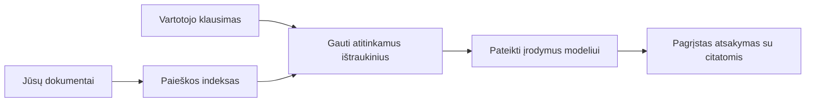

# Išmokykite DI atsakyti į klausimus pagal jūsų dokumentus:
## 1 serija: RAG, Azure prieš atvirojo kodo alternatyvas ir kada prasminga tobulinti modelį

> Pirmasis 2026 metų serijos straipsnis, peržiūrintis mano 2023 metų Azure AI Search + Azure OpenAI dokumentų klausimų ir atsakymų mokymus.

## 1. Įvadas – ankstesnio RAG mokymo kurso peržiūra

2023 metais dirbau prie dviejų mokymų apie tai, kaip išmokyti ChatGPT atsakyti į klausimus iš PDF dokumentų naudojant Azure AI Search ir Azure OpenAI. Aš parašiau [LangChain versiją](https://techcommunity.microsoft.com/blog/educatordeveloperblog/teach-chatgpt-to-answer-questions-using-azure-ai-search--azure-openai-lang-chain/3969713), taip pat kartu su [Lee Stott](https://developer.microsoft.com/en-us/advocates/lee-stott), Microsoft pagrindiniu debesijos advokato vadovu, bendradarbiavau prie papildomos [Semantic Kernel versijos](https://techcommunity.microsoft.com/blog/educatordeveloperblog/teach-chatgpt-to-answer-questions-using-azure-ai-search--azure-openai-semantic-k/3985395). Tuo metu daugeliui programuotojų idėja „ChatGPT tavo duomenyse“ dar atrodė nauja. Mokymai naudojo Azure Blob Storage, Azure AI Search, Azure OpenAI, LangChain, Semantic Kernel ir FAISS stiliaus vektorių paiešką, kad būtų galima atsakyti į klausimus iš PDF failų.

Tas ankstesnis straipsnis sutelktas į paprastą, bet svarbią eigą: įkelti dokumentus, sukurti indeksą, surasti aktualų turinį ir paprašyti modelio atsakyti remiantis tuo turiniu.

2026 metais RAG ekosistema reikšmingai išaugo. Azure AI Search dabar palaiko modernias vektorinės ir hibridinės paieškos schemas, Azure OpenAI yra dalis platesnės Microsoft Foundry Models ekosistemos, o naujesnis v1 API gali naudoti standartinį OpenAI klientą be būtinybės keisti kasmėnesinį `api-version`. Tuo pat metu atviro kodo sprendimai, tokie kaip LangGraph, LlamaIndex, Haystack, Qdrant, Milvus, Weaviate, Chroma, Ollama ir vLLM, tapo praktiškais pasirinkimais tikroms RAG sistemoms.

Dėl šios priežasties norėjau dar kartą peržiūrėti šią temą. Klausimas jau nebėra tik „Kaip sukurti RAG?“ Dabar yra daug būdų tai padaryti, o svarbesnis klausimas yra „Kurią architektūrą rinktis mano situacijai?“

Tačiau pagrindinė problema nepasikeitė.

DI modelis automatiškai nežino jūsų dokumentų. Kad sukurtumėte naudinga dokumentais pagrįstą klausimų ir atsakymų sistemą, jums vis dar reikia patikimos paieškos, pritaikymo, vertinimo ir eksploatacinių darbo eigų.

Šis straipsnis nėra dar vienas nuo pradžios iki galo „pokalbis su PDF“ mokymas. Noriu pradėti šią atnaujintą seriją nuo klausimo, kuris dabar man svarbesnis: kada rinktis valdomą Azure architektūrą, kada atvirojo kodo RAG rinkinį, ir kada iš tiesų verta naudoti modelio tobulinimą?

Tai pirmasis straipsnis apie dokumentais grindžiamų DI sistemų kūrimą. Šioje pirmoje dalyje daugiausia dėmesio skirsime architektūros sprendimams: kodėl svarbus RAG, kada naudingi valdomi Azure pagrindu veikiantys servisai, kada prasmingos atviro kodo alternatyvos ir kur įsilieja modelio tobulinimas.

Sukūręs ir peržiūrėjęs dokumentų QA sistemas, mažiau domiuosi, kuris įrankis geriausiai atrodo demonstracijoje, o labiau domina, kuri architektūra gali atlaikyti tikrus vartotojus, besikeičiančius dokumentus, leidimus, gedimus ir priežiūrą.

## 2. Kodėl jūsų DI reikia paieškos sistemos

Dideli kalbos modeliai yra apmokyti plačių viešų ir licencijuotų duomenų rinkinių pagrindu. Jie gali daug žinoti apie bendras temas, bet automatiškai nežino jūsų privačių PDF, vidinių politikų, įmonių procedūrų, tyrimų archyvų, mokymo medžiagos, klientų aptarnavimo užrašų ar neseniai atnaujintos dokumentacijos.

Paprastas būdas mąstyti apie RAG yra toks: vietoje to, kad tikėtumėtės, jog modelis prisimins kiekvieną dokumentą, mes suteikiame jam paieškos sistemą. Kai vartotojas užduoda klausimą, sistema pirmiausia suranda aktualiausią informaciją, tuomet pateikia tą informaciją modeliui kaip kontekstą.

Tai svarbu, nes daugelis realių žinių šaltinių yra privatūs, nuolat keičiasi, yra leidimų apsaugoti, saugomi įvairiose sistemose, rašyti įvairiais formatais ir yra per dideli, kad juos būtų galima tiesiogiai įdėti į užklausą.

Pavyzdžiui, jei mokykla, įmonė ar tyrimų komanda turi 10 000 vidinių dokumentų, modelis negali patikimai atsakyti remdamasis tais dokumentais, jei sistema nepasiima tinkamų dalių tinkamu laiku.

Tai natūraliai kelia dažną klausimą:

Kodėl gi nepaprastai neišmokyti modelio?

Modelio tobulinimas gali būti naudingas, bet dažniausiai tai nėra tinkamiausias pirmas įrankis dokumentų žinioms. Jei žinios dažnai keičiasi, jei svarbios citatos arba leidimai, RAG dažniausiai yra geresnis startas. Tobulinimas labiau tinka mokyti elgesiui, stiliui, išvesties formatui ir užduočių modeliams.

## 3. RAG architektūra praktikoje

Įsivaizduokite, kad kuriate DI asistentą mokyklai. Asistentas turi atsakyti į klausimus iš politikos PDF, kursų gidų, vidinių DUK puslapių ir neseniai atnaujintų pranešimų.

Jei studentas paklausia: „Ar galiu naudoti generatyvinį DI baigiamajam darbui?“, sistema neturėtų atsakyti iš bendros modelio atminties. Ji turi pirmiausia rasti atitinkamą mokyklos politiką, ištraukti skyrių apie DI naudojimą ir tada paprašyti modelio atsakyti naudodama tą įrodymą.

Tai yra RAG praktikoje.

Iš esmės galite įsivaizduoti eigą taip:

Detalės gali tapti sudėtingesnės, bet pagrindinė mintis paprasta: modelis neatsako vienas. Jis atsako su surinktais įrodymais.

Pirmiausia dokumentai įkelti iš saugojimo sistemų, tokių kaip Azure Blob Storage, SharePoint, GitHub arba vidaus CMS. Tada sistema juos analizuoja į tekstą išlaikydama naudotiną struktūrą, pavyzdžiui, antraštes, puslapių numerius, lenteles, skyrius ir šaltinių vietas.

Toliau turinys suskaidomas į dalis. Šis žingsnis atrodo paprastas, bet yra vienas svarbiausių sistemos elementų. Jei dalis per maža, gali būti prarastas kontekstas. Jei per didelė, gali įtraukti nesusijusią informaciją ir sumažinti paieškos tikslumą.

Po suskaidymo sistema sukuria įterpinius (embeddings) ir saugo juos paieškos indekse kartu su originaliu tekstu ir metaduomenimis, pvz., failo pavadinimu, puslapio numeriu, leidimais, dokumento versija ir šaltinio URL.

Kai vartotojas užduoda klausimą, sistema surenka kandidatų dalis naudodama raktinių žodžių paiešką, vektorinę paiešką arba hibridinę paiešką. Atkuriamasis rikiuotojas (reranker) gali pertvarkyti dalis taip, kad naudingiausi įrodymai būtų viršuje.

Galiausiai modelis gauna klausimą ir surinktus įrodymus. Atsakymas turi būti pagrįstas tais įrodymais ir pateikti nuorodas, kad vartotojas galėtų patikrinti šaltinį.

Svarbu, kad RAG nėra tik „dėti PDF į vektorių duomenų bazę.“ Atsakymo kokybė priklauso nuo visos eigos: analizės, suskaidymo, paieškos, rikiavimo, užklausų formulavimo, citavimo ir vertinimo.

Todėl dokumentų struktūra yra svarbi. PDF faile antraštė, lentelė, paantraštė ar puslapio ribos gali pakeisti sakinio reikšmę. Azure platformoje Dokumentų išdėstymo įgūdis (Document Layout skill) naudoja Azure Document Intelligence išdėstymo galimybes, kad sukurtų struktūrą atitinkantį išvestį, kas gali pagerinti suskaidymą ir paieškos kokybę RAG sistemose.

## 4. Kas pasikeitė nuo 2023 metų?

2023 metų mokymas tada buvo geras pradžios taškas:

- PDF failai saugoti Azure Blob Storage.
- Azure AI Search indeksavo turinį.
- LangChain sujungė paiešką su Azure OpenAI.
- FAISS veikė kaip paprasta vietinė vektorių saugykla.
- Pavyzdyje naudoti `gpt-35-turbo` ir `text-embedding-ada-002`.

2026 metais šiuolaikinė versija turėtų atspindėti keletą pasikeitimų.

Pirma, paieška patobulėjo. 2023 metais daugelis demonstracijų naudojo paprastą vektorinės panašumo paiešką. Šiandien hibridinė paieška dažnai yra pagrindinė rimtos dokumentų QA pradžia. Azure AI Search palaiko hibridinę paiešką, sujungiant raktinių žodžių ir vektorių užklausas viename užklausoje, ir rezultatų sujungimą naudojant Reciprocal Rank Fusion. Semantinis rikiuotojas gali dar kartą rikiuoti pilno teksto, vektorių ir hibridinius rezultatus teksto pusėje.

Antra, įtraukimasis yra sudėtingesnis. Vietoje rankinio kiekvieno dokumento dalijimo programinės įrangos kodu, Azure AI Search palaiko integruotą vektorizaciją dalijimui, įterpiniams ir užklausos metu atliekamai vektorizacijai. PDF ir dokumentų apkrovoms Dokumentų išdėstymo įgūdis gali išlaikyti daugiau struktūros nei fiksuoto dydžio dalys.

Trečia, orkestravimas tapo svarbesnis. Sunku dažnai nėra LLM API kvietimas pats. Sunku yra valdyti gedimus, pakartotinius bandymus, pasenusį turinį, dalies kokybę, ilgai trunkančias darbo eigas, žmogaus peržiūrą ir didelio masto vertinimą. Štai kur darbui skirtos priemonės, tokios kaip LangGraph, LlamaIndex darbo eigos, Haystack vamzdynai ir platforminės vertinimo bei stebėsenos priemonės yra aktualesnės nei vienos linijinės grandinės sprendimas.

Ketvirta, vertinimas nėra nebūtinas. Demonstracija gali atrodyti įspūdingai su vienu klausimu. Produkcinė sistema turi turėti testų rinkinius, regresijos patikras, paieškos matricas, pagrįstumo patikras ir stebėseną. Be vertinimo sunku žinoti, ar sistema gerėja, ar tiesiog keičiasi.

## 5. Kaip rinktis tarp Azure ir atvirojo kodo RAG rinkinių

Manau, naudingas klausimas nėra „Ar Azure geresnis už atvirą kodą?“ arba „Ar atviras kodas geresnis už Azure?“

Naudingas klausimas yra: kokią sistemą kuriate, kas ją valdys, kokie yra apribojimai ir kokie gedimų scenarijai yra nepriimtini?

Pradėję kurti dokumentų QA pavyzdžius dažniausiai galvojau tik apie tai, ar paieška veikia. Ar galima įkelti PDF, jų ieškoti ir generuoti atsakymą? Tai buvo pagrįstas pradžios taškas.

Dirbdamas su realistiškesnėmis DI darbo eigomis mano vertinimas pasikeitė. Dabar žiūriu į keturis dalykus prieš rinkdamasis RAG rinkinį:

- tapatybę ir leidimus
- paieškos kokybę
- darbo eigos patikimumą
- eksploatacinę atsakomybę

Šios keturios sritys pasako daug daugiau nei vien tik modelio palyginimas.

Azure pagrindu veikianti architektūra prasminga tada, kai sudėtinga įmonių integracija. Jei komanda jau priklauso nuo Microsoft Entra ID, Microsoft 365, Azure Storage, privatų tinklą, RBAC ir Azure stebėseną, Azure AI Search ir Azure OpenAI gali žymiai sumažinti eksploatacinę kompleksiškumą. Tokioje aplinkoje Azure yra ne tik modelio API. Vertė yra aplinkiniame sistemos sluoksnyje: tapatybė, valdymas, valdomos paieškos paslaugos, saugumo integracija, palaikymas ir pažįstama eksploatacija.

Atvirojo kodo architektūros dažniausiai prasmingos, kai svarbiausia lankstumas. Jei komandai reikalinga vietinė inferencija, debesijos perkeliamumas, suasmeninta paieškos eiga, specializuotas rikiavimas arba tiesioginė kontrolė vektorių duomenų bazės ir modelio aptarnavimo sluoksnyje, atvirojo kodo rinkinys gali būti tinkamesnis. Mainais komanda prisiima daugiau patikimumo atsakomybės: atsargines kopijas, skalavimą, vėlavimą, migracijas, stebėseną ir saugumą.

Praktiškai dauguma produkcinių DI sistemų nėra grynai debesų ar grynai atviro kodo. Dažnai tai yra hibridinės sistemos, kurios derina eksploatacinį paprastumą, perkėlimo galimybes, valdymą ir inžinerinį lankstumą.

Pavyzdžiui, man nebūtų keista matyti sistemą, kuri naudoja Azure OpenAI modelio prieigai, LangGraph darbo eigos orkestravimui, Azure hostinimui diegimui ir atvirojo kodo vektorių duomenų bazę specifiniams paieškos reikalavimams. Tai nėra architektūrinė prieštara. Tai yra tinkamo valdomo serviso ir inžinerinės kontrolės lygio pasirinkimas kiekvienai sistemos daliai.

Man patinka hibridinės architektūros, kai valdomas platformos sprendimas išsprendžia svarbias įmonių problemas, o atvirojo kodo komponentai duoda komandai lankstumą ten, kur tai iš tikrųjų svarbu.

## 6. Praktinis sprendimų vadovas

Štai sprendimų lentelė, kurią naudotų komanda prieš pasirinkdama RAG rinkinį:

| Sprendimo sritis | Azure valdomas rinkinys yra stipresnis, kai... | Atvirojo kodo rinkinys yra stipresnis, kai... |
| --- | --- | --- |
| Tapatybė ir prieiga | Entra ID, RBAC, valdoma tapatybė ir įmonių leidimai yra esminiai | dominuoja suasmenintas autentifikavimas, ne Microsoft tapatybė ar programos specifinė prieigos logika |
| Eksploatacija | komanda nori valdomos infrastruktūros, palaikymo, SLA ir paprastesnio įsisavinimo | komanda gali valdyti vektorių duomenų bazes, modelio servą, atsargines kopijas ir sklandumą |
| Paieška | hibridinė paieška, semantinis rikiavimas, filtrai ir metaduomenų paieška patenkina daugumą poreikių | komandai reikalinga suasmeninta paieška, specializuotas rikiavimas ar eksperimentinis indeksavimas |
| Perkeliamumas | priimtinas arba pageidaujamas Azure ekosistemos suderinamumas | išvengti debesų priklausomybės yra griežtas reikalavimas |
| Inferencija | svarbi Azure OpenAI valdymo, tinklo ir įmonių kontrolė | reikalinga vietinė inferencija, suasmeninti modeliai arba savarankiškas servas |
| Kaina | svarbiau sumažinti inžinerinį ir eksploatacinį krūvį nei infrastruktūros optimizavimas | mastas pakankamai didelis, kad pateisintų infrastruktūros optimizavimą |
| Eksperimentavimas | stabilumas ir įmonių integracija svarbiau nei dažni komponentų pakeitimai | komanda greitai iteruoja agentus, įrankius, atmintį ir paieškos darbo eigas |

Mano paprasta taisyklė:

- Pradėkite nuo Azure, kai pagrindinės rizikos yra įmonių integracija, saugumas ir eksploatacinis paprastumas.
- Pradėkite nuo atvirojo kodo, kai pagrindinės rizikos yra perkėlimo galimybės, suasmeninimas arba vietinė kontrolė.
- Naudokite hibridą, kai abu yra tiesa.

Todėl ir nepradėčiau 2026 metų RAG serijos nuo kodo. Kodo svarbu, bet architektūros pasirinkimas yra svarbesnis už įgyvendinimą. Paprasta demonstracija gali paslėpti sudėtingiausius sprendimus. Gera RAG sistema aiškiai parodo šiuos pasirinkimus.

## 7. Kur modelio tobulinimas įsiterpia

Modelio tobulinimas dažnai minimas kartu su RAG, bet manau svarbu juos atskirti.

RAG dažniausiai yra geresnis pasirinkimas, kai sistema reikalauja šviežių, privačių, leidimų kontroliuojamų arba šaltinio pagrįstų žinių. Jei atsakymas turi nurodyti dokumentus, atspindėti naujausius pakeitimus arba gerbti vartotojo specifinius prieigos taisykles, paieška turi būti architektūros dalis.

Modelio tobulinimas naudingesnis, kai žinios nėra pagrindinė problema. Jis padeda, kai norite, kad modelis laikytųsi konkretaus išvesties formato, atitiktų specifinį srities atsakymo stilių, atliktų stabilias užduotis nuosekliau arba sumažintų kiekvienos užklausos instrukcijų apimtį.
Praktikoje šie du metodai gali veikti kartu. Pagalbos asistentas gali naudoti RAG, kad gautų naujausią politiką, tuo tarpu patobulintas modelis įsisavina įmonės pageidaujamą atsakymo struktūrą ir toną.

Klaida yra traktuoti patobulinimą kaip dokumentų saugyklos pakaitalą. Tai neišskaido poreikio informacijos gavimui, kai sistema turi atsakyti naudojant šviežią, privačią ar jautrią duomenų informaciją.

## 8. Kur toliau eina ši serija

Šis straipsnis yra sprendimų priėmimo sluoksnis. Prieš rašydamas kodą, norėjau aiškiai išdėstyti kompromisus: RAG prieš patobulinimą, Azure prieš atvirąjį kodą, valdomas paslaugas prieš operacinį valdymą.

Prieš pereinant prie įgyvendinimo, noriu palikti vieną mintį: daugelyje įmonių AI sistemų modelis yra tik viena dalis. Informacijos gavimo kokybė, orkestracija, vertinimas, leidimai ir operacinis patikimumas dažnai lemia, ar sistema veikia sėkmingai už demonstracinio etapo ribų.

Šios serijos kituose skyriuose planuoju gilintis į praktinę dokumentų pagrindu veikiančių AI sistemų pusę: kaip sukurti Azure pagrindu veikiančią architektūrą, kaip atvirojo kodo alternatyvos veikia praktikoje ir kaip įvertinti, ar RAG sistema iš tikrųjų veikia.

Galiu koreguoti eiliškumą, kaip serija vystysis, bet tikslas išliks tas pats: eiti toliau už paprastą demonstraciją ir parodyti, kaip mąstyti apie RAG sistemas, kurias galima prižiūrėti, vertinti ir valdyti.

## 9. Nuorodos ir ištekliai

Originalūs mokymai:

- [Teach ChatGPT to Answer Questions: Using Azure AI Search & Azure OpenAI (Lang Chain)](https://techcommunity.microsoft.com/blog/educatordeveloperblog/teach-chatgpt-to-answer-questions-using-azure-ai-search--azure-openai-lang-chain/3969713)
- [Teach ChatGPT to Answer Questions: Using Azure AI Search & Azure OpenAI (Semantic Kernel)](https://techcommunity.microsoft.com/blog/educatordeveloperblog/teach-chatgpt-to-answer-questions-using-azure-ai-search--azure-openai-semantic-k/3985395)

Azure:

- [Azure AI Search REST API versions](https://learn.microsoft.com/en-us/rest/api/searchservice/search-service-api-versions)
- [Hybrid search in Azure AI Search](https://learn.microsoft.com/en-us/azure/search/hybrid-search-how-to-query)
- [Integrated vectorization in Azure AI Search](https://learn.microsoft.com/en-us/azure/search/vector-search-integrated-vectorization)
- [Document Layout skill in Azure AI Search](https://learn.microsoft.com/en-us/azure/search/cognitive-search-skill-document-intelligence-layout)
- [Chunk and vectorize by document layout](https://learn.microsoft.com/en-us/azure/search/search-how-to-semantic-chunking)
- [Semantic ranking in Azure AI Search](https://learn.microsoft.com/en-us/azure/search/semantic-search-overview)
- [Azure OpenAI / Microsoft Foundry API version lifecycle](https://learn.microsoft.com/en-us/azure/foundry/openai/api-version-lifecycle)
- [Foundry Models sold by Azure](https://learn.microsoft.com/en-us/azure/foundry/foundry-models/concepts/models-sold-directly-by-azure)
- [Microsoft Foundry fine-tuning considerations](https://learn.microsoft.com/en-us/azure/foundry/openai/concepts/fine-tuning-considerations)
- [Microsoft Foundry observability](https://learn.microsoft.com/en-us/azure/foundry/concepts/observability)
- [Run evaluations in Microsoft Foundry](https://learn.microsoft.com/en-us/azure/foundry/how-to/evaluate-generative-ai-app)

Atvirasis kodas:

- [LangGraph documentation](https://docs.langchain.com/oss/python/langgraph/overview)
- [LlamaIndex documentation](https://developers.llamaindex.ai/python/framework/)
- [Haystack documentation](https://docs.haystack.deepset.ai/)
- [Qdrant documentation](https://qdrant.tech/documentation/overview/)
- [Milvus documentation](https://milvus.io/docs/overview.md)
- [Weaviate documentation](https://docs.weaviate.io/weaviate/current/)
- [Chroma documentation](https://docs.trychroma.com/docs/overview/introduction)
- [Ollama embeddings](https://docs.ollama.com/capabilities/embeddings)
- [vLLM OpenAI-compatible server](https://docs.vllm.ai/en/latest/serving/openai_compatible_server.html)
- [BGE embedding models](https://huggingface.co/BAAI/bge-large-en-v1.5)
- [E5 embedding models](https://huggingface.co/intfloat/e5-large-v2)
- [Instructor embedding models](https://huggingface.co/hkunlp/instructor-large)

---

<!-- CO-OP TRANSLATOR DISCLAIMER START -->
**Atsakomybės apribojimas**:
Šis dokumentas buvo išverstas naudojant dirbtinio intelekto vertimo paslaugą [Co-op Translator](https://github.com/Azure/co-op-translator). Nors siekiame tikslumo, prašome atkreipti dėmesį, kad automatiniai vertimai gali turėti klaidų ar netikslumų. Originalus dokumentas jo gimtąja kalba laikomas autoritetingu šaltiniu. Svarbiai informacijai rekomenduojama naudoti profesionalų žmogiškąjį vertimą. Mes neatsakome už jokius nesusipratimus ar neteisingą interpretaciją, kilusią naudojantis šiuo vertimu.
<!-- CO-OP TRANSLATOR DISCLAIMER END -->