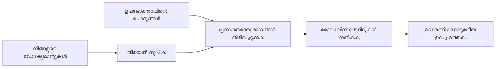

# നിങ്ങളുടെ ഡോക്യുമെന്റുകൾ അടിസ്ഥാനമാക്കി ചോദ്യങ്ങൾക്ക് ഉത്തരമൊരുക്കാൻ AI-നെ പരിശീലിപ്പിക്കുക:
## പരമ്പര 1: RAG, ആസ്യൂർ വേഴ്‌സ് ഓപ്പൺ-സോഴ്‌സ് പകരവുകൾ, ഫൈൻ-ട്യൂണിംഗ് എന്ത് സമയത്ത് ശരിയാകുന്നു

> 2023-ലെ എന്റെ ആസ്യൂർ AI സര്‍ച്ച് + ആസ്യൂർ ഓപ്പൺ AI ഡോക്യുമെന്റ് QA ട്യൂട്ടോറിയലുകള്‍ വീണ്ടും പരിശോധിക്കുന്ന 2026 പരമ്പരയിൽ ആദ്യ ലേഖനം.

പരമ്പര നാവിഗേഷൻ: [റിപ്പോസിറ്ററി ഹോം](../README.md) | അടുത്തത്: [പരമ്പര 2 - ഒരു ലോക്കൽ ഓപ്പൺ-സോഴ്‌സ് RAG സിസ്റ്റം എന്റു എന്റ് നിർമ്മിക്കുക](./series-2-open-source-rag-end-to-end.md)

## 1. ആമുഖം - മുൻകാല RAG ട്യൂട്ടോറിയല്‍ വീണ്ടും പരിശോധിക്കുക

2023-ൽ, PDF ഡോക്യുമെന്റുകളിൽ നിന്നുള്ള ചോദ്യങ്ങൾക്ക് ആസ്യൂർ AI സേര്‍ച്ച് ಮತ್ತು ആസ്യൂർ ഓപ്പൺ AI ഉപയോഗിച്ച് ChatGPT-നെ ഉത്തരം പറയാൻ പഠിപ്പിക്കുന്ന ട്യൂട്ടോറിയലുകളുടെ ഒരു ജോഡി üzerinde ശീലിച്ചു. ഞാൻ എഴുതിയത് [LangChain പതിപ്പ്](https://techcommunity.microsoft.com/blog/educatordeveloperblog/teach-chatgpt-to-answer-questions-using-azure-ai-search--azure-openai-lang-chain/3969713) ആണു, കൂടാതെ [Lee Stott](https://developer.microsoft.com/en-us/advocates/lee-stott) എന്ന Principal Cloud Advocate Manager ആയ മൈക്രോസോഫ്റ്റിലെ സഹരചയിതാവായി സഹിതം ചേർന്ന് [Semantic Kernel പതിപ്പ്](https://techcommunity.microsoft.com/blog/educatordeveloperblog/teach-chatgpt-to-answer-questions-using-azure-ai-search--azure-openai-semantic-k/3985395) പഠിപ്പിച്ചു. ആ സമയം, "നിങ്ങളുടെ ഡേറ്റയിൽ ChatGPT" എന്ന ആശയം പല ഡെവലപ്പർമാർക്കും പുതിയതായിരുന്നു. ആ ട്യൂട്ടോറിയലുകളിൽ ആസ്യൂർ ബ്ലോബ് സ്റ്റോറേജ്, ആസ്യൂർ AI സേര്‍ച്ച്, ആസ്യൂർ ഓപ്പൺ AI, ലാംഗ്‌ചെയിൻ, സെമാന്റിക് കർണൽ, FAISS-സ്റ്റൈൽ വെക്ടർ റിട്ട്രീവൽ PDF ഫയലുകളിൽ നിന്നുള്ള ചോദ്യങ്ങൾക്ക് ഉത്തരം നൽകാൻ ഉപയോഗിച്ചു.

ആ മുൻകാല ലേഖനം ലളിതമായെങ്കിലും പ്രധാനപ്പെട്ട ഒരു പ്രവാഹത്തെ കേന്ദ്രീകരിച്ചിരുന്നു: ഡോക്കുമെന്റുകൾ അപ്‌ലോഡ് ചെയ്യുക, അവ ഇൻഡക്‌സ് ചെയ്യുക, ബന്ധപ്പെട്ട ഉള്ളടക്കം തിരയുക, ആ ഉള്ളടക്കം അടിസ്ഥാനമാക്കിയാണ് മോഡൽ പ്രതികരിക്കുക.

2026-ൽ, RAG പരിസരം വലുതായി വികസിച്ചു. ആസ്യൂർ AI Search ഇപ്പോൾ ആധുനിക വെക്ടർ, ഹൈബ്രിഡ് റിട്ട്രീവൽ પેટേണുകൾ പിന്തുണയ്ക്കുന്നു, ആസ്യൂർ ഓപ്പൺ AI മൈക്രോസോഫ്റ്റ് ഫൗണ്ട്രി മോഡൽ സമ്പ്രദായത്തിന്റെ ഭാഗമാണ്, പുതുതായി 나온 v1 API സാധാരണ ഓപ്പൺ AI ക്ലയന്റ് ഉപയോഗിച്ച് മാസതല `api-version` മാറ്റങ്ങൾ വേണ്ടാതെ പ്രവർത്തിക്കാം. ഇതോടെ, LangGraph, LlamaIndex, Haystack, Qdrant, Milvus, Weaviate, Chroma, Ollama, vLLM പോലുള്ള ഓപ്പൺ-സോഴ്‌സ് ഓപ്ഷനുകൾ യഥാർത്ഥ RAG സിസ്റ്റങ്ങൾക്ക് പ്രായോഗികമായ രൂപത്തിൽ ലഭ്യമാണ്.

ഇതാണ് ഈ വിഷയം വീണ്ടും പരിശോധിക്കാൻ എന്നെ പ്രേരിപ്പിച്ചത്. ഇനി ചോദ്യം "എങ്ങനെ RAG നിർമിക്കാം?" എന്നിരിക്കില്ല. RAG നിർമിക്കാൻ നിരവധി മാർഗങ്ങൾ ഉണ്ട്, പ്രധാനപ്പെട്ടത് "എന്റെ സാഹചര്യത്തിന് യോജിച്ച ആർക്കിടെക്ചർ ഏതാണ്?" എന്നതാണ്.

എങ്കിലും അടിസ്ഥാന പ്രശ്നം മാറിയിട്ടില്ല.

AI മോഡൽ സ്വയം നിങ്ങളുടെ ഡോക്യുമെന്റുകൾ അറിയവരുത്. ഒരു പ്രയോഗയോഗ്യമായ ഡോക്യുമെന്റ്-ചോദ്യ-ഉത്തരം സിസ്റ്റം നിർമിക്കാൻ എല്ലാ വിശ്വസനീയമായ റിട്ട്രീവൽ, ഗ്രൗണ്ടിംഗ്, മൂല്യനിർണയം, ഓപ്പറേഷൻ പ്രവാഹങ്ങൾ ആവശ്യമുണ്ട്.

ഈ ലേഖനം "PDF-നൊപ്പം ചാറ്റ് ചെയ്യുക" എന്ന അവസാന-വരെ ട്യൂട്ടോറിയൽ അല്ല. ഞാൻ ഈ പുതുക്കിയ പരമ്പര ആരംഭിക്കുന്നത് ഇപ്പോൾ ഏറ്റവും പരിഗണനയുള്ള ചോദ്യത്തിൽ നിന്നാണ്: എപ്പോഴാണ് മാനേജ് ചെയ്ത ആസ്യൂർ ആർക്കിടെക്ചർ തിരയേണ്ടത്, എപ്പോഴാണ് ഓപ്പൺ-സോഴ്‌സ് RAG സ്റ്റാക്ക് തിരയേണ്ടത്, ഫൈൻ-ട്യൂണിംഗ് യഥാർത്ഥത്തിൽ എപ്പൊഴാണ് ശരിയാകുന്നത്?

ഈ പരമ്പര ഡോക്യുമെന്റ്-ഗ്രൗണ്ടഡ് AI സിസ്റ്റങ്ങൾ നിർമ്മിക്കുന്നതിനെക്കുറിച്ചാണ്. ആദ്യ ഭാഗത്തിൽ, നാം ആർക്കിടെക്ചർ തീരുമാനങ്ങൾക്കാണ് ശ്രദ്ധ കൊണ്ടിരിക്കുന്നതും RAG എങ്ങനെ പ്രാധാന്യമുള്ളത്, എപ്പോഴാണ് ആസ്യൂർ മാനേജ് ചെയ്ത സേവനങ്ങൾ ഉപയോഗപ്രദം, എപ്പോഴാണ് ഓപ്പൺ-സോഴ്‌സ്オപ്ഷൻ നിർബന്ധമായകൂടിയത്, ഫൈൻ-ട്യൂണിംഗ് എവിടെ പൊരുത്തപ്പെടുന്നു എന്നതും പരിശോധിക്കും.

ഡോക്യുമെന്റ് QA സിസ്റ്റങ്ങൾ നിർമ്മിച്ച് വീണ്ടും പരിശോധിച്ചതോടൊപ്പം, ഒരു ഡെമോയിലുള്ള മികച്ച ടൂളിലെ ഭാവം കുറവായും, യഥാർത്ഥ ഉപയോക്താക്കൾ, മാറുന്ന ഡോക്യുമെന്റുകൾ, അനുമതികൾ, പിഴവുകൾ, പരിപാലനങ്ങൾ എന്നിവയ്‌ക്കു വിവിധ ആർക്കിടെക്ചറുകൾ എങ്ങനെ പടുത്തുയരുന്നു എന്നതിൽ കൂടുതലാണ് താല്‍പര്യം.

## 2. നിങ്ങളുടെ AI-ന് ഒരു സേർച്ച് സിസ്റ്റം ആവശ്യമാണ് എങ്കിൽ

വിപുലമായ പൊതു, ലൈസൻസുള്ള ഡാറ്റയിൽ പരിശീലിപ്പിച്ച വലിയ ഭാഷാ മോഡലുകൾക്ക് പൊതുമേഖല വിഷയങ്ങളിൽ നന്നായി അറിവുണ്ടാകും, പക്ഷേ നിങ്ങളുടെ സ്വകാര്യ PDF-കൾ, അന്തർഗത നയം, എൻറപ്രൈസ് നടപടിക്രമങ്ങൾ, ഗവേഷണ ശേഖരങ്ങൾ, ക്ലാസ്സ് റൂം വസ്തുക്കൾ, കസ്റ്റമർ സഹായ കുറിപ്പുകൾ, പുതിയ രേഖകൾ എന്നിവ സ്വയം അറിയില്ല.

RAG-നെ എളുപ്പത്തിൽ നിരൂപിക്കണം എങ്കിൽ എങ്ങനെ ആണെന്ന് ചിന്തിക്കാം: മോഡൽ ഓരോ ഡോക്യുമെന്റും ഓർക്കും എന്ന് പ്രതീക്ഷിക്കുന്നതിന് പകരം, ഞങ്ങൾ ഒരു സേർച്ച് സിസ്റ്റം നൽകുന്നു. ഉപയോക്താവ് ഒരു ചോദ്യമൊരുക്കുമ്പോൾ, സിസ്റ്റം ആദ്യം ഏറ്റവും ബന്ധപ്പെട്ട വിവരങ്ങൾ കണ്ടെത്തുകയും പിന്നീട് ആ വിവരങ്ങൾ മോഡലിന് കോൺടെക്സ്റ്റായി നൽകുകയും ചെയ്യുന്നു.

ഇത് പ്രധാനമാണ് കാരണം പല യഥാർത്ഥ അറിവഴിവുകൾ സ്വകാര്യമാണ്, സ്ഥിരം മാറ്റങ്ങൾ ഉണ്ടാകുന്നവയാണ്, അനുമതി‌സംബന്ധിയായവയാണ്, നിരവധി സിസ്റ്റങ്ങളിലായി സംഭരിക്കപ്പെട്ടവയാണ്, വിവിധ ഫോർമാറ്റുകളിലുള്ളവയാണ്, ഒരു പ്രേംപ്റ്റിൽ നേരിട്ട് പേസ്റ്റ് ചെയ്യാൻ ഏറെ വലുതാണ്.

ഉദാഹരണത്തിന്, ഒരു സ്‌കൂൾ, കമ്പനി, ഗവേഷണ സംഘത്തിന് 10,000 ആഭ്യന്തര ഡോക്യുമെന്റുകൾ ഉണ്ടെങ്കിൽ, ആ മോഡൽ ഡോക്യുമെന്റുകളിൽ നിന്ന് വിശ്വാസയോഗ്യമായി ഉത്തരം പറയാൻ കഴിയില്ല, പക്ഷേ സിസ്റ്റം ശരിയായ ഭാഗങ്ങൾ ശരിയായ സമയത്ത് കണ്ടെത്തണമെന്നും.

ഇത് സാധാരണ ചോദ്യംക്കു നയിക്കുന്നു:

എന്തുകൊണ്ട് മോഡൽ ഫൈൻ-ട്യൂൺ ചെയ്താൽ മതിയല്ലേ?

ഫൈൻ-ട്യൂണിംഗ് സഹായപ്രദമായിരിക്കാം, പക്ഷേ ഇത് സാധാരണയായി ഡോക്യുമെന്റ് അറിവിനായി ശരിയായ ആദ്യ ഉപകരണമല്ല. അറിവ് സ്ഥിരമായി മാറുന്നുവെങ്കിൽ, സൈറ്റേഷനുകൾ പ്രസക്തമാണെങ്കിൽ, ആക്‌സസ് അനുമതികൾ പ്രാധാന്യമുള്ളവയെങ്കിൽ, RAG സാധാരണ ബദൽ ആണ്. ഫൈൻ-ട്യൂണിംഗ് പെരുമാറ്റം, ശൈലി, ഔട്ട്പുട്ട് ഫോർമാറ്റ്, ടാസ്‌ക് മാതൃകകൾ പഠിപ്പിക്കാൻ കൂടുതൽ അനുയോജ്യമാണ്.

## 3. പ്രായോഗികമായി RAG ആർക്കിടെക്ചർ

നിങ്ങൾ ഒരു സ്കൂളിനായി AI അസിസ്റ്റന്റിനെ നിർമ്മിക്കുന്നു എന്ന് تصور ചെയ്യുക. ആ അസിസ്റ്റന്റ് നയ PDFകൾ, കോഴ്സ് ഗൈഡുകൾ, ആഭ്യന്തര FAQ പേജുകൾ, പുതിയമായി അപ്ഡേറ്റ് ചെയ്ത പ്രഖ്യാപനങ്ങളിൽ നിന്നുള്ള ചോദ്യങ്ങൾക്ക് ഉത്തരം നൽകണം.

ഒരു വിദ്യാർത്ഥി ചോദിച്ചാൽ, "ഞാൻ എന്റെ അവസാന അസൈൻമെന്റിനായി ജനറേറ്റീവ് AI ഉപയോഗിക്കാമോ?", സിസ്റ്റം മോഡലിന്റെ പൊതുവായ ഓർമയിൽ നിന്ന് ഉത്തരം പറയരുത്. ആദ്യം ബന്ധപ്പെട്ട സ്കൂൾ നയം കണ്ടെത്തണം, AI ഉപയോഗത്തെ കുറിച്ചുള്ള ഭാഗം തിരികെ ലഭ്യമാക്കണം, ശേഷം ആ തെളിവ് അടിസ്ഥാനമാക്കി മോഡലിനോട് ഉത്തരം ചോദിക്കണം.

ഇതാണ് പ്രായോഗികമായി RAG.

മ उच्च തലത്തിലുള്ള പ്രവാഹം ഇങ്ങനെ ആകാം:

  
വിശദാംശങ്ങൾ കൂടുതൽ കേമ്ബ്ളെക്സാകുന്നതാകും, പക്ഷേ അടിസ്ഥാന ആശയം ലളിതമാണ്: മോഡൽ ഏകാന്തമായി ഉത്തരം പറയുന്നില്ല. അത് തിരികെ കിട്ടിയ തെളിവുകളുമായി ഉത്തരം പറയുന്നു.

ആദ്യമായി, ഡോക്യുമെന്റ് സിസ്റ്റങ്ങളിലൂടെ അലവുബ് ചെയ്തെടുക്കുന്നു, ഉദാഹരണത്തിന് ആസ്യൂർ ബ്ലോബ് സ്റ്റോറേജ്, ഷെയർപോയിന്റ്, GitHub അല്ലെങ്കിൽ ആഭ്യന്തര CMS. പിന്നീട് സിസ്റ്റം ടെക്സ്റ്റായി പാഴ്സിംഗ് ചെയ്യുന്നു, എന്നാൽ തലക്കെട്ടുകൾ, പേജ് നമ്പറുകൾ, പട്ടികകൾ, വിഭാഗങ്ങൾ, ഉറവിടലൊക്കേഷനുകൾ പോലുള്ള ഉപയോഗപ്രദമായ ഘടനകൾ സൂക്ഷിക്കുന്നു.

അടുത്ത, ഉള്ളടക്കം ചോങ്കുകളായി വിഭജിക്കുന്നു. ഈ ഘട്ടം ലളിതമായതായി തോന്നിച്ചാലും, ഇത് സിസ്റ്റത്തിലെ ഏറ്റവും പ്രധാനപ്പെട്ട ഭാഗങ്ങളിലൊന്നാണ്. ഒരു ചോങ്ക് വളരെ ചെറിയത് ആണെങ്കിൽ ചുറ്റുമുള്ള കോൺടെക്സ്റ്റ് നഷ്ടപ്പെടും. അതേസമയം, ഒരു ചോങ്ക് വളരെ വലിയതായാൽ സാദ്ധ്യതയില്ലാത്ത വിവരങ്ങളും ഉൾക്കൊള്ളുകയും റിട്ട്രീവൽ കുറഞ്ഞ കൃത്യതയുള്ളതാക്കുകയും ചെയ്യും.

ചോങ്ക് ചെയ്ത ശേഷം, സിസ്റ്റം എമ്പഡിംഗുകൾ സൃഷ്ടിച്ച് അവ ഓരിജിനൽ ടെക്സ്റ്റിന്റെയും മെറ്റാഡേറ്റായ ഫയൽനാമം, പേജ് നമ്പർ, അനുമതികൾ, ഡോക്യുമെന്റ് പതിപ്പ്, ഉറവിട URL എന്നിവയുമായി ചേർന്ന് തിരയാവുന്ന ഇൻഡെക്സിൽ സംഭരിച്ചു വയ്ക്കുന്നു.

ഉപയോക്താവ് ചോദ്യമൊരുക്കുമ്പോൾ, സിസ്റ്റം കീവർഡ് സേര്‍ച്ച്, വെക്ടർ സേര്‍ച്ച്, അല്ലെങ്കിൽ ഹൈബ്രിഡ് സേര്‍ച്ച് ഉപയോഗിച്ച് സ്ഥാനാർത്ഥി ചോങ്കുകൾ തിരിച്ചറിഞ്ഞു. റീറാങ്കർ അവ ചോങ്കുകൾ പുനഃക്രമീകരിച്ച് ഏറ്റവും പ്രയോജനകരമായ തെളിവുകൾ മുകളിൽ വയ്ക്കും.

അവസാനമായി, മോഡൽക്ക് ചോദ്യവും തിരികെ കിട്ടിയ തെളിവും ലഭിക്കുന്നു. ഉത്തരം ആ തെളിവുകളിലേക്കു ഗ്രൗണ്ട് ചെയ്യപ്പെടുകയും ഉപയോക്താവ് ഉറവിടം പരിശോധിക്കാനായി സൈറ്റേഷനുകൾ തിരിച്ചറിയുകയും വേണം.

പ്രധാനമായ കാര്യം: RAG എന്നാൽ "PDF ഫയലുകൾ വെക്ടർ ഡാറ്റാബേസിൽ വയ്ക്കുക" മാത്രമല്ല. ഉത്തരം നിലവാരം മുഴുവൻ പ്രവാഹത്തെ ആശ്രയിച്ചിരിക്കുന്നു: പാഴ്സിംഗ്, ചോങ്കിംഗ്, റിട്ട്രീവൽ, റീറാങ്കിംഗ്, പ്രോംപ്റ്റിംഗ്, സൈറ്റേഷൻ, മൂല്യനിർണയം.

ഇതിനാലാണ് ഡോക്യുമെന്റ് ഘടനയെ പ്രാധാന്യം നൽകുന്നത്. PDF-ൽ തലക്കെട്ട്, പട്ടിക, ഫുട്‌നോട്ട്, പേജ് അതിരുകൾ വാചകം അർത്ഥം മാറ്റാം. ആസ്യൂറിൽ Document Layout skill ആസ്യൂർ ഡോക്യുമെന്റ് ഇന്റലിജൻസ് ലെയൗട്ട് കഴിവുകൾ ഉപയോഗിച്ച് ഘടനാപരമായ ഔട്ട്പുട്ട് സൃഷ്ടിക്കുന്നു, ഇത് ചോങ്കിംഗ്, റിട്ട്രീവൽ നിലവാരം മെച്ചപ്പെടുത്താൻ സഹായിക്കും.

## 4. 2023 ന് ശേഷം എന്ത് മാറി?

2023 ട്യൂട്ടോറിയൽ അതിന്റെ സമയത്തിനു നല്ല തുടക്കമായിരുന്നു:

- ആസ്യൂർ Blob Storage PDF ഫയലുകൾ സംഭരിച്ചു.
- ആസ്യൂർ AI Search ഉള്ളടക്കം ഇന്‍ഡക്‌സ് ചെയ്തു.
- LangChain ആസ്യൂർ ഓപ്പൺ AI-യോട് ബന്ധിപ്പിച്ചു.
- FAISS ലളിതമായ ലോക്കൽ വെക്ടർ സ്റ്റോർ ആയിരുന്നു.
- ഉദാഹരണത്തിൽ `gpt-35-turbo`യും `text-embedding-ada-002`യും ഉപയോഗിച്ചു.

2026-ൽ, ആധുനിക പതിപ്പ് പല മാറ്റങ്ങളും പ്രതിഫലിപ്പിക്കണം.

ആദ്യം, റിട്ട്രീവൽ വളർന്നു. 2023-ൽ പല ഡെമോകളും ലളിതമായ വെക്ടർ സാദൃശ്യ സേർച്ച് ഉപയോഗിച്ചിരുന്നു. ഇന്നത്തെ അന്തരീക്ഷത്തിൽ, ഹൈബ്രിഡ് റിട്ട്രീവൽ ഭാരം കൂടിയ ഡോക്യുമെന്റ് QA-യുടെ പ്രാരംഭ പാതയാണ്. ആസ്യൂർ AI Search ഒരു അഭ്യർഥനയിൽ കീവർഡ്, വെക്ടർ ക്വറികൾ കൂട്ടിച്ചേർത്ത് ഹൈബ്രിഡ് സേര്‍ച്ച് പിന്തുണയ്ക്കുന്നു; Reciprocal Rank Fusion ഉപയോഗിച്ച് ഫലങ്ങൾ ലയിപ്പിക്കുന്നു. സെമാന്റിക് റാങ്കർ ഫുൾ-ടെക്സ്റ്റ്, വെക്ടർ, ഹൈബ്രിഡ് ഫലങ്ങൾ പുനഃക്രമപ്പെടുത്താം.

രണ്ടാമതായി, യുകൃതം കൂടുതല് പരിണമിച്ചു. എല്ലാ ഡോക്യുമെന്റും മാനുവൽ ആയി കോഡിൽ വിഭജിക്കാനുറപ്പിക്കേണ്ടതില്ല. ആസ്യൂർ AI Search ചോങ്കിംഗ്, എമ്പഡിംഗ്, ക്വറി-സമയ വെക്ടറൈസേഷനോട് കൂടിയ ഇന്റഗ്രേറ്റഡ് വെക്ടറൈസേഷൻ പിന്തുണയ്ക്കുന്നു. PDF-കൾക്കും ഡോക്യുമെന്റ് ഭാരം കൂടിയ വർക്കിത്‌ ലോഡുകൾക്കും Document Layout skill നിശ്ചിത വലുപ്പ ചോങ്കുകൾക്കാളും ഘടന കൂടുതൽ സൂക്ഷിക്കുന്നു.

മൂന്നാമതായി, ഓർക്കസ്ട്രേഷൻ കൂടുതൽ പ്രധാനമാണ്. LLM API കോൾ അപ്പോൾ തന്നെ ഹാർഡ് പാർട്ട് അല്ല. പിഴവുകൾ കൈകാര്യംചെയ്യൽ, പുനരായത്, പഴകിയ റിട്ട്രീവൽ, ചോങ്ക് നിലവാരം, ദൈർഘ്യമേറിയ പ്രവാഹങ്ങൾ, മനുഷ്യ ദൃശ്യപരിശോധനം, സ്കെയിലിൽ മൂല്യനിർണയം എന്നിവയാണ് പുഴഞ്ഞ് നോക്കേണ്ടത്. LangGraph, LlamaIndex workflows, Haystack പൈപ്പ്ലൈനുകൾ, പ്ലാറ്റ്‌ഫോം തലത്തിലെയുള്ള മൂല്യനിർണയം, ദൃശ്യഗതിത്വ ഉപകരണങ്ങൾ ഒറ്റ കോഡ് ചൈനിനേക്കാൾ പ്രസക്തമാണ്.

നാല്, മൂല്യനിർണയം മറ്റൊരു ഓപ്‌ഷൻ അല്ല. ഒരു ഡെമോ ഒരു ചോദ്യത്തോടുകൂടി അലങ്കാരമായിരിക്കാം. ഒരു പ്രൊഡക്ഷൻ സിസ്റ്റം ടെസ്റ്റ് സെറ്റുകൾ, റെഗ്രഷൻ പരിശോധനകൾ, റിട്ട്രീവൽ മെട്രിക്‌സ്, ഗ്രൗണ്ടഡ്‌നസ് പരിശോധനകൾ, നിരീക്ഷണം ആവശ്യമാണ്. മൂല്യനിർണയം ഇല്ലാതെ സിസ്റ്റം മെച്ചപ്പെടുന്നുവോ വെറും മാറ്റപ്പെടുന്നതാണ് എന്നറിയാൻ പ്രയാസമാണ്.

## 5. ആസ്യൂർ, ഓപ്പൺ-സോഴ്‌സ് RAG സ്റ്റാക്കുകൾ തമ്മിൽ തിരഞ്ഞെടുക്കൽ

നിങ്ങൾ കരുതുന്നത് പ്രയോജനകരമായ ചോദ്യം ഇതല്ല: "ആസ്യൂർ ഓപ്പൺ സോഴ്‌സിനേക്കാൾ നല്ലതാണോ?" അല്ലെങ്കിൽ "ഓപ്പൺ സോഴ്‌സ് ആസ്യൂറിനേക്കാൾ നല്ലതാണോ?"

പ്രയോജനകരമായ ചോദ്യം: നിങ്ങൾ ഏത് തരത്തിലുള്ള സിസ്റ്റം നിർമ്മിക്കുന്നു, ആ സിസ്റ്റം ആരാണ് ഓപ്പറേറ്റ് ചെയ്യുന്നത്, നിങ്ങൾക്ക് എന്തനീർത്തികൾ ഉണ്ട്, ഏത് പിഴവു മോഡുകൾ അംഗീകരിക്കാൻ കഴിയില്ല?

ഡോക്യുമെന്റ് QA ഉദാഹരണങ്ങൾ നിർമ്മിക്കാൻ ഞാൻ ആരംഭിച്ചപ്പോൾ, റിട്ട്രീവൽ പ്രവർത്തിക്കുന്നുണ്ടോ എന്ന് മാത്രമാണ് പരിഗണിച്ചത്. PDFs അപ്ലോഡ് ചെയ്ത്, തിരഞ്ഞു, ഉത്തരം സൃഷ്ടിക്കാമോ? അത് ഒരു ගൗരവമുള്ള തുടക്കം ആയിരുന്നു.

വാസ്തവപരമായ AI പ്രവാഹങ്ങൾ നേരിട്ടിന് ശേഷം, എന്റെ മൂല്യനിർണയം മാറി. ഇപ്പോൾ ഞാൻ RAG സ്റ്റാക്ക് തിരഞ്ഞെടുക്കും മുൻപ് നാല് കാര്യങ്ങൾ നിരീക്ഷിക്കുന്നു:

- തിരിച്ചറിയൽ, അനുമതികൾ
- റിട്ട്രീവൽ നിലവാരം
- പ്രവാഹ വിശ്വാസ്യത
- ഓപ്പറേഷൻ ഉടമസ്ഥ്വം

ഇവ നാല് മേഖലകൾ ഒരു മോഡൽ ബെഞ്ച്മാർക്ക് മാത്രം അതിൽനിന്ന് കൂടുതലാണ് പറയും.

ആസ്യൂർ ആധാരിത ആർക്കിടെക്ചറുകൾ സാധാരണയായി എൻറപ്രൈസ് ഇന്റഗ്രേഷൻ പ്രധാനമായ ഭാഗമായപ്പോൾ ഉപയോഗപ്രദമാണ്. ഒരു ടീം ഇതിനകം Microsoft Entra ID, Microsoft 365, ആസ്യൂർ സ്റ്റോറേജ്, സ്വകാര്യ നേറ്റ്‌വർക്ക്, RBAC, ആസ്യൂർ നിരീക്ഷണം എന്നിവയിൽ ആശ്രയിച്ചാൽ, ആസ്യൂർ AI Search, ആസ്യൂർ ഓപ്പൺ AI ഓപ്പറേഷൻക്കുള്ള സങ്കീർണ്ണത കുറയ്ക്കുവാനും സഹായിക്കും. ആ സാഹചര്യത്തിൽ, ആസ്യൂർ ഒരു മോഡൽ API മാത്രമല്ല; മൂല്യം ചുറ്റുമുള്ള സിസ്റ്റമാണ്: തിരിച്ചറിയൽ, ഗവൺമന്റ്, മാനേജ് ചെയ്ത സർച്ച്, സുരക്ഷാ ഇന്റഗ്രേഷൻ, പിന്തുണ, പരിചിതമായ ഓപ്പറേഷൻസ്.

ഓപ്പൺ-സോഴ്‌സ് ആർക്കിടെക്ചറുകൾ സാധാരണയായി ഫ്ലെക്സിബിലിറ്റി പ്രശ്‌നം ആയപ്പോൾ ഉപയോഗപ്രദമാണ്. ഒരു ടീം ലോക്കൽ ഇൻഫറൻസ്, ക്ലൗഡ് പോർട്ടബിലിറ്റി, കസ്റ്റം റിട്ട്രീവൽ പൈപ്പ്ലൈൻ, പ്രത്യേക റീറാങ്കിംഗ്, വെക്ടർ ഡാറ്റാബേസ്, മോഡൽ-സർവിംഗ് ലെയർ നേരിട്ട് നിയന്ത്രണം ആവശ്യമായി വന്നാൽ ഓപ്പൺ-സോഴ്‌സ് സ്റ്റാക്ക് കൂടുതൽ അനുയോജ്യം. വ്യാപൃതമായി ഓപ്പറേഷൻ विश्वसनीयതയുടെ ഭാരം ടീം ഏറ്റെടുക്കണം: ബാക്കപ്പ്, സ്കെയിലിംഗ്, ലേറ്റൻസി, മൈഗ്രേഷൻ, നിരീക്ഷണം, സുരക്ഷ.

പ്രായോഗികമായി, പല പ്രൊഡക്ഷൻ AI സിസ്റ്റങ്ങളും പൂർണ്ണമായ ക്ലൗഡ്-നേറ്റീവ് അല്ലെങ്കിൽ പൂർണ്ണമായ ഓപ്പൺ-സോഴ്‌സ് അല്ല. അവ സാധാരണ ഹൈബ്രിഡ് സിസ്റ്റങ്ങൾ ആണ്, ഓപ്പറേഷണൽ ലളിതം, പോർട്ടബില്ലിറ്റി, ഗവൺൻസ്, എഞ്ചിനീയറിംഗ് ഫ്ലെക്സിബിലിറ്റി എന്നിവയ്ക്ക് മദ്ധ്യസ്ഥത പുലർത്തുന്നു.

ഉദാഹരണത്തിന്, ഞാൻ വെള്ളം കൊള്ളുന്നില്ല, ഒരു സിസ്റ്റം മോഡലിലേക്ക് ആസ്യൂർ ഓപ്പൺ AI, പ്രവാഹ ഓർക്കസ്ട്രേഷനായി LangGraph, വിന്യാസത്തിന് ആസ്യൂർ ഹോസ്റ്റിംഗ്, പ്രത്യേക റിട്ട്രീവൽ ആവശ്യത്തിനായി ഓപ്പൺ-സോഴ്‌സ് വെക്ടർ ഡാറ്റാബേസ് എന്നിവ ഉപയോഗിക്കുന്നതായി കാണുന്നതിൽ. അത് ആർക്കിടെക്ചറൽ വിരുദ്ധതയല്ല. ഓരോ ഭാഗത്തിനും മാനേജ്‌ഡ് സേവനവും എൻജിനീയറിംഗ് നിയന്ത്രണവും ശരിയായി തിരഞ്ഞെടുക്കലാണ്.

പ്രധാനമാക്കുന്നത്, മാനേജ് ചെയ്ത പ്ലാറ്റ്‌ഫോം പ്രധാന എൻറപ്രൈസ് പ്രശ്‌നങ്ങൾ പരിഹരിക്കുമ്പോൾ, ഓപ്പൺ-സോഴ്‌സ് ഘടകങ്ങൾ അവസ്ഥയുടെ ആവശകമായ സ്ഥലങ്ങളിൽ ടീംക്ക് ഫ്ലെക്സിബിലിറ്റി നൽകുന്നതാണു ഞാൻ ഇഷ്ടപ്പെടുന്നത്.

## 6. പ്രാക്ടിക്കൽ തീരുമാനം ഗൈഡ്

ടീം RAG സ്റ്റാക്ക് തിരഞ്ഞെടുക്കുന്നതിനു മുൻപ് ഉപയോഗിക്കാവുന്ന തീരുമാനം പട്ടിക ഇങ്ങനെ:

| തീരുമാനം മേഖല | ആസ്യൂർ മാനേജ് ചെയ്ത സ്റ്റാക്ക് മികച്ചത് എന്തൊക്കെയാണ്... | ഓപ്പൺ-സോഴ്‌സ് സ്റ്റാക്ക് മികച്ചത് എന്തൊക്കെയാണ്... |
| --- | --- | --- |
| തിരിച്ചറിയൽ, ആക്‌സസ് | Entra ID, RBAC, മാനേജ് ചെയ്ത തിരിച്ചറിയൽ, എൻറപ്രൈസ് അനുമതികൾ കേന്ദ്രമാണ് | കസ്റ്റം ഓതെന്റിക്കേഷൻ, Microsoft അല്ലാത്ത തിരിച്ചറിയൽ, ആപ്പ്-നിർദ്ദിഷ്ട ആക്‌സസ് ലോജിക്ക് പ്രധാനമാണ് |
| ഓപ്പറേഷൻസ് | ടീം മാനേജ് ചെയ്ത ഇൻഫ്രാസ്‌ട്രക്ടർ, പിന്തുണ, SLA-കൾ, ലളിതമായ ഓൺ‌ബോഡിംഗ് ആവശ്യപ്പെടുമ്പോൾ | ടീം വെക്ടർ ഡാറ്റാബേസുകൾ, മോഡൽ സർവിംഗ്, ബാക്കപ്പ്, സ്കെയിലിംഗ് നടത്താൻ കഴിയും |
| റിട്ട്രീവൽ | ഹൈബ്രിഡ് സേർച്ച്, സെമാന്റിക് റാങ്കിംഗ്, ഫിൽട്ടറുകൾ, മെറ്റാഡേറ്റാ സേർച്ച് മിക്ക ആവശ്യകതകളും നിറവേറ്റുന്നു | ടീം കസ്റ്റം റിട്ട്രീവൽ, പ്രത്യേക റീറാങ്കിംഗ്, പരീക്ഷണ ഇൻഡക്സിംഗ് ആവശ്യപ്പെട്ടു |
| പോർട്ടബിലിറ്റി | ആസ്യൂർ പരിസ്ഥിതി അളവിനായി അംഗീകരിച്ചോ ഇഷ്ടപ്പെട്ടോ ചെയ്യുമ്പോൾ | ക്ലൗഡ് ലോക്ക്-ഇൻ ഒഴിവാക്കൽ എന്നത് കടുത്ത ആവശ്യമാണ് |
| ഇൻഫറൻസ് | ആസ്യൂർ ഓപ്പൺ AI ഗവൺൻസ്, നെറ്റ്‌വർക്കിംഗ്, എൻറപ്രൈസ് നിയന്ത്രണങ്ങൾ പ്രാധാന്യം വഹിക്കുമ്പോൾ | ലോക്കൽ ഇൻഫറൻസ്, കസ്റ്റം മോഡലുകൾ അല്ലെങ്കിൽ സ്വയം-ഹോസ്റ്റ് ചെയ്ത സർവിംഗ് ആവശ്യമാണ് |
| ചിലവ് | എഞ്ചിനീയറിംഗ്, ഓപ്പറേഷൻസ് ശ്രമം കുറയ്ക്കൽ ഇൻഫ്രാസ്ട്രക്ചർ ട്യൂണിംഗിനേക്കാൾ പ്രധാനമാണ് | സ്കെയിൽ വലിയതിനാൽ സൂക്ഷ്മമായ ഇൻഫ്രാസ്ട്രക്ചർ ഒപ്റ്റിമൈസേഷൻ ആവശ്യമാണ് |
| പരീക്ഷണം | സ്ഥിതിയായതും എൻറപ്രൈസ് ഇന്റഗ്രേഷനും ഘടകങ്ങൾ പലപ്പോഴും മാറ്റുന്നതിനേക്കാൾ പ്രധാനം | ടീം ഏജന്റുകൾ, ഉപകരണങ്ങൾ, മെമ്മറി, റിട്ട്രീവൽ പ്രവാഹങ്ങൾ വേഗത്തിൽ പരീക്ഷിക്കുന്നു |

എന്റെ സംപ്രദായം ലളിതമാണ്:

- എൻറപ്രൈസ് ഇന്റഗ്രേഷൻ, സുരക്ഷ, ലളിതമായ ഓപ്പറേഷൻസ് പ്രധാനമായാല്‍ ആസ്യൂറിന്റെ സഹായത്തോടെ ആരംഭിക്കുക.
- പോർട്ടബിലിറ്റി, കസ്റ്റമൈസേഷൻ, ലോക്കൽ നിയന്ത്രണം പ്രധാനമായാൽ ഓപ്പൺ സോഴ്‌സ് സൃഷ്ടി ആരംഭിക്കുക.
- ഇരുവും ശരിയായെങ്കിൽ ഹൈബ്രിഡ് സ്റ്റാക്ക് ഉപയോഗിക്കുക.

ഇതാണ് 2026 RAG പരമ്പരക്ക് കോഡ് കൊണ്ടാണ് ആരംഭിക്കേണ്ടതില്ലാത്ത കാരണം. കോഡ് പ്രധാനമാണ്, പക്ഷേ ആർക്കിടെക്ചർ തിരഞ്ഞെടുപ്പ് പ്രയോഗത്തിന് മുമ്പാണ്. ലളിത ഡെമോ ഏറ്റവും സ്ക്രീനിലുള്ള കടുത്ത തീരുമാനങ്ങൾ മറയ്ക്കാം. ഒരു നല്ല RAG സിസ്റ്റം ആ തീരുമാനങ്ങൾ വ്യക്തമായി കാണിക്കും.

## 7. ഫൈൻ-ട്യൂണിംഗ് എവിടെ പൊരുത്തപ്പെടും

ഫൈൻ-ട്യൂണിംഗ് സാധാരണ RAG-യോടെ ചേർന്ന് പരാമർശിക്കാറുണ്ട്, പക്ഷേ രണ്ട് വിദഗ്ധമായി തിരിച്ചറിയുന്നത് പ്രധാനമാണ്.

RAG സാധാരണ ഫലപ്രദമാണ് സിസ്റ്റം പുതിയ, സ്വകാര്യ, അനുവാദ-സെൻസിറ്റീവ്, ഉറവിട-ഗ്രൗണ്ടഡ് അറിവ് ആവശ്യമായപ്പോൾ. ഉത്തരങ്ങൾ ഡോക്യുമെന്റുകൾക്കു സൈറ്റേഷൻ ചെയ്തിരിക്കണം, അടുത്തിടെ പുതുക്കലുകൾ പ്രതിഫലിപ്പിക്കണം, ഉപയോക്തൃ-നിർദ്ദിഷ്ട ആക്‌സസ് നിബന്ധനകൾ പാലിക്കേണ്ടതുണ്ട് എങ്കിൽ റിട്ട്രീവൽ ആർക്കിടെക്ചറിന്റെ ഭാഗമായിരിക്കണം.
Fine-tuning പ്രധാന പ്രശ്‌നം അറിവ് അല്ലാത്തപ്പോഴാണ് കൂടുതൽ ഉപകാരപ്രദം. മോഡൽ ഒരു പ്രത്യേക ഔട്ട്പുട്ട് ഫോർമാറ്റ് പിന്തുടരണമെന്ന്, ഒരു ഡൊമെയ്ൻ-സ്പെസിഫിക് പ്രതികരണ ശൈലി പൊരുത്തപ്പെടുത്തണമെന്ന്, ഒരു സ്ഥിരം പ്രവർത്തി കൂടുതൽ സ്ഥിരതയോടെ നിർവഹിക്കണമെന്ന്, അല്ലെങ്കിൽ ഓരോ പ്രൊമπτിലും ആവശ്യമായ നിർദ്ദേശങ്ങളുടെ അളവ് കുറക്കണമെന്നും നിങ്ങൾക്കുണ്ടെങ്കിൽ ഇത് സഹായിക്കുന്നു.

പ്രായോഗികമായി, ഇവ രണ്ടും ഒന്നിച്ച് പ്രവർത്തിക്കാം. ഒരു സഹകരണ അസിസ്റ്റന്റ് ഏറ്റവും പുതിയ പോളിസി തിരിച്ചറിവിന് RAG ഉപയോഗിക്കാം, അതേസമയം ഒരു ഫൈൻ-ട്യൂണുചെയ്ത മോഡൽ കമ്പനി ഇഷ്ടപ്പെടുന്ന ഉത്തരം ഘടനയും ടോൺയും പഠിക്കുന്നു.

ഫൈൻ-ട്യൂണിംഗ് ഒരു ഡോക്യുമെന്റ് സ്റ്റോർക്ക് പകരമായി പരിഗണിക്കുക എന്നത് പിശക് ആണ്. സിസ്റ്റം പുതിയ, സ്വകാര്യമോ അനുമതിപരമായ വിവരങ്ങളിൽ നിന്ന് ഉത്തരം നൽകേണ്ടതുണ്ടെങ്കിൽ തിരിച്ചു വിളിയ്ക്കലിന്റെ ആവശ്യം ഇല്ലാതാക്കുന്നില്ല.

## 8. ഈ പരമ്പര എവിടെ പോകുന്നു

ഈ ലേഖനം തീരുമാനമെടുക്കുന്ന പാളിയാണ്. കോഡ് എഴുതുന്നതിന് മുന്നിൽ, എനിക്ക് ട്രേഡ്-ഓഫുകൾ വ്യക്തമാക്കേണ്ടതുണ്ടായിരുന്നു: RAG വേഴ്സ് ഫൈൻ-ട്യൂണിംഗ്, Azure വേഴ്സ് ഓപ്പൺ സോഴ്‌സ്, മാനേജുചെയ്ത സർവീസുകൾ വേഴ്സ് പ്രവർത്തന നിയന്ത്രണം.

ഇംപ്ലിമെന്റേഷനിലേക്ക് കടക്കുന്നതിന് മുമ്പ്, ഞാൻ ഇവിടെ ഒരു പോയിന്റ് വിടാൻ ആഗ്രഹിക്കുന്നു: നിരവധി എന്റർപ്രൈസ് AI സിസ്റ്റങ്ങളിൽ, മോഡൽ തനതായ ഘടകമാണു മാത്രം. തിരിച്ചു വിളിയ്ക്കലിന്റെ ഗുണമേന്മ, സംഘാടനം, മൂല്യനിർണയം, അനുമതികൾ, പ്രവർത്തന വിശ്വാസ്യത ഇവയാണ് സാധാരണയായി സിസ്റ്റം ഡെമോ ഘട്ടത്തിന് പുറത്തു വിജയിക്കുന്നതിൽ തീരുമാനിക്കുന്നത്.

ഈ പരമ്പരയുടെ അടുത്ത ഭാഗങ്ങളിൽ, ഞാൻ ഡോക്യുമെന്റ് അടിസ്ഥാന AI സിസ്റ്റങ്ങളുടെ പ്രായോഗിക വശങ്ങളിൽ കൂടുതൽ ആഴത്തിൽ പോകാനാണ് പദ്ധതിയിടുന്നത്: ആദ്യം ഒരു പ്രാദേശിക ഓപ്പൺ-സോഴ്‌സ് RAG വർക്ക്‌ഫ്ലോ നിർമ്മിച്ച്, പിന്നീട് അതേ ദൃശ്യാവസ്ഥയുമായി Azure AI Search അണാതെ Azure OpenAI ഉപയോഗിച്ച് വീണ്ടും നിർമ്മിച്ച്, പിന്നീട് സിസ്റ്റം ശരിയായി പ്രവർത്തിക്കുന്നുണ്ടോ എന്നത് വിലയിരുത്തുന്നു.

പരമ്പര വികസിക്കുന്നതോടനുസരിച്ച് ക്രമം മാറ്റാം, എന്നാൽ ലക്ഷ്യം ഒരുപോലെ തന്നെ തുടരും: ഒരു ലളിത ഡെമോവിനുവേണ്ടി മുകളിലായി പോയി RAG സിസ്റ്റങ്ങൾ എങ്ങനെ പരിപാലിക്കുകയും മൂല്യനിർണയവും പ്രവർത്തനവും നടത്തുകയും ചെയ്യാമെന്ന് കാണിക്കുക.

## 9. റഫറൻസുകളും ռിസോഴ്‌സുകളും

അസലtutorialകൾ:

- [Teach ChatGPT to Answer Questions: Using Azure AI Search & Azure OpenAI (Lang Chain)](https://techcommunity.microsoft.com/blog/educatordeveloperblog/teach-chatgpt-to-answer-questions-using-azure-ai-search--azure-openai-lang-chain/3969713)
- [Teach ChatGPT to Answer Questions: Using Azure AI Search & Azure OpenAI (Semantic Kernel)](https://techcommunity.microsoft.com/blog/educatordeveloperblog/teach-chatgpt-to-answer-questions-using-azure-ai-search--azure-openai-semantic-k/3985395)

Azure:

- [Azure AI Search REST API versions](https://learn.microsoft.com/en-us/rest/api/searchservice/search-service-api-versions)
- [Hybrid search in Azure AI Search](https://learn.microsoft.com/en-us/azure/search/hybrid-search-how-to-query)
- [Integrated vectorization in Azure AI Search](https://learn.microsoft.com/en-us/azure/search/vector-search-integrated-vectorization)
- [Document Layout skill in Azure AI Search](https://learn.microsoft.com/en-us/azure/search/cognitive-search-skill-document-intelligence-layout)
- [Chunk and vectorize by document layout](https://learn.microsoft.com/en-us/azure/search/search-how-to-semantic-chunking)
- [Semantic ranking in Azure AI Search](https://learn.microsoft.com/en-us/azure/search/semantic-search-overview)
- [Azure OpenAI / Microsoft Foundry API version lifecycle](https://learn.microsoft.com/en-us/azure/foundry/openai/api-version-lifecycle)
- [Foundry Models sold by Azure](https://learn.microsoft.com/en-us/azure/foundry/foundry-models/concepts/models-sold-directly-by-azure)
- [Microsoft Foundry fine-tuning considerations](https://learn.microsoft.com/en-us/azure/foundry/openai/concepts/fine-tuning-considerations)
- [Microsoft Foundry observability](https://learn.microsoft.com/en-us/azure/foundry/concepts/observability)
- [Run evaluations in Microsoft Foundry](https://learn.microsoft.com/en-us/azure/foundry/how-to/evaluate-generative-ai-app)

ഓപ്പൺ-സോഴ്‌സ്:

- [LangGraph documentation](https://docs.langchain.com/oss/python/langgraph/overview)
- [LlamaIndex documentation](https://developers.llamaindex.ai/python/framework/)
- [Haystack documentation](https://docs.haystack.deepset.ai/)
- [Qdrant documentation](https://qdrant.tech/documentation/overview/)
- [Milvus documentation](https://milvus.io/docs/overview.md)
- [Weaviate documentation](https://docs.weaviate.io/weaviate/current/)
- [Chroma documentation](https://docs.trychroma.com/docs/overview/introduction)
- [Ollama embeddings](https://docs.ollama.com/capabilities/embeddings)
- [vLLM OpenAI-compatible server](https://docs.vllm.ai/en/latest/serving/openai_compatible_server.html)
- [BGE embedding models](https://huggingface.co/BAAI/bge-large-en-v1.5)
- [E5 embedding models](https://huggingface.co/intfloat/e5-large-v2)
- [Instructor embedding models](https://huggingface.co/hkunlp/instructor-large)

അടുത്തത്: [Series 2 - Build a Local Open-Source RAG System End to End](./series-2-open-source-rag-end-to-end.md)

---

<!-- CO-OP TRANSLATOR DISCLAIMER START -->
**അറിയിപ്പ്**:
ഈ രേഖ AI പരിഭാഷാ സേവനം [Co-op Translator](https://github.com/Azure/co-op-translator) ഉപയോഗിച്ച് പരിഭാഷപ്പെടുത്തിയതാണ്. ഞങ്ങൾ കൃത്യതയ്ക്കായി ശ്രമിക്കുന്നുവെങ്കിലും, ഓട്ടോമേറ്റഡ് പരിഭാഷകളിൽ പിഴവുകൾ അല്ലെങ്കിൽ തെറ്റായ വിവരങ്ങൾ ഉണ്ടാകാൻ സാധ്യതയുണ്ട്. അതിന്റെ സ്വാഭാവിക ഭാഷയിലുള്ള അസൽ രേഖയാണ് പ്രാമാണികമായ ഉറവിടമായി പരിഗണിക്കേണ്ടത്. നിർണായകമായ വിവരങ്ങൾക്ക്, പ്രൊഫഷണൽ മനുഷ്യ പരിഭാഷ ശുപാർശ ചെയ്യുന്നു. ഈ പരിഭാഷ ഉപയോഗിച്ച് ഉണ്ടാകുന്ന തെറ്റിദ്ധാരണകൾ അല്ലെങ്കിൽ തെറ്റായ വ്യാഖ്യാനങ്ങൾക്കായി ഞങ്ങൾ ഉത്തരവാദികളല്ല.
<!-- CO-OP TRANSLATOR DISCLAIMER END -->