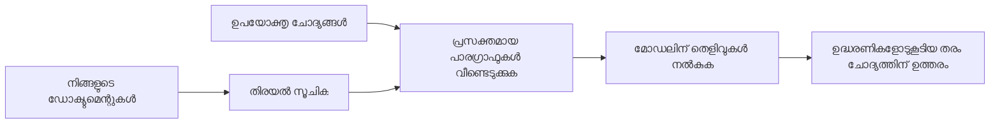

# നിങ്ങളുടെ രേഖകളെ അടിസ്ഥാനമാക്കി ചോദ്യങ്ങൾക്ക് എഐക്ക് ഉത്തരമടി പെടുക:
## സീരീസ് 1: RAG, Azure vs ഓപ്പൺ-സോഴ്‌സ് എൽറ്റർണേറ്റീവ്‌സ്, ഫൈൻ-ട്യൂണിംഗ് ചെയ്യുന്നത് എപ്പോഴാണുള്ളത്

> 2023-ലെ Azure AI Search + Azure OpenAI ഡോക്യംന്റ് QA ട്യൂട്ടോറിയലുകൾ ഞാൻ തിരുത്തി കാണിക്കുന്ന 2026-ലെ സീരീസിലെ ആദ്യ ലേഖനം.

## 1. പരിചയം - മുമ്പത്തെ RAG ട്യൂട്ടോറിയൽ തിരിച്ചറിയുക

2023-ൽ, ഞാൻ PDF രേഖകളിൽ നിന്നുള്ള ചോദ്യങ്ങൾക്കു Azure AI Search, Azure OpenAI ഉപയോഗിച്ച് ChatGPT പഠിപ്പിക്കാനുള്ള രണ്ട് ട്യൂട്ടോറിയലുകളിൽ പ്രവർത്തിച്ചു. ഞാൻ എഴുതിയ [LangChain പതിപ്പ്](https://techcommunity.microsoft.com/blog/educatordeveloperblog/teach-chatgpt-to-answer-questions-using-azure-ai-search--azure-openai-lang-chain/3969713), കൂടാതെ [Lee Stott](https://developer.microsoft.com/en-us/advocates/lee-stott) ഉൾപ്പെടെ സഹ-രചനയായ [Semantic Kernel പതിപ്പ്](https://techcommunity.microsoft.com/blog/educatordeveloperblog/teach-chatgpt-to-answer-questions-using-azure-ai-search--azure-openai-semantic-k/3985395) Microsoft-ൽ പ്രിൻസിപ്പൽ ക്ലൗഡ് അഡ്വക്കേറ്റ് മാനേജറുമായായിരുന്നു. ആ സമയത്ത് "നിങ്ങളുടെ വിവരങ്ങളിൽ ChatGPT" എന്ന ആശയം പല വികസനക്കാരുമാര്‍ക്കും പുതിയത് ആയിരുന്നു. ട്യൂട്ടോറിയലുകൾ Azure Blob Storage, Azure AI Search, Azure OpenAI, LangChain, Semantic Kernel, FAISS-ശൈലി വെക്ടർ റിട്ട്രിവൽ എന്നിവ ഉപയോഗിച്ച് PDF ഫയലുകളിൽ നിന്ന് ചോദ്യങ്ങൾക്കു മറുപടി നൽകാൻ ഉപയോഗിച്ചു.

മുൻപ് എഴുതിയ ലേഖനം ഒരു സരളമായ പക്ഷേ പ്രധാനമായ വർക്ക്‌ഫ്ലോവിൽ കേന്ദ്രീകരിച്ചിരുന്നു: രേഖകൾ അപ്‌ലോഡ് ചെയ്യുക, ഇൻഡ്എക്സ് ചെയ്യുക, അനുയോജ്യമായ ഉള്ളടക്കം തിരിച്ചറിയുക, ആ ഉള്ളടക്കത്തെ അടിസ്ഥാനമാക്കി മോഡലിനോട് ചോദിക്കുക.

2026-ൽ, RAG പരിസരം കാര്യമായി വികസിച്ചു. Azure AI Search ഇപ്പോൾ ആധുനിക വെക്ടർ, ഹൈബ്രിഡ് റിട്ട്രിവൽ മാതൃകകൾ പിന്തുണയ്ക്കുന്നു, Azure OpenAI Microsoft Foundry Models പരിസരത്തിലൊരു ഭാഗമാണ്, പുതിയത് ആയ v1 API സാധാരണ OpenAI ക്ലയന്റ് ഉപയോഗിക്കാൻ കഴിയുന്നതാണ് `api-version` മാസാന്തം മാറ്റം വേണ്ടാതെ. അതേസമയം, ഓപ്പൺ-സോഴ്‌സ് ഓപ്ഷനുകൾ LangGraph, LlamaIndex, Haystack, Qdrant, Milvus, Weaviate, Chroma, Ollama, vLLM പോലുള്ളവ യഥാർത്ഥ RAG സിസ്റ്റങ്ങൾക്കായി പ്രായോഗിക തിരഞ്ഞെടുപ്പുകളായി മാറിയിട്ടുണ്ട്.

ഇതാണ് ഞാൻ ഈ വിഷയം വീണ്ടും പരിശോധിക്കാൻ ആഗ്രഹിച്ചത്. ചോദ്യമല്ല "എങ്ങനെ RAG നിർമ്മിക്കാം?" എന്ന്. ഇപ്പോൾ ഊട്ടി പല മാർഗ്ഗങ്ങളും ഉണ്ട്, എന്നാൽ പ്രധാന ചോദ്യമാകുന്നത് "എന്ത് ശൈലി തിരഞ്ഞെടുക്കണം?" എന്നതാണ്.

എങ്കിലും മുള്‍ക്കാര്യങ്ങൾ മാറ്റപ്പെട്ടില്ല.

ഒരു AI മോഡൽ സ്വയമേവ നിങ്ങളുടെ രേഖകൾ അറിയുന്നില്ല. പ്രയോജനകരമായ ഡോക്യൂമെന്റ്-ചോദ്യ-ഉത്തര ഉപയോഗിച്ച് നിർമ്മിക്കാൻ വിശ്വസനീയമായ റിട്ട്രിവൽ, ഗ്രൗണ്ടിംഗ്, വിലയിരുത്തൽ, ഓപ്പറേഷണൽ വർക്ക്‌ഫ്ലോകൾ ആവശ്യമുണ്ട്.

ഈ ലേഖനം മറ്റൊരു അന്ത്യം-കോട്ട് "PDF-ൽ ചാറ്റ് ചെയ്യുക" ട്യൂട്ടോറിയൽ അല്ല. ഞാൻ ഇപ്പോൾ കൂടുതൽ ശ്രദ്ധിക്കുന്ന ചോദ്യവുമായി ഈ അപ്ഡേറ്റുചെയ്ത സീരീസ് തുടങ്ങണമെന്ന് വേണം: നിങ്ങൾക്ക് എപ്പോൾ മാനേജ്ചെയ്ത Azure ആർക്കിടെക്ചർ തിരഞ്ഞെടുക്കണം, എപ്പോൾ ഓപ്പൺ-സോഴ്‌സ് RAG സ്റ്റാക്ക് തിരഞ്ഞെടുക്കണം, ഫൈന്-ട്യൂണിംഗ് എപ്പോഴാണ് യഥാർത്ഥത്തിൽ അഭിമുഖ്യം?

ഡോക്യൂമെന്റ് ഗ്രൗണ്ടഡ് AI സിസ്റ്റങ്ങൾ നിർമ്മിക്കാൻ സീരീസിലെ ആദ്യ ലേഖനം. ആദ്യ ഭാഗത്ത് ആർക്കിടെക്ചർ തീരുമാനങ്ങളിൽ കേന്ദ്രീകരിക്കും: RAG എന്തുകൊണ്ട് പ്രാധാന്യമുള്ളത്, എപ്പോൾ Azure മാനേജ്ഡ് സേവനങ്ങൾ ഉപയോഗപ്രദമാണ്, എപ്പോൾ ഓപ്പൺ-സോഴ്‌സ് എൽറ്റർണേറ്റീവ്‌സിന് പ്രാധാന്യമുണ്ട്, എവിടെ ഫൈൻ-ട്യൂണിംഗ് ലാഭപ്രദമാണ്.

ഡോക്യൂമെന്റ് QA സിസ്റ്റങ്ങൾ നിർമ്മിച്ചു തിരിച്ചറിയുമ്പോൾ, എനിക്ക് ഡെമൊയിൽ ഏത് ടൂൾ മികച്ചതാണെന്ന് കാണുന്നതിനേക്കാൾ യഥാർത്ഥ ഉപഭോക്താക്കൾ, മാറുന്ന രേഖകൾ, അനുമതികൾ, പിഴവുകൾ, പരിപാലനങ്ങൾ എന്നിവയെ യാഥാർത്ഥ്യത്തിൽ നിലനിൽക്കുന്ന ആർക്കിടെക്ചർ എന്താണെന്ന് മനസ്സിലാക്കി.

## 2. നിങ്ങളുടെ AI-യ്ക്ക് ഒരു സെർച്ച് സിസ്റ്റം എന്തുകൊണ്ടാണ് ആവശ്യമായത്

വലിയ ഭാഷാ മോഡലുകൾ പൊതുജനങ്ങൾക്കും ലൈസൻസടുത്ത ഡേറ്റയ്ക്കുമായി പരിശീലിപ്പിച്ചവയാണ്. അവ സാധാരണ വിഷയങ്ങളെ കുറിച്ച് ധാരാളം അറിയാം, പക്ഷേ നിങ്ങളുടെ സ്വകാര്യ PDF ഫയലുകൾ, ആഭ്യന്തര നയങ്ങൾ, എന്റർപ്രൈസ് നടപടികൾ, ഗവേഷണ ശേഖരങ്ങൾ, ക്ലാസ്‌റൂം സാമഗ്രികൾ, കസ്റ്റമർ സഹായ കുറിപ്പുകൾ, അല്ലെങ്കിൽ പുതുക്കിയ ഡോക്യൂമെന്റേഷൻ സ്വയം അറിയുന്നില്ല.

RAG മനസിലാക്കാനുള്ള എളുപ്പ മാർഗ്ഗം ഇത്: മോഡൽ ഓരോ രേഖയും ഓർക്കുമെന്ന പ്രതീക്ഷ വെക്കുന്നതിനുപകരം, ഞങ്ങൾ അത് ഒരു സെർച്ച് സിസ്റ്റം നല്‍കുന്നു. ഉപഭോക്താവ് ചോദ്യം ചോദിച്ചാൽ, സിസ്റ്റം ആദ്യം ഏറ്റവും ബന്ധപ്പെട്ട വിവരങ്ങൾ കണ്ടെത്തുകയും ആ വിവരങ്ങൾ മോഡലിന് കോൺ‌ടെക്സ്റ്റായി നൽകുകയും ചെയ്യുന്നു.

ഇത് അത്യന്താപേക്ഷയുള്ളതാണ്, കാരണം നിരവധി യഥാർത്ഥ ലോക അറിവിന്റെയുള്ള വാത്മക്രമങ്ങൾ സ്വകാര്യമാണ്, സ്ഥിരമായി മാറുന്നു, അനുമതിയുള്ളവയാണ്, പല സിസ്റ്റങ്ങളിലായി സംഭരിച്ചിരിക്കുന്നു, വ്യത്യസ്ത ഫോർമാറ്റുകളിലുണ്ട്, പ്രോട്ടോംപ്റ്റിലേക്ക് നേരിട്ട് പേസ്റ്റ് ചെയ്യാൻ വളരെ വലുതാണ്.

ഉദാഹരണത്തിന്, ഒരു സ്കൂൾ, കമ്പനി, ഗവേഷണ സംഘം 10,000 ആഭ്യന്തര രേഖകൾ ഉണ്ടെങ്കിൽ, മോഡൽ ആ രേഖകൾ സുതാര്യമായി, വിശ്വസനീയമായി മറുപടി നൽകാൻ, റോബോറ് ശരിയായ ഭാഗങ്ങൾ ശരിയായ സമയത്ത് കണ്ടെത്തുന്നില്ലെങ്കിൽ അസംബന്ധമാണ്.

ഇത് സ്വാഭാവികമായി ഒരു സാധാരണ ചോദ്യത്തിലേക്കു നയിക്കുന്നു:

എന്തുകൊണ്ട് മോഡൽ ഫൈൻ-ട്യൂൺ ചെയ്യരുത്?

ഫൈൻ-ട്യൂണിംഗ് ഉപകാരപ്രദമായേക്കാം, പക്ഷേ സാധാരണയായി രേഖാ അറിവിന് ആദ്യത്തെ ശരിയായ ഉപകരണമല്ല. അറിവ് പലപ്പോഴും മാറുന്നുവെങ്കിൽ, സ്രോതസ്സ് റഫറൻസുകൾ പ്രധാനമാണെങ്കിൽ, അല്ലെങ്കിൽ ആക്‌സസ് അവകാശങ്ങൾ പ്രധാനമാണെങ്കിൽ, RAG സാധാരണ മികച്ച തുടക്കമാണ്. ഫൈൻ-ട്യൂണിംഗ് പെരുമാറ്റം, ശൈലി, ഔട്ട്പുട്ട് ഫോർമാറ്റ്, ടാസ്ക് പാറ്റേണുകൾ പഠിപ്പിക്കാൻ അനുയോജ്യമാണ്.

## 3. RAG ആർക്കിടെക്ചർ പ്രായോഗികമായി

നിങ്ങൾ ഒരു സ്കൂളിനുള്ള AI അസിസ്റ്റന്റ് നിർമ്മിക്കുന്നതായി कल्पന ചെയ്ത് നോക്കൂ. അസിസ്റ്റന്റ് നയ PDF കളിൽ നിന്നുള്ള ചോദ്യങ്ങൾ, കോഴ്സ് ഗൈഡുകൾ, ആഭ്യന്തര FAQ പെയ്ജുകൾ, പുതുക്കിയ പ്രഖ്യാപനങ്ങൾ എന്നിവയിൽ നിന്നാണ് മറുപടി നൽകേണ്ടത്.

ഒരു വിദ്യാർത്ഥി "എന്റെ അന്തിമ അസൈൻമെന്റിൽ ജനറേറ്റീവ് AI ഉപയോഗിക്കാമോ?" എന്ന് ചോദിക്കുന്നുവെങ്കില അപ്പോൾ സിസ്റ്റം മോഡലിന്റെ പൊതുവായ ഓർമ്മയിൽ നിന്നല്ല മറുപടി നൽകേണ്ടത്. ആദ്യം ബന്ധപ്പെട്ട സ്കൂൾ നയം കണ്ടെത്തി, AI ഉപയോഗത്തെ കുറിച്ചുള്ള ഭാഗം തിരിച്ച്, തുടർന്ന് ആ തെളിവ് ഉപയോഗിച്ച് മോഡലിനോട് മറുപടി പറയാൻ പറയണം.

അതാണ് RAG പ്രായോഗിക രൂപം.

ഉയർന്ന തലത്തിൽ പ്രക്രിയ ഇങ്ങനെ കരുതാമെന്ന്:

വിശദാംശങ്ങൾ കൂടുതൽ സങ്കീർണ്ണമാകാം, പക്ഷേ അടിസ്ഥാന ആശയം സരളമാണ്: മോഡൽ ഒറ്റക്ക് മറുപടി നൽകുന്നില്ല. അത് തിരഞ്ഞെടുത്ത തെളിവുകളുമായി ചേർന്ന് മറുപടി നൽകുന്നു.

ആദ്യം, രേഖകൾ Azure Blob Storage, SharePoint, GitHub, അല്ലെങ്കിൽ ആഭ്യന്തര CMS പോലൊരു സംഭരണ സിസ്റ്റങ്ങളിൽ നിന്നാണ് സ്വീകരിക്കുന്നത്. തുടർന്ന് സിസ്റ്റം ഉപയുക്ത ഘടനകൾ പരിരക്ഷിച്ച്, തലവാചകങ്ങൾ, പേജ് നമ്പറുകൾ, പട്ടികകൾ, വിഭാഗങ്ങൾ, സ്രോതസ്സ് സ്ഥലം ഇതുപോലുള്ള ഘടനകൾ നിലനിർത്തി വാചകങ്ങളായി പാഴ്‌സിംഗ് ചെയ്യുന്നു.

അടുത്തത് ഉള്ളടക്കം ചങ്കുകളായി വിഭജിക്കുന്നു. ഇത് സരളമായി തോന്നിയേക്കാം, പക്ഷേ സിസ്റ്റത്തിലെ ഏറ്റവും പ്രധാനപ്പെട്ട ഘടകങ്ങളിൽ ഒന്ന് ആണ്. ചങ്ക് വളരെ ചെറുതായാൽ സമീപന കോൺ‌ടെക്സ്റ്റ് നഷ്ടമാകും. വളരെ വലിയതായാൽ, അസംബന്ധ വിവരങ്ങൾ ഉൾക്കൊള്ളുകയും തിരിച്ച് കണ്ടെത്തൽ തെറ്റായി പോകുകയും ചെയ്യും.

ചങ്കിങ്ങ് കഴിഞ്ഞ്, സിസ്റ്റം എംബെഡ്ഡിംഗുകൾ സൃഷ്ടിച്ച്, ഒറിജിനൽ ടെക്സ്റ്റും ഫയൽ നാമം, പേജ് നമ്പർ, അനുമതികൾ, ഡോക്യുമെന്റ് വേർഷൻ, സ്രോതസ് URL എന്നിവ അടങ്ങിയ മെറ്റാഡേറ്റയുമായി ചേർന്ന് തിരയാവുന്ന ഇൻഡക്സിൽ സംഭരിക്കുന്നു.

ഉപയോക്താവ് ചോദ്യമുയർത്തുമ്പോൾ, സിസ്റ്റം കീവേഡ് സെർച്ച്, വെക്ടർ സെർച്ച്, ഹൈബ്രിഡ് സെർച്ച് എന്നിവ ഉപയോഗിച്ച് കാൻഡിഡേറ്റ് ചങ്കുകൾ തിരിച്ചു വാങ്ങുന്നു. റീരാങ്കർ അതിന്റെ വക ക്രമത്തിലാക്കുകയും ഏറ്റവും അനുകൂലമായ തെളിവ് മുകളിൽ വരികയും ചെയ്യാം.

അവസാനമായി, മോഡലിന് ചോദ്യവും തിരിഞ്ഞെത്തിയ തെളിവും ലഭിക്കും. മറുപടി ആ തെളിവിൽ അടിസ്ഥിതമായി ഉണ്ടായിരിക്കണം, ഉപയോക്താവ് സ്രോതസ്സ് പരിശോധിക്കാൻ സൈറ്റേഷൻ കൂടി നൽകണം.

പ്രധാനമായ കാര്യം RAG "PDF കളെ വെക്ടർ ഡാറ്റാബേസിൽ ഇടുക" മാത്രമല്ല. മറുപടിയുടെ ഗുണമേൻമ മുഴുവൻ വർക്ക്‌ഫ്ലോവില്‍ നിന്നാണ് സൃഷ്ടിക്കുന്നത്: പാഴ്‌സിംഗ്, ചങ്കിങ്, റിട്ട്രിവൽ, റീരാങ്കിംഗ്, പ്രോംപ്റ്റിംഗ്, സൈറ്റേഷൻ, വിലയിരുത്തൽ.

ഇത് കാരണം ഡോക്യൂമെന്റ് ഘടന പ്രാധാന്യമുള്ളത്. PDF-യിൽ തലവാചകം, പട്ടിക, ഫുട്‌నോട്ട്, പേജ് പരിധി എന്നിവ ഒരു വക്ടത്തിന്റെ അര്‍ഥം മാറ്റിയേക്കാം. Azure-യിൽ Document Layout skill Azure Document Intelligence ലേഔട്ട് ശേഷികളാണ് ഉപയോഗിക്കുന്നത്, ഇത് RAG സിസ്റ്റങ്ങൾക്കായി ചങ്കിച്ച് തിരിച്ച് കണ്ടെത്തൽ ഗുണമേന്മ വർദ്ധിപ്പിക്കാം.

## 4. 2023-നു ശേഷം സംഭവിച്ച മാറ്റങ്ങൾ

2023 ട്യൂട്ടോറിയൽ ആ സമയത്ത് നല്ല തുടക്കമായിരുന്നു:

- Azure Blob Storage PDF ഫയലുകൾ സംഭരിച്ചു.
- Azure AI Search ഉള്ളടക്കം ഇൻഡക്സ് ചെയ്തു.
- LangChain Azure OpenAI-യുമായി റിട്ട്രിവൽ ബന്ധപ്പെടുത്തി.
- FAISS ലളിതമായ ലോക്കൽ വെക്ടർ സ്റ്റോർ ആയി പ്രവർത്തിച്ചു.
- ഉദാഹരണത്തിൽ `gpt-35-turbo` ಮತ್ತು `text-embedding-ada-002` ഉപയോഗിച്ചു.

2026-ൽ ആധുനിക പതിപ്പ് ചില മാറ്റങ്ങൾ പ്രതിഫലിപ്പിക്കണം.

ആദ്യം, റിട്ട്രിവൽ വളർന്നതാണ്. 2023-ൽ പല ഡെമോകൾ ലളിതമായ വെക്ടർ സമാനത സെർച്ച് ഉപയോഗിച്ചു. ഇന്ന്, ഹൈബ്രിഡ് റിട്ട്രിവൽ ഗുരുതര ഡോകyayമെന്റ് QA-ക്കുള്ള സാധാരണ ആരംഭബിന്ദുവാണ്. Azure AI Search ഒരു അഭ്യർത്ഥനയിൽ കീവേഡ്, വെക്ടർ ക്വറികൾ കൂട്ടിച്ചേർക്കുകയും ഫലം Reciprocal Rank Fusion ഉപയോഗിച്ച് ഏകീകൃതമാക്കുകയും ചെയ്യുന്ന ഹൈബ്രിഡ് സെർച്ച് പിന്തുണയ്ക്കുന്നു. സെമാന്റിക് റാങ്കർ മുഴുവൻ ടെക്സ്റ്റ്, വെക്ടർ, ഹൈബ്രിഡ് ഫലങ്ങളിൽ നിന്നുള്ള ടെക്സ്റ്റ് ഭാഗം റീരാങ്ക് ചെയ്യും.

രണ്ടാമതായി, ഇൻജെഷൻ കൂടുതൽ ആധുനികമാണ്. ഓരോ രേഖയും ആപ്ലിക്കേഷൻ കോഡിൽ നിന്ന് സ്വയം വിഭജിക്കുന്നതിന് പകരം, Azure AI Search ചങ്കിങ്, എംബെഡ്ഡിംഗ്, ക്വറി-സമയം വെക്ടറൈസേഷന്റെ സംയോജിത വേദി പിന്തുണയ്ക്കുന്നു. PDF-കൾക്കും ഡോക്യുമെന്റ് ഭാരമുള്ള ജോലി ഭാരങ്ങൾക്കും Document Layout skill സ്ഥിരമാകാത്ത ഘടന പരിരക്ഷിച്ച് മെച്ചപ്പെട്ട ചങ്കിങ്, റിട്ട്രിവൽ ഗുണമേന്മ ഉറപ്പാക്കുന്നു.

മൂന്നാമതായി, ഒർക്കസ്ട്രേഷൻ കൂടുതൽ പ്രധാനമാണ്. LLM API കോൾ തന്നെ പ്രയാസം അല്ല, പരാജയങ്ങൾ കൈകാര്യം ചെയ്യൽ, റിട്രൈകളുടെ ഹാൻഡ്ലിംഗ്, പഴകിയ റിട്ട്രിവൽ, ചങ്ക് ഗുണമേൻമ, ദീർഘകാല പ്രവൃത്തി പ്രക്രിയകൾ, മനുഷ്യ समीക്ഷ, സ്‌കെയിൽ വിലയിരുത്തൽ ഇവ പ്രയാസമാണ്. ഇത് LangGraph, LlamaIndex workflows, Haystack പൈപ്പ്ലൈനുകൾ, പ്ലാറ്റ്‌ഫോം തലത്തിൽ വിലയിരുത്തലും അവലോകന ഉപകരണങ്ങളും ഒരുമിച്ച് ഉപയോഗിക്കുമ്പോൾ പ്രസക്തമാകുന്നു, ഒരൊറ്റ ലീനിയർ ചെയിൻ മൂലം ഐറ്റം പോലെ അല്ല.

നാലാമതായി, വിലയിരുത്തൽ ഓപ്ഷണൽ അല്ല. ഒറ്റ ചോദ്യത്തോടെയുള്ള ഒരു ഡെമോ കാണുന്നതിന് ദൃശ്യശക്തി ഉണ്ടാകാം, പക്ഷേ പ്രൊഡക്ഷൻ സിസ്റ്റങ്ങൾക്ക് ടെസ്റ്റ് സെറ്റുകൾ, റഗ്രഷൻ പരിശോധനകൾ, റിട്ട്രിവൽ മീട്രിക്കുകൾ, ഗ്രൗണ്ടഡ്‌നസ്സ് പരിശോധിക്കുന്നു, നിരീക്ഷണം വേണം. വിലയിരുത്തൽ ഇല്ലാതെ സിസ്റ്റം മെച്ചപ്പെടുന്നുണ്ടോ അല്ലെങ്കിൽ വെറും മാറ്റം മാത്രമാണോ എന്ന് അറിയാൻ ബുദ്ധിമുട്ടാണ്.

## 5. Azure ഉം ഓപ്പൺ-സോഴ്‌സ് RAG സ്റ്റാക്കുകളും തമ്മിലുള്ള തിരഞ്ഞെടുപ്പ്

പ്രയോജനകരമായ ചോദ്യമെന്നുമുതൽ "Azure ഓപ്പൺ-സോഴ്‌സിനേക്കാൾ മെച്ചമാണോ?" അല്ലെങ്കിൽ "ഓപ്പൺ-സോഴ്‌സ് Azure-നേക്കാൾ മെച്ചമാണോ?" ഇല്ല.

പ്രധാന ചോദ്യമാണ്: നിങ്ങൾ എന്ത് തരത്തിലുള്ള സിസ്റ്റം നിർമ്മിക്കുന്നു? ആരാണ് അത് പ്രവർത്തിപ്പിക്കുക? എന്ത് നിയന്ത്രണങ്ങൾ ഉണ്ടു? ലഭ്യത മോഡുകൾ എവിടെ സഹ്യമാണ്?

ഞാൻ ഡോക്യംന്റ് QA ഉദാഹരണങ്ങൾ നിർമ്മിക്കാൻ തുടങ്ങിയപ്പോൾ, ഏറ്റവും പ്രധാനപ്പെട്ടത് റിട്ട്രീവൽ ഉണർന്നു പ്രവർത്തിക്കുന്നുണ്ടോ എന്നതാണ്. PDF-കൾ അപ്‌ലോഡ് ചെയ്തു, തിരഞ്ഞെടുത്തു, മറുപടി ഉത്പാദിപ്പിക്കാമോ എന്ന ബോധം.

നഷ്ടപ്പെട്ട ഒരു അളവിലെ AI വർക്ക്‌ഫ്ലോകൾക്കു ശേഷമുള്ള എന്റെ വിലയിരുത്തൽ മാറി. ഇപ്പോൾ RAG സ്റ്റാക്ക് തിരഞ്ഞെടുക്കുന്നതിന് മുമ്പ് നാല് കാര്യങ്ങൾ ഞാൻ നോക്കുന്നു:

- ഐഡന്റിറ്റി, അനുമതികൾ
- റിട്ട്രിവൽ ഗുണമേൻമ
- വർക്ക്‌ഫ്ലോ വിശ്വസനീയത
- ഓപ്പറേഷണൽ ഉടമസ്ഥത

ഈ നാല് മേഖലകൾ ഒരു മോഡൽ ബെഞ്ച്മാർക്കിൽ നിന്നുമുള്ള അനാലിസിസിനേക്കാൾ കൂടുതൽ വിവരങ്ങൾ നൽകുന്നു.

എന്റർപ്രൈസ് ഇന്റഗ്രേഷൻ പ്രയാസമുള്ളപ്പോൾ സാധാരണയായി Azure-അടിസ്ഥാനമുള്ള ആർക്കിടെക്ചർ മനസ്സിലാകുന്നു. ഒരു ടീം മുമ്പില്‍ Microsoft Entra ID, Microsoft 365, Azure Storage, പ്രൈവറ്റ് നെറ്റ്‌വർക്ക്, RBAC, Azure നിരീക്ഷണം എന്നിവ ആശ്രയിച്ചാൽ, Azure AI Search, Azure OpenAI പ്രവർത്തനം ഗണ്യമായി ലളിതമാക്കും. ആ പരിസരത്ത് Azure മോഡൽ API മാത്രം അല്ല, ചുറ്റുപാടുള്ള സിസ്റ്റം: ഐഡന്റിറ്റി, ഗവൺസ്, മാനേജ്ഡ് സെർച്ച്, സുരക്ഷാ ഇന്റഗ്രേഷൻ, പിന്തുണ, പരിചിത ഓപ്പറേഷനുകൾ എന്നിവയാണ് പ്രധാന്യം.

ഓപ്പൺ-സോഴ്‌സ് ആർക്കിടെക്ചറുകൾ കൂടുതൽ പ്രായോഗികമാണ് പ്രയാസകരമായ വശം ഫ്ലക്സ് നടത്തലാണ്. ടെം ലൊക്കൽ ഇൻഫെറൻസ്, ക്ലൗഡ് പോർട്ടബിലിറ്റി, കസ്റ്റം റിട്ട്രിവൽ പൈപ്പ്‌ലൈൻ, പ്രത്യേക റീരാങ്കിംഗ്, വെക്ടർ ഡാറ്റാബേസ്, മോഡൽ-സർവിങ് ലെയർ നേരിട്ടുള്ള നിയന്ത്രണം എന്നിവ വേണമെന്ന് വന്നാൽ, ഓപ്പൺ-സോഴ്‌സ് സ്റ്റാക്ക് മികച്ചതായിരിക്കും. ട്രേഡ്-ഓഫ്: ടീം കൂടുതൽ സെർവിസുകളുടെ വിശ്വസനീയത നിഷേധം, ബാക്ക്‌അപ്, സ്കെയിലിംഗ്, വൈകി, മൈഗ്രേഷൻ, മേൽനോട്ടം, സുരക്ഷ എന്നിവ ഉറപ്പാക്കണം.

പ്രായോഗികമായി, ധാരാളം പ്രൊഡക്ഷൻ AI സിസ്റ്റങ്ങൾ ഭാഗികമായി ക്ലൗഡ്-നേറ്റീവ് അല്ലെങ്കിൽ പൂർണമായും ഓപ്പൺ-സോഴ്‌സ് അല്ല. അവ പലപ്പോഴും ഓപ്പറേഷണൽ ലളിതത്വം, പോർട്ടബിലിറ്റി, ഗവൺസ്, എഞ്ചിനീയറിംഗ് ഫ്ലക്സിബിലിറ്റിക്ക് മദ്ധ്യേ ഉള്ള ഹൈബ്രിഡ് സിസ്റ്റങ്ങൾ ആണ്.

ഉദാഹരണത്തിന്, മോഡൽ ആക്‌സസിനായി Azure OpenAI, വർക്ക്‌ഫ്ലോ ഓർക്കസ്ട്രേഷനായി LangGraph, ഡിപ്ലോയ്മെന്റിനായി Azure ഹോസ്റ്റിംഗ്, പ്രത്യേക റിട്ട്രിവൽ ആവശ്യത്തിനായി ഓപ്പൺ-സോഴ്‌സ് വെക്ടർ ഡാറ്റാബേസ് ഉപയോഗിക്കുന്ന ഒരു സിസ്റ്റം കാണാനാകാം. അത് ആർക്കിടെക്ചറിലുള്ള അസംഗതത അല്ല. അത് ഓരോ ഭാഗത്തിനും ശരിയായ മാനേജ്ഡ് സേവനവും എഞ്ചിനീയറിംഗ് നിയന്ത്രണവും തിരഞ്ഞെടുക്കുക.

എന്റർപ്രൈസ് പ്രശ്നങ്ങൾ പരിഹരിക്കുന്ന മാനേജ്ഡ് പ്ലാറ്റ്‌ഫോം ശക്തമായി നിലനിൽക്കുമ്പോൾ, പ്രധാനം ഉള്ള സ്ഥലങ്ങളിൽ ടീംക്ക് സ്വതന്ത്രത നൽകുന്ന ഓപ്പൺ-സോഴ്‌സ് ഘടകങ്ങളുള്ള ഹൈബ്രിഡ് ആർക്കിടെക്ചറുകൾ എനിക്ക് ഇഷ്ടമാണ്.

## 6. പ്രായോഗിക തീരുമാന നിര്‍ദ്ദേശം

RAG സ്റ്റാക്ക് തിരഞ്ഞെടുക്കുന്നതിന് മുമ്പ് ടീമിനൊപ്പം ഞാൻ ഉപയോഗിക്കുന്ന തീരുമാനം പട്ടിക:

| തീരുമാനം മേഖല | Azure മാനേജ്ഡ് സ്റ്റാക്ക് ശക്തമായപ്പോൾ... | ഓപ്പൺ-സോഴ്‌സ് സ്റ്റാക്ക് ശക്തമായപ്പോൾ... |
| --- | --- | --- |
| ഐഡന്റിറ്റി, ആക്‌സസ് | Entra ID, RBAC, മാനേജ്ഡ് ഐഡന്റിറ്റി, എന്റർപ്രൈസ് അനുമതികൾ കേന്ദ്രമാണ് | കസ്റ്റം ഓതന്തിക്കേഷൻ, നോൺ-Microsoft ഐഡന്റിറ്റി, അല്ലെങ്കിൽ ആപ്പ്-പ്രത്യേക ആക്‌സസ് ലൊജിക് ഭരിക്കുന്നതാണ് |
| ഓപ്പറേഷൻസ് | ടീം മാനേജ്ഡ് ഇൻഫ്രാസ്ട്രക്ചർ, പിന്തുണ, SLAകൾ, ലളിതമായ ഓൺബോർഡിംഗ് ആവശ്യമുള്ളപ്പോൾ | ടീം വെക്ടർ ഡാറ്റാബേസുകൾ, മോഡൽ സർവിങ്, ബാക്ക്‌അപ്പ്, സ്കെയിലിംഗ് എന്നിവ ഓപ്പറേറ്റ് ചെയ്യാൻ കഴിയുമ്പോൾ |
| റിട്ട്രിവൽ | ഹൈബ്രിഡ് സെർച്ച്, സെമാന്റിക് റാങ്കിംഗ്, ഫിൽറ്ററുകൾ, മെറ്റാഡേറ്റാ സെർച്ച് കൂടുതലായി അനുയോജ്യമാണ് | കസ്റ്റം റിട്ട്രിവൽ, പ്രത്യേക റീരാങ്കിംഗ്, പരീക്ഷണ ഇൻഡക്സ് ആവശ്യമാണ് |
| പോർട്ടബിലിറ്റി | Azure പരിസരം അനുകൂലമോ ആഗ്രഹിച്ചോ അല്ലെങ്കിൽ ഏറ്റവുമാണ് | ക്ലൗഡ് ലോക്ക്-ഇൻ ഒഴിവാക്കൽ കഠിനമായ ആവശ്യമുള്ളപ്പോൾ |
| ഇൻഫെറൻസ് | Azure OpenAI ഗവൺസ്, നെറ്റ്‌വർക്കിംഗ്, എന്റർപ്രൈസ് നിയന്ത്രണങ്ങൾ പ്രധാനമാണ് | ലൊക്കൽ ഇൻഫെറൻസ്, കസ്റ്റം മോഡലുകൾ, സ്വയം-ഹോസ്റ്റ് സർവിങ് ആവശ്യമാണ് |
| ചെലവ് | എഞ്ചിനീയറിംഗ്, ഓപ്പറേഷൻസ് ശ്രമം കുറയ്ക്കൽ പ്രധാനമാണ്, ഇൻഫ്രാസ്‌ട്രക്ചർ ട്യൂണിംഗ് കുറവാണ് | സ്കെയിൽ വലിയതാകുമ്പോൾ സാവകാശ ഇൻഫ്രാസ്‌ട്രക്ചർ ഓപ്റ്റിമൈസേഷൻ ആവശ്യമാണ് |
| പരീക്ഷണം | സ്ഥിരത, എന്റർപ്രൈസ് ഇന്റഗ്രേഷൻ പ്രധാനമാണ് | ടീം ഏജന്റ്‌സ്, ടൂളുകൾ, മെമ്മറി, റിട്ട്രിവൽ വർക്ക്‌ഫ്ലോ ഉടൻ മാറ്റങ്ങൾ വരുത്തുന്നു |

എന്റെ നിയമം ലളിതമാണ്:

- എന്റർപ്രൈസ് ഇന്റഗ്രേഷൻ, സുരക്ഷ, ഓപ്പറേഷണൽ ലളിതത്വം പ്രധാന അപകടകാരികൾ ആണെങ്കിൽ Azure-യോടെ ആരംഭിക്കുക.
- പോർട്ടബിലിറ്റി, കസ്റ്റമൈസേഷൻ, ലൊക്കൽ നിയന്ത്രണം പ്രധാന അപകടകാരികളായാൽ ഓപ്പൺ-സോഴ്‌സ് ഉപയോഗിക്കുക.
- ഇരുവും സത്യമായാൽ ഹൈബ്രിഡ് സ്റ്റാക്ക് തിരഞ്ഞെടുക്കുക.

ഇതിനാലാണ് 2026 RAG സീരീസ് കോഡ് ഉപയോഗിച്ചാണ് തുടങ്ങുന്നതെന്ന് ഞാൻ കരുതാത്തത്. കോഡ് പ്രാധാന്യമുണ്ട്, പക്ഷേ ആർക്കിടെക്ചർ തിരഞ്ഞെടുപ്പ് നടപ്പിലാക്കുന്നതിന് മുമ്പ് വരണം. ലളിതമായ ഒരു ഡെമോ ഏറ്റവും പ്രയാസമുള്ള നിർണയങ്ങൾ മറയ്ക്കും. നല്ല ഒരു RAG സിസ്റ്റം ആ നിർണയങ്ങൾ വ്യക്തമാക്കുന്നു.

## 7. ഫൈൻ-ട്യൂണിംഗ് എവിടെയാണ് യോജിക്കുന്നത്

ഫൈൻ-ട്യൂണിംഗ് പലപ്പോഴും RAG-യോടൊപ്പം പരാമർശിക്കപ്പെട്ടെങ്കിലും ഞാൻ രണ്ടും വേർതിരിക്കേണ്ടതാണെന്ന് കരുതുന്നു.

തരംമാറ്റുന്ന, സ്വകാര്യ, അനുമതിയുള്ള, സ്രോതസ്സ്-അടിസ്ഥാനമാക്കിയ അറിവുകൾ ആഗ്രഹിക്കുന്നപ്പോൾ RAG സാധാരണ നല്ല തിരഞ്ഞെടുപ്പാണ്. മറുപടി രേഖകൾ പരാമർശിക്കണം, രാഷ്ട്രീയമായി പരിഷ്കരിച്ചിരിക്കണം, ഉപയോക്തൃ-പ്രത്യേക ആക്‌സസ് നമാമങ്ങൾ പാലിക്കണം എങ്കിൽ റിട്ട്രിവൽ ആർക്കിടെക്ചറിന്റെ ഭാഗമാകണം.

ഫൈൻ-ട്യൂണിംഗ് അറിവല്ല പ്രധാന പ്രശ്നം. മോഡൽ ഒരു പ്രത്യേക ഔട്ട്‌പുട്ട് ഫോർമാറ്റ് പിന്തുടരാൻ, ഡൊമെയ്ൻ-പ്രത്യേക പ്രതികരണ ശൈലി നിലനിർത്താൻ, സ്ഥിരതയുള്ള ടാസ്ക് കൂടുതൽ സ്ഥിരമായി നിർവഹിക്കാൻ, ഓരോ പ്രോംപ്റ്റിലും ആവശ്യമുള്ള നിർദ്ദേശം കുറയ്ക്കാൻ സഹായിക്കും.
പ്രായോഗികമായപ്പോൾ, രണ്ടു കാര്യങ്ങളും ഒരുമിച്ച് പ്രവർത്തിക്കാനാകും. ഒരു പിന്തുണ സഹായകൻ ഏറ്റവും പുതിയ നയം തിരയാൻ RAG ഉപയോഗിക്കാം, അതേസമയം ശ്രദ്ധയോടെ പരിശീലിപ്പിച്ച മോഡൽ കമ്പനിയുടെ ഇഷ്ടമുളള ഉത്തരം ഘടനയും ശൈലിയുമെഴുതുന്നത് പഠിക്കുന്നു.

തെറ്റികൂടി fine-tuning എന്നത് ഒരു ഡോക്യുമെന്റ് സ്റ്റോറിയ്ക്ക് പകരം എന്നുപരിഗണിക്കുന്നത്. സിസ്റ്റം പുതിയ, സ്വകാര്യ അല്ലെങ്കിൽ അനുമതി-സംവേദനാത്മകമായ ഡാറ്റയിൽ നിന്നാണ് ഉത്തരം നൽകേണ്ടത് എങ്കിൽ തിരയൽ ആവശ്യമുണ്ടായിരിക്കും.

## 8. ഈ പരമ്പര കരുതുന്ന ദിശ

ഈ ലേഖനം ഒരു തീരുമാനമെടുക്കുന്ന ഉപരിതലമാണ്. കോഡ് എഴുതുന്നതിന് മുമ്പായി, ഞാൻ വേഗത്തിലും വ്യക്തമായി നിർണയങ്ങൾ ചെയ്യാനായി: RAG എതിരായി fine-tuning, Azure എതിരായി ഓപൺ സോഴ്‌സ്, മാനേജ് ചെയ്ത സേവനങ്ങൾ എതിരായി പ്രचാലന നിയന്ത്രണം.

പ്രയോഗത്തിൽ കടന്നുപോകുന്നതിന് മുമ്പ്, ഞാൻ ഇവിടെ ഒരു വിഷയം വച്ചുപോകാനാഗ്രഹിക്കുന്നു: പല എന്റർപ്രൈസ് AI സിസ്റ്റങ്ങളിലും മോഡൽ മാത്രമാണ് ഒരു ഘടകം. തിരയലിന്റെ ഗുണമേന്മ, കോർഡിനേഷൻ, മൂല്യനിർണ്ണയം, അനുമതികൾ, പ്രവർത്തന വിശ്വാസ്യത എന്നിവയാണ് പലപ്പോഴും ഡെമോക് മാത്രം മുന്നേറാൻ കഴിയുന്നതിനും പിന്നിൽ വിജയിക്കാൻ നിർണായകമായി പ്രവർത്തിക്കുന്നത്.

ഈ പരമ്പരയുടെ അടുത്ത ഭാഗങ്ങളിൽ, ഡോക്യുമെന്റ് അധിഷ്ഠിത AI സിസ്റ്റങ്ങളുടെ പ്രായോഗിക ഭാഗത്ത് കൂടുതൽ വിശദമായി പോകാൻ പദ്ധതിയുണ്ട്: Azure അടിസ്ഥാനത്തിലുള്ള ശാസ്ത്രവാസ്തുവിടം എങ്ങനെ നിർമ്മിക്കാമെന്ന്, ഓപ്പൺ സോഴ്‌സ് പകരക്കാരുടെ പ്രായോഗികം താരതമ്യം എങ്ങനെ ചെയ്യാമെന്ന്, RAG സിസ്റ്റം യാഥാർത്ഥ്യത്തിൽ പ്രവർത്തിക്കുന്നുണ്ടോ എന്ന് എങ്ങനെ മൂല്യനിർണ്ണയം ചെയ്യാമെന്ന്.

പരമ്പര വികസിക്കുന്നത് അനുസരിച്ച് ക്രമത്തിൽ കുറച്ച് മാറ്റം വരാം, എന്നാൽ ലക്ഷ്യം ഒരേ रहेगा: ഒരു ലളിതമായ ഡെമോ കഴിഞ്ഞ് മറഞ്ഞുപോകാതെ RAG സിസ്റ്റങ്ങളെ എങ്ങനെ സംരക്ഷിക്കാനും, മൂല്യനിർണ്ണയവും പ്രവർത്തനവും ചെയ്യാനും ആലോചിക്കാമെന്ന് കാണിക്കുക.

## 9. റഫറൻസുകളും რესോഴ്‌സുകളും

ഓരിജിനൽ ട്യൂട്ടോറിയലുകൾ:

- [Teach ChatGPT to Answer Questions: Using Azure AI Search & Azure OpenAI (Lang Chain)](https://techcommunity.microsoft.com/blog/educatordeveloperblog/teach-chatgpt-to-answer-questions-using-azure-ai-search--azure-openai-lang-chain/3969713)
- [Teach ChatGPT to Answer Questions: Using Azure AI Search & Azure OpenAI (Semantic Kernel)](https://techcommunity.microsoft.com/blog/educatordeveloperblog/teach-chatgpt-to-answer-questions-using-azure-ai-search--azure-openai-semantic-k/3985395)

Azure:

- [Azure AI Search REST API versions](https://learn.microsoft.com/en-us/rest/api/searchservice/search-service-api-versions)
- [Hybrid search in Azure AI Search](https://learn.microsoft.com/en-us/azure/search/hybrid-search-how-to-query)
- [Integrated vectorization in Azure AI Search](https://learn.microsoft.com/en-us/azure/search/vector-search-integrated-vectorization)
- [Document Layout skill in Azure AI Search](https://learn.microsoft.com/en-us/azure/search/cognitive-search-skill-document-intelligence-layout)
- [Chunk and vectorize by document layout](https://learn.microsoft.com/en-us/azure/search/search-how-to-semantic-chunking)
- [Semantic ranking in Azure AI Search](https://learn.microsoft.com/en-us/azure/search/semantic-search-overview)
- [Azure OpenAI / Microsoft Foundry API version lifecycle](https://learn.microsoft.com/en-us/azure/foundry/openai/api-version-lifecycle)
- [Foundry Models sold by Azure](https://learn.microsoft.com/en-us/azure/foundry/foundry-models/concepts/models-sold-directly-by-azure)
- [Microsoft Foundry fine-tuning considerations](https://learn.microsoft.com/en-us/azure/foundry/openai/concepts/fine-tuning-considerations)
- [Microsoft Foundry observability](https://learn.microsoft.com/en-us/azure/foundry/concepts/observability)
- [Run evaluations in Microsoft Foundry](https://learn.microsoft.com/en-us/azure/foundry/how-to/evaluate-generative-ai-app)

ഒപ്പൺ സോഴ്‌സ്:

- [LangGraph documentation](https://docs.langchain.com/oss/python/langgraph/overview)
- [LlamaIndex documentation](https://developers.llamaindex.ai/python/framework/)
- [Haystack documentation](https://docs.haystack.deepset.ai/)
- [Qdrant documentation](https://qdrant.tech/documentation/overview/)
- [Milvus documentation](https://milvus.io/docs/overview.md)
- [Weaviate documentation](https://docs.weaviate.io/weaviate/current/)
- [Chroma documentation](https://docs.trychroma.com/docs/overview/introduction)
- [Ollama embeddings](https://docs.ollama.com/capabilities/embeddings)
- [vLLM OpenAI-compatible server](https://docs.vllm.ai/en/latest/serving/openai_compatible_server.html)
- [BGE embedding models](https://huggingface.co/BAAI/bge-large-en-v1.5)
- [E5 embedding models](https://huggingface.co/intfloat/e5-large-v2)
- [Instructor embedding models](https://huggingface.co/hkunlp/instructor-large)

---

<!-- CO-OP TRANSLATOR DISCLAIMER START -->
**അറിയിപ്പ്**:
ഈ രേഖ AI പരിഭാഷാ സേവനം [Co-op Translator](https://github.com/Azure/co-op-translator) ഉപയോഗിച്ച് പരിഭാഷപ്പെടുത്തിയതാണ്. ഞങ്ങൾ കൃത്യതയ്ക്കായി ശ്രമിക്കുന്നുവെങ്കിലും, ഓട്ടോമേറ്റഡ് പരിഭാഷകളിൽ പിഴവുകൾ അല്ലെങ്കിൽ തെറ്റായ വിവരങ്ങൾ ഉണ്ടാകാൻ സാധ്യതയുണ്ട്. അതിന്റെ സ്വാഭാവിക ഭാഷയിലുള്ള അസൽ രേഖയാണ് പ്രാമാണികമായ ഉറവിടമായി പരിഗണിക്കേണ്ടത്. നിർണായകമായ വിവരങ്ങൾക്ക്, പ്രൊഫഷണൽ മനുഷ്യ പരിഭാഷ ശുപാർശ ചെയ്യുന്നു. ഈ പരിഭാഷ ഉപയോഗിച്ച് ഉണ്ടാകുന്ന തെറ്റിദ്ധാരണകൾ അല്ലെങ്കിൽ തെറ്റായ വ്യാഖ്യാനങ്ങൾക്കായി ഞങ്ങൾ ഉത്തരവാദികളല്ല.
<!-- CO-OP TRANSLATOR DISCLAIMER END -->