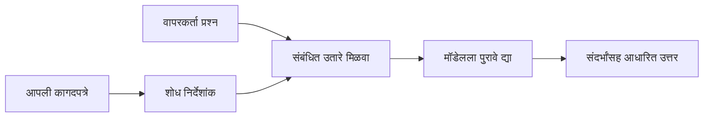

# आपल्या दस्तऐवजांवर आधारित प्रश्नांची उत्तरे देण्यासाठी AI ला शिकवा:
## मालिका 1: RAG, Azure विरुद्ध मुक्त स्रोत पर्याय, आणि जेव्हा फाइन-ट्यूनिंग समजते

> 2026 मधील मालिकातील पहिला लेख जो माझ्या 2023 च्या Azure AI Search + Azure OpenAI दस्तऐवज QA ट्युटोरियल्सचे पुनरावलोकन करतो.

सिरीज नेव्हिगेशन: [रिपॉझिटरी होम](../README.md) | पुढे: [सिरिज 2 - स्थानिक मुक्त स्रोत RAG सिस्टीम एंड टू एंड तयार करा](./series-2-open-source-rag-end-to-end.md)

## 1. प्रस्तावना - अगोदरच्या RAG ट्युटोरियलचे पुनरावलोकन

2023 मध्ये, मी Azure AI Search आणि Azure OpenAI वापरून PDF दस्तऐवजांमधून प्रश्नांची उत्तरे देण्यासाठी ChatGPT शिकवण्यावर दोन ट्युटोरियल्सवर काम केले. मी [LangChain आवृत्ती](https://techcommunity.microsoft.com/blog/educatordeveloperblog/teach-chatgpt-to-answer-questions-using-azure-ai-search--azure-openai-lang-chain/3969713) लिहिली, आणि मी [Lee Stott](https://developer.microsoft.com/en-us/advocates/lee-stott), मायक्रोसॉफ्टचे प्रिन्सिपल क्लाउड अॅडव्होकेट मॅनेजर, यांच्यासह सह-लेखन केलेल्या [Semantic Kernel आवृत्ती](https://techcommunity.microsoft.com/blog/educatordeveloperblog/teach-chatgpt-to-answer-questions-using-azure-ai-search--azure-openai-semantic-k/3985395) चे सह-लेखक आहे. त्या वेळी, "तुमच्या डेटावर ChatGPT" ची कल्पना अनेक विकसकांकरिता अजूनही नवीन वाटत होती. या ट्युटोरियल्समध्ये Azure Blob Storage, Azure AI Search, Azure OpenAI, LangChain, Semantic Kernel, आणि FAISS-शैलीच्या व्हेक्टर रिट्रीवलचा वापर करून PDF फायलींमधून प्रश्नांची उत्तरे दिली जात होती.

त्या आधीच्या लेखाने एक सोपा पण महत्त्वाचा कार्यप्रवाह सांगितला होता: दस्तऐवज अपलोड करा, त्यांना निर्देशांकित करा, संबंधित सामग्री मिळवा, आणि त्या सामग्रीवर आधारित मॉडेलनं उत्तर द्या.

2026 मध्ये, RAG इकोसिस्टम मोठ्या प्रमाणावर वाढली आहे. Azure AI Search आता आधुनिक व्हेक्टर आणि संकरित (हायब्रिड) रिट्रीवल पद्धतीना समर्थन देते, Azure OpenAI हे व्यापक Microsoft Foundry Models इकोसिस्टमचा भाग आहे, आणि नवीन v1 API सामान्य OpenAI क्लायंट वापरू शकतो ज्याला मासिक `api-version` बदलांची गरज नाही. तसेच, मुक्त स्रोत पर्याय जसे की LangGraph, LlamaIndex, Haystack, Qdrant, Milvus, Weaviate, Chroma, Ollama, आणि vLLM हे प्रत्यक्ष RAG सिस्टीमसाठी व्यावहारिक पर्याय बनले आहेत.

म्हणून मी हा विषय पुन्हा पाहू इच्छितो. प्रश्न आता फक्त "मी RAG कसा तयार करतो?" एवढाच नाही. आता अनेक मार्ग आहेत, आणि महत्त्वाचा प्रश्न आहे "माझ्या परिस्थितीसाठी कोणती आर्किटेक्चर योग्य आहे?"

परंतु मुख्य समस्या तशीच आहे.

एक AI मॉडेल आपोआप तुमचे दस्तऐवज जाणत नाही. उपयुक्त दस्तऐवज-आधारित प्रश्न-उत्तर प्रणाली तयार करण्यासाठी, तुम्हाला अजूनही विश्वसनीय रिट्रीवल, गुरुत्वाकर्षण (ग्राउंडिंग), मूल्यांकन, आणि ऑपरेशनल कार्यप्रवाहांची गरज असते.

हा लेख "PDF सोबत चॅट करा" या एंड-टू-एंड ट्युटोरियलसारखा नाही. मला या अद्ययावत मालिकेला त्या प्रश्नापासून सुरूवात करायची आहे ज्याकडे आता मी अधिक लक्ष देतो: तुम्ही कधी व्यवस्थापित Azure आर्किटेक्चर निवडाल, कधी मुक्त स्रोत RAG स्टॅक निवडाल, आणि कधी फाइन-ट्यूनिंग खरंच उपयुक्त ठरते?

हा मालिकेतील पहिला लेख आहे जो दस्तऐवज-आधारित AI सिस्टीम्स तयार करण्याबाबत आहे. या पहिल्या भागात आपण आर्किटेक्चर निर्णयांवर लक्ष केंद्रित करू: का RAG महत्त्वाचा आहे, कधी Azure-आधारित व्यवस्थापित सेवा उपयुक्त आहेत, कधी मुक्त स्रोत पर्याय समजतात, आणि फाइन-ट्यूनिंग कुठे बसते.

दस्तऐवज QA सिस्टम्स तयार केल्या आणि पुनरावलोकन केल्यावर, मला डेमोमध्ये कोणता टूल चांगला दिसतो त्यापेक्षा प्रत्यक्ष वापरकर्ते, बदलत असलेली दस्तऐवज, परवानग्या, अयशस्वी होणे, आणि देखभाल या गोष्टींसह कोणती आर्किटेक्चर टिकून राहते हे अधिक महत्त्वाचे वाटू लागले आहे.

## 2. तुमच्या AI ला सर्च सिस्टम का आवश्यक आहे

मोठी भाषा मॉडेल्स विस्तृत सार्वजनिक आणि परवानाधारक डेटा वापरून प्रशिक्षित केल्या जातात. त्यांना सामान्य विषयांची चांगली माहिती असू शकते, पण ते आपोआप तुमचे खाजगी PDF, अंतर्गत धोरणे, संघटनात्मक प्रक्रिया, संशोधन संग्रह, वर्गाच्या साहित्य, ग्राहक समर्थन नोट्स, किंवा अलीकडील अद्ययावत दस्तऐवज जाणत नाहीत.

RAG बद्दल सोपी कल्पना अशी आहे: मॉडेलने प्रत्येक दस्तऐवज लक्षात ठेवण्याची अपेक्षा करण्याऐवजी, आपण त्याला एक सर्च सिस्टीम देतो. जेव्हा वापरकर्ता प्रश्न विचारतो तेव्हा सिस्टम आधी सर्वात संबंधित माहितीचे तुकडे शोधते, नंतर त्या तुकड्यांना संदर्भ म्हणून मॉडेलला देते.

हे महत्त्वाचे आहे कारण अनेक प्रत्यक्ष ज्ञान स्रोत खाजगी असतात, सतत बदलत असतात, प्रवेश-संवेदनशील असतात, वेगवेगळ्या प्रणालींमध्ये संग्रहित केलेले असतात, अनेक स्वरूपांमध्ये लिहिलेले असतात, आणि थेट प्रॉम्प्टमध्ये टाकण्याइतके मोठे असतात.

उदाहरणार्थ, जर शाळा, कंपनी, किंवा संशोधन संघाजवळ १०,००० अंतर्गत दस्तऐवज असतील तर मॉडेल त्या दस्तऐवजांमधून विश्वसनीय उत्तर देऊ शकत नाही जोपर्यंत सिस्टम योग्य वेळी योग्य भाग रिट्रीव्ह करत नाही.

हे स्वाभाविकपणे एक सामान्य प्रश्न उभा करतो:

फक्त मॉडेलला फाइन-ट्यून का करू नाही?

फाइन-ट्यूनिंग उपयुक्त असू शकते, पण बहुधा ती दस्तऐवज ज्ञानासाठी योग्य पहिले टूल नसते. जर ज्ञान सतत बदलत असेल, जर संदर्भ महत्त्वाचे असतील, किंवा प्रवेश परवानग्या महत्त्वाच्या असतील, तर RAG हा सहसा चांगला प्रारंभिक पर्याय असतो. फाइन-ट्यूनिंग वर्तन, शैली, आउटपुट स्वरूप, आणि कार्य नमुन्यांसाठी अधिक योग्य असते.

## 3. RAG आर्किटेक्चर प्रत्यक्षात

कल्पना करा की तुम्ही शाळेसाठी AI सहाय्यक तयार करत आहात. सहाय्यकाला धोरण PDF, कोर्स गाइड्स, अंतर्गत FAQ पृष्ठे, आणि अलीकडील अद्ययावत घोषणांमधून प्रश्नांची उत्तरे द्यायची आहेत.

जर विद्यार्थी विचारतो, "मी माझ्या अंतिम प्रोजेक्टसाठी जनरेटिव्ह AI वापरू शकतो का?", तर सिस्टम मॉडेलच्या सामान्य स्मृतीतून उत्तर देऊ नये. त्याऐवजी, त्याला आधी संबंधित शाळेतील धोरण मिळवायचे आहे, AI वापराबाबत सेक्शन शोधायचे आहे, आणि नंतर त्या पुराव्यावर आधारित मॉडेलला उत्तर विचारायचे आहे.

हेच RAG प्रत्यक्षात आहे.

वरिष्ठ पातळीवर, तुम्ही प्रवाह अशाप्रकारे विचार करू शकता:

तपशील जास्त विकसित होऊ शकतात, पण मूलभूत कल्पना सोपी आहे: मॉडेल एकटे उत्तर देत नाही. ते रिट्रीव्ह केलेल्या पुराव्यासोबत उत्तर देते.

सुरुवातीला, दस्तऐवज Azure Blob Storage, SharePoint, GitHub, किंवा अंतर्गत CMS सारख्या संग्रहण प्रणालींपासून घेतले जातात. नंतर सिस्टम त्यांना मजकूरात रूपांतरित करते आणि उपयुक्त रचना जसे की शीर्षके, पृष्ठ क्रमांक, सारण्या, विभाग, आणि स्त्रोत स्थान जपते.

यानंतर, सामग्री तुकड्यांमध्ये विभागली जाते. ही पायरी सोपी वाटते, पण ती सिस्टीमच्या सर्वात महत्त्वाच्या भागांपैकी एक आहे. जर तुकडा खूप लहान असेल, तर तो आसपासचा संदर्भ हरवू शकतो. जर तुकडा खूप मोठा असेल, तर त्यात अनसंबंधित माहिती येऊ शकते आणि रिट्रीव्ह अधिक अचूक होऊ शकत नाही.

तुकड्यांनंतर, सिस्टम एम्बेडिंग तयार करते आणि ते मूळ मजकूर आणि मेटाडेटासह, जसे की फाइल नाव, पृष्ठ क्रमांक, परवानग्या, दस्तऐवज आवृत्ती, आणि स्त्रोत URL, यांसोबत शोधण्याजोग्या निर्देशांकात संग्रहित करते.

जेव्हा वापरकर्ता प्रश्न विचारतो, तेव्हा सिस्टम कीवर्ड शोध, व्हेक्टर शोध, किंवा संकरित शोध वापरून उमेदवार तुकडे रिट्रीव्ह करते. नंतर रीरेन्कर त्या तुकड्यांना पुन्हा क्रमबद्ध करू शकतो जेणेकरून सर्वात उपयुक्त पुरावा शीर्षस्थानी असतो.

शेवटी, मॉडेलला प्रश्न आणि रिट्रीव्ह झालेले पुरावे मिळतात. उत्तर त्या पुराव्यामध्ये आधारित असावे व संदर्भ परत करावा जेणेकरून वापरकर्ता स्त्रोत तपासू शकेल.

महत्त्वाचे म्हणजे, RAG फक्त "PDF फाइल्स व्हेक्टर डेटाबेसमध्ये ठेवा" इतकंच नाही. उत्तराची गुणवत्ता पूर्ण कार्यप्रवाहावर अवलंबून असते: पार्सिंग, तुकड्यांमध्ये विभागणी, रिट्रीव्ह, रीरेन्किंग, प्रॉम्प्टिंग, संदर्भ देणे, आणि मूल्यांकन.

म्हणून दस्तऐवज रचना महत्त्वाची आहे. PDF मध्ये शीर्षक, सारणी, फूटनोट, किंवा पृष्ठ सीमारेषा ही एका परिच्छेदाचा अर्थ बदलू शकतात. Azure वर, Document Layout कौशल्य Azure Document Intelligence चे लेआउट क्षमता वापरून रचना-जागरूक आउटपुट तयार करते, जे RAG सिस्टीमसाठी तुकड्यांची विभागणी आणि रिट्रीव्ह गुणवत्ता सुधारू शकते.

## 4. 2023 पासून काय बदलले?

2023 ची ट्युटोरियल त्या काळासाठी चांगली सुरुवात होती:

- Azure Blob Storage ने PDF फायली संचयित केल्या.
- Azure AI Search ने सामग्री निर्देशांकित केली.
- LangChain ने Azure OpenAI शी रिट्रीव्हल कनेक्ट केले.
- FAISS साध्या स्थानिक व्हेक्टर स्टोअरच्या प्रकारे कार्य केले.
- उदाहरण `gpt-35-turbo` आणि `text-embedding-ada-002` वापरले गेले.

2026 मध्ये, आधुनिक आवृत्तीमध्ये अनेक बदल दिसावेत.

प्रथम, रिट्रीव्हल अधिक परिपक्व झाले आहे. 2023 मध्ये, अनेक डेमो साधा व्हेक्टर सादृश्यता शोध वापरत होते. आज, संकरित रिट्रीव्हल हे गंभीर दस्तऐवज QA साठी सहसा डीफॉल्ट आहे. Azure AI Search कीवर्ड आणि व्हेक्टर क्वेरी एका विनंतीत एकत्र करून संकरित शोध समर्थित करतो आणि Reciprocal Rank Fusion वापरून निकाल विलीन करतो. Semantic ranker नंतर पूर्ण मजकूर, व्हेक्टर, आणि संकरित निकालांच्या मजकूर बाजूला रीरेन्क करू शकतो.

दुसरे, इन्गेस्टेशन अधिक विकसित झाली आहे. प्रत्येक दस्तऐवज हाताने विभाजीत करण्याऐवजी, Azure AI Search वेक्टरायझेशन एकत्रितपणे तुकड्यांमध्ये विभागणी, एम्बेडिंग, आणि क्वेरी-वेळी वेक्टरायझेशन करता येते. PDF आणि दस्तऐवज-केंद्रित वर्कलोडसाठी, Document Layout कौशल्य निश्चित आकाराच्या तुकड्यांपेक्षा जास्त संरचना जपू शकते.

तिसरे, संयोजन अधिक महत्त्वाची झाली आहे. कठीण भाग म्हणजे LLM API कॉल नाही. कठीण भाग म्हणजे अयशस्वी होणे, पुनर्प्रयत्न, जुन्या रिट्रीव्हल, तुकडा गुणवत्ता, दीर्घकालीन कार्यप्रवाह, मानव समीक्षा, आणि प्रमाणात मूल्यांकन हाताळणे. येथे LangGraph, LlamaIndex वर्कफ्लोज, Haystack पाइपलाइन्स, आणि प्लॅटफॉर्म पातळीवरील मूल्यांकन व निरीक्षण साधने अधिक संबंधित होतात, एका रेषीय चेनपेक्षा.

चौथे, मूल्यांकन पर्यायी राहिले नाही. एका प्रश्नासह डेमो प्रभावी दिसू शकतो. उत्पादन प्रणालीला चाचणी संच, रिग्रेशन तपासणी, रिट्रीव्हल मेट्रिक्स, ग्राउंडेडनेस तपासणी, आणि मॉनिटरिंग आवश्यक आहे. मूल्यांकनाशिवाय, सिस्टम सुधारत आहे की फक्त बदलत आहे हे जाणणे कठीण आहे.

## 5. Azure आणि मुक्त स्रोत RAG स्टॅक्समधील निवड

माझा असा विचार नाही की उपयुक्त प्रश्न आहे "Azure मुक्त स्रोतपेक्षा चांगले आहे का?" किंवा "मुक्त स्रोत Azure पेक्षा चांगले आहे का?"

उपयुक्त प्रश्न आहे: तुम्ही कोणत्या प्रकारचा सिस्टम तयार करत आहात, कोण ते चालवेल, कोणती मर्यादा आहेत, आणि कोणते अपयश प्रकार अस्वीकार्य आहेत?

जेव्हा मी दस्तऐवज QA उदाहरणे तयार करू लागलो, तेव्हां मला मुख्यतः रिट्रीव्हल कार्यान्वित होते का याचा विचार होता. मी PDF अपलोड करू शकतो का, त्यांना शोधू शकतो का आणि उत्तर तयार करू शकतो का? हे एक समजण्यासारखे प्रारंभ बिंदू होते.

अधिक वास्तविक AI कार्यप्रवाहांवर काम केल्यावर, माझे मूल्यांकन बदलले. आता मी RAG स्टॅक निवडण्यापूर्वी चार बाबी पाहतो:

- ओळख आणि परवानग्या
- रिट्रीव्हल गुणवत्ता
- कार्यप्रवाह विश्वासार्हता
- ऑपरेशनल मालकी

ह्या चार क्षेत्रांनी मॉडेल बेंचमार्कपेक्षा खूप अधिक माहिती दिली.

Azure-आधारित आर्किटेक्चर सहसा तेव्हा उपयुक्त ठरतात जेव्हा एंटरप्राइझ इंटिग्रेशन कठीण भाग असतो. जर संघ आधीपासून Microsoft Entra ID, Microsoft 365, Azure Storage, खाजगी नेटवर्किंग, RBAC, आणि Azure मॉनिटरिंगवर अवलंबून असेल, तर Azure AI Search आणि Azure OpenAI ऑपरेशनल गुंतागुंत कमी करू शकतात. अशा वातावरणात, Azure फक्त मॉडेल API नाही. त्याची किंमत आजूबाजूच्या सिस्टममध्ये आहे: ओळख, शासन, व्यवस्थापित शोध, सुरक्षा एकत्रीकरण, समर्थन, आणि परिचित ऑपरेशन्स.

मुक्त स्रोत आर्किटेक्चर सहसा तेव्हा उपयुक्त असतात जेव्हा लवचिकता हा कठीण भाग असतो. जर संघास स्थानिक इनफरन्स, क्लाउड पोर्टेबिलिटी, सानुकूल रिट्रीव्हल पाइपलाइन, विशेष रीरेन्किंग, किंवा व्हेक्टर डेटाबेस व मॉडेल-सेवा स्तरावर थेट नियंत्रण आवश्यक असेल, तर मुक्त स्रोत स्टॅक चांगला पर्याय ठरू शकतो. त्याचा अर्थ असा की संघाला अधिक विश्वासार्हतेचा काम स्वतः करावं लागेल: बॅकअप, स्केलिंग, विलंब, स्थलांतरण, मॉनिटरिंग, आणि सुरक्षा.

प्रत्यक्षात, अनेक उत्पादन AI सिस्टम पूर्णपणे क्लाउड-नेटिव्ह किंवा पूर्णपणे मुक्त स्रोत नसतात. ते सामान्यतः ऑपरेशनल सोपेपणा, पोर्टेबिलिटी, शासन, आणि अभियांत्रिकी लवचिकता यांच्यात समतोल राखणारे हायब्रिड सिस्टम्स असतात.

उदाहरणार्थ, मला आश्चर्य वाटणार नाही जर एखादा सिस्टम Azure OpenAI मॉडेल प्रवेशासाठी, LangGraph वर्कफ्लो संयोजनासाठी, Azure होस्टिंग तैनात करण्यासाठी, आणि विशिष्ट रिट्रीव्हल गरजांसाठी मुक्त स्रोत व्हेक्टर डेटाबेस वापरत असेल. हे आर्किटेक्चरल विसंगती नाही. प्रत्येक भागासाठी योग्य व्यवस्थापित सेवा आणि अभियांत्रिकी नियंत्रण निवडणे आहे.

मी हायब्रिड आर्किटेक्चर आवडतो जेव्हा व्यवस्थापित प्लॅटफॉर्म महत्त्वाची एंटरप्राइझ समस्या सोडवतो, तर मुक्त स्रोत घटक संघाला जिथे खरोखर महत्वाची लवचिकता हवी तिथे देतात.

## 6. व्यावहारिक निर्णय मार्गदर्शक

संघासोबत RAG स्टॅक निवडण्यापूर्वी मी वापरू शकणारी निर्णय तक्ता येथे आहे:

| निर्णय क्षेत्र | Azure व्यवस्थापित स्टॅक जास्त मजबूत जेव्हा... | मुक्त स्रोत स्टॅक जास्त मजबूत जेव्हा... |
| --- | --- | --- |
| ओळख आणि प्रवेश | Entra ID, RBAC, व्यवस्थापित ओळख, आणि एंटरप्राइझ परवानग्या केंद्रस्थानी असतील | सानुकूल ऑथ, गैर-मायक्रोसॉफ्ट ओळख, किंवा अ‍ॅप-विशिष्ट प्रवेश लॉजिक प्रबल असेल |
| ऑपरेशन्स | संघाला व्यवस्थापित पायाभूत सुविधा, समर्थन, SLA, आणि सोपी ऑनबोर्डिंग हवी असेल | संघ व्हेक्टर डेटाबेस, मॉडेल सेवा, बॅकअप, आणि स्केलिंग चालवू शकतो |
| रिट्रीव्हल | संकरित शोध, सेमांटिक रँकिंग, फिल्टर्स, आणि मेटाडेटा शोध बहुतेक गरजा पूर्ण करतात | संघाला सानुकूल रिट्रीव्हल, विशेष रीरेन्किंग, किंवा प्रयोगात्मक निर्देशांक आवश्यक आहे |
| पोर्टेबिलिटी | Azure इकोसिस्टमशी संरेखित होणे मान्य किंवा प्राधान्य प्राप्त आहे | क्लाउड लॉक-इन टाळणे कठीण गरज आहे |
| इनफरन्स | Azure OpenAI शासन, नेटवर्किंग, आणि एंटरप्राइझ नियंत्रण महत्त्वाचे | स्थानिक इनफरन्स, सानुकूल मॉडेल्स, किंवा स्वयं-होस्टेड सेवा आवश्यक आहे |
| खर्च | अभियांत्रिकी आणि ऑपरेशन्सचा प्रयत्न कमी करणे पायाभूत सुविधा ट्यूनिंगपेक्षा महत्त्वाचे आहे | प्रमाण इतके मोठे आहे की काळजीपूर्वक पायाभूत सुविधा ऑप्टिमायझेशन करणे आवश्यक आहे |
| प्रयोग | स्थिरता आणि एंटरप्राइझ एकत्रीकरण नियमिततः घटक बदलण्यापेक्षा महत्त्वाचे आहेत | संघ एजंट्स, साधने, मेमरी, आणि रिट्रीव्हल कार्यप्रवाहांवर जलद सुधारणा करीत आहे |

माझा सोपा नियम असा आहे:

- एंटरप्राइझ एकत्रीकरण, सुरक्षा, आणि ऑपरेशनल सोपेपणा हे मुख्य धोके असतील तेव्हा Azure पासून सुरुवात करा.
- पोर्टेबिलिटी, सानुकूलता, किंवा स्थानिक नियंत्रण हे मुख्य धोके असतील तेव्हा मुक्त स्रोत पासून सुरुवात करा.
- दोन्ही खरे असतील तेव्हा हायब्रिड स्टॅक वापरा.

म्हणूनच मी 2026 RAG मालिकेची सुरुवात प्रथम कोडने करत नाही. कोड महत्त्वाचा आहे, पण आर्किटेक्चर निवडणे अंमलबजावणीपूर्वी होते. एक सोपा डेमो सर्वात कठीण निवडी लपवू शकतो. चांगली RAG प्रणाली त्या निवडी स्पष्ट करते.

## 7. फाइन-ट्यूनिंग कुठे बसते

फाइन-ट्यूनिंग बहुधा RAG सोबत वापरले जाते, पण मला दोन्ही वेगवेगळे ठेवणे महत्त्वाचे वाटते.

RAG सामान्यतः चांगला पर्याय असतो जेव्हा सिस्टमला नवीन, खासगी, परवानगी-सेन्सिटिव्ह, किंवा स्रोत-आधारित ज्ञान आवश्यक असते. जर उत्तराने दस्तऐवजांची माहिती द्यावी, अलीकडील अपडेट्स प्रतिबिंबित करायचे असतील, किंवा वापरकर्ता-विशिष्ट प्रवेश नियमांचे पालन करायचे असेल, तर रिट्रीव्हल आर्किटेक्चरचा भाग असला पाहिजे.
फाइन-ट्युनिंग अधिक उपयुक्त असते जेव्हा ज्ञान मुख्य समस्या नसते. हे मदत करू शकते जेव्हा तुम्हाला मॉडेलला विशिष्ट आउटपुट फॉरमॅटचे पालन करायचे असते, डोमेन-विशिष्ट प्रतिसाद शैलीशी जुळवायचे असते, एखादे स्थिर कार्य अधिक सातत्याने पार पाडायचे असते, किंवा प्रत्येक प्रॉम्प्टमध्ये आवश्यक असलेली सूचना कमी करायची असते.

व्यवहारामध्ये, दोन्ही एकत्र कार्य करू शकतात. एक सपोर्ट सहाय्यक नवीनतम धोरण पुनर्प्राप्त करण्यासाठी RAG वापरू शकतो, तर एक फाइन-ट्युन केलेले मॉडेल कंपनीच्या प्राधान्य दिलेल्या उत्तर संरचनेची आणि टोनची माहिती शिकते.

चूक ही आहे की फाइन-ट्युनिंगला दस्तऐवज संचासाठी पर्याय मानले जाते. जेव्हा प्रणालीला ताजा, खाजगी किंवा परवानगी-संवेदनशील डेटावरून उत्तरे द्यावी लागतात, तेव्हा पुनर्प्राप्तीची गरज कमी होत नाही.

## 8. या सिरीजचा पुढील भाग कुठे आहे

हा लेख निर्णय-घेण्याचा स्तर आहे. कोड लिहिण्यापुर्वी, मला ट्रेडऑफ स्पष्ट करायचे होते: RAG विरुद्ध फाइन-ट्युनिंग, Azure विरुद्ध ओपन सोर्स, व्यवस्थापित सेवा विरुद्ध ऑपरेशनल नियंत्रण.

अमलबजावणीत जाण्यापूर्वी, मला येथे एक मुद्दा ठेवायचा आहे: अनेक एंटरप्राइज AI प्रणालींमध्ये, मॉडेल हे फक्त एक घटक असते. पुनर्प्राप्तीची गुणवत्ता, समन्वय, मूल्यांकन, परवानग्या आणि ऑपरेशनल विश्वासार्हता यांवर प्रणालीच्या डेमो पातळीपलीकडे यशस्वी होण्याचा ठराव होतो.

या सिरीजच्या पुढील भागांमध्ये, मी दस्तऐवज-आधारित AI प्रणालींच्या व्यावहारिक बाजूवर सखोल जाण्याचा विचार करतो: प्रथम स्थानिक ओपन-सोर्स RAG कार्यप्रवाह तयार करणे, नंतर Azure AI Search आणि Azure OpenAI सह त्या सारख्या परिस्थितीचे पुनर्निर्माण करणे, आणि नंतर प्रणाली खरंच काम करते का हे मूल्यांकन करणे.

सिरीज विकसित होत असताना मी क्रम थोड्या प्रमाणात बदलू शकतो, पण उद्दिष्ट तेच राहिल: एक साधा डेमो पलीकडे जाऊन असलेल्या RAG प्रणाली कशा ठेवायच्या, मूल्यांकन करायच्या, आणि ऑपरेट करायच्या याबद्दल दाखवणे.

## 9. संदर्भ आणि संसाधने

मूळ ट्युटोरियल्स:

- [Teach ChatGPT to Answer Questions: Using Azure AI Search & Azure OpenAI (Lang Chain)](https://techcommunity.microsoft.com/blog/educatordeveloperblog/teach-chatgpt-to-answer-questions-using-azure-ai-search--azure-openai-lang-chain/3969713)
- [Teach ChatGPT to Answer Questions: Using Azure AI Search & Azure OpenAI (Semantic Kernel)](https://techcommunity.microsoft.com/blog/educatordeveloperblog/teach-chatgpt-to-answer-questions-using-azure-ai-search--azure-openai-semantic-k/3985395)

Azure:

- [Azure AI Search REST API versions](https://learn.microsoft.com/en-us/rest/api/searchservice/search-service-api-versions)
- [Hybrid search in Azure AI Search](https://learn.microsoft.com/en-us/azure/search/hybrid-search-how-to-query)
- [Integrated vectorization in Azure AI Search](https://learn.microsoft.com/en-us/azure/search/vector-search-integrated-vectorization)
- [Document Layout skill in Azure AI Search](https://learn.microsoft.com/en-us/azure/search/cognitive-search-skill-document-intelligence-layout)
- [Chunk and vectorize by document layout](https://learn.microsoft.com/en-us/azure/search/search-how-to-semantic-chunking)
- [Semantic ranking in Azure AI Search](https://learn.microsoft.com/en-us/azure/search/semantic-search-overview)
- [Azure OpenAI / Microsoft Foundry API version lifecycle](https://learn.microsoft.com/en-us/azure/foundry/openai/api-version-lifecycle)
- [Foundry Models sold by Azure](https://learn.microsoft.com/en-us/azure/foundry/foundry-models/concepts/models-sold-directly-by-azure)
- [Microsoft Foundry fine-tuning considerations](https://learn.microsoft.com/en-us/azure/foundry/openai/concepts/fine-tuning-considerations)
- [Microsoft Foundry observability](https://learn.microsoft.com/en-us/azure/foundry/concepts/observability)
- [Run evaluations in Microsoft Foundry](https://learn.microsoft.com/en-us/azure/foundry/how-to/evaluate-generative-ai-app)

ओपन-सोर्स:

- [LangGraph documentation](https://docs.langchain.com/oss/python/langgraph/overview)
- [LlamaIndex documentation](https://developers.llamaindex.ai/python/framework/)
- [Haystack documentation](https://docs.haystack.deepset.ai/)
- [Qdrant documentation](https://qdrant.tech/documentation/overview/)
- [Milvus documentation](https://milvus.io/docs/overview.md)
- [Weaviate documentation](https://docs.weaviate.io/weaviate/current/)
- [Chroma documentation](https://docs.trychroma.com/docs/overview/introduction)
- [Ollama embeddings](https://docs.ollama.com/capabilities/embeddings)
- [vLLM OpenAI-compatible server](https://docs.vllm.ai/en/latest/serving/openai_compatible_server.html)
- [BGE embedding models](https://huggingface.co/BAAI/bge-large-en-v1.5)
- [E5 embedding models](https://huggingface.co/intfloat/e5-large-v2)
- [Instructor embedding models](https://huggingface.co/hkunlp/instructor-large)

पुढे: [Series 2 - Build a Local Open-Source RAG System End to End](./series-2-open-source-rag-end-to-end.md)

---

<!-- CO-OP TRANSLATOR DISCLAIMER START -->
**अस्वीकरण**:
हा दस्तऐवज AI भाषांतर सेवा [Co-op Translator](https://github.com/Azure/co-op-translator) चा वापर करून अनुवादित केला आहे. जरी आम्ही अचूकतेसाठी प्रयत्न करतो, तरी कृपया लक्षात घ्या की स्वयंचलित भाषांतरांमध्ये त्रुटी किंवा अचूकतेची कमतरता असू शकते. मूळ दस्तऐवज त्याच्या मूळ भाषेत अधिकृत स्रोत मानला पाहिजे. महत्त्वाची माहिती असल्यास, व्यावसायिक मानवी भाषांतराची शिफारस केली जाते. या भाषांतराच्या वापरामुळे उद्भवणाऱ्या कोणत्याही गैरसमज किंवा चुकीच्या अर्थलावणीसाठी आम्ही जबाबदार नाही.
<!-- CO-OP TRANSLATOR DISCLAIMER END -->